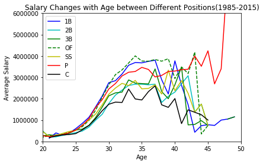
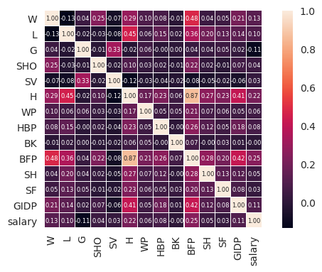

Visualization for Peers
===========
# Jonishuxi (if I recall correctly)
* Joshua Allen
* Shuihui Tang
* Xingxing Zhang
* Nihali Jain
### Data Vis IS590

The data set is named Lahman’s Baseball Database and it can be find in seanlahman.com. The URL is http://seanlahman.com/baseball-archive/statistics/

The database has 28 csv files and most of them have more than 5000 records and the biggest one has more than a hundred thousand rocords.

### Limited Use License
This database is copyright 1996-2018 by Sean Lahman.

This work is licensed under a Creative Commons Attribution-ShareAlike 3.0 Unported License.  For details see: http://creativecommons.org/licenses/by-sa/3.0/


```python
%matplotlib inline
import traitlets
import pandas as pd
import bqplot
import numpy as np
import matplotlib.pyplot as plt
from scipy.stats import gaussian_kde
import scipy.stats as stats
from scipy.stats.stats import pearsonr
import glob
import os
import seaborn as sns
from __future__ import print_function
from ipywidgets import interact, interactive, fixed, interact_manual
import ipywidgets
import collections
from plotly.offline import init_notebook_mode, iplot
```

## Salary by position across the years
This plot shows the range of salaries at each position at different year. We can use the slider to choose which year you want to looking at. Also, when you move to each bar, it can show the exact salary. We are curious about which position can make the most money in a baseball game. So we combined "salary" and "fielding" these two datasets together in one dataframe called "player_position." Because we already explored these two datasets and found out that they both have "playerID" and "yearID," then we merged them and created a new dataset with only four colums.

Initially, we showed the data as a line graph for each position across the years. This plot shows all the positions as a bar graph for a given year. Sliding through the years gives a more visual contrast to how the pay rates have changed.


```python
salary = pd.read_csv("/home/jallen17/baseball_data/Salaries.csv")
fielding = pd.read_csv("/home/jallen17/baseball_data/Fielding.csv")

player_position = pd.merge(salary, fielding, on = ["playerID","yearID"])[["yearID", "playerID", "salary", "POS"]]

data = player_position.groupby(["yearID", "POS"]).mean()["salary"].unstack()

import bokeh
from bokeh.io import show, output_file, output_notebook
from bokeh.plotting import figure
from bokeh.palettes import Viridis
from bokeh.models import ColumnDataSource, HoverTool,NumeralTickFormatter
from bokeh.embed import components
from bokeh.layouts import widgetbox
from bokeh.models.widgets import Slider

output_notebook()
hover = HoverTool(tooltips=[
   ("Position","@pos"),
   ("Salary","@salary{($ 0,0)}")
])
def fi(year=2015):
    x = player_position[player_position["yearID"]==year]
    data = x.groupby("POS").max()["salary"].reset_index()
    pos=[]
    for i in data["POS"]:
        pos.append(i)
    sal=[]
    for i in data["salary"]:
        sal.append(i)
    source=ColumnDataSource(data=dict(pos=pos,salary=sal,color=Viridis[7]))
    p=figure(x_range=pos,title="Salaries in different positions",tools=[hover], y_range=(0, 35000000), plot_height=300)
    p.vbar(x="pos", top="salary", width = 0.9, color="color",source=source,legend="pos")
    p.legend.orientation = "horizontal"
    p.xaxis.axis_label = "Position"
    p.yaxis[0].formatter = NumeralTickFormatter(format="$0,0")
    p.yaxis.axis_label = "Salary"
    show(p)
interact(fi,year=(1985,2015,5));

```


    <div class="bk-root">
        <a href="https://bokeh.pydata.org" target="_blank" class="bk-logo bk-logo-small bk-logo-notebook"></a>
        <span id="c138def9-6ef0-4192-84f3-ba4046fc3644">Loading BokehJS ...</span>
    </div>


<p>Failed to display Jupyter Widget of type <code>interactive</code>.</p>
<p>
  If you're reading this message in the Jupyter Notebook or JupyterLab Notebook, it may mean
  that the widgets JavaScript is still loading. If this message persists, it
  likely means that the widgets JavaScript library is either not installed or
  not enabled. See the <a href="https://ipywidgets.readthedocs.io/en/stable/user_install.html">Jupyter
  Widgets Documentation</a> for setup instructions.
</p>
<p>
  If you're reading this message in another frontend (for example, a static
  rendering on GitHub or <a href="https://nbviewer.jupyter.org/">NBViewer</a>),
  it may mean that your frontend doesn't currently support widgets.
</p>


## Salaries by age for different positions

This graph demonstrates how salaries change by age at each position, cumulating data from 1985 until 2015. Ages 30-40 years old are players golden ages at every position. That makes sense, given that those tend to be the ages when players enter free agency, even though the data also shows that player performance tends to decline after age 30. Most players' salaries  drop after 40 years old, which is the age many players retire. The pitcher spike in the late 40s is mainly due to a single outlier: Jamie Moyer, who finally retired at age 50 (!!) was an effective starting pitcher well into his 40s, when he helped the Phillies to several post-season appearances and a World Series title.

For this plot, we merged three tables: People, Fielding and Salary using the playerID field to link them. To clean this dataset, we only choose time period when they playing during 1985 to 2015.


```python
player = pd.read_csv("/home/jallen17/baseball_data/People.csv")
player_position = pd.merge(salary, fielding, on = ["playerID","yearID"])[["yearID", "playerID", "salary", "POS"]]
player_position = pd.merge(player_position, player, on = ["playerID"], how = "left")[["yearID", "playerID","salary", "POS", "birthYear"]]
player_position["age"] = player_position["yearID"] - player_position["birthYear"] 
player_position = player_position[player_position.yearID >= 1985]
data = player_position.groupby(["age", "POS"]).mean()["salary"].unstack()
plt.plot(data["1B"], 'b-', data["2B"], 'c-', data["3B"], 'g-', data["OF"], 'g--', data["SS"], 'y-', data['P'],'r-', data['C'],'k-')
_ = plt.ylabel("Average Salary")
_ = plt.xlabel("Age")
_ = plt.legend(["1B",'2B','3B','OF','SS',"P","C"],loc = 'upper left')
_ = plt.title("Salary Changes with Age between Different Positions(1985-2015)")
_ = plt.xlim([20,50])
_ = plt.ylim([0,6000000])
```





## Salaries by age over the years

Here we show a graphic that reflects how players at different positions have been paid over the years. You can see similar trends over the years to what is shown above, where players tend to be paid more in what is considered their primer production years.


```python
init_notebook_mode(connected=True)

salaries=pd.read_csv("/home/jallen17/baseball_data/Salaries.csv")
fielding=pd.read_csv("/home/jallen17/baseball_data/Fielding.csv")
player = pd.read_csv("/home/jallen17/baseball_data/People.csv")
player_position = pd.merge(salaries, fielding, on = ["playerID","yearID"])[["yearID", "playerID", "salary", "POS"]]
player_position = pd.merge(player_position, player, on = ["playerID"], how = "left")[["yearID", "playerID","salary", "POS", "birthYear"]]
player_position["age"] = player_position["yearID"] - player_position["birthYear"] 
player_position = player_position[player_position.yearID >= 1985]
years_from_col = set(player_position['yearID'])
years_ints = sorted(list(years_from_col))
years = [str(year) for year in years_ints]


# make list of positions

positions = []
for position in player_position['POS']:
    if position not in positions: 
        positions.append(position)

# make figure
figure = {
    'data': [],
    'layout': {},
    'frames': []
}

# fill in most of layout
figure['layout']['xaxis'] = {'range': [20,50], 'title': 'Age'}
figure['layout']['yaxis'] = {'title': 'Salary', 'type': 'log'}
figure['layout']['hovermode'] = 'closest'
figure['layout']['sliders'] = {
    'args': [
        'transition', {
            'duration': 400,
            'easing': 'cubic-in-out'
        }
    ],
    'initialValue': '1952',
    'plotlycommand': 'animate',
    'values': years,
    'visible': True
}
figure['layout']['updatemenus'] = [
    {
        'buttons': [
            {
                'args': [None, {'frame': {'duration': 500, 'redraw': False},
                         'fromcurrent': True, 'transition': {'duration': 300, 'easing': 'quadratic-in-out'}}],
                'label': 'Play',
                'method': 'animate'
            },
            {
                'args': [[None], {'frame': {'duration': 0, 'redraw': False}, 'mode': 'immediate',
                'transition': {'duration': 0}}],
                'label': 'Pause',
                'method': 'animate'
            }
        ],
        'direction': 'left',
        'pad': {'r': 10, 't': 87},
        'showactive': False,
        'type': 'buttons',
        'x': 0.1,
        'xanchor': 'right',
        'y': 0,
        'yanchor': 'top'
    }
]

sliders_dict = {
    'active': 0,
    'yanchor': 'top',
    'xanchor': 'left',
    'currentvalue': {
        'font': {'size': 20},
        'prefix': 'Year:',
        'visible': True,
        'xanchor': 'right'
    },
    'transition': {'duration': 300, 'easing': 'cubic-in-out'},
    'pad': {'b': 10, 't': 50},
    'len': 0.9,
    'x': 0.1,
    'y': 0,
    'steps': []
}

# make data
year = 1985
for position in positions:
    dataset_by_year = player_position[player_position['yearID'] == year]
    dataset_by_year_and_cont = dataset_by_year[dataset_by_year['POS'] == position]

    data_dict = {
        'x': list(dataset_by_year_and_cont['age']),
        'y': list(dataset_by_year_and_cont['salary']),
        'mode': 'markers',
        'text': list(dataset_by_year_and_cont['POS']),
        'marker': {
            'sizemode': 'area',
            'sizeref': 200000,
            
        },
        'name': position
    }
    figure['data'].append(data_dict)
    
# make frames
for year in years:
    frame = {'data': [], 'name': str(year)}
    for position in positions:
        dataset_by_year = player_position[player_position['yearID'] == int(year)]
        dataset_by_year_and_cont = dataset_by_year[dataset_by_year['POS'] == position]

        data_dict = {
            'x': list(dataset_by_year_and_cont['age']),
            'y': list(dataset_by_year_and_cont['salary']),
            'mode': 'markers',
            'text': list(dataset_by_year_and_cont['POS']),
            'marker': {
                'sizemode': 'area',
                'sizeref': 200000,
                
            },
            'name': position
        }
        frame['data'].append(data_dict)

    figure['frames'].append(frame)
    slider_step = {'args': [
        [year],
        {'frame': {'duration': 300, 'redraw': False},
         'mode': 'immediate',
       'transition': {'duration': 300}}
     ],
     'label': year,
     'method': 'animate'}
    sliders_dict['steps'].append(slider_step)

    
figure['layout']['sliders'] = [sliders_dict]

iplot(figure)
```


<script>requirejs.config({paths: { 'plotly': ['https://cdn.plot.ly/plotly-latest.min']},});if(!window.Plotly) {{require(['plotly'],function(plotly) {window.Plotly=plotly;});}}</script>


<div id="66104db2-4509-43d7-ad4a-624506e30119" style="height: 525px; width: 100%;" class="plotly-graph-div"></div><script type="text/javascript">require(["plotly"], function(Plotly) { window.PLOTLYENV=window.PLOTLYENV || {};window.PLOTLYENV.BASE_URL="https://plot.ly";
        Plotly.plot(
            '66104db2-4509-43d7-ad4a-624506e30119',
            [{"x": [30.0, 28.0, 32.0, 25.0, 33.0, 38.0, 32.0, 26.0, 28.0, 32.0, 28.0, 24.0, 34.0, 31.0, 35.0, 31.0, 31.0, 26.0, 26.0, 29.0, 23.0, 27.0, 27.0, 35.0, 26.0, 28.0, 31.0, 32.0, 32.0, 29.0, 33.0, 33.0, 33.0, 33.0, 24.0, 31.0, 25.0, 32.0, 35.0, 40.0, 40.0, 25.0, 40.0, 27.0, 30.0, 26.0, 26.0, 27.0, 29.0, 29.0, 25.0, 41.0, 34.0, 33.0, 31.0, 28.0, 31.0, 34.0, 29.0, 28.0, 30.0, 29.0, 28.0, 25.0, 25.0, 32.0, 29.0, 28.0, 30.0, 29.0, 29.0, 28.0, 23.0, 34.0, 34.0, 30.0, 32.0, 25.0, 34.0, 27.0, 31.0, 31.0, 26.0, 37.0, 30.0, 27.0, 27.0, 27.0, 35.0, 27.0, 29.0, 31.0, 41.0, 41.0, 38.0, 30.0, 30.0, 30.0, 28.0, 23.0, 23.0, 26.0, 33.0, 29.0, 34.0, 32.0, 21.0, 27.0, 27.0, 31.0, 26.0, 26.0, 36.0, 25.0, 29.0, 28.0, 30.0, 27.0, 31.0, 30.0, 25.0, 35.0, 30.0, 39.0, 29.0, 28.0, 33.0, 33.0, 33.0, 23.0, 26.0, 31.0, 28.0, 30.0, 31.0, 31.0, 30.0, 27.0, 27.0, 35.0, 35.0, 46.0, 27.0, 31.0, 30.0, 31.0, 25.0, 21.0, 28.0, 29.0, 25.0, 28.0, 28.0, 26.0, 25.0, 27.0, 30.0, 42.0, 42.0, 33.0, 31.0, 31.0, 32.0, 41.0, 33.0, 24.0, 26.0, 43.0, 30.0, 28.0, 25.0, 25.0, 34.0, 31.0, 36.0, 32.0, 28.0, 29.0, 29.0, 38.0, 38.0, 25.0, 29.0, 34.0, 25.0, 30.0, 31.0, 28.0, 29.0, 32.0, 29.0, 31.0, 25.0, 26.0, 22.0, 27.0, 27.0, 36.0, 25.0, 24.0, 26.0, 27.0, 33.0, 28.0, 28.0, 34.0, 27.0, 27.0, 33.0, 37.0, 26.0, 26.0, 35.0, 26.0, 26.0, 29.0, 31.0, 35.0, 37.0, 29.0, 29.0, 28.0, 28.0, 28.0, 32.0, 32.0, 27.0, 35.0, 29.0, 30.0, 28.0, 24.0, 36.0, 28.0], "y": [870000, 550000, 633333, 150000, 483333, 772000, 407500, 275000, 450000, 1354167, 625000, 437500, 641667, 560000, 440000, 547143, 581250, 115000, 177500, 580000, 140000, 160000, 300000, 370000, 165000, 240000, 1075000, 612500, 612500, 60000, 360000, 625000, 625000, 625000, 60000, 407500, 146500, 340000, 437500, 750000, 750000, 683333, 550000, 147500, 811250, 727500, 900000, 265000, 463000, 463000, 110000, 1136262, 390000, 375000, 750000, 200000, 483333, 766667, 500000, 670000, 320000, 1260000, 640000, 60000, 75000, 833333, 110000, 350000, 255000, 410000, 1071429, 250000, 60000, 650000, 650000, 115000, 265000, 225000, 295000, 125000, 240000, 660000, 380000, 575000, 885000, 875000, 100000, 177500, 550000, 295000, 255000, 850000, 825000, 825000, 1350000, 360000, 500000, 358000, 465000, 115000, 95000, 100000, 535000, 225000, 871429, 975000, 150000, 120000, 212000, 705000, 370000, 350000, 980000, 1200000, 643750, 320000, 650000, 120000, 150000, 335000, 375000, 581250, 565000, 1065000, 679167, 60000, 480000, 540000, 460000, 60000, 700000, 513500, 375000, 850000, 95000, 375000, 290000, 250000, 120000, 900000, 637500, 600000, 680000, 637500, 800000, 325000, 230000, 450000, 150000, 330000, 60000, 650000, 275000, 107333, 60000, 141500, 262500, 600000, 600000, 608333, 520000, 207500, 250500, 1075000, 1109333, 140000, 192500, 600000, 700000, 220000, 155000, 150000, 129166, 796667, 200000, 645000, 520000, 350000, 350000, 830000, 830000, 130000, 240000, 1713333, 200000, 975000, 340000, 270000, 537500, 556250, 130000, 470000, 160000, 228000, 97000, 315000, 159000, 250000, 195000, 85000, 170000, 355000, 630000, 355000, 355000, 865000, 750000, 750000, 1030000, 457500, 110000, 150000, 583333, 110000, 100000, 250000, 457500, 565000, 636667, 235000, 310000, 344000, 505000, 505000, 590000, 590000, 170000, 875000, 833333, 580000, 60000, 131250, 475000, 1000000], "mode": "markers", "text": ["P", "P", "P", "P", "P", "P", "P", "P", "P", "P", "P", "P", "P", "P", "P", "P", "P", "P", "P", "P", "P", "P", "P", "P", "P", "P", "P", "P", "P", "P", "P", "P", "P", "P", "P", "P", "P", "P", "P", "P", "P", "P", "P", "P", "P", "P", "P", "P", "P", "P", "P", "P", "P", "P", "P", "P", "P", "P", "P", "P", "P", "P", "P", "P", "P", "P", "P", "P", "P", "P", "P", "P", "P", "P", "P", "P", "P", "P", "P", "P", "P", "P", "P", "P", "P", "P", "P", "P", "P", "P", "P", "P", "P", "P", "P", "P", "P", "P", "P", "P", "P", "P", "P", "P", "P", "P", "P", "P", "P", "P", "P", "P", "P", "P", "P", "P", "P", "P", "P", "P", "P", "P", "P", "P", "P", "P", "P", "P", "P", "P", "P", "P", "P", "P", "P", "P", "P", "P", "P", "P", "P", "P", "P", "P", "P", "P", "P", "P", "P", "P", "P", "P", "P", "P", "P", "P", "P", "P", "P", "P", "P", "P", "P", "P", "P", "P", "P", "P", "P", "P", "P", "P", "P", "P", "P", "P", "P", "P", "P", "P", "P", "P", "P", "P", "P", "P", "P", "P", "P", "P", "P", "P", "P", "P", "P", "P", "P", "P", "P", "P", "P", "P", "P", "P", "P", "P", "P", "P", "P", "P", "P", "P", "P", "P", "P", "P", "P", "P", "P", "P", "P", "P", "P", "P", "P", "P", "P", "P", "P", "P", "P", "P", "P", "P"], "marker": {"sizemode": "area", "sizeref": 200000}, "name": "P"}, {"x": [30.0, 31.0, 36.0, 34.0, 28.0, 26.0, 38.0, 38.0, 33.0, 29.0, 31.0, 28.0, 29.0, 32.0, 28.0, 29.0, 34.0, 31.0, 34.0, 36.0, 27.0, 37.0, 29.0, 27.0, 24.0, 32.0, 27.0, 36.0, 30.0, 30.0, 32.0, 29.0, 31.0, 30.0, 32.0, 32.0, 30.0, 29.0, 28.0, 29.0, 29.0, 31.0, 28.0, 26.0, 33.0, 27.0, 37.0, 33.0], "y": [545000, 625000, 512500, 341667, 128500, 477500, 883000, 685000, 200000, 550000, 865000, 60000, 225000, 250000, 76000, 766667, 416667, 160000, 608333, 425000, 435000, 500000, 215000, 145000, 60000, 365000, 100000, 1000000, 105000, 105000, 425000, 550000, 2028571, 425000, 620000, 620000, 60000, 350000, 1075000, 870000, 183000, 385000, 462500, 135000, 740000, 215000, 356300, 370000], "mode": "markers", "text": ["C", "C", "C", "C", "C", "C", "C", "C", "C", "C", "C", "C", "C", "C", "C", "C", "C", "C", "C", "C", "C", "C", "C", "C", "C", "C", "C", "C", "C", "C", "C", "C", "C", "C", "C", "C", "C", "C", "C", "C", "C", "C", "C", "C", "C", "C", "C", "C"], "marker": {"sizemode": "area", "sizeref": 200000}, "name": "C"}, {"x": [37.0, 28.0, 25.0, 33.0, 33.0, 29.0, 26.0, 36.0, 28.0, 31.0, 35.0, 40.0, 36.0, 27.0, 39.0, 39.0, 29.0, 26.0, 28.0, 38.0, 31.0, 43.0, 44.0, 25.0, 30.0, 36.0, 27.0, 32.0, 38.0, 36.0, 36.0, 24.0, 31.0, 31.0, 28.0, 36.0, 36.0, 28.0, 29.0, 25.0, 39.0, 27.0, 27.0, 30.0, 25.0, 27.0, 33.0, 36.0, 27.0, 36.0, 30.0, 26.0, 29.0, 30.0, 35.0, 32.0, 24.0, 31.0, 28.0, 32.0, 33.0, 36.0, 35.0, 37.0, 32.0, 32.0, 33.0, 30.0, 36.0, 33.0, 34.0, 30.0, 28.0, 31.0, 38.0, 37.0, 29.0, 25.0, 32.0, 25.0, 31.0, 31.0, 34.0, 34.0, 25.0, 30.0, 30.0, 34.0, 34.0, 30.0, 26.0, 37.0, 25.0, 34.0, 38.0, 36.0, 27.0, 38.0, 31.0, 31.0, 28.0], "y": [800000, 1500000, 120000, 480000, 483333, 1472819, 60000, 747500, 125000, 325000, 365000, 875000, 700000, 130000, 333333, 333333, 325000, 195000, 800000, 310000, 865000, 225000, 358858, 110000, 190000, 458333, 285000, 262500, 1083333, 291667, 291667, 60000, 160000, 341667, 205000, 316667, 425000, 150000, 1270000, 333000, 750000, 120000, 415000, 293750, 560000, 145000, 728571, 1176190, 100000, 1000000, 1000000, 250000, 375000, 105000, 1075000, 425000, 455000, 2028571, 260000, 1100000, 560000, 575000, 350000, 1087500, 100000, 220000, 350000, 60000, 2130300, 255000, 975500, 600000, 1075000, 1066667, 140000, 975000, 870000, 140000, 437500, 225000, 180000, 385000, 767500, 767500, 275000, 197000, 197000, 562500, 562500, 1555000, 135000, 200000, 170000, 350000, 683333, 117500, 165000, 250000, 185000, 185000, 730000], "mode": "markers", "text": ["1B", "1B", "1B", "1B", "1B", "1B", "1B", "1B", "1B", "1B", "1B", "1B", "1B", "1B", "1B", "1B", "1B", "1B", "1B", "1B", "1B", "1B", "1B", "1B", "1B", "1B", "1B", "1B", "1B", "1B", "1B", "1B", "1B", "1B", "1B", "1B", "1B", "1B", "1B", "1B", "1B", "1B", "1B", "1B", "1B", "1B", "1B", "1B", "1B", "1B", "1B", "1B", "1B", "1B", "1B", "1B", "1B", "1B", "1B", "1B", "1B", "1B", "1B", "1B", "1B", "1B", "1B", "1B", "1B", "1B", "1B", "1B", "1B", "1B", "1B", "1B", "1B", "1B", "1B", "1B", "1B", "1B", "1B", "1B", "1B", "1B", "1B", "1B", "1B", "1B", "1B", "1B", "1B", "1B", "1B", "1B", "1B", "1B", "1B", "1B", "1B"], "marker": {"sizemode": "area", "sizeref": 200000}, "name": "1B"}, {"x": [30.0, 33.0, 29.0, 25.0, 31.0, 35.0, 37.0, 33.0, 31.0, 26.0, 27.0, 25.0, 32.0, 35.0, 34.0, 28.0, 37.0, 27.0, 27.0, 32.0, 35.0, 35.0, 36.0, 36.0, 39.0, 30.0, 27.0, 26.0, 33.0, 27.0, 29.0, 39.0, 39.0, 29.0, 29.0, 28.0, 38.0, 40.0, 35.0, 31.0, 32.0, 30.0, 34.0, 29.0, 28.0, 34.0, 28.0, 25.0, 25.0, 29.0, 32.0, 28.0, 37.0, 32.0, 30.0, 26.0, 36.0, 38.0, 24.0, 33.0, 33.0, 29.0, 31.0, 32.0, 25.0, 28.0, 30.0, 34.0, 29.0, 31.0, 25.0, 25.0, 39.0, 37.0, 32.0, 25.0, 27.0, 29.0, 27.0, 30.0, 25.0, 27.0, 31.0, 32.0, 36.0, 28.0, 30.0, 31.0, 31.0, 31.0, 26.0, 29.0, 26.0, 34.0, 35.0, 27.0, 31.0, 30.0, 34.0, 31.0, 37.0, 28.0, 25.0, 41.0, 23.0, 29.0, 36.0, 33.0, 26.0, 30.0, 33.0, 30.0, 32.0, 33.0, 27.0, 36.0, 33.0, 32.0, 30.0, 33.0, 23.0, 38.0, 31.0, 38.0, 25.0, 25.0, 26.0, 33.0, 32.0, 26.0, 34.0, 27.0, 25.0, 28.0, 25.0, 30.0, 30.0, 34.0, 37.0, 34.0, 34.0, 30.0, 24.0, 26.0, 37.0, 31.0, 27.0, 30.0, 30.0, 25.0, 34.0, 36.0, 23.0, 32.0, 38.0, 28.0, 28.0, 32.0, 27.0, 26.0, 26.0, 31.0, 26.0], "y": [250000, 775000, 1625000, 120000, 800000, 375000, 725000, 1090000, 558333, 60000, 130000, 121000, 915000, 650000, 800000, 125000, 275000, 260000, 260000, 779227, 365000, 808333, 737000, 737000, 1058894, 390000, 125000, 675000, 150000, 300000, 565000, 333333, 333333, 325000, 215000, 406250, 310000, 490000, 600000, 865000, 321667, 300000, 970000, 227500, 155000, 303333, 425000, 110000, 210000, 375000, 262500, 685000, 250000, 675000, 670000, 155000, 291667, 796383, 60000, 700000, 700000, 541667, 341667, 202500, 155500, 175000, 843750, 330000, 1270000, 537500, 140000, 333000, 750000, 450000, 316667, 425000, 120000, 215000, 415000, 293750, 130000, 215000, 510000, 365000, 560000, 290000, 1000000, 1033333, 175000, 175000, 250000, 375000, 1200000, 308333, 1075000, 1470000, 1420000, 435000, 1795704, 2028571, 1942857, 260000, 115000, 300000, 516667, 591667, 575000, 700000, 305000, 425000, 150000, 845833, 220000, 350000, 500000, 820333, 255000, 425000, 600000, 232500, 60000, 140000, 150000, 160000, 440000, 140000, 150000, 325000, 437500, 125000, 400000, 310000, 550000, 135000, 275000, 900000, 197000, 375000, 160000, 562500, 562500, 1555000, 60000, 135000, 200000, 208750, 475000, 740000, 740000, 170000, 350000, 117500, 60000, 560000, 250000, 185000, 185000, 720000, 400000, 325000, 335000, 185000, 587500], "mode": "markers", "text": ["OF", "OF", "OF", "OF", "OF", "OF", "OF", "OF", "OF", "OF", "OF", "OF", "OF", "OF", "OF", "OF", "OF", "OF", "OF", "OF", "OF", "OF", "OF", "OF", "OF", "OF", "OF", "OF", "OF", "OF", "OF", "OF", "OF", "OF", "OF", "OF", "OF", "OF", "OF", "OF", "OF", "OF", "OF", "OF", "OF", "OF", "OF", "OF", "OF", "OF", "OF", "OF", "OF", "OF", "OF", "OF", "OF", "OF", "OF", "OF", "OF", "OF", "OF", "OF", "OF", "OF", "OF", "OF", "OF", "OF", "OF", "OF", "OF", "OF", "OF", "OF", "OF", "OF", "OF", "OF", "OF", "OF", "OF", "OF", "OF", "OF", "OF", "OF", "OF", "OF", "OF", "OF", "OF", "OF", "OF", "OF", "OF", "OF", "OF", "OF", "OF", "OF", "OF", "OF", "OF", "OF", "OF", "OF", "OF", "OF", "OF", "OF", "OF", "OF", "OF", "OF", "OF", "OF", "OF", "OF", "OF", "OF", "OF", "OF", "OF", "OF", "OF", "OF", "OF", "OF", "OF", "OF", "OF", "OF", "OF", "OF", "OF", "OF", "OF", "OF", "OF", "OF", "OF", "OF", "OF", "OF", "OF", "OF", "OF", "OF", "OF", "OF", "OF", "OF", "OF", "OF", "OF", "OF", "OF", "OF", "OF", "OF", "OF"], "marker": {"sizemode": "area", "sizeref": 200000}, "name": "OF"}, {"x": [28.0, 29.0, 33.0, 33.0, 28.0, 27.0, 27.0, 28.0, 35.0, 35.0, 36.0, 27.0, 33.0, 29.0, 37.0, 38.0, 40.0, 31.0, 35.0, 34.0, 34.0, 37.0, 26.0, 31.0, 25.0, 30.0, 26.0, 27.0, 32.0, 28.0, 38.0, 36.0, 36.0, 31.0, 32.0, 36.0, 34.0, 29.0, 37.0, 25.0, 27.0, 33.0, 32.0, 29.0, 28.0, 36.0, 34.0, 26.0, 29.0, 28.0, 32.0, 29.0, 28.0, 25.0, 33.0, 30.0, 28.0, 26.0, 32.0, 26.0, 36.0, 33.0, 34.0, 34.0, 33.0, 38.0, 28.0, 41.0, 33.0, 24.0, 31.0, 24.0, 28.0, 35.0, 34.0, 32.0, 26.0, 25.0, 34.0, 32.0, 38.0, 30.0, 26.0, 31.0, 31.0, 29.0], "y": [1500000, 616667, 480000, 483333, 128500, 1000000, 335000, 125000, 365000, 1100000, 700000, 165000, 200000, 325000, 1450000, 310000, 490000, 865000, 225000, 751297, 751297, 920000, 117500, 250000, 110000, 190000, 140000, 285000, 250000, 76000, 1083333, 291667, 745000, 341667, 1000000, 316667, 330000, 1270000, 450000, 465000, 415000, 728571, 687500, 950000, 290000, 1000000, 350000, 250000, 375000, 565000, 650000, 477500, 100000, 115000, 560000, 425000, 900000, 220000, 100000, 237000, 2130300, 255000, 975500, 975500, 232500, 140000, 175000, 900000, 325000, 71600, 385000, 60000, 462500, 709714, 375000, 700000, 135000, 112500, 350000, 560000, 250000, 135000, 335000, 256667, 185000, 325000], "mode": "markers", "text": ["3B", "3B", "3B", "3B", "3B", "3B", "3B", "3B", "3B", "3B", "3B", "3B", "3B", "3B", "3B", "3B", "3B", "3B", "3B", "3B", "3B", "3B", "3B", "3B", "3B", "3B", "3B", "3B", "3B", "3B", "3B", "3B", "3B", "3B", "3B", "3B", "3B", "3B", "3B", "3B", "3B", "3B", "3B", "3B", "3B", "3B", "3B", "3B", "3B", "3B", "3B", "3B", "3B", "3B", "3B", "3B", "3B", "3B", "3B", "3B", "3B", "3B", "3B", "3B", "3B", "3B", "3B", "3B", "3B", "3B", "3B", "3B", "3B", "3B", "3B", "3B", "3B", "3B", "3B", "3B", "3B", "3B", "3B", "3B", "3B", "3B"], "marker": {"sizemode": "area", "sizeref": 200000}, "name": "3B"}, {"x": [28.0, 29.0, 33.0, 27.0, 27.0, 27.0, 27.0, 31.0, 36.0, 32.0, 31.0, 27.0, 40.0, 26.0, 35.0, 26.0, 31.0, 29.0, 29.0, 25.0, 30.0, 27.0, 26.0, 27.0, 32.0, 28.0, 27.0, 36.0, 33.0, 28.0, 36.0, 34.0, 22.0, 37.0, 25.0, 27.0, 32.0, 28.0, 34.0, 34.0, 29.0, 32.0, 31.0, 26.0, 40.0, 28.0, 33.0, 26.0, 32.0, 26.0, 25.0, 33.0, 28.0, 28.0, 33.0, 27.0, 27.0, 31.0, 35.0, 29.0, 34.0, 37.0, 38.0, 30.0, 28.0, 31.0], "y": [455000, 616667, 480000, 130000, 272500, 335000, 260000, 325000, 700000, 266667, 1242333, 165000, 490000, 505000, 225000, 117500, 250000, 550000, 400000, 110000, 190000, 455000, 140000, 285000, 250000, 670000, 325000, 745000, 350000, 250000, 316667, 330000, 60000, 450000, 465000, 110000, 687500, 290000, 350000, 350000, 375000, 650000, 600000, 200000, 525000, 100000, 560000, 220000, 100000, 237000, 240000, 232500, 632000, 175000, 325000, 512500, 512500, 175000, 709714, 560000, 350000, 650000, 250000, 135000, 740000, 256667], "mode": "markers", "text": ["2B", "2B", "2B", "2B", "2B", "2B", "2B", "2B", "2B", "2B", "2B", "2B", "2B", "2B", "2B", "2B", "2B", "2B", "2B", "2B", "2B", "2B", "2B", "2B", "2B", "2B", "2B", "2B", "2B", "2B", "2B", "2B", "2B", "2B", "2B", "2B", "2B", "2B", "2B", "2B", "2B", "2B", "2B", "2B", "2B", "2B", "2B", "2B", "2B", "2B", "2B", "2B", "2B", "2B", "2B", "2B", "2B", "2B", "2B", "2B", "2B", "2B", "2B", "2B", "2B", "2B"], "marker": {"sizemode": "area", "sizeref": 200000}, "name": "2B"}, {"x": [27.0, 25.0, 25.0, 27.0, 28.0, 35.0, 23.0, 27.0, 21.0, 26.0, 35.0, 37.0, 26.0, 26.0, 29.0, 30.0, 27.0, 32.0, 27.0, 33.0, 27.0, 28.0, 36.0, 34.0, 22.0, 37.0, 33.0, 32.0, 28.0, 29.0, 34.0, 34.0, 32.0, 29.0, 25.0, 26.0, 40.0, 40.0, 28.0, 25.0, 27.0, 28.0, 32.0, 26.0, 36.0, 33.0, 33.0, 29.0, 24.0, 31.0, 31.0, 31.0, 32.0, 31.0, 37.0, 30.0, 23.0], "y": [750000, 800000, 130000, 335000, 125000, 365000, 120000, 165000, 60000, 505000, 225000, 920000, 117500, 117500, 400000, 190000, 455000, 250000, 517143, 350000, 675000, 250000, 316667, 330000, 60000, 450000, 728571, 687500, 290000, 550000, 350000, 350000, 650000, 477500, 100000, 200000, 525000, 525000, 100000, 115000, 125000, 610000, 100000, 237000, 2130300, 255000, 325000, 1137000, 114400, 500000, 500000, 500000, 700000, 1440000, 650000, 135000, 127500], "mode": "markers", "text": ["SS", "SS", "SS", "SS", "SS", "SS", "SS", "SS", "SS", "SS", "SS", "SS", "SS", "SS", "SS", "SS", "SS", "SS", "SS", "SS", "SS", "SS", "SS", "SS", "SS", "SS", "SS", "SS", "SS", "SS", "SS", "SS", "SS", "SS", "SS", "SS", "SS", "SS", "SS", "SS", "SS", "SS", "SS", "SS", "SS", "SS", "SS", "SS", "SS", "SS", "SS", "SS", "SS", "SS", "SS", "SS", "SS"], "marker": {"sizemode": "area", "sizeref": 200000}, "name": "SS"}],
            {"xaxis": {"range": [20, 50], "title": "Age"}, "yaxis": {"title": "Salary", "type": "log"}, "hovermode": "closest", "sliders": [{"active": 0, "yanchor": "top", "xanchor": "left", "currentvalue": {"font": {"size": 20}, "prefix": "Year:", "visible": true, "xanchor": "right"}, "transition": {"duration": 300, "easing": "cubic-in-out"}, "pad": {"b": 10, "t": 50}, "len": 0.9, "x": 0.1, "y": 0, "steps": [{"args": [["1985"], {"frame": {"duration": 300, "redraw": false}, "mode": "immediate", "transition": {"duration": 300}}], "label": "1985", "method": "animate"}, {"args": [["1986"], {"frame": {"duration": 300, "redraw": false}, "mode": "immediate", "transition": {"duration": 300}}], "label": "1986", "method": "animate"}, {"args": [["1987"], {"frame": {"duration": 300, "redraw": false}, "mode": "immediate", "transition": {"duration": 300}}], "label": "1987", "method": "animate"}, {"args": [["1988"], {"frame": {"duration": 300, "redraw": false}, "mode": "immediate", "transition": {"duration": 300}}], "label": "1988", "method": "animate"}, {"args": [["1989"], {"frame": {"duration": 300, "redraw": false}, "mode": "immediate", "transition": {"duration": 300}}], "label": "1989", "method": "animate"}, {"args": [["1990"], {"frame": {"duration": 300, "redraw": false}, "mode": "immediate", "transition": {"duration": 300}}], "label": "1990", "method": "animate"}, {"args": [["1991"], {"frame": {"duration": 300, "redraw": false}, "mode": "immediate", "transition": {"duration": 300}}], "label": "1991", "method": "animate"}, {"args": [["1992"], {"frame": {"duration": 300, "redraw": false}, "mode": "immediate", "transition": {"duration": 300}}], "label": "1992", "method": "animate"}, {"args": [["1993"], {"frame": {"duration": 300, "redraw": false}, "mode": "immediate", "transition": {"duration": 300}}], "label": "1993", "method": "animate"}, {"args": [["1994"], {"frame": {"duration": 300, "redraw": false}, "mode": "immediate", "transition": {"duration": 300}}], "label": "1994", "method": "animate"}, {"args": [["1995"], {"frame": {"duration": 300, "redraw": false}, "mode": "immediate", "transition": {"duration": 300}}], "label": "1995", "method": "animate"}, {"args": [["1996"], {"frame": {"duration": 300, "redraw": false}, "mode": "immediate", "transition": {"duration": 300}}], "label": "1996", "method": "animate"}, {"args": [["1997"], {"frame": {"duration": 300, "redraw": false}, "mode": "immediate", "transition": {"duration": 300}}], "label": "1997", "method": "animate"}, {"args": [["1998"], {"frame": {"duration": 300, "redraw": false}, "mode": "immediate", "transition": {"duration": 300}}], "label": "1998", "method": "animate"}, {"args": [["1999"], {"frame": {"duration": 300, "redraw": false}, "mode": "immediate", "transition": {"duration": 300}}], "label": "1999", "method": "animate"}, {"args": [["2000"], {"frame": {"duration": 300, "redraw": false}, "mode": "immediate", "transition": {"duration": 300}}], "label": "2000", "method": "animate"}, {"args": [["2001"], {"frame": {"duration": 300, "redraw": false}, "mode": "immediate", "transition": {"duration": 300}}], "label": "2001", "method": "animate"}, {"args": [["2002"], {"frame": {"duration": 300, "redraw": false}, "mode": "immediate", "transition": {"duration": 300}}], "label": "2002", "method": "animate"}, {"args": [["2003"], {"frame": {"duration": 300, "redraw": false}, "mode": "immediate", "transition": {"duration": 300}}], "label": "2003", "method": "animate"}, {"args": [["2004"], {"frame": {"duration": 300, "redraw": false}, "mode": "immediate", "transition": {"duration": 300}}], "label": "2004", "method": "animate"}, {"args": [["2005"], {"frame": {"duration": 300, "redraw": false}, "mode": "immediate", "transition": {"duration": 300}}], "label": "2005", "method": "animate"}, {"args": [["2006"], {"frame": {"duration": 300, "redraw": false}, "mode": "immediate", "transition": {"duration": 300}}], "label": "2006", "method": "animate"}, {"args": [["2007"], {"frame": {"duration": 300, "redraw": false}, "mode": "immediate", "transition": {"duration": 300}}], "label": "2007", "method": "animate"}, {"args": [["2008"], {"frame": {"duration": 300, "redraw": false}, "mode": "immediate", "transition": {"duration": 300}}], "label": "2008", "method": "animate"}, {"args": [["2009"], {"frame": {"duration": 300, "redraw": false}, "mode": "immediate", "transition": {"duration": 300}}], "label": "2009", "method": "animate"}, {"args": [["2010"], {"frame": {"duration": 300, "redraw": false}, "mode": "immediate", "transition": {"duration": 300}}], "label": "2010", "method": "animate"}, {"args": [["2011"], {"frame": {"duration": 300, "redraw": false}, "mode": "immediate", "transition": {"duration": 300}}], "label": "2011", "method": "animate"}, {"args": [["2012"], {"frame": {"duration": 300, "redraw": false}, "mode": "immediate", "transition": {"duration": 300}}], "label": "2012", "method": "animate"}, {"args": [["2013"], {"frame": {"duration": 300, "redraw": false}, "mode": "immediate", "transition": {"duration": 300}}], "label": "2013", "method": "animate"}, {"args": [["2014"], {"frame": {"duration": 300, "redraw": false}, "mode": "immediate", "transition": {"duration": 300}}], "label": "2014", "method": "animate"}, {"args": [["2015"], {"frame": {"duration": 300, "redraw": false}, "mode": "immediate", "transition": {"duration": 300}}], "label": "2015", "method": "animate"}, {"args": [["2016"], {"frame": {"duration": 300, "redraw": false}, "mode": "immediate", "transition": {"duration": 300}}], "label": "2016", "method": "animate"}]}], "updatemenus": [{"buttons": [{"args": [null, {"frame": {"duration": 500, "redraw": false}, "fromcurrent": true, "transition": {"duration": 300, "easing": "quadratic-in-out"}}], "label": "Play", "method": "animate"}, {"args": [[null], {"frame": {"duration": 0, "redraw": false}, "mode": "immediate", "transition": {"duration": 0}}], "label": "Pause", "method": "animate"}], "direction": "left", "pad": {"r": 10, "t": 87}, "showactive": false, "type": "buttons", "x": 0.1, "xanchor": "right", "y": 0, "yanchor": "top"}]},
            {"showLink": true, "linkText": "Export to plot.ly"}
        ).then(function () {return Plotly.addFrames('66104db2-4509-43d7-ad4a-624506e30119',[{"data": [{"x": [30.0, 28.0, 32.0, 25.0, 33.0, 38.0, 32.0, 26.0, 28.0, 32.0, 28.0, 24.0, 34.0, 31.0, 35.0, 31.0, 31.0, 26.0, 26.0, 29.0, 23.0, 27.0, 27.0, 35.0, 26.0, 28.0, 31.0, 32.0, 32.0, 29.0, 33.0, 33.0, 33.0, 33.0, 24.0, 31.0, 25.0, 32.0, 35.0, 40.0, 40.0, 25.0, 40.0, 27.0, 30.0, 26.0, 26.0, 27.0, 29.0, 29.0, 25.0, 41.0, 34.0, 33.0, 31.0, 28.0, 31.0, 34.0, 29.0, 28.0, 30.0, 29.0, 28.0, 25.0, 25.0, 32.0, 29.0, 28.0, 30.0, 29.0, 29.0, 28.0, 23.0, 34.0, 34.0, 30.0, 32.0, 25.0, 34.0, 27.0, 31.0, 31.0, 26.0, 37.0, 30.0, 27.0, 27.0, 27.0, 35.0, 27.0, 29.0, 31.0, 41.0, 41.0, 38.0, 30.0, 30.0, 30.0, 28.0, 23.0, 23.0, 26.0, 33.0, 29.0, 34.0, 32.0, 21.0, 27.0, 27.0, 31.0, 26.0, 26.0, 36.0, 25.0, 29.0, 28.0, 30.0, 27.0, 31.0, 30.0, 25.0, 35.0, 30.0, 39.0, 29.0, 28.0, 33.0, 33.0, 33.0, 23.0, 26.0, 31.0, 28.0, 30.0, 31.0, 31.0, 30.0, 27.0, 27.0, 35.0, 35.0, 46.0, 27.0, 31.0, 30.0, 31.0, 25.0, 21.0, 28.0, 29.0, 25.0, 28.0, 28.0, 26.0, 25.0, 27.0, 30.0, 42.0, 42.0, 33.0, 31.0, 31.0, 32.0, 41.0, 33.0, 24.0, 26.0, 43.0, 30.0, 28.0, 25.0, 25.0, 34.0, 31.0, 36.0, 32.0, 28.0, 29.0, 29.0, 38.0, 38.0, 25.0, 29.0, 34.0, 25.0, 30.0, 31.0, 28.0, 29.0, 32.0, 29.0, 31.0, 25.0, 26.0, 22.0, 27.0, 27.0, 36.0, 25.0, 24.0, 26.0, 27.0, 33.0, 28.0, 28.0, 34.0, 27.0, 27.0, 33.0, 37.0, 26.0, 26.0, 35.0, 26.0, 26.0, 29.0, 31.0, 35.0, 37.0, 29.0, 29.0, 28.0, 28.0, 28.0, 32.0, 32.0, 27.0, 35.0, 29.0, 30.0, 28.0, 24.0, 36.0, 28.0], "y": [870000, 550000, 633333, 150000, 483333, 772000, 407500, 275000, 450000, 1354167, 625000, 437500, 641667, 560000, 440000, 547143, 581250, 115000, 177500, 580000, 140000, 160000, 300000, 370000, 165000, 240000, 1075000, 612500, 612500, 60000, 360000, 625000, 625000, 625000, 60000, 407500, 146500, 340000, 437500, 750000, 750000, 683333, 550000, 147500, 811250, 727500, 900000, 265000, 463000, 463000, 110000, 1136262, 390000, 375000, 750000, 200000, 483333, 766667, 500000, 670000, 320000, 1260000, 640000, 60000, 75000, 833333, 110000, 350000, 255000, 410000, 1071429, 250000, 60000, 650000, 650000, 115000, 265000, 225000, 295000, 125000, 240000, 660000, 380000, 575000, 885000, 875000, 100000, 177500, 550000, 295000, 255000, 850000, 825000, 825000, 1350000, 360000, 500000, 358000, 465000, 115000, 95000, 100000, 535000, 225000, 871429, 975000, 150000, 120000, 212000, 705000, 370000, 350000, 980000, 1200000, 643750, 320000, 650000, 120000, 150000, 335000, 375000, 581250, 565000, 1065000, 679167, 60000, 480000, 540000, 460000, 60000, 700000, 513500, 375000, 850000, 95000, 375000, 290000, 250000, 120000, 900000, 637500, 600000, 680000, 637500, 800000, 325000, 230000, 450000, 150000, 330000, 60000, 650000, 275000, 107333, 60000, 141500, 262500, 600000, 600000, 608333, 520000, 207500, 250500, 1075000, 1109333, 140000, 192500, 600000, 700000, 220000, 155000, 150000, 129166, 796667, 200000, 645000, 520000, 350000, 350000, 830000, 830000, 130000, 240000, 1713333, 200000, 975000, 340000, 270000, 537500, 556250, 130000, 470000, 160000, 228000, 97000, 315000, 159000, 250000, 195000, 85000, 170000, 355000, 630000, 355000, 355000, 865000, 750000, 750000, 1030000, 457500, 110000, 150000, 583333, 110000, 100000, 250000, 457500, 565000, 636667, 235000, 310000, 344000, 505000, 505000, 590000, 590000, 170000, 875000, 833333, 580000, 60000, 131250, 475000, 1000000], "mode": "markers", "text": ["P", "P", "P", "P", "P", "P", "P", "P", "P", "P", "P", "P", "P", "P", "P", "P", "P", "P", "P", "P", "P", "P", "P", "P", "P", "P", "P", "P", "P", "P", "P", "P", "P", "P", "P", "P", "P", "P", "P", "P", "P", "P", "P", "P", "P", "P", "P", "P", "P", "P", "P", "P", "P", "P", "P", "P", "P", "P", "P", "P", "P", "P", "P", "P", "P", "P", "P", "P", "P", "P", "P", "P", "P", "P", "P", "P", "P", "P", "P", "P", "P", "P", "P", "P", "P", "P", "P", "P", "P", "P", "P", "P", "P", "P", "P", "P", "P", "P", "P", "P", "P", "P", "P", "P", "P", "P", "P", "P", "P", "P", "P", "P", "P", "P", "P", "P", "P", "P", "P", "P", "P", "P", "P", "P", "P", "P", "P", "P", "P", "P", "P", "P", "P", "P", "P", "P", "P", "P", "P", "P", "P", "P", "P", "P", "P", "P", "P", "P", "P", "P", "P", "P", "P", "P", "P", "P", "P", "P", "P", "P", "P", "P", "P", "P", "P", "P", "P", "P", "P", "P", "P", "P", "P", "P", "P", "P", "P", "P", "P", "P", "P", "P", "P", "P", "P", "P", "P", "P", "P", "P", "P", "P", "P", "P", "P", "P", "P", "P", "P", "P", "P", "P", "P", "P", "P", "P", "P", "P", "P", "P", "P", "P", "P", "P", "P", "P", "P", "P", "P", "P", "P", "P", "P", "P", "P", "P", "P", "P", "P", "P", "P", "P", "P", "P"], "marker": {"sizemode": "area", "sizeref": 200000}, "name": "P"}, {"x": [30.0, 31.0, 36.0, 34.0, 28.0, 26.0, 38.0, 38.0, 33.0, 29.0, 31.0, 28.0, 29.0, 32.0, 28.0, 29.0, 34.0, 31.0, 34.0, 36.0, 27.0, 37.0, 29.0, 27.0, 24.0, 32.0, 27.0, 36.0, 30.0, 30.0, 32.0, 29.0, 31.0, 30.0, 32.0, 32.0, 30.0, 29.0, 28.0, 29.0, 29.0, 31.0, 28.0, 26.0, 33.0, 27.0, 37.0, 33.0], "y": [545000, 625000, 512500, 341667, 128500, 477500, 883000, 685000, 200000, 550000, 865000, 60000, 225000, 250000, 76000, 766667, 416667, 160000, 608333, 425000, 435000, 500000, 215000, 145000, 60000, 365000, 100000, 1000000, 105000, 105000, 425000, 550000, 2028571, 425000, 620000, 620000, 60000, 350000, 1075000, 870000, 183000, 385000, 462500, 135000, 740000, 215000, 356300, 370000], "mode": "markers", "text": ["C", "C", "C", "C", "C", "C", "C", "C", "C", "C", "C", "C", "C", "C", "C", "C", "C", "C", "C", "C", "C", "C", "C", "C", "C", "C", "C", "C", "C", "C", "C", "C", "C", "C", "C", "C", "C", "C", "C", "C", "C", "C", "C", "C", "C", "C", "C", "C"], "marker": {"sizemode": "area", "sizeref": 200000}, "name": "C"}, {"x": [37.0, 28.0, 25.0, 33.0, 33.0, 29.0, 26.0, 36.0, 28.0, 31.0, 35.0, 40.0, 36.0, 27.0, 39.0, 39.0, 29.0, 26.0, 28.0, 38.0, 31.0, 43.0, 44.0, 25.0, 30.0, 36.0, 27.0, 32.0, 38.0, 36.0, 36.0, 24.0, 31.0, 31.0, 28.0, 36.0, 36.0, 28.0, 29.0, 25.0, 39.0, 27.0, 27.0, 30.0, 25.0, 27.0, 33.0, 36.0, 27.0, 36.0, 30.0, 26.0, 29.0, 30.0, 35.0, 32.0, 24.0, 31.0, 28.0, 32.0, 33.0, 36.0, 35.0, 37.0, 32.0, 32.0, 33.0, 30.0, 36.0, 33.0, 34.0, 30.0, 28.0, 31.0, 38.0, 37.0, 29.0, 25.0, 32.0, 25.0, 31.0, 31.0, 34.0, 34.0, 25.0, 30.0, 30.0, 34.0, 34.0, 30.0, 26.0, 37.0, 25.0, 34.0, 38.0, 36.0, 27.0, 38.0, 31.0, 31.0, 28.0], "y": [800000, 1500000, 120000, 480000, 483333, 1472819, 60000, 747500, 125000, 325000, 365000, 875000, 700000, 130000, 333333, 333333, 325000, 195000, 800000, 310000, 865000, 225000, 358858, 110000, 190000, 458333, 285000, 262500, 1083333, 291667, 291667, 60000, 160000, 341667, 205000, 316667, 425000, 150000, 1270000, 333000, 750000, 120000, 415000, 293750, 560000, 145000, 728571, 1176190, 100000, 1000000, 1000000, 250000, 375000, 105000, 1075000, 425000, 455000, 2028571, 260000, 1100000, 560000, 575000, 350000, 1087500, 100000, 220000, 350000, 60000, 2130300, 255000, 975500, 600000, 1075000, 1066667, 140000, 975000, 870000, 140000, 437500, 225000, 180000, 385000, 767500, 767500, 275000, 197000, 197000, 562500, 562500, 1555000, 135000, 200000, 170000, 350000, 683333, 117500, 165000, 250000, 185000, 185000, 730000], "mode": "markers", "text": ["1B", "1B", "1B", "1B", "1B", "1B", "1B", "1B", "1B", "1B", "1B", "1B", "1B", "1B", "1B", "1B", "1B", "1B", "1B", "1B", "1B", "1B", "1B", "1B", "1B", "1B", "1B", "1B", "1B", "1B", "1B", "1B", "1B", "1B", "1B", "1B", "1B", "1B", "1B", "1B", "1B", "1B", "1B", "1B", "1B", "1B", "1B", "1B", "1B", "1B", "1B", "1B", "1B", "1B", "1B", "1B", "1B", "1B", "1B", "1B", "1B", "1B", "1B", "1B", "1B", "1B", "1B", "1B", "1B", "1B", "1B", "1B", "1B", "1B", "1B", "1B", "1B", "1B", "1B", "1B", "1B", "1B", "1B", "1B", "1B", "1B", "1B", "1B", "1B", "1B", "1B", "1B", "1B", "1B", "1B", "1B", "1B", "1B", "1B", "1B", "1B"], "marker": {"sizemode": "area", "sizeref": 200000}, "name": "1B"}, {"x": [30.0, 33.0, 29.0, 25.0, 31.0, 35.0, 37.0, 33.0, 31.0, 26.0, 27.0, 25.0, 32.0, 35.0, 34.0, 28.0, 37.0, 27.0, 27.0, 32.0, 35.0, 35.0, 36.0, 36.0, 39.0, 30.0, 27.0, 26.0, 33.0, 27.0, 29.0, 39.0, 39.0, 29.0, 29.0, 28.0, 38.0, 40.0, 35.0, 31.0, 32.0, 30.0, 34.0, 29.0, 28.0, 34.0, 28.0, 25.0, 25.0, 29.0, 32.0, 28.0, 37.0, 32.0, 30.0, 26.0, 36.0, 38.0, 24.0, 33.0, 33.0, 29.0, 31.0, 32.0, 25.0, 28.0, 30.0, 34.0, 29.0, 31.0, 25.0, 25.0, 39.0, 37.0, 32.0, 25.0, 27.0, 29.0, 27.0, 30.0, 25.0, 27.0, 31.0, 32.0, 36.0, 28.0, 30.0, 31.0, 31.0, 31.0, 26.0, 29.0, 26.0, 34.0, 35.0, 27.0, 31.0, 30.0, 34.0, 31.0, 37.0, 28.0, 25.0, 41.0, 23.0, 29.0, 36.0, 33.0, 26.0, 30.0, 33.0, 30.0, 32.0, 33.0, 27.0, 36.0, 33.0, 32.0, 30.0, 33.0, 23.0, 38.0, 31.0, 38.0, 25.0, 25.0, 26.0, 33.0, 32.0, 26.0, 34.0, 27.0, 25.0, 28.0, 25.0, 30.0, 30.0, 34.0, 37.0, 34.0, 34.0, 30.0, 24.0, 26.0, 37.0, 31.0, 27.0, 30.0, 30.0, 25.0, 34.0, 36.0, 23.0, 32.0, 38.0, 28.0, 28.0, 32.0, 27.0, 26.0, 26.0, 31.0, 26.0], "y": [250000, 775000, 1625000, 120000, 800000, 375000, 725000, 1090000, 558333, 60000, 130000, 121000, 915000, 650000, 800000, 125000, 275000, 260000, 260000, 779227, 365000, 808333, 737000, 737000, 1058894, 390000, 125000, 675000, 150000, 300000, 565000, 333333, 333333, 325000, 215000, 406250, 310000, 490000, 600000, 865000, 321667, 300000, 970000, 227500, 155000, 303333, 425000, 110000, 210000, 375000, 262500, 685000, 250000, 675000, 670000, 155000, 291667, 796383, 60000, 700000, 700000, 541667, 341667, 202500, 155500, 175000, 843750, 330000, 1270000, 537500, 140000, 333000, 750000, 450000, 316667, 425000, 120000, 215000, 415000, 293750, 130000, 215000, 510000, 365000, 560000, 290000, 1000000, 1033333, 175000, 175000, 250000, 375000, 1200000, 308333, 1075000, 1470000, 1420000, 435000, 1795704, 2028571, 1942857, 260000, 115000, 300000, 516667, 591667, 575000, 700000, 305000, 425000, 150000, 845833, 220000, 350000, 500000, 820333, 255000, 425000, 600000, 232500, 60000, 140000, 150000, 160000, 440000, 140000, 150000, 325000, 437500, 125000, 400000, 310000, 550000, 135000, 275000, 900000, 197000, 375000, 160000, 562500, 562500, 1555000, 60000, 135000, 200000, 208750, 475000, 740000, 740000, 170000, 350000, 117500, 60000, 560000, 250000, 185000, 185000, 720000, 400000, 325000, 335000, 185000, 587500], "mode": "markers", "text": ["OF", "OF", "OF", "OF", "OF", "OF", "OF", "OF", "OF", "OF", "OF", "OF", "OF", "OF", "OF", "OF", "OF", "OF", "OF", "OF", "OF", "OF", "OF", "OF", "OF", "OF", "OF", "OF", "OF", "OF", "OF", "OF", "OF", "OF", "OF", "OF", "OF", "OF", "OF", "OF", "OF", "OF", "OF", "OF", "OF", "OF", "OF", "OF", "OF", "OF", "OF", "OF", "OF", "OF", "OF", "OF", "OF", "OF", "OF", "OF", "OF", "OF", "OF", "OF", "OF", "OF", "OF", "OF", "OF", "OF", "OF", "OF", "OF", "OF", "OF", "OF", "OF", "OF", "OF", "OF", "OF", "OF", "OF", "OF", "OF", "OF", "OF", "OF", "OF", "OF", "OF", "OF", "OF", "OF", "OF", "OF", "OF", "OF", "OF", "OF", "OF", "OF", "OF", "OF", "OF", "OF", "OF", "OF", "OF", "OF", "OF", "OF", "OF", "OF", "OF", "OF", "OF", "OF", "OF", "OF", "OF", "OF", "OF", "OF", "OF", "OF", "OF", "OF", "OF", "OF", "OF", "OF", "OF", "OF", "OF", "OF", "OF", "OF", "OF", "OF", "OF", "OF", "OF", "OF", "OF", "OF", "OF", "OF", "OF", "OF", "OF", "OF", "OF", "OF", "OF", "OF", "OF", "OF", "OF", "OF", "OF", "OF", "OF"], "marker": {"sizemode": "area", "sizeref": 200000}, "name": "OF"}, {"x": [28.0, 29.0, 33.0, 33.0, 28.0, 27.0, 27.0, 28.0, 35.0, 35.0, 36.0, 27.0, 33.0, 29.0, 37.0, 38.0, 40.0, 31.0, 35.0, 34.0, 34.0, 37.0, 26.0, 31.0, 25.0, 30.0, 26.0, 27.0, 32.0, 28.0, 38.0, 36.0, 36.0, 31.0, 32.0, 36.0, 34.0, 29.0, 37.0, 25.0, 27.0, 33.0, 32.0, 29.0, 28.0, 36.0, 34.0, 26.0, 29.0, 28.0, 32.0, 29.0, 28.0, 25.0, 33.0, 30.0, 28.0, 26.0, 32.0, 26.0, 36.0, 33.0, 34.0, 34.0, 33.0, 38.0, 28.0, 41.0, 33.0, 24.0, 31.0, 24.0, 28.0, 35.0, 34.0, 32.0, 26.0, 25.0, 34.0, 32.0, 38.0, 30.0, 26.0, 31.0, 31.0, 29.0], "y": [1500000, 616667, 480000, 483333, 128500, 1000000, 335000, 125000, 365000, 1100000, 700000, 165000, 200000, 325000, 1450000, 310000, 490000, 865000, 225000, 751297, 751297, 920000, 117500, 250000, 110000, 190000, 140000, 285000, 250000, 76000, 1083333, 291667, 745000, 341667, 1000000, 316667, 330000, 1270000, 450000, 465000, 415000, 728571, 687500, 950000, 290000, 1000000, 350000, 250000, 375000, 565000, 650000, 477500, 100000, 115000, 560000, 425000, 900000, 220000, 100000, 237000, 2130300, 255000, 975500, 975500, 232500, 140000, 175000, 900000, 325000, 71600, 385000, 60000, 462500, 709714, 375000, 700000, 135000, 112500, 350000, 560000, 250000, 135000, 335000, 256667, 185000, 325000], "mode": "markers", "text": ["3B", "3B", "3B", "3B", "3B", "3B", "3B", "3B", "3B", "3B", "3B", "3B", "3B", "3B", "3B", "3B", "3B", "3B", "3B", "3B", "3B", "3B", "3B", "3B", "3B", "3B", "3B", "3B", "3B", "3B", "3B", "3B", "3B", "3B", "3B", "3B", "3B", "3B", "3B", "3B", "3B", "3B", "3B", "3B", "3B", "3B", "3B", "3B", "3B", "3B", "3B", "3B", "3B", "3B", "3B", "3B", "3B", "3B", "3B", "3B", "3B", "3B", "3B", "3B", "3B", "3B", "3B", "3B", "3B", "3B", "3B", "3B", "3B", "3B", "3B", "3B", "3B", "3B", "3B", "3B", "3B", "3B", "3B", "3B", "3B", "3B"], "marker": {"sizemode": "area", "sizeref": 200000}, "name": "3B"}, {"x": [28.0, 29.0, 33.0, 27.0, 27.0, 27.0, 27.0, 31.0, 36.0, 32.0, 31.0, 27.0, 40.0, 26.0, 35.0, 26.0, 31.0, 29.0, 29.0, 25.0, 30.0, 27.0, 26.0, 27.0, 32.0, 28.0, 27.0, 36.0, 33.0, 28.0, 36.0, 34.0, 22.0, 37.0, 25.0, 27.0, 32.0, 28.0, 34.0, 34.0, 29.0, 32.0, 31.0, 26.0, 40.0, 28.0, 33.0, 26.0, 32.0, 26.0, 25.0, 33.0, 28.0, 28.0, 33.0, 27.0, 27.0, 31.0, 35.0, 29.0, 34.0, 37.0, 38.0, 30.0, 28.0, 31.0], "y": [455000, 616667, 480000, 130000, 272500, 335000, 260000, 325000, 700000, 266667, 1242333, 165000, 490000, 505000, 225000, 117500, 250000, 550000, 400000, 110000, 190000, 455000, 140000, 285000, 250000, 670000, 325000, 745000, 350000, 250000, 316667, 330000, 60000, 450000, 465000, 110000, 687500, 290000, 350000, 350000, 375000, 650000, 600000, 200000, 525000, 100000, 560000, 220000, 100000, 237000, 240000, 232500, 632000, 175000, 325000, 512500, 512500, 175000, 709714, 560000, 350000, 650000, 250000, 135000, 740000, 256667], "mode": "markers", "text": ["2B", "2B", "2B", "2B", "2B", "2B", "2B", "2B", "2B", "2B", "2B", "2B", "2B", "2B", "2B", "2B", "2B", "2B", "2B", "2B", "2B", "2B", "2B", "2B", "2B", "2B", "2B", "2B", "2B", "2B", "2B", "2B", "2B", "2B", "2B", "2B", "2B", "2B", "2B", "2B", "2B", "2B", "2B", "2B", "2B", "2B", "2B", "2B", "2B", "2B", "2B", "2B", "2B", "2B", "2B", "2B", "2B", "2B", "2B", "2B", "2B", "2B", "2B", "2B", "2B", "2B"], "marker": {"sizemode": "area", "sizeref": 200000}, "name": "2B"}, {"x": [27.0, 25.0, 25.0, 27.0, 28.0, 35.0, 23.0, 27.0, 21.0, 26.0, 35.0, 37.0, 26.0, 26.0, 29.0, 30.0, 27.0, 32.0, 27.0, 33.0, 27.0, 28.0, 36.0, 34.0, 22.0, 37.0, 33.0, 32.0, 28.0, 29.0, 34.0, 34.0, 32.0, 29.0, 25.0, 26.0, 40.0, 40.0, 28.0, 25.0, 27.0, 28.0, 32.0, 26.0, 36.0, 33.0, 33.0, 29.0, 24.0, 31.0, 31.0, 31.0, 32.0, 31.0, 37.0, 30.0, 23.0], "y": [750000, 800000, 130000, 335000, 125000, 365000, 120000, 165000, 60000, 505000, 225000, 920000, 117500, 117500, 400000, 190000, 455000, 250000, 517143, 350000, 675000, 250000, 316667, 330000, 60000, 450000, 728571, 687500, 290000, 550000, 350000, 350000, 650000, 477500, 100000, 200000, 525000, 525000, 100000, 115000, 125000, 610000, 100000, 237000, 2130300, 255000, 325000, 1137000, 114400, 500000, 500000, 500000, 700000, 1440000, 650000, 135000, 127500], "mode": "markers", "text": ["SS", "SS", "SS", "SS", "SS", "SS", "SS", "SS", "SS", "SS", "SS", "SS", "SS", "SS", "SS", "SS", "SS", "SS", "SS", "SS", "SS", "SS", "SS", "SS", "SS", "SS", "SS", "SS", "SS", "SS", "SS", "SS", "SS", "SS", "SS", "SS", "SS", "SS", "SS", "SS", "SS", "SS", "SS", "SS", "SS", "SS", "SS", "SS", "SS", "SS", "SS", "SS", "SS", "SS", "SS", "SS", "SS"], "marker": {"sizemode": "area", "sizeref": 200000}, "name": "SS"}], "name": "1985"}, {"data": [{"x": [28.0, 28.0, 26.0, 26.0, 39.0, 25.0, 25.0, 33.0, 27.0, 28.0, 29.0, 26.0, 30.0, 33.0, 32.0, 29.0, 27.0, 25.0, 26.0, 35.0, 27.0, 33.0, 32.0, 32.0, 36.0, 32.0, 27.0, 27.0, 27.0, 24.0, 28.0, 25.0, 28.0, 30.0, 27.0, 34.0, 24.0, 32.0, 32.0, 26.0, 26.0, 33.0, 34.0, 24.0, 40.0, 34.0, 43.0, 43.0, 32.0, 25.0, 32.0, 26.0, 35.0, 36.0, 36.0, 36.0, 36.0, 41.0, 26.0, 28.0, 31.0, 42.0, 42.0, 42.0, 42.0, 42.0, 42.0, 28.0, 27.0, 28.0, 23.0, 26.0, 29.0, 42.0, 42.0, 23.0, 32.0, 29.0, 29.0, 32.0, 32.0, 28.0, 31.0, 31.0, 24.0, 35.0, 30.0, 29.0, 30.0, 29.0, 26.0, 34.0, 34.0, 26.0, 27.0, 29.0, 26.0, 29.0, 29.0, 31.0, 30.0, 24.0, 30.0, 31.0, 26.0, 25.0, 31.0, 29.0, 33.0, 26.0, 26.0, 37.0, 47.0, 30.0, 25.0, 23.0, 32.0, 24.0, 21.0, 28.0, 24.0, 38.0, 32.0, 22.0, 27.0, 27.0, 31.0, 26.0, 28.0, 33.0, 28.0, 33.0, 33.0, 33.0, 33.0, 28.0, 28.0, 26.0, 30.0, 30.0, 23.0, 32.0, 38.0, 34.0, 39.0, 31.0, 31.0, 23.0, 29.0, 23.0, 30.0, 24.0, 32.0, 28.0, 28.0, 24.0, 30.0, 35.0, 33.0, 22.0, 31.0, 28.0, 27.0, 32.0, 26.0, 27.0, 27.0, 23.0, 37.0, 26.0, 28.0, 28.0, 30.0, 35.0, 29.0, 29.0, 31.0, 31.0, 32.0, 24.0, 31.0, 26.0, 25.0, 23.0, 30.0, 27.0, 31.0, 31.0, 30.0, 29.0, 30.0, 28.0, 34.0, 34.0, 21.0, 24.0, 31.0, 31.0, 24.0, 27.0, 27.0, 30.0, 30.0, 31.0, 32.0, 32.0, 32.0, 25.0, 31.0, 24.0, 37.0, 22.0, 24.0, 24.0, 36.0, 36.0, 42.0, 27.0, 28.0, 30.0, 32.0, 31.0, 31.0, 25.0, 26.0, 24.0, 22.0, 30.0, 30.0, 26.0, 31.0, 29.0, 29.0, 29.0, 34.0, 27.0, 27.0, 37.0, 28.0, 31.0, 28.0, 34.0, 24.0, 26.0, 25.0, 23.0, 21.0, 29.0, 29.0, 26.0, 29.0, 27.0, 34.0, 25.0, 27.0, 33.0, 22.0, 25.0, 31.0, 23.0, 39.0, 25.0, 27.0, 24.0, 26.0, 26.0, 26.0, 23.0, 22.0, 27.0, 32.0, 37.0, 33.0, 29.0, 30.0, 27.0, 30.0, 35.0, 26.0, 31.0, 36.0, 29.0, 22.0, 30.0, 33.0, 33.0, 30.0, 30.0, 26.0, 26.0, 32.0, 27.0, 29.0, 30.0, 26.0, 27.0, 27.0, 31.0, 25.0, 36.0, 28.0, 32.0, 37.0, 26.0, 26.0, 25.0, 27.0, 34.0, 30.0, 29.0, 35.0, 26.0, 28.0, 26.0, 27.0, 27.0, 36.0, 27.0, 30.0, 24.0, 27.0, 28.0, 32.0, 27.0, 20.0, 23.0, 31.0, 38.0, 22.0, 30.0, 30.0, 25.0, 22.0, 22.0, 28.0, 36.0, 36.0, 30.0, 26.0, 31.0, 26.0, 29.0, 25.0, 34.0, 23.0, 29.0], "y": [367500, 367500, 60000, 200000, 786667, 105000, 105000, 687500, 225000, 60000, 390000, 200000, 60000, 1729167, 600000, 837500, 250000, 510000, 140000, 639791, 115000, 107500, 560458, 560458, 487078, 911051, 375000, 80000, 80000, 340000, 330000, 70000, 495000, 541250, 265000, 500000, 75000, 1060000, 381113, 85000, 85000, 800000, 410000, 60000, 100000, 170000, 440000, 60000, 500000, 142000, 1000000, 425000, 60000, 400000, 400000, 60000, 60000, 890000, 933333, 900000, 930000, 60000, 60000, 60000, 1000000, 1000000, 1000000, 295000, 975000, 555000, 60000, 240000, 465000, 1132652, 1132652, 60000, 783333, 240000, 240000, 633333, 633333, 64000, 100000, 100000, 60000, 1050000, 800000, 720000, 1530000, 890000, 215000, 102500, 1083333, 195000, 545555, 60000, 60000, 405000, 60000, 500000, 430000, 92500, 1150000, 80000, 70000, 60000, 145000, 80000, 350000, 310000, 310000, 90000, 300000, 110000, 65000, 60000, 275000, 110000, 60000, 92000, 60000, 200000, 960000, 60000, 550000, 550000, 875000, 80000, 875000, 662500, 260000, 60000, 60000, 240000, 240000, 95000, 325000, 65000, 280000, 280000, 65000, 1000000, 223275, 416667, 1125000, 666667, 650000, 60000, 645000, 60000, 85000, 250000, 67000, 100000, 100000, 175000, 770000, 883333, 925000, 925000, 200000, 1000000, 60000, 755000, 175000, 531250, 350000, 62000, 1000000, 1600000, 455000, 68500, 743750, 1450000, 385000, 385000, 725000, 725000, 115000, 62500, 450000, 674000, 60000, 60000, 671560, 60000, 610000, 610000, 779167, 195000, 60000, 90000, 487500, 487500, 70000, 60000, 121500, 121500, 70000, 160000, 170000, 450000, 180000, 850000, 138100, 415000, 415000, 61500, 700000, 127500, 60000, 70000, 60000, 120000, 975000, 716667, 750000, 100000, 837500, 450000, 750000, 800000, 800000, 130000, 440000, 200000, 1320000, 530000, 530000, 185000, 83000, 550000, 825000, 275000, 1233333, 183700, 183700, 96000, 270000, 530000, 195000, 500000, 60000, 60000, 88000, 60000, 85000, 60000, 60000, 79000, 650000, 165000, 375000, 355000, 277500, 800000, 60000, 60000, 800000, 60000, 890000, 60000, 110500, 102500, 1825000, 1825000, 307500, 60000, 65000, 67000, 1080000, 700000, 620000, 670000, 175000, 110000, 350000, 1046761, 300000, 1000000, 210000, 390000, 72000, 687500, 675000, 675000, 270000, 270000, 70000, 65000, 575000, 70000, 64000, 160000, 242500, 400000, 125000, 81500, 75000, 150000, 205000, 345000, 450000, 350000, 60000, 205000, 375000, 745000, 225000, 71500, 765000, 127500, 275000, 113775, 400000, 300000, 527235, 275000, 450000, 60000, 65000, 60000, 1000000, 100000, 62500, 75000, 310000, 690000, 60000, 60000, 350000, 80000, 60000, 60000, 70000, 700000, 700000, 1533333, 90000, 680000, 74000, 191000, 552500, 566667, 60000, 1000000], "mode": "markers", "text": ["P", "P", "P", "P", "P", "P", "P", "P", "P", "P", "P", "P", "P", "P", "P", "P", "P", "P", "P", "P", "P", "P", "P", "P", "P", "P", "P", "P", "P", "P", "P", "P", "P", "P", "P", "P", "P", "P", "P", "P", "P", "P", "P", "P", "P", "P", "P", "P", "P", "P", "P", "P", "P", "P", "P", "P", "P", "P", "P", "P", "P", "P", "P", "P", "P", "P", "P", "P", "P", "P", "P", "P", "P", "P", "P", "P", "P", "P", "P", "P", "P", "P", "P", "P", "P", "P", "P", "P", "P", "P", "P", "P", "P", "P", "P", "P", "P", "P", "P", "P", "P", "P", "P", "P", "P", "P", "P", "P", "P", "P", "P", "P", "P", "P", "P", "P", "P", "P", "P", "P", "P", "P", "P", "P", "P", "P", "P", "P", "P", "P", "P", "P", "P", "P", "P", "P", "P", "P", "P", "P", "P", "P", "P", "P", "P", "P", "P", "P", "P", "P", "P", "P", "P", "P", "P", "P", "P", "P", "P", "P", "P", "P", "P", "P", "P", "P", "P", "P", "P", "P", "P", "P", "P", "P", "P", "P", "P", "P", "P", "P", "P", "P", "P", "P", "P", "P", "P", "P", "P", "P", "P", "P", "P", "P", "P", "P", "P", "P", "P", "P", "P", "P", "P", "P", "P", "P", "P", "P", "P", "P", "P", "P", "P", "P", "P", "P", "P", "P", "P", "P", "P", "P", "P", "P", "P", "P", "P", "P", "P", "P", "P", "P", "P", "P", "P", "P", "P", "P", "P", "P", "P", "P", "P", "P", "P", "P", "P", "P", "P", "P", "P", "P", "P", "P", "P", "P", "P", "P", "P", "P", "P", "P", "P", "P", "P", "P", "P", "P", "P", "P", "P", "P", "P", "P", "P", "P", "P", "P", "P", "P", "P", "P", "P", "P", "P", "P", "P", "P", "P", "P", "P", "P", "P", "P", "P", "P", "P", "P", "P", "P", "P", "P", "P", "P", "P", "P", "P", "P", "P", "P", "P", "P", "P", "P", "P", "P", "P", "P", "P", "P", "P", "P", "P", "P", "P", "P", "P", "P", "P", "P", "P", "P", "P", "P", "P", "P", "P", "P", "P", "P", "P", "P", "P", "P", "P", "P"], "marker": {"sizemode": "area", "sizeref": 200000}, "name": "P"}, {"x": [31.0, 37.0, 30.0, 37.0, 29.0, 27.0, 27.0, 27.0, 27.0, 28.0, 39.0, 30.0, 26.0, 39.0, 34.0, 23.0, 25.0, 25.0, 30.0, 29.0, 29.0, 28.0, 32.0, 34.0, 33.0, 29.0, 25.0, 30.0, 29.0, 30.0, 32.0, 32.0, 35.0, 26.0, 31.0, 32.0, 35.0, 28.0, 29.0, 28.0, 24.0, 25.0, 32.0, 33.0, 28.0, 27.0, 26.0, 26.0, 26.0, 30.0, 33.0, 33.0, 30.0, 32.0, 24.0, 26.0, 26.0, 26.0, 24.0, 31.0, 28.0, 25.0, 26.0, 27.0, 29.0, 31.0, 30.0, 30.0, 38.0, 32.0, 25.0, 31.0, 31.0, 29.0, 26.0, 27.0, 34.0, 28.0, 38.0, 34.0], "y": [565000, 1000000, 575000, 442066, 310000, 120000, 70000, 400000, 650000, 110000, 853479, 142000, 66500, 875000, 200000, 60000, 75000, 75000, 833333, 60000, 60000, 60000, 760000, 102500, 775000, 150000, 60000, 225000, 62500, 850000, 60000, 60000, 525000, 60000, 85000, 150000, 653128, 800000, 409485, 155000, 60000, 115000, 675000, 402500, 155000, 80000, 147000, 65000, 90000, 65000, 400873, 400873, 733333, 2160714, 65000, 60000, 95000, 80000, 80000, 80000, 66000, 100000, 66500, 97000, 1225000, 125000, 920000, 300000, 412809, 460000, 75000, 533333, 533333, 120000, 70000, 79500, 162500, 331500, 347096, 325000], "mode": "markers", "text": ["C", "C", "C", "C", "C", "C", "C", "C", "C", "C", "C", "C", "C", "C", "C", "C", "C", "C", "C", "C", "C", "C", "C", "C", "C", "C", "C", "C", "C", "C", "C", "C", "C", "C", "C", "C", "C", "C", "C", "C", "C", "C", "C", "C", "C", "C", "C", "C", "C", "C", "C", "C", "C", "C", "C", "C", "C", "C", "C", "C", "C", "C", "C", "C", "C", "C", "C", "C", "C", "C", "C", "C", "C", "C", "C", "C", "C", "C", "C", "C"], "marker": {"sizemode": "area", "sizeref": 200000}, "name": "C"}, {"x": [38.0, 29.0, 37.0, 36.0, 36.0, 30.0, 27.0, 25.0, 37.0, 37.0, 32.0, 37.0, 37.0, 24.0, 23.0, 23.0, 34.0, 24.0, 27.0, 30.0, 29.0, 27.0, 32.0, 36.0, 38.0, 26.0, 25.0, 44.0, 45.0, 26.0, 29.0, 28.0, 33.0, 39.0, 26.0, 26.0, 29.0, 32.0, 32.0, 25.0, 34.0, 32.0, 29.0, 37.0, 32.0, 29.0, 37.0, 30.0, 35.0, 32.0, 26.0, 29.0, 28.0, 31.0, 26.0, 37.0, 26.0, 28.0, 36.0, 36.0, 31.0, 25.0, 30.0, 32.0, 30.0, 32.0, 36.0, 25.0, 25.0, 32.0, 32.0, 33.0, 33.0, 34.0, 31.0, 31.0, 31.0, 31.0, 24.0, 28.0, 37.0, 36.0, 38.0, 29.0, 34.0, 28.0, 31.0, 37.0, 34.0, 26.0, 26.0, 24.0, 29.0, 38.0, 36.0, 25.0, 26.0, 26.0, 29.0, 32.0, 25.0, 32.0, 22.0, 35.0, 35.0, 35.0, 31.0, 29.0, 26.0, 28.0, 40.0, 29.0, 39.0, 29.0, 29.0], "y": [769452, 1800000, 1000000, 450000, 400000, 925814, 120000, 60000, 660696, 785000, 300000, 500000, 939333, 65000, 115000, 115000, 156667, 60000, 400000, 833333, 983333, 250000, 760000, 550000, 920000, 272500, 60000, 275000, 1000000, 190000, 60000, 395000, 316667, 793333, 72500, 72500, 62500, 60000, 60000, 120000, 416667, 366667, 525000, 293808, 150000, 325000, 450000, 1370000, 841667, 220000, 65000, 409485, 220000, 666667, 1060000, 607322, 95000, 155000, 60000, 600000, 950000, 67500, 65000, 320000, 450000, 1000000, 1050000, 1375000, 70000, 658333, 2160714, 220000, 1650000, 645000, 60000, 60000, 600000, 600000, 60000, 200000, 475000, 572500, 730000, 1200000, 375000, 650000, 80000, 2136666, 260000, 92000, 66500, 66000, 1225000, 1250000, 210000, 60000, 240000, 400000, 82500, 235000, 60000, 460000, 60000, 700000, 700000, 450000, 1300000, 120000, 335000, 337500, 201500, 790000, 725000, 162500, 940000], "mode": "markers", "text": ["1B", "1B", "1B", "1B", "1B", "1B", "1B", "1B", "1B", "1B", "1B", "1B", "1B", "1B", "1B", "1B", "1B", "1B", "1B", "1B", "1B", "1B", "1B", "1B", "1B", "1B", "1B", "1B", "1B", "1B", "1B", "1B", "1B", "1B", "1B", "1B", "1B", "1B", "1B", "1B", "1B", "1B", "1B", "1B", "1B", "1B", "1B", "1B", "1B", "1B", "1B", "1B", "1B", "1B", "1B", "1B", "1B", "1B", "1B", "1B", "1B", "1B", "1B", "1B", "1B", "1B", "1B", "1B", "1B", "1B", "1B", "1B", "1B", "1B", "1B", "1B", "1B", "1B", "1B", "1B", "1B", "1B", "1B", "1B", "1B", "1B", "1B", "1B", "1B", "1B", "1B", "1B", "1B", "1B", "1B", "1B", "1B", "1B", "1B", "1B", "1B", "1B", "1B", "1B", "1B", "1B", "1B", "1B", "1B", "1B", "1B", "1B", "1B", "1B", "1B"], "marker": {"sizemode": "area", "sizeref": 200000}, "name": "1B"}, {"x": [26.0, 31.0, 34.0, 34.0, 26.0, 26.0, 30.0, 28.0, 31.0, 32.0, 32.0, 36.0, 36.0, 38.0, 34.0, 28.0, 27.0, 28.0, 25.0, 26.0, 33.0, 37.0, 35.0, 23.0, 28.0, 28.0, 33.0, 29.0, 36.0, 37.0, 25.0, 40.0, 31.0, 28.0, 24.0, 27.0, 23.0, 23.0, 23.0, 26.0, 23.0, 39.0, 38.0, 38.0, 38.0, 38.0, 34.0, 28.0, 28.0, 30.0, 29.0, 27.0, 41.0, 41.0, 36.0, 32.0, 34.0, 23.0, 24.0, 26.0, 25.0, 31.0, 35.0, 29.0, 29.0, 26.0, 28.0, 26.0, 27.0, 24.0, 33.0, 33.0, 24.0, 34.0, 29.0, 38.0, 33.0, 31.0, 29.0, 29.0, 32.0, 31.0, 27.0, 39.0, 26.0, 31.0, 30.0, 34.0, 32.0, 33.0, 25.0, 30.0, 32.0, 31.0, 31.0, 37.0, 35.0, 22.0, 30.0, 32.0, 26.0, 32.0, 38.0, 26.0, 26.0, 24.0, 26.0, 28.0, 28.0, 31.0, 26.0, 24.0, 26.0, 32.0, 30.0, 33.0, 37.0, 31.0, 32.0, 32.0, 30.0, 27.0, 27.0, 25.0, 35.0, 36.0, 36.0, 36.0, 28.0, 32.0, 25.0, 32.0, 35.0, 32.0, 23.0, 29.0, 26.0, 31.0, 31.0, 31.0, 31.0, 26.0, 24.0, 29.0, 24.0, 30.0, 37.0, 22.0, 27.0, 34.0, 31.0, 27.0, 26.0, 34.0, 28.0, 30.0, 30.0, 26.0, 27.0, 28.0, 34.0, 22.0, 26.0, 26.0, 24.0, 24.0, 27.0, 26.0, 36.0, 25.0, 26.0, 27.0, 34.0, 27.0, 27.0, 25.0, 35.0, 29.0, 24.0, 25.0, 26.0, 29.0, 26.0, 31.0, 26.0, 26.0, 35.0, 25.0, 26.0, 31.0, 29.0, 32.0, 30.0, 28.0, 25.0, 23.0, 26.0, 26.0, 34.0, 27.0, 25.0, 22.0, 24.0, 40.0, 21.0, 33.0, 27.0, 27.0, 24.0, 29.0, 27.0, 26.0], "y": [200000, 425000, 100000, 500000, 257500, 257500, 1825000, 825000, 470000, 750000, 750000, 450000, 400000, 725000, 1190000, 285000, 120000, 240000, 60000, 387500, 1000000, 660696, 1017757, 60000, 412000, 412000, 1984423, 375000, 808333, 939333, 82500, 1102946, 560000, 300000, 60000, 775000, 115000, 115000, 68000, 66500, 60000, 875000, 60000, 60000, 2800000, 2800000, 156667, 400000, 400000, 327500, 558333, 250000, 490000, 490000, 850000, 760000, 850000, 60000, 90000, 272500, 60000, 350000, 1100000, 225000, 850000, 190000, 177500, 350000, 97500, 60000, 316667, 325000, 75000, 700000, 1200000, 250000, 687500, 698571, 62500, 150000, 60000, 275000, 310000, 755000, 80000, 85000, 850000, 416667, 366667, 185000, 60000, 360000, 150000, 1000000, 1175000, 450000, 200000, 65000, 1370000, 637500, 650000, 220000, 450000, 65000, 60000, 65000, 740000, 220000, 515000, 666667, 255000, 60000, 95000, 495000, 1160000, 402500, 766593, 950000, 1047000, 320000, 450000, 1515000, 120000, 87500, 350000, 658333, 1050000, 1050000, 1570000, 1220000, 70000, 658333, 1886714, 2160714, 92500, 350000, 227500, 60000, 60000, 600000, 600000, 185000, 60000, 825000, 945000, 700000, 475000, 75000, 600000, 200000, 900149, 300950, 60000, 375000, 650000, 350000, 85000, 100000, 95000, 487500, 260000, 60000, 92000, 66500, 66000, 135000, 130000, 540000, 210000, 60000, 240000, 275000, 362500, 205000, 475000, 60000, 360000, 82500, 85000, 60000, 690000, 175000, 60000, 900000, 450000, 127500, 450000, 150000, 60000, 533333, 120000, 236667, 100000, 500000, 60000, 79000, 190000, 335000, 100000, 100000, 85000, 210000, 135000, 201500, 60000, 865000, 725000, 725000, 88000, 162500, 732500, 90000], "mode": "markers", "text": ["OF", "OF", "OF", "OF", "OF", "OF", "OF", "OF", "OF", "OF", "OF", "OF", "OF", "OF", "OF", "OF", "OF", "OF", "OF", "OF", "OF", "OF", "OF", "OF", "OF", "OF", "OF", "OF", "OF", "OF", "OF", "OF", "OF", "OF", "OF", "OF", "OF", "OF", "OF", "OF", "OF", "OF", "OF", "OF", "OF", "OF", "OF", "OF", "OF", "OF", "OF", "OF", "OF", "OF", "OF", "OF", "OF", "OF", "OF", "OF", "OF", "OF", "OF", "OF", "OF", "OF", "OF", "OF", "OF", "OF", "OF", "OF", "OF", "OF", "OF", "OF", "OF", "OF", "OF", "OF", "OF", "OF", "OF", "OF", "OF", "OF", "OF", "OF", "OF", "OF", "OF", "OF", "OF", "OF", "OF", "OF", "OF", "OF", "OF", "OF", "OF", "OF", "OF", "OF", "OF", "OF", "OF", "OF", "OF", "OF", "OF", "OF", "OF", "OF", "OF", "OF", "OF", "OF", "OF", "OF", "OF", "OF", "OF", "OF", "OF", "OF", "OF", "OF", "OF", "OF", "OF", "OF", "OF", "OF", "OF", "OF", "OF", "OF", "OF", "OF", "OF", "OF", "OF", "OF", "OF", "OF", "OF", "OF", "OF", "OF", "OF", "OF", "OF", "OF", "OF", "OF", "OF", "OF", "OF", "OF", "OF", "OF", "OF", "OF", "OF", "OF", "OF", "OF", "OF", "OF", "OF", "OF", "OF", "OF", "OF", "OF", "OF", "OF", "OF", "OF", "OF", "OF", "OF", "OF", "OF", "OF", "OF", "OF", "OF", "OF", "OF", "OF", "OF", "OF", "OF", "OF", "OF", "OF", "OF", "OF", "OF", "OF", "OF", "OF", "OF", "OF", "OF", "OF", "OF", "OF", "OF", "OF"], "marker": {"sizemode": "area", "sizeref": 200000}, "name": "OF"}, {"x": [30.0, 28.0, 37.0, 36.0, 30.0, 34.0, 34.0, 26.0, 29.0, 27.0, 28.0, 28.0, 29.0, 32.0, 35.0, 36.0, 37.0, 25.0, 23.0, 26.0, 38.0, 41.0, 41.0, 32.0, 36.0, 36.0, 35.0, 38.0, 26.0, 27.0, 24.0, 33.0, 24.0, 39.0, 32.0, 32.0, 31.0, 31.0, 37.0, 34.0, 32.0, 33.0, 37.0, 32.0, 36.0, 26.0, 37.0, 22.0, 35.0, 38.0, 28.0, 31.0, 34.0, 33.0, 30.0, 23.0, 32.0, 30.0, 29.0, 35.0, 30.0, 25.0, 26.0, 32.0, 35.0, 32.0, 26.0, 34.0, 24.0, 28.0, 26.0, 29.0, 23.0, 27.0, 27.0, 27.0, 27.0, 37.0, 24.0, 34.0, 26.0, 34.0, 29.0, 36.0, 26.0, 42.0, 34.0, 25.0, 28.0, 24.0, 32.0, 25.0, 26.0, 26.0, 25.0, 24.0, 35.0, 31.0, 29.0, 30.0, 23.0, 26.0, 25.0, 28.0, 40.0, 33.0, 27.0, 27.0, 24.0, 32.0, 21.0, 30.0], "y": [825000, 825000, 1000000, 450000, 120000, 450000, 60000, 167500, 310000, 120000, 1350000, 350000, 375000, 300000, 856667, 1200000, 500000, 82500, 115000, 195000, 1400000, 490000, 490000, 760000, 275000, 550000, 870000, 920000, 272500, 437500, 60000, 325000, 75000, 793333, 60000, 60000, 275000, 275000, 600000, 416667, 366667, 1471429, 293808, 150000, 485000, 200000, 450000, 60000, 841667, 450000, 515000, 666667, 740000, 887500, 1160000, 60000, 320000, 450000, 650000, 350000, 557500, 1375000, 120000, 658333, 1886714, 2160714, 227500, 645000, 60000, 200000, 218200, 1200000, 60000, 300950, 275000, 210000, 210000, 2136666, 100000, 260000, 66500, 317500, 191667, 210000, 240000, 912247, 362500, 192500, 85000, 85000, 460000, 155000, 60000, 450000, 75000, 65000, 450000, 533333, 120000, 100000, 79000, 190000, 85000, 282500, 201500, 560619, 79500, 725000, 88000, 306667, 60000, 255951], "mode": "markers", "text": ["3B", "3B", "3B", "3B", "3B", "3B", "3B", "3B", "3B", "3B", "3B", "3B", "3B", "3B", "3B", "3B", "3B", "3B", "3B", "3B", "3B", "3B", "3B", "3B", "3B", "3B", "3B", "3B", "3B", "3B", "3B", "3B", "3B", "3B", "3B", "3B", "3B", "3B", "3B", "3B", "3B", "3B", "3B", "3B", "3B", "3B", "3B", "3B", "3B", "3B", "3B", "3B", "3B", "3B", "3B", "3B", "3B", "3B", "3B", "3B", "3B", "3B", "3B", "3B", "3B", "3B", "3B", "3B", "3B", "3B", "3B", "3B", "3B", "3B", "3B", "3B", "3B", "3B", "3B", "3B", "3B", "3B", "3B", "3B", "3B", "3B", "3B", "3B", "3B", "3B", "3B", "3B", "3B", "3B", "3B", "3B", "3B", "3B", "3B", "3B", "3B", "3B", "3B", "3B", "3B", "3B", "3B", "3B", "3B", "3B", "3B", "3B"], "marker": {"sizemode": "area", "sizeref": 200000}, "name": "3B"}, {"x": [29.0, 30.0, 31.0, 30.0, 26.0, 28.0, 27.0, 27.0, 28.0, 29.0, 32.0, 35.0, 37.0, 33.0, 32.0, 26.0, 26.0, 32.0, 27.0, 36.0, 36.0, 35.0, 38.0, 22.0, 30.0, 30.0, 28.0, 29.0, 33.0, 32.0, 31.0, 29.0, 28.0, 37.0, 31.0, 26.0, 33.0, 37.0, 25.0, 36.0, 26.0, 38.0, 26.0, 24.0, 28.0, 25.0, 26.0, 33.0, 33.0, 23.0, 32.0, 30.0, 26.0, 31.0, 32.0, 27.0, 28.0, 28.0, 26.0, 29.0, 27.0, 32.0, 27.0, 27.0, 27.0, 26.0, 25.0, 34.0, 29.0, 33.0, 29.0, 23.0, 34.0, 28.0, 26.0, 24.0, 26.0, 24.0, 24.0, 35.0, 30.0, 30.0, 23.0, 25.0, 28.0, 38.0, 27.0, 25.0, 29.0, 24.0, 32.0, 21.0, 30.0], "y": [505000, 825000, 470000, 120000, 167500, 285000, 70000, 400000, 435000, 375000, 300000, 856667, 500000, 416667, 600000, 80000, 195000, 150000, 665000, 275000, 550000, 870000, 920000, 60000, 650000, 580000, 575000, 60000, 325000, 60000, 275000, 670000, 550000, 600000, 85000, 165000, 185000, 293808, 75000, 485000, 200000, 450000, 584624, 60000, 515000, 100000, 75000, 887500, 402500, 60000, 320000, 450000, 62500, 200000, 1060000, 325000, 235000, 200000, 218200, 1200000, 300950, 75000, 275000, 210000, 210000, 512500, 65000, 317500, 757000, 180000, 191667, 60000, 362500, 85000, 85000, 85000, 60000, 65000, 60000, 450000, 750000, 100000, 79000, 85000, 282500, 700000, 79500, 165000, 790000, 88000, 306667, 60000, 255951], "mode": "markers", "text": ["2B", "2B", "2B", "2B", "2B", "2B", "2B", "2B", "2B", "2B", "2B", "2B", "2B", "2B", "2B", "2B", "2B", "2B", "2B", "2B", "2B", "2B", "2B", "2B", "2B", "2B", "2B", "2B", "2B", "2B", "2B", "2B", "2B", "2B", "2B", "2B", "2B", "2B", "2B", "2B", "2B", "2B", "2B", "2B", "2B", "2B", "2B", "2B", "2B", "2B", "2B", "2B", "2B", "2B", "2B", "2B", "2B", "2B", "2B", "2B", "2B", "2B", "2B", "2B", "2B", "2B", "2B", "2B", "2B", "2B", "2B", "2B", "2B", "2B", "2B", "2B", "2B", "2B", "2B", "2B", "2B", "2B", "2B", "2B", "2B", "2B", "2B", "2B", "2B", "2B", "2B", "2B", "2B"], "marker": {"sizemode": "area", "sizeref": 200000}, "name": "2B"}, {"x": [28.0, 23.0, 26.0, 28.0, 25.0, 25.0, 23.0, 23.0, 29.0, 35.0, 36.0, 24.0, 26.0, 22.0, 23.0, 36.0, 38.0, 22.0, 21.0, 28.0, 29.0, 24.0, 33.0, 24.0, 31.0, 31.0, 28.0, 34.0, 28.0, 26.0, 33.0, 37.0, 25.0, 36.0, 26.0, 23.0, 22.0, 38.0, 24.0, 28.0, 25.0, 34.0, 33.0, 26.0, 23.0, 30.0, 26.0, 22.0, 25.0, 30.0, 31.0, 26.0, 22.0, 26.0, 24.0, 28.0, 29.0, 26.0, 27.0, 27.0, 27.0, 27.0, 27.0, 34.0, 25.0, 34.0, 33.0, 29.0, 34.0, 30.0, 28.0, 25.0, 26.0, 24.0, 24.0, 27.0, 35.0, 23.0, 32.0, 28.0, 40.0, 25.0, 24.0, 24.0, 32.0, 21.0], "y": [825000, 60000, 1150000, 350000, 255000, 255000, 60000, 60000, 375000, 856667, 1200000, 210000, 80000, 150000, 100000, 275000, 920000, 60000, 60000, 575000, 60000, 60000, 325000, 75000, 275000, 275000, 567143, 416667, 600000, 165000, 1471429, 293808, 75000, 485000, 200000, 150000, 60000, 450000, 60000, 515000, 100000, 740000, 887500, 175000, 60000, 650000, 62500, 60000, 87500, 557500, 200000, 120000, 60000, 227500, 60000, 235000, 577589, 218200, 300950, 275000, 210000, 210000, 70000, 260000, 65000, 317500, 180000, 191667, 362500, 1103018, 85000, 155000, 60000, 65000, 60000, 133000, 450000, 79000, 1940000, 282500, 201500, 165000, 275000, 88000, 306667, 60000], "mode": "markers", "text": ["SS", "SS", "SS", "SS", "SS", "SS", "SS", "SS", "SS", "SS", "SS", "SS", "SS", "SS", "SS", "SS", "SS", "SS", "SS", "SS", "SS", "SS", "SS", "SS", "SS", "SS", "SS", "SS", "SS", "SS", "SS", "SS", "SS", "SS", "SS", "SS", "SS", "SS", "SS", "SS", "SS", "SS", "SS", "SS", "SS", "SS", "SS", "SS", "SS", "SS", "SS", "SS", "SS", "SS", "SS", "SS", "SS", "SS", "SS", "SS", "SS", "SS", "SS", "SS", "SS", "SS", "SS", "SS", "SS", "SS", "SS", "SS", "SS", "SS", "SS", "SS", "SS", "SS", "SS", "SS", "SS", "SS", "SS", "SS", "SS", "SS"], "marker": {"sizemode": "area", "sizeref": 200000}, "name": "SS"}], "name": "1986"}, {"data": [{"x": [29.0, 37.0, 37.0, 27.0, 32.0, 32.0, 27.0, 27.0, 40.0, 40.0, 21.0, 34.0, 29.0, 30.0, 32.0, 27.0, 33.0, 28.0, 24.0, 30.0, 27.0, 36.0, 36.0, 30.0, 23.0, 33.0, 29.0, 30.0, 28.0, 25.0, 28.0, 25.0, 29.0, 35.0, 33.0, 30.0, 34.0, 34.0, 25.0, 23.0, 33.0, 26.0, 33.0, 42.0, 27.0, 29.0, 29.0, 32.0, 22.0, 27.0, 28.0, 29.0, 28.0, 28.0, 24.0, 32.0, 24.0, 28.0, 27.0, 31.0, 24.0, 25.0, 31.0, 25.0, 31.0, 31.0, 31.0, 30.0, 31.0, 30.0, 30.0, 27.0, 27.0, 28.0, 28.0, 31.0, 34.0, 34.0, 27.0, 24.0, 32.0, 25.0, 31.0, 29.0, 25.0, 26.0, 30.0, 34.0, 25.0, 30.0, 27.0, 33.0, 33.0, 22.0, 29.0, 25.0, 26.0, 33.0, 23.0, 32.0, 29.0, 26.0, 34.0, 29.0, 31.0, 29.0, 34.0, 32.0, 27.0, 28.0, 24.0, 33.0, 40.0, 32.0, 32.0, 30.0, 24.0, 30.0, 25.0, 25.0, 31.0, 34.0, 23.0, 30.0, 28.0, 29.0, 23.0, 28.0, 33.0, 33.0, 29.0, 28.0, 28.0, 28.0, 38.0, 38.0, 38.0, 27.0, 31.0, 29.0, 28.0, 33.0, 36.0, 27.0, 26.0, 26.0, 24.0, 37.0, 31.0, 26.0, 30.0, 27.0, 35.0, 22.0, 25.0, 25.0, 28.0, 27.0, 28.0, 31.0, 33.0, 31.0, 26.0, 30.0, 26.0, 32.0, 30.0, 23.0, 24.0, 33.0, 25.0, 25.0, 29.0, 27.0, 37.0, 35.0, 28.0, 44.0, 28.0, 28.0, 34.0, 29.0, 34.0, 27.0, 27.0, 26.0, 24.0, 27.0, 25.0, 23.0, 33.0, 27.0, 25.0, 30.0, 30.0, 30.0, 35.0, 25.0, 31.0, 33.0, 31.0, 32.0, 25.0, 25.0, 27.0, 26.0, 24.0, 30.0, 27.0, 30.0, 29.0, 28.0, 23.0, 26.0, 32.0, 22.0, 24.0, 40.0, 29.0, 28.0, 25.0, 24.0, 24.0, 38.0, 38.0, 30.0, 30.0, 27.0, 27.0, 22.0, 31.0, 27.0, 27.0, 27.0, 26.0, 26.0, 31.0, 31.0, 36.0, 27.0, 23.0, 30.0, 30.0, 23.0, 23.0, 31.0, 31.0, 32.0, 24.0, 28.0, 23.0, 32.0, 32.0, 27.0, 26.0, 28.0, 28.0, 24.0, 24.0, 29.0, 35.0, 31.0, 29.0, 29.0, 36.0, 36.0, 31.0, 27.0, 28.0, 29.0, 28.0, 37.0, 28.0, 23.0, 25.0, 24.0, 28.0, 28.0, 25.0, 33.0, 27.0, 28.0, 32.0, 27.0, 32.0, 27.0, 28.0, 28.0, 30.0, 26.0, 38.0, 38.0, 24.0, 30.0], "y": [350000, 650000, 650000, 80000, 890000, 72500, 625000, 300000, 786667, 786667, 62500, 695000, 70000, 725000, 117500, 250000, 625000, 62500, 62500, 825000, 155000, 625000, 625000, 65000, 62500, 940016, 85000, 435000, 62500, 62500, 550000, 650000, 700000, 360000, 1075000, 62500, 800000, 800000, 77500, 62500, 662000, 232000, 1000000, 890000, 1133333, 1250000, 1250000, 930000, 65000, 195000, 1075000, 470000, 65000, 65000, 675000, 125000, 625000, 140000, 75000, 300000, 62500, 62500, 550000, 70000, 75000, 75000, 850000, 840000, 1800000, 890000, 890000, 287500, 300000, 900000, 900000, 75000, 100000, 100000, 95000, 65000, 500000, 185000, 1200000, 300000, 62500, 80000, 160000, 370000, 62500, 62500, 62500, 450000, 175000, 68750, 300000, 67500, 62500, 1060000, 100000, 1850000, 975000, 62500, 662500, 600000, 370000, 100000, 300000, 740000, 110000, 67500, 110037, 1000000, 1225000, 691667, 700000, 600000, 62500, 95000, 450000, 225000, 850000, 1262350, 740000, 65000, 165000, 800000, 62500, 65000, 805000, 805000, 170000, 731250, 731250, 280000, 1100000, 1100000, 1100000, 1850000, 837500, 350000, 300000, 152500, 1150000, 830000, 62500, 70000, 62500, 100000, 685000, 62500, 335000, 70000, 100000, 115000, 180000, 95000, 210000, 400000, 150000, 525000, 162500, 292500, 62500, 75000, 62500, 466719, 765000, 91500, 68000, 250000, 125000, 85000, 180000, 405000, 850000, 400000, 305000, 350000, 175000, 175000, 600000, 800000, 775000, 85000, 85000, 195000, 62500, 1050000, 308000, 1500000, 95000, 305000, 68000, 650000, 925000, 330000, 1353333, 62500, 1633333, 833333, 578889, 530000, 73133, 73133, 365000, 131500, 77667, 550000, 171875, 1050000, 85000, 245000, 62500, 65000, 800000, 62500, 100000, 925000, 662400, 110000, 180000, 62500, 75000, 750000, 750000, 795000, 795000, 180000, 180000, 62500, 285000, 100000, 415000, 415000, 605000, 605000, 575000, 575000, 1273904, 535000, 63500, 500000, 500000, 125000, 62500, 75000, 787500, 800000, 75000, 536000, 62500, 62500, 62500, 75000, 290000, 317000, 317000, 87500, 87500, 380000, 648000, 300000, 280000, 280000, 750000, 750000, 100000, 115000, 600000, 275000, 325000, 750000, 410000, 62500, 100000, 100000, 80000, 80000, 62500, 1050000, 62500, 170000, 620000, 115000, 850000, 165500, 71500, 71500, 331000, 554391, 62500, 62500, 62500, 1000000], "mode": "markers", "text": ["P", "P", "P", "P", "P", "P", "P", "P", "P", "P", "P", "P", "P", "P", "P", "P", "P", "P", "P", "P", "P", "P", "P", "P", "P", "P", "P", "P", "P", "P", "P", "P", "P", "P", "P", "P", "P", "P", "P", "P", "P", "P", "P", "P", "P", "P", "P", "P", "P", "P", "P", "P", "P", "P", "P", "P", "P", "P", "P", "P", "P", "P", "P", "P", "P", "P", "P", "P", "P", "P", "P", "P", "P", "P", "P", "P", "P", "P", "P", "P", "P", "P", "P", "P", "P", "P", "P", "P", "P", "P", "P", "P", "P", "P", "P", "P", "P", "P", "P", "P", "P", "P", "P", "P", "P", "P", "P", "P", "P", "P", "P", "P", "P", "P", "P", "P", "P", "P", "P", "P", "P", "P", "P", "P", "P", "P", "P", "P", "P", "P", "P", "P", "P", "P", "P", "P", "P", "P", "P", "P", "P", "P", "P", "P", "P", "P", "P", "P", "P", "P", "P", "P", "P", "P", "P", "P", "P", "P", "P", "P", "P", "P", "P", "P", "P", "P", "P", "P", "P", "P", "P", "P", "P", "P", "P", "P", "P", "P", "P", "P", "P", "P", "P", "P", "P", "P", "P", "P", "P", "P", "P", "P", "P", "P", "P", "P", "P", "P", "P", "P", "P", "P", "P", "P", "P", "P", "P", "P", "P", "P", "P", "P", "P", "P", "P", "P", "P", "P", "P", "P", "P", "P", "P", "P", "P", "P", "P", "P", "P", "P", "P", "P", "P", "P", "P", "P", "P", "P", "P", "P", "P", "P", "P", "P", "P", "P", "P", "P", "P", "P", "P", "P", "P", "P", "P", "P", "P", "P", "P", "P", "P", "P", "P", "P", "P", "P", "P", "P", "P", "P", "P", "P", "P", "P", "P", "P", "P", "P", "P", "P", "P", "P", "P", "P", "P", "P", "P", "P", "P", "P", "P", "P", "P", "P"], "marker": {"sizemode": "area", "sizeref": 200000}, "name": "P"}, {"x": [32.0, 38.0, 31.0, 31.0, 30.0, 40.0, 28.0, 29.0, 31.0, 40.0, 34.0, 24.0, 31.0, 36.0, 35.0, 35.0, 34.0, 24.0, 26.0, 31.0, 38.0, 32.0, 24.0, 36.0, 29.0, 27.0, 32.0, 33.0, 29.0, 30.0, 29.0, 23.0, 31.0, 27.0, 25.0, 33.0, 26.0, 26.0, 26.0, 33.0, 27.0, 25.0, 27.0, 25.0, 31.0, 27.0, 27.0, 28.0, 32.0, 22.0, 27.0, 33.0, 26.0, 33.0, 30.0, 25.0, 30.0, 34.0, 35.0], "y": [615000, 500000, 760000, 1020000, 248000, 883000, 75000, 91000, 733333, 900000, 534343, 625000, 1008333, 791667, 62500, 62500, 825000, 62500, 75000, 305000, 400000, 650000, 68000, 575000, 80000, 76000, 100000, 200000, 875000, 370153, 185000, 62500, 145000, 210000, 72500, 250000, 137000, 137000, 110000, 2060714, 62500, 62500, 120000, 98000, 1000000, 90000, 120000, 190000, 135000, 63500, 110000, 600000, 90000, 175000, 95000, 62500, 1150500, 256000, 750000], "mode": "markers", "text": ["C", "C", "C", "C", "C", "C", "C", "C", "C", "C", "C", "C", "C", "C", "C", "C", "C", "C", "C", "C", "C", "C", "C", "C", "C", "C", "C", "C", "C", "C", "C", "C", "C", "C", "C", "C", "C", "C", "C", "C", "C", "C", "C", "C", "C", "C", "C", "C", "C", "C", "C", "C", "C", "C", "C", "C", "C", "C", "C"], "marker": {"sizemode": "area", "sizeref": 200000}, "name": "C"}, {"x": [37.0, 43.0, 27.0, 33.0, 38.0, 37.0, 37.0, 35.0, 31.0, 28.0, 24.0, 29.0, 38.0, 38.0, 38.0, 38.0, 36.0, 37.0, 38.0, 25.0, 40.0, 28.0, 39.0, 30.0, 33.0, 23.0, 37.0, 39.0, 27.0, 28.0, 24.0, 36.0, 27.0, 28.0, 29.0, 34.0, 25.0, 25.0, 40.0, 32.0, 26.0, 33.0, 30.0, 34.0, 25.0, 31.0, 32.0, 30.0, 36.0, 36.0, 33.0, 27.0, 25.0, 29.0, 27.0, 30.0, 27.0, 29.0, 23.0, 26.0, 31.0, 27.0, 26.0, 31.0, 31.0, 33.0, 26.0, 27.0, 26.0, 34.0, 33.0, 34.0, 25.0, 32.0, 29.0, 23.0, 30.0, 24.0, 32.0, 25.0, 27.0, 25.0, 35.0, 29.0, 38.0, 25.0, 35.0, 24.0, 27.0, 27.0, 35.0, 27.0, 39.0, 26.0, 27.0, 31.0, 33.0, 26.0, 33.0, 23.0, 26.0, 33.0, 32.0, 36.0, 33.0, 25.0, 24.0, 25.0, 30.0, 24.0, 30.0, 24.0, 30.0], "y": [1150000, 219500, 150000, 380000, 500000, 430000, 430000, 600000, 2044757, 145000, 62500, 1675000, 366667, 366667, 62500, 62500, 1070000, 1050000, 989333, 180000, 900000, 500000, 1050000, 1183333, 1043333, 62500, 290000, 320000, 305000, 225000, 65000, 1100000, 250000, 612500, 605000, 331667, 170000, 170000, 525000, 650000, 215000, 595000, 625000, 2055000, 62500, 1520000, 62500, 300000, 850000, 850000, 265000, 144000, 62500, 300000, 1310000, 405000, 225000, 185000, 62500, 62500, 145000, 210000, 90000, 62500, 525000, 250000, 1975000, 175000, 110000, 633000, 2060714, 1800000, 62500, 62500, 277500, 75000, 1300000, 72500, 759000, 62500, 120000, 98000, 420000, 1300000, 2127333, 140000, 250000, 115000, 200000, 90000, 317500, 550000, 1450000, 110000, 340000, 75000, 300000, 75000, 600000, 120000, 90000, 175000, 1300000, 100000, 62500, 62500, 100000, 62500, 1150500, 78500, 259110, 62500, 940000], "mode": "markers", "text": ["1B", "1B", "1B", "1B", "1B", "1B", "1B", "1B", "1B", "1B", "1B", "1B", "1B", "1B", "1B", "1B", "1B", "1B", "1B", "1B", "1B", "1B", "1B", "1B", "1B", "1B", "1B", "1B", "1B", "1B", "1B", "1B", "1B", "1B", "1B", "1B", "1B", "1B", "1B", "1B", "1B", "1B", "1B", "1B", "1B", "1B", "1B", "1B", "1B", "1B", "1B", "1B", "1B", "1B", "1B", "1B", "1B", "1B", "1B", "1B", "1B", "1B", "1B", "1B", "1B", "1B", "1B", "1B", "1B", "1B", "1B", "1B", "1B", "1B", "1B", "1B", "1B", "1B", "1B", "1B", "1B", "1B", "1B", "1B", "1B", "1B", "1B", "1B", "1B", "1B", "1B", "1B", "1B", "1B", "1B", "1B", "1B", "1B", "1B", "1B", "1B", "1B", "1B", "1B", "1B", "1B", "1B", "1B", "1B", "1B", "1B", "1B", "1B"], "marker": {"sizemode": "area", "sizeref": 200000}, "name": "1B"}, {"x": [37.0, 29.0, 25.0, 27.0, 31.0, 27.0, 33.0, 37.0, 37.0, 37.0, 26.0, 29.0, 39.0, 35.0, 28.0, 29.0, 29.0, 35.0, 29.0, 27.0, 24.0, 23.0, 36.0, 29.0, 29.0, 34.0, 34.0, 27.0, 37.0, 38.0, 26.0, 41.0, 32.0, 29.0, 29.0, 25.0, 28.0, 24.0, 25.0, 40.0, 31.0, 35.0, 35.0, 33.0, 30.0, 30.0, 23.0, 35.0, 23.0, 35.0, 24.0, 25.0, 27.0, 28.0, 26.0, 24.0, 36.0, 30.0, 27.0, 29.0, 27.0, 25.0, 34.0, 25.0, 25.0, 30.0, 39.0, 32.0, 32.0, 32.0, 34.0, 32.0, 24.0, 30.0, 28.0, 40.0, 27.0, 42.0, 32.0, 31.0, 33.0, 23.0, 31.0, 25.0, 25.0, 32.0, 25.0, 23.0, 32.0, 24.0, 31.0, 32.0, 30.0, 33.0, 27.0, 27.0, 30.0, 27.0, 29.0, 27.0, 25.0, 27.0, 26.0, 33.0, 32.0, 26.0, 31.0, 29.0, 28.0, 28.0, 26.0, 29.0, 24.0, 29.0, 26.0, 26.0, 34.0, 33.0, 36.0, 33.0, 24.0, 27.0, 32.0, 28.0, 25.0, 31.0, 23.0, 28.0, 28.0, 35.0, 23.0, 24.0, 32.0, 28.0, 24.0, 37.0, 37.0, 35.0, 29.0, 25.0, 28.0, 31.0, 27.0, 28.0, 29.0, 35.0, 35.0, 23.0, 24.0, 24.0, 27.0, 35.0, 28.0, 27.0, 27.0, 25.0, 26.0, 24.0, 27.0, 25.0, 25.0, 27.0, 31.0, 28.0, 28.0, 27.0, 26.0, 26.0, 32.0, 32.0, 27.0, 32.0, 36.0, 32.0, 26.0, 27.0, 28.0, 24.0, 33.0, 33.0, 31.0, 25.0, 29.0, 26.0, 24.0, 30.0, 28.0, 27.0, 26.0, 28.0, 28.0, 25.0, 30.0, 34.0, 28.0], "y": [1150000, 150000, 120000, 210000, 1925000, 150000, 380000, 430000, 430000, 307500, 62500, 62500, 525000, 1340000, 145000, 300000, 300000, 85000, 762500, 350000, 62500, 62500, 1070000, 525000, 525000, 2110000, 62500, 815000, 900000, 989333, 95000, 525000, 450000, 91000, 400000, 70000, 950000, 75000, 85000, 900000, 400000, 260000, 260000, 700000, 100000, 708333, 62500, 750000, 62500, 100000, 86500, 330000, 305000, 225000, 80000, 65000, 1100000, 765000, 250000, 247500, 550000, 90000, 331667, 170000, 170000, 1335000, 365000, 425000, 425000, 650000, 225000, 698571, 68000, 190000, 630000, 755000, 110000, 550000, 100000, 900000, 595000, 62500, 457500, 330000, 62500, 500000, 145000, 62500, 1389706, 150000, 1520000, 62500, 300000, 737500, 670000, 144000, 370153, 940000, 300000, 465000, 80000, 225000, 75000, 560000, 1150000, 62500, 145000, 62500, 1666333, 210000, 82500, 1670000, 62500, 425000, 110000, 137000, 633000, 480000, 1911714, 2060714, 202500, 297500, 62500, 625000, 1245000, 800000, 180000, 780000, 70000, 75000, 75000, 72500, 759000, 425000, 62500, 700000, 700000, 420000, 1300000, 65000, 150000, 191500, 140000, 140000, 662400, 250000, 250000, 100000, 115000, 800000, 90000, 317500, 190000, 550000, 765000, 62500, 110000, 62500, 340000, 125000, 125000, 110000, 75000, 240000, 750000, 110000, 77500, 75000, 62500, 975000, 415000, 490000, 450000, 1300000, 160000, 70000, 410000, 62500, 62500, 62500, 115000, 62500, 765000, 65000, 100000, 1150500, 170000, 62500, 135000, 1525000, 1175000, 96000, 259110, 256000, 807500], "mode": "markers", "text": ["OF", "OF", "OF", "OF", "OF", "OF", "OF", "OF", "OF", "OF", "OF", "OF", "OF", "OF", "OF", "OF", "OF", "OF", "OF", "OF", "OF", "OF", "OF", "OF", "OF", "OF", "OF", "OF", "OF", "OF", "OF", "OF", "OF", "OF", "OF", "OF", "OF", "OF", "OF", "OF", "OF", "OF", "OF", "OF", "OF", "OF", "OF", "OF", "OF", "OF", "OF", "OF", "OF", "OF", "OF", "OF", "OF", "OF", "OF", "OF", "OF", "OF", "OF", "OF", "OF", "OF", "OF", "OF", "OF", "OF", "OF", "OF", "OF", "OF", "OF", "OF", "OF", "OF", "OF", "OF", "OF", "OF", "OF", "OF", "OF", "OF", "OF", "OF", "OF", "OF", "OF", "OF", "OF", "OF", "OF", "OF", "OF", "OF", "OF", "OF", "OF", "OF", "OF", "OF", "OF", "OF", "OF", "OF", "OF", "OF", "OF", "OF", "OF", "OF", "OF", "OF", "OF", "OF", "OF", "OF", "OF", "OF", "OF", "OF", "OF", "OF", "OF", "OF", "OF", "OF", "OF", "OF", "OF", "OF", "OF", "OF", "OF", "OF", "OF", "OF", "OF", "OF", "OF", "OF", "OF", "OF", "OF", "OF", "OF", "OF", "OF", "OF", "OF", "OF", "OF", "OF", "OF", "OF", "OF", "OF", "OF", "OF", "OF", "OF", "OF", "OF", "OF", "OF", "OF", "OF", "OF", "OF", "OF", "OF", "OF", "OF", "OF", "OF", "OF", "OF", "OF", "OF", "OF", "OF", "OF", "OF", "OF", "OF", "OF", "OF", "OF", "OF", "OF", "OF", "OF"], "marker": {"sizemode": "area", "sizeref": 200000}, "name": "OF"}, {"x": [43.0, 31.0, 29.0, 29.0, 38.0, 37.0, 35.0, 30.0, 35.0, 29.0, 29.0, 37.0, 37.0, 26.0, 29.0, 26.0, 27.0, 35.0, 35.0, 39.0, 33.0, 25.0, 37.0, 36.0, 39.0, 27.0, 22.0, 28.0, 23.0, 23.0, 34.0, 25.0, 25.0, 40.0, 39.0, 32.0, 24.0, 24.0, 38.0, 38.0, 32.0, 35.0, 33.0, 34.0, 27.0, 25.0, 27.0, 23.0, 32.0, 36.0, 36.0, 24.0, 30.0, 28.0, 25.0, 29.0, 25.0, 34.0, 31.0, 27.0, 23.0, 31.0, 28.0, 31.0, 29.0, 30.0, 27.0, 27.0, 33.0, 32.0, 27.0, 25.0, 30.0, 24.0, 28.0, 25.0, 28.0, 38.0, 25.0, 35.0, 24.0, 35.0, 35.0, 34.0, 26.0, 26.0, 30.0, 25.0, 25.0, 27.0, 31.0, 27.0, 29.0, 33.0, 37.0, 33.0, 36.0, 31.0, 24.0, 27.0, 26.0, 28.0, 24.0, 25.0, 33.0, 31.0], "y": [219500, 725000, 875000, 95000, 500000, 430000, 600000, 248000, 85000, 1675000, 300000, 1050000, 1050000, 95000, 91000, 67000, 185000, 260000, 260000, 1050000, 1043333, 68000, 290000, 870000, 320000, 305000, 80000, 612500, 62500, 62500, 360000, 170000, 170000, 525000, 365000, 650000, 68000, 62500, 450000, 450000, 100000, 416667, 595000, 2055000, 62500, 62500, 225000, 65000, 62500, 850000, 850000, 62500, 370153, 100000, 62500, 950000, 90000, 375000, 1260000, 160000, 62500, 145000, 250000, 525000, 62500, 765000, 175000, 62500, 125000, 385000, 297500, 62500, 1300000, 72500, 425000, 62500, 325000, 2127333, 140000, 250000, 115000, 317500, 317500, 80000, 215000, 215000, 326667, 125000, 125000, 110000, 75000, 110000, 80000, 600000, 275000, 175000, 450000, 115000, 100000, 210000, 135000, 1175000, 78500, 96000, 380000, 475000], "mode": "markers", "text": ["3B", "3B", "3B", "3B", "3B", "3B", "3B", "3B", "3B", "3B", "3B", "3B", "3B", "3B", "3B", "3B", "3B", "3B", "3B", "3B", "3B", "3B", "3B", "3B", "3B", "3B", "3B", "3B", "3B", "3B", "3B", "3B", "3B", "3B", "3B", "3B", "3B", "3B", "3B", "3B", "3B", "3B", "3B", "3B", "3B", "3B", "3B", "3B", "3B", "3B", "3B", "3B", "3B", "3B", "3B", "3B", "3B", "3B", "3B", "3B", "3B", "3B", "3B", "3B", "3B", "3B", "3B", "3B", "3B", "3B", "3B", "3B", "3B", "3B", "3B", "3B", "3B", "3B", "3B", "3B", "3B", "3B", "3B", "3B", "3B", "3B", "3B", "3B", "3B", "3B", "3B", "3B", "3B", "3B", "3B", "3B", "3B", "3B", "3B", "3B", "3B", "3B", "3B", "3B", "3B", "3B"], "marker": {"sizemode": "area", "sizeref": 200000}, "name": "3B"}, {"x": [30.0, 31.0, 29.0, 36.0, 23.0, 35.0, 29.0, 29.0, 29.0, 26.0, 26.0, 25.0, 27.0, 26.0, 35.0, 35.0, 25.0, 28.0, 37.0, 39.0, 31.0, 22.0, 31.0, 31.0, 29.0, 23.0, 23.0, 34.0, 32.0, 30.0, 31.0, 31.0, 29.0, 38.0, 38.0, 32.0, 27.0, 27.0, 37.0, 27.0, 24.0, 28.0, 25.0, 26.0, 34.0, 31.0, 24.0, 26.0, 27.0, 28.0, 31.0, 27.0, 27.0, 27.0, 33.0, 33.0, 28.0, 24.0, 29.0, 30.0, 32.0, 28.0, 28.0, 27.0, 35.0, 26.0, 23.0, 35.0, 35.0, 30.0, 30.0, 30.0, 27.0, 29.0, 37.0, 25.0, 31.0, 31.0, 24.0, 21.0, 26.0, 28.0, 25.0, 33.0, 23.0], "y": [555000, 725000, 95000, 200000, 62500, 85000, 762500, 575000, 300000, 95000, 67000, 475000, 185000, 62500, 260000, 260000, 68000, 760000, 290000, 320000, 750000, 80000, 630000, 630000, 775000, 62500, 62500, 360000, 650000, 420000, 62500, 657500, 625000, 450000, 450000, 100000, 65000, 62500, 875000, 225000, 150000, 100000, 90000, 75000, 375000, 1260000, 92500, 62500, 210000, 250000, 525000, 105000, 62500, 62500, 900000, 125000, 550000, 62500, 277500, 607653, 759000, 425000, 325000, 660000, 250000, 130000, 62500, 317500, 317500, 807000, 807000, 326667, 110000, 80000, 275000, 140000, 925000, 115000, 100000, 62500, 135000, 1175000, 96000, 380000, 62500], "mode": "markers", "text": ["2B", "2B", "2B", "2B", "2B", "2B", "2B", "2B", "2B", "2B", "2B", "2B", "2B", "2B", "2B", "2B", "2B", "2B", "2B", "2B", "2B", "2B", "2B", "2B", "2B", "2B", "2B", "2B", "2B", "2B", "2B", "2B", "2B", "2B", "2B", "2B", "2B", "2B", "2B", "2B", "2B", "2B", "2B", "2B", "2B", "2B", "2B", "2B", "2B", "2B", "2B", "2B", "2B", "2B", "2B", "2B", "2B", "2B", "2B", "2B", "2B", "2B", "2B", "2B", "2B", "2B", "2B", "2B", "2B", "2B", "2B", "2B", "2B", "2B", "2B", "2B", "2B", "2B", "2B", "2B", "2B", "2B", "2B", "2B", "2B"], "marker": {"sizemode": "area", "sizeref": 200000}, "name": "2B"}, {"x": [22.0, 29.0, 29.0, 24.0, 27.0, 35.0, 29.0, 29.0, 37.0, 26.0, 25.0, 23.0, 26.0, 35.0, 24.0, 25.0, 37.0, 39.0, 23.0, 22.0, 29.0, 23.0, 25.0, 34.0, 25.0, 32.0, 29.0, 31.0, 31.0, 29.0, 38.0, 35.0, 29.0, 27.0, 27.0, 33.0, 26.0, 27.0, 24.0, 23.0, 24.0, 28.0, 25.0, 27.0, 24.0, 31.0, 26.0, 28.0, 27.0, 27.0, 27.0, 32.0, 25.0, 27.0, 29.0, 30.0, 28.0, 28.0, 28.0, 38.0, 35.0, 35.0, 26.0, 35.0, 35.0, 34.0, 26.0, 30.0, 25.0, 31.0, 31.0, 29.0, 37.0, 28.0, 29.0, 24.0, 33.0, 25.0, 25.0, 31.0], "y": [62500, 875000, 95000, 75000, 1350000, 85000, 300000, 300000, 1050000, 67000, 475000, 175000, 62500, 260000, 155000, 68000, 290000, 320000, 77500, 80000, 775000, 62500, 90000, 360000, 170000, 650000, 617143, 62500, 657500, 625000, 450000, 416667, 675000, 65000, 62500, 200000, 100000, 225000, 150000, 65000, 62500, 100000, 90000, 160000, 92500, 765000, 62500, 250000, 105000, 62500, 62500, 385000, 62500, 297500, 250000, 607653, 425000, 325000, 150000, 2127333, 250000, 250000, 130000, 317500, 317500, 80000, 215000, 326667, 125000, 75000, 1143225, 80000, 275000, 195000, 765000, 100000, 1940000, 400000, 96000, 475000], "mode": "markers", "text": ["SS", "SS", "SS", "SS", "SS", "SS", "SS", "SS", "SS", "SS", "SS", "SS", "SS", "SS", "SS", "SS", "SS", "SS", "SS", "SS", "SS", "SS", "SS", "SS", "SS", "SS", "SS", "SS", "SS", "SS", "SS", "SS", "SS", "SS", "SS", "SS", "SS", "SS", "SS", "SS", "SS", "SS", "SS", "SS", "SS", "SS", "SS", "SS", "SS", "SS", "SS", "SS", "SS", "SS", "SS", "SS", "SS", "SS", "SS", "SS", "SS", "SS", "SS", "SS", "SS", "SS", "SS", "SS", "SS", "SS", "SS", "SS", "SS", "SS", "SS", "SS", "SS", "SS", "SS", "SS"], "marker": {"sizemode": "area", "sizeref": 200000}, "name": "SS"}], "name": "1987"}, {"data": [{"x": [30.0, 28.0, 28.0, 23.0, 25.0, 22.0, 35.0, 30.0, 33.0, 22.0, 28.0, 35.0, 34.0, 24.0, 31.0, 31.0, 34.0, 29.0, 29.0, 26.0, 31.0, 31.0, 32.0, 29.0, 29.0, 26.0, 28.0, 27.0, 30.0, 24.0, 31.0, 34.0, 26.0, 31.0, 23.0, 26.0, 24.0, 25.0, 32.0, 27.0, 37.0, 34.0, 30.0, 28.0, 25.0, 29.0, 29.0, 29.0, 29.0, 28.0, 22.0, 25.0, 22.0, 39.0, 25.0, 25.0, 29.0, 27.0, 32.0, 37.0, 25.0, 26.0, 22.0, 26.0, 29.0, 32.0, 26.0, 32.0, 28.0, 40.0, 28.0, 26.0, 31.0, 28.0, 29.0, 29.0, 29.0, 29.0, 23.0, 26.0, 32.0, 30.0, 27.0, 31.0, 28.0, 26.0, 31.0, 34.0, 34.0, 23.0, 26.0, 38.0, 28.0, 27.0, 34.0, 24.0, 33.0, 36.0, 27.0, 35.0, 30.0, 30.0, 35.0, 36.0, 33.0, 28.0, 29.0, 34.0, 27.0, 41.0, 33.0, 33.0, 33.0, 31.0, 31.0, 32.0, 41.0, 26.0, 32.0, 33.0, 33.0, 35.0, 35.0, 24.0, 27.0, 25.0, 27.0, 29.0, 29.0, 31.0, 30.0, 24.0, 24.0, 33.0, 28.0, 30.0, 31.0, 29.0, 43.0, 28.0, 29.0, 34.0, 37.0, 44.0, 31.0, 32.0, 44.0, 33.0, 29.0, 28.0, 27.0, 25.0, 32.0, 27.0, 31.0, 23.0, 26.0, 27.0, 26.0, 29.0, 28.0, 34.0, 36.0, 36.0, 32.0, 27.0, 31.0, 33.0, 28.0, 28.0, 24.0, 30.0, 35.0, 29.0, 28.0, 28.0, 30.0, 38.0, 29.0, 45.0, 23.0, 35.0, 30.0, 35.0, 27.0, 25.0, 28.0, 26.0, 24.0, 34.0, 28.0, 26.0, 31.0, 28.0, 28.0, 27.0, 34.0, 34.0, 28.0, 27.0, 25.0, 31.0, 32.0, 28.0, 31.0, 30.0, 29.0, 26.0, 27.0, 27.0, 31.0, 33.0, 23.0, 25.0, 41.0, 25.0, 26.0, 26.0, 26.0, 29.0, 25.0, 25.0, 24.0, 25.0, 28.0, 23.0, 32.0, 28.0, 28.0, 25.0, 28.0, 24.0, 26.0, 24.0, 24.0, 32.0, 21.0, 21.0, 33.0, 25.0, 24.0, 24.0, 28.0, 29.0, 25.0, 25.0, 25.0, 33.0, 28.0, 27.0, 31.0, 24.0, 28.0, 32.0, 27.0, 30.0, 36.0, 32.0, 31.0, 32.0, 39.0, 31.0, 29.0, 29.0, 28.0, 38.0, 38.0, 23.0, 24.0, 26.0, 25.0, 29.0, 34.0, 34.0, 29.0, 25.0, 25.0, 40.0, 26.0, 32.0, 32.0, 27.0, 24.0, 24.0, 28.0, 33.0, 28.0, 37.0, 31.0, 27.0, 25.0, 31.0, 24.0, 25.0], "y": [435000, 81000, 78000, 65000, 62500, 65000, 737500, 79000, 195000, 65000, 450000, 1729167, 675000, 62500, 850000, 850000, 1066171, 375000, 850000, 62500, 625000, 410000, 435000, 85000, 550000, 1350000, 62500, 117000, 900000, 135000, 850000, 1060000, 62500, 150000, 62500, 111000, 125000, 62500, 97000, 262000, 500000, 1000000, 785000, 1400000, 65000, 532500, 532500, 425000, 425000, 102500, 62500, 62500, 62500, 200000, 102500, 70000, 110000, 62500, 465000, 1331532, 68000, 90000, 82500, 142500, 397000, 950000, 207500, 2070000, 442500, 370000, 675000, 390000, 75000, 175000, 132500, 132500, 457500, 457500, 127500, 390000, 1200000, 442500, 150000, 230000, 350000, 72000, 115000, 325000, 325000, 90000, 90000, 500000, 62500, 115000, 1210000, 125000, 1988000, 277500, 95000, 1100000, 665000, 157500, 450000, 450000, 760000, 205000, 72000, 1000000, 62500, 1000000, 666667, 1100000, 900000, 635000, 635000, 225000, 500000, 635000, 1250000, 575000, 575000, 1562350, 1562350, 1100000, 78000, 62500, 78000, 185000, 185000, 300000, 1100000, 78000, 78000, 595000, 215000, 190000, 1000000, 400000, 350000, 2050000, 345000, 500000, 1000000, 115000, 360000, 62500, 800000, 850000, 93000, 1350000, 70000, 107000, 535000, 101000, 1025000, 195000, 275000, 65000, 175000, 625000, 625000, 735000, 500000, 500000, 500000, 90000, 70000, 525000, 100000, 100000, 160000, 250000, 700000, 900000, 380000, 380000, 137500, 825000, 450000, 375000, 67000, 900000, 1300000, 700000, 295000, 92500, 1000000, 580000, 1400000, 190000, 615000, 108000, 725000, 111600, 111600, 550000, 650000, 855000, 450000, 200000, 90000, 600000, 937500, 410000, 925000, 125000, 450000, 62500, 450000, 70000, 675000, 900000, 77500, 140000, 850000, 125000, 160000, 142500, 255000, 500000, 90000, 90000, 125000, 62500, 475000, 107500, 450000, 130000, 520000, 90000, 453000, 95000, 75000, 190000, 70000, 887500, 62500, 62500, 1000000, 112500, 62500, 77500, 820000, 481950, 320000, 320000, 72500, 125000, 80000, 77500, 990000, 100000, 160000, 700000, 625000, 750000, 900000, 500000, 575000, 300000, 800000, 900000, 750000, 610000, 375000, 400000, 400000, 62500, 100000, 125000, 275000, 75000, 1100000, 1100000, 200000, 62500, 170000, 850000, 80000, 157500, 157500, 190000, 200000, 130000, 230000, 900000, 272500, 550000, 725000, 440225, 127000, 1000000, 80000, 82000], "mode": "markers", "text": ["P", "P", "P", "P", "P", "P", "P", "P", "P", "P", "P", "P", "P", "P", "P", "P", "P", "P", "P", "P", "P", "P", "P", "P", "P", "P", "P", "P", "P", "P", "P", "P", "P", "P", "P", "P", "P", "P", "P", "P", "P", "P", "P", "P", "P", "P", "P", "P", "P", "P", "P", "P", "P", "P", "P", "P", "P", "P", "P", "P", "P", "P", "P", "P", "P", "P", "P", "P", "P", "P", "P", "P", "P", "P", "P", "P", "P", "P", "P", "P", "P", "P", "P", "P", "P", "P", "P", "P", "P", "P", "P", "P", "P", "P", "P", "P", "P", "P", "P", "P", "P", "P", "P", "P", "P", "P", "P", "P", "P", "P", "P", "P", "P", "P", "P", "P", "P", "P", "P", "P", "P", "P", "P", "P", "P", "P", "P", "P", "P", "P", "P", "P", "P", "P", "P", "P", "P", "P", "P", "P", "P", "P", "P", "P", "P", "P", "P", "P", "P", "P", "P", "P", "P", "P", "P", "P", "P", "P", "P", "P", "P", "P", "P", "P", "P", "P", "P", "P", "P", "P", "P", "P", "P", "P", "P", "P", "P", "P", "P", "P", "P", "P", "P", "P", "P", "P", "P", "P", "P", "P", "P", "P", "P", "P", "P", "P", "P", "P", "P", "P", "P", "P", "P", "P", "P", "P", "P", "P", "P", "P", "P", "P", "P", "P", "P", "P", "P", "P", "P", "P", "P", "P", "P", "P", "P", "P", "P", "P", "P", "P", "P", "P", "P", "P", "P", "P", "P", "P", "P", "P", "P", "P", "P", "P", "P", "P", "P", "P", "P", "P", "P", "P", "P", "P", "P", "P", "P", "P", "P", "P", "P", "P", "P", "P", "P", "P", "P", "P", "P", "P", "P", "P", "P", "P", "P", "P", "P", "P", "P", "P", "P", "P", "P", "P", "P", "P", "P", "P", "P", "P", "P", "P", "P", "P"], "marker": {"sizemode": "area", "sizeref": 200000}, "name": "P"}, {"x": [33.0, 39.0, 32.0, 32.0, 32.0, 26.0, 29.0, 25.0, 41.0, 32.0, 41.0, 28.0, 27.0, 25.0, 32.0, 32.0, 35.0, 29.0, 25.0, 27.0, 32.0, 32.0, 33.0, 25.0, 37.0, 27.0, 28.0, 24.0, 29.0, 28.0, 34.0, 39.0, 30.0, 31.0, 30.0, 31.0, 28.0, 30.0, 24.0, 32.0, 28.0, 26.0, 26.0, 34.0, 27.0, 30.0, 34.0, 28.0, 26.0, 35.0, 26.0, 26.0, 32.0, 27.0, 28.0, 28.0, 29.0, 24.0, 27.0, 23.0, 28.0, 28.0, 34.0, 27.0, 34.0, 31.0, 25.0, 26.0, 31.0, 25.0, 29.0, 25.0, 25.0, 36.0], "y": [665000, 470000, 900000, 850000, 300000, 65000, 952727, 77000, 883000, 733333, 700000, 175000, 185000, 62500, 1108333, 1108333, 850000, 75000, 66000, 102500, 325000, 325000, 400000, 165000, 450000, 100000, 80000, 62500, 65000, 65000, 335000, 250000, 1000000, 312500, 295000, 67500, 103500, 372500, 122000, 150000, 335000, 90000, 90000, 300000, 110000, 531500, 2160714, 90000, 62500, 300000, 125000, 115000, 1000000, 150000, 172500, 215000, 250000, 62500, 65000, 167500, 130000, 125000, 600000, 145000, 225000, 240000, 275000, 72500, 1100000, 62500, 135000, 84000, 62500, 750000], "mode": "markers", "text": ["C", "C", "C", "C", "C", "C", "C", "C", "C", "C", "C", "C", "C", "C", "C", "C", "C", "C", "C", "C", "C", "C", "C", "C", "C", "C", "C", "C", "C", "C", "C", "C", "C", "C", "C", "C", "C", "C", "C", "C", "C", "C", "C", "C", "C", "C", "C", "C", "C", "C", "C", "C", "C", "C", "C", "C", "C", "C", "C", "C", "C", "C", "C", "C", "C", "C", "C", "C", "C", "C", "C", "C", "C", "C"], "marker": {"sizemode": "area", "sizeref": 200000}, "name": "C"}, {"x": [38.0, 38.0, 32.0, 28.0, 34.0, 39.0, 28.0, 32.0, 26.0, 29.0, 27.0, 25.0, 37.0, 31.0, 39.0, 39.0, 28.0, 39.0, 26.0, 28.0, 27.0, 29.0, 31.0, 31.0, 24.0, 38.0, 37.0, 37.0, 36.0, 40.0, 28.0, 29.0, 25.0, 30.0, 30.0, 31.0, 35.0, 41.0, 36.0, 36.0, 32.0, 27.0, 33.0, 36.0, 34.0, 34.0, 31.0, 31.0, 35.0, 29.0, 28.0, 34.0, 32.0, 32.0, 24.0, 33.0, 31.0, 28.0, 28.0, 30.0, 28.0, 26.0, 30.0, 31.0, 26.0, 30.0, 24.0, 27.0, 32.0, 44.0, 33.0, 27.0, 27.0, 35.0, 34.0, 35.0, 28.0, 26.0, 33.0, 30.0, 24.0, 24.0, 31.0, 25.0, 37.0, 29.0, 26.0, 36.0, 26.0, 36.0, 30.0, 32.0, 39.0, 28.0, 26.0, 26.0, 28.0, 28.0, 27.0, 27.0, 28.0, 34.0, 28.0, 28.0, 26.0, 27.0, 34.0, 34.0, 28.0, 27.0, 24.0, 24.0, 27.0, 34.0, 34.0, 28.0, 31.0, 28.0, 32.0, 26.0, 25.0, 26.0, 31.0, 25.0, 30.0, 35.0, 29.0, 25.0, 25.0, 31.0, 25.0], "y": [500000, 500000, 725000, 425000, 380000, 470000, 75000, 2142904, 165000, 540000, 80000, 85000, 1600000, 415000, 400000, 400000, 62500, 989333, 340000, 175000, 165000, 730000, 1383333, 1383333, 90000, 357000, 790909, 790909, 175000, 370000, 460000, 75000, 97500, 800000, 800000, 900000, 360000, 860000, 525000, 277500, 150000, 340000, 150000, 500000, 575000, 575000, 350000, 350000, 2305000, 65000, 65000, 335000, 1720000, 1720000, 82500, 300000, 300000, 760000, 235000, 350000, 1410000, 83000, 295000, 600000, 62500, 372500, 122000, 240000, 100000, 200000, 1500000, 2000000, 110000, 625000, 2160714, 1850000, 90000, 112500, 350000, 537500, 77500, 62500, 1300000, 250000, 1000000, 200000, 125000, 250000, 115000, 320000, 1300000, 1000000, 2250000, 360000, 375000, 375000, 172500, 172500, 62500, 250000, 440000, 1243333, 130000, 887500, 62500, 112500, 670000, 670000, 125000, 160000, 320000, 70000, 145000, 225000, 225000, 100000, 950000, 100000, 125000, 75000, 275000, 72500, 1100000, 62500, 562500, 550131, 135000, 84000, 125000, 300000, 127500], "mode": "markers", "text": ["1B", "1B", "1B", "1B", "1B", "1B", "1B", "1B", "1B", "1B", "1B", "1B", "1B", "1B", "1B", "1B", "1B", "1B", "1B", "1B", "1B", "1B", "1B", "1B", "1B", "1B", "1B", "1B", "1B", "1B", "1B", "1B", "1B", "1B", "1B", "1B", "1B", "1B", "1B", "1B", "1B", "1B", "1B", "1B", "1B", "1B", "1B", "1B", "1B", "1B", "1B", "1B", "1B", "1B", "1B", "1B", "1B", "1B", "1B", "1B", "1B", "1B", "1B", "1B", "1B", "1B", "1B", "1B", "1B", "1B", "1B", "1B", "1B", "1B", "1B", "1B", "1B", "1B", "1B", "1B", "1B", "1B", "1B", "1B", "1B", "1B", "1B", "1B", "1B", "1B", "1B", "1B", "1B", "1B", "1B", "1B", "1B", "1B", "1B", "1B", "1B", "1B", "1B", "1B", "1B", "1B", "1B", "1B", "1B", "1B", "1B", "1B", "1B", "1B", "1B", "1B", "1B", "1B", "1B", "1B", "1B", "1B", "1B", "1B", "1B", "1B", "1B", "1B", "1B", "1B", "1B"], "marker": {"sizemode": "area", "sizeref": 200000}, "name": "1B"}, {"x": [29.0, 38.0, 30.0, 26.0, 32.0, 34.0, 38.0, 27.0, 28.0, 36.0, 36.0, 26.0, 26.0, 28.0, 29.0, 28.0, 27.0, 24.0, 24.0, 25.0, 24.0, 37.0, 25.0, 35.0, 27.0, 35.0, 28.0, 28.0, 39.0, 27.0, 31.0, 30.0, 26.0, 29.0, 25.0, 26.0, 25.0, 28.0, 27.0, 32.0, 32.0, 24.0, 34.0, 25.0, 32.0, 24.0, 24.0, 36.0, 24.0, 26.0, 36.0, 25.0, 26.0, 27.0, 27.0, 29.0, 25.0, 28.0, 30.0, 26.0, 28.0, 26.0, 30.0, 35.0, 33.0, 35.0, 36.0, 33.0, 36.0, 36.0, 30.0, 32.0, 31.0, 29.0, 28.0, 25.0, 32.0, 34.0, 34.0, 24.0, 32.0, 32.0, 29.0, 26.0, 29.0, 28.0, 26.0, 26.0, 24.0, 33.0, 29.0, 31.0, 32.0, 32.0, 33.0, 31.0, 34.0, 28.0, 30.0, 28.0, 31.0, 28.0, 28.0, 30.0, 27.0, 27.0, 31.0, 28.0, 26.0, 26.0, 28.0, 27.0, 24.0, 33.0, 32.0, 27.0, 32.0, 28.0, 29.0, 29.0, 29.0, 27.0, 27.0, 24.0, 24.0, 33.0, 41.0, 30.0, 24.0, 27.0, 36.0, 27.0, 35.0, 34.0, 37.0, 25.0, 33.0, 29.0, 26.0, 26.0, 32.0, 24.0, 30.0, 24.0, 24.0, 25.0, 37.0, 29.0, 26.0, 29.0, 31.0, 36.0, 30.0, 26.0, 28.0, 29.0, 28.0, 28.0, 24.0, 25.0, 26.0, 26.0, 28.0, 27.0, 29.0, 28.0, 22.0, 28.0, 26.0, 27.0, 25.0, 28.0, 34.0, 28.0, 29.0, 28.0, 27.0, 27.0, 28.0, 27.0, 30.0, 30.0, 27.0, 31.0, 33.0, 33.0, 28.0, 24.0, 26.0, 34.0, 37.0, 27.0, 28.0, 28.0, 32.0, 26.0, 30.0, 27.0, 25.0, 28.0, 25.0, 24.0, 26.0, 23.0, 29.0, 29.0, 38.0, 23.0, 26.0, 31.0, 29.0], "y": [70000, 500000, 250000, 360000, 2000000, 380000, 300000, 83000, 75000, 1540000, 1540000, 65000, 120000, 72500, 540000, 160000, 80000, 62500, 62500, 85000, 125000, 1600000, 205000, 2214865, 77500, 100000, 850000, 62500, 989333, 200000, 732000, 88000, 185000, 1000000, 75000, 140000, 62500, 175000, 165000, 460000, 460000, 102500, 1850000, 63500, 375000, 135000, 135000, 608000, 90000, 62500, 175000, 185000, 899000, 157500, 157500, 75000, 97500, 840000, 310000, 72000, 725000, 185000, 800000, 360000, 400000, 375000, 525000, 828571, 277500, 277500, 400000, 150000, 343000, 880000, 240000, 66500, 950000, 575000, 575000, 85000, 400000, 400000, 90000, 383000, 65000, 65000, 175000, 330000, 62500, 1383712, 987500, 1833333, 1720000, 1720000, 300000, 300000, 300000, 760000, 465000, 235000, 312500, 1140000, 1140000, 350000, 89000, 440000, 360000, 1090000, 122000, 90000, 460000, 102500, 122000, 1150000, 850000, 110000, 150000, 335000, 1666333, 550000, 550000, 140000, 140000, 67000, 67000, 1500000, 350000, 1770000, 67000, 2000000, 275000, 110000, 625000, 480000, 1958652, 305000, 350000, 975000, 62500, 1320000, 900000, 325000, 225000, 77500, 62500, 250000, 1000000, 200000, 125000, 905000, 400000, 320000, 1300000, 138000, 1060000, 240000, 395000, 395000, 220000, 125000, 375000, 375000, 172500, 62500, 290000, 825000, 63500, 840000, 90000, 250000, 73500, 440000, 1243333, 210000, 255000, 130000, 112500, 90000, 62500, 112500, 850000, 850000, 160000, 900000, 900000, 900000, 750000, 70000, 237500, 225000, 320000, 700000, 375000, 100000, 125000, 75000, 1200000, 75000, 275000, 98000, 62500, 275000, 250000, 230000, 1400000, 1900000, 400000, 62500, 130000, 300000, 857500], "mode": "markers", "text": ["OF", "OF", "OF", "OF", "OF", "OF", "OF", "OF", "OF", "OF", "OF", "OF", "OF", "OF", "OF", "OF", "OF", "OF", "OF", "OF", "OF", "OF", "OF", "OF", "OF", "OF", "OF", "OF", "OF", "OF", "OF", "OF", "OF", "OF", "OF", "OF", "OF", "OF", "OF", "OF", "OF", "OF", "OF", "OF", "OF", "OF", "OF", "OF", "OF", "OF", "OF", "OF", "OF", "OF", "OF", "OF", "OF", "OF", "OF", "OF", "OF", "OF", "OF", "OF", "OF", "OF", "OF", "OF", "OF", "OF", "OF", "OF", "OF", "OF", "OF", "OF", "OF", "OF", "OF", "OF", "OF", "OF", "OF", "OF", "OF", "OF", "OF", "OF", "OF", "OF", "OF", "OF", "OF", "OF", "OF", "OF", "OF", "OF", "OF", "OF", "OF", "OF", "OF", "OF", "OF", "OF", "OF", "OF", "OF", "OF", "OF", "OF", "OF", "OF", "OF", "OF", "OF", "OF", "OF", "OF", "OF", "OF", "OF", "OF", "OF", "OF", "OF", "OF", "OF", "OF", "OF", "OF", "OF", "OF", "OF", "OF", "OF", "OF", "OF", "OF", "OF", "OF", "OF", "OF", "OF", "OF", "OF", "OF", "OF", "OF", "OF", "OF", "OF", "OF", "OF", "OF", "OF", "OF", "OF", "OF", "OF", "OF", "OF", "OF", "OF", "OF", "OF", "OF", "OF", "OF", "OF", "OF", "OF", "OF", "OF", "OF", "OF", "OF", "OF", "OF", "OF", "OF", "OF", "OF", "OF", "OF", "OF", "OF", "OF", "OF", "OF", "OF", "OF", "OF", "OF", "OF", "OF", "OF", "OF", "OF", "OF", "OF", "OF", "OF", "OF", "OF", "OF", "OF", "OF", "OF", "OF"], "marker": {"sizemode": "area", "sizeref": 200000}, "name": "OF"}, {"x": [23.0, 32.0, 32.0, 30.0, 28.0, 24.0, 28.0, 26.0, 30.0, 26.0, 31.0, 27.0, 24.0, 27.0, 30.0, 28.0, 28.0, 24.0, 32.0, 38.0, 37.0, 37.0, 40.0, 29.0, 26.0, 25.0, 29.0, 30.0, 35.0, 36.0, 36.0, 36.0, 32.0, 25.0, 33.0, 36.0, 34.0, 34.0, 28.0, 34.0, 26.0, 29.0, 28.0, 32.0, 24.0, 33.0, 27.0, 30.0, 27.0, 31.0, 28.0, 28.0, 26.0, 35.0, 32.0, 28.0, 28.0, 24.0, 27.0, 32.0, 29.0, 44.0, 31.0, 28.0, 28.0, 36.0, 33.0, 35.0, 34.0, 28.0, 26.0, 26.0, 28.0, 31.0, 29.0, 26.0, 29.0, 29.0, 36.0, 30.0, 26.0, 28.0, 39.0, 25.0, 26.0, 28.0, 27.0, 31.0, 34.0, 28.0, 32.0, 30.0, 28.0, 26.0, 27.0, 27.0, 39.0, 26.0, 38.0, 30.0, 32.0, 25.0, 26.0, 28.0, 27.0, 29.0, 25.0, 27.0, 25.0, 25.0, 26.0, 23.0, 24.0, 32.0], "y": [65000, 725000, 725000, 107500, 75000, 80000, 72500, 165000, 1650000, 64500, 415000, 200000, 122500, 97000, 88000, 275000, 175000, 102500, 375000, 357000, 790909, 790909, 370000, 75000, 62500, 65000, 812500, 800000, 350000, 525000, 277500, 277500, 150000, 66500, 150000, 500000, 575000, 575000, 65000, 335000, 175000, 125000, 262500, 1720000, 82500, 300000, 89000, 1666666, 440000, 360000, 152500, 100000, 90000, 937500, 1400000, 250000, 250000, 122000, 110000, 150000, 250000, 200000, 850000, 212500, 500000, 275000, 410000, 625000, 2160714, 695000, 112500, 62500, 100000, 1300000, 200000, 125000, 375000, 375000, 250000, 1300000, 138000, 1060000, 2250000, 230000, 375000, 91000, 265000, 381667, 1243333, 210000, 1143502, 200000, 130000, 62500, 535000, 65500, 375000, 237500, 400000, 70000, 125000, 275000, 72500, 660000, 180000, 135000, 84000, 252500, 62500, 125000, 130000, 103000, 75000, 600000], "mode": "markers", "text": ["3B", "3B", "3B", "3B", "3B", "3B", "3B", "3B", "3B", "3B", "3B", "3B", "3B", "3B", "3B", "3B", "3B", "3B", "3B", "3B", "3B", "3B", "3B", "3B", "3B", "3B", "3B", "3B", "3B", "3B", "3B", "3B", "3B", "3B", "3B", "3B", "3B", "3B", "3B", "3B", "3B", "3B", "3B", "3B", "3B", "3B", "3B", "3B", "3B", "3B", "3B", "3B", "3B", "3B", "3B", "3B", "3B", "3B", "3B", "3B", "3B", "3B", "3B", "3B", "3B", "3B", "3B", "3B", "3B", "3B", "3B", "3B", "3B", "3B", "3B", "3B", "3B", "3B", "3B", "3B", "3B", "3B", "3B", "3B", "3B", "3B", "3B", "3B", "3B", "3B", "3B", "3B", "3B", "3B", "3B", "3B", "3B", "3B", "3B", "3B", "3B", "3B", "3B", "3B", "3B", "3B", "3B", "3B", "3B", "3B", "3B", "3B", "3B", "3B"], "marker": {"sizemode": "area", "sizeref": 200000}, "name": "3B"}, {"x": [23.0, 23.0, 31.0, 32.0, 32.0, 30.0, 28.0, 24.0, 30.0, 26.0, 31.0, 24.0, 27.0, 31.0, 30.0, 28.0, 28.0, 27.0, 29.0, 38.0, 40.0, 25.0, 30.0, 35.0, 32.0, 31.0, 30.0, 33.0, 36.0, 28.0, 29.0, 38.0, 28.0, 28.0, 27.0, 31.0, 28.0, 28.0, 26.0, 27.0, 35.0, 32.0, 28.0, 25.0, 27.0, 27.0, 29.0, 32.0, 31.0, 28.0, 34.0, 36.0, 33.0, 29.0, 30.0, 28.0, 31.0, 31.0, 29.0, 29.0, 29.0, 28.0, 27.0, 24.0, 31.0, 28.0, 30.0, 26.0, 27.0, 28.0, 38.0, 26.0, 30.0, 32.0, 32.0, 32.0, 25.0, 22.0, 27.0, 25.0, 29.0, 27.0, 25.0, 25.0, 26.0, 23.0, 24.0], "y": [67000, 65000, 691507, 725000, 725000, 107500, 75000, 80000, 675000, 64500, 415000, 122500, 97000, 732000, 88000, 275000, 175000, 97500, 840000, 357000, 370000, 65000, 975000, 350000, 150000, 975000, 933000, 150000, 500000, 65000, 125000, 825000, 262500, 838182, 440000, 360000, 152500, 100000, 90000, 102500, 937500, 1400000, 250000, 185000, 110000, 110000, 250000, 100000, 850000, 212500, 875000, 275000, 410000, 650000, 537500, 100000, 425000, 1300000, 200000, 375000, 375000, 1060000, 130000, 75000, 381667, 210000, 200000, 62500, 65500, 200000, 400000, 232500, 70000, 875000, 875000, 125000, 275000, 117500, 180000, 62500, 135000, 252500, 62500, 125000, 130000, 103000, 75000], "mode": "markers", "text": ["2B", "2B", "2B", "2B", "2B", "2B", "2B", "2B", "2B", "2B", "2B", "2B", "2B", "2B", "2B", "2B", "2B", "2B", "2B", "2B", "2B", "2B", "2B", "2B", "2B", "2B", "2B", "2B", "2B", "2B", "2B", "2B", "2B", "2B", "2B", "2B", "2B", "2B", "2B", "2B", "2B", "2B", "2B", "2B", "2B", "2B", "2B", "2B", "2B", "2B", "2B", "2B", "2B", "2B", "2B", "2B", "2B", "2B", "2B", "2B", "2B", "2B", "2B", "2B", "2B", "2B", "2B", "2B", "2B", "2B", "2B", "2B", "2B", "2B", "2B", "2B", "2B", "2B", "2B", "2B", "2B", "2B", "2B", "2B", "2B", "2B", "2B"], "marker": {"sizemode": "area", "sizeref": 200000}, "name": "2B"}, {"x": [23.0, 32.0, 30.0, 25.0, 28.0, 28.0, 27.0, 26.0, 31.0, 27.0, 26.0, 24.0, 27.0, 25.0, 38.0, 40.0, 24.0, 26.0, 23.0, 35.0, 36.0, 32.0, 30.0, 25.0, 30.0, 36.0, 35.0, 28.0, 23.0, 29.0, 28.0, 31.0, 24.0, 30.0, 27.0, 28.0, 28.0, 26.0, 28.0, 28.0, 24.0, 25.0, 29.0, 24.0, 28.0, 36.0, 30.0, 33.0, 24.0, 28.0, 28.0, 29.0, 25.0, 29.0, 29.0, 36.0, 29.0, 27.0, 25.0, 28.0, 31.0, 32.0, 30.0, 26.0, 25.0, 27.0, 38.0, 29.0, 32.0, 25.0, 34.0, 25.0, 30.0, 27.0, 26.0, 26.0, 23.0], "y": [67000, 725000, 107500, 110000, 75000, 1700000, 525000, 64500, 415000, 97000, 552222, 537500, 97500, 207500, 357000, 370000, 127500, 62500, 67500, 350000, 277500, 150000, 1000000, 66500, 925000, 500000, 2305000, 65000, 137500, 125000, 262500, 750000, 82500, 1666666, 440000, 152500, 100000, 90000, 250000, 250000, 122000, 185000, 250000, 70000, 212500, 275000, 425000, 410000, 69000, 695000, 100000, 200000, 62500, 375000, 375000, 250000, 215000, 130000, 67500, 91000, 381667, 1143502, 200000, 62500, 120000, 65500, 400000, 535000, 875000, 275000, 2340000, 62500, 575000, 252500, 875000, 130000, 103000], "mode": "markers", "text": ["SS", "SS", "SS", "SS", "SS", "SS", "SS", "SS", "SS", "SS", "SS", "SS", "SS", "SS", "SS", "SS", "SS", "SS", "SS", "SS", "SS", "SS", "SS", "SS", "SS", "SS", "SS", "SS", "SS", "SS", "SS", "SS", "SS", "SS", "SS", "SS", "SS", "SS", "SS", "SS", "SS", "SS", "SS", "SS", "SS", "SS", "SS", "SS", "SS", "SS", "SS", "SS", "SS", "SS", "SS", "SS", "SS", "SS", "SS", "SS", "SS", "SS", "SS", "SS", "SS", "SS", "SS", "SS", "SS", "SS", "SS", "SS", "SS", "SS", "SS", "SS", "SS"], "marker": {"sizemode": "area", "sizeref": 200000}, "name": "SS"}], "name": "1988"}, {"data": [{"x": [31.0, 31.0, 33.0, 29.0, 29.0, 29.0, 27.0, 23.0, 23.0, 29.0, 28.0, 23.0, 29.0, 29.0, 22.0, 25.0, 26.0, 33.0, 24.0, 24.0, 31.0, 30.0, 23.0, 32.0, 33.0, 27.0, 30.0, 32.0, 30.0, 27.0, 26.0, 28.0, 26.0, 37.0, 29.0, 32.0, 34.0, 22.0, 38.0, 29.0, 27.0, 25.0, 26.0, 28.0, 37.0, 38.0, 26.0, 31.0, 29.0, 25.0, 25.0, 25.0, 29.0, 28.0, 27.0, 25.0, 23.0, 40.0, 40.0, 25.0, 26.0, 30.0, 27.0, 27.0, 23.0, 33.0, 27.0, 27.0, 33.0, 25.0, 25.0, 29.0, 29.0, 26.0, 25.0, 29.0, 27.0, 36.0, 24.0, 27.0, 26.0, 21.0, 31.0, 28.0, 32.0, 32.0, 27.0, 32.0, 25.0, 24.0, 32.0, 24.0, 29.0, 27.0, 39.0, 30.0, 24.0, 29.0, 28.0, 35.0, 30.0, 34.0, 24.0, 28.0, 25.0, 36.0, 31.0, 31.0, 36.0, 34.0, 34.0, 29.0, 39.0, 35.0, 35.0, 26.0, 27.0, 37.0, 36.0, 35.0, 34.0, 34.0, 25.0, 34.0, 31.0, 33.0, 22.0, 27.0, 33.0, 29.0, 27.0, 36.0, 36.0, 25.0, 28.0, 28.0, 25.0, 34.0, 31.0, 30.0, 30.0, 34.0, 31.0, 31.0, 21.0, 30.0, 30.0, 34.0, 35.0, 29.0, 23.0, 25.0, 35.0, 25.0, 23.0, 32.0, 24.0, 32.0, 34.0, 31.0, 28.0, 29.0, 29.0, 27.0, 26.0, 30.0, 28.0, 33.0, 30.0, 32.0, 29.0, 31.0, 35.0, 22.0, 26.0, 27.0, 27.0, 30.0, 30.0, 28.0, 25.0, 25.0, 30.0, 26.0, 26.0, 29.0, 35.0, 33.0, 32.0, 34.0, 34.0, 31.0, 32.0, 36.0, 36.0, 29.0, 30.0, 30.0, 31.0, 29.0, 30.0, 24.0, 24.0, 25.0, 27.0, 26.0, 26.0, 31.0, 35.0, 28.0, 28.0, 26.0, 29.0, 27.0, 25.0, 27.0, 35.0, 35.0, 27.0, 32.0, 25.0, 25.0, 26.0, 27.0, 27.0, 28.0, 35.0, 35.0, 30.0, 29.0, 32.0, 33.0, 29.0, 31.0, 32.0, 32.0, 30.0, 26.0, 27.0, 34.0, 34.0, 29.0, 29.0, 29.0, 35.0, 35.0, 28.0, 28.0, 26.0, 40.0, 27.0, 27.0, 27.0, 27.0, 30.0, 29.0, 25.0, 32.0, 25.0, 29.0, 24.0, 33.0, 22.0, 27.0, 29.0, 26.0, 26.0, 31.0, 25.0, 30.0, 33.0, 31.0, 31.0, 34.0, 26.0, 34.0, 24.0, 25.0, 29.0, 29.0, 30.0, 34.0, 27.0, 28.0, 29.0, 33.0, 28.0, 38.0, 38.0, 31.0, 37.0, 33.0, 32.0, 26.0, 26.0, 33.0, 33.0, 40.0, 32.0, 29.0, 30.0, 29.0, 33.0, 30.0, 24.0, 25.0, 34.0, 30.0, 30.0, 24.0, 29.0, 26.0, 41.0, 30.0, 27.0, 30.0, 26.0, 25.0, 27.0, 25.0, 28.0, 42.0, 25.0, 26.0, 26.0, 29.0, 29.0, 38.0, 23.0, 32.0, 28.0, 26.0, 26.0, 26.0, 32.0, 24.0, 25.0, 26.0], "y": [688000, 688000, 125000, 271000, 271000, 167000, 68000, 117500, 68000, 125000, 145000, 275000, 650000, 650000, 86000, 68000, 97000, 180000, 182500, 182500, 150000, 70500, 70000, 675000, 470000, 175000, 120000, 1375000, 550000, 2300000, 125000, 285000, 68000, 380000, 295000, 1425000, 540000, 68000, 1225000, 85000, 180000, 200000, 170000, 460000, 200000, 830000, 68000, 785000, 1400000, 68000, 75000, 165000, 357500, 75000, 72000, 72000, 228500, 590000, 590000, 80000, 467500, 122500, 130000, 120000, 275000, 800000, 400000, 400000, 2340000, 377500, 68000, 85000, 1025000, 72500, 85000, 1067500, 1150000, 790000, 457500, 350000, 68000, 68000, 325000, 300000, 600000, 505000, 175000, 307500, 73500, 68000, 825000, 285000, 77500, 155000, 1000000, 90000, 68000, 92500, 195000, 1310000, 525000, 1989000, 68000, 175000, 69000, 925000, 425000, 610000, 475000, 1225000, 855000, 470000, 975000, 68000, 68000, 68000, 95000, 600000, 900000, 245000, 1300000, 1100000, 68000, 900000, 150000, 605000, 68000, 1375000, 1250000, 68000, 95000, 2515362, 62500, 1350000, 225000, 130000, 150000, 450000, 2766667, 68000, 68000, 925000, 670000, 670000, 85000, 375000, 875000, 141000, 1300000, 1850000, 68000, 200000, 625000, 68000, 68000, 610000, 68000, 180000, 950000, 125000, 100000, 2766666, 2766666, 68000, 227500, 73000, 245000, 125000, 245000, 1525000, 85000, 150000, 230000, 68000, 68000, 765000, 425000, 740000, 320000, 850000, 68000, 68000, 417000, 70000, 70000, 68000, 735000, 632500, 850000, 1400000, 550000, 68000, 950000, 800000, 800000, 90000, 68000, 68000, 137500, 933333, 825000, 80000, 80000, 460000, 68000, 232390, 232390, 1450000, 400000, 310000, 310000, 332500, 1966666, 795000, 2416667, 78000, 425000, 425000, 300000, 925000, 68000, 68000, 100000, 154071, 154071, 587500, 1062500, 650000, 1291666, 615000, 1200000, 1208333, 572500, 425000, 1450000, 1450000, 575000, 71000, 68000, 325000, 325000, 225000, 762000, 762000, 68000, 68000, 180000, 212000, 175000, 150000, 325000, 222500, 222500, 404000, 600000, 650000, 230000, 75000, 68000, 750000, 230000, 800000, 68000, 205000, 600000, 155000, 72500, 1733333, 68000, 802500, 1450000, 775000, 775000, 1050000, 245000, 80000, 68000, 265000, 1350000, 1350000, 800000, 265000, 145000, 195000, 315000, 750000, 706000, 68000, 68000, 983334, 875000, 1100000, 600000, 95000, 95000, 68000, 68000, 1175000, 900000, 85000, 925000, 662500, 452500, 85000, 70000, 320000, 150000, 105000, 875000, 72500, 445000, 74000, 900000, 83000, 80000, 275000, 68000, 73000, 205000, 68000, 480000, 1800000, 205000, 71500, 71500, 417000, 272500, 887500, 68000, 975000, 1766666, 200000, 200000, 175000, 1500000, 85000, 168500, 107000], "mode": "markers", "text": ["P", "P", "P", "P", "P", "P", "P", "P", "P", "P", "P", "P", "P", "P", "P", "P", "P", "P", "P", "P", "P", "P", "P", "P", "P", "P", "P", "P", "P", "P", "P", "P", "P", "P", "P", "P", "P", "P", "P", "P", "P", "P", "P", "P", "P", "P", "P", "P", "P", "P", "P", "P", "P", "P", "P", "P", "P", "P", "P", "P", "P", "P", "P", "P", "P", "P", "P", "P", "P", "P", "P", "P", "P", "P", "P", "P", "P", "P", "P", "P", "P", "P", "P", "P", "P", "P", "P", "P", "P", "P", "P", "P", "P", "P", "P", "P", "P", "P", "P", "P", "P", "P", "P", "P", "P", "P", "P", "P", "P", "P", "P", "P", "P", "P", "P", "P", "P", "P", "P", "P", "P", "P", "P", "P", "P", "P", "P", "P", "P", "P", "P", "P", "P", "P", "P", "P", "P", "P", "P", "P", "P", "P", "P", "P", "P", "P", "P", "P", "P", "P", "P", "P", "P", "P", "P", "P", "P", "P", "P", "P", "P", "P", "P", "P", "P", "P", "P", "P", "P", "P", "P", "P", "P", "P", "P", "P", "P", "P", "P", "P", "P", "P", "P", "P", "P", "P", "P", "P", "P", "P", "P", "P", "P", "P", "P", "P", "P", "P", "P", "P", "P", "P", "P", "P", "P", "P", "P", "P", "P", "P", "P", "P", "P", "P", "P", "P", "P", "P", "P", "P", "P", "P", "P", "P", "P", "P", "P", "P", "P", "P", "P", "P", "P", "P", "P", "P", "P", "P", "P", "P", "P", "P", "P", "P", "P", "P", "P", "P", "P", "P", "P", "P", "P", "P", "P", "P", "P", "P", "P", "P", "P", "P", "P", "P", "P", "P", "P", "P", "P", "P", "P", "P", "P", "P", "P", "P", "P", "P", "P", "P", "P", "P", "P", "P", "P", "P", "P", "P", "P", "P", "P", "P", "P", "P", "P", "P", "P", "P", "P", "P", "P", "P", "P", "P", "P", "P", "P", "P", "P", "P", "P", "P", "P", "P", "P", "P", "P", "P", "P", "P", "P", "P", "P", "P", "P", "P", "P", "P", "P", "P", "P", "P", "P", "P", "P", "P", "P", "P"], "marker": {"sizemode": "area", "sizeref": 200000}, "name": "P"}, {"x": [34.0, 33.0, 28.0, 28.0, 29.0, 35.0, 30.0, 29.0, 33.0, 31.0, 42.0, 26.0, 29.0, 26.0, 25.0, 30.0, 26.0, 36.0, 24.0, 27.0, 28.0, 28.0, 34.0, 35.0, 26.0, 24.0, 35.0, 32.0, 42.0, 25.0, 40.0, 31.0, 30.0, 31.0, 29.0, 25.0, 29.0, 28.0, 28.0, 35.0, 35.0, 35.0, 31.0, 35.0, 29.0, 27.0, 27.0, 36.0, 27.0, 27.0, 32.0, 29.0, 27.0, 29.0, 30.0, 28.0, 24.0, 29.0, 29.0, 29.0, 33.0, 25.0, 24.0, 27.0, 27.0, 32.0, 24.0, 25.0, 30.0, 26.0, 38.0, 26.0, 35.0, 35.0, 33.0, 37.0], "y": [395000, 886667, 145000, 230000, 290000, 490000, 1150000, 90000, 1000000, 372500, 1200000, 106000, 325000, 115000, 68000, 91000, 68000, 900000, 68000, 175000, 235000, 200000, 425000, 1483333, 195000, 78000, 150000, 350000, 883001, 70500, 420000, 1100000, 147500, 700000, 90000, 185000, 335000, 98500, 70000, 68000, 68000, 68000, 650000, 2198572, 115000, 95000, 70500, 600000, 350000, 285000, 280000, 115000, 85000, 482500, 300000, 100000, 345000, 330000, 315000, 75500, 850000, 68000, 78000, 70000, 90000, 1220000, 68000, 72500, 325000, 95000, 475000, 101000, 680000, 680000, 175000, 800000], "mode": "markers", "text": ["C", "C", "C", "C", "C", "C", "C", "C", "C", "C", "C", "C", "C", "C", "C", "C", "C", "C", "C", "C", "C", "C", "C", "C", "C", "C", "C", "C", "C", "C", "C", "C", "C", "C", "C", "C", "C", "C", "C", "C", "C", "C", "C", "C", "C", "C", "C", "C", "C", "C", "C", "C", "C", "C", "C", "C", "C", "C", "C", "C", "C", "C", "C", "C", "C", "C", "C", "C", "C", "C", "C", "C", "C", "C", "C", "C"], "marker": {"sizemode": "area", "sizeref": 200000}, "name": "C"}, {"x": [33.0, 42.0, 26.0, 27.0, 27.0, 29.0, 28.0, 25.0, 28.0, 27.0, 28.0, 29.0, 32.0, 24.0, 36.0, 31.0, 27.0, 31.0, 27.0, 31.0, 29.0, 24.0, 27.0, 30.0, 25.0, 30.0, 25.0, 26.0, 39.0, 29.0, 31.0, 36.0, 35.0, 25.0, 28.0, 33.0, 37.0, 35.0, 32.0, 36.0, 40.0, 29.0, 27.0, 31.0, 34.0, 33.0, 28.0, 29.0, 29.0, 31.0, 31.0, 30.0, 29.0, 27.0, 31.0, 32.0, 32.0, 28.0, 30.0, 27.0, 23.0, 28.0, 28.0, 33.0, 28.0, 28.0, 35.0, 35.0, 35.0, 36.0, 35.0, 36.0, 27.0, 34.0, 34.0, 31.0, 27.0, 36.0, 25.0, 32.0, 26.0, 30.0, 27.0, 29.0, 31.0, 24.0, 26.0, 29.0, 27.0, 25.0, 33.0, 33.0, 33.0, 29.0, 31.0, 34.0, 28.0, 29.0, 28.0, 33.0, 32.0, 29.0, 27.0, 29.0, 28.0, 25.0, 33.0, 39.0, 29.0, 32.0, 33.0, 26.0, 27.0, 35.0, 29.0, 32.0, 26.0, 35.0, 26.0], "y": [886667, 415000, 82000, 400000, 400000, 662500, 145000, 68000, 75000, 185000, 90000, 570000, 365000, 71000, 525000, 160000, 920000, 372500, 380000, 550000, 325000, 68000, 68000, 718810, 140000, 91000, 212000, 160000, 320000, 1630000, 700000, 437500, 1483333, 117500, 1085000, 950000, 600000, 150000, 350000, 2005000, 400000, 85000, 340000, 825000, 450000, 2331062, 90000, 345000, 1850000, 550000, 2400000, 147500, 1560000, 145000, 700000, 180000, 700000, 245000, 245000, 95000, 68000, 202500, 865000, 177000, 98500, 2200000, 655000, 655000, 68000, 68000, 2198572, 2000000, 170000, 350000, 350000, 590000, 70500, 600000, 177500, 1375000, 510500, 450000, 350000, 111000, 1300000, 95000, 740000, 510000, 85000, 68000, 725000, 725000, 500000, 2150000, 750000, 2000000, 450000, 490000, 100000, 400000, 800000, 330000, 560000, 1400000, 595000, 1125000, 850000, 425000, 1240000, 175000, 1833333, 525000, 90000, 615000, 68000, 350000, 95000, 680000, 300000], "mode": "markers", "text": ["1B", "1B", "1B", "1B", "1B", "1B", "1B", "1B", "1B", "1B", "1B", "1B", "1B", "1B", "1B", "1B", "1B", "1B", "1B", "1B", "1B", "1B", "1B", "1B", "1B", "1B", "1B", "1B", "1B", "1B", "1B", "1B", "1B", "1B", "1B", "1B", "1B", "1B", "1B", "1B", "1B", "1B", "1B", "1B", "1B", "1B", "1B", "1B", "1B", "1B", "1B", "1B", "1B", "1B", "1B", "1B", "1B", "1B", "1B", "1B", "1B", "1B", "1B", "1B", "1B", "1B", "1B", "1B", "1B", "1B", "1B", "1B", "1B", "1B", "1B", "1B", "1B", "1B", "1B", "1B", "1B", "1B", "1B", "1B", "1B", "1B", "1B", "1B", "1B", "1B", "1B", "1B", "1B", "1B", "1B", "1B", "1B", "1B", "1B", "1B", "1B", "1B", "1B", "1B", "1B", "1B", "1B", "1B", "1B", "1B", "1B", "1B", "1B", "1B", "1B", "1B", "1B", "1B", "1B"], "marker": {"sizemode": "area", "sizeref": 200000}, "name": "1B"}, {"x": [24.0, 24.0, 26.0, 31.0, 27.0, 27.0, 33.0, 28.0, 34.0, 26.0, 30.0, 26.0, 24.0, 27.0, 25.0, 35.0, 29.0, 38.0, 26.0, 32.0, 29.0, 24.0, 27.0, 28.0, 26.0, 36.0, 29.0, 28.0, 35.0, 27.0, 26.0, 27.0, 29.0, 26.0, 31.0, 29.0, 24.0, 28.0, 35.0, 33.0, 30.0, 26.0, 24.0, 30.0, 28.0, 37.0, 26.0, 26.0, 27.0, 39.0, 26.0, 27.0, 28.0, 38.0, 23.0, 29.0, 27.0, 28.0, 27.0, 27.0, 27.0, 29.0, 36.0, 26.0, 34.0, 34.0, 37.0, 31.0, 32.0, 32.0, 25.0, 22.0, 30.0, 24.0, 33.0, 37.0, 24.0, 25.0, 36.0, 30.0, 27.0, 29.0, 27.0, 31.0, 27.0, 39.0, 34.0, 29.0, 30.0, 26.0, 32.0, 25.0, 25.0, 25.0, 34.0, 29.0, 31.0, 29.0, 31.0, 31.0, 39.0, 28.0, 32.0, 30.0, 27.0, 32.0, 29.0, 29.0, 27.0, 29.0, 28.0, 30.0, 24.0, 34.0, 28.0, 33.0, 29.0, 22.0, 29.0, 25.0, 30.0, 30.0, 36.0, 29.0, 31.0, 31.0, 27.0, 27.0, 25.0, 28.0, 35.0, 36.0, 36.0, 26.0, 26.0, 26.0, 34.0, 34.0, 30.0, 26.0, 27.0, 33.0, 33.0, 27.0, 26.0, 25.0, 31.0, 25.0, 38.0, 30.0, 26.0, 26.0, 27.0, 32.0, 29.0, 31.0, 27.0, 27.0, 30.0, 25.0, 34.0, 29.0, 29.0, 25.0, 26.0, 26.0, 27.0, 29.0, 29.0, 33.0, 30.0, 29.0, 31.0, 31.0, 23.0, 34.0, 29.0, 26.0, 26.0, 28.0, 28.0, 29.0, 29.0, 29.0, 26.0, 33.0, 33.0, 30.0, 30.0, 29.0, 24.0, 25.0, 27.0, 28.0, 20.0, 34.0, 32.0, 28.0, 28.0, 25.0, 29.0, 27.0, 28.0, 29.0, 29.0, 28.0, 27.0, 31.0, 28.0, 32.0, 30.0, 35.0, 30.0, 30.0, 30.0, 29.0, 26.0, 25.0, 27.0, 32.0, 24.0, 21.0, 21.0, 30.0, 30.0, 30.0, 24.0, 22.0, 27.0, 33.0, 24.0, 30.0], "y": [70500, 82000, 82000, 250000, 400000, 400000, 2000000, 145000, 400000, 68000, 1150000, 80000, 68000, 300000, 275000, 490000, 570000, 1100000, 500000, 365000, 90000, 71000, 175000, 200000, 68000, 525000, 1475000, 475000, 975000, 380000, 210000, 380000, 80000, 76600, 550000, 325000, 68000, 240000, 2100000, 425000, 91000, 68000, 68000, 550000, 500000, 225000, 325000, 325000, 1515000, 320000, 215000, 70000, 230000, 320000, 68000, 1630000, 97500, 80000, 375000, 375000, 340000, 150000, 437500, 75000, 425000, 828571, 1590000, 440000, 430000, 430000, 117500, 68000, 940000, 78000, 950000, 600000, 68000, 150000, 2005000, 120000, 610000, 85000, 340000, 825000, 1035000, 1000000, 2112205, 68000, 987500, 200000, 1333333, 90000, 80000, 71000, 450000, 1100000, 550000, 345000, 550000, 432500, 200000, 570000, 610000, 147500, 145000, 180000, 180000, 2000000, 205000, 760000, 97500, 245000, 68000, 1150000, 202500, 950000, 335000, 68000, 90000, 185000, 177500, 2104889, 475000, 925000, 2120000, 2120000, 90000, 90000, 80000, 2200000, 68000, 68000, 68000, 70000, 575000, 575000, 350000, 350000, 1966666, 85000, 1495000, 1000000, 1000000, 70500, 68000, 1600000, 850000, 177500, 1125000, 450000, 182500, 182500, 350000, 400000, 111000, 1300000, 230000, 230000, 260000, 74000, 400000, 1450000, 1450000, 360000, 740000, 152500, 85000, 495000, 495000, 500000, 425000, 2150000, 750000, 750000, 77500, 2000000, 1141667, 90000, 90000, 450000, 450000, 490000, 370000, 370000, 74000, 400000, 400000, 350000, 350000, 330000, 68000, 80000, 560000, 250000, 68000, 1000000, 900000, 300000, 300000, 68000, 900000, 610000, 102500, 470000, 1240000, 775000, 70000, 1400000, 95000, 1220000, 505000, 615000, 875000, 1204281, 1204281, 68000, 97500, 475000, 80000, 350000, 350000, 68000, 68000, 1300000, 1300000, 1900000, 84000, 68000, 462500, 175000, 160000, 1375000], "mode": "markers", "text": ["OF", "OF", "OF", "OF", "OF", "OF", "OF", "OF", "OF", "OF", "OF", "OF", "OF", "OF", "OF", "OF", "OF", "OF", "OF", "OF", "OF", "OF", "OF", "OF", "OF", "OF", "OF", "OF", "OF", "OF", "OF", "OF", "OF", "OF", "OF", "OF", "OF", "OF", "OF", "OF", "OF", "OF", "OF", "OF", "OF", "OF", "OF", "OF", "OF", "OF", "OF", "OF", "OF", "OF", "OF", "OF", "OF", "OF", "OF", "OF", "OF", "OF", "OF", "OF", "OF", "OF", "OF", "OF", "OF", "OF", "OF", "OF", "OF", "OF", "OF", "OF", "OF", "OF", "OF", "OF", "OF", "OF", "OF", "OF", "OF", "OF", "OF", "OF", "OF", "OF", "OF", "OF", "OF", "OF", "OF", "OF", "OF", "OF", "OF", "OF", "OF", "OF", "OF", "OF", "OF", "OF", "OF", "OF", "OF", "OF", "OF", "OF", "OF", "OF", "OF", "OF", "OF", "OF", "OF", "OF", "OF", "OF", "OF", "OF", "OF", "OF", "OF", "OF", "OF", "OF", "OF", "OF", "OF", "OF", "OF", "OF", "OF", "OF", "OF", "OF", "OF", "OF", "OF", "OF", "OF", "OF", "OF", "OF", "OF", "OF", "OF", "OF", "OF", "OF", "OF", "OF", "OF", "OF", "OF", "OF", "OF", "OF", "OF", "OF", "OF", "OF", "OF", "OF", "OF", "OF", "OF", "OF", "OF", "OF", "OF", "OF", "OF", "OF", "OF", "OF", "OF", "OF", "OF", "OF", "OF", "OF", "OF", "OF", "OF", "OF", "OF", "OF", "OF", "OF", "OF", "OF", "OF", "OF", "OF", "OF", "OF", "OF", "OF", "OF", "OF", "OF", "OF", "OF", "OF", "OF", "OF", "OF", "OF", "OF", "OF", "OF", "OF", "OF", "OF", "OF", "OF", "OF", "OF", "OF", "OF", "OF", "OF", "OF", "OF", "OF", "OF", "OF"], "marker": {"sizemode": "area", "sizeref": 200000}, "name": "OF"}, {"x": [24.0, 42.0, 28.0, 26.0, 25.0, 31.0, 29.0, 29.0, 27.0, 24.0, 31.0, 29.0, 27.0, 32.0, 32.0, 32.0, 26.0, 31.0, 28.0, 22.0, 29.0, 28.0, 28.0, 24.0, 33.0, 30.0, 31.0, 28.0, 30.0, 27.0, 24.0, 27.0, 30.0, 30.0, 26.0, 34.0, 35.0, 25.0, 26.0, 37.0, 32.0, 29.0, 27.0, 31.0, 30.0, 29.0, 25.0, 25.0, 25.0, 34.0, 33.0, 28.0, 31.0, 25.0, 30.0, 29.0, 33.0, 28.0, 21.0, 23.0, 25.0, 29.0, 30.0, 32.0, 32.0, 24.0, 36.0, 29.0, 22.0, 29.0, 29.0, 35.0, 27.0, 22.0, 29.0, 27.0, 26.0, 29.0, 27.0, 27.0, 29.0, 32.0, 30.0, 27.0, 24.0, 24.0, 31.0, 27.0, 27.0, 30.0, 28.0, 26.0, 25.0, 33.0, 24.0, 32.0, 29.0, 29.0, 26.0, 33.0, 33.0, 27.0, 27.0, 28.0, 25.0, 27.0, 29.0, 39.0, 24.0, 27.0, 27.0, 29.0, 35.0, 28.0, 27.0, 26.0, 27.0, 33.0, 24.0, 33.0], "y": [82000, 415000, 145000, 95000, 68000, 145000, 95000, 150000, 185000, 68000, 1850000, 90000, 175000, 68000, 68000, 68000, 68000, 160000, 475000, 68000, 325000, 192500, 192500, 68000, 425000, 91000, 130000, 500000, 70000, 85000, 68000, 155000, 275000, 962500, 75000, 425000, 1483333, 68000, 129000, 600000, 350000, 85000, 340000, 825000, 155000, 420000, 150000, 71000, 71000, 450000, 2331062, 90000, 2400000, 68000, 147500, 180000, 2100000, 130000, 90000, 68000, 185000, 335000, 320000, 200000, 950000, 82000, 475000, 95000, 68000, 575000, 575000, 68000, 72500, 100500, 772500, 170000, 85000, 145000, 95000, 70500, 207500, 1375000, 450000, 350000, 68000, 68000, 1300000, 230000, 230000, 260000, 225000, 740000, 68000, 725000, 77500, 400000, 370000, 370000, 74000, 400000, 400000, 560000, 77500, 595000, 68000, 610000, 470000, 425000, 95000, 70000, 90000, 710000, 615000, 430000, 80000, 95000, 462500, 175000, 160000, 650000], "mode": "markers", "text": ["3B", "3B", "3B", "3B", "3B", "3B", "3B", "3B", "3B", "3B", "3B", "3B", "3B", "3B", "3B", "3B", "3B", "3B", "3B", "3B", "3B", "3B", "3B", "3B", "3B", "3B", "3B", "3B", "3B", "3B", "3B", "3B", "3B", "3B", "3B", "3B", "3B", "3B", "3B", "3B", "3B", "3B", "3B", "3B", "3B", "3B", "3B", "3B", "3B", "3B", "3B", "3B", "3B", "3B", "3B", "3B", "3B", "3B", "3B", "3B", "3B", "3B", "3B", "3B", "3B", "3B", "3B", "3B", "3B", "3B", "3B", "3B", "3B", "3B", "3B", "3B", "3B", "3B", "3B", "3B", "3B", "3B", "3B", "3B", "3B", "3B", "3B", "3B", "3B", "3B", "3B", "3B", "3B", "3B", "3B", "3B", "3B", "3B", "3B", "3B", "3B", "3B", "3B", "3B", "3B", "3B", "3B", "3B", "3B", "3B", "3B", "3B", "3B", "3B", "3B", "3B", "3B", "3B", "3B", "3B"], "marker": {"sizemode": "area", "sizeref": 200000}, "name": "3B"}, {"x": [24.0, 26.0, 29.0, 29.0, 25.0, 27.0, 27.0, 31.0, 27.0, 25.0, 32.0, 32.0, 32.0, 26.0, 31.0, 32.0, 22.0, 29.0, 28.0, 28.0, 30.0, 28.0, 33.0, 27.0, 30.0, 23.0, 26.0, 25.0, 26.0, 25.0, 32.0, 31.0, 37.0, 24.0, 29.0, 31.0, 30.0, 39.0, 29.0, 26.0, 26.0, 25.0, 25.0, 25.0, 35.0, 28.0, 30.0, 25.0, 29.0, 26.0, 28.0, 36.0, 33.0, 28.0, 23.0, 30.0, 32.0, 29.0, 36.0, 29.0, 22.0, 26.0, 31.0, 26.0, 29.0, 25.0, 30.0, 29.0, 33.0, 30.0, 28.0, 25.0, 25.0, 33.0, 33.0, 21.0, 24.0, 32.0, 29.0, 29.0, 26.0, 24.0, 27.0, 29.0, 25.0, 29.0, 39.0, 27.0, 27.0, 26.0, 28.0, 31.0, 31.0, 27.0, 33.0, 24.0, 25.0], "y": [82000, 95000, 95000, 150000, 100000, 185000, 185000, 775000, 175000, 105000, 68000, 68000, 68000, 68000, 160000, 850000, 68000, 325000, 192500, 192500, 950000, 500000, 650000, 85000, 275000, 125000, 85000, 75000, 75000, 68000, 1025000, 933000, 600000, 68000, 85000, 825000, 155000, 1000000, 420000, 200000, 200000, 150000, 71000, 71000, 875000, 90000, 750000, 68000, 180000, 68000, 97500, 900000, 2100000, 130000, 68000, 320000, 200000, 90000, 475000, 1150000, 100500, 85000, 590000, 68000, 207500, 177500, 450000, 111000, 825000, 260000, 225000, 68000, 180000, 725000, 725000, 150000, 77500, 400000, 370000, 370000, 74000, 68000, 77500, 635000, 68000, 470000, 425000, 536000, 70000, 525000, 430000, 1200000, 1300000, 80000, 175000, 160000, 112500], "mode": "markers", "text": ["2B", "2B", "2B", "2B", "2B", "2B", "2B", "2B", "2B", "2B", "2B", "2B", "2B", "2B", "2B", "2B", "2B", "2B", "2B", "2B", "2B", "2B", "2B", "2B", "2B", "2B", "2B", "2B", "2B", "2B", "2B", "2B", "2B", "2B", "2B", "2B", "2B", "2B", "2B", "2B", "2B", "2B", "2B", "2B", "2B", "2B", "2B", "2B", "2B", "2B", "2B", "2B", "2B", "2B", "2B", "2B", "2B", "2B", "2B", "2B", "2B", "2B", "2B", "2B", "2B", "2B", "2B", "2B", "2B", "2B", "2B", "2B", "2B", "2B", "2B", "2B", "2B", "2B", "2B", "2B", "2B", "2B", "2B", "2B", "2B", "2B", "2B", "2B", "2B", "2B", "2B", "2B", "2B", "2B", "2B", "2B", "2B"], "marker": {"sizemode": "area", "sizeref": 200000}, "name": "2B"}, {"x": [24.0, 26.0, 31.0, 29.0, 29.0, 27.0, 27.0, 25.0, 32.0, 32.0, 32.0, 26.0, 31.0, 27.0, 25.0, 29.0, 28.0, 28.0, 26.0, 31.0, 28.0, 25.0, 33.0, 27.0, 24.0, 30.0, 26.0, 25.0, 27.0, 26.0, 25.0, 31.0, 31.0, 37.0, 24.0, 29.0, 27.0, 24.0, 30.0, 29.0, 26.0, 26.0, 32.0, 25.0, 25.0, 25.0, 28.0, 28.0, 29.0, 28.0, 21.0, 23.0, 30.0, 29.0, 28.0, 36.0, 27.0, 35.0, 27.0, 25.0, 29.0, 26.0, 29.0, 30.0, 26.0, 30.0, 31.0, 28.0, 24.0, 25.0, 24.0, 26.0, 33.0, 33.0, 27.0, 22.0, 25.0, 29.0, 39.0, 30.0, 24.0, 27.0, 26.0, 35.0, 28.0, 31.0, 31.0, 27.0, 27.0, 27.0, 24.0], "y": [82000, 510000, 145000, 95000, 2466667, 185000, 175000, 105000, 68000, 68000, 68000, 68000, 160000, 908333, 800000, 325000, 192500, 192500, 550000, 130000, 500000, 302500, 650000, 85000, 68000, 275000, 85000, 75000, 340000, 75000, 68000, 1100000, 1050000, 600000, 68000, 85000, 340000, 460000, 155000, 420000, 200000, 200000, 1000000, 150000, 71000, 71000, 90000, 570000, 180000, 130000, 90000, 68000, 320000, 90000, 565000, 475000, 68000, 68000, 72500, 140000, 772500, 85000, 207500, 450000, 180000, 260000, 600000, 225000, 85000, 68000, 77500, 74000, 400000, 700000, 77500, 68000, 68000, 470000, 425000, 687500, 95000, 70000, 525000, 2240000, 430000, 1200000, 1200000, 80000, 1400000, 462500, 160000], "mode": "markers", "text": ["SS", "SS", "SS", "SS", "SS", "SS", "SS", "SS", "SS", "SS", "SS", "SS", "SS", "SS", "SS", "SS", "SS", "SS", "SS", "SS", "SS", "SS", "SS", "SS", "SS", "SS", "SS", "SS", "SS", "SS", "SS", "SS", "SS", "SS", "SS", "SS", "SS", "SS", "SS", "SS", "SS", "SS", "SS", "SS", "SS", "SS", "SS", "SS", "SS", "SS", "SS", "SS", "SS", "SS", "SS", "SS", "SS", "SS", "SS", "SS", "SS", "SS", "SS", "SS", "SS", "SS", "SS", "SS", "SS", "SS", "SS", "SS", "SS", "SS", "SS", "SS", "SS", "SS", "SS", "SS", "SS", "SS", "SS", "SS", "SS", "SS", "SS", "SS", "SS", "SS", "SS"], "marker": {"sizemode": "area", "sizeref": 200000}, "name": "SS"}], "name": "1989"}, {"data": [{"x": [30.0, 30.0, 27.0, 28.0, 24.0, 23.0, 23.0, 28.0, 34.0, 24.0, 24.0, 30.0, 30.0, 22.0, 24.0, 23.0, 23.0, 26.0, 26.0, 27.0, 26.0, 24.0, 34.0, 31.0, 31.0, 23.0, 26.0, 25.0, 24.0, 34.0, 24.0, 27.0, 24.0, 28.0, 28.0, 29.0, 31.0, 33.0, 28.0, 28.0, 27.0, 29.0, 35.0, 33.0, 27.0, 26.0, 29.0, 38.0, 30.0, 35.0, 27.0, 33.0, 33.0, 23.0, 29.0, 39.0, 28.0, 26.0, 28.0, 26.0, 27.0, 30.0, 29.0, 38.0, 39.0, 27.0, 30.0, 30.0, 26.0, 27.0, 26.0, 26.0, 27.0, 26.0, 25.0, 30.0, 30.0, 30.0, 28.0, 26.0, 24.0, 22.0, 26.0, 27.0, 30.0, 27.0, 25.0, 26.0, 24.0, 26.0, 28.0, 24.0, 26.0, 24.0, 34.0, 24.0, 26.0, 26.0, 25.0, 30.0, 26.0, 30.0, 27.0, 26.0, 28.0, 26.0, 37.0, 28.0, 25.0, 28.0, 28.0, 21.0, 27.0, 22.0, 25.0, 33.0, 33.0, 33.0, 28.0, 30.0, 33.0, 30.0, 26.0, 33.0, 24.0, 25.0, 24.0, 25.0, 22.0, 25.0, 30.0, 29.0, 35.0, 23.0, 27.0, 25.0, 29.0, 26.0, 26.0, 37.0, 25.0, 32.0, 37.0, 37.0, 35.0, 35.0, 30.0, 31.0, 25.0, 27.0, 27.0, 28.0, 36.0, 36.0, 35.0, 35.0, 23.0, 26.0, 32.0, 30.0, 29.0, 25.0, 31.0, 34.0, 33.0, 23.0, 28.0, 36.0, 24.0, 36.0, 26.0, 29.0, 29.0, 31.0, 29.0, 32.0, 35.0, 29.0, 22.0, 31.0, 31.0, 35.0, 30.0, 24.0, 23.0, 29.0, 26.0, 36.0, 37.0, 37.0, 25.0, 26.0, 25.0, 33.0, 29.0, 26.0, 28.0, 26.0, 28.0, 27.0, 27.0, 29.0, 23.0, 34.0, 33.0, 33.0, 30.0, 32.0, 23.0, 28.0, 25.0, 28.0, 31.0, 31.0, 24.0, 27.0, 29.0, 27.0, 31.0, 31.0, 31.0, 26.0, 36.0, 34.0, 34.0, 26.0, 24.0, 27.0, 33.0, 30.0, 30.0, 32.0, 28.0, 30.0, 24.0, 32.0, 30.0, 26.0, 31.0, 32.0, 26.0, 26.0, 24.0, 28.0, 28.0, 33.0, 27.0, 32.0, 30.0, 24.0, 24.0, 27.0, 30.0, 28.0, 30.0, 26.0, 28.0, 25.0, 25.0, 27.0, 33.0, 31.0, 22.0, 30.0, 26.0, 27.0, 24.0, 36.0, 22.0, 36.0, 31.0, 30.0, 35.0, 26.0, 34.0, 33.0, 34.0, 30.0, 31.0, 24.0, 28.0, 28.0, 28.0, 23.0, 30.0, 25.0, 30.0, 23.0, 26.0, 27.0, 29.0, 29.0, 29.0, 27.0, 41.0, 24.0, 28.0, 30.0, 26.0, 30.0, 30.0, 33.0, 31.0, 35.0, 27.0, 27.0, 25.0, 32.0, 32.0, 34.0, 26.0, 23.0, 28.0, 28.0, 27.0, 27.0, 27.0, 32.0, 33.0, 23.0, 31.0, 28.0, 34.0, 35.0, 27.0, 24.0, 35.0, 25.0, 26.0, 25.0, 26.0, 27.0, 21.0, 31.0, 27.0, 27.0, 35.0, 35.0, 28.0, 29.0, 32.0, 33.0, 27.0, 26.0, 35.0, 35.0, 30.0, 29.0, 24.0, 32.0, 32.0, 34.0, 24.0, 37.0, 33.0, 24.0, 25.0, 30.0, 30.0, 31.0, 30.0, 34.0, 25.0, 31.0, 28.0, 26.0, 28.0, 26.0, 35.0, 31.0, 30.0, 36.0, 28.0, 27.0, 26.0, 22.0, 25.0, 42.0, 31.0, 22.0, 27.0, 28.0, 26.0, 29.0, 43.0, 26.0, 32.0, 25.0, 30.0, 39.0, 33.0, 29.0, 28.0, 33.0, 25.0, 26.0, 27.0, 32.0], "y": [215000, 215000, 100000, 125000, 285000, 100000, 100000, 120000, 1000000, 135000, 135000, 114000, 114000, 102000, 190000, 210000, 118000, 100000, 100000, 200000, 120000, 120000, 250000, 347500, 113500, 241667, 235000, 111000, 270000, 325000, 103000, 102000, 100000, 335000, 335000, 104500, 275000, 675000, 135000, 2600000, 265000, 360000, 590000, 595000, 115000, 100000, 100000, 725000, 750000, 1633333, 115000, 1200000, 1200000, 185000, 425000, 1175000, 100000, 100000, 725000, 410000, 332500, 1800000, 967500, 825000, 850000, 150000, 1300000, 1300000, 100000, 100000, 100000, 100000, 205000, 415000, 100000, 257500, 257500, 525000, 100000, 125000, 228000, 100000, 100000, 325000, 450000, 100000, 100000, 100000, 104500, 100000, 300000, 437500, 125000, 120000, 1925000, 104000, 1125000, 148000, 107500, 120500, 100000, 2125000, 175000, 200000, 1150000, 100000, 790000, 875000, 630000, 500000, 500000, 100000, 104000, 107000, 100000, 775000, 775000, 1050000, 320000, 650000, 950000, 110000, 112500, 850000, 100000, 840000, 100000, 100000, 100000, 110500, 150000, 335000, 2100000, 100000, 400000, 118000, 336000, 107000, 107000, 1100000, 100000, 850000, 965000, 965000, 1150000, 1200000, 1050000, 900000, 102000, 122000, 122000, 202000, 450000, 450000, 1987500, 1100000, 100000, 108000, 375000, 2125000, 1166667, 100000, 550000, 775000, 176000, 185000, 2066667, 500000, 100000, 300000, 1400000, 450000, 215000, 300000, 100000, 1966667, 1025000, 122000, 150000, 650000, 150000, 342500, 2000000, 142500, 100000, 648000, 300000, 750000, 500000, 500000, 100000, 102000, 102000, 395000, 355000, 102000, 115000, 100000, 120000, 170000, 710000, 600000, 100000, 255000, 105000, 2125000, 150000, 325000, 120000, 1466667, 100000, 550000, 400000, 1600000, 100000, 100000, 950000, 130000, 375000, 375000, 375000, 410000, 1400000, 506000, 506000, 100000, 100000, 100000, 651000, 860000, 860000, 104500, 265000, 200000, 103500, 465000, 1133333, 190000, 850000, 825000, 650000, 650000, 100000, 150000, 150000, 1400000, 450000, 1550000, 925000, 100000, 100000, 1300000, 1566667, 1666667, 1633333, 1866667, 110000, 100000, 100000, 315000, 1300000, 975000, 100000, 1966667, 101000, 235000, 100000, 787500, 100000, 750000, 1191667, 650000, 100000, 102000, 750000, 950000, 1133334, 675000, 500000, 112000, 120000, 120000, 110000, 105000, 716667, 100000, 1400000, 105000, 100000, 150000, 150000, 650000, 650000, 350000, 325000, 100000, 1100000, 700000, 525000, 150000, 150000, 302500, 150000, 350000, 100000, 100000, 840000, 800000, 800000, 850000, 104000, 130000, 245000, 222500, 400000, 400000, 715000, 1633333, 1266667, 100000, 802000, 600000, 1050000, 1125000, 755000, 100000, 114000, 150000, 108000, 193000, 400000, 150000, 100000, 800000, 125000, 125000, 380000, 380000, 260000, 370000, 587000, 1450000, 175000, 100000, 150000, 150000, 425000, 1400000, 100000, 775000, 775000, 1150000, 100000, 100000, 950000, 122000, 100000, 105000, 105000, 925000, 1666667, 650000, 100000, 120000, 100000, 300000, 125000, 100000, 1566667, 370000, 100000, 350000, 102500, 107500, 100000, 100000, 218000, 1000000, 185000, 100000, 110000, 340000, 140000, 1166667, 1400000, 415000, 700000, 100000, 762500, 1037500, 1166667, 1466667, 242500, 1750000, 168500, 300000, 275000, 242500], "mode": "markers", "text": ["P", "P", "P", "P", "P", "P", "P", "P", "P", "P", "P", "P", "P", "P", "P", "P", "P", "P", "P", "P", "P", "P", "P", "P", "P", "P", "P", "P", "P", "P", "P", "P", "P", "P", "P", "P", "P", "P", "P", "P", "P", "P", "P", "P", "P", "P", "P", "P", "P", "P", "P", "P", "P", "P", "P", "P", "P", "P", "P", "P", "P", "P", "P", "P", "P", "P", "P", "P", "P", "P", "P", "P", "P", "P", "P", "P", "P", "P", "P", "P", "P", "P", "P", "P", "P", "P", "P", "P", "P", "P", "P", "P", "P", "P", "P", "P", "P", "P", "P", "P", "P", "P", "P", "P", "P", "P", "P", "P", "P", "P", "P", "P", "P", "P", "P", "P", "P", "P", "P", "P", "P", "P", "P", "P", "P", "P", "P", "P", "P", "P", "P", "P", "P", "P", "P", "P", "P", "P", "P", "P", "P", "P", "P", "P", "P", "P", "P", "P", "P", "P", "P", "P", "P", "P", "P", "P", "P", "P", "P", "P", "P", "P", "P", "P", "P", "P", "P", "P", "P", "P", "P", "P", "P", "P", "P", "P", "P", "P", "P", "P", "P", "P", "P", "P", "P", "P", "P", "P", "P", "P", "P", "P", "P", "P", "P", "P", "P", "P", "P", "P", "P", "P", "P", "P", "P", "P", "P", "P", "P", "P", "P", "P", "P", "P", "P", "P", "P", "P", "P", "P", "P", "P", "P", "P", "P", "P", "P", "P", "P", "P", "P", "P", "P", "P", "P", "P", "P", "P", "P", "P", "P", "P", "P", "P", "P", "P", "P", "P", "P", "P", "P", "P", "P", "P", "P", "P", "P", "P", "P", "P", "P", "P", "P", "P", "P", "P", "P", "P", "P", "P", "P", "P", "P", "P", "P", "P", "P", "P", "P", "P", "P", "P", "P", "P", "P", "P", "P", "P", "P", "P", "P", "P", "P", "P", "P", "P", "P", "P", "P", "P", "P", "P", "P", "P", "P", "P", "P", "P", "P", "P", "P", "P", "P", "P", "P", "P", "P", "P", "P", "P", "P", "P", "P", "P", "P", "P", "P", "P", "P", "P", "P", "P", "P", "P", "P", "P", "P", "P", "P", "P", "P", "P", "P", "P", "P", "P", "P", "P", "P", "P", "P", "P", "P", "P", "P", "P", "P", "P", "P", "P", "P", "P", "P", "P", "P", "P", "P", "P", "P", "P", "P", "P", "P", "P", "P", "P", "P", "P", "P", "P", "P", "P", "P", "P", "P", "P", "P", "P", "P", "P", "P", "P", "P", "P", "P", "P", "P", "P"], "marker": {"sizemode": "area", "sizeref": 200000}, "name": "P"}, {"x": [34.0, 38.0, 25.0, 29.0, 30.0, 31.0, 31.0, 27.0, 33.0, 25.0, 34.0, 32.0, 31.0, 43.0, 27.0, 30.0, 27.0, 26.0, 31.0, 27.0, 27.0, 27.0, 25.0, 28.0, 24.0, 26.0, 29.0, 35.0, 27.0, 27.0, 25.0, 28.0, 33.0, 33.0, 33.0, 43.0, 26.0, 28.0, 41.0, 24.0, 24.0, 32.0, 31.0, 25.0, 25.0, 30.0, 30.0, 26.0, 30.0, 29.0, 36.0, 29.0, 29.0, 21.0, 30.0, 30.0, 28.0, 27.0, 37.0, 36.0, 28.0, 28.0, 33.0, 30.0, 24.0, 31.0, 26.0, 32.0, 25.0, 29.0, 25.0, 30.0, 27.0, 26.0, 30.0, 30.0, 36.0, 34.0, 25.0, 28.0, 28.0, 25.0, 24.0, 26.0, 31.0, 27.0, 27.0, 24.0, 34.0], "y": [800000, 1200000, 102000, 350000, 750000, 920000, 920000, 125000, 1700000, 100000, 1916667, 407500, 100000, 1750000, 108000, 100000, 200000, 115000, 210000, 100000, 104000, 104000, 107500, 345000, 115000, 100000, 280000, 600000, 650000, 650000, 240000, 100000, 350000, 350000, 350000, 1900000, 105000, 100000, 500000, 100000, 100000, 1233333, 500000, 100000, 100000, 150000, 150000, 575000, 525000, 205000, 600000, 107000, 180000, 100000, 220000, 220000, 155000, 100000, 700000, 150000, 750000, 425000, 340000, 575000, 100000, 350000, 107000, 650000, 100000, 190000, 750000, 460000, 102000, 100000, 485000, 120000, 250000, 850000, 150000, 100000, 100000, 100000, 100000, 122000, 462500, 115000, 180000, 105000, 275000], "mode": "markers", "text": ["C", "C", "C", "C", "C", "C", "C", "C", "C", "C", "C", "C", "C", "C", "C", "C", "C", "C", "C", "C", "C", "C", "C", "C", "C", "C", "C", "C", "C", "C", "C", "C", "C", "C", "C", "C", "C", "C", "C", "C", "C", "C", "C", "C", "C", "C", "C", "C", "C", "C", "C", "C", "C", "C", "C", "C", "C", "C", "C", "C", "C", "C", "C", "C", "C", "C", "C", "C", "C", "C", "C", "C", "C", "C", "C", "C", "C", "C", "C", "C", "C", "C", "C", "C", "C", "C", "C", "C", "C"], "marker": {"sizemode": "area", "sizeref": 200000}, "name": "C"}, {"x": [22.0, 34.0, 30.0, 27.0, 29.0, 25.0, 29.0, 29.0, 30.0, 33.0, 33.0, 25.0, 29.0, 28.0, 34.0, 32.0, 23.0, 28.0, 32.0, 32.0, 30.0, 25.0, 23.0, 26.0, 31.0, 27.0, 40.0, 25.0, 28.0, 37.0, 37.0, 31.0, 28.0, 26.0, 31.0, 37.0, 27.0, 37.0, 29.0, 28.0, 34.0, 34.0, 23.0, 33.0, 32.0, 37.0, 28.0, 30.0, 30.0, 32.0, 35.0, 34.0, 29.0, 30.0, 32.0, 32.0, 31.0, 30.0, 28.0, 33.0, 25.0, 33.0, 25.0, 30.0, 31.0, 34.0, 39.0, 27.0, 29.0, 31.0, 29.0, 30.0, 34.0, 33.0, 29.0, 28.0, 30.0, 30.0, 30.0, 28.0, 32.0, 27.0, 37.0, 26.0, 26.0, 33.0, 27.0, 36.0, 36.0, 36.0, 28.0, 25.0, 24.0, 25.0, 29.0, 30.0, 30.0, 27.0, 30.0, 26.0, 34.0, 30.0, 35.0, 27.0, 30.0, 30.0, 27.0, 28.0, 30.0, 26.0, 32.0, 30.0, 30.0, 36.0, 26.0, 30.0, 24.0, 34.0, 28.0, 36.0, 26.0, 25.0, 30.0, 26.0, 27.0, 27.0, 34.0, 22.0], "y": [100000, 800000, 1350000, 155000, 640000, 102000, 350000, 155000, 750000, 595000, 1700000, 130000, 652500, 1750000, 1916667, 407500, 100000, 925000, 550000, 550000, 525000, 100000, 100000, 325000, 210000, 325000, 510000, 114500, 150000, 425000, 1750000, 987500, 650000, 100000, 600000, 525000, 1250000, 537500, 1985000, 100000, 625000, 800000, 100000, 350000, 750000, 2255000, 100000, 115000, 662500, 725000, 450000, 2513703, 135000, 450000, 350000, 500000, 500000, 2100000, 228000, 395000, 100000, 787500, 100000, 885000, 150000, 2600000, 1200000, 230000, 297500, 335000, 1950000, 135000, 295000, 900000, 2500000, 395000, 1100000, 1100000, 155000, 155000, 612500, 105000, 700000, 100000, 103000, 1275000, 1500000, 825000, 825000, 150000, 750000, 120000, 100000, 215000, 655000, 700000, 700000, 1250000, 510000, 112500, 500000, 1866667, 2000000, 109500, 100000, 460000, 102000, 690000, 1475000, 100000, 1187500, 485000, 500000, 250000, 2250000, 155000, 100000, 2083333, 100000, 500000, 100000, 100000, 105000, 300000, 115000, 1450000, 520000, 100000], "mode": "markers", "text": ["1B", "1B", "1B", "1B", "1B", "1B", "1B", "1B", "1B", "1B", "1B", "1B", "1B", "1B", "1B", "1B", "1B", "1B", "1B", "1B", "1B", "1B", "1B", "1B", "1B", "1B", "1B", "1B", "1B", "1B", "1B", "1B", "1B", "1B", "1B", "1B", "1B", "1B", "1B", "1B", "1B", "1B", "1B", "1B", "1B", "1B", "1B", "1B", "1B", "1B", "1B", "1B", "1B", "1B", "1B", "1B", "1B", "1B", "1B", "1B", "1B", "1B", "1B", "1B", "1B", "1B", "1B", "1B", "1B", "1B", "1B", "1B", "1B", "1B", "1B", "1B", "1B", "1B", "1B", "1B", "1B", "1B", "1B", "1B", "1B", "1B", "1B", "1B", "1B", "1B", "1B", "1B", "1B", "1B", "1B", "1B", "1B", "1B", "1B", "1B", "1B", "1B", "1B", "1B", "1B", "1B", "1B", "1B", "1B", "1B", "1B", "1B", "1B", "1B", "1B", "1B", "1B", "1B", "1B", "1B", "1B", "1B", "1B", "1B", "1B", "1B", "1B", "1B"], "marker": {"sizemode": "area", "sizeref": 200000}, "name": "1B"}, {"x": [25.0, 25.0, 27.0, 28.0, 34.0, 34.0, 35.0, 26.0, 31.0, 31.0, 27.0, 27.0, 25.0, 30.0, 28.0, 28.0, 28.0, 30.0, 26.0, 27.0, 33.0, 30.0, 21.0, 25.0, 29.0, 27.0, 30.0, 33.0, 36.0, 36.0, 28.0, 27.0, 27.0, 28.0, 30.0, 30.0, 27.0, 30.0, 25.0, 29.0, 22.0, 28.0, 26.0, 36.0, 28.0, 31.0, 31.0, 34.0, 27.0, 29.0, 25.0, 29.0, 31.0, 27.0, 28.0, 27.0, 40.0, 40.0, 25.0, 27.0, 28.0, 28.0, 29.0, 25.0, 24.0, 28.0, 28.0, 29.0, 29.0, 30.0, 28.0, 31.0, 37.0, 22.0, 35.0, 29.0, 29.0, 35.0, 26.0, 31.0, 27.0, 31.0, 31.0, 37.0, 26.0, 26.0, 25.0, 29.0, 29.0, 29.0, 28.0, 34.0, 32.0, 26.0, 37.0, 31.0, 28.0, 23.0, 28.0, 30.0, 32.0, 32.0, 28.0, 26.0, 40.0, 35.0, 34.0, 27.0, 33.0, 26.0, 26.0, 26.0, 35.0, 30.0, 32.0, 32.0, 30.0, 32.0, 32.0, 40.0, 29.0, 33.0, 28.0, 27.0, 33.0, 30.0, 30.0, 28.0, 28.0, 30.0, 29.0, 26.0, 25.0, 35.0, 29.0, 30.0, 23.0, 30.0, 26.0, 31.0, 26.0, 31.0, 31.0, 30.0, 26.0, 29.0, 27.0, 28.0, 39.0, 39.0, 27.0, 27.0, 30.0, 30.0, 31.0, 27.0, 28.0, 27.0, 27.0, 26.0, 26.0, 30.0, 32.0, 32.0, 27.0, 26.0, 26.0, 26.0, 26.0, 25.0, 25.0, 36.0, 25.0, 27.0, 30.0, 32.0, 31.0, 29.0, 30.0, 30.0, 30.0, 25.0, 25.0, 24.0, 24.0, 26.0, 27.0, 24.0, 30.0, 24.0, 34.0, 31.0, 30.0, 24.0, 30.0, 27.0, 30.0, 26.0, 27.0, 38.0, 27.0, 25.0, 26.0, 28.0, 28.0, 29.0, 21.0, 29.0, 35.0, 32.0, 31.0, 33.0, 26.0, 28.0, 29.0, 27.0, 30.0, 30.0, 29.0, 24.0, 23.0, 32.0, 32.0, 29.0, 31.0, 36.0, 26.0, 25.0, 31.0, 23.0, 34.0, 30.0, 27.0, 21.0, 26.0, 28.0, 32.0, 25.0, 31.0, 23.0, 28.0, 25.0, 34.0, 34.0], "y": [180000, 125000, 155000, 690000, 2000000, 2000000, 1458334, 120000, 1150000, 1150000, 120000, 145000, 120000, 191250, 155000, 155000, 610000, 750000, 475000, 1225000, 595000, 175000, 100000, 130000, 250000, 100000, 1375000, 200000, 675000, 675000, 580000, 310000, 310000, 925000, 100000, 100000, 100000, 525000, 100000, 168000, 100000, 195000, 100000, 2100000, 300000, 210000, 210000, 550000, 165000, 105000, 185000, 400000, 525000, 325000, 2100000, 325000, 510000, 510000, 114500, 625000, 140000, 140000, 337500, 100000, 117000, 560000, 650000, 170000, 170000, 825000, 700000, 600000, 525000, 100000, 600000, 375000, 375000, 828571, 114500, 1400000, 650000, 866667, 670000, 537500, 160000, 160000, 240000, 125000, 100000, 100000, 100000, 800000, 750000, 280000, 2255000, 475000, 1000000, 100000, 100000, 115000, 725000, 725000, 1650000, 100000, 1150000, 800000, 1366667, 600000, 1333334, 150000, 125000, 145000, 450000, 1350000, 500000, 500000, 450000, 350000, 550000, 240000, 833333, 700000, 228000, 105000, 395000, 350000, 2816667, 575000, 575000, 885000, 260000, 100000, 100000, 3200000, 297500, 525000, 103500, 135000, 410000, 315000, 100000, 2055555, 1233333, 1100000, 265000, 2500000, 200000, 136500, 1958652, 1958652, 125000, 105000, 1100000, 1100000, 1266667, 100000, 1850000, 103000, 105000, 2000000, 100000, 500000, 850000, 2350000, 100000, 100000, 310000, 310000, 103000, 102500, 102500, 150000, 100000, 700000, 195000, 2000000, 410000, 655000, 700000, 700000, 520000, 100000, 100000, 100000, 100000, 850000, 1250000, 100000, 690000, 100000, 500000, 535000, 1200000, 105000, 1866667, 109500, 1066667, 100000, 145000, 650000, 195000, 150000, 180000, 690000, 690000, 425000, 180000, 135000, 800000, 1187500, 1250000, 1100000, 122000, 2083000, 225000, 100000, 1500000, 1500000, 1012500, 100000, 100000, 1500000, 1500000, 207500, 866667, 500000, 100000, 100000, 1143539, 100000, 250000, 105000, 162500, 100000, 800000, 140000, 703333, 1625000, 2000000, 155000, 1150000, 100000, 250000, 1125000], "mode": "markers", "text": ["OF", "OF", "OF", "OF", "OF", "OF", "OF", "OF", "OF", "OF", "OF", "OF", "OF", "OF", "OF", "OF", "OF", "OF", "OF", "OF", "OF", "OF", "OF", "OF", "OF", "OF", "OF", "OF", "OF", "OF", "OF", "OF", "OF", "OF", "OF", "OF", "OF", "OF", "OF", "OF", "OF", "OF", "OF", "OF", "OF", "OF", "OF", "OF", "OF", "OF", "OF", "OF", "OF", "OF", "OF", "OF", "OF", "OF", "OF", "OF", "OF", "OF", "OF", "OF", "OF", "OF", "OF", "OF", "OF", "OF", "OF", "OF", "OF", "OF", "OF", "OF", "OF", "OF", "OF", "OF", "OF", "OF", "OF", "OF", "OF", "OF", "OF", "OF", "OF", "OF", "OF", "OF", "OF", "OF", "OF", "OF", "OF", "OF", "OF", "OF", "OF", "OF", "OF", "OF", "OF", "OF", "OF", "OF", "OF", "OF", "OF", "OF", "OF", "OF", "OF", "OF", "OF", "OF", "OF", "OF", "OF", "OF", "OF", "OF", "OF", "OF", "OF", "OF", "OF", "OF", "OF", "OF", "OF", "OF", "OF", "OF", "OF", "OF", "OF", "OF", "OF", "OF", "OF", "OF", "OF", "OF", "OF", "OF", "OF", "OF", "OF", "OF", "OF", "OF", "OF", "OF", "OF", "OF", "OF", "OF", "OF", "OF", "OF", "OF", "OF", "OF", "OF", "OF", "OF", "OF", "OF", "OF", "OF", "OF", "OF", "OF", "OF", "OF", "OF", "OF", "OF", "OF", "OF", "OF", "OF", "OF", "OF", "OF", "OF", "OF", "OF", "OF", "OF", "OF", "OF", "OF", "OF", "OF", "OF", "OF", "OF", "OF", "OF", "OF", "OF", "OF", "OF", "OF", "OF", "OF", "OF", "OF", "OF", "OF", "OF", "OF", "OF", "OF", "OF", "OF", "OF", "OF", "OF", "OF", "OF", "OF", "OF", "OF", "OF", "OF", "OF", "OF", "OF", "OF", "OF", "OF", "OF", "OF", "OF", "OF", "OF", "OF", "OF", "OF"], "marker": {"sizemode": "area", "sizeref": 200000}, "name": "OF"}, {"x": [25.0, 29.0, 29.0, 27.0, 27.0, 27.0, 24.0, 30.0, 30.0, 25.0, 32.0, 32.0, 30.0, 26.0, 27.0, 29.0, 26.0, 23.0, 26.0, 30.0, 23.0, 32.0, 34.0, 29.0, 34.0, 28.0, 28.0, 22.0, 37.0, 31.0, 26.0, 21.0, 31.0, 33.0, 27.0, 32.0, 34.0, 26.0, 37.0, 28.0, 30.0, 28.0, 32.0, 26.0, 22.0, 26.0, 35.0, 29.0, 32.0, 31.0, 30.0, 25.0, 30.0, 30.0, 26.0, 29.0, 37.0, 34.0, 29.0, 22.0, 26.0, 27.0, 31.0, 30.0, 26.0, 33.0, 25.0, 35.0, 28.0, 23.0, 30.0, 28.0, 30.0, 32.0, 27.0, 30.0, 25.0, 26.0, 33.0, 36.0, 25.0, 24.0, 31.0, 31.0, 29.0, 27.0, 26.0, 30.0, 27.0, 30.0, 27.0, 28.0, 28.0, 26.0, 27.0, 30.0, 26.0, 27.0, 30.0, 25.0, 28.0, 30.0, 36.0, 26.0, 25.0, 29.0, 24.0, 28.0, 31.0, 27.0, 28.0, 34.0, 34.0], "y": [180000, 114000, 640000, 550000, 100000, 120000, 100000, 191250, 207500, 207500, 1000000, 1900000, 175000, 250000, 105000, 652500, 175000, 100000, 100000, 525000, 100000, 310000, 550000, 400000, 650000, 150000, 200000, 100000, 425000, 987500, 100000, 100000, 866667, 350000, 240000, 934000, 625000, 100000, 2255000, 100000, 115000, 1001250, 725000, 465000, 100000, 145000, 450000, 135000, 500000, 500000, 2100000, 100000, 350000, 2816667, 100000, 260000, 700000, 2600000, 185000, 115000, 575000, 230000, 335000, 135000, 100000, 1250000, 107000, 425000, 136500, 200000, 1666666, 395000, 155000, 612500, 105000, 500000, 100000, 100000, 1275000, 150000, 120000, 100000, 410000, 400000, 380000, 1250000, 112500, 575000, 195000, 460000, 102000, 690000, 690000, 100000, 108000, 500000, 122000, 100000, 675000, 190000, 100000, 1850000, 500000, 100000, 100000, 550000, 100000, 140000, 462500, 115000, 1150000, 250000, 520000], "mode": "markers", "text": ["3B", "3B", "3B", "3B", "3B", "3B", "3B", "3B", "3B", "3B", "3B", "3B", "3B", "3B", "3B", "3B", "3B", "3B", "3B", "3B", "3B", "3B", "3B", "3B", "3B", "3B", "3B", "3B", "3B", "3B", "3B", "3B", "3B", "3B", "3B", "3B", "3B", "3B", "3B", "3B", "3B", "3B", "3B", "3B", "3B", "3B", "3B", "3B", "3B", "3B", "3B", "3B", "3B", "3B", "3B", "3B", "3B", "3B", "3B", "3B", "3B", "3B", "3B", "3B", "3B", "3B", "3B", "3B", "3B", "3B", "3B", "3B", "3B", "3B", "3B", "3B", "3B", "3B", "3B", "3B", "3B", "3B", "3B", "3B", "3B", "3B", "3B", "3B", "3B", "3B", "3B", "3B", "3B", "3B", "3B", "3B", "3B", "3B", "3B", "3B", "3B", "3B", "3B", "3B", "3B", "3B", "3B", "3B", "3B", "3B", "3B", "3B", "3B"], "marker": {"sizemode": "area", "sizeref": 200000}, "name": "3B"}, {"x": [25.0, 29.0, 24.0, 27.0, 27.0, 27.0, 30.0, 30.0, 26.0, 32.0, 30.0, 28.0, 26.0, 27.0, 23.0, 26.0, 26.0, 33.0, 23.0, 32.0, 26.0, 30.0, 32.0, 31.0, 29.0, 27.0, 34.0, 28.0, 22.0, 37.0, 24.0, 27.0, 28.0, 28.0, 31.0, 33.0, 32.0, 32.0, 34.0, 26.0, 30.0, 28.0, 24.0, 40.0, 26.0, 36.0, 36.0, 30.0, 29.0, 29.0, 26.0, 30.0, 30.0, 27.0, 27.0, 26.0, 29.0, 37.0, 34.0, 29.0, 27.0, 21.0, 31.0, 30.0, 26.0, 36.0, 30.0, 35.0, 28.0, 28.0, 23.0, 27.0, 32.0, 27.0, 30.0, 25.0, 25.0, 34.0, 34.0, 31.0, 30.0, 31.0, 29.0, 26.0, 22.0, 25.0, 27.0, 30.0, 30.0, 26.0, 27.0, 30.0, 28.0, 28.0, 27.0, 23.0, 26.0, 29.0, 27.0, 32.0, 28.0, 29.0, 31.0, 34.0, 25.0, 26.0, 26.0], "y": [180000, 114000, 100000, 250000, 100000, 120000, 191250, 207500, 215000, 1000000, 175000, 300000, 250000, 105000, 100000, 175000, 175000, 1125000, 100000, 1000000, 100000, 525000, 310000, 1550000, 400000, 325000, 650000, 150000, 100000, 425000, 310000, 190000, 102500, 102500, 866667, 1800000, 934000, 934000, 625000, 100000, 115000, 1001250, 100000, 1150000, 145000, 875000, 875000, 1350000, 135000, 115000, 100000, 350000, 2816667, 100000, 100000, 100000, 260000, 700000, 2600000, 185000, 230000, 100000, 335000, 135000, 100000, 600000, 950000, 425000, 136500, 108000, 200000, 100000, 612500, 105000, 500000, 100000, 120000, 825000, 825000, 410000, 520000, 400000, 380000, 270000, 390000, 100000, 195000, 966667, 500000, 122000, 100000, 675000, 900000, 100000, 575000, 100000, 100000, 550000, 162500, 1633333, 140000, 177500, 462500, 250000, 380000, 255000, 255000], "mode": "markers", "text": ["2B", "2B", "2B", "2B", "2B", "2B", "2B", "2B", "2B", "2B", "2B", "2B", "2B", "2B", "2B", "2B", "2B", "2B", "2B", "2B", "2B", "2B", "2B", "2B", "2B", "2B", "2B", "2B", "2B", "2B", "2B", "2B", "2B", "2B", "2B", "2B", "2B", "2B", "2B", "2B", "2B", "2B", "2B", "2B", "2B", "2B", "2B", "2B", "2B", "2B", "2B", "2B", "2B", "2B", "2B", "2B", "2B", "2B", "2B", "2B", "2B", "2B", "2B", "2B", "2B", "2B", "2B", "2B", "2B", "2B", "2B", "2B", "2B", "2B", "2B", "2B", "2B", "2B", "2B", "2B", "2B", "2B", "2B", "2B", "2B", "2B", "2B", "2B", "2B", "2B", "2B", "2B", "2B", "2B", "2B", "2B", "2B", "2B", "2B", "2B", "2B", "2B", "2B", "2B", "2B", "2B", "2B"], "marker": {"sizemode": "area", "sizeref": 200000}, "name": "2B"}, {"x": [25.0, 29.0, 24.0, 27.0, 22.0, 27.0, 30.0, 30.0, 28.0, 26.0, 27.0, 23.0, 29.0, 26.0, 28.0, 26.0, 26.0, 30.0, 27.0, 32.0, 29.0, 27.0, 26.0, 28.0, 22.0, 37.0, 27.0, 32.0, 28.0, 21.0, 35.0, 31.0, 32.0, 21.0, 32.0, 26.0, 30.0, 25.0, 33.0, 26.0, 22.0, 29.0, 32.0, 29.0, 25.0, 30.0, 30.0, 26.0, 29.0, 24.0, 27.0, 31.0, 30.0, 31.0, 26.0, 29.0, 28.0, 35.0, 28.0, 28.0, 26.0, 30.0, 27.0, 30.0, 27.0, 31.0, 32.0, 29.0, 25.0, 23.0, 22.0, 25.0, 27.0, 34.0, 27.0, 23.0, 30.0, 25.0, 26.0, 27.0, 30.0, 22.0, 31.0, 28.0, 27.0, 36.0, 28.0, 28.0, 25.0, 26.0], "y": [180000, 114000, 100000, 550000, 100000, 120000, 191250, 1316667, 300000, 250000, 105000, 100000, 652500, 175000, 983333, 100000, 1000000, 525000, 1250000, 310000, 400000, 325000, 750000, 150000, 100000, 425000, 190000, 250000, 700000, 100000, 600000, 866667, 1800000, 100000, 1000000, 100000, 115000, 795000, 1000000, 145000, 100000, 135000, 500000, 833333, 100000, 350000, 2816667, 100000, 185000, 135000, 230000, 335000, 135000, 315000, 100000, 933333, 256000, 425000, 136500, 108000, 260000, 1666666, 100000, 500000, 235000, 410000, 1100000, 380000, 180000, 100000, 390000, 100000, 195000, 550000, 102000, 135000, 500000, 105000, 122000, 100000, 675000, 100000, 983333, 100000, 575000, 1975000, 140000, 1500000, 380000, 255000], "mode": "markers", "text": ["SS", "SS", "SS", "SS", "SS", "SS", "SS", "SS", "SS", "SS", "SS", "SS", "SS", "SS", "SS", "SS", "SS", "SS", "SS", "SS", "SS", "SS", "SS", "SS", "SS", "SS", "SS", "SS", "SS", "SS", "SS", "SS", "SS", "SS", "SS", "SS", "SS", "SS", "SS", "SS", "SS", "SS", "SS", "SS", "SS", "SS", "SS", "SS", "SS", "SS", "SS", "SS", "SS", "SS", "SS", "SS", "SS", "SS", "SS", "SS", "SS", "SS", "SS", "SS", "SS", "SS", "SS", "SS", "SS", "SS", "SS", "SS", "SS", "SS", "SS", "SS", "SS", "SS", "SS", "SS", "SS", "SS", "SS", "SS", "SS", "SS", "SS", "SS", "SS", "SS"], "marker": {"sizemode": "area", "sizeref": 200000}, "name": "SS"}], "name": "1990"}, {"data": [{"x": [21.0, 37.0, 28.0, 28.0, 28.0, 25.0, 35.0, 23.0, 30.0, 25.0, 24.0, 24.0, 28.0, 27.0, 30.0, 40.0, 29.0, 32.0, 29.0, 24.0, 25.0, 27.0, 23.0, 25.0, 22.0, 30.0, 32.0, 29.0, 29.0, 36.0, 28.0, 34.0, 28.0, 36.0, 32.0, 30.0, 39.0, 31.0, 36.0, 33.0, 24.0, 30.0, 36.0, 31.0, 27.0, 29.0, 28.0, 31.0, 26.0, 30.0, 39.0, 39.0, 31.0, 31.0, 27.0, 21.0, 25.0, 27.0, 22.0, 27.0, 27.0, 43.0, 25.0, 29.0, 27.0, 25.0, 23.0, 28.0, 31.0, 32.0, 32.0, 24.0, 27.0, 25.0, 29.0, 29.0, 25.0, 24.0, 25.0, 36.0, 35.0, 25.0, 26.0, 31.0, 32.0, 32.0, 28.0, 27.0, 27.0, 25.0, 27.0, 27.0, 29.0, 36.0, 26.0, 34.0, 34.0, 26.0, 34.0, 27.0, 23.0, 25.0, 24.0, 27.0, 26.0, 34.0, 26.0, 31.0, 27.0, 31.0, 34.0, 32.0, 30.0, 28.0, 33.0, 33.0, 33.0, 27.0, 27.0, 38.0, 33.0, 31.0, 25.0, 29.0, 26.0, 23.0, 26.0, 29.0, 25.0, 36.0, 24.0, 27.0, 34.0, 31.0, 24.0, 29.0, 29.0, 31.0, 27.0, 37.0, 30.0, 38.0, 29.0, 30.0, 32.0, 30.0, 30.0, 30.0, 33.0, 36.0, 23.0, 32.0, 34.0, 30.0, 27.0, 34.0, 26.0, 23.0, 26.0, 37.0, 36.0, 27.0, 27.0, 28.0, 30.0, 42.0, 31.0, 27.0, 26.0, 24.0, 28.0, 29.0, 29.0, 24.0, 32.0, 32.0, 28.0, 29.0, 28.0, 31.0, 37.0, 24.0, 25.0, 28.0, 28.0, 29.0, 31.0, 25.0, 29.0, 35.0, 33.0, 27.0, 31.0, 31.0, 33.0, 25.0, 34.0, 28.0, 35.0, 31.0, 28.0, 31.0, 31.0, 31.0, 29.0, 31.0, 27.0, 29.0, 32.0, 32.0, 22.0, 25.0, 31.0, 27.0, 28.0, 24.0, 37.0, 37.0, 29.0, 35.0, 32.0, 31.0, 35.0, 34.0, 35.0, 31.0, 29.0, 31.0, 25.0, 32.0, 26.0, 24.0, 24.0, 31.0, 31.0, 28.0, 27.0, 25.0, 29.0, 31.0, 27.0, 34.0, 28.0, 32.0, 26.0, 31.0, 25.0, 35.0, 38.0, 24.0, 30.0, 30.0, 33.0, 25.0, 33.0, 34.0, 25.0, 26.0, 27.0, 27.0, 32.0, 28.0, 27.0, 36.0, 28.0, 27.0, 26.0, 27.0, 26.0, 27.0, 28.0, 33.0, 31.0, 29.0, 27.0, 30.0, 34.0, 28.0, 27.0, 31.0, 30.0, 25.0, 35.0, 27.0, 42.0, 33.0, 34.0, 33.0, 26.0, 23.0, 31.0, 26.0, 29.0, 24.0, 28.0, 27.0, 36.0, 34.0, 32.0, 31.0, 28.0, 27.0, 23.0, 26.0, 25.0, 32.0, 25.0, 25.0, 27.0, 30.0, 44.0, 27.0, 25.0, 23.0, 26.0, 34.0, 26.0, 25.0, 27.0, 28.0, 33.0], "y": [110000, 900000, 165000, 165000, 190000, 697500, 1833333, 117000, 855000, 365000, 355000, 120000, 465000, 138000, 2366666, 250000, 130000, 200000, 200000, 491667, 107000, 280000, 100000, 505000, 100000, 575000, 685000, 290000, 2700000, 3250000, 265000, 165000, 155000, 1300000, 525000, 167500, 750000, 650000, 2533333, 2266667, 357500, 425000, 250000, 680000, 120000, 2500000, 1040000, 3550000, 105000, 2100000, 700000, 700000, 1000000, 300000, 105000, 100000, 100000, 140000, 120000, 100000, 150000, 800000, 175000, 448000, 160000, 358000, 130000, 2418667, 1110000, 810000, 810000, 130000, 165000, 220000, 2625000, 550000, 2400000, 111000, 100000, 1900000, 2275000, 205000, 215000, 2425000, 2266667, 2266667, 625000, 475000, 108000, 100000, 140000, 100000, 2000000, 500000, 2333333, 2500000, 2500000, 100000, 2050000, 1450000, 100000, 100000, 115000, 125000, 175000, 900000, 2025000, 800000, 125000, 565000, 510000, 1825000, 1100000, 130000, 650000, 650000, 650000, 125000, 125000, 1900000, 1000000, 2100000, 210000, 100000, 122500, 100000, 106000, 705000, 125000, 2412500, 215000, 160000, 3166667, 3625000, 325000, 2166667, 1065000, 307500, 2950000, 700000, 900000, 830000, 240000, 670000, 1725000, 2166667, 165000, 165000, 3166667, 1050000, 485000, 650000, 1633333, 1533333, 785000, 1350000, 105000, 143500, 160000, 530000, 3700000, 197500, 160000, 875000, 2833333, 150000, 485000, 140000, 190000, 835000, 2266667, 1000000, 440000, 103500, 1500000, 1500000, 165000, 185000, 875000, 394500, 3333333, 120000, 115000, 147500, 161000, 675000, 570000, 110000, 650000, 2400000, 1050000, 105000, 1533334, 1533334, 1975000, 125000, 2133333, 975000, 2125000, 2416667, 2350000, 1966667, 1966667, 1966667, 2166667, 2633333, 2466667, 155000, 1000000, 1000000, 100000, 100000, 3166667, 155000, 325000, 105000, 3000000, 1350000, 140000, 500000, 1591667, 1100000, 800000, 3166667, 3450000, 775000, 165000, 725000, 220000, 520000, 145000, 115000, 118000, 2000000, 2000000, 475000, 1500000, 190000, 3350000, 1000000, 835000, 820000, 125000, 325000, 1050000, 2225000, 120000, 850000, 2000000, 235000, 575000, 575000, 100000, 100000, 1883334, 2641667, 182500, 100000, 100000, 100000, 805000, 115000, 130000, 1325000, 755000, 100000, 400000, 132500, 300000, 700000, 350000, 500000, 950000, 490000, 108000, 950000, 1750000, 166000, 230000, 525000, 2400000, 105000, 1450000, 165000, 1350000, 2500000, 2450000, 1166667, 120000, 100000, 2366667, 155000, 200000, 120000, 775000, 115000, 2133333, 2791666, 350000, 160000, 287500, 110000, 105000, 355000, 112000, 390000, 105000, 105000, 287500, 2200000, 3300000, 1516667, 100000, 100000, 180000, 3000000, 315000, 100000, 800000, 800000, 435000], "mode": "markers", "text": ["P", "P", "P", "P", "P", "P", "P", "P", "P", "P", "P", "P", "P", "P", "P", "P", "P", "P", "P", "P", "P", "P", "P", "P", "P", "P", "P", "P", "P", "P", "P", "P", "P", "P", "P", "P", "P", "P", "P", "P", "P", "P", "P", "P", "P", "P", "P", "P", "P", "P", "P", "P", "P", "P", "P", "P", "P", "P", "P", "P", "P", "P", "P", "P", "P", "P", "P", "P", "P", "P", "P", "P", "P", "P", "P", "P", "P", "P", "P", "P", "P", "P", "P", "P", "P", "P", "P", "P", "P", "P", "P", "P", "P", "P", "P", "P", "P", "P", "P", "P", "P", "P", "P", "P", "P", "P", "P", "P", "P", "P", "P", "P", "P", "P", "P", "P", "P", "P", "P", "P", "P", "P", "P", "P", "P", "P", "P", "P", "P", "P", "P", "P", "P", "P", "P", "P", "P", "P", "P", "P", "P", "P", "P", "P", "P", "P", "P", "P", "P", "P", "P", "P", "P", "P", "P", "P", "P", "P", "P", "P", "P", "P", "P", "P", "P", "P", "P", "P", "P", "P", "P", "P", "P", "P", "P", "P", "P", "P", "P", "P", "P", "P", "P", "P", "P", "P", "P", "P", "P", "P", "P", "P", "P", "P", "P", "P", "P", "P", "P", "P", "P", "P", "P", "P", "P", "P", "P", "P", "P", "P", "P", "P", "P", "P", "P", "P", "P", "P", "P", "P", "P", "P", "P", "P", "P", "P", "P", "P", "P", "P", "P", "P", "P", "P", "P", "P", "P", "P", "P", "P", "P", "P", "P", "P", "P", "P", "P", "P", "P", "P", "P", "P", "P", "P", "P", "P", "P", "P", "P", "P", "P", "P", "P", "P", "P", "P", "P", "P", "P", "P", "P", "P", "P", "P", "P", "P", "P", "P", "P", "P", "P", "P", "P", "P", "P", "P", "P", "P", "P", "P", "P", "P", "P", "P", "P", "P", "P", "P", "P", "P", "P", "P", "P", "P", "P", "P", "P", "P", "P", "P", "P", "P", "P", "P", "P", "P", "P", "P", "P", "P", "P"], "marker": {"sizemode": "area", "sizeref": 200000}, "name": "P"}, {"x": [25.0, 36.0, 26.0, 30.0, 28.0, 34.0, 26.0, 35.0, 44.0, 28.0, 28.0, 28.0, 27.0, 25.0, 27.0, 26.0, 29.0, 25.0, 27.0, 30.0, 23.0, 30.0, 30.0, 31.0, 26.0, 27.0, 37.0, 24.0, 31.0, 33.0, 32.0, 32.0, 42.0, 27.0, 31.0, 30.0, 30.0, 28.0, 28.0, 37.0, 31.0, 29.0, 37.0, 29.0, 29.0, 34.0, 31.0, 32.0, 27.0, 33.0, 32.0, 27.0, 26.0, 31.0, 28.0, 31.0, 26.0, 35.0, 27.0, 26.0, 32.0, 29.0, 27.0, 30.0, 32.0, 28.0, 28.0, 23.0, 25.0, 24.0], "y": [110000, 950000, 107500, 650000, 105000, 2300000, 120000, 2416667, 1250000, 310000, 230000, 230000, 225000, 100000, 120000, 186000, 600000, 360000, 110000, 610000, 100000, 100000, 450000, 1600000, 437500, 280000, 500000, 115000, 220000, 2183333, 625000, 450000, 150000, 1085000, 700000, 282500, 230000, 135000, 887500, 100000, 300000, 505000, 500000, 1050000, 1916666, 390000, 1035000, 260000, 118000, 766667, 115000, 107500, 1650000, 575000, 108000, 666667, 100000, 500000, 165000, 150000, 150000, 310000, 110000, 280000, 562500, 145000, 700000, 100000, 160000, 100000], "mode": "markers", "text": ["C", "C", "C", "C", "C", "C", "C", "C", "C", "C", "C", "C", "C", "C", "C", "C", "C", "C", "C", "C", "C", "C", "C", "C", "C", "C", "C", "C", "C", "C", "C", "C", "C", "C", "C", "C", "C", "C", "C", "C", "C", "C", "C", "C", "C", "C", "C", "C", "C", "C", "C", "C", "C", "C", "C", "C", "C", "C", "C", "C", "C", "C", "C", "C", "C", "C", "C", "C", "C", "C"], "marker": {"sizemode": "area", "sizeref": 200000}, "name": "C"}, {"x": [31.0, 25.0, 28.0, 30.0, 25.0, 26.0, 30.0, 25.0, 31.0, 31.0, 31.0, 26.0, 24.0, 31.0, 30.0, 29.0, 35.0, 24.0, 44.0, 30.0, 29.0, 29.0, 23.0, 24.0, 27.0, 35.0, 27.0, 28.0, 28.0, 33.0, 23.0, 23.0, 26.0, 29.0, 27.0, 32.0, 30.0, 38.0, 28.0, 30.0, 31.0, 35.0, 30.0, 38.0, 32.0, 29.0, 31.0, 37.0, 27.0, 31.0, 35.0, 30.0, 33.0, 32.0, 31.0, 29.0, 31.0, 26.0, 34.0, 42.0, 35.0, 31.0, 29.0, 31.0, 30.0, 25.0, 28.0, 26.0, 30.0, 24.0, 29.0, 29.0, 33.0, 32.0, 32.0, 35.0, 28.0, 37.0, 31.0, 29.0, 25.0, 26.0, 30.0, 28.0, 31.0, 31.0, 31.0, 32.0, 27.0, 35.0, 30.0, 30.0, 28.0, 28.0, 35.0, 31.0, 28.0, 31.0, 33.0, 31.0, 31.0, 27.0, 35.0, 30.0, 27.0, 29.0, 35.0, 31.0, 28.0, 29.0, 31.0, 27.0, 31.0, 27.0, 28.0, 31.0, 23.0, 24.0, 33.0], "y": [1600000, 110000, 265000, 3275000, 102500, 107500, 330000, 106000, 650000, 1300000, 1300000, 305000, 100000, 500000, 652500, 2100000, 2416667, 107500, 1250000, 800000, 800000, 800000, 120000, 150000, 1200000, 575000, 120000, 705000, 705000, 2833333, 100000, 100000, 180000, 1367500, 110000, 750000, 100000, 575000, 1750000, 450000, 1600000, 675000, 118000, 3105000, 950000, 115000, 307500, 500000, 650000, 220000, 2628164, 307500, 500000, 625000, 2600000, 725000, 450000, 122500, 937500, 150000, 3243333, 1866667, 2215000, 700000, 282500, 185000, 135000, 250000, 3420000, 120000, 1250000, 505000, 637500, 1150000, 1150000, 500000, 2850000, 500000, 792500, 1050000, 116000, 250000, 1175000, 2400000, 925000, 925000, 925000, 260000, 118000, 600000, 155000, 510000, 127500, 2750000, 530000, 575000, 108000, 1725000, 2037500, 666667, 600000, 3750000, 500000, 362500, 165000, 3750000, 2283334, 300000, 775000, 310000, 1166667, 130000, 205000, 1475000, 145000, 306250, 293667, 100000, 700000], "mode": "markers", "text": ["1B", "1B", "1B", "1B", "1B", "1B", "1B", "1B", "1B", "1B", "1B", "1B", "1B", "1B", "1B", "1B", "1B", "1B", "1B", "1B", "1B", "1B", "1B", "1B", "1B", "1B", "1B", "1B", "1B", "1B", "1B", "1B", "1B", "1B", "1B", "1B", "1B", "1B", "1B", "1B", "1B", "1B", "1B", "1B", "1B", "1B", "1B", "1B", "1B", "1B", "1B", "1B", "1B", "1B", "1B", "1B", "1B", "1B", "1B", "1B", "1B", "1B", "1B", "1B", "1B", "1B", "1B", "1B", "1B", "1B", "1B", "1B", "1B", "1B", "1B", "1B", "1B", "1B", "1B", "1B", "1B", "1B", "1B", "1B", "1B", "1B", "1B", "1B", "1B", "1B", "1B", "1B", "1B", "1B", "1B", "1B", "1B", "1B", "1B", "1B", "1B", "1B", "1B", "1B", "1B", "1B", "1B", "1B", "1B", "1B", "1B", "1B", "1B", "1B", "1B", "1B", "1B", "1B", "1B"], "marker": {"sizemode": "area", "sizeref": 200000}, "name": "1B"}, {"x": [26.0, 28.0, 25.0, 24.0, 36.0, 27.0, 23.0, 28.0, 40.0, 30.0, 29.0, 25.0, 31.0, 27.0, 28.0, 31.0, 31.0, 31.0, 26.0, 30.0, 25.0, 24.0, 31.0, 30.0, 28.0, 24.0, 26.0, 34.0, 29.0, 40.0, 28.0, 28.0, 27.0, 30.0, 32.0, 29.0, 29.0, 23.0, 32.0, 27.0, 37.0, 35.0, 28.0, 26.0, 28.0, 29.0, 29.0, 33.0, 28.0, 26.0, 28.0, 30.0, 26.0, 25.0, 25.0, 26.0, 26.0, 26.0, 28.0, 28.0, 29.0, 27.0, 27.0, 26.0, 26.0, 32.0, 32.0, 32.0, 38.0, 23.0, 31.0, 32.0, 32.0, 33.0, 31.0, 24.0, 26.0, 30.0, 30.0, 26.0, 24.0, 24.0, 28.0, 23.0, 30.0, 26.0, 27.0, 32.0, 34.0, 24.0, 24.0, 29.0, 31.0, 29.0, 34.0, 28.0, 27.0, 27.0, 27.0, 29.0, 33.0, 33.0, 31.0, 34.0, 32.0, 29.0, 28.0, 31.0, 31.0, 28.0, 27.0, 31.0, 31.0, 25.0, 31.0, 27.0, 26.0, 36.0, 29.0, 31.0, 27.0, 25.0, 32.0, 31.0, 27.0, 24.0, 29.0, 23.0, 28.0, 35.0, 28.0, 30.0, 35.0, 31.0, 32.0, 28.0, 29.0, 32.0, 28.0, 27.0, 33.0, 33.0, 35.0, 36.0, 26.0, 25.0, 28.0, 33.0, 30.0, 31.0, 35.0, 27.0, 28.0, 27.0, 27.0, 27.0, 31.0, 32.0, 35.0, 31.0, 30.0, 25.0, 25.0, 30.0, 30.0, 28.0, 31.0, 27.0, 28.0, 26.0, 35.0, 26.0, 26.0, 27.0, 28.0, 30.0, 22.0, 30.0, 33.0, 32.0, 30.0, 27.0, 27.0, 33.0, 29.0, 28.0, 25.0, 31.0, 26.0, 24.0, 24.0, 31.0, 32.0, 27.0, 31.0, 33.0, 26.0, 28.0, 31.0, 26.0, 33.0, 25.0, 25.0, 27.0, 27.0, 35.0], "y": [1195000, 265000, 296000, 660000, 2041667, 165000, 103000, 210000, 800000, 330000, 1100000, 106000, 2500000, 1825000, 2650000, 1250000, 650000, 1300000, 305000, 355000, 100000, 310000, 357500, 652500, 845000, 107500, 110000, 425000, 800000, 3300000, 385000, 310000, 100000, 800000, 3500000, 800000, 800000, 150000, 2150000, 165000, 3325000, 575000, 225667, 210000, 705000, 825000, 3600000, 2833333, 925000, 180000, 975000, 437500, 102500, 130000, 800000, 155000, 170000, 170000, 100000, 100000, 1367500, 100000, 110000, 100000, 100000, 750000, 750000, 750000, 575000, 100000, 1966667, 1600000, 1566666, 525000, 1600000, 115000, 437500, 350000, 300000, 280000, 105000, 100000, 115000, 111000, 118000, 260000, 340000, 950000, 1700000, 100000, 124000, 115000, 307500, 2250000, 2833333, 2025000, 260000, 315000, 650000, 3800000, 500000, 600000, 1700000, 1100000, 625000, 725000, 270000, 450000, 3166667, 185000, 168000, 875000, 875000, 250000, 1866667, 1085000, 190000, 3200000, 2215000, 700000, 140000, 185000, 1333333, 1100000, 900000, 120000, 145000, 100000, 750000, 2316666, 215000, 3112500, 1400000, 2166667, 2266667, 260000, 505000, 1358333, 125000, 3500000, 2500000, 3250000, 500000, 1000000, 220000, 105000, 2216666, 2200000, 1175000, 2000000, 2500000, 2300000, 2400000, 280000, 280000, 280000, 925000, 260000, 600000, 2180000, 155000, 180000, 180000, 510000, 510000, 127500, 2162500, 105000, 675000, 1650000, 530000, 115000, 265000, 247500, 108000, 600000, 700000, 525000, 2037500, 1333333, 362500, 110000, 165000, 3562500, 3750000, 115000, 125000, 300000, 160000, 125000, 120000, 1166667, 1516667, 130000, 205000, 903333, 2650000, 145000, 3791667, 150000, 700000, 115000, 115000, 260000, 260000, 1625000], "mode": "markers", "text": ["OF", "OF", "OF", "OF", "OF", "OF", "OF", "OF", "OF", "OF", "OF", "OF", "OF", "OF", "OF", "OF", "OF", "OF", "OF", "OF", "OF", "OF", "OF", "OF", "OF", "OF", "OF", "OF", "OF", "OF", "OF", "OF", "OF", "OF", "OF", "OF", "OF", "OF", "OF", "OF", "OF", "OF", "OF", "OF", "OF", "OF", "OF", "OF", "OF", "OF", "OF", "OF", "OF", "OF", "OF", "OF", "OF", "OF", "OF", "OF", "OF", "OF", "OF", "OF", "OF", "OF", "OF", "OF", "OF", "OF", "OF", "OF", "OF", "OF", "OF", "OF", "OF", "OF", "OF", "OF", "OF", "OF", "OF", "OF", "OF", "OF", "OF", "OF", "OF", "OF", "OF", "OF", "OF", "OF", "OF", "OF", "OF", "OF", "OF", "OF", "OF", "OF", "OF", "OF", "OF", "OF", "OF", "OF", "OF", "OF", "OF", "OF", "OF", "OF", "OF", "OF", "OF", "OF", "OF", "OF", "OF", "OF", "OF", "OF", "OF", "OF", "OF", "OF", "OF", "OF", "OF", "OF", "OF", "OF", "OF", "OF", "OF", "OF", "OF", "OF", "OF", "OF", "OF", "OF", "OF", "OF", "OF", "OF", "OF", "OF", "OF", "OF", "OF", "OF", "OF", "OF", "OF", "OF", "OF", "OF", "OF", "OF", "OF", "OF", "OF", "OF", "OF", "OF", "OF", "OF", "OF", "OF", "OF", "OF", "OF", "OF", "OF", "OF", "OF", "OF", "OF", "OF", "OF", "OF", "OF", "OF", "OF", "OF", "OF", "OF", "OF", "OF", "OF", "OF", "OF", "OF", "OF", "OF", "OF", "OF", "OF", "OF", "OF", "OF", "OF", "OF"], "marker": {"sizemode": "area", "sizeref": 200000}, "name": "OF"}, {"x": [26.0, 26.0, 31.0, 25.0, 31.0, 26.0, 33.0, 24.0, 31.0, 24.0, 33.0, 30.0, 30.0, 24.0, 26.0, 33.0, 27.0, 29.0, 24.0, 35.0, 23.0, 29.0, 29.0, 23.0, 25.0, 27.0, 21.0, 22.0, 32.0, 28.0, 30.0, 35.0, 33.0, 24.0, 31.0, 29.0, 27.0, 27.0, 24.0, 35.0, 30.0, 29.0, 31.0, 31.0, 28.0, 38.0, 23.0, 27.0, 26.0, 29.0, 28.0, 26.0, 31.0, 29.0, 35.0, 24.0, 31.0, 28.0, 33.0, 33.0, 28.0, 32.0, 32.0, 34.0, 35.0, 37.0, 31.0, 32.0, 33.0, 26.0, 25.0, 28.0, 28.0, 27.0, 26.0, 33.0, 30.0, 26.0, 30.0, 35.0, 35.0, 31.0, 26.0, 28.0, 28.0, 31.0, 31.0, 26.0, 27.0, 26.0, 27.0, 26.0, 30.0, 30.0, 32.0, 28.0, 31.0, 29.0, 35.0, 24.0], "y": [280000, 138000, 1750000, 102500, 327500, 207500, 2750000, 100000, 650000, 125000, 2700000, 652500, 652500, 107500, 110000, 1300000, 125000, 800000, 150000, 575000, 114000, 300000, 1250500, 205000, 800000, 110000, 100000, 150000, 1566666, 2200000, 350000, 675000, 1200000, 100000, 307500, 1625000, 431000, 315000, 115000, 2628164, 307500, 725000, 450000, 655000, 185000, 1000000, 400000, 1085000, 130000, 650000, 135000, 100000, 1650001, 145000, 1400000, 425000, 2166667, 260000, 637500, 637500, 125000, 1150000, 1150000, 1275000, 500000, 500000, 792500, 650000, 140000, 280000, 116000, 335000, 2400000, 215000, 105000, 766667, 450000, 100000, 500000, 530000, 530000, 575000, 265000, 108000, 350000, 110000, 600000, 110000, 165000, 600000, 130000, 160000, 775000, 775000, 562500, 145000, 306250, 3033333, 725000, 100000], "mode": "markers", "text": ["3B", "3B", "3B", "3B", "3B", "3B", "3B", "3B", "3B", "3B", "3B", "3B", "3B", "3B", "3B", "3B", "3B", "3B", "3B", "3B", "3B", "3B", "3B", "3B", "3B", "3B", "3B", "3B", "3B", "3B", "3B", "3B", "3B", "3B", "3B", "3B", "3B", "3B", "3B", "3B", "3B", "3B", "3B", "3B", "3B", "3B", "3B", "3B", "3B", "3B", "3B", "3B", "3B", "3B", "3B", "3B", "3B", "3B", "3B", "3B", "3B", "3B", "3B", "3B", "3B", "3B", "3B", "3B", "3B", "3B", "3B", "3B", "3B", "3B", "3B", "3B", "3B", "3B", "3B", "3B", "3B", "3B", "3B", "3B", "3B", "3B", "3B", "3B", "3B", "3B", "3B", "3B", "3B", "3B", "3B", "3B", "3B", "3B", "3B", "3B"], "marker": {"sizemode": "area", "sizeref": 200000}, "name": "3B"}, {"x": [26.0, 26.0, 28.0, 23.0, 31.0, 27.0, 31.0, 24.0, 29.0, 31.0, 30.0, 24.0, 26.0, 26.0, 33.0, 27.0, 23.0, 33.0, 28.0, 29.0, 23.0, 25.0, 28.0, 28.0, 35.0, 32.0, 34.0, 26.0, 30.0, 27.0, 33.0, 24.0, 31.0, 25.0, 27.0, 31.0, 30.0, 24.0, 29.0, 31.0, 31.0, 38.0, 37.0, 27.0, 31.0, 35.0, 35.0, 24.0, 28.0, 33.0, 33.0, 28.0, 31.0, 33.0, 31.0, 32.0, 31.0, 28.0, 27.0, 30.0, 26.0, 28.0, 26.0, 31.0, 31.0, 24.0, 31.0, 27.0, 29.0, 31.0, 28.0, 24.0, 27.0, 30.0, 33.0, 23.0, 31.0], "y": [280000, 138000, 770000, 103000, 327500, 700000, 650000, 125000, 850000, 500000, 652500, 107500, 110000, 120000, 1300000, 125000, 114000, 2833333, 925000, 300000, 205000, 800000, 100000, 100000, 525000, 1566666, 2000000, 437500, 350000, 165000, 1200000, 100000, 307500, 110000, 315000, 1575000, 307500, 125667, 725000, 450000, 655000, 1000000, 500000, 1085000, 1650001, 1400000, 1400000, 425000, 260000, 637500, 637500, 125000, 565000, 2500000, 792500, 650000, 600000, 335000, 575000, 450000, 100000, 675000, 265000, 1866666, 110000, 180000, 600000, 165000, 1500000, 300000, 775000, 120000, 130000, 775000, 2350000, 1300000, 306250], "mode": "markers", "text": ["2B", "2B", "2B", "2B", "2B", "2B", "2B", "2B", "2B", "2B", "2B", "2B", "2B", "2B", "2B", "2B", "2B", "2B", "2B", "2B", "2B", "2B", "2B", "2B", "2B", "2B", "2B", "2B", "2B", "2B", "2B", "2B", "2B", "2B", "2B", "2B", "2B", "2B", "2B", "2B", "2B", "2B", "2B", "2B", "2B", "2B", "2B", "2B", "2B", "2B", "2B", "2B", "2B", "2B", "2B", "2B", "2B", "2B", "2B", "2B", "2B", "2B", "2B", "2B", "2B", "2B", "2B", "2B", "2B", "2B", "2B", "2B", "2B", "2B", "2B", "2B", "2B"], "marker": {"sizemode": "area", "sizeref": 200000}, "name": "2B"}, {"x": [26.0, 23.0, 31.0, 31.0, 31.0, 24.0, 29.0, 27.0, 31.0, 29.0, 26.0, 26.0, 27.0, 27.0, 28.0, 23.0, 28.0, 27.0, 29.0, 23.0, 28.0, 22.0, 32.0, 33.0, 33.0, 26.0, 24.0, 31.0, 26.0, 34.0, 27.0, 27.0, 23.0, 30.0, 30.0, 31.0, 25.0, 29.0, 29.0, 27.0, 31.0, 28.0, 31.0, 35.0, 31.0, 28.0, 23.0, 33.0, 26.0, 28.0, 33.0, 26.0, 26.0, 30.0, 26.0, 29.0, 35.0, 35.0, 31.0, 24.0, 31.0, 26.0, 27.0, 32.0, 26.0, 28.0, 37.0, 30.0, 31.0, 26.0], "y": [280000, 103000, 327500, 2566667, 650000, 125000, 850000, 635000, 500000, 1483334, 110000, 120000, 125000, 1600000, 2100000, 114000, 925000, 2100000, 300000, 205000, 575000, 150000, 1566666, 2200000, 1200000, 260000, 100000, 307500, 1280000, 900000, 431000, 315000, 115000, 307500, 1733333, 450000, 250000, 650000, 145000, 625000, 2166667, 260000, 565000, 500000, 792500, 780000, 100000, 140000, 280000, 335000, 1250000, 380000, 105000, 450000, 100000, 2100000, 530000, 530000, 110000, 180000, 600000, 110000, 165000, 1333333, 600000, 775000, 2225000, 775000, 306250, 712500], "mode": "markers", "text": ["SS", "SS", "SS", "SS", "SS", "SS", "SS", "SS", "SS", "SS", "SS", "SS", "SS", "SS", "SS", "SS", "SS", "SS", "SS", "SS", "SS", "SS", "SS", "SS", "SS", "SS", "SS", "SS", "SS", "SS", "SS", "SS", "SS", "SS", "SS", "SS", "SS", "SS", "SS", "SS", "SS", "SS", "SS", "SS", "SS", "SS", "SS", "SS", "SS", "SS", "SS", "SS", "SS", "SS", "SS", "SS", "SS", "SS", "SS", "SS", "SS", "SS", "SS", "SS", "SS", "SS", "SS", "SS", "SS", "SS"], "marker": {"sizemode": "area", "sizeref": 200000}, "name": "SS"}], "name": "1991"}, {"data": [{"x": [22.0, 38.0, 38.0, 33.0, 29.0, 26.0, 36.0, 24.0, 33.0, 24.0, 24.0, 26.0, 25.0, 25.0, 31.0, 41.0, 30.0, 25.0, 28.0, 26.0, 24.0, 26.0, 26.0, 23.0, 36.0, 33.0, 30.0, 30.0, 30.0, 37.0, 29.0, 35.0, 27.0, 37.0, 33.0, 26.0, 24.0, 37.0, 37.0, 24.0, 32.0, 34.0, 25.0, 31.0, 41.0, 31.0, 32.0, 32.0, 30.0, 25.0, 29.0, 32.0, 27.0, 35.0, 35.0, 24.0, 22.0, 26.0, 23.0, 28.0, 28.0, 44.0, 38.0, 31.0, 26.0, 30.0, 24.0, 29.0, 32.0, 25.0, 23.0, 26.0, 30.0, 30.0, 26.0, 25.0, 33.0, 28.0, 32.0, 26.0, 26.0, 37.0, 29.0, 31.0, 32.0, 29.0, 28.0, 26.0, 26.0, 30.0, 27.0, 27.0, 29.0, 27.0, 27.0, 29.0, 29.0, 24.0, 30.0, 22.0, 26.0, 26.0, 26.0, 26.0, 25.0, 28.0, 27.0, 28.0, 29.0, 37.0, 24.0, 26.0, 24.0, 25.0, 33.0, 31.0, 28.0, 28.0, 29.0, 27.0, 27.0, 39.0, 34.0, 27.0, 32.0, 24.0, 26.0, 24.0, 27.0, 35.0, 28.0, 24.0, 32.0, 27.0, 30.0, 26.0, 25.0, 28.0, 35.0, 32.0, 32.0, 35.0, 25.0, 30.0, 32.0, 32.0, 25.0, 27.0, 30.0, 32.0, 32.0, 39.0, 35.0, 31.0, 33.0, 31.0, 28.0, 34.0, 37.0, 24.0, 32.0, 35.0, 28.0, 25.0, 31.0, 23.0, 31.0, 24.0, 27.0, 28.0, 34.0, 34.0, 22.0, 27.0, 28.0, 30.0, 32.0, 29.0, 23.0, 29.0, 28.0, 29.0, 26.0, 25.0, 29.0, 29.0, 35.0, 30.0, 30.0, 29.0, 30.0, 29.0, 30.0, 24.0, 24.0, 27.0, 26.0, 35.0, 38.0, 25.0, 29.0, 29.0, 28.0, 26.0, 30.0, 36.0, 34.0, 34.0, 28.0, 34.0, 26.0, 28.0, 34.0, 34.0, 29.0, 26.0, 36.0, 23.0, 33.0, 33.0, 29.0, 29.0, 30.0, 32.0, 32.0, 28.0, 30.0, 32.0, 28.0, 23.0, 28.0, 26.0, 28.0, 31.0, 32.0, 38.0, 41.0, 21.0, 38.0, 25.0, 33.0, 32.0, 31.0, 26.0, 35.0, 30.0, 36.0, 24.0, 25.0, 29.0, 29.0, 33.0, 33.0, 33.0, 33.0, 32.0, 32.0, 32.0, 32.0, 25.0, 31.0, 29.0, 29.0, 30.0, 29.0, 27.0, 28.0, 28.0, 21.0, 26.0, 30.0, 35.0, 27.0, 24.0, 29.0, 33.0, 32.0, 26.0, 36.0, 39.0, 25.0, 30.0, 30.0, 26.0, 29.0, 26.0, 34.0, 35.0, 35.0, 31.0, 27.0, 30.0, 29.0, 34.0, 28.0, 23.0, 27.0, 28.0, 28.0, 29.0, 29.0, 30.0, 28.0, 24.0, 35.0, 26.0, 28.0, 32.0, 32.0, 27.0, 27.0, 28.0, 34.0, 31.0, 34.0, 34.0, 27.0, 24.0, 25.0, 28.0, 40.0, 25.0, 37.0, 35.0, 32.0, 33.0, 37.0, 27.0, 29.0, 26.0, 35.0, 29.0, 28.0, 31.0, 31.0, 28.0, 31.0, 31.0, 45.0, 28.0, 28.0, 26.0, 35.0, 24.0, 31.0, 27.0, 27.0, 37.0, 35.0, 27.0, 26.0, 23.0, 28.0, 23.0, 29.0], "y": [355000, 1200000, 1200000, 1325000, 400000, 2975000, 3183333, 190000, 2650000, 109000, 109000, 410000, 1600000, 265000, 2566667, 600000, 265000, 500000, 1180000, 142000, 152500, 1450000, 140000, 109000, 2400000, 900000, 525000, 525000, 4705250, 3350000, 265000, 390000, 177000, 1400000, 1775000, 109000, 109000, 2633334, 2633334, 109000, 4833333, 2266667, 1850000, 600000, 900000, 1100000, 1805000, 1805000, 4375000, 125000, 3125000, 3550000, 120000, 900000, 900000, 112000, 130000, 130000, 373333, 112000, 210000, 1075000, 260000, 2333333, 1600000, 354000, 190000, 3166667, 1913333, 185000, 150000, 230000, 2625000, 2625000, 4200000, 222000, 2875000, 640000, 588853, 150000, 150000, 2500000, 800000, 2100000, 3250000, 1200000, 1450000, 114000, 140000, 380000, 117000, 3520833, 235000, 2500000, 281545, 150000, 157500, 116000, 375000, 109000, 190000, 135000, 135000, 110000, 391666, 250000, 300000, 300000, 357500, 300000, 170000, 140000, 130000, 109000, 1925000, 2437500, 109000, 1200000, 230000, 115000, 125000, 1700000, 109000, 138500, 725000, 125000, 475000, 109000, 230000, 1650000, 500000, 190000, 810000, 240000, 1250000, 205000, 390000, 650000, 3116667, 3625000, 3625000, 400000, 815000, 2950000, 1100000, 1100000, 113500, 140000, 2460000, 400000, 400000, 1250000, 3750000, 1175000, 2125000, 2216667, 150000, 4333333, 2575000, 725000, 2200000, 1600000, 275000, 126000, 2308333, 110000, 137500, 425000, 270000, 1000000, 920000, 920000, 109000, 3400000, 485000, 155000, 325000, 109000, 109000, 2387000, 140000, 140000, 140000, 430000, 1075000, 1075000, 1215000, 2766667, 1100000, 525000, 2375000, 129000, 300000, 118000, 118000, 620000, 109000, 950000, 3348333, 195000, 175000, 175000, 110000, 156000, 1190000, 2400000, 1600000, 1600000, 500000, 700000, 115000, 120000, 2175000, 2175000, 125000, 1165000, 2125000, 109000, 2266667, 2266667, 4250000, 4250000, 2216667, 3333334, 830000, 5166667, 355000, 785000, 2950000, 135000, 235000, 115000, 115500, 130000, 2200000, 3150000, 300000, 109000, 1400000, 109000, 3500000, 1250000, 425000, 125000, 3166667, 111000, 3450000, 109000, 109000, 109000, 1125000, 625000, 625000, 109000, 109000, 109000, 109000, 2466667, 2466667, 255000, 225000, 1025000, 1025000, 145000, 1250000, 165000, 175000, 3200000, 109000, 280000, 4500000, 225000, 109000, 110000, 170000, 785000, 2525000, 180000, 2025000, 2000000, 475000, 145000, 145000, 135000, 1025000, 109000, 3000000, 2041667, 2041667, 510000, 150000, 525000, 172500, 275000, 210000, 124000, 1345000, 130000, 130000, 1392500, 132500, 800000, 195000, 120000, 2750000, 130000, 375000, 925000, 925000, 115000, 115000, 1666667, 3500000, 2316667, 1666667, 1666667, 170000, 109000, 120000, 820000, 500000, 170000, 2233334, 2791667, 825000, 790000, 225000, 1200000, 345000, 112000, 120000, 1405000, 125000, 200000, 200000, 620000, 2600000, 2600000, 4200000, 2383333, 2383333, 242000, 3391667, 109000, 2275000, 180000, 182500, 4450000, 3250000, 1200000, 222000, 109000, 2425000, 121000, 2063000], "mode": "markers", "text": ["P", "P", "P", "P", "P", "P", "P", "P", "P", "P", "P", "P", "P", "P", "P", "P", "P", "P", "P", "P", "P", "P", "P", "P", "P", "P", "P", "P", "P", "P", "P", "P", "P", "P", "P", "P", "P", "P", "P", "P", "P", "P", "P", "P", "P", "P", "P", "P", "P", "P", "P", "P", "P", "P", "P", "P", "P", "P", "P", "P", "P", "P", "P", "P", "P", "P", "P", "P", "P", "P", "P", "P", "P", "P", "P", "P", "P", "P", "P", "P", "P", "P", "P", "P", "P", "P", "P", "P", "P", "P", "P", "P", "P", "P", "P", "P", "P", "P", "P", "P", "P", "P", "P", "P", "P", "P", "P", "P", "P", "P", "P", "P", "P", "P", "P", "P", "P", "P", "P", "P", "P", "P", "P", "P", "P", "P", "P", "P", "P", "P", "P", "P", "P", "P", "P", "P", "P", "P", "P", "P", "P", "P", "P", "P", "P", "P", "P", "P", "P", "P", "P", "P", "P", "P", "P", "P", "P", "P", "P", "P", "P", "P", "P", "P", "P", "P", "P", "P", "P", "P", "P", "P", "P", "P", "P", "P", "P", "P", "P", "P", "P", "P", "P", "P", "P", "P", "P", "P", "P", "P", "P", "P", "P", "P", "P", "P", "P", "P", "P", "P", "P", "P", "P", "P", "P", "P", "P", "P", "P", "P", "P", "P", "P", "P", "P", "P", "P", "P", "P", "P", "P", "P", "P", "P", "P", "P", "P", "P", "P", "P", "P", "P", "P", "P", "P", "P", "P", "P", "P", "P", "P", "P", "P", "P", "P", "P", "P", "P", "P", "P", "P", "P", "P", "P", "P", "P", "P", "P", "P", "P", "P", "P", "P", "P", "P", "P", "P", "P", "P", "P", "P", "P", "P", "P", "P", "P", "P", "P", "P", "P", "P", "P", "P", "P", "P", "P", "P", "P", "P", "P", "P", "P", "P", "P", "P", "P", "P", "P", "P", "P", "P", "P", "P", "P", "P", "P", "P", "P", "P", "P", "P", "P", "P", "P", "P", "P", "P", "P", "P", "P", "P", "P", "P", "P", "P", "P", "P", "P", "P", "P", "P", "P", "P", "P", "P", "P", "P", "P", "P", "P", "P", "P", "P", "P", "P", "P", "P", "P", "P", "P", "P", "P", "P", "P", "P"], "marker": {"sizemode": "area", "sizeref": 200000}, "name": "P"}, {"x": [29.0, 26.0, 32.0, 43.0, 27.0, 31.0, 27.0, 29.0, 35.0, 32.0, 27.0, 36.0, 36.0, 33.0, 45.0, 29.0, 27.0, 28.0, 28.0, 25.0, 29.0, 27.0, 30.0, 26.0, 33.0, 28.0, 28.0, 32.0, 25.0, 24.0, 28.0, 24.0, 31.0, 25.0, 34.0, 33.0, 27.0, 27.0, 28.0, 38.0, 38.0, 26.0, 29.0, 29.0, 29.0, 23.0, 32.0, 30.0, 27.0, 27.0, 38.0, 30.0, 30.0, 30.0, 32.0, 28.0, 34.0, 33.0, 28.0, 27.0, 32.0, 32.0, 29.0, 32.0, 32.0, 27.0, 33.0, 30.0, 26.0, 33.0, 21.0, 29.0, 24.0, 26.0, 26.0, 25.0], "y": [370000, 148000, 350000, 450000, 175000, 180000, 109000, 350000, 2400000, 350000, 130000, 2416667, 2416667, 170000, 1000000, 650000, 140000, 300000, 200000, 140000, 130000, 260000, 750000, 525000, 300000, 155000, 120000, 3325000, 120000, 132000, 740000, 170000, 900000, 135000, 2183333, 2500000, 115000, 109000, 2530000, 825000, 230000, 125000, 126500, 2500000, 175000, 120000, 370000, 775000, 120000, 120000, 525000, 2050000, 2566667, 179000, 1850000, 140000, 1691667, 125000, 116500, 3300000, 837500, 837500, 162000, 150000, 1666667, 360000, 200000, 992500, 109000, 675000, 140000, 1000000, 109000, 525000, 525000, 117500], "mode": "markers", "text": ["C", "C", "C", "C", "C", "C", "C", "C", "C", "C", "C", "C", "C", "C", "C", "C", "C", "C", "C", "C", "C", "C", "C", "C", "C", "C", "C", "C", "C", "C", "C", "C", "C", "C", "C", "C", "C", "C", "C", "C", "C", "C", "C", "C", "C", "C", "C", "C", "C", "C", "C", "C", "C", "C", "C", "C", "C", "C", "C", "C", "C", "C", "C", "C", "C", "C", "C", "C", "C", "C", "C", "C", "C", "C", "C", "C"], "marker": {"sizemode": "area", "sizeref": 200000}, "name": "C"}, {"x": [32.0, 24.0, 32.0, 32.0, 31.0, 31.0, 26.0, 32.0, 37.0, 25.0, 25.0, 36.0, 32.0, 32.0, 34.0, 32.0, 34.0, 36.0, 25.0, 25.0, 31.0, 24.0, 25.0, 28.0, 36.0, 28.0, 34.0, 28.0, 27.0, 27.0, 29.0, 33.0, 24.0, 27.0, 35.0, 39.0, 29.0, 28.0, 32.0, 24.0, 32.0, 25.0, 39.0, 30.0, 31.0, 29.0, 29.0, 25.0, 34.0, 32.0, 32.0, 30.0, 39.0, 27.0, 36.0, 30.0, 32.0, 28.0, 38.0, 33.0, 26.0, 35.0, 27.0, 29.0, 27.0, 31.0, 29.0, 29.0, 30.0, 36.0, 32.0, 30.0, 29.0, 26.0, 35.0, 29.0, 38.0, 32.0, 30.0, 26.0, 27.0, 31.0, 29.0, 29.0, 28.0, 33.0, 26.0, 36.0, 29.0, 29.0, 34.0, 29.0, 24.0, 29.0, 25.0, 34.0, 28.0, 30.0, 31.0, 36.0, 32.0, 32.0, 32.0, 25.0, 28.0, 32.0, 24.0, 24.0, 25.0, 34.0], "y": [2400000, 146500, 650000, 650000, 3415000, 1200000, 150000, 2850000, 2900000, 145000, 165000, 2316667, 800000, 350000, 2700000, 325000, 2200000, 2416667, 125000, 130000, 2500000, 620000, 640000, 2262500, 600000, 200000, 2833333, 1300000, 430000, 260000, 950000, 550000, 120000, 137500, 150000, 375000, 4500000, 120000, 3325000, 350000, 400000, 115000, 3100000, 4200000, 900000, 1150000, 2500000, 124000, 450000, 2800000, 3100000, 950000, 1150000, 109000, 3453333, 109000, 2166667, 2530000, 825000, 365000, 110500, 1906500, 280000, 126500, 255000, 3620000, 175000, 6100000, 1393750, 4125000, 785000, 775000, 205000, 113000, 1150000, 2700000, 525000, 500000, 2050000, 180000, 660000, 2350000, 375000, 375000, 325000, 525000, 150000, 825000, 200000, 4075000, 687500, 162000, 109000, 560000, 132500, 2187500, 4275000, 565000, 2366667, 2425000, 400000, 1166667, 215000, 109000, 3850000, 3691667, 109000, 387500, 117500, 900000], "mode": "markers", "text": ["1B", "1B", "1B", "1B", "1B", "1B", "1B", "1B", "1B", "1B", "1B", "1B", "1B", "1B", "1B", "1B", "1B", "1B", "1B", "1B", "1B", "1B", "1B", "1B", "1B", "1B", "1B", "1B", "1B", "1B", "1B", "1B", "1B", "1B", "1B", "1B", "1B", "1B", "1B", "1B", "1B", "1B", "1B", "1B", "1B", "1B", "1B", "1B", "1B", "1B", "1B", "1B", "1B", "1B", "1B", "1B", "1B", "1B", "1B", "1B", "1B", "1B", "1B", "1B", "1B", "1B", "1B", "1B", "1B", "1B", "1B", "1B", "1B", "1B", "1B", "1B", "1B", "1B", "1B", "1B", "1B", "1B", "1B", "1B", "1B", "1B", "1B", "1B", "1B", "1B", "1B", "1B", "1B", "1B", "1B", "1B", "1B", "1B", "1B", "1B", "1B", "1B", "1B", "1B", "1B", "1B", "1B", "1B", "1B", "1B"], "marker": {"sizemode": "area", "sizeref": 200000}, "name": "1B"}, {"x": [27.0, 29.0, 24.0, 26.0, 32.0, 32.0, 32.0, 33.0, 25.0, 37.0, 28.0, 29.0, 27.0, 24.0, 30.0, 26.0, 32.0, 28.0, 29.0, 25.0, 23.0, 28.0, 31.0, 26.0, 24.0, 25.0, 32.0, 34.0, 31.0, 29.0, 26.0, 33.0, 28.0, 29.0, 29.0, 29.0, 28.0, 31.0, 33.0, 28.0, 38.0, 36.0, 29.0, 24.0, 34.0, 34.0, 27.0, 30.0, 27.0, 32.0, 32.0, 28.0, 29.0, 29.0, 25.0, 26.0, 27.0, 27.0, 27.0, 28.0, 25.0, 26.0, 35.0, 39.0, 29.0, 24.0, 32.0, 35.0, 33.0, 32.0, 25.0, 31.0, 27.0, 25.0, 25.0, 28.0, 25.0, 28.0, 33.0, 28.0, 25.0, 25.0, 33.0, 29.0, 28.0, 29.0, 35.0, 29.0, 29.0, 30.0, 28.0, 28.0, 28.0, 32.0, 32.0, 30.0, 33.0, 25.0, 34.0, 32.0, 32.0, 30.0, 29.0, 24.0, 32.0, 29.0, 28.0, 27.0, 32.0, 28.0, 27.0, 37.0, 26.0, 30.0, 33.0, 25.0, 27.0, 27.0, 26.0, 26.0, 33.0, 32.0, 30.0, 28.0, 29.0, 30.0, 30.0, 24.0, 26.0, 29.0, 29.0, 31.0, 32.0, 32.0, 30.0, 33.0, 29.0, 26.0, 28.0, 28.0, 27.0, 27.0, 34.0, 34.0, 32.0, 37.0, 27.0, 26.0, 29.0, 29.0, 27.0, 31.0, 30.0, 36.0, 28.0, 29.0, 35.0, 28.0, 33.0, 26.0, 36.0, 32.0, 31.0, 27.0, 29.0, 32.0, 28.0, 29.0, 28.0, 31.0, 27.0, 28.0, 29.0, 31.0, 23.0, 30.0, 32.0, 33.0, 33.0, 31.0, 30.0, 28.0, 25.0, 34.0, 30.0, 26.0, 36.0, 32.0, 30.0, 25.0, 27.0, 25.0, 33.0, 28.0, 32.0, 25.0, 34.0, 23.0, 26.0, 28.0, 32.0, 34.0, 34.0, 28.0, 27.0, 27.0, 24.0, 32.0, 27.0, 27.0, 32.0, 34.0, 27.0, 30.0, 41.0], "y": [2700000, 247500, 146500, 555000, 650000, 650000, 650000, 1810000, 600000, 1750000, 365000, 1025000, 140000, 109000, 1300000, 150000, 2850000, 2300000, 3050000, 145000, 200000, 1075000, 525000, 109000, 109000, 640000, 350000, 2200000, 200000, 1650000, 297500, 3650000, 200000, 145000, 530000, 650000, 135000, 2500000, 3500000, 240000, 3300000, 600000, 460000, 180000, 275000, 275000, 525000, 1000000, 109000, 1600000, 1600000, 1300000, 2833333, 1550000, 109000, 175000, 162500, 162500, 325000, 119000, 110000, 333333, 150000, 375000, 355000, 230000, 2016667, 1050000, 1566667, 3325000, 120000, 935000, 1210000, 285000, 109000, 800000, 115000, 420000, 1650000, 425000, 152500, 275000, 3416667, 575000, 287500, 1150000, 3333333, 2500000, 2500000, 3600000, 840000, 715000, 715000, 2325000, 2325000, 4050000, 115000, 112000, 450000, 2800000, 400000, 950000, 1075000, 155000, 2966667, 230000, 395000, 109000, 2166667, 2530000, 500000, 3200000, 110500, 2600000, 365000, 300000, 119000, 119000, 110500, 990000, 2166667, 1300000, 387500, 2150000, 126500, 5300000, 360000, 125000, 109000, 6100000, 935000, 3212500, 628750, 2266667, 775000, 1583333, 205000, 113000, 4300000, 4300000, 120000, 120000, 2600000, 3250000, 500000, 1100000, 109000, 200000, 2000000, 2316667, 660000, 2350000, 260000, 2500000, 4800000, 250000, 1950000, 325000, 525000, 150000, 825000, 4350000, 367500, 120000, 200000, 2025000, 158000, 805000, 116500, 114000, 570000, 1445000, 162000, 875000, 2025000, 3750000, 2166666, 2000000, 2000000, 650000, 650000, 140000, 145000, 3562500, 565000, 135000, 2425000, 400000, 165000, 109000, 315000, 230000, 1616667, 135000, 215000, 109000, 2450000, 287500, 109000, 182500, 260000, 1053334, 1053334, 210000, 5000000, 5000000, 112500, 3691667, 200000, 200000, 1375000, 900000, 127500, 2383333, 2300000], "mode": "markers", "text": ["OF", "OF", "OF", "OF", "OF", "OF", "OF", "OF", "OF", "OF", "OF", "OF", "OF", "OF", "OF", "OF", "OF", "OF", "OF", "OF", "OF", "OF", "OF", "OF", "OF", "OF", "OF", "OF", "OF", "OF", "OF", "OF", "OF", "OF", "OF", "OF", "OF", "OF", "OF", "OF", "OF", "OF", "OF", "OF", "OF", "OF", "OF", "OF", "OF", "OF", "OF", "OF", "OF", "OF", "OF", "OF", "OF", "OF", "OF", "OF", "OF", "OF", "OF", "OF", "OF", "OF", "OF", "OF", "OF", "OF", "OF", "OF", "OF", "OF", "OF", "OF", "OF", "OF", "OF", "OF", "OF", "OF", "OF", "OF", "OF", "OF", "OF", "OF", "OF", "OF", "OF", "OF", "OF", "OF", "OF", "OF", "OF", "OF", "OF", "OF", "OF", "OF", "OF", "OF", "OF", "OF", "OF", "OF", "OF", "OF", "OF", "OF", "OF", "OF", "OF", "OF", "OF", "OF", "OF", "OF", "OF", "OF", "OF", "OF", "OF", "OF", "OF", "OF", "OF", "OF", "OF", "OF", "OF", "OF", "OF", "OF", "OF", "OF", "OF", "OF", "OF", "OF", "OF", "OF", "OF", "OF", "OF", "OF", "OF", "OF", "OF", "OF", "OF", "OF", "OF", "OF", "OF", "OF", "OF", "OF", "OF", "OF", "OF", "OF", "OF", "OF", "OF", "OF", "OF", "OF", "OF", "OF", "OF", "OF", "OF", "OF", "OF", "OF", "OF", "OF", "OF", "OF", "OF", "OF", "OF", "OF", "OF", "OF", "OF", "OF", "OF", "OF", "OF", "OF", "OF", "OF", "OF", "OF", "OF", "OF", "OF", "OF", "OF", "OF", "OF", "OF", "OF", "OF", "OF", "OF", "OF", "OF", "OF", "OF", "OF"], "marker": {"sizemode": "area", "sizeref": 200000}, "name": "OF"}, {"x": [27.0, 25.0, 27.0, 32.0, 29.0, 26.0, 32.0, 27.0, 34.0, 25.0, 25.0, 28.0, 32.0, 34.0, 32.0, 27.0, 27.0, 34.0, 34.0, 28.0, 25.0, 36.0, 24.0, 24.0, 34.0, 34.0, 26.0, 29.0, 30.0, 29.0, 33.0, 23.0, 26.0, 28.0, 22.0, 35.0, 23.0, 27.0, 33.0, 28.0, 29.0, 31.0, 25.0, 34.0, 32.0, 39.0, 25.0, 24.0, 31.0, 32.0, 24.0, 28.0, 31.0, 32.0, 27.0, 32.0, 32.0, 39.0, 30.0, 26.0, 28.0, 25.0, 33.0, 35.0, 27.0, 29.0, 25.0, 30.0, 30.0, 28.0, 32.0, 26.0, 27.0, 27.0, 35.0, 38.0, 32.0, 33.0, 29.0, 26.0, 29.0, 29.0, 31.0, 31.0, 28.0, 32.0, 28.0, 27.0, 24.0, 29.0, 34.0, 27.0, 29.0, 29.0, 32.0, 27.0, 22.0, 30.0, 27.0, 30.0, 28.0, 27.0, 32.0, 24.0, 33.0, 30.0, 24.0, 24.0, 25.0, 34.0], "y": [940000, 109000, 250000, 3025000, 1262000, 150000, 420000, 109000, 2700000, 145000, 145000, 1075000, 350000, 2700000, 325000, 190000, 235000, 400000, 300000, 200000, 640000, 600000, 116000, 177000, 275000, 275000, 120000, 1550000, 2750000, 950000, 550000, 145000, 127500, 125000, 110000, 150000, 300000, 120000, 1566667, 120000, 1500000, 935000, 109000, 400000, 400000, 3100000, 1150000, 170000, 400000, 350000, 135000, 840000, 587500, 400000, 175000, 1200000, 2966667, 1150000, 109000, 750000, 2530000, 129000, 365000, 1906500, 280000, 126500, 132500, 360000, 1393750, 272000, 785000, 113000, 120000, 120000, 1150000, 525000, 500000, 650000, 2000000, 180000, 375000, 375000, 2600000, 2600000, 325000, 1850000, 140000, 122500, 750000, 117500, 687500, 570000, 162000, 560000, 165000, 150000, 109000, 565000, 2000000, 165000, 135000, 315000, 260000, 142500, 675000, 3633333, 109000, 109000, 117500, 900000], "mode": "markers", "text": ["3B", "3B", "3B", "3B", "3B", "3B", "3B", "3B", "3B", "3B", "3B", "3B", "3B", "3B", "3B", "3B", "3B", "3B", "3B", "3B", "3B", "3B", "3B", "3B", "3B", "3B", "3B", "3B", "3B", "3B", "3B", "3B", "3B", "3B", "3B", "3B", "3B", "3B", "3B", "3B", "3B", "3B", "3B", "3B", "3B", "3B", "3B", "3B", "3B", "3B", "3B", "3B", "3B", "3B", "3B", "3B", "3B", "3B", "3B", "3B", "3B", "3B", "3B", "3B", "3B", "3B", "3B", "3B", "3B", "3B", "3B", "3B", "3B", "3B", "3B", "3B", "3B", "3B", "3B", "3B", "3B", "3B", "3B", "3B", "3B", "3B", "3B", "3B", "3B", "3B", "3B", "3B", "3B", "3B", "3B", "3B", "3B", "3B", "3B", "3B", "3B", "3B", "3B", "3B", "3B", "3B", "3B", "3B", "3B", "3B"], "marker": {"sizemode": "area", "sizeref": 200000}, "name": "3B"}, {"x": [31.0, 27.0, 27.0, 32.0, 32.0, 29.0, 32.0, 28.0, 28.0, 25.0, 25.0, 30.0, 28.0, 32.0, 32.0, 25.0, 27.0, 27.0, 34.0, 34.0, 32.0, 33.0, 24.0, 34.0, 34.0, 26.0, 34.0, 29.0, 24.0, 29.0, 26.0, 35.0, 33.0, 35.0, 27.0, 31.0, 25.0, 32.0, 25.0, 29.0, 26.0, 31.0, 28.0, 32.0, 32.0, 31.0, 32.0, 24.0, 32.0, 39.0, 30.0, 26.0, 26.0, 25.0, 23.0, 33.0, 32.0, 25.0, 29.0, 28.0, 30.0, 28.0, 32.0, 38.0, 29.0, 27.0, 32.0, 33.0, 29.0, 26.0, 31.0, 25.0, 28.0, 28.0, 27.0, 29.0, 27.0, 34.0, 27.0, 29.0, 32.0, 32.0, 31.0, 30.0, 30.0, 32.0, 30.0, 29.0, 28.0, 25.0, 34.0, 26.0, 28.0, 32.0, 33.0, 24.0, 35.0, 24.0, 24.0], "y": [500000, 940000, 250000, 650000, 650000, 1262000, 420000, 325000, 730000, 145000, 145000, 1600000, 1075000, 350000, 325000, 125000, 190000, 235000, 400000, 300000, 3575000, 2150000, 177000, 275000, 275000, 120000, 2833333, 1550000, 525000, 950000, 127500, 150000, 1566667, 2200000, 1425000, 935000, 109000, 400000, 1150000, 575000, 183000, 400000, 840000, 2325000, 2325000, 587500, 400000, 325000, 2966667, 1150000, 109000, 750000, 109000, 129000, 302500, 365000, 1950000, 147500, 126500, 109000, 360000, 272000, 785000, 850000, 205000, 185000, 500000, 650000, 2000000, 180000, 2600000, 113000, 325000, 2000000, 122500, 117500, 1750000, 687500, 570000, 162000, 2166666, 165000, 650000, 565000, 1600000, 400000, 165000, 2050000, 135000, 109000, 2450000, 109000, 182500, 260000, 675000, 2983333, 637500, 109000, 109000], "mode": "markers", "text": ["2B", "2B", "2B", "2B", "2B", "2B", "2B", "2B", "2B", "2B", "2B", "2B", "2B", "2B", "2B", "2B", "2B", "2B", "2B", "2B", "2B", "2B", "2B", "2B", "2B", "2B", "2B", "2B", "2B", "2B", "2B", "2B", "2B", "2B", "2B", "2B", "2B", "2B", "2B", "2B", "2B", "2B", "2B", "2B", "2B", "2B", "2B", "2B", "2B", "2B", "2B", "2B", "2B", "2B", "2B", "2B", "2B", "2B", "2B", "2B", "2B", "2B", "2B", "2B", "2B", "2B", "2B", "2B", "2B", "2B", "2B", "2B", "2B", "2B", "2B", "2B", "2B", "2B", "2B", "2B", "2B", "2B", "2B", "2B", "2B", "2B", "2B", "2B", "2B", "2B", "2B", "2B", "2B", "2B", "2B", "2B", "2B", "2B", "2B"], "marker": {"sizemode": "area", "sizeref": 200000}, "name": "2B"}, {"x": [31.0, 27.0, 25.0, 21.0, 24.0, 32.0, 32.0, 25.0, 25.0, 28.0, 25.0, 25.0, 32.0, 30.0, 30.0, 27.0, 27.0, 34.0, 34.0, 28.0, 28.0, 29.0, 36.0, 24.0, 24.0, 26.0, 28.0, 29.0, 23.0, 26.0, 23.0, 33.0, 34.0, 31.0, 23.0, 25.0, 34.0, 32.0, 25.0, 26.0, 31.0, 32.0, 28.0, 24.0, 31.0, 31.0, 32.0, 24.0, 27.0, 32.0, 26.0, 26.0, 25.0, 33.0, 31.0, 32.0, 28.0, 30.0, 28.0, 28.0, 32.0, 27.0, 26.0, 27.0, 35.0, 29.0, 24.0, 29.0, 26.0, 29.0, 29.0, 27.0, 25.0, 28.0, 27.0, 30.0, 29.0, 29.0, 32.0, 25.0, 27.0, 22.0, 30.0, 33.0, 30.0, 29.0, 38.0, 28.0, 32.0, 34.0, 35.0, 24.0, 27.0, 24.0], "y": [500000, 940000, 109000, 109000, 125000, 420000, 2100000, 145000, 145000, 1075000, 109000, 135000, 325000, 1600000, 1600000, 190000, 235000, 400000, 300000, 200000, 1900000, 2475000, 600000, 116000, 177000, 120000, 4350000, 950000, 145000, 127500, 300000, 1566667, 2400000, 935000, 139000, 109000, 400000, 400000, 152500, 183000, 400000, 350000, 840000, 135000, 587500, 1933334, 400000, 325000, 175000, 2966667, 750000, 109000, 129000, 365000, 1190001, 1950000, 109000, 360000, 760000, 272000, 785000, 185000, 113000, 120000, 1150000, 760000, 109000, 2000000, 180000, 375000, 375000, 875000, 113000, 325000, 122500, 2100000, 117500, 162000, 165000, 360000, 150000, 109000, 565000, 1533334, 165000, 2050000, 2000000, 182500, 260000, 600000, 637500, 109000, 1000000, 109000], "mode": "markers", "text": ["SS", "SS", "SS", "SS", "SS", "SS", "SS", "SS", "SS", "SS", "SS", "SS", "SS", "SS", "SS", "SS", "SS", "SS", "SS", "SS", "SS", "SS", "SS", "SS", "SS", "SS", "SS", "SS", "SS", "SS", "SS", "SS", "SS", "SS", "SS", "SS", "SS", "SS", "SS", "SS", "SS", "SS", "SS", "SS", "SS", "SS", "SS", "SS", "SS", "SS", "SS", "SS", "SS", "SS", "SS", "SS", "SS", "SS", "SS", "SS", "SS", "SS", "SS", "SS", "SS", "SS", "SS", "SS", "SS", "SS", "SS", "SS", "SS", "SS", "SS", "SS", "SS", "SS", "SS", "SS", "SS", "SS", "SS", "SS", "SS", "SS", "SS", "SS", "SS", "SS", "SS", "SS", "SS", "SS"], "marker": {"sizemode": "area", "sizeref": 200000}, "name": "SS"}], "name": "1992"}, {"data": [{"x": [23.0, 36.0, 26.0, 30.0, 27.0, 38.0, 27.0, 27.0, 25.0, 27.0, 26.0, 26.0, 23.0, 31.0, 26.0, 24.0, 27.0, 31.0, 25.0, 24.0, 27.0, 27.0, 24.0, 37.0, 28.0, 33.0, 34.0, 30.0, 31.0, 38.0, 30.0, 36.0, 38.0, 34.0, 28.0, 25.0, 32.0, 25.0, 23.0, 33.0, 21.0, 28.0, 32.0, 33.0, 31.0, 31.0, 30.0, 33.0, 26.0, 24.0, 33.0, 28.0, 27.0, 37.0, 37.0, 37.0, 37.0, 25.0, 25.0, 23.0, 22.0, 25.0, 33.0, 24.0, 29.0, 39.0, 32.0, 27.0, 31.0, 31.0, 25.0, 29.0, 36.0, 30.0, 30.0, 33.0, 33.0, 29.0, 26.0, 28.0, 24.0, 30.0, 27.0, 29.0, 26.0, 34.0, 31.0, 31.0, 27.0, 23.0, 24.0, 32.0, 32.0, 33.0, 31.0, 31.0, 31.0, 31.0, 29.0, 27.0, 31.0, 31.0, 25.0, 26.0, 38.0, 28.0, 22.0, 28.0, 34.0, 30.0, 25.0, 31.0, 25.0, 26.0, 25.0, 27.0, 27.0, 25.0, 27.0, 26.0, 36.0, 30.0, 38.0, 38.0, 25.0, 27.0, 27.0, 20.0, 26.0, 28.0, 28.0, 29.0, 25.0, 25.0, 26.0, 26.0, 28.0, 25.0, 25.0, 27.0, 25.0, 25.0, 26.0, 32.0, 28.0, 27.0, 30.0, 25.0, 26.0, 26.0, 38.0, 31.0, 23.0, 33.0, 33.0, 33.0, 33.0, 31.0, 26.0, 26.0, 28.0, 34.0, 28.0, 32.0, 29.0, 35.0, 30.0, 28.0, 34.0, 28.0, 28.0, 30.0, 29.0, 28.0, 25.0, 28.0, 28.0, 32.0, 27.0, 30.0, 26.0, 26.0, 45.0, 25.0, 31.0, 27.0, 41.0, 26.0, 24.0, 30.0, 31.0, 32.0, 27.0, 28.0, 36.0, 25.0, 22.0, 25.0, 31.0, 25.0, 28.0, 24.0, 26.0, 36.0, 25.0, 30.0, 37.0, 31.0, 26.0, 31.0, 25.0, 28.0, 25.0, 31.0, 24.0, 34.0, 25.0, 36.0, 34.0, 32.0, 29.0, 35.0, 22.0, 25.0, 33.0, 29.0, 24.0, 29.0, 34.0, 32.0, 24.0, 28.0, 33.0, 33.0, 25.0, 22.0, 23.0, 28.0, 32.0, 23.0, 29.0, 26.0, 33.0, 30.0, 24.0, 26.0, 29.0, 30.0, 36.0, 25.0, 26.0, 27.0, 24.0, 26.0, 36.0, 31.0, 31.0, 31.0, 26.0, 25.0, 25.0, 30.0, 28.0, 28.0, 28.0, 28.0, 29.0, 39.0, 26.0, 26.0, 27.0, 23.0, 27.0, 29.0, 31.0, 27.0, 26.0, 37.0, 29.0, 29.0, 33.0, 22.0, 35.0, 27.0, 29.0, 32.0, 24.0, 30.0, 27.0, 24.0, 33.0, 27.0, 31.0, 33.0, 33.0, 33.0, 29.0, 31.0, 23.0, 32.0, 26.0, 26.0, 29.0, 24.0, 40.0, 40.0, 27.0, 27.0, 26.0, 33.0, 32.0, 32.0, 33.0, 39.0, 42.0, 29.0, 39.0, 21.0, 25.0, 27.0, 22.0, 37.0, 29.0, 33.0, 40.0, 27.0, 27.0, 33.0, 33.0, 24.0, 26.0, 23.0, 31.0, 30.0, 25.0, 25.0, 27.0, 29.0, 29.0, 25.0, 27.0, 27.0, 40.0, 23.0, 28.0, 23.0, 27.0, 26.0, 25.0, 29.0, 28.0, 33.0, 27.0, 26.0, 27.0, 37.0, 26.0, 26.0, 27.0, 25.0, 29.0, 30.0, 30.0, 27.0, 27.0, 35.0, 35.0, 36.0, 36.0, 30.0, 30.0, 24.0, 27.0, 27.0, 26.0, 22.0, 29.0, 26.0, 30.0, 30.0, 22.0, 24.0, 29.0, 24.0, 21.0, 28.0, 30.0, 35.0, 27.0, 32.0, 30.0, 29.0, 25.0, 36.0, 30.0, 26.0, 26.0, 27.0, 29.0, 30.0, 29.0, 29.0, 35.0, 25.0, 32.0, 27.0, 29.0, 27.0, 26.0, 31.0, 29.0, 29.0, 33.0, 26.0, 24.0, 29.0, 36.0, 36.0, 33.0, 25.0, 23.0, 25.0, 28.0, 28.0, 30.0, 30.0, 29.0, 23.0, 36.0, 36.0, 37.0, 24.0, 24.0, 23.0, 34.0, 26.0, 29.0, 46.0, 26.0, 24.0, 30.0, 34.0, 34.0, 33.0, 27.0, 25.0, 28.0, 38.0, 36.0, 28.0, 27.0, 29.0, 27.0], "y": [560000, 500000, 109000, 725000, 4925000, 1000000, 5875000, 109000, 721250, 1025000, 2700000, 850000, 140000, 975000, 1250000, 109000, 245000, 200000, 450000, 109000, 2300000, 150000, 155000, 2500000, 142500, 650000, 500000, 1150000, 4655250, 2750000, 750000, 475000, 1500000, 1775000, 235000, 150000, 2175000, 118000, 109000, 4833333, 109000, 115000, 1100000, 2400000, 200000, 5375000, 525000, 750000, 230000, 109000, 3550000, 140000, 115000, 800000, 800000, 250000, 250000, 112500, 190000, 180000, 109000, 100000, 250000, 868333, 195000, 260000, 2533333, 4000000, 500000, 500000, 1050000, 109000, 300000, 3416667, 3416667, 2665333, 2665333, 155000, 210000, 145000, 250000, 3500000, 397500, 1425000, 312500, 3375000, 3833333, 1700000, 245000, 109000, 112000, 3825000, 3825000, 2250000, 1190000, 1190000, 109000, 109000, 2500000, 135000, 450000, 450000, 109000, 115000, 500000, 4083333, 109000, 3475000, 500000, 123000, 130000, 610000, 109000, 125000, 109000, 725000, 325000, 109000, 113500, 541667, 1700000, 725000, 450000, 450000, 750000, 165000, 165000, 109000, 109000, 145000, 145000, 125000, 140000, 140000, 150000, 150000, 172500, 152000, 152000, 235000, 109000, 150000, 109000, 835000, 115000, 120000, 550000, 135000, 117500, 117500, 250000, 325000, 109000, 109000, 109000, 585500, 585500, 475000, 170000, 109000, 120000, 2300000, 137500, 4333333, 140000, 1200000, 500000, 225000, 3333333, 180000, 180000, 1450000, 735000, 854545, 132000, 725000, 725000, 375000, 260000, 4225000, 109000, 109000, 800000, 109000, 200000, 109000, 200000, 118000, 130000, 145000, 4250000, 325000, 1825000, 900000, 2500000, 109000, 109000, 247500, 2095000, 112000, 3750000, 140000, 2000000, 2916667, 109000, 5000000, 350000, 1000000, 890000, 1250000, 135000, 152500, 220000, 3816666, 183500, 325000, 136000, 3650000, 1800000, 1966667, 165000, 4333333, 119000, 1775000, 1350000, 350000, 112500, 350000, 2416666, 2433333, 126000, 115000, 700000, 700000, 535000, 109000, 109000, 725000, 625000, 123000, 2000000, 124000, 500000, 150000, 190000, 175000, 240000, 212500, 3250000, 109000, 109000, 110000, 109000, 2100000, 1000000, 109000, 600000, 2375000, 182500, 113500, 113500, 187500, 109000, 109000, 122000, 2000000, 400000, 2833333, 307500, 109500, 300000, 109000, 140000, 172500, 115000, 315000, 2350000, 1500000, 600000, 600000, 250000, 109000, 2500000, 125000, 150000, 4900000, 118000, 250000, 2450000, 116000, 2166667, 109000, 2100000, 4000000, 200000, 200000, 5916667, 850000, 109000, 1012500, 109000, 109000, 3000000, 220000, 1500000, 1500000, 109000, 205000, 110000, 2250000, 900000, 900000, 675000, 3800000, 325000, 210000, 725000, 109000, 109000, 130000, 454000, 3450000, 3033333, 325000, 700000, 125000, 125000, 275000, 275000, 109000, 390000, 109000, 2625000, 2650000, 109000, 185000, 1025000, 315000, 3500000, 109000, 1165000, 1165000, 760000, 115000, 120000, 109000, 112000, 112000, 140000, 525000, 109000, 2725000, 325000, 112000, 150000, 2175000, 2050000, 109000, 135000, 109000, 155000, 2025000, 2025000, 122500, 122500, 3000000, 3000000, 300000, 300000, 265000, 265000, 109000, 125000, 125000, 150000, 109000, 487500, 109000, 2750000, 2335000, 109000, 109000, 270000, 300000, 109000, 1250000, 2625000, 1800000, 195000, 115000, 175000, 435000, 250000, 2250000, 1500000, 109000, 109000, 140000, 1700000, 187500, 2266667, 109000, 2250000, 114000, 3316667, 900000, 109000, 125000, 155000, 350000, 738000, 738000, 600000, 190000, 155000, 175000, 2691667, 2691667, 2625000, 109000, 109000, 130000, 109000, 2800000, 575000, 575000, 4800000, 110000, 3777625, 1100000, 2833334, 109000, 109000, 109000, 825000, 130000, 1000000, 3757000, 130000, 109000, 185000, 550000, 1800000, 850000, 500000, 182500, 287500, 5425000, 4300000, 2325000, 262000, 3350000, 109000], "mode": "markers", "text": ["P", "P", "P", "P", "P", "P", "P", "P", "P", "P", "P", "P", "P", "P", "P", "P", "P", "P", "P", "P", "P", "P", "P", "P", "P", "P", "P", "P", "P", "P", "P", "P", "P", "P", "P", "P", "P", "P", "P", "P", "P", "P", "P", "P", "P", "P", "P", "P", "P", "P", "P", "P", "P", "P", "P", "P", "P", "P", "P", "P", "P", "P", "P", "P", "P", "P", "P", "P", "P", "P", "P", "P", "P", "P", "P", "P", "P", "P", "P", "P", "P", "P", "P", "P", "P", "P", "P", "P", "P", "P", "P", "P", "P", "P", "P", "P", "P", "P", "P", "P", "P", "P", "P", "P", "P", "P", "P", "P", "P", "P", "P", "P", "P", "P", "P", "P", "P", "P", "P", "P", "P", "P", "P", "P", "P", "P", "P", "P", "P", "P", "P", "P", "P", "P", "P", "P", "P", "P", "P", "P", "P", "P", "P", "P", "P", "P", "P", "P", "P", "P", "P", "P", "P", "P", "P", "P", "P", "P", "P", "P", "P", "P", "P", "P", "P", "P", "P", "P", "P", "P", "P", "P", "P", "P", "P", "P", "P", "P", "P", "P", "P", "P", "P", "P", "P", "P", "P", "P", "P", "P", "P", "P", "P", "P", "P", "P", "P", "P", "P", "P", "P", "P", "P", "P", "P", "P", "P", "P", "P", "P", "P", "P", "P", "P", "P", "P", "P", "P", "P", "P", "P", "P", "P", "P", "P", "P", "P", "P", "P", "P", "P", "P", "P", "P", "P", "P", "P", "P", "P", "P", "P", "P", "P", "P", "P", "P", "P", "P", "P", "P", "P", "P", "P", "P", "P", "P", "P", "P", "P", "P", "P", "P", "P", "P", "P", "P", "P", "P", "P", "P", "P", "P", "P", "P", "P", "P", "P", "P", "P", "P", "P", "P", "P", "P", "P", "P", "P", "P", "P", "P", "P", "P", "P", "P", "P", "P", "P", "P", "P", "P", "P", "P", "P", "P", "P", "P", "P", "P", "P", "P", "P", "P", "P", "P", "P", "P", "P", "P", "P", "P", "P", "P", "P", "P", "P", "P", "P", "P", "P", "P", "P", "P", "P", "P", "P", "P", "P", "P", "P", "P", "P", "P", "P", "P", "P", "P", "P", "P", "P", "P", "P", "P", "P", "P", "P", "P", "P", "P", "P", "P", "P", "P", "P", "P", "P", "P", "P", "P", "P", "P", "P", "P", "P", "P", "P", "P", "P", "P", "P", "P", "P", "P", "P", "P", "P", "P", "P", "P", "P", "P", "P", "P", "P", "P", "P", "P", "P", "P", "P", "P", "P", "P", "P", "P", "P", "P", "P", "P", "P", "P", "P", "P", "P", "P", "P", "P", "P", "P", "P", "P", "P", "P", "P", "P", "P", "P", "P", "P", "P", "P", "P", "P", "P", "P", "P", "P", "P", "P", "P", "P", "P", "P", "P", "P", "P", "P", "P", "P", "P", "P", "P", "P", "P"], "marker": {"sizemode": "area", "sizeref": 200000}, "name": "P"}, {"x": [30.0, 27.0, 23.0, 33.0, 28.0, 32.0, 28.0, 26.0, 32.0, 36.0, 27.0, 28.0, 34.0, 30.0, 36.0, 24.0, 26.0, 28.0, 24.0, 27.0, 34.0, 37.0, 37.0, 29.0, 24.0, 32.0, 25.0, 29.0, 33.0, 28.0, 28.0, 28.0, 26.0, 25.0, 29.0, 25.0, 26.0, 25.0, 34.0, 28.0, 30.0, 29.0, 28.0, 28.0, 24.0, 29.0, 27.0, 24.0, 26.0, 27.0, 30.0, 30.0, 30.0, 24.0, 30.0, 33.0, 24.0, 28.0, 24.0, 31.0, 31.0, 26.0, 33.0, 33.0, 35.0, 24.0, 25.0, 32.0, 27.0, 28.0, 27.0, 31.0, 33.0, 32.0, 28.0, 31.0, 31.0, 29.0, 34.0, 22.0, 32.0, 30.0, 25.0], "y": [1000000, 181500, 109000, 925000, 350000, 215000, 142500, 125000, 725000, 2200000, 525000, 160000, 262500, 1566667, 275000, 109000, 212500, 1200000, 109000, 1300000, 395000, 125000, 209000, 670000, 109000, 120000, 120000, 240000, 3333333, 138000, 118000, 3400000, 170000, 170000, 1175000, 225000, 175000, 126000, 2400000, 172000, 109000, 120000, 120000, 120000, 122500, 2530000, 170000, 113500, 109000, 115000, 152000, 2500000, 675000, 195000, 146000, 500000, 109000, 132500, 111000, 2815000, 2466667, 122500, 2350000, 2350000, 1116667, 109000, 122500, 125000, 132500, 155000, 122500, 475000, 2366667, 120000, 765000, 475000, 2575000, 225000, 650000, 300000, 170000, 2500000, 112500], "mode": "markers", "text": ["C", "C", "C", "C", "C", "C", "C", "C", "C", "C", "C", "C", "C", "C", "C", "C", "C", "C", "C", "C", "C", "C", "C", "C", "C", "C", "C", "C", "C", "C", "C", "C", "C", "C", "C", "C", "C", "C", "C", "C", "C", "C", "C", "C", "C", "C", "C", "C", "C", "C", "C", "C", "C", "C", "C", "C", "C", "C", "C", "C", "C", "C", "C", "C", "C", "C", "C", "C", "C", "C", "C", "C", "C", "C", "C", "C", "C", "C", "C", "C", "C", "C", "C"], "marker": {"sizemode": "area", "sizeref": 200000}, "name": "C"}, {"x": [33.0, 27.0, 25.0, 22.0, 32.0, 27.0, 26.0, 32.0, 28.0, 33.0, 26.0, 35.0, 35.0, 35.0, 35.0, 33.0, 29.0, 28.0, 25.0, 30.0, 32.0, 25.0, 26.0, 32.0, 29.0, 29.0, 26.0, 24.0, 32.0, 32.0, 28.0, 28.0, 33.0, 25.0, 28.0, 28.0, 27.0, 30.0, 32.0, 32.0, 26.0, 36.0, 30.0, 29.0, 33.0, 27.0, 31.0, 31.0, 31.0, 25.0, 27.0, 37.0, 29.0, 31.0, 26.0, 25.0, 26.0, 32.0, 31.0, 36.0, 35.0, 29.0, 33.0, 27.0, 31.0, 27.0, 33.0, 42.0, 35.0, 27.0, 24.0, 31.0, 31.0, 31.0, 31.0, 29.0, 38.0, 27.0, 27.0, 27.0, 24.0, 21.0, 28.0, 26.0, 27.0, 27.0, 24.0, 31.0, 30.0, 28.0, 32.0, 30.0, 33.0, 30.0, 37.0, 31.0, 32.0, 30.0, 27.0, 27.0, 28.0, 30.0, 28.0, 31.0, 34.0, 28.0, 32.0, 34.0, 34.0, 27.0, 24.0, 25.0, 32.0, 30.0, 30.0, 35.0, 25.0, 31.0, 28.0, 24.0, 29.0, 26.0, 35.0, 23.0, 31.0, 32.0, 30.0, 30.0, 29.0, 23.0, 27.0, 27.0, 27.0, 26.0, 33.0, 31.0, 31.0, 29.0, 25.0, 37.0, 32.0, 31.0, 28.0, 37.0, 25.0, 28.0], "y": [1600000, 181500, 205000, 109000, 3817500, 237500, 240000, 725000, 340000, 400000, 290000, 3000000, 3000000, 109000, 109000, 750000, 600000, 109000, 110000, 109000, 1750000, 1115000, 1845000, 2900000, 3100000, 130000, 157500, 109000, 635000, 635000, 1275000, 1200000, 700000, 142500, 500000, 350000, 167500, 690000, 850000, 120000, 112000, 265000, 4262500, 240000, 3333333, 125000, 2000000, 900000, 900000, 655000, 137000, 350000, 505000, 4400000, 435000, 126000, 136000, 970000, 1500000, 3362500, 250000, 128000, 3100000, 119000, 600000, 110000, 450000, 2700000, 1333334, 118000, 122500, 109000, 109000, 600000, 600000, 2530000, 2700000, 109000, 130000, 130000, 126000, 109000, 109000, 109000, 142500, 3000000, 109000, 0, 152000, 255000, 3820000, 6200000, 500000, 146000, 3375000, 660000, 200000, 627000, 130000, 625000, 132500, 4000000, 120000, 2815000, 675000, 1000000, 2450000, 360000, 650000, 305000, 109000, 122500, 125000, 4300000, 4300000, 762500, 109000, 137500, 155000, 4150000, 200000, 287500, 2187500, 109000, 475000, 120000, 500000, 300000, 4750000, 109000, 115000, 125000, 200000, 2650000, 966667, 150000, 165000, 4550000, 109000, 500000, 170000, 500000, 109000, 3650000, 1562500, 160000], "mode": "markers", "text": ["1B", "1B", "1B", "1B", "1B", "1B", "1B", "1B", "1B", "1B", "1B", "1B", "1B", "1B", "1B", "1B", "1B", "1B", "1B", "1B", "1B", "1B", "1B", "1B", "1B", "1B", "1B", "1B", "1B", "1B", "1B", "1B", "1B", "1B", "1B", "1B", "1B", "1B", "1B", "1B", "1B", "1B", "1B", "1B", "1B", "1B", "1B", "1B", "1B", "1B", "1B", "1B", "1B", "1B", "1B", "1B", "1B", "1B", "1B", "1B", "1B", "1B", "1B", "1B", "1B", "1B", "1B", "1B", "1B", "1B", "1B", "1B", "1B", "1B", "1B", "1B", "1B", "1B", "1B", "1B", "1B", "1B", "1B", "1B", "1B", "1B", "1B", "1B", "1B", "1B", "1B", "1B", "1B", "1B", "1B", "1B", "1B", "1B", "1B", "1B", "1B", "1B", "1B", "1B", "1B", "1B", "1B", "1B", "1B", "1B", "1B", "1B", "1B", "1B", "1B", "1B", "1B", "1B", "1B", "1B", "1B", "1B", "1B", "1B", "1B", "1B", "1B", "1B", "1B", "1B", "1B", "1B", "1B", "1B", "1B", "1B", "1B", "1B", "1B", "1B", "1B", "1B", "1B", "1B", "1B", "1B"], "marker": {"sizemode": "area", "sizeref": 200000}, "name": "1B"}, {"x": [28.0, 25.0, 27.0, 22.0, 34.0, 33.0, 26.0, 23.0, 29.0, 23.0, 30.0, 22.0, 28.0, 29.0, 25.0, 25.0, 23.0, 31.0, 31.0, 39.0, 30.0, 33.0, 33.0, 28.0, 27.0, 25.0, 23.0, 31.0, 29.0, 28.0, 28.0, 30.0, 25.0, 28.0, 29.0, 30.0, 31.0, 30.0, 29.0, 32.0, 34.0, 33.0, 33.0, 33.0, 25.0, 29.0, 30.0, 25.0, 38.0, 28.0, 28.0, 24.0, 30.0, 30.0, 27.0, 29.0, 32.0, 31.0, 28.0, 30.0, 33.0, 26.0, 32.0, 27.0, 28.0, 28.0, 29.0, 29.0, 29.0, 26.0, 21.0, 28.0, 30.0, 30.0, 30.0, 28.0, 28.0, 37.0, 32.0, 26.0, 26.0, 29.0, 36.0, 25.0, 33.0, 33.0, 36.0, 36.0, 34.0, 33.0, 29.0, 35.0, 28.0, 28.0, 26.0, 27.0, 22.0, 26.0, 26.0, 26.0, 32.0, 28.0, 25.0, 26.0, 34.0, 32.0, 28.0, 26.0, 31.0, 31.0, 30.0, 25.0, 25.0, 37.0, 29.0, 26.0, 28.0, 26.0, 34.0, 30.0, 26.0, 29.0, 23.0, 36.0, 31.0, 31.0, 25.0, 29.0, 22.0, 26.0, 32.0, 31.0, 31.0, 34.0, 21.0, 26.0, 35.0, 25.0, 31.0, 30.0, 25.0, 33.0, 29.0, 42.0, 24.0, 33.0, 25.0, 29.0, 29.0, 26.0, 28.0, 25.0, 29.0, 31.0, 31.0, 31.0, 31.0, 27.0, 29.0, 28.0, 38.0, 27.0, 28.0, 26.0, 26.0, 25.0, 27.0, 27.0, 21.0, 26.0, 26.0, 31.0, 30.0, 30.0, 31.0, 31.0, 25.0, 27.0, 30.0, 32.0, 33.0, 31.0, 26.0, 35.0, 24.0, 32.0, 30.0, 27.0, 27.0, 30.0, 28.0, 35.0, 35.0, 35.0, 24.0, 28.0, 28.0, 25.0, 27.0, 30.0, 34.0, 29.0, 25.0, 34.0, 34.0, 25.0, 31.0, 22.0, 26.0, 34.0, 27.0, 38.0, 38.0, 33.0, 26.0, 25.0, 25.0, 23.0, 33.0, 22.0, 24.0, 27.0, 30.0, 25.0, 28.0, 29.0, 32.0, 32.0, 32.0, 24.0, 27.0, 30.0, 29.0, 27.0, 21.0, 35.0, 31.0, 24.0, 30.0, 29.0, 30.0, 26.0, 29.0, 35.0, 28.0, 27.0, 29.0, 27.0, 26.0, 26.0, 33.0, 27.0, 29.0, 29.0, 35.0, 24.0, 25.0, 25.0, 37.0, 32.0, 23.0, 22.0, 33.0, 31.0, 21.0, 30.0, 30.0, 28.0, 31.0], "y": [3700000, 205000, 1875000, 109000, 2815000, 675000, 3166667, 109000, 1855000, 109000, 3025000, 109000, 197500, 345000, 120000, 120000, 109000, 109000, 3000000, 4875000, 3425000, 1000000, 400000, 340000, 222000, 220000, 109000, 4333334, 600000, 109000, 160000, 2475000, 127500, 250000, 2050000, 180000, 2410000, 2266666, 160000, 1750000, 3500000, 1975000, 1650000, 1650000, 212500, 130000, 680000, 745000, 700000, 225000, 117500, 109000, 400000, 375000, 120000, 3133333, 635000, 3750000, 1200000, 3900000, 700000, 275000, 400000, 1675000, 975000, 975000, 325000, 325000, 123000, 450000, 109000, 350000, 735000, 550000, 690000, 350000, 140000, 200000, 120000, 112000, 120000, 310000, 265000, 275000, 2066667, 2066667, 1100000, 1150000, 3866666, 3333333, 425000, 1827500, 150000, 109000, 123000, 125000, 109000, 136000, 1250000, 109000, 109000, 3400000, 109000, 350000, 650000, 775000, 2900000, 360000, 500000, 500000, 140000, 118000, 118000, 350000, 505000, 193000, 1525000, 378500, 3666667, 1090000, 115000, 240000, 124000, 3333333, 2000000, 2000000, 140000, 900000, 109000, 136000, 970000, 1500000, 3800000, 600000, 109000, 121000, 250000, 510000, 600000, 3050000, 253600, 5300000, 128000, 2700000, 190000, 1100000, 110000, 1025000, 120000, 350000, 120000, 109000, 725000, 109000, 109000, 600000, 600000, 750000, 2530000, 1777500, 2700000, 210000, 109000, 1500000, 109000, 110000, 142500, 3000000, 109000, 109000, 112000, 0, 152000, 3833333, 5050000, 1050000, 150000, 109000, 6200000, 2312500, 500000, 660000, 109000, 635000, 109000, 200000, 627000, 130000, 625000, 125000, 132500, 2250000, 3550000, 3550000, 109000, 4200000, 150000, 150000, 250000, 3066667, 675000, 1050000, 109000, 1475000, 300000, 110800, 180000, 109000, 109000, 650000, 305000, 1000000, 1000000, 4900000, 115000, 165000, 122500, 109000, 4333333, 109000, 245000, 109000, 149000, 109000, 155000, 2772500, 900000, 900000, 850000, 4150000, 122500, 2625000, 200000, 195000, 109000, 2187500, 475000, 109000, 500000, 4516666, 300000, 172500, 1100000, 2312500, 160000, 125000, 140000, 200000, 716667, 290000, 966667, 508333, 4800000, 450000, 130000, 525000, 120000, 109000, 500000, 170000, 109000, 109000, 5550000, 500000, 109000, 2100000, 2100000, 160000, 3658333], "mode": "markers", "text": ["OF", "OF", "OF", "OF", "OF", "OF", "OF", "OF", "OF", "OF", "OF", "OF", "OF", "OF", "OF", "OF", "OF", "OF", "OF", "OF", "OF", "OF", "OF", "OF", "OF", "OF", "OF", "OF", "OF", "OF", "OF", "OF", "OF", "OF", "OF", "OF", "OF", "OF", "OF", "OF", "OF", "OF", "OF", "OF", "OF", "OF", "OF", "OF", "OF", "OF", "OF", "OF", "OF", "OF", "OF", "OF", "OF", "OF", "OF", "OF", "OF", "OF", "OF", "OF", "OF", "OF", "OF", "OF", "OF", "OF", "OF", "OF", "OF", "OF", "OF", "OF", "OF", "OF", "OF", "OF", "OF", "OF", "OF", "OF", "OF", "OF", "OF", "OF", "OF", "OF", "OF", "OF", "OF", "OF", "OF", "OF", "OF", "OF", "OF", "OF", "OF", "OF", "OF", "OF", "OF", "OF", "OF", "OF", "OF", "OF", "OF", "OF", "OF", "OF", "OF", "OF", "OF", "OF", "OF", "OF", "OF", "OF", "OF", "OF", "OF", "OF", "OF", "OF", "OF", "OF", "OF", "OF", "OF", "OF", "OF", "OF", "OF", "OF", "OF", "OF", "OF", "OF", "OF", "OF", "OF", "OF", "OF", "OF", "OF", "OF", "OF", "OF", "OF", "OF", "OF", "OF", "OF", "OF", "OF", "OF", "OF", "OF", "OF", "OF", "OF", "OF", "OF", "OF", "OF", "OF", "OF", "OF", "OF", "OF", "OF", "OF", "OF", "OF", "OF", "OF", "OF", "OF", "OF", "OF", "OF", "OF", "OF", "OF", "OF", "OF", "OF", "OF", "OF", "OF", "OF", "OF", "OF", "OF", "OF", "OF", "OF", "OF", "OF", "OF", "OF", "OF", "OF", "OF", "OF", "OF", "OF", "OF", "OF", "OF", "OF", "OF", "OF", "OF", "OF", "OF", "OF", "OF", "OF", "OF", "OF", "OF", "OF", "OF", "OF", "OF", "OF", "OF", "OF", "OF", "OF", "OF", "OF", "OF", "OF", "OF", "OF", "OF", "OF", "OF", "OF", "OF", "OF", "OF", "OF", "OF", "OF", "OF", "OF", "OF", "OF", "OF", "OF", "OF", "OF", "OF", "OF", "OF", "OF", "OF", "OF", "OF", "OF", "OF", "OF"], "marker": {"sizemode": "area", "sizeref": 200000}, "name": "OF"}, {"x": [33.0, 33.0, 27.0, 33.0, 29.0, 26.0, 35.0, 26.0, 23.0, 28.0, 33.0, 29.0, 24.0, 35.0, 35.0, 35.0, 35.0, 33.0, 31.0, 28.0, 28.0, 29.0, 26.0, 32.0, 29.0, 25.0, 28.0, 26.0, 24.0, 30.0, 31.0, 33.0, 31.0, 28.0, 23.0, 30.0, 27.0, 28.0, 32.0, 26.0, 36.0, 24.0, 28.0, 34.0, 35.0, 26.0, 31.0, 31.0, 32.0, 30.0, 32.0, 24.0, 27.0, 26.0, 30.0, 29.0, 25.0, 29.0, 32.0, 31.0, 36.0, 29.0, 27.0, 31.0, 27.0, 33.0, 33.0, 29.0, 23.0, 27.0, 31.0, 31.0, 31.0, 31.0, 27.0, 29.0, 35.0, 27.0, 27.0, 27.0, 22.0, 25.0, 35.0, 33.0, 26.0, 29.0, 31.0, 27.0, 30.0, 22.0, 33.0, 25.0, 30.0, 35.0, 27.0, 27.0, 24.0, 25.0, 27.0, 34.0, 29.0, 26.0, 24.0, 25.0, 25.0, 29.0, 32.0, 23.0, 25.0, 25.0, 30.0, 28.0, 35.0, 31.0, 28.0, 32.0, 29.0, 30.0, 28.0, 30.0, 27.0, 28.0, 28.0, 31.0, 28.0, 31.0, 29.0, 25.0, 34.0, 29.0, 32.0, 29.0, 31.0, 36.0, 28.0, 28.0, 26.0], "y": [675000, 2250000, 312500, 400000, 345000, 240000, 825000, 200000, 109000, 115000, 400000, 1075000, 112500, 3000000, 3000000, 109000, 109000, 750000, 4333334, 109000, 465000, 632500, 1845000, 2900000, 130000, 235000, 225000, 157500, 109000, 3900000, 3100000, 700000, 500000, 500000, 135000, 375000, 167500, 1325000, 120000, 112000, 265000, 675000, 230000, 3866666, 1827500, 123000, 900000, 900000, 109000, 3150000, 775000, 178000, 137000, 193000, 1090000, 240000, 173000, 900000, 970000, 1500000, 3362500, 128000, 119000, 600000, 110000, 450000, 450000, 128000, 109000, 118000, 109000, 109000, 600000, 600000, 110000, 2530000, 250000, 121000, 109000, 130000, 126500, 109000, 2950000, 1575000, 10900, 138000, 1050000, 109000, 6200000, 109000, 2100000, 195000, 146000, 635000, 130000, 625000, 109000, 122500, 625000, 360000, 675000, 115000, 109000, 165000, 122500, 111500, 125000, 109000, 3110000, 3110000, 149000, 1750000, 762500, 137500, 155000, 850000, 200000, 3016666, 142500, 500000, 115000, 2275000, 160000, 150000, 1025000, 165000, 362000, 275000, 650000, 200000, 170000, 125000, 500000, 500000, 109000, 290000, 182500], "mode": "markers", "text": ["3B", "3B", "3B", "3B", "3B", "3B", "3B", "3B", "3B", "3B", "3B", "3B", "3B", "3B", "3B", "3B", "3B", "3B", "3B", "3B", "3B", "3B", "3B", "3B", "3B", "3B", "3B", "3B", "3B", "3B", "3B", "3B", "3B", "3B", "3B", "3B", "3B", "3B", "3B", "3B", "3B", "3B", "3B", "3B", "3B", "3B", "3B", "3B", "3B", "3B", "3B", "3B", "3B", "3B", "3B", "3B", "3B", "3B", "3B", "3B", "3B", "3B", "3B", "3B", "3B", "3B", "3B", "3B", "3B", "3B", "3B", "3B", "3B", "3B", "3B", "3B", "3B", "3B", "3B", "3B", "3B", "3B", "3B", "3B", "3B", "3B", "3B", "3B", "3B", "3B", "3B", "3B", "3B", "3B", "3B", "3B", "3B", "3B", "3B", "3B", "3B", "3B", "3B", "3B", "3B", "3B", "3B", "3B", "3B", "3B", "3B", "3B", "3B", "3B", "3B", "3B", "3B", "3B", "3B", "3B", "3B", "3B", "3B", "3B", "3B", "3B", "3B", "3B", "3B", "3B", "3B", "3B", "3B", "3B", "3B", "3B", "3B"], "marker": {"sizemode": "area", "sizeref": 200000}, "name": "3B"}, {"x": [32.0, 24.0, 28.0, 33.0, 33.0, 29.0, 33.0, 35.0, 33.0, 33.0, 26.0, 28.0, 33.0, 29.0, 25.0, 24.0, 33.0, 29.0, 28.0, 28.0, 29.0, 27.0, 33.0, 34.0, 29.0, 25.0, 28.0, 24.0, 26.0, 28.0, 30.0, 33.0, 25.0, 31.0, 30.0, 27.0, 26.0, 36.0, 22.0, 34.0, 36.0, 26.0, 26.0, 32.0, 28.0, 32.0, 27.0, 30.0, 26.0, 29.0, 30.0, 32.0, 29.0, 27.0, 29.0, 31.0, 32.0, 29.0, 25.0, 29.0, 35.0, 27.0, 31.0, 31.0, 31.0, 31.0, 27.0, 27.0, 35.0, 24.0, 28.0, 25.0, 33.0, 26.0, 29.0, 27.0, 25.0, 30.0, 35.0, 24.0, 30.0, 28.0, 27.0, 23.0, 28.0, 25.0, 30.0, 27.0, 34.0, 26.0, 29.0, 26.0, 29.0, 23.0, 30.0, 28.0, 35.0, 31.0, 29.0, 24.0, 28.0, 27.0, 31.0, 28.0, 26.0, 30.0, 26.0, 29.0, 34.0, 37.0, 29.0, 29.0, 25.0, 25.0, 36.0, 28.0], "y": [800000, 109000, 550000, 675000, 400000, 345000, 1650000, 825000, 1000000, 400000, 200000, 115000, 400000, 1075000, 220000, 112500, 750000, 600000, 109000, 465000, 632500, 109000, 1975000, 5975000, 130000, 235000, 225000, 120000, 157500, 117500, 3900000, 700000, 1383333, 500000, 375000, 167500, 120000, 265000, 109000, 3866666, 3433333, 123000, 190000, 109000, 3050000, 775000, 137000, 140000, 193000, 2400000, 1090000, 400000, 240000, 124000, 900000, 2500000, 970000, 128000, 510000, 128000, 1333334, 118000, 109000, 109000, 600000, 600000, 750000, 110000, 250000, 1537500, 109000, 109000, 1575000, 160000, 138000, 109000, 195000, 146000, 635000, 109000, 627000, 400000, 625000, 109000, 132500, 150000, 2000000, 300000, 360000, 120000, 675000, 115000, 111500, 109000, 149000, 1750000, 762500, 137500, 200000, 109000, 142500, 115000, 1925000, 160000, 2650000, 2050000, 170000, 362000, 650000, 500000, 200000, 125000, 4933333, 109000, 500000, 290000], "mode": "markers", "text": ["2B", "2B", "2B", "2B", "2B", "2B", "2B", "2B", "2B", "2B", "2B", "2B", "2B", "2B", "2B", "2B", "2B", "2B", "2B", "2B", "2B", "2B", "2B", "2B", "2B", "2B", "2B", "2B", "2B", "2B", "2B", "2B", "2B", "2B", "2B", "2B", "2B", "2B", "2B", "2B", "2B", "2B", "2B", "2B", "2B", "2B", "2B", "2B", "2B", "2B", "2B", "2B", "2B", "2B", "2B", "2B", "2B", "2B", "2B", "2B", "2B", "2B", "2B", "2B", "2B", "2B", "2B", "2B", "2B", "2B", "2B", "2B", "2B", "2B", "2B", "2B", "2B", "2B", "2B", "2B", "2B", "2B", "2B", "2B", "2B", "2B", "2B", "2B", "2B", "2B", "2B", "2B", "2B", "2B", "2B", "2B", "2B", "2B", "2B", "2B", "2B", "2B", "2B", "2B", "2B", "2B", "2B", "2B", "2B", "2B", "2B", "2B", "2B", "2B", "2B", "2B"], "marker": {"sizemode": "area", "sizeref": 200000}, "name": "2B"}, {"x": [32.0, 28.0, 21.0, 33.0, 33.0, 26.0, 35.0, 26.0, 28.0, 29.0, 26.0, 26.0, 33.0, 28.0, 29.0, 29.0, 30.0, 26.0, 25.0, 28.0, 26.0, 29.0, 30.0, 31.0, 30.0, 24.0, 27.0, 26.0, 28.0, 36.0, 24.0, 22.0, 35.0, 26.0, 30.0, 32.0, 24.0, 30.0, 34.0, 32.0, 26.0, 32.0, 27.0, 29.0, 25.0, 32.0, 31.0, 29.0, 27.0, 25.0, 28.0, 25.0, 29.0, 26.0, 31.0, 31.0, 27.0, 35.0, 24.0, 22.0, 25.0, 33.0, 32.0, 26.0, 29.0, 31.0, 27.0, 31.0, 31.0, 25.0, 30.0, 24.0, 30.0, 28.0, 27.0, 25.0, 25.0, 25.0, 30.0, 23.0, 28.0, 34.0, 26.0, 29.0, 29.0, 23.0, 30.0, 28.0, 28.0, 31.0, 29.0, 24.0, 26.0, 28.0, 23.0, 26.0, 30.0, 39.0, 31.0, 21.0, 29.0, 28.0, 25.0, 29.0, 29.0, 25.0, 36.0, 31.0, 28.0], "y": [800000, 2000000, 109000, 400000, 5200000, 240000, 825000, 200000, 115000, 1075000, 170000, 265000, 750000, 109000, 632500, 2000000, 3375000, 180000, 235000, 225000, 157500, 5750000, 3900000, 500000, 975000, 175000, 167500, 120000, 1325000, 265000, 675000, 109000, 1827500, 123000, 925000, 775000, 178000, 140000, 400000, 3366667, 193000, 400000, 124000, 900000, 300000, 970000, 1500000, 128000, 119000, 510000, 275000, 109000, 128000, 350000, 109000, 600000, 750000, 250000, 109000, 126500, 109000, 1575000, 2250000, 10900, 138000, 1050000, 109000, 2300000, 2300000, 195000, 146000, 109000, 627000, 400000, 130000, 122500, 150000, 150000, 2000000, 100000, 2975000, 360000, 120000, 675000, 111500, 109000, 149000, 1750000, 1750000, 137500, 200000, 109000, 1112500, 142500, 155000, 109000, 2050000, 3000000, 165000, 109000, 362000, 1900000, 275000, 200000, 125000, 109000, 500000, 800000, 290000], "mode": "markers", "text": ["SS", "SS", "SS", "SS", "SS", "SS", "SS", "SS", "SS", "SS", "SS", "SS", "SS", "SS", "SS", "SS", "SS", "SS", "SS", "SS", "SS", "SS", "SS", "SS", "SS", "SS", "SS", "SS", "SS", "SS", "SS", "SS", "SS", "SS", "SS", "SS", "SS", "SS", "SS", "SS", "SS", "SS", "SS", "SS", "SS", "SS", "SS", "SS", "SS", "SS", "SS", "SS", "SS", "SS", "SS", "SS", "SS", "SS", "SS", "SS", "SS", "SS", "SS", "SS", "SS", "SS", "SS", "SS", "SS", "SS", "SS", "SS", "SS", "SS", "SS", "SS", "SS", "SS", "SS", "SS", "SS", "SS", "SS", "SS", "SS", "SS", "SS", "SS", "SS", "SS", "SS", "SS", "SS", "SS", "SS", "SS", "SS", "SS", "SS", "SS", "SS", "SS", "SS", "SS", "SS", "SS", "SS", "SS", "SS"], "marker": {"sizemode": "area", "sizeref": 200000}, "name": "SS"}], "name": "1993"}, {"data": [{"x": [24.0, 37.0, 35.0, 28.0, 29.0, 29.0, 28.0, 28.0, 26.0, 28.0, 27.0, 27.0, 24.0, 22.0, 34.0, 32.0, 23.0, 27.0, 28.0, 32.0, 26.0, 26.0, 25.0, 28.0, 25.0, 37.0, 35.0, 31.0, 32.0, 39.0, 37.0, 39.0, 39.0, 35.0, 25.0, 26.0, 26.0, 33.0, 33.0, 26.0, 24.0, 25.0, 30.0, 25.0, 34.0, 22.0, 29.0, 31.0, 32.0, 27.0, 34.0, 37.0, 25.0, 31.0, 29.0, 30.0, 35.0, 31.0, 26.0, 24.0, 34.0, 23.0, 32.0, 34.0, 25.0, 30.0, 31.0, 33.0, 28.0, 38.0, 30.0, 30.0, 25.0, 30.0, 27.0, 27.0, 27.0, 29.0, 25.0, 25.0, 31.0, 30.0, 35.0, 32.0, 32.0, 24.0, 29.0, 27.0, 28.0, 31.0, 34.0, 25.0, 30.0, 29.0, 25.0, 27.0, 27.0, 29.0, 23.0, 27.0, 29.0, 26.0, 26.0, 38.0, 38.0, 28.0, 23.0, 40.0, 28.0, 39.0, 39.0, 27.0, 27.0, 27.0, 24.0, 31.0, 24.0, 30.0, 21.0, 27.0, 29.0, 26.0, 26.0, 31.0, 28.0, 31.0, 28.0, 26.0, 24.0, 29.0, 26.0, 27.0, 29.0, 28.0, 29.0, 31.0, 23.0, 33.0, 24.0, 34.0, 33.0, 27.0, 29.0, 27.0, 29.0, 35.0, 33.0, 36.0, 36.0, 22.0, 35.0, 31.0, 30.0, 26.0, 30.0, 32.0, 28.0, 31.0, 28.0, 46.0, 26.0, 28.0, 30.0, 22.0, 25.0, 27.0, 27.0, 25.0, 32.0, 33.0, 33.0, 22.0, 28.0, 28.0, 26.0, 26.0, 26.0, 26.0, 29.0, 28.0, 25.0, 30.0, 27.0, 28.0, 26.0, 31.0, 27.0, 32.0, 26.0, 27.0, 29.0, 32.0, 25.0, 26.0, 37.0, 22.0, 22.0, 35.0, 33.0, 36.0, 26.0, 34.0, 21.0, 21.0, 32.0, 35.0, 33.0, 29.0, 29.0, 34.0, 26.0, 25.0, 24.0, 29.0, 24.0, 23.0, 25.0, 24.0, 30.0, 27.0, 34.0, 25.0, 29.0, 27.0, 30.0, 31.0, 37.0, 26.0, 27.0, 23.0, 25.0, 27.0, 37.0, 28.0, 32.0, 26.0, 24.0, 31.0, 23.0, 26.0, 29.0, 29.0, 23.0, 28.0, 24.0, 28.0, 28.0, 28.0, 27.0, 34.0, 29.0, 23.0, 36.0, 30.0, 33.0, 31.0, 32.0, 32.0, 28.0, 39.0, 25.0, 34.0, 30.0, 28.0, 28.0, 28.0, 24.0, 24.0, 29.0, 33.0, 27.0, 28.0, 30.0, 25.0, 28.0, 28.0, 26.0, 27.0, 34.0, 40.0, 22.0, 32.0, 26.0, 31.0, 33.0, 25.0, 36.0, 36.0, 36.0, 36.0, 33.0, 23.0, 33.0, 38.0, 30.0, 41.0, 25.0, 27.0, 32.0, 37.0, 23.0, 37.0, 37.0, 26.0, 26.0, 28.0, 28.0, 28.0, 28.0, 30.0, 26.0, 31.0, 24.0, 29.0, 28.0, 27.0, 24.0, 31.0, 24.0, 28.0, 26.0, 35.0, 34.0, 30.0, 30.0, 28.0, 27.0, 26.0, 27.0, 27.0, 27.0, 30.0, 34.0, 26.0, 24.0, 24.0, 30.0, 30.0, 27.0, 26.0, 28.0, 29.0, 25.0, 34.0, 30.0, 27.0, 25.0, 31.0, 23.0, 25.0, 25.0, 24.0, 25.0, 30.0, 31.0, 25.0, 28.0, 27.0, 31.0, 26.0, 37.0, 28.0, 30.0, 31.0, 26.0, 31.0, 30.0, 31.0, 32.0, 26.0, 33.0, 22.0, 24.0, 30.0, 27.0, 30.0, 34.0, 34.0, 31.0, 30.0, 31.0, 38.0, 34.0, 26.0, 24.0, 29.0, 26.0, 29.0, 29.0, 25.0, 37.0, 40.0, 39.0, 27.0, 24.0, 27.0, 30.0, 25.0, 27.0, 25.0, 32.0, 32.0, 31.0, 35.0, 28.0, 26.0, 29.0, 24.0, 37.0, 29.0, 28.0, 28.0], "y": [2800000, 750000, 150000, 4750000, 158000, 158000, 4975000, 245000, 1237500, 1900000, 3250000, 1400000, 180000, 109000, 550000, 3333333, 109000, 2675000, 500000, 725000, 775000, 112000, 130000, 270000, 230000, 2025000, 350000, 1450000, 5155250, 2650000, 475000, 1725000, 1725000, 1750000, 122000, 235000, 235000, 2975000, 2975000, 180000, 190000, 165000, 170000, 109000, 4333334, 120000, 160000, 400000, 3875000, 925000, 3550000, 400000, 109000, 600000, 155000, 1500000, 650000, 225000, 125000, 285000, 2637334, 170000, 325000, 625000, 758334, 275000, 109000, 2133334, 5300000, 350000, 150000, 150000, 190000, 710000, 300000, 300000, 300000, 150000, 225000, 109000, 3500000, 109000, 3375000, 3633333, 1700000, 112000, 160000, 112000, 230000, 1500000, 3750000, 109000, 240000, 2700000, 109000, 540000, 170000, 3975000, 115000, 125000, 4975000, 325000, 140000, 900000, 900000, 1350000, 113000, 4500000, 600000, 350000, 1000000, 950000, 950000, 1241667, 109000, 625000, 109000, 400000, 115000, 139000, 325000, 187500, 187500, 512500, 625000, 1900000, 740000, 122000, 123000, 195000, 190000, 120000, 185000, 224000, 165000, 800000, 109000, 3400000, 120000, 800000, 800000, 350000, 150000, 137500, 147500, 2400000, 1333333, 1300000, 1300000, 109000, 3333334, 2500000, 575000, 185000, 120000, 400000, 925000, 3375000, 185000, 800000, 118000, 153500, 118000, 109000, 130000, 127500, 136000, 135000, 4275000, 475000, 475000, 129000, 3205000, 109000, 146500, 477500, 112000, 137500, 3750000, 109000, 195000, 2500000, 3800000, 1600000, 165000, 5000000, 2635000, 610000, 193000, 220000, 180000, 3166667, 295000, 325000, 3650000, 147000, 109000, 1800000, 2700000, 3333334, 2687500, 1350000, 109000, 109000, 350000, 2416667, 3260000, 180000, 180000, 575000, 1325000, 109000, 120000, 875000, 126000, 109000, 109000, 109000, 2575000, 175000, 500000, 350000, 114000, 375000, 400000, 180000, 3500000, 109000, 152000, 109000, 112000, 2400000, 775000, 500000, 2375000, 135000, 109000, 315000, 109000, 130000, 135000, 2615000, 200000, 850000, 130000, 165000, 172500, 2225000, 2775000, 250000, 1525000, 112000, 2100000, 235000, 5350000, 3350000, 500000, 500000, 3450000, 250000, 180000, 4000000, 4616667, 109000, 170000, 125000, 109000, 130000, 135000, 1362500, 127500, 115000, 4647249, 225000, 1100000, 135000, 109000, 114000, 2250000, 3800000, 119000, 109000, 115000, 430000, 175000, 109000, 109000, 109000, 1750000, 1750000, 132500, 397000, 115000, 3450000, 3250000, 350000, 109000, 2000000, 2675000, 2875000, 109000, 500000, 500000, 125000, 335000, 2300000, 185000, 109000, 109000, 600000, 130000, 175000, 187500, 140000, 230000, 130000, 109000, 109000, 110000, 145000, 220000, 800000, 3125000, 109000, 109000, 975000, 180000, 109000, 225000, 3005000, 150000, 109000, 400000, 109000, 109000, 109000, 750000, 750000, 180000, 135000, 145000, 109000, 115000, 275000, 695000, 135000, 180000, 4000000, 109000, 114000, 109000, 109000, 505000, 1250000, 3325000, 109000, 250000, 110000, 200000, 750000, 3250000, 230000, 3550000, 915000, 114000, 270000, 2966667, 287500, 2333333, 200000, 2316667, 115000, 109000, 160000, 160000, 500000, 600000, 600000, 175000, 200000, 400000, 250000, 3500000, 130000, 130000, 1150000, 145000, 4225000, 1000000, 118500, 3752625, 900000, 805000, 109000, 109000, 237500, 2300000, 109000, 165000, 115000, 550000, 550000, 437500, 800000, 1000000, 550000, 565000, 109000, 4250000, 2415000, 510000, 150000], "mode": "markers", "text": ["P", "P", "P", "P", "P", "P", "P", "P", "P", "P", "P", "P", "P", "P", "P", "P", "P", "P", "P", "P", "P", "P", "P", "P", "P", "P", "P", "P", "P", "P", "P", "P", "P", "P", "P", "P", "P", "P", "P", "P", "P", "P", "P", "P", "P", "P", "P", "P", "P", "P", "P", "P", "P", "P", "P", "P", "P", "P", "P", "P", "P", "P", "P", "P", "P", "P", "P", "P", "P", "P", "P", "P", "P", "P", "P", "P", "P", "P", "P", "P", "P", "P", "P", "P", "P", "P", "P", "P", "P", "P", "P", "P", "P", "P", "P", "P", "P", "P", "P", "P", "P", "P", "P", "P", "P", "P", "P", "P", "P", "P", "P", "P", "P", "P", "P", "P", "P", "P", "P", "P", "P", "P", "P", "P", "P", "P", "P", "P", "P", "P", "P", "P", "P", "P", "P", "P", "P", "P", "P", "P", "P", "P", "P", "P", "P", "P", "P", "P", "P", "P", "P", "P", "P", "P", "P", "P", "P", "P", "P", "P", "P", "P", "P", "P", "P", "P", "P", "P", "P", "P", "P", "P", "P", "P", "P", "P", "P", "P", "P", "P", "P", "P", "P", "P", "P", "P", "P", "P", "P", "P", "P", "P", "P", "P", "P", "P", "P", "P", "P", "P", "P", "P", "P", "P", "P", "P", "P", "P", "P", "P", "P", "P", "P", "P", "P", "P", "P", "P", "P", "P", "P", "P", "P", "P", "P", "P", "P", "P", "P", "P", "P", "P", "P", "P", "P", "P", "P", "P", "P", "P", "P", "P", "P", "P", "P", "P", "P", "P", "P", "P", "P", "P", "P", "P", "P", "P", "P", "P", "P", "P", "P", "P", "P", "P", "P", "P", "P", "P", "P", "P", "P", "P", "P", "P", "P", "P", "P", "P", "P", "P", "P", "P", "P", "P", "P", "P", "P", "P", "P", "P", "P", "P", "P", "P", "P", "P", "P", "P", "P", "P", "P", "P", "P", "P", "P", "P", "P", "P", "P", "P", "P", "P", "P", "P", "P", "P", "P", "P", "P", "P", "P", "P", "P", "P", "P", "P", "P", "P", "P", "P", "P", "P", "P", "P", "P", "P", "P", "P", "P", "P", "P", "P", "P", "P", "P", "P", "P", "P", "P", "P", "P", "P", "P", "P", "P", "P", "P", "P", "P", "P", "P", "P", "P", "P", "P", "P", "P", "P", "P", "P", "P", "P", "P", "P", "P", "P", "P", "P", "P", "P", "P", "P", "P", "P", "P", "P", "P", "P", "P", "P", "P", "P", "P", "P", "P", "P", "P", "P", "P", "P", "P", "P", "P", "P", "P", "P", "P", "P", "P", "P", "P", "P"], "marker": {"sizemode": "area", "sizeref": 200000}, "name": "P"}, {"x": [24.0, 34.0, 29.0, 29.0, 31.0, 30.0, 34.0, 34.0, 24.0, 28.0, 25.0, 31.0, 34.0, 34.0, 33.0, 27.0, 33.0, 29.0, 28.0, 29.0, 37.0, 30.0, 25.0, 33.0, 27.0, 30.0, 34.0, 23.0, 29.0, 29.0, 35.0, 35.0, 27.0, 27.0, 26.0, 26.0, 30.0, 26.0, 27.0, 26.0, 30.0, 26.0, 25.0, 35.0, 24.0, 25.0, 30.0, 28.0, 28.0, 29.0, 31.0, 31.0, 31.0, 25.0, 24.0, 25.0, 29.0, 32.0, 32.0, 22.0, 27.0, 30.0, 36.0, 25.0, 26.0, 26.0, 28.0, 32.0, 25.0, 29.0, 32.0, 31.0, 32.0, 28.0, 35.0, 23.0, 31.0, 22.0, 26.0], "y": [111500, 550000, 2000000, 162500, 500000, 142500, 1200000, 1200000, 109000, 700000, 125000, 1429167, 109000, 2100000, 260000, 350000, 170000, 2500000, 2200000, 160000, 400000, 1000000, 121500, 185000, 140000, 1000000, 1858334, 109000, 147500, 3800000, 270000, 270000, 121500, 280000, 275000, 275000, 2600000, 500000, 265000, 600000, 275000, 116000, 115000, 1000000, 109000, 182500, 2500000, 615000, 132000, 180000, 742500, 2500000, 612500, 290000, 109000, 110000, 210000, 2800000, 2300000, 109000, 155000, 145000, 1475000, 133500, 155000, 109000, 175000, 585000, 140000, 1800000, 600000, 109000, 2600000, 140000, 350000, 520000, 2500000, 109000, 170000], "mode": "markers", "text": ["C", "C", "C", "C", "C", "C", "C", "C", "C", "C", "C", "C", "C", "C", "C", "C", "C", "C", "C", "C", "C", "C", "C", "C", "C", "C", "C", "C", "C", "C", "C", "C", "C", "C", "C", "C", "C", "C", "C", "C", "C", "C", "C", "C", "C", "C", "C", "C", "C", "C", "C", "C", "C", "C", "C", "C", "C", "C", "C", "C", "C", "C", "C", "C", "C", "C", "C", "C", "C", "C", "C", "C", "C", "C", "C", "C", "C", "C", "C"], "marker": {"sizemode": "area", "sizeref": 200000}, "name": "C"}, {"x": [34.0, 23.0, 31.0, 28.0, 30.0, 28.0, 27.0, 30.0, 34.0, 27.0, 24.0, 36.0, 36.0, 34.0, 33.0, 25.0, 26.0, 36.0, 33.0, 26.0, 27.0, 33.0, 30.0, 27.0, 28.0, 27.0, 33.0, 30.0, 32.0, 29.0, 29.0, 32.0, 34.0, 38.0, 25.0, 29.0, 27.0, 33.0, 34.0, 33.0, 33.0, 28.0, 31.0, 30.0, 29.0, 34.0, 34.0, 25.0, 28.0, 32.0, 32.0, 32.0, 26.0, 34.0, 28.0, 23.0, 38.0, 27.0, 32.0, 27.0, 27.0, 32.0, 30.0, 34.0, 25.0, 30.0, 34.0, 34.0, 28.0, 25.0, 32.0, 28.0, 30.0, 28.0, 22.0, 29.0, 33.0, 28.0, 36.0, 31.0, 33.0, 31.0, 31.0, 28.0, 24.0, 31.0, 32.0, 28.0, 33.0, 29.0, 28.0, 24.0, 29.0, 30.0, 31.0, 29.0, 32.0, 31.0, 29.0, 33.0, 35.0, 26.0, 26.0, 35.0, 28.0, 33.0, 25.0, 25.0, 30.0, 28.0, 26.0, 23.0, 26.0, 31.0, 26.0, 30.0, 32.0, 29.0, 26.0, 27.0, 24.0, 31.0, 30.0, 24.0, 28.0, 27.0, 27.0, 32.0, 34.0, 27.0, 27.0, 30.0, 25.0, 38.0, 30.0, 32.0, 38.0, 26.0, 27.0], "y": [735000, 111500, 3775000, 550000, 5406603, 150000, 300000, 142500, 1200000, 675000, 117500, 3000000, 109000, 411000, 1250000, 135000, 200000, 1000000, 1750000, 2755000, 3500000, 2550000, 4400000, 350000, 112000, 190000, 170000, 450000, 3750000, 2150000, 350000, 475000, 350000, 3000000, 109000, 675000, 192500, 3850000, 1700000, 250000, 185000, 195000, 4237500, 1000000, 365000, 400000, 1858334, 150000, 230000, 1500000, 850000, 125000, 2525000, 300000, 170000, 109000, 350000, 110000, 4600000, 650000, 177000, 1500000, 150000, 3100000, 130000, 162500, 1100000, 1100000, 226000, 182500, 675000, 450000, 2500000, 195000, 109500, 140000, 600000, 4025000, 3200000, 742500, 4020000, 2500000, 612500, 162500, 109000, 180000, 850000, 550000, 430000, 140000, 165000, 190000, 210000, 650000, 3000000, 225000, 2800000, 2250000, 1100000, 2450000, 400000, 250000, 250000, 650000, 1485000, 243750, 160000, 133500, 145000, 185000, 155000, 109000, 109000, 275000, 109000, 140000, 232500, 300000, 240000, 500000, 109000, 700000, 1100000, 115000, 130000, 4600000, 846667, 2600000, 650000, 130000, 130000, 3875972, 109000, 500000, 200000, 500000, 4025000, 3750000, 500000], "mode": "markers", "text": ["1B", "1B", "1B", "1B", "1B", "1B", "1B", "1B", "1B", "1B", "1B", "1B", "1B", "1B", "1B", "1B", "1B", "1B", "1B", "1B", "1B", "1B", "1B", "1B", "1B", "1B", "1B", "1B", "1B", "1B", "1B", "1B", "1B", "1B", "1B", "1B", "1B", "1B", "1B", "1B", "1B", "1B", "1B", "1B", "1B", "1B", "1B", "1B", "1B", "1B", "1B", "1B", "1B", "1B", "1B", "1B", "1B", "1B", "1B", "1B", "1B", "1B", "1B", "1B", "1B", "1B", "1B", "1B", "1B", "1B", "1B", "1B", "1B", "1B", "1B", "1B", "1B", "1B", "1B", "1B", "1B", "1B", "1B", "1B", "1B", "1B", "1B", "1B", "1B", "1B", "1B", "1B", "1B", "1B", "1B", "1B", "1B", "1B", "1B", "1B", "1B", "1B", "1B", "1B", "1B", "1B", "1B", "1B", "1B", "1B", "1B", "1B", "1B", "1B", "1B", "1B", "1B", "1B", "1B", "1B", "1B", "1B", "1B", "1B", "1B", "1B", "1B", "1B", "1B", "1B", "1B", "1B", "1B", "1B", "1B", "1B", "1B", "1B", "1B"], "marker": {"sizemode": "area", "sizeref": 200000}, "name": "1B"}, {"x": [34.0, 28.0, 24.0, 23.0, 34.0, 27.0, 27.0, 24.0, 30.0, 24.0, 31.0, 23.0, 30.0, 32.0, 39.0, 24.0, 28.0, 23.0, 31.0, 34.0, 34.0, 35.0, 25.0, 22.0, 34.0, 24.0, 34.0, 32.0, 26.0, 31.0, 31.0, 28.0, 31.0, 31.0, 28.0, 30.0, 33.0, 35.0, 25.0, 29.0, 26.0, 26.0, 26.0, 39.0, 28.0, 29.0, 23.0, 30.0, 30.0, 30.0, 30.0, 32.0, 26.0, 26.0, 27.0, 29.0, 29.0, 28.0, 30.0, 27.0, 34.0, 22.0, 31.0, 30.0, 30.0, 34.0, 29.0, 33.0, 33.0, 28.0, 27.0, 22.0, 26.0, 26.0, 32.0, 27.0, 37.0, 30.0, 35.0, 34.0, 34.0, 28.0, 27.0, 31.0, 28.0, 23.0, 33.0, 26.0, 23.0, 26.0, 26.0, 35.0, 33.0, 29.0, 27.0, 23.0, 26.0, 27.0, 33.0, 26.0, 36.0, 27.0, 29.0, 28.0, 27.0, 31.0, 24.0, 37.0, 30.0, 23.0, 27.0, 32.0, 32.0, 32.0, 35.0, 22.0, 29.0, 30.0, 31.0, 25.0, 26.0, 34.0, 30.0, 43.0, 34.0, 34.0, 26.0, 30.0, 35.0, 26.0, 28.0, 30.0, 29.0, 29.0, 28.0, 22.0, 29.0, 27.0, 28.0, 28.0, 22.0, 31.0, 31.0, 31.0, 32.0, 32.0, 26.0, 28.0, 28.0, 25.0, 31.0, 35.0, 32.0, 28.0, 27.0, 25.0, 33.0, 29.0, 28.0, 29.0, 36.0, 30.0, 29.0, 28.0, 28.0, 31.0, 35.0, 28.0, 30.0, 26.0, 29.0, 35.0, 35.0, 32.0, 23.0, 26.0, 26.0, 27.0, 35.0, 28.0, 26.0, 34.0, 33.0, 25.0, 30.0, 26.0, 26.0, 34.0, 23.0, 30.0, 23.0, 25.0, 31.0, 31.0, 32.0, 27.0, 29.0, 30.0, 25.0, 28.0, 26.0, 25.0, 22.0, 32.0, 27.0, 30.0, 31.0, 27.0, 30.0, 36.0, 29.0, 28.0, 27.0, 27.0, 24.0, 28.0, 29.0, 25.0, 25.0, 26.0, 32.0, 38.0, 30.0, 34.0, 26.0, 32.0, 22.0, 22.0, 31.0, 25.0, 32.0], "y": [735000, 3200000, 109000, 111500, 575000, 3632513, 3632513, 111500, 3083333, 130000, 3375000, 150000, 1000000, 2000000, 750000, 109000, 150000, 109000, 3325000, 650000, 650000, 3250000, 119000, 109000, 2900000, 117500, 411000, 1000000, 600000, 755718, 755718, 109000, 750000, 2666667, 112000, 175000, 1750000, 3650000, 112000, 1000000, 300000, 145000, 2950000, 700000, 112000, 170000, 125000, 450000, 575000, 3133333, 3133333, 3750000, 109000, 109000, 925000, 350000, 163000, 2775000, 190000, 925000, 1650000, 111000, 2850000, 2333333, 109000, 1700000, 175000, 250000, 185000, 195000, 205000, 125000, 600000, 275000, 3000000, 350000, 1500000, 1000000, 2366667, 400000, 1858334, 650000, 230000, 120000, 230000, 118000, 160000, 4625000, 109000, 131000, 2525000, 400000, 850000, 3050000, 1630000, 109000, 109000, 120000, 3312500, 143500, 750000, 220000, 1950000, 130000, 1900000, 700000, 134000, 3500000, 250000, 126000, 177000, 1500000, 3300000, 109000, 600000, 109000, 375000, 150000, 3250000, 130000, 590000, 5300000, 162500, 2725000, 1100000, 1100000, 112000, 1800000, 1000000, 113000, 450000, 2500000, 3000000, 160000, 1415000, 109500, 140000, 3575000, 132000, 4025000, 112000, 400000, 3858334, 1500000, 4550000, 1125000, 225000, 115000, 162500, 175000, 175000, 2916667, 850000, 550000, 175000, 120000, 430000, 140000, 165000, 210000, 4800000, 650000, 4700000, 350000, 350000, 2650000, 1225000, 2000000, 1050000, 109000, 109000, 1375000, 1375000, 380000, 109000, 250000, 250000, 192500, 650000, 1485000, 115000, 3550000, 243750, 160000, 145000, 385000, 155000, 3633333, 109000, 109000, 118000, 500000, 1650000, 275000, 232500, 1100000, 300000, 4350000, 5100000, 175000, 240000, 125000, 112000, 585000, 116000, 5166666, 650000, 350000, 1100000, 3562500, 650000, 1635000, 846667, 1650000, 109000, 1079934, 275000, 3400000, 109000, 210000, 500000, 500000, 225000, 5550000, 122500, 500000, 109000, 109000, 222000, 109000, 3133334], "mode": "markers", "text": ["OF", "OF", "OF", "OF", "OF", "OF", "OF", "OF", "OF", "OF", "OF", "OF", "OF", "OF", "OF", "OF", "OF", "OF", "OF", "OF", "OF", "OF", "OF", "OF", "OF", "OF", "OF", "OF", "OF", "OF", "OF", "OF", "OF", "OF", "OF", "OF", "OF", "OF", "OF", "OF", "OF", "OF", "OF", "OF", "OF", "OF", "OF", "OF", "OF", "OF", "OF", "OF", "OF", "OF", "OF", "OF", "OF", "OF", "OF", "OF", "OF", "OF", "OF", "OF", "OF", "OF", "OF", "OF", "OF", "OF", "OF", "OF", "OF", "OF", "OF", "OF", "OF", "OF", "OF", "OF", "OF", "OF", "OF", "OF", "OF", "OF", "OF", "OF", "OF", "OF", "OF", "OF", "OF", "OF", "OF", "OF", "OF", "OF", "OF", "OF", "OF", "OF", "OF", "OF", "OF", "OF", "OF", "OF", "OF", "OF", "OF", "OF", "OF", "OF", "OF", "OF", "OF", "OF", "OF", "OF", "OF", "OF", "OF", "OF", "OF", "OF", "OF", "OF", "OF", "OF", "OF", "OF", "OF", "OF", "OF", "OF", "OF", "OF", "OF", "OF", "OF", "OF", "OF", "OF", "OF", "OF", "OF", "OF", "OF", "OF", "OF", "OF", "OF", "OF", "OF", "OF", "OF", "OF", "OF", "OF", "OF", "OF", "OF", "OF", "OF", "OF", "OF", "OF", "OF", "OF", "OF", "OF", "OF", "OF", "OF", "OF", "OF", "OF", "OF", "OF", "OF", "OF", "OF", "OF", "OF", "OF", "OF", "OF", "OF", "OF", "OF", "OF", "OF", "OF", "OF", "OF", "OF", "OF", "OF", "OF", "OF", "OF", "OF", "OF", "OF", "OF", "OF", "OF", "OF", "OF", "OF", "OF", "OF", "OF", "OF", "OF", "OF", "OF", "OF", "OF", "OF", "OF", "OF", "OF", "OF", "OF", "OF", "OF", "OF", "OF", "OF"], "marker": {"sizemode": "area", "sizeref": 200000}, "name": "OF"}, {"x": [23.0, 34.0, 34.0, 28.0, 34.0, 32.0, 27.0, 27.0, 27.0, 25.0, 36.0, 36.0, 34.0, 33.0, 30.0, 28.0, 27.0, 33.0, 29.0, 25.0, 27.0, 28.0, 25.0, 27.0, 32.0, 23.0, 30.0, 32.0, 34.0, 25.0, 25.0, 24.0, 27.0, 29.0, 30.0, 25.0, 29.0, 29.0, 27.0, 28.0, 32.0, 32.0, 33.0, 31.0, 28.0, 30.0, 27.0, 31.0, 28.0, 26.0, 32.0, 31.0, 37.0, 30.0, 29.0, 30.0, 25.0, 32.0, 28.0, 30.0, 25.0, 29.0, 28.0, 28.0, 30.0, 26.0, 36.0, 25.0, 27.0, 32.0, 28.0, 31.0, 25.0, 28.0, 29.0, 30.0, 25.0, 26.0, 31.0, 28.0, 35.0, 30.0, 27.0, 25.0, 28.0, 26.0, 30.0, 24.0, 31.0, 30.0, 29.0, 29.0, 31.0, 29.0, 29.0, 28.0, 29.0, 27.0, 27.0, 27.0, 29.0, 27.0, 28.0, 26.0, 30.0, 30.0, 26.0, 32.0, 27.0], "y": [109000, 575000, 3200000, 550000, 550000, 2000000, 500000, 300000, 109000, 170000, 3000000, 109000, 411000, 1250000, 660000, 112000, 3500000, 2550000, 109000, 112000, 225000, 112000, 175000, 190000, 787500, 125000, 450000, 475000, 350000, 182500, 109000, 325000, 192500, 3075000, 275000, 2425000, 365000, 365000, 155000, 650000, 150000, 850000, 160000, 3250000, 170000, 138000, 220000, 700000, 205000, 275000, 1500000, 500000, 3412500, 150000, 275000, 162500, 109000, 675000, 450000, 2500000, 113000, 160000, 195000, 200000, 109000, 200000, 3200000, 109000, 112000, 1125000, 162500, 6300000, 120000, 165000, 210000, 650000, 140000, 175000, 2250000, 2000000, 400000, 2400000, 116000, 160000, 185000, 155000, 109000, 109000, 275000, 140000, 300000, 165000, 3316667, 250000, 225000, 130000, 4200000, 575000, 130000, 130000, 2700000, 130000, 115000, 475000, 200000, 225000, 122500, 500000, 500000], "mode": "markers", "text": ["3B", "3B", "3B", "3B", "3B", "3B", "3B", "3B", "3B", "3B", "3B", "3B", "3B", "3B", "3B", "3B", "3B", "3B", "3B", "3B", "3B", "3B", "3B", "3B", "3B", "3B", "3B", "3B", "3B", "3B", "3B", "3B", "3B", "3B", "3B", "3B", "3B", "3B", "3B", "3B", "3B", "3B", "3B", "3B", "3B", "3B", "3B", "3B", "3B", "3B", "3B", "3B", "3B", "3B", "3B", "3B", "3B", "3B", "3B", "3B", "3B", "3B", "3B", "3B", "3B", "3B", "3B", "3B", "3B", "3B", "3B", "3B", "3B", "3B", "3B", "3B", "3B", "3B", "3B", "3B", "3B", "3B", "3B", "3B", "3B", "3B", "3B", "3B", "3B", "3B", "3B", "3B", "3B", "3B", "3B", "3B", "3B", "3B", "3B", "3B", "3B", "3B", "3B", "3B", "3B", "3B", "3B", "3B", "3B"], "marker": {"sizemode": "area", "sizeref": 200000}, "name": "3B"}, {"x": [33.0, 29.0, 34.0, 34.0, 30.0, 36.0, 27.0, 27.0, 25.0, 34.0, 33.0, 34.0, 29.0, 30.0, 28.0, 34.0, 34.0, 33.0, 29.0, 25.0, 27.0, 35.0, 25.0, 27.0, 32.0, 30.0, 26.0, 32.0, 34.0, 25.0, 27.0, 30.0, 22.0, 27.0, 23.0, 35.0, 34.0, 37.0, 27.0, 28.0, 32.0, 33.0, 29.0, 28.0, 25.0, 30.0, 27.0, 30.0, 28.0, 25.0, 32.0, 31.0, 30.0, 26.0, 30.0, 25.0, 26.0, 32.0, 25.0, 28.0, 29.0, 30.0, 26.0, 34.0, 27.0, 27.0, 32.0, 28.0, 26.0, 30.0, 25.0, 29.0, 24.0, 29.0, 30.0, 31.0, 28.0, 35.0, 27.0, 30.0, 24.0, 30.0, 24.0, 31.0, 31.0, 32.0, 31.0, 29.0, 29.0, 27.0, 29.0, 27.0, 28.0, 32.0, 29.0, 31.0, 27.0, 27.0, 28.0, 29.0, 30.0, 30.0, 26.0, 26.0], "y": [800000, 1100000, 575000, 550000, 1000000, 500000, 300000, 109000, 170000, 411000, 1250000, 230000, 625000, 660000, 112000, 3475000, 109000, 2550000, 109000, 112000, 225000, 5975000, 175000, 190000, 787500, 450000, 2358333, 475000, 350000, 182500, 192500, 275000, 130000, 205000, 140000, 2366667, 400000, 2783333, 302500, 650000, 150000, 160000, 3500000, 170000, 109000, 138000, 220000, 2350000, 205000, 2700000, 1500000, 500000, 150000, 1625000, 162500, 109000, 112000, 750000, 113000, 195000, 140000, 109000, 200000, 1575000, 810000, 112000, 1125000, 162500, 437500, 450000, 120000, 1050000, 190000, 210000, 120000, 2250000, 750000, 400000, 192500, 2400000, 187500, 109000, 109000, 1650000, 275000, 232500, 1000000, 165000, 250000, 116000, 225000, 115000, 130000, 3333333, 650000, 2150000, 575000, 130000, 115000, 1300000, 200000, 225000, 5433334, 122500], "mode": "markers", "text": ["2B", "2B", "2B", "2B", "2B", "2B", "2B", "2B", "2B", "2B", "2B", "2B", "2B", "2B", "2B", "2B", "2B", "2B", "2B", "2B", "2B", "2B", "2B", "2B", "2B", "2B", "2B", "2B", "2B", "2B", "2B", "2B", "2B", "2B", "2B", "2B", "2B", "2B", "2B", "2B", "2B", "2B", "2B", "2B", "2B", "2B", "2B", "2B", "2B", "2B", "2B", "2B", "2B", "2B", "2B", "2B", "2B", "2B", "2B", "2B", "2B", "2B", "2B", "2B", "2B", "2B", "2B", "2B", "2B", "2B", "2B", "2B", "2B", "2B", "2B", "2B", "2B", "2B", "2B", "2B", "2B", "2B", "2B", "2B", "2B", "2B", "2B", "2B", "2B", "2B", "2B", "2B", "2B", "2B", "2B", "2B", "2B", "2B", "2B", "2B", "2B", "2B", "2B", "2B"], "marker": {"sizemode": "area", "sizeref": 200000}, "name": "2B"}, {"x": [33.0, 29.0, 27.0, 34.0, 34.0, 27.0, 27.0, 27.0, 27.0, 33.0, 30.0, 30.0, 28.0, 27.0, 31.0, 25.0, 27.0, 27.0, 32.0, 30.0, 32.0, 34.0, 25.0, 27.0, 27.0, 30.0, 31.0, 23.0, 36.0, 25.0, 27.0, 32.0, 25.0, 25.0, 30.0, 33.0, 27.0, 28.0, 28.0, 25.0, 26.0, 32.0, 24.0, 26.0, 29.0, 26.0, 30.0, 27.0, 28.0, 25.0, 28.0, 23.0, 26.0, 30.0, 34.0, 27.0, 32.0, 28.0, 30.0, 25.0, 26.0, 29.0, 30.0, 30.0, 26.0, 31.0, 24.0, 29.0, 35.0, 28.0, 24.0, 24.0, 30.0, 24.0, 31.0, 32.0, 31.0, 19.0, 29.0, 29.0, 24.0, 28.0, 27.0, 31.0, 40.0, 27.0, 29.0, 30.0, 26.0, 21.0, 32.0], "y": [800000, 3750000, 109000, 550000, 5500000, 300000, 109000, 370000, 400000, 1250000, 660000, 2100000, 112000, 3500000, 2375000, 112000, 225000, 190000, 787500, 4400000, 475000, 350000, 182500, 2350000, 192500, 275000, 600000, 140000, 3000000, 109000, 155000, 150000, 340000, 109000, 138000, 2966667, 220000, 205000, 134000, 2700000, 515000, 1500000, 109000, 1625000, 275000, 160000, 162500, 500000, 450000, 113000, 195000, 200000, 200000, 200000, 1575000, 112000, 1125000, 162500, 450000, 120000, 850000, 1050000, 120000, 120000, 175000, 2250000, 190000, 3400000, 400000, 185000, 187500, 109000, 109000, 109000, 275000, 232500, 1000000, 442333, 250000, 225000, 325000, 130000, 109000, 2150000, 3000000, 130000, 1300000, 200000, 122500, 109000, 640000], "mode": "markers", "text": ["SS", "SS", "SS", "SS", "SS", "SS", "SS", "SS", "SS", "SS", "SS", "SS", "SS", "SS", "SS", "SS", "SS", "SS", "SS", "SS", "SS", "SS", "SS", "SS", "SS", "SS", "SS", "SS", "SS", "SS", "SS", "SS", "SS", "SS", "SS", "SS", "SS", "SS", "SS", "SS", "SS", "SS", "SS", "SS", "SS", "SS", "SS", "SS", "SS", "SS", "SS", "SS", "SS", "SS", "SS", "SS", "SS", "SS", "SS", "SS", "SS", "SS", "SS", "SS", "SS", "SS", "SS", "SS", "SS", "SS", "SS", "SS", "SS", "SS", "SS", "SS", "SS", "SS", "SS", "SS", "SS", "SS", "SS", "SS", "SS", "SS", "SS", "SS", "SS", "SS", "SS"], "marker": {"sizemode": "area", "sizeref": 200000}, "name": "SS"}], "name": "1994"}, {"data": [{"x": [25.0, 38.0, 28.0, 24.0, 29.0, 29.0, 29.0, 27.0, 36.0, 36.0, 36.0, 36.0, 36.0, 36.0, 22.0, 28.0, 28.0, 28.0, 25.0, 23.0, 24.0, 30.0, 35.0, 35.0, 27.0, 28.0, 33.0, 33.0, 33.0, 33.0, 31.0, 31.0, 38.0, 38.0, 24.0, 24.0, 25.0, 31.0, 28.0, 33.0, 27.0, 27.0, 38.0, 26.0, 29.0, 33.0, 28.0, 26.0, 30.0, 25.0, 29.0, 34.0, 34.0, 34.0, 34.0, 23.0, 23.0, 27.0, 25.0, 35.0, 20.0, 26.0, 29.0, 23.0, 36.0, 28.0, 30.0, 33.0, 26.0, 28.0, 35.0, 32.0, 36.0, 26.0, 39.0, 38.0, 27.0, 27.0, 28.0, 28.0, 25.0, 24.0, 24.0, 25.0, 35.0, 35.0, 31.0, 31.0, 31.0, 31.0, 26.0, 33.0, 31.0, 29.0, 31.0, 34.0, 27.0, 37.0, 24.0, 26.0, 22.0, 26.0, 26.0, 26.0, 30.0, 30.0, 26.0, 26.0, 24.0, 24.0, 32.0, 32.0, 33.0, 28.0, 28.0, 31.0, 26.0, 25.0, 29.0, 28.0, 29.0, 32.0, 35.0, 35.0, 26.0, 30.0, 31.0, 26.0, 28.0, 22.0, 22.0, 26.0, 26.0, 28.0, 30.0, 24.0, 26.0, 30.0, 35.0, 35.0, 38.0, 27.0, 25.0, 28.0, 37.0, 24.0, 41.0, 29.0, 28.0, 25.0, 29.0, 29.0, 32.0, 29.0, 25.0, 22.0, 25.0, 25.0, 32.0, 28.0, 29.0, 27.0, 30.0, 27.0, 28.0, 28.0, 28.0, 30.0, 23.0, 29.0, 30.0, 32.0, 30.0, 34.0, 24.0, 25.0, 35.0, 27.0, 32.0, 28.0, 30.0, 28.0, 30.0, 30.0, 34.0, 34.0, 23.0, 23.0, 24.0, 36.0, 32.0, 32.0, 30.0, 30.0, 27.0, 31.0, 33.0, 29.0, 32.0, 29.0, 27.0, 22.0, 31.0, 35.0, 35.0, 26.0, 26.0, 26.0, 28.0, 23.0, 28.0, 24.0, 30.0, 26.0, 31.0, 31.0, 28.0, 32.0, 27.0, 33.0, 23.0, 29.0, 29.0, 27.0, 27.0, 27.0, 36.0, 27.0, 27.0, 27.0, 30.0, 29.0, 24.0, 28.0, 28.0, 27.0, 28.0, 33.0, 27.0, 26.0, 30.0, 30.0, 27.0, 33.0, 26.0, 21.0, 36.0, 25.0, 27.0, 38.0, 26.0, 26.0, 23.0, 24.0, 27.0, 35.0, 35.0, 27.0, 22.0, 22.0, 23.0, 23.0, 27.0, 22.0, 36.0, 34.0, 34.0, 27.0, 27.0, 25.0, 30.0, 30.0, 32.0, 25.0, 26.0, 23.0, 27.0, 26.0, 25.0, 31.0, 31.0, 28.0, 25.0, 26.0, 30.0, 28.0, 31.0, 30.0, 29.0, 24.0, 28.0, 28.0, 24.0, 26.0, 25.0, 31.0, 24.0, 29.0, 29.0, 30.0, 33.0, 31.0, 31.0, 25.0, 32.0, 31.0, 40.0, 40.0, 27.0, 30.0, 24.0, 24.0, 29.0, 25.0, 29.0, 29.0, 29.0, 21.0, 24.0, 30.0, 32.0, 26.0, 24.0, 37.0, 31.0, 34.0, 30.0, 28.0, 28.0, 29.0, 33.0, 29.0, 23.0, 26.0, 29.0, 26.0, 25.0, 25.0, 25.0, 27.0, 28.0, 35.0, 29.0, 29.0, 29.0, 32.0, 23.0, 25.0, 25.0, 25.0, 29.0, 27.0, 26.0, 22.0, 29.0, 29.0, 31.0, 31.0, 29.0, 26.0, 27.0, 28.0, 34.0, 35.0, 41.0, 29.0, 29.0, 41.0, 41.0, 28.0, 33.0, 33.0, 27.0, 34.0, 26.0, 26.0, 38.0, 30.0, 24.0, 23.0, 26.0, 25.0, 27.0, 26.0, 26.0, 32.0, 32.0, 32.0, 32.0, 25.0, 28.0, 25.0, 24.0, 26.0, 27.0, 27.0, 29.0, 29.0, 30.0, 31.0, 27.0, 26.0, 29.0, 28.0, 36.0, 25.0, 25.0, 24.0, 25.0, 25.0, 21.0, 27.0, 28.0, 33.0, 28.0, 28.0, 28.0, 28.0, 24.0, 30.0, 25.0, 25.0, 27.0, 25.0, 25.0, 28.0, 26.0, 31.0, 31.0, 35.0, 26.0, 28.0, 26.0, 34.0, 32.0, 23.0, 24.0, 24.0, 25.0, 26.0, 26.0, 32.0, 32.0, 32.0, 32.0, 29.0, 28.0, 23.0, 23.0, 25.0, 25.0, 29.0, 32.0, 31.0, 27.0, 24.0, 29.0, 29.0, 30.0, 26.0, 30.0, 22.0, 27.0, 28.0, 27.0, 32.0, 27.0, 32.0, 33.0, 33.0, 23.0, 28.0, 31.0, 25.0, 29.0, 31.0, 23.0, 31.0, 38.0, 31.0, 31.0, 38.0, 30.0, 30.0, 33.0, 25.0, 36.0, 36.0, 26.0, 32.0, 34.0, 30.0, 32.0, 27.0, 25.0, 26.0, 25.0, 27.0, 33.0, 33.0, 40.0, 40.0, 40.0, 40.0, 34.0, 23.0, 29.0, 25.0, 28.0, 31.0, 34.0, 35.0, 34.0, 28.0, 27.0, 32.0, 32.0, 32.0, 36.0, 26.0, 29.0, 31.0, 27.0, 25.0, 25.0, 30.0, 26.0, 28.0, 29.0, 31.0, 29.0], "y": [4000000, 750000, 111500, 109000, 4750000, 6500000, 305000, 2250000, 109000, 109000, 109000, 450000, 450000, 450000, 109000, 4894445, 1500000, 1500000, 202500, 125000, 109000, 4225000, 135000, 135000, 109000, 109000, 2333333, 2333333, 109000, 109000, 450557, 450557, 1300000, 250000, 109000, 109000, 109000, 150000, 4500000, 1100000, 2925000, 125000, 650000, 275000, 575000, 5655250, 550000, 109000, 1500000, 109000, 450000, 109000, 109000, 200000, 200000, 109000, 109000, 272500, 292500, 1525000, 109000, 115000, 175000, 135000, 160000, 350000, 175000, 4875000, 112500, 109000, 5000000, 109000, 535000, 109000, 250000, 2561113, 140000, 140000, 2775000, 2775000, 2250000, 109000, 205000, 109000, 705000, 705000, 400000, 400000, 109000, 109000, 3250000, 130000, 1175000, 109000, 650000, 940000, 1150000, 300000, 109000, 109000, 109000, 240000, 240000, 240000, 187500, 160000, 250000, 140000, 109000, 109000, 400000, 400000, 4233334, 300000, 1300000, 340000, 109000, 180000, 125000, 112000, 380000, 1750000, 583333, 300000, 150000, 1478334, 1250000, 115000, 850000, 109000, 109000, 135000, 135000, 170000, 5750000, 195000, 762778, 4975000, 190000, 1287000, 350000, 750000, 125000, 325000, 1500000, 118000, 4550000, 1447223, 1888890, 109000, 750000, 750000, 725000, 350000, 125000, 120000, 109000, 109000, 1900000, 575000, 1450000, 130000, 300000, 275000, 410000, 410000, 131000, 265000, 109000, 258000, 447223, 1000000, 109000, 3933333, 109000, 137500, 600000, 185000, 156000, 375000, 165000, 165000, 190000, 190000, 4833334, 4833334, 129000, 109000, 109000, 3333333, 2191667, 2191667, 160000, 160000, 185000, 3350000, 375000, 1025000, 4875000, 207281, 116500, 109000, 134000, 250000, 250000, 109000, 109000, 180000, 134000, 109000, 161500, 109000, 160000, 157500, 1800000, 1800000, 155000, 182500, 109000, 5000000, 135000, 109000, 185000, 175000, 1272500, 175000, 275000, 115000, 115000, 175000, 4450000, 125000, 109000, 109000, 4387500, 220000, 3300000, 750000, 220000, 109000, 159000, 220000, 465000, 4166667, 360000, 109000, 185000, 109000, 425000, 4450000, 155000, 155000, 156000, 109000, 3925000, 300000, 575000, 2109000, 109000, 114000, 109000, 109000, 350000, 136000, 4666667, 4350000, 4350000, 1862500, 1862500, 122500, 810000, 810000, 115000, 177500, 109000, 109000, 120000, 113000, 125000, 3600000, 3600000, 140000, 109000, 581945, 116000, 450000, 900000, 109000, 125000, 109000, 155000, 109000, 125000, 115000, 109000, 109000, 109000, 800000, 109000, 109000, 2375000, 420000, 420000, 109000, 1500000, 150000, 235000, 200000, 240000, 210000, 270000, 109000, 1300000, 151000, 225000, 325000, 325000, 109000, 109000, 110000, 500000, 109000, 125000, 2300000, 1100000, 4873700, 260000, 175000, 175000, 5400000, 109000, 3450000, 109000, 109000, 3375000, 220000, 109000, 109000, 109000, 150000, 109000, 2550000, 118500, 118500, 3000000, 400000, 109000, 125000, 125000, 220000, 145000, 109000, 109000, 109000, 118500, 118500, 5562990, 5562990, 135000, 109000, 120000, 150000, 238889, 3000000, 2861113, 325000, 325000, 200000, 200000, 109000, 195000, 195000, 125000, 965000, 109000, 130000, 1000000, 2050000, 397000, 109000, 109000, 109000, 150000, 109000, 109000, 525000, 525000, 109000, 109000, 109000, 2000000, 109000, 109000, 109000, 140000, 242500, 2300000, 200000, 109000, 950000, 130000, 109000, 135000, 109000, 900000, 109000, 140000, 109000, 109000, 125000, 109000, 740000, 109000, 1091112, 225000, 755000, 3400000, 3400000, 109000, 400000, 109000, 109000, 135000, 115000, 170000, 315000, 180000, 140000, 140000, 425000, 275000, 150000, 250000, 580000, 4250000, 109000, 115000, 115000, 120000, 750000, 750000, 915000, 915000, 915000, 4675000, 275000, 135000, 115000, 115000, 109000, 109000, 109000, 109000, 760000, 2242500, 109000, 600000, 600000, 110000, 109000, 170000, 109000, 120000, 109000, 109000, 700000, 109000, 1250000, 3377778, 3377778, 109000, 140000, 170000, 142500, 700000, 195000, 109000, 300000, 275000, 600000, 600000, 2325000, 4525000, 4525000, 2100000, 109000, 3375000, 3375000, 250000, 250000, 600000, 114000, 575000, 150000, 155000, 109000, 109000, 109000, 440000, 440000, 109000, 109000, 300000, 300000, 2888890, 109000, 109000, 165000, 255000, 3750000, 615000, 1500000, 125000, 220000, 109000, 610500, 8000000, 8000000, 700000, 109000, 2800000, 175000, 1250000, 109000, 109000, 795000, 109000, 109000, 500000, 4750000, 175000], "mode": "markers", "text": ["P", "P", "P", "P", "P", "P", "P", "P", "P", "P", "P", "P", "P", "P", "P", "P", "P", "P", "P", "P", "P", "P", "P", "P", "P", "P", "P", "P", "P", "P", "P", "P", "P", "P", "P", "P", "P", "P", "P", "P", "P", "P", "P", "P", "P", "P", "P", "P", "P", "P", "P", "P", "P", "P", "P", "P", "P", "P", "P", "P", "P", "P", "P", "P", "P", "P", "P", "P", "P", "P", "P", "P", "P", "P", "P", "P", "P", "P", "P", "P", "P", "P", "P", "P", "P", "P", "P", "P", "P", "P", "P", "P", "P", "P", "P", "P", "P", "P", "P", "P", "P", "P", "P", "P", "P", "P", "P", "P", "P", "P", "P", "P", "P", "P", "P", "P", "P", "P", "P", "P", "P", "P", "P", "P", "P", "P", "P", "P", "P", "P", "P", "P", "P", "P", "P", "P", "P", "P", "P", "P", "P", "P", "P", "P", "P", "P", "P", "P", "P", "P", "P", "P", "P", "P", "P", "P", "P", "P", "P", "P", "P", "P", "P", "P", "P", "P", "P", "P", "P", "P", "P", "P", "P", "P", "P", "P", "P", "P", "P", "P", "P", "P", "P", "P", "P", "P", "P", "P", "P", "P", "P", "P", "P", "P", "P", "P", "P", "P", "P", "P", "P", "P", "P", "P", "P", "P", "P", "P", "P", "P", "P", "P", "P", "P", "P", "P", "P", "P", "P", "P", "P", "P", "P", "P", "P", "P", "P", "P", "P", "P", "P", "P", "P", "P", "P", "P", "P", "P", "P", "P", "P", "P", "P", "P", "P", "P", "P", "P", "P", "P", "P", "P", "P", "P", "P", "P", "P", "P", "P", "P", "P", "P", "P", "P", "P", "P", "P", "P", "P", "P", "P", "P", "P", "P", "P", "P", "P", "P", "P", "P", "P", "P", "P", "P", "P", "P", "P", "P", "P", "P", "P", "P", "P", "P", "P", "P", "P", "P", "P", "P", "P", "P", "P", "P", "P", "P", "P", "P", "P", "P", "P", "P", "P", "P", "P", "P", "P", "P", "P", "P", "P", "P", "P", "P", "P", "P", "P", "P", "P", "P", "P", "P", "P", "P", "P", "P", "P", "P", "P", "P", "P", "P", "P", "P", "P", "P", "P", "P", "P", "P", "P", "P", "P", "P", "P", "P", "P", "P", "P", "P", "P", "P", "P", "P", "P", "P", "P", "P", "P", "P", "P", "P", "P", "P", "P", "P", "P", "P", "P", "P", "P", "P", "P", "P", "P", "P", "P", "P", "P", "P", "P", "P", "P", "P", "P", "P", "P", "P", "P", "P", "P", "P", "P", "P", "P", "P", "P", "P", "P", "P", "P", "P", "P", "P", "P", "P", "P", "P", "P", "P", "P", "P", "P", "P", "P", "P", "P", "P", "P", "P", "P", "P", "P", "P", "P", "P", "P", "P", "P", "P", "P", "P", "P", "P", "P", "P", "P", "P", "P", "P", "P", "P", "P", "P", "P", "P", "P", "P", "P", "P", "P", "P", "P", "P", "P", "P", "P", "P", "P", "P", "P", "P", "P", "P", "P", "P", "P", "P", "P", "P", "P", "P", "P", "P", "P", "P", "P", "P", "P", "P", "P", "P", "P", "P", "P", "P", "P", "P", "P", "P", "P", "P", "P", "P", "P", "P", "P", "P", "P", "P", "P", "P", "P", "P", "P", "P", "P", "P", "P", "P", "P", "P", "P", "P", "P", "P", "P", "P", "P", "P", "P"], "marker": {"sizemode": "area", "sizeref": 200000}, "name": "P"}, {"x": [25.0, 35.0, 27.0, 30.0, 32.0, 32.0, 32.0, 32.0, 24.0, 32.0, 32.0, 29.0, 31.0, 31.0, 34.0, 25.0, 29.0, 32.0, 35.0, 26.0, 24.0, 32.0, 28.0, 30.0, 27.0, 29.0, 27.0, 38.0, 29.0, 31.0, 26.0, 28.0, 28.0, 36.0, 30.0, 24.0, 30.0, 28.0, 28.0, 28.0, 28.0, 28.0, 32.0, 32.0, 27.0, 26.0, 22.0, 28.0, 27.0, 31.0, 30.0, 31.0, 26.0, 25.0, 26.0, 30.0, 31.0, 29.0, 26.0, 29.0, 32.0, 32.0, 25.0, 26.0, 25.0, 26.0, 33.0, 33.0, 23.0, 30.0, 26.0, 34.0, 34.0, 37.0, 28.0, 26.0, 27.0, 31.0, 24.0, 26.0, 31.0, 30.0, 33.0, 30.0, 33.0, 34.0, 24.0, 35.0, 35.0, 27.0, 25.0, 39.0], "y": [150000, 550000, 109000, 2850000, 700000, 700000, 109000, 109000, 109000, 200000, 580000, 200000, 1725000, 162500, 150000, 111500, 851668, 1773615, 750000, 109000, 109000, 130000, 215000, 650000, 710000, 2550000, 128000, 516666, 109000, 1850000, 123500, 135000, 172500, 280000, 175000, 113500, 151500, 160000, 340000, 340000, 1475000, 1475000, 310000, 310000, 675000, 149000, 109000, 300000, 900000, 306000, 200000, 250000, 166000, 110000, 290000, 462100, 425000, 900000, 121000, 150000, 1350000, 912500, 109000, 975000, 125000, 112000, 4200000, 5300000, 109000, 275000, 109000, 330000, 330000, 2025000, 225000, 197000, 135000, 555000, 109000, 175000, 150000, 1800000, 700000, 350000, 2675000, 200000, 2675000, 1000000, 619445, 240000, 109000, 290000], "mode": "markers", "text": ["C", "C", "C", "C", "C", "C", "C", "C", "C", "C", "C", "C", "C", "C", "C", "C", "C", "C", "C", "C", "C", "C", "C", "C", "C", "C", "C", "C", "C", "C", "C", "C", "C", "C", "C", "C", "C", "C", "C", "C", "C", "C", "C", "C", "C", "C", "C", "C", "C", "C", "C", "C", "C", "C", "C", "C", "C", "C", "C", "C", "C", "C", "C", "C", "C", "C", "C", "C", "C", "C", "C", "C", "C", "C", "C", "C", "C", "C", "C", "C", "C", "C", "C", "C", "C", "C", "C", "C", "C", "C", "C", "C"], "marker": {"sizemode": "area", "sizeref": 200000}, "name": "C"}, {"x": [24.0, 32.0, 28.0, 24.0, 24.0, 27.0, 29.0, 31.0, 31.0, 32.0, 32.0, 29.0, 29.0, 27.0, 28.0, 35.0, 30.0, 27.0, 34.0, 31.0, 33.0, 33.0, 33.0, 33.0, 27.0, 28.0, 26.0, 31.0, 35.0, 35.0, 28.0, 28.0, 31.0, 27.0, 30.0, 30.0, 27.0, 30.0, 33.0, 39.0, 26.0, 30.0, 34.0, 34.0, 29.0, 32.0, 37.0, 35.0, 35.0, 35.0, 36.0, 26.0, 26.0, 29.0, 30.0, 32.0, 33.0, 27.0, 33.0, 27.0, 32.0, 28.0, 28.0, 31.0, 37.0, 30.0, 28.0, 28.0, 33.0, 25.0, 27.0, 31.0, 28.0, 38.0, 32.0, 29.0, 31.0, 27.0, 26.0, 26.0, 30.0, 27.0, 31.0, 25.0, 26.0, 29.0, 26.0, 30.0, 33.0, 31.0, 24.0, 29.0, 23.0, 36.0, 28.0, 28.0, 37.0, 26.0, 31.0, 31.0, 33.0, 32.0, 34.0, 28.0, 28.0, 29.0, 32.0, 25.0, 30.0, 24.0, 33.0, 29.0, 29.0, 34.0, 34.0, 29.0, 25.0, 24.0, 32.0, 26.0, 33.0, 32.0, 32.0, 29.0, 28.0, 35.0, 25.0, 28.0, 31.0, 29.0, 26.0, 26.0, 29.0, 27.0, 27.0, 30.0, 24.0, 24.0, 31.0, 30.0, 32.0, 28.0, 25.0, 32.0, 25.0, 29.0, 33.0, 25.0, 35.0, 34.0, 26.0, 30.0, 30.0, 31.0, 26.0, 35.0, 35.0, 35.0, 29.0, 29.0, 30.0, 35.0, 27.0, 28.0], "y": [190000, 4275000, 109000, 111500, 111500, 109000, 925000, 140000, 4906603, 200000, 580000, 200000, 200000, 562500, 2775000, 347223, 150000, 225000, 1000000, 650000, 550000, 550000, 109000, 109000, 7150000, 5100000, 109000, 4400000, 325000, 400000, 575000, 300000, 522223, 740000, 3300000, 650000, 710000, 500000, 450000, 3000000, 110000, 1098223, 3950000, 700000, 300000, 9237500, 250000, 375000, 375000, 310000, 280000, 109000, 225000, 510000, 175000, 125000, 140000, 6875000, 360000, 358334, 562500, 125000, 1475000, 109000, 1065000, 109000, 435000, 385000, 4800000, 109000, 109000, 275000, 2350000, 2002200, 400000, 109000, 167500, 109000, 150000, 150000, 200000, 725000, 250000, 109000, 109000, 229000, 290000, 462100, 938890, 425000, 109000, 285000, 145000, 160000, 210000, 210000, 4724316, 109000, 300000, 109000, 350000, 1350000, 4420000, 116000, 116000, 165000, 5300000, 125000, 200000, 109000, 894445, 755557, 755557, 430000, 430000, 235000, 190000, 109000, 6925000, 145000, 4200000, 500000, 500000, 2000000, 3000000, 150000, 109000, 109000, 2160000, 2000000, 160000, 197000, 200000, 200000, 135000, 475000, 125000, 115000, 230000, 694445, 3591367, 1025000, 112500, 750000, 120000, 137500, 300000, 109000, 299000, 200000, 109000, 3700000, 3700000, 5647726, 175000, 375000, 1000000, 619445, 155000, 155000, 205000, 7500000, 5750000, 760000], "mode": "markers", "text": ["1B", "1B", "1B", "1B", "1B", "1B", "1B", "1B", "1B", "1B", "1B", "1B", "1B", "1B", "1B", "1B", "1B", "1B", "1B", "1B", "1B", "1B", "1B", "1B", "1B", "1B", "1B", "1B", "1B", "1B", "1B", "1B", "1B", "1B", "1B", "1B", "1B", "1B", "1B", "1B", "1B", "1B", "1B", "1B", "1B", "1B", "1B", "1B", "1B", "1B", "1B", "1B", "1B", "1B", "1B", "1B", "1B", "1B", "1B", "1B", "1B", "1B", "1B", "1B", "1B", "1B", "1B", "1B", "1B", "1B", "1B", "1B", "1B", "1B", "1B", "1B", "1B", "1B", "1B", "1B", "1B", "1B", "1B", "1B", "1B", "1B", "1B", "1B", "1B", "1B", "1B", "1B", "1B", "1B", "1B", "1B", "1B", "1B", "1B", "1B", "1B", "1B", "1B", "1B", "1B", "1B", "1B", "1B", "1B", "1B", "1B", "1B", "1B", "1B", "1B", "1B", "1B", "1B", "1B", "1B", "1B", "1B", "1B", "1B", "1B", "1B", "1B", "1B", "1B", "1B", "1B", "1B", "1B", "1B", "1B", "1B", "1B", "1B", "1B", "1B", "1B", "1B", "1B", "1B", "1B", "1B", "1B", "1B", "1B", "1B", "1B", "1B", "1B", "1B", "1B", "1B", "1B", "1B", "1B", "1B", "1B", "1B", "1B", "1B"], "marker": {"sizemode": "area", "sizeref": 200000}, "name": "1B"}, {"x": [28.0, 23.0, 29.0, 25.0, 24.0, 28.0, 32.0, 31.0, 36.0, 23.0, 24.0, 25.0, 25.0, 35.0, 35.0, 31.0, 32.0, 28.0, 27.0, 37.0, 26.0, 27.0, 26.0, 29.0, 29.0, 23.0, 25.0, 26.0, 35.0, 26.0, 36.0, 27.0, 22.0, 32.0, 32.0, 32.0, 31.0, 29.0, 26.0, 31.0, 31.0, 36.0, 27.0, 35.0, 35.0, 28.0, 27.0, 25.0, 28.0, 30.0, 31.0, 31.0, 27.0, 28.0, 28.0, 28.0, 30.0, 25.0, 30.0, 29.0, 26.0, 24.0, 31.0, 28.0, 35.0, 35.0, 35.0, 35.0, 23.0, 32.0, 31.0, 31.0, 34.0, 25.0, 28.0, 29.0, 29.0, 28.0, 23.0, 27.0, 27.0, 38.0, 29.0, 25.0, 35.0, 35.0, 24.0, 35.0, 26.0, 29.0, 28.0, 29.0, 41.0, 32.0, 33.0, 27.0, 24.0, 24.0, 27.0, 27.0, 32.0, 28.0, 28.0, 24.0, 27.0, 27.0, 27.0, 24.0, 26.0, 26.0, 28.0, 36.0, 34.0, 34.0, 26.0, 22.0, 27.0, 26.0, 28.0, 33.0, 33.0, 26.0, 24.0, 24.0, 25.0, 21.0, 24.0, 20.0, 31.0, 22.0, 31.0, 31.0, 24.0, 33.0, 33.0, 36.0, 23.0, 32.0, 30.0, 29.0, 26.0, 24.0, 27.0, 26.0, 26.0, 27.0, 27.0, 35.0, 31.0, 27.0, 28.0, 27.0, 26.0, 31.0, 30.0, 33.0, 29.0, 24.0, 23.0, 30.0, 30.0, 27.0, 28.0, 28.0, 28.0, 25.0, 23.0, 33.0, 32.0, 32.0, 32.0, 28.0, 33.0, 33.0, 33.0, 27.0, 29.0, 26.0, 29.0, 32.0, 32.0, 25.0, 25.0, 38.0, 38.0, 24.0, 24.0, 30.0, 23.0, 33.0, 23.0, 29.0, 29.0, 28.0, 34.0, 34.0, 30.0, 29.0, 37.0, 23.0, 31.0, 26.0, 30.0, 30.0, 29.0, 26.0, 32.0, 32.0, 36.0, 35.0, 35.0, 29.0, 28.0, 27.0, 30.0, 25.0, 34.0, 30.0, 33.0, 24.0, 23.0, 28.0, 29.0, 27.0, 28.0, 29.0, 27.0, 30.0, 35.0, 25.0, 24.0, 24.0, 32.0, 33.0, 30.0, 26.0, 31.0, 27.0, 26.0, 23.0, 23.0, 30.0, 31.0, 31.0, 24.0, 24.0, 31.0, 32.0, 26.0, 30.0, 31.0, 28.0, 28.0, 25.0, 27.0, 26.0, 33.0, 29.0, 28.0, 28.0, 25.0, 32.0, 26.0, 30.0, 32.0, 26.0, 26.0, 31.0, 36.0, 35.0, 29.0, 35.0, 23.0, 32.0, 26.0, 33.0], "y": [4950000, 114000, 5200000, 111500, 190000, 109000, 300000, 3333333, 415000, 109000, 250000, 140000, 115000, 600000, 600000, 5800000, 3600000, 110000, 562500, 300000, 125000, 115000, 140000, 1638268, 1638268, 114000, 167500, 110000, 347223, 109000, 4366667, 950000, 109000, 1350000, 1350000, 2666667, 650000, 165000, 109000, 200000, 200000, 3700000, 115000, 325000, 400000, 2650000, 4300000, 109000, 575000, 3633335, 522223, 675000, 740000, 3666667, 3666667, 1975000, 500000, 125000, 175000, 4500000, 185000, 109000, 362500, 1925000, 200000, 200000, 200000, 200000, 150000, 3400000, 3333333, 114000, 700000, 109000, 135000, 300000, 5019382, 252500, 145000, 1900000, 340000, 1300000, 120000, 109000, 375000, 375000, 109000, 310000, 109000, 650000, 255000, 510000, 500000, 125000, 140000, 5625000, 114000, 109000, 132000, 1450000, 182500, 1500000, 1500000, 109000, 358334, 358334, 145000, 109000, 2000000, 2000000, 125000, 525000, 250000, 250000, 109000, 109000, 145000, 150000, 385000, 310000, 310000, 109000, 109000, 109000, 136000, 109000, 109000, 109000, 275000, 109000, 3733334, 3733334, 435000, 5300000, 675000, 250000, 120000, 400000, 500000, 109000, 109000, 109000, 109000, 150000, 150000, 165000, 725000, 6300000, 2138890, 220000, 500000, 135000, 290000, 425000, 250000, 2375000, 3000000, 315000, 145000, 165000, 165000, 109000, 210000, 210000, 109000, 135000, 130000, 350000, 2850000, 1500000, 1500000, 116000, 5300000, 5300000, 500000, 400000, 125000, 109000, 165000, 5300000, 5300000, 140000, 140000, 2000000, 2000000, 125000, 109000, 200000, 109000, 894445, 109000, 755557, 755557, 220000, 430000, 430000, 235000, 235000, 3800000, 109000, 722223, 145000, 6200000, 6200000, 129000, 111000, 500000, 6200000, 1369445, 250000, 250000, 2000000, 3000000, 109000, 109000, 109000, 150000, 225000, 647233, 122000, 109000, 375000, 2000000, 115000, 225000, 200000, 200000, 4500000, 4658334, 115000, 125000, 115000, 2300000, 250000, 694445, 109000, 4066666, 200000, 7600000, 115000, 115000, 400000, 195000, 250000, 109000, 109000, 8166666, 750000, 115000, 800000, 150000, 1850000, 1850000, 120000, 109000, 109000, 300000, 1625000, 725000, 2800000, 109000, 2250000, 109000, 3700000, 154000, 5400000, 175000, 1213890, 3150000, 1000000, 155000, 7500000, 130000, 360000, 112500, 4050000], "mode": "markers", "text": ["OF", "OF", "OF", "OF", "OF", "OF", "OF", "OF", "OF", "OF", "OF", "OF", "OF", "OF", "OF", "OF", "OF", "OF", "OF", "OF", "OF", "OF", "OF", "OF", "OF", "OF", "OF", "OF", "OF", "OF", "OF", "OF", "OF", "OF", "OF", "OF", "OF", "OF", "OF", "OF", "OF", "OF", "OF", "OF", "OF", "OF", "OF", "OF", "OF", "OF", "OF", "OF", "OF", "OF", "OF", "OF", "OF", "OF", "OF", "OF", "OF", "OF", "OF", "OF", "OF", "OF", "OF", "OF", "OF", "OF", "OF", "OF", "OF", "OF", "OF", "OF", "OF", "OF", "OF", "OF", "OF", "OF", "OF", "OF", "OF", "OF", "OF", "OF", "OF", "OF", "OF", "OF", "OF", "OF", "OF", "OF", "OF", "OF", "OF", "OF", "OF", "OF", "OF", "OF", "OF", "OF", "OF", "OF", "OF", "OF", "OF", "OF", "OF", "OF", "OF", "OF", "OF", "OF", "OF", "OF", "OF", "OF", "OF", "OF", "OF", "OF", "OF", "OF", "OF", "OF", "OF", "OF", "OF", "OF", "OF", "OF", "OF", "OF", "OF", "OF", "OF", "OF", "OF", "OF", "OF", "OF", "OF", "OF", "OF", "OF", "OF", "OF", "OF", "OF", "OF", "OF", "OF", "OF", "OF", "OF", "OF", "OF", "OF", "OF", "OF", "OF", "OF", "OF", "OF", "OF", "OF", "OF", "OF", "OF", "OF", "OF", "OF", "OF", "OF", "OF", "OF", "OF", "OF", "OF", "OF", "OF", "OF", "OF", "OF", "OF", "OF", "OF", "OF", "OF", "OF", "OF", "OF", "OF", "OF", "OF", "OF", "OF", "OF", "OF", "OF", "OF", "OF", "OF", "OF", "OF", "OF", "OF", "OF", "OF", "OF", "OF", "OF", "OF", "OF", "OF", "OF", "OF", "OF", "OF", "OF", "OF", "OF", "OF", "OF", "OF", "OF", "OF", "OF", "OF", "OF", "OF", "OF", "OF", "OF", "OF", "OF", "OF", "OF", "OF", "OF", "OF", "OF", "OF", "OF", "OF", "OF", "OF", "OF", "OF", "OF", "OF", "OF", "OF", "OF", "OF", "OF", "OF", "OF", "OF", "OF", "OF", "OF", "OF", "OF", "OF", "OF", "OF", "OF", "OF", "OF", "OF"], "marker": {"sizemode": "area", "sizeref": 200000}, "name": "OF"}, {"x": [23.0, 28.0, 24.0, 24.0, 34.0, 24.0, 28.0, 29.0, 31.0, 31.0, 27.0, 29.0, 29.0, 29.0, 28.0, 28.0, 29.0, 35.0, 30.0, 34.0, 26.0, 36.0, 31.0, 29.0, 33.0, 33.0, 33.0, 33.0, 28.0, 26.0, 30.0, 26.0, 35.0, 35.0, 32.0, 28.0, 24.0, 31.0, 26.0, 24.0, 33.0, 26.0, 25.0, 24.0, 28.0, 26.0, 28.0, 29.0, 33.0, 35.0, 25.0, 33.0, 24.0, 32.0, 31.0, 31.0, 37.0, 31.0, 26.0, 27.0, 23.0, 27.0, 33.0, 38.0, 29.0, 31.0, 30.0, 35.0, 31.0, 25.0, 26.0, 28.0, 33.0, 26.0, 26.0, 24.0, 29.0, 25.0, 32.0, 32.0, 37.0, 26.0, 31.0, 31.0, 28.0, 33.0, 22.0, 29.0, 32.0, 32.0, 24.0, 24.0, 29.0, 29.0, 35.0, 24.0, 31.0, 26.0, 32.0, 30.0, 26.0, 24.0, 30.0, 23.0, 31.0, 31.0, 28.0, 26.0, 32.0, 26.0, 29.0, 30.0, 30.0, 32.0, 31.0, 30.0, 29.0, 30.0, 23.0, 23.0, 33.0, 28.0, 32.0, 34.0, 30.0, 28.0, 25.0, 35.0, 27.0, 30.0, 30.0, 27.0, 22.0, 22.0, 28.0], "y": [114000, 109000, 111500, 111500, 255000, 130000, 958750, 925000, 265000, 140000, 200000, 200000, 200000, 200000, 642500, 167000, 250000, 225000, 150000, 3500000, 135000, 4366667, 670000, 165000, 550000, 550000, 109000, 109000, 5100000, 109000, 109000, 135000, 325000, 400000, 130000, 300000, 130000, 522223, 190000, 109000, 450000, 110000, 825000, 109000, 265000, 4150000, 200000, 650000, 225000, 1600000, 210000, 360000, 109000, 562500, 145000, 109000, 1065000, 124000, 109000, 109000, 109000, 325000, 350000, 2002200, 109000, 167500, 760000, 6300000, 250000, 109000, 109000, 500000, 938890, 158000, 125000, 109000, 285000, 109000, 500000, 500000, 4724316, 109000, 300000, 109000, 116000, 500000, 109000, 165000, 5300000, 5300000, 109000, 109000, 425000, 235000, 300000, 109000, 722223, 145000, 500000, 1500000, 109000, 109000, 4400000, 109000, 2160000, 350000, 225000, 160000, 4600000, 1150000, 200000, 475000, 694445, 3591367, 195000, 320000, 137500, 5850000, 109000, 109000, 300000, 1525000, 2250000, 200000, 3700000, 150000, 116500, 375000, 1925000, 205000, 205000, 140000, 130000, 109000, 760000], "mode": "markers", "text": ["3B", "3B", "3B", "3B", "3B", "3B", "3B", "3B", "3B", "3B", "3B", "3B", "3B", "3B", "3B", "3B", "3B", "3B", "3B", "3B", "3B", "3B", "3B", "3B", "3B", "3B", "3B", "3B", "3B", "3B", "3B", "3B", "3B", "3B", "3B", "3B", "3B", "3B", "3B", "3B", "3B", "3B", "3B", "3B", "3B", "3B", "3B", "3B", "3B", "3B", "3B", "3B", "3B", "3B", "3B", "3B", "3B", "3B", "3B", "3B", "3B", "3B", "3B", "3B", "3B", "3B", "3B", "3B", "3B", "3B", "3B", "3B", "3B", "3B", "3B", "3B", "3B", "3B", "3B", "3B", "3B", "3B", "3B", "3B", "3B", "3B", "3B", "3B", "3B", "3B", "3B", "3B", "3B", "3B", "3B", "3B", "3B", "3B", "3B", "3B", "3B", "3B", "3B", "3B", "3B", "3B", "3B", "3B", "3B", "3B", "3B", "3B", "3B", "3B", "3B", "3B", "3B", "3B", "3B", "3B", "3B", "3B", "3B", "3B", "3B", "3B", "3B", "3B", "3B", "3B", "3B", "3B", "3B", "3B", "3B"], "marker": {"sizemode": "area", "sizeref": 200000}, "name": "3B"}, {"x": [34.0, 30.0, 28.0, 24.0, 28.0, 31.0, 30.0, 27.0, 29.0, 29.0, 28.0, 29.0, 26.0, 35.0, 35.0, 34.0, 24.0, 31.0, 29.0, 26.0, 30.0, 26.0, 35.0, 35.0, 28.0, 26.0, 28.0, 31.0, 26.0, 27.0, 33.0, 24.0, 28.0, 37.0, 24.0, 35.0, 38.0, 28.0, 29.0, 33.0, 24.0, 30.0, 32.0, 31.0, 31.0, 28.0, 31.0, 30.0, 26.0, 22.0, 26.0, 24.0, 24.0, 31.0, 27.0, 35.0, 31.0, 26.0, 28.0, 24.0, 26.0, 36.0, 30.0, 25.0, 27.0, 28.0, 32.0, 32.0, 31.0, 31.0, 33.0, 28.0, 28.0, 28.0, 33.0, 22.0, 29.0, 27.0, 29.0, 27.0, 29.0, 35.0, 25.0, 32.0, 32.0, 26.0, 29.0, 35.0, 28.0, 31.0, 31.0, 29.0, 25.0, 30.0, 33.0, 32.0, 30.0, 32.0, 30.0, 31.0, 30.0, 28.0, 29.0, 33.0, 23.0, 26.0, 28.0, 30.0, 32.0, 28.0, 28.0, 29.0, 31.0, 27.0, 27.0, 22.0], "y": [550000, 1250000, 109000, 130000, 958750, 265000, 800000, 200000, 200000, 200000, 167000, 250000, 230000, 225000, 347223, 3500000, 109000, 670000, 165000, 109000, 109000, 135000, 325000, 400000, 675000, 400000, 300000, 522223, 190000, 3633333, 450000, 109000, 252500, 250000, 215000, 375000, 3783334, 200000, 650000, 225000, 109000, 4725000, 562500, 145000, 109000, 385000, 124000, 109000, 109000, 109000, 3000000, 109000, 109000, 167500, 2987500, 6300000, 250000, 109000, 500000, 109000, 125000, 160000, 165000, 109000, 250000, 109000, 500000, 500000, 300000, 109000, 1633335, 1085000, 116000, 116000, 500000, 109000, 165000, 710000, 425000, 1355000, 235000, 300000, 190000, 500000, 500000, 109000, 1025000, 150000, 350000, 2160000, 350000, 200000, 115000, 475000, 450000, 2300000, 425000, 900000, 400000, 195000, 320000, 122500, 137500, 3333333, 109000, 109000, 112000, 350000, 2250000, 770000, 150000, 190000, 1213890, 5500000, 140000, 109000], "mode": "markers", "text": ["2B", "2B", "2B", "2B", "2B", "2B", "2B", "2B", "2B", "2B", "2B", "2B", "2B", "2B", "2B", "2B", "2B", "2B", "2B", "2B", "2B", "2B", "2B", "2B", "2B", "2B", "2B", "2B", "2B", "2B", "2B", "2B", "2B", "2B", "2B", "2B", "2B", "2B", "2B", "2B", "2B", "2B", "2B", "2B", "2B", "2B", "2B", "2B", "2B", "2B", "2B", "2B", "2B", "2B", "2B", "2B", "2B", "2B", "2B", "2B", "2B", "2B", "2B", "2B", "2B", "2B", "2B", "2B", "2B", "2B", "2B", "2B", "2B", "2B", "2B", "2B", "2B", "2B", "2B", "2B", "2B", "2B", "2B", "2B", "2B", "2B", "2B", "2B", "2B", "2B", "2B", "2B", "2B", "2B", "2B", "2B", "2B", "2B", "2B", "2B", "2B", "2B", "2B", "2B", "2B", "2B", "2B", "2B", "2B", "2B", "2B", "2B", "2B", "2B", "2B", "2B"], "marker": {"sizemode": "area", "sizeref": 200000}, "name": "2B"}, {"x": [34.0, 30.0, 28.0, 24.0, 31.0, 35.0, 27.0, 28.0, 29.0, 28.0, 28.0, 26.0, 35.0, 34.0, 31.0, 31.0, 29.0, 32.0, 26.0, 35.0, 35.0, 28.0, 28.0, 31.0, 26.0, 33.0, 28.0, 24.0, 28.0, 32.0, 37.0, 24.0, 37.0, 26.0, 28.0, 33.0, 25.0, 26.0, 32.0, 31.0, 31.0, 34.0, 28.0, 23.0, 24.0, 27.0, 33.0, 33.0, 25.0, 27.0, 30.0, 27.0, 35.0, 31.0, 26.0, 28.0, 24.0, 26.0, 26.0, 24.0, 25.0, 27.0, 31.0, 31.0, 31.0, 31.0, 33.0, 28.0, 28.0, 33.0, 22.0, 29.0, 24.0, 27.0, 30.0, 29.0, 35.0, 26.0, 32.0, 32.0, 25.0, 30.0, 28.0, 31.0, 31.0, 28.0, 26.0, 29.0, 25.0, 33.0, 32.0, 30.0, 32.0, 20.0, 30.0, 24.0, 30.0, 25.0, 28.0, 32.0, 41.0, 28.0, 23.0, 27.0, 22.0, 22.0], "y": [550000, 3420000, 109000, 130000, 265000, 6700000, 200000, 167000, 250000, 637500, 925000, 230000, 225000, 3500000, 670000, 3500000, 165000, 3775000, 135000, 325000, 400000, 675000, 300000, 5900000, 190000, 450000, 2900000, 109000, 265000, 2256446, 250000, 215000, 1300000, 119000, 200000, 225000, 210000, 140000, 562500, 145000, 109000, 4366667, 385000, 109000, 109000, 1600000, 350000, 350000, 112000, 2987500, 760000, 165000, 6300000, 250000, 109000, 500000, 109000, 158000, 125000, 315000, 109000, 250000, 300000, 300000, 109000, 109000, 1633335, 116000, 116000, 500000, 109000, 165000, 109000, 1355000, 1350000, 235000, 300000, 145000, 500000, 500000, 205000, 4400000, 350000, 2160000, 350000, 225000, 1150000, 200000, 115000, 450000, 2300000, 425000, 900000, 442333, 400000, 109000, 320000, 475000, 112000, 2250000, 3000000, 150000, 130000, 140000, 130000, 109000], "mode": "markers", "text": ["SS", "SS", "SS", "SS", "SS", "SS", "SS", "SS", "SS", "SS", "SS", "SS", "SS", "SS", "SS", "SS", "SS", "SS", "SS", "SS", "SS", "SS", "SS", "SS", "SS", "SS", "SS", "SS", "SS", "SS", "SS", "SS", "SS", "SS", "SS", "SS", "SS", "SS", "SS", "SS", "SS", "SS", "SS", "SS", "SS", "SS", "SS", "SS", "SS", "SS", "SS", "SS", "SS", "SS", "SS", "SS", "SS", "SS", "SS", "SS", "SS", "SS", "SS", "SS", "SS", "SS", "SS", "SS", "SS", "SS", "SS", "SS", "SS", "SS", "SS", "SS", "SS", "SS", "SS", "SS", "SS", "SS", "SS", "SS", "SS", "SS", "SS", "SS", "SS", "SS", "SS", "SS", "SS", "SS", "SS", "SS", "SS", "SS", "SS", "SS", "SS", "SS", "SS", "SS", "SS", "SS"], "marker": {"sizemode": "area", "sizeref": 200000}, "name": "SS"}], "name": "1995"}, {"data": [{"x": [26.0, 37.0, 29.0, 25.0, 25.0, 30.0, 30.0, 30.0, 23.0, 23.0, 29.0, 23.0, 26.0, 25.0, 24.0, 22.0, 29.0, 28.0, 34.0, 34.0, 24.0, 36.0, 28.0, 28.0, 28.0, 28.0, 30.0, 28.0, 34.0, 39.0, 27.0, 33.0, 30.0, 34.0, 29.0, 27.0, 25.0, 29.0, 28.0, 24.0, 35.0, 27.0, 34.0, 34.0, 27.0, 27.0, 26.0, 30.0, 29.0, 29.0, 21.0, 30.0, 29.0, 35.0, 29.0, 23.0, 29.0, 36.0, 34.0, 29.0, 24.0, 24.0, 27.0, 29.0, 36.0, 33.0, 27.0, 40.0, 39.0, 39.0, 31.0, 26.0, 25.0, 25.0, 26.0, 27.0, 32.0, 29.0, 30.0, 32.0, 35.0, 25.0, 32.0, 27.0, 23.0, 28.0, 31.0, 32.0, 31.0, 27.0, 27.0, 39.0, 39.0, 39.0, 39.0, 27.0, 29.0, 37.0, 32.0, 22.0, 26.0, 29.0, 33.0, 30.0, 27.0, 31.0, 31.0, 31.0, 31.0, 29.0, 29.0, 26.0, 34.0, 29.0, 29.0, 29.0, 30.0, 25.0, 25.0, 27.0, 29.0, 30.0, 31.0, 36.0, 26.0, 38.0, 25.0, 42.0, 30.0, 30.0, 29.0, 26.0, 33.0, 30.0, 30.0, 26.0, 23.0, 26.0, 33.0, 33.0, 30.0, 28.0, 31.0, 29.0, 31.0, 24.0, 30.0, 31.0, 33.0, 35.0, 25.0, 22.0, 28.0, 28.0, 33.0, 29.0, 29.0, 25.0, 30.0, 24.0, 24.0, 23.0, 27.0, 29.0, 30.0, 30.0, 31.0, 24.0, 23.0, 31.0, 27.0, 25.0, 31.0, 32.0, 32.0, 30.0, 21.0, 31.0, 23.0, 32.0, 32.0, 24.0, 27.0, 37.0, 29.0, 24.0, 29.0, 25.0, 27.0, 27.0, 29.0, 34.0, 24.0, 30.0, 30.0, 30.0, 28.0, 28.0, 27.0, 28.0, 29.0, 31.0, 31.0, 32.0, 25.0, 29.0, 30.0, 29.0, 35.0, 24.0, 36.0, 36.0, 34.0, 28.0, 27.0, 26.0, 31.0, 34.0, 27.0, 22.0, 28.0, 28.0, 39.0, 27.0, 27.0, 24.0, 26.0, 26.0, 31.0, 32.0, 28.0, 28.0, 23.0, 23.0, 28.0, 23.0, 37.0, 35.0, 28.0, 26.0, 25.0, 24.0, 26.0, 26.0, 24.0, 26.0, 24.0, 24.0, 28.0, 24.0, 26.0, 29.0, 27.0, 27.0, 31.0, 21.0, 29.0, 32.0, 27.0, 31.0, 25.0, 28.0, 29.0, 29.0, 29.0, 27.0, 26.0, 31.0, 27.0, 31.0, 25.0, 29.0, 24.0, 30.0, 33.0, 31.0, 25.0, 23.0, 30.0, 26.0, 26.0, 30.0, 30.0, 22.0, 30.0, 33.0, 32.0, 38.0, 26.0, 26.0, 32.0, 35.0, 30.0, 34.0, 24.0, 31.0, 27.0, 32.0, 30.0, 32.0, 27.0, 27.0, 26.0, 28.0, 28.0, 36.0, 30.0, 33.0, 24.0, 26.0, 31.0, 30.0, 30.0, 28.0, 27.0, 25.0, 23.0, 28.0, 24.0, 29.0, 35.0, 42.0, 42.0, 31.0, 29.0, 28.0, 26.0, 27.0, 27.0, 25.0, 35.0, 30.0, 25.0, 25.0, 24.0, 27.0, 24.0, 27.0, 27.0, 26.0, 22.0, 26.0, 34.0, 34.0, 27.0, 25.0, 33.0, 33.0, 28.0, 35.0, 35.0, 35.0, 35.0, 28.0, 30.0, 28.0, 32.0, 28.0, 27.0, 26.0, 24.0, 41.0, 41.0, 25.0, 29.0, 29.0, 26.0, 25.0, 26.0, 22.0, 28.0, 28.0, 29.0, 24.0, 34.0, 27.0, 36.0, 29.0, 29.0, 26.0, 29.0, 26.0, 31.0, 26.0, 26.0, 26.0, 26.0, 29.0, 28.0, 27.0, 36.0, 36.0, 23.0, 26.0, 26.0, 29.0, 27.0, 33.0, 24.0, 33.0, 27.0, 26.0, 25.0, 26.0, 32.0, 33.0, 28.0, 27.0, 30.0, 23.0, 32.0, 28.0, 24.0, 27.0, 32.0, 31.0, 23.0, 30.0, 34.0, 28.0, 25.0, 25.0, 33.0, 33.0, 26.0, 26.0, 25.0, 24.0, 29.0, 24.0, 39.0, 42.0, 34.0, 25.0, 26.0, 37.0, 37.0, 27.0, 31.0, 31.0, 28.0, 28.0, 26.0, 26.0, 34.0, 35.0, 35.0, 31.0, 31.0, 26.0, 29.0, 35.0, 35.0, 29.0, 32.0, 28.0, 27.0, 28.0, 28.0, 33.0, 33.0, 27.0, 27.0, 30.0, 31.0, 28.0, 33.0, 28.0, 29.0, 26.0, 30.0, 26.0, 30.0], "y": [4200000, 125000, 142500, 111500, 137500, 5350000, 6675000, 460000, 111500, 111500, 6000000, 109000, 1425000, 190000, 155000, 109000, 109000, 2900000, 3333333, 650000, 115000, 750000, 2825000, 2825000, 109000, 109000, 600000, 4000000, 2600000, 750000, 300000, 3200000, 1275000, 5500000, 400000, 140000, 132500, 3050000, 112000, 109000, 600000, 130000, 825000, 825000, 160000, 160000, 380000, 1425000, 1750000, 1750000, 117000, 450000, 2200000, 250000, 450000, 109000, 112000, 170000, 3060000, 425000, 109000, 109000, 117500, 150000, 5000000, 135000, 355000, 200000, 2100000, 2100000, 150000, 2825000, 115000, 230000, 109500, 4500000, 2105000, 135000, 145000, 175000, 800000, 130000, 1500000, 130000, 113000, 111000, 385000, 125000, 275000, 1600000, 230000, 825000, 825000, 109000, 109000, 109000, 3600000, 675000, 500000, 109000, 220000, 160000, 1850000, 1125000, 195000, 600000, 600000, 109000, 109000, 817000, 817000, 135000, 4333334, 195000, 195000, 195000, 130000, 195000, 120000, 3300000, 140000, 450000, 4975000, 871400, 155000, 1750000, 132000, 3816766, 4800000, 1872223, 3487500, 145000, 750000, 500000, 500000, 138000, 391666, 150000, 2500000, 2500000, 1165000, 270000, 290000, 167000, 450000, 135000, 440000, 740000, 1000000, 4608333, 145000, 109000, 150000, 150000, 200000, 200000, 200000, 109000, 170000, 145000, 170000, 109000, 127500, 505000, 400000, 400000, 160000, 109000, 109000, 179000, 500000, 120000, 3350000, 3550000, 3550000, 1600000, 109000, 2750000, 130000, 292500, 292500, 118000, 340000, 750000, 187500, 118000, 350000, 118000, 225000, 225000, 220000, 5050000, 275000, 130000, 130000, 210000, 300000, 1250000, 109000, 330000, 109000, 4450000, 4450000, 165000, 109000, 115000, 275000, 5051250, 1400000, 109000, 180000, 180000, 1600000, 575000, 118000, 150000, 250000, 2150000, 625000, 109000, 175000, 1100000, 3000000, 170000, 170000, 134000, 135000, 135000, 870000, 175000, 4800000, 600000, 150000, 124000, 600000, 425000, 4000000, 3500000, 109000, 155000, 117500, 117500, 202500, 202500, 109000, 109000, 125000, 175000, 140000, 137500, 172000, 162500, 1425000, 1425000, 150000, 109000, 712000, 1700000, 109000, 135000, 155000, 130000, 215000, 215000, 2000000, 135000, 109000, 175000, 115000, 290000, 109000, 950000, 156000, 175000, 2800000, 120000, 315000, 109000, 2025000, 160000, 160000, 700000, 700000, 112000, 200000, 4666667, 950000, 500000, 119000, 119000, 1100000, 1750000, 860000, 120000, 195000, 109000, 131125, 5000000, 4000000, 125000, 850000, 850000, 123000, 1100000, 225000, 2600000, 3725000, 750000, 169000, 405000, 200000, 198000, 198000, 195000, 109000, 109000, 109000, 140000, 109000, 150000, 450000, 300000, 2250000, 195000, 113500, 155000, 109000, 181000, 170000, 118000, 135000, 147500, 318000, 318000, 111000, 117000, 109000, 175000, 185000, 109000, 109000, 109000, 250000, 250000, 160000, 109000, 700000, 700000, 145000, 137000, 137000, 675000, 675000, 272500, 2000000, 185000, 500000, 200000, 143500, 180000, 109000, 550000, 550000, 109000, 135000, 110500, 150000, 150000, 220000, 110000, 2300000, 2300000, 135000, 109000, 1100000, 109000, 400000, 275000, 109000, 109000, 2000000, 205000, 750000, 145000, 172500, 172500, 325000, 955000, 150000, 300000, 1500000, 1000000, 109000, 130000, 130000, 230000, 325000, 4250000, 125000, 2075000, 110000, 140000, 235000, 117500, 1200000, 6025000, 109000, 140000, 155000, 115000, 790000, 2954451, 109000, 110500, 475000, 225000, 109000, 633333, 202500, 109000, 119000, 119000, 1850000, 1850000, 200000, 240000, 125000, 122000, 3375000, 109000, 650000, 600000, 4100000, 109000, 130000, 1250000, 1250000, 725000, 150000, 4000000, 180000, 180000, 123500, 123500, 330000, 3300000, 1519681, 360000, 3100000, 220000, 1250000, 615000, 198000, 375000, 1350000, 185000, 115000, 115000, 115000, 660000, 660000, 133000, 109000, 2240000, 2333333, 2350000, 125000, 775000, 235000, 112500, 635000, 112500, 225000], "mode": "markers", "text": ["P", "P", "P", "P", "P", "P", "P", "P", "P", "P", "P", "P", "P", "P", "P", "P", "P", "P", "P", "P", "P", "P", "P", "P", "P", "P", "P", "P", "P", "P", "P", "P", "P", "P", "P", "P", "P", "P", "P", "P", "P", "P", "P", "P", "P", "P", "P", "P", "P", "P", "P", "P", "P", "P", "P", "P", "P", "P", "P", "P", "P", "P", "P", "P", "P", "P", "P", "P", "P", "P", "P", "P", "P", "P", "P", "P", "P", "P", "P", "P", "P", "P", "P", "P", "P", "P", "P", "P", "P", "P", "P", "P", "P", "P", "P", "P", "P", "P", "P", "P", "P", "P", "P", "P", "P", "P", "P", "P", "P", "P", "P", "P", "P", "P", "P", "P", "P", "P", "P", "P", "P", "P", "P", "P", "P", "P", "P", "P", "P", "P", "P", "P", "P", "P", "P", "P", "P", "P", "P", "P", "P", "P", "P", "P", "P", "P", "P", "P", "P", "P", "P", "P", "P", "P", "P", "P", "P", "P", "P", "P", "P", "P", "P", "P", "P", "P", "P", "P", "P", "P", "P", "P", "P", "P", "P", "P", "P", "P", "P", "P", "P", "P", "P", "P", "P", "P", "P", "P", "P", "P", "P", "P", "P", "P", "P", "P", "P", "P", "P", "P", "P", "P", "P", "P", "P", "P", "P", "P", "P", "P", "P", "P", "P", "P", "P", "P", "P", "P", "P", "P", "P", "P", "P", "P", "P", "P", "P", "P", "P", "P", "P", "P", "P", "P", "P", "P", "P", "P", "P", "P", "P", "P", "P", "P", "P", "P", "P", "P", "P", "P", "P", "P", "P", "P", "P", "P", "P", "P", "P", "P", "P", "P", "P", "P", "P", "P", "P", "P", "P", "P", "P", "P", "P", "P", "P", "P", "P", "P", "P", "P", "P", "P", "P", "P", "P", "P", "P", "P", "P", "P", "P", "P", "P", "P", "P", "P", "P", "P", "P", "P", "P", "P", "P", "P", "P", "P", "P", "P", "P", "P", "P", "P", "P", "P", "P", "P", "P", "P", "P", "P", "P", "P", "P", "P", "P", "P", "P", "P", "P", "P", "P", "P", "P", "P", "P", "P", "P", "P", "P", "P", "P", "P", "P", "P", "P", "P", "P", "P", "P", "P", "P", "P", "P", "P", "P", "P", "P", "P", "P", "P", "P", "P", "P", "P", "P", "P", "P", "P", "P", "P", "P", "P", "P", "P", "P", "P", "P", "P", "P", "P", "P", "P", "P", "P", "P", "P", "P", "P", "P", "P", "P", "P", "P", "P", "P", "P", "P", "P", "P", "P", "P", "P", "P", "P", "P", "P", "P", "P", "P", "P", "P", "P", "P", "P", "P", "P", "P", "P", "P", "P", "P", "P", "P", "P", "P", "P", "P", "P", "P", "P", "P", "P", "P", "P", "P", "P", "P", "P", "P", "P", "P", "P", "P", "P", "P", "P", "P", "P", "P", "P", "P", "P", "P", "P", "P", "P", "P", "P", "P", "P", "P", "P", "P", "P", "P", "P", "P", "P", "P", "P", "P", "P", "P"], "marker": {"sizemode": "area", "sizeref": 200000}, "name": "P"}, {"x": [25.0, 26.0, 28.0, 31.0, 35.0, 35.0, 35.0, 35.0, 25.0, 25.0, 25.0, 30.0, 33.0, 26.0, 25.0, 38.0, 38.0, 33.0, 32.0, 35.0, 25.0, 29.0, 31.0, 28.0, 30.0, 39.0, 30.0, 27.0, 34.0, 29.0, 29.0, 25.0, 25.0, 31.0, 29.0, 28.0, 29.0, 29.0, 25.0, 32.0, 23.0, 29.0, 28.0, 32.0, 27.0, 30.0, 27.0, 28.0, 26.0, 27.0, 26.0, 23.0, 30.0, 30.0, 31.0, 32.0, 33.0, 27.0, 28.0, 25.0, 34.0, 27.0, 24.0, 24.0, 31.0, 22.0, 28.0, 29.0, 27.0, 27.0, 30.0, 28.0, 33.0, 27.0, 32.0, 31.0, 31.0, 26.0, 33.0, 33.0, 33.0, 34.0, 35.0, 25.0, 36.0, 26.0, 24.0, 36.0], "y": [109000, 290000, 111500, 3350000, 109000, 109000, 500000, 500000, 140000, 140000, 109000, 310000, 2300000, 175000, 109000, 350000, 350000, 2225000, 350000, 210000, 112000, 822500, 708000, 625000, 2575000, 558333, 130000, 155000, 525000, 275000, 275000, 120000, 220000, 165000, 300000, 280000, 1550000, 1550000, 109000, 850000, 114000, 375000, 2700000, 325000, 109000, 475000, 225000, 150000, 150000, 1075000, 147500, 109000, 1125000, 150000, 200000, 2325000, 1470000, 1837500, 725000, 109000, 4200000, 115000, 109000, 125000, 1700000, 109000, 109000, 200000, 350000, 350000, 262500, 170000, 175000, 400000, 230000, 1875000, 1875000, 109000, 375000, 375000, 375000, 2675000, 335000, 4000000, 725000, 165000, 109000, 500000], "mode": "markers", "text": ["C", "C", "C", "C", "C", "C", "C", "C", "C", "C", "C", "C", "C", "C", "C", "C", "C", "C", "C", "C", "C", "C", "C", "C", "C", "C", "C", "C", "C", "C", "C", "C", "C", "C", "C", "C", "C", "C", "C", "C", "C", "C", "C", "C", "C", "C", "C", "C", "C", "C", "C", "C", "C", "C", "C", "C", "C", "C", "C", "C", "C", "C", "C", "C", "C", "C", "C", "C", "C", "C", "C", "C", "C", "C", "C", "C", "C", "C", "C", "C", "C", "C", "C", "C", "C", "C", "C", "C"], "marker": {"sizemode": "area", "sizeref": 200000}, "name": "C"}, {"x": [25.0, 25.0, 25.0, 33.0, 29.0, 28.0, 33.0, 31.0, 32.0, 35.0, 35.0, 32.0, 32.0, 25.0, 25.0, 30.0, 28.0, 32.0, 34.0, 29.0, 35.0, 35.0, 35.0, 36.0, 28.0, 39.0, 39.0, 32.0, 32.0, 37.0, 28.0, 29.0, 30.0, 29.0, 32.0, 34.0, 29.0, 34.0, 25.0, 32.0, 31.0, 31.0, 27.0, 30.0, 28.0, 34.0, 34.0, 38.0, 31.0, 40.0, 35.0, 30.0, 24.0, 33.0, 33.0, 32.0, 29.0, 27.0, 30.0, 34.0, 28.0, 29.0, 30.0, 29.0, 29.0, 29.0, 28.0, 27.0, 27.0, 25.0, 26.0, 27.0, 31.0, 28.0, 29.0, 30.0, 32.0, 26.0, 30.0, 40.0, 32.0, 26.0, 27.0, 30.0, 27.0, 34.0, 34.0, 24.0, 29.0, 30.0, 29.0, 33.0, 29.0, 33.0, 30.0, 26.0, 25.0, 31.0, 28.0, 25.0, 30.0, 30.0, 25.0, 25.0, 31.0, 33.0, 28.0, 34.0, 31.0, 29.0, 27.0, 31.0, 26.0, 31.0, 27.0, 29.0, 32.0, 30.0, 30.0, 32.0, 28.0, 34.0, 31.0, 24.0, 34.0, 28.0, 31.0, 33.0, 31.0, 32.0, 33.0, 33.0, 27.0, 26.0, 26.0, 30.0, 31.0, 27.0, 33.0, 38.0, 29.0, 26.0, 38.0, 34.0, 35.0, 27.0, 23.0, 32.0, 36.0, 36.0, 27.0, 29.0, 31.0, 36.0, 36.0, 31.0, 36.0, 23.0, 24.0, 28.0, 36.0], "y": [109000, 109000, 315000, 5050000, 135000, 111500, 5100000, 3350000, 5406603, 109000, 500000, 250000, 1416667, 1850000, 109000, 310000, 695000, 200000, 1135000, 5400000, 250000, 250000, 300000, 400000, 725000, 400000, 109000, 350000, 930000, 2100000, 7150000, 6000000, 550000, 1400000, 4175000, 500000, 822500, 750000, 130000, 550000, 1600000, 708000, 140000, 2575000, 4750000, 400000, 400000, 2401972, 300000, 2000000, 4450000, 512500, 109000, 9237500, 9237500, 350000, 412500, 1200000, 1800000, 625000, 4875000, 160000, 400000, 1550000, 375000, 600000, 1100000, 150000, 120000, 160000, 150000, 150000, 2300000, 400000, 3150000, 122500, 175000, 117500, 1350000, 2025000, 350000, 140000, 187500, 1100000, 1075000, 1150000, 1150000, 150000, 220000, 1550000, 132500, 1470000, 2300000, 5300000, 215000, 325000, 116000, 337500, 1960000, 135000, 130000, 970000, 120000, 109000, 180000, 7050000, 130000, 4200000, 109000, 5500000, 109000, 1700000, 109000, 2700000, 109000, 127500, 2500000, 2700000, 262500, 360000, 170000, 2550000, 550000, 142500, 450000, 300000, 250000, 3500000, 1025000, 380000, 1000000, 1000000, 150000, 125000, 125000, 375000, 6600000, 109000, 375000, 2000000, 2500000, 200000, 600000, 2675000, 335000, 125000, 109000, 5657365, 175000, 232875, 258333, 109000, 150000, 1461649, 725000, 167500, 6525000, 109000, 165000, 6500000, 325000], "mode": "markers", "text": ["1B", "1B", "1B", "1B", "1B", "1B", "1B", "1B", "1B", "1B", "1B", "1B", "1B", "1B", "1B", "1B", "1B", "1B", "1B", "1B", "1B", "1B", "1B", "1B", "1B", "1B", "1B", "1B", "1B", "1B", "1B", "1B", "1B", "1B", "1B", "1B", "1B", "1B", "1B", "1B", "1B", "1B", "1B", "1B", "1B", "1B", "1B", "1B", "1B", "1B", "1B", "1B", "1B", "1B", "1B", "1B", "1B", "1B", "1B", "1B", "1B", "1B", "1B", "1B", "1B", "1B", "1B", "1B", "1B", "1B", "1B", "1B", "1B", "1B", "1B", "1B", "1B", "1B", "1B", "1B", "1B", "1B", "1B", "1B", "1B", "1B", "1B", "1B", "1B", "1B", "1B", "1B", "1B", "1B", "1B", "1B", "1B", "1B", "1B", "1B", "1B", "1B", "1B", "1B", "1B", "1B", "1B", "1B", "1B", "1B", "1B", "1B", "1B", "1B", "1B", "1B", "1B", "1B", "1B", "1B", "1B", "1B", "1B", "1B", "1B", "1B", "1B", "1B", "1B", "1B", "1B", "1B", "1B", "1B", "1B", "1B", "1B", "1B", "1B", "1B", "1B", "1B", "1B", "1B", "1B", "1B", "1B", "1B", "1B", "1B", "1B", "1B", "1B", "1B", "1B", "1B", "1B", "1B", "1B", "1B", "1B"], "marker": {"sizemode": "area", "sizeref": 200000}, "name": "1B"}, {"x": [22.0, 29.0, 25.0, 19.0, 24.0, 30.0, 25.0, 33.0, 33.0, 33.0, 33.0, 33.0, 31.0, 25.0, 32.0, 33.0, 33.0, 25.0, 32.0, 26.0, 32.0, 26.0, 32.0, 28.0, 25.0, 30.0, 33.0, 29.0, 28.0, 32.0, 34.0, 34.0, 27.0, 35.0, 35.0, 24.0, 27.0, 26.0, 36.0, 27.0, 28.0, 23.0, 32.0, 29.0, 32.0, 27.0, 37.0, 34.0, 28.0, 29.0, 27.0, 24.0, 29.0, 28.0, 26.0, 29.0, 29.0, 35.0, 34.0, 24.0, 24.0, 25.0, 32.0, 32.0, 26.0, 31.0, 25.0, 29.0, 30.0, 27.0, 27.0, 25.0, 32.0, 32.0, 29.0, 24.0, 29.0, 26.0, 33.0, 32.0, 26.0, 32.0, 32.0, 26.0, 30.0, 30.0, 24.0, 24.0, 24.0, 28.0, 28.0, 26.0, 25.0, 25.0, 28.0, 38.0, 32.0, 30.0, 42.0, 25.0, 34.0, 28.0, 25.0, 34.0, 28.0, 33.0, 25.0, 28.0, 28.0, 29.0, 30.0, 23.0, 28.0, 29.0, 28.0, 27.0, 25.0, 28.0, 27.0, 33.0, 25.0, 26.0, 27.0, 26.0, 39.0, 24.0, 22.0, 25.0, 23.0, 25.0, 37.0, 37.0, 24.0, 30.0, 27.0, 32.0, 26.0, 32.0, 25.0, 28.0, 32.0, 29.0, 28.0, 29.0, 28.0, 27.0, 31.0, 31.0, 31.0, 30.0, 24.0, 26.0, 29.0, 29.0, 29.0, 30.0, 24.0, 33.0, 25.0, 33.0, 33.0, 37.0, 23.0, 31.0, 31.0, 34.0, 28.0, 30.0, 30.0, 25.0, 30.0, 25.0, 33.0, 31.0, 24.0, 28.0, 30.0, 28.0, 31.0, 30.0, 25.0, 25.0, 31.0, 27.0, 26.0, 28.0, 27.0, 28.0, 27.0, 31.0, 34.0, 33.0, 37.0, 32.0, 32.0, 29.0, 24.0, 26.0, 24.0, 27.0, 27.0, 30.0, 30.0, 30.0, 30.0, 30.0, 30.0, 24.0, 31.0, 31.0, 34.0, 34.0, 29.0, 35.0, 29.0, 30.0, 28.0, 29.0, 30.0, 31.0, 32.0, 36.0, 38.0, 24.0, 24.0, 33.0, 34.0, 27.0, 27.0, 32.0, 28.0, 27.0, 28.0, 32.0, 25.0, 32.0, 33.0, 33.0, 36.0, 31.0, 32.0, 26.0, 27.0, 26.0, 31.0, 29.0, 29.0, 26.0, 38.0, 21.0, 35.0, 27.0, 26.0, 31.0, 27.0, 36.0, 36.0, 27.0, 32.0, 32.0, 32.0, 37.0, 37.0, 29.0, 36.0, 24.0, 27.0, 36.0], "y": [109000, 4850000, 109000, 109000, 825000, 6200000, 315000, 109000, 109000, 250000, 250000, 455000, 500000, 190000, 3613333, 5100000, 900000, 300000, 320000, 130000, 1416667, 230000, 4725000, 242500, 109000, 125000, 3700000, 225000, 695000, 200000, 1135000, 1135000, 240000, 250000, 250000, 250000, 305000, 625000, 400000, 113500, 2500000, 115000, 4000000, 1625000, 930000, 135000, 2100000, 5300000, 160000, 1400000, 253000, 109000, 3400000, 4750000, 150000, 1025000, 1025000, 500000, 750000, 109000, 145000, 130000, 550000, 675000, 125000, 708000, 109000, 3575000, 5700000, 190000, 190000, 110000, 437500, 437500, 3575000, 1100000, 275000, 125000, 3591666, 4033333, 120000, 127500, 127500, 112000, 512500, 4375000, 109000, 185000, 185000, 2000000, 2000000, 170000, 120000, 170000, 150000, 600000, 350000, 1800000, 500000, 109000, 625000, 6135000, 134000, 3000000, 2800000, 280000, 180000, 750000, 196000, 160000, 400000, 180000, 312500, 600000, 120000, 118000, 190000, 1100000, 150000, 2500000, 160000, 150000, 150000, 195000, 2000000, 124000, 124000, 175000, 136000, 950000, 300000, 300000, 152500, 122500, 500000, 175000, 117500, 550000, 115000, 275000, 350000, 325000, 270000, 2200000, 200000, 1075000, 5875000, 5875000, 400000, 3050000, 150000, 165000, 220000, 121000, 132500, 150000, 300000, 845000, 109000, 1470000, 5300000, 2100000, 109000, 6200000, 6200000, 300000, 3000000, 200000, 200000, 178000, 2787500, 116000, 2715000, 337500, 109000, 125000, 130000, 117000, 1150000, 970000, 120000, 109000, 180000, 109000, 109000, 595000, 500000, 130000, 112000, 109000, 5250000, 6200000, 1200000, 550000, 550000, 5500000, 109000, 109000, 109000, 225000, 225000, 800000, 800000, 800000, 109000, 109000, 109000, 109000, 350000, 350000, 800000, 800000, 127500, 750000, 500000, 2700000, 109000, 200000, 262500, 2886672, 360000, 4300000, 3250000, 142500, 142500, 500000, 450000, 130000, 130000, 5641667, 350000, 7650000, 300000, 380000, 110500, 8416667, 1000000, 1000000, 120000, 1700000, 1000000, 109000, 150000, 125000, 4000000, 2500000, 2416667, 200000, 600000, 109000, 335000, 125000, 165000, 165500, 7425000, 175000, 232875, 258333, 1300000, 1225000, 250000, 350000, 1900000, 109000, 6525000, 287500, 114500, 325000], "mode": "markers", "text": ["OF", "OF", "OF", "OF", "OF", "OF", "OF", "OF", "OF", "OF", "OF", "OF", "OF", "OF", "OF", "OF", "OF", "OF", "OF", "OF", "OF", "OF", "OF", "OF", "OF", "OF", "OF", "OF", "OF", "OF", "OF", "OF", "OF", "OF", "OF", "OF", "OF", "OF", "OF", "OF", "OF", "OF", "OF", "OF", "OF", "OF", "OF", "OF", "OF", "OF", "OF", "OF", "OF", "OF", "OF", "OF", "OF", "OF", "OF", "OF", "OF", "OF", "OF", "OF", "OF", "OF", "OF", "OF", "OF", "OF", "OF", "OF", "OF", "OF", "OF", "OF", "OF", "OF", "OF", "OF", "OF", "OF", "OF", "OF", "OF", "OF", "OF", "OF", "OF", "OF", "OF", "OF", "OF", "OF", "OF", "OF", "OF", "OF", "OF", "OF", "OF", "OF", "OF", "OF", "OF", "OF", "OF", "OF", "OF", "OF", "OF", "OF", "OF", "OF", "OF", "OF", "OF", "OF", "OF", "OF", "OF", "OF", "OF", "OF", "OF", "OF", "OF", "OF", "OF", "OF", "OF", "OF", "OF", "OF", "OF", "OF", "OF", "OF", "OF", "OF", "OF", "OF", "OF", "OF", "OF", "OF", "OF", "OF", "OF", "OF", "OF", "OF", "OF", "OF", "OF", "OF", "OF", "OF", "OF", "OF", "OF", "OF", "OF", "OF", "OF", "OF", "OF", "OF", "OF", "OF", "OF", "OF", "OF", "OF", "OF", "OF", "OF", "OF", "OF", "OF", "OF", "OF", "OF", "OF", "OF", "OF", "OF", "OF", "OF", "OF", "OF", "OF", "OF", "OF", "OF", "OF", "OF", "OF", "OF", "OF", "OF", "OF", "OF", "OF", "OF", "OF", "OF", "OF", "OF", "OF", "OF", "OF", "OF", "OF", "OF", "OF", "OF", "OF", "OF", "OF", "OF", "OF", "OF", "OF", "OF", "OF", "OF", "OF", "OF", "OF", "OF", "OF", "OF", "OF", "OF", "OF", "OF", "OF", "OF", "OF", "OF", "OF", "OF", "OF", "OF", "OF", "OF", "OF", "OF", "OF", "OF", "OF", "OF", "OF", "OF", "OF", "OF", "OF", "OF", "OF", "OF", "OF", "OF", "OF", "OF", "OF", "OF", "OF"], "marker": {"sizemode": "area", "sizeref": 200000}, "name": "OF"}, {"x": [27.0, 25.0, 24.0, 29.0, 25.0, 33.0, 32.0, 32.0, 36.0, 32.0, 29.0, 25.0, 32.0, 32.0, 29.0, 29.0, 24.0, 27.0, 27.0, 35.0, 34.0, 34.0, 39.0, 39.0, 39.0, 39.0, 30.0, 26.0, 29.0, 30.0, 31.0, 27.0, 34.0, 30.0, 29.0, 25.0, 32.0, 25.0, 27.0, 34.0, 28.0, 35.0, 34.0, 34.0, 31.0, 26.0, 25.0, 26.0, 29.0, 35.0, 27.0, 25.0, 38.0, 32.0, 27.0, 29.0, 32.0, 36.0, 36.0, 30.0, 26.0, 27.0, 30.0, 32.0, 27.0, 27.0, 27.0, 31.0, 24.0, 25.0, 28.0, 30.0, 32.0, 30.0, 30.0, 28.0, 32.0, 23.0, 27.0, 25.0, 34.0, 25.0, 29.0, 29.0, 32.0, 38.0, 33.0, 28.0, 25.0, 33.0, 23.0, 30.0, 25.0, 28.0, 28.0, 23.0, 30.0, 25.0, 31.0, 27.0, 21.0, 25.0, 31.0, 31.0, 29.0, 31.0, 31.0, 32.0, 32.0, 28.0, 29.0, 33.0, 27.0, 27.0, 27.0, 30.0, 28.0, 31.0, 26.0, 33.0, 34.0, 31.0, 27.0, 33.0, 25.0, 31.0, 31.0, 32.0, 28.0, 30.0, 31.0, 24.0, 38.0, 36.0, 35.0, 36.0, 36.0, 28.0, 31.0, 31.0, 28.0, 23.0, 23.0, 29.0], "y": [109000, 109000, 825000, 135000, 190000, 5100000, 320000, 250000, 6650000, 1416667, 200000, 109000, 200000, 200000, 1200000, 2672500, 109000, 305000, 305000, 300000, 250000, 800000, 400000, 400000, 109000, 109000, 160000, 125000, 6000000, 550000, 127500, 253000, 500000, 150000, 425000, 130000, 550000, 109000, 140000, 200000, 4750000, 150000, 400000, 400000, 300000, 1600000, 181500, 120000, 1200000, 4450000, 5175000, 120000, 600000, 350000, 250000, 412500, 400000, 1625000, 1625000, 995000, 235000, 205000, 400000, 207500, 150000, 120000, 150000, 2300000, 124000, 175000, 400000, 122500, 175000, 1350000, 1350000, 125000, 350000, 109000, 187500, 109000, 1150000, 135000, 121000, 132500, 190000, 2050000, 845000, 119000, 109000, 1470000, 180000, 215000, 116000, 1960000, 1960000, 109000, 970000, 120000, 180000, 109000, 109000, 109000, 2700000, 2700000, 1350000, 1750000, 1750000, 2500000, 350000, 109000, 200000, 3275000, 500000, 500000, 500000, 262500, 170000, 550000, 155000, 500000, 450000, 850000, 120000, 3500000, 109000, 625000, 625000, 380000, 150000, 375000, 6600000, 125000, 2000000, 300000, 335000, 175000, 232875, 2000000, 150000, 167500, 230000, 109000, 140000, 1450000], "mode": "markers", "text": ["3B", "3B", "3B", "3B", "3B", "3B", "3B", "3B", "3B", "3B", "3B", "3B", "3B", "3B", "3B", "3B", "3B", "3B", "3B", "3B", "3B", "3B", "3B", "3B", "3B", "3B", "3B", "3B", "3B", "3B", "3B", "3B", "3B", "3B", "3B", "3B", "3B", "3B", "3B", "3B", "3B", "3B", "3B", "3B", "3B", "3B", "3B", "3B", "3B", "3B", "3B", "3B", "3B", "3B", "3B", "3B", "3B", "3B", "3B", "3B", "3B", "3B", "3B", "3B", "3B", "3B", "3B", "3B", "3B", "3B", "3B", "3B", "3B", "3B", "3B", "3B", "3B", "3B", "3B", "3B", "3B", "3B", "3B", "3B", "3B", "3B", "3B", "3B", "3B", "3B", "3B", "3B", "3B", "3B", "3B", "3B", "3B", "3B", "3B", "3B", "3B", "3B", "3B", "3B", "3B", "3B", "3B", "3B", "3B", "3B", "3B", "3B", "3B", "3B", "3B", "3B", "3B", "3B", "3B", "3B", "3B", "3B", "3B", "3B", "3B", "3B", "3B", "3B", "3B", "3B", "3B", "3B", "3B", "3B", "3B", "3B", "3B", "3B", "3B", "3B", "3B", "3B", "3B", "3B"], "marker": {"sizemode": "area", "sizeref": 200000}, "name": "3B"}, {"x": [35.0, 27.0, 25.0, 31.0, 29.0, 25.0, 28.0, 32.0, 32.0, 29.0, 25.0, 25.0, 30.0, 23.0, 32.0, 29.0, 27.0, 27.0, 35.0, 36.0, 34.0, 34.0, 25.0, 30.0, 37.0, 31.0, 27.0, 37.0, 30.0, 27.0, 29.0, 32.0, 25.0, 28.0, 28.0, 35.0, 34.0, 34.0, 31.0, 25.0, 26.0, 23.0, 29.0, 27.0, 38.0, 27.0, 29.0, 21.0, 32.0, 25.0, 31.0, 26.0, 30.0, 29.0, 32.0, 28.0, 27.0, 33.0, 24.0, 27.0, 25.0, 32.0, 26.0, 28.0, 32.0, 23.0, 27.0, 29.0, 25.0, 27.0, 28.0, 29.0, 29.0, 32.0, 33.0, 28.0, 28.0, 25.0, 29.0, 33.0, 23.0, 30.0, 28.0, 28.0, 28.0, 23.0, 30.0, 26.0, 31.0, 31.0, 27.0, 30.0, 25.0, 29.0, 32.0, 32.0, 29.0, 30.0, 26.0, 34.0, 33.0, 34.0, 31.0, 33.0, 25.0, 31.0, 31.0, 32.0, 25.0, 23.0, 30.0, 34.0, 31.0, 24.0, 36.0, 31.0, 36.0, 36.0, 32.0, 31.0, 24.0, 28.0, 28.0, 23.0, 23.0], "y": [575000, 109000, 109000, 1500000, 135000, 190000, 4279379, 320000, 250000, 200000, 1850000, 109000, 125000, 109000, 200000, 1200000, 305000, 305000, 300000, 400000, 250000, 800000, 150000, 160000, 2100000, 127500, 253000, 2300000, 150000, 725000, 425000, 550000, 109000, 4750000, 4750000, 150000, 400000, 400000, 300000, 181500, 120000, 109000, 1125000, 670000, 600000, 250000, 412500, 109000, 400000, 230000, 2075000, 235000, 400000, 600000, 207500, 1100000, 120000, 2500000, 124000, 3000000, 175000, 175000, 117500, 4670000, 350000, 109000, 187500, 2200000, 109000, 190000, 315000, 121000, 132500, 190000, 845000, 119000, 119000, 109000, 900000, 1470000, 180000, 215000, 1960000, 2200000, 2200000, 109000, 150000, 290000, 180000, 325000, 109000, 1900000, 109000, 1350000, 2500000, 350000, 200000, 262500, 155000, 1000000, 500000, 450000, 850000, 850000, 109000, 625000, 625000, 380000, 110500, 109000, 375000, 4958333, 750000, 125000, 300000, 165500, 175000, 232875, 1225000, 150000, 109000, 230000, 230000, 109000, 140000], "mode": "markers", "text": ["2B", "2B", "2B", "2B", "2B", "2B", "2B", "2B", "2B", "2B", "2B", "2B", "2B", "2B", "2B", "2B", "2B", "2B", "2B", "2B", "2B", "2B", "2B", "2B", "2B", "2B", "2B", "2B", "2B", "2B", "2B", "2B", "2B", "2B", "2B", "2B", "2B", "2B", "2B", "2B", "2B", "2B", "2B", "2B", "2B", "2B", "2B", "2B", "2B", "2B", "2B", "2B", "2B", "2B", "2B", "2B", "2B", "2B", "2B", "2B", "2B", "2B", "2B", "2B", "2B", "2B", "2B", "2B", "2B", "2B", "2B", "2B", "2B", "2B", "2B", "2B", "2B", "2B", "2B", "2B", "2B", "2B", "2B", "2B", "2B", "2B", "2B", "2B", "2B", "2B", "2B", "2B", "2B", "2B", "2B", "2B", "2B", "2B", "2B", "2B", "2B", "2B", "2B", "2B", "2B", "2B", "2B", "2B", "2B", "2B", "2B", "2B", "2B", "2B", "2B", "2B", "2B", "2B", "2B", "2B", "2B", "2B", "2B", "2B", "2B"], "marker": {"sizemode": "area", "sizeref": 200000}, "name": "2B"}, {"x": [35.0, 31.0, 27.0, 24.0, 29.0, 25.0, 36.0, 29.0, 30.0, 23.0, 32.0, 29.0, 29.0, 27.0, 27.0, 34.0, 34.0, 32.0, 30.0, 26.0, 30.0, 31.0, 27.0, 29.0, 30.0, 29.0, 25.0, 32.0, 35.0, 34.0, 34.0, 29.0, 25.0, 23.0, 33.0, 27.0, 25.0, 25.0, 38.0, 27.0, 29.0, 32.0, 26.0, 27.0, 30.0, 29.0, 28.0, 27.0, 31.0, 24.0, 25.0, 35.0, 26.0, 30.0, 28.0, 32.0, 29.0, 25.0, 27.0, 26.0, 28.0, 29.0, 29.0, 32.0, 28.0, 25.0, 22.0, 23.0, 30.0, 25.0, 28.0, 23.0, 31.0, 30.0, 31.0, 31.0, 25.0, 26.0, 31.0, 29.0, 32.0, 27.0, 27.0, 27.0, 30.0, 26.0, 33.0, 33.0, 21.0, 25.0, 31.0, 31.0, 25.0, 28.0, 23.0, 33.0, 30.0, 31.0, 24.0, 26.0, 36.0, 42.0, 32.0, 24.0, 36.0, 36.0, 31.0, 24.0, 28.0, 28.0, 23.0, 23.0], "y": [575000, 3500000, 109000, 825000, 135000, 190000, 6650000, 200000, 125000, 109000, 200000, 2672500, 1600000, 305000, 305000, 250000, 800000, 4000000, 160000, 125000, 550000, 127500, 253000, 1200000, 150000, 425000, 130000, 5700000, 150000, 400000, 400000, 3050000, 181500, 109000, 1650000, 5175000, 275000, 275000, 600000, 250000, 412500, 400000, 235000, 205000, 400000, 600000, 1100000, 150000, 2300000, 124000, 175000, 2600000, 117500, 1350000, 275000, 350000, 2200000, 109000, 300000, 135000, 315000, 121000, 132500, 190000, 119000, 109000, 130000, 180000, 215000, 109000, 2200000, 109000, 2000000, 150000, 180000, 325000, 109000, 265000, 4700000, 1350000, 350000, 500000, 500000, 500000, 262500, 155000, 500000, 850000, 442334, 109000, 625000, 625000, 110500, 150000, 109000, 1460941, 375000, 6600000, 125000, 1600000, 300000, 3500000, 270000, 200000, 175000, 232875, 150000, 109000, 230000, 230000, 232875, 140000], "mode": "markers", "text": ["SS", "SS", "SS", "SS", "SS", "SS", "SS", "SS", "SS", "SS", "SS", "SS", "SS", "SS", "SS", "SS", "SS", "SS", "SS", "SS", "SS", "SS", "SS", "SS", "SS", "SS", "SS", "SS", "SS", "SS", "SS", "SS", "SS", "SS", "SS", "SS", "SS", "SS", "SS", "SS", "SS", "SS", "SS", "SS", "SS", "SS", "SS", "SS", "SS", "SS", "SS", "SS", "SS", "SS", "SS", "SS", "SS", "SS", "SS", "SS", "SS", "SS", "SS", "SS", "SS", "SS", "SS", "SS", "SS", "SS", "SS", "SS", "SS", "SS", "SS", "SS", "SS", "SS", "SS", "SS", "SS", "SS", "SS", "SS", "SS", "SS", "SS", "SS", "SS", "SS", "SS", "SS", "SS", "SS", "SS", "SS", "SS", "SS", "SS", "SS", "SS", "SS", "SS", "SS", "SS", "SS", "SS", "SS", "SS", "SS", "SS", "SS"], "marker": {"sizemode": "area", "sizeref": 200000}, "name": "SS"}], "name": "1996"}, {"data": [{"x": [24.0, 35.0, 35.0, 25.0, 29.0, 25.0, 30.0, 37.0, 25.0, 30.0, 30.0, 28.0, 32.0, 27.0, 38.0, 26.0, 26.0, 27.0, 27.0, 26.0, 27.0, 27.0, 31.0, 31.0, 29.0, 30.0, 24.0, 27.0, 25.0, 30.0, 23.0, 29.0, 22.0, 22.0, 33.0, 36.0, 27.0, 33.0, 31.0, 29.0, 35.0, 40.0, 28.0, 27.0, 27.0, 26.0, 36.0, 28.0, 26.0, 30.0, 31.0, 29.0, 27.0, 26.0, 27.0, 33.0, 27.0, 31.0, 31.0, 28.0, 28.0, 28.0, 28.0, 31.0, 25.0, 27.0, 27.0, 26.0, 26.0, 27.0, 22.0, 34.0, 42.0, 42.0, 28.0, 35.0, 25.0, 25.0, 25.0, 33.0, 33.0, 30.0, 29.0, 30.0, 26.0, 26.0, 24.0, 26.0, 29.0, 32.0, 32.0, 28.0, 28.0, 28.0, 22.0, 34.0, 34.0, 38.0, 27.0, 31.0, 31.0, 27.0, 27.0, 29.0, 33.0, 24.0, 27.0, 30.0, 30.0, 31.0, 28.0, 28.0, 28.0, 28.0, 34.0, 31.0, 27.0, 24.0, 24.0, 28.0, 28.0, 28.0, 29.0, 29.0, 38.0, 35.0, 35.0, 31.0, 25.0, 28.0, 31.0, 32.0, 32.0, 26.0, 24.0, 26.0, 37.0, 24.0, 39.0, 33.0, 25.0, 25.0, 26.0, 31.0, 31.0, 28.0, 30.0, 27.0, 34.0, 27.0, 22.0, 27.0, 27.0, 27.0, 29.0, 29.0, 27.0, 32.0, 32.0, 32.0, 36.0, 26.0, 24.0, 23.0, 32.0, 30.0, 28.0, 26.0, 29.0, 26.0, 25.0, 25.0, 27.0, 26.0, 28.0, 30.0, 30.0, 32.0, 24.0, 25.0, 32.0, 34.0, 35.0, 28.0, 22.0, 22.0, 27.0, 27.0, 32.0, 25.0, 28.0, 25.0, 30.0, 30.0, 23.0, 26.0, 26.0, 26.0, 26.0, 35.0, 28.0, 25.0, 26.0, 31.0, 29.0, 25.0, 32.0, 27.0, 29.0, 29.0, 26.0, 30.0, 36.0, 26.0, 28.0, 28.0, 29.0, 27.0, 27.0, 35.0, 31.0, 31.0, 31.0, 31.0, 28.0, 23.0, 23.0, 32.0, 26.0, 29.0, 29.0, 40.0, 25.0, 32.0, 33.0, 29.0, 29.0, 24.0, 24.0, 29.0, 24.0, 38.0, 36.0, 29.0, 27.0, 25.0, 25.0, 27.0, 25.0, 26.0, 29.0, 25.0, 32.0, 37.0, 37.0, 30.0, 26.0, 22.0, 30.0, 33.0, 27.0, 40.0, 26.0, 30.0, 30.0, 26.0, 28.0, 27.0, 27.0, 28.0, 22.0, 25.0, 32.0, 30.0, 25.0, 25.0, 25.0, 26.0, 26.0, 26.0, 24.0, 26.0, 40.0, 31.0, 23.0, 26.0, 31.0, 28.0, 39.0, 34.0, 33.0, 28.0, 30.0, 25.0, 31.0, 25.0, 28.0, 33.0, 30.0, 28.0, 28.0, 34.0, 29.0, 28.0, 28.0, 29.0, 29.0, 37.0, 31.0, 31.0, 25.0, 27.0, 27.0, 25.0, 32.0, 31.0, 29.0, 30.0, 33.0, 31.0, 29.0, 25.0, 32.0, 25.0, 34.0, 25.0, 25.0, 31.0, 31.0, 25.0, 29.0, 29.0, 28.0, 28.0, 24.0, 30.0, 30.0, 26.0, 36.0, 31.0, 28.0, 27.0, 25.0, 26.0, 28.0, 29.0, 29.0, 24.0, 27.0, 27.0, 29.0, 27.0, 34.0, 23.0, 28.0, 29.0, 29.0, 22.0, 28.0, 29.0, 31.0, 30.0, 25.0, 28.0, 27.0, 25.0, 30.0, 26.0, 24.0, 27.0, 26.0, 25.0, 27.0, 28.0, 24.0, 30.0, 30.0, 30.0, 21.0, 27.0, 30.0, 27.0, 27.0, 33.0, 23.0, 27.0, 26.0, 30.0, 28.0, 31.0, 31.0, 31.0, 37.0, 37.0, 24.0, 30.0, 28.0, 34.0, 27.0, 34.0, 27.0, 34.0, 30.0, 29.0, 35.0, 28.0, 28.0, 25.0, 25.0, 31.0, 24.0, 26.0, 29.0, 27.0, 33.0, 33.0, 24.0, 31.0, 35.0, 34.0, 31.0, 26.0, 34.0, 27.0, 24.0, 27.0, 30.0, 30.0, 33.0, 33.0, 28.0, 25.0, 30.0, 43.0, 40.0, 27.0, 39.0, 43.0, 35.0, 35.0, 27.0, 26.0, 26.0, 27.0, 27.0, 23.0, 28.0, 30.0, 32.0, 32.0, 36.0, 33.0, 37.0, 37.0, 28.0, 31.0, 27.0, 27.0, 25.0, 32.0, 32.0, 32.0, 27.0, 26.0, 30.0, 24.0, 36.0, 36.0, 31.0, 30.0, 33.0, 25.0, 22.0, 35.0, 28.0, 21.0, 31.0, 32.0, 29.0, 28.0, 35.0, 29.0, 30.0, 27.0, 27.0, 31.0, 31.0, 31.0], "y": [162000, 4000000, 1600000, 157500, 575000, 160000, 330000, 4000000, 150000, 817000, 817000, 650000, 195000, 1300000, 707500, 157500, 157500, 175000, 150000, 245000, 206000, 150000, 5050000, 6775000, 3610000, 7000000, 180000, 3000000, 275000, 660000, 185000, 3300000, 150000, 150000, 1535000, 2340000, 150000, 685000, 850000, 6825000, 3950000, 1100000, 1600000, 4850000, 187500, 925000, 470000, 182000, 172000, 2900000, 700000, 400000, 150000, 150000, 360000, 500000, 1126000, 2300000, 2300000, 184250, 184250, 177500, 177500, 2500000, 185000, 4662500, 4662500, 250000, 420000, 160000, 150000, 1200000, 475000, 475000, 172500, 1300000, 150000, 150000, 150000, 4620000, 4620000, 200000, 157500, 5000000, 200000, 165000, 215000, 153000, 195000, 350000, 350000, 1740000, 1740000, 275000, 150000, 2400000, 2400000, 1050000, 150000, 4583333, 4583333, 210000, 210000, 153500, 3750000, 150000, 2100000, 350000, 350000, 950000, 350000, 350000, 390000, 390000, 2800000, 2100000, 215000, 160000, 160000, 197000, 197000, 197000, 216000, 1700000, 500000, 400000, 2350000, 155000, 175000, 2640000, 650000, 3750000, 3750000, 150000, 150000, 150000, 875000, 150000, 3100000, 2000000, 150000, 150000, 176000, 4800000, 1947223, 165000, 3437500, 533333, 1850000, 197000, 150000, 200000, 151500, 150000, 550000, 516667, 175000, 350000, 1200000, 2500000, 4608333, 252000, 150000, 169500, 800000, 425000, 215000, 150000, 975000, 170000, 285000, 285000, 475000, 150000, 235000, 1125000, 1125000, 200000, 198000, 150000, 4510000, 525000, 850000, 7000000, 153000, 1050000, 205000, 205000, 2900000, 163000, 3080000, 208000, 1125000, 1125000, 150000, 150000, 150000, 150000, 150000, 375000, 160000, 1420000, 150000, 412500, 1700000, 170000, 290000, 150000, 2050000, 400000, 185000, 4800000, 2300000, 150000, 560000, 560000, 1700000, 220000, 220000, 2300000, 210000, 210000, 400000, 400000, 780000, 200000, 150000, 185000, 150000, 2900000, 2900000, 3000000, 220000, 1600000, 365000, 4800000, 900000, 300000, 270000, 900000, 900000, 3750000, 3075000, 225000, 300000, 150000, 150000, 165000, 450000, 150000, 205000, 220000, 750000, 2000000, 125000, 375000, 151000, 172500, 766667, 1725000, 215000, 600004, 250000, 155000, 5000000, 153000, 350000, 153000, 205000, 1216000, 150000, 150000, 525000, 1050000, 550000, 550000, 163000, 185000, 185000, 3615000, 155000, 210000, 400000, 150000, 175000, 152500, 725000, 161100, 2000000, 6666667, 2000000, 2325000, 770000, 157000, 1090000, 600000, 550000, 5000000, 1616667, 435000, 435000, 3766667, 205000, 262500, 262500, 2200000, 2200000, 3000000, 3213400, 3213400, 212000, 1925000, 155000, 150000, 185000, 1100000, 610000, 375000, 212000, 1000000, 165000, 157500, 390000, 165000, 172500, 160000, 150000, 250000, 250000, 154000, 250000, 195000, 194000, 200000, 150000, 225000, 225000, 155000, 575000, 165000, 172500, 154000, 150000, 150000, 425000, 200000, 200000, 150000, 185000, 180000, 175000, 150000, 1900000, 150000, 200000, 200000, 150000, 150000, 158500, 900000, 3500000, 150000, 150000, 195000, 300000, 210000, 200000, 200000, 150000, 335000, 200000, 155000, 150000, 160000, 210000, 300000, 300000, 160000, 150000, 162500, 3400000, 275000, 250000, 185000, 150000, 675000, 1200000, 1500000, 175000, 415000, 415000, 435000, 1650000, 1650000, 172000, 835000, 900000, 2950000, 217500, 3466667, 155000, 6325000, 200000, 151000, 1700000, 1300000, 1300000, 175000, 175000, 280000, 195000, 181000, 3183380, 150000, 625000, 625000, 162500, 958333, 900000, 550000, 850000, 150000, 300000, 260000, 683333, 295000, 157500, 157500, 150000, 150000, 150000, 240000, 4850000, 1625000, 750000, 155000, 2100000, 500000, 4600000, 4600000, 150000, 155000, 155000, 240000, 240000, 150000, 2750000, 375000, 325000, 4100000, 150000, 3550000, 200000, 200000, 150000, 160000, 165000, 165000, 150000, 600000, 4850000, 4850000, 1075000, 150000, 2850000, 150000, 450000, 450000, 4575000, 375000, 2000000, 170000, 150000, 8400000, 245000, 150000, 4000000, 3533333, 3300000, 185000, 800000, 700000, 380000, 185000, 185000, 1300000, 1300000, 387500], "mode": "markers", "text": ["P", "P", "P", "P", "P", "P", "P", "P", "P", "P", "P", "P", "P", "P", "P", "P", "P", "P", "P", "P", "P", "P", "P", "P", "P", "P", "P", "P", "P", "P", "P", "P", "P", "P", "P", "P", "P", "P", "P", "P", "P", "P", "P", "P", "P", "P", "P", "P", "P", "P", "P", "P", "P", "P", "P", "P", "P", "P", "P", "P", "P", "P", "P", "P", "P", "P", "P", "P", "P", "P", "P", "P", "P", "P", "P", "P", "P", "P", "P", "P", "P", "P", "P", "P", "P", "P", "P", "P", "P", "P", "P", "P", "P", "P", "P", "P", "P", "P", "P", "P", "P", "P", "P", "P", "P", "P", "P", "P", "P", "P", "P", "P", "P", "P", "P", "P", "P", "P", "P", "P", "P", "P", "P", "P", "P", "P", "P", "P", "P", "P", "P", "P", "P", "P", "P", "P", "P", "P", "P", "P", "P", "P", "P", "P", "P", "P", "P", "P", "P", "P", "P", "P", "P", "P", "P", "P", "P", "P", "P", "P", "P", "P", "P", "P", "P", "P", "P", "P", "P", "P", "P", "P", "P", "P", "P", "P", "P", "P", "P", "P", "P", "P", "P", "P", "P", "P", "P", "P", "P", "P", "P", "P", "P", "P", "P", "P", "P", "P", "P", "P", "P", "P", "P", "P", "P", "P", "P", "P", "P", "P", "P", "P", "P", "P", "P", "P", "P", "P", "P", "P", "P", "P", "P", "P", "P", "P", "P", "P", "P", "P", "P", "P", "P", "P", "P", "P", "P", "P", "P", "P", "P", "P", "P", "P", "P", "P", "P", "P", "P", "P", "P", "P", "P", "P", "P", "P", "P", "P", "P", "P", "P", "P", "P", "P", "P", "P", "P", "P", "P", "P", "P", "P", "P", "P", "P", "P", "P", "P", "P", "P", "P", "P", "P", "P", "P", "P", "P", "P", "P", "P", "P", "P", "P", "P", "P", "P", "P", "P", "P", "P", "P", "P", "P", "P", "P", "P", "P", "P", "P", "P", "P", "P", "P", "P", "P", "P", "P", "P", "P", "P", "P", "P", "P", "P", "P", "P", "P", "P", "P", "P", "P", "P", "P", "P", "P", "P", "P", "P", "P", "P", "P", "P", "P", "P", "P", "P", "P", "P", "P", "P", "P", "P", "P", "P", "P", "P", "P", "P", "P", "P", "P", "P", "P", "P", "P", "P", "P", "P", "P", "P", "P", "P", "P", "P", "P", "P", "P", "P", "P", "P", "P", "P", "P", "P", "P", "P", "P", "P", "P", "P", "P", "P", "P", "P", "P", "P", "P", "P", "P", "P", "P", "P", "P", "P", "P", "P", "P", "P", "P", "P", "P", "P", "P", "P", "P", "P", "P", "P", "P", "P", "P", "P", "P", "P", "P", "P", "P", "P", "P", "P", "P", "P", "P", "P", "P", "P", "P", "P", "P", "P", "P", "P", "P", "P", "P", "P", "P", "P", "P", "P", "P", "P", "P", "P", "P", "P", "P", "P", "P", "P", "P", "P", "P", "P", "P", "P", "P", "P", "P", "P", "P", "P", "P", "P", "P", "P", "P", "P", "P", "P", "P", "P", "P", "P", "P", "P", "P", "P"], "marker": {"sizemode": "area", "sizeref": 200000}, "name": "P"}, {"x": [28.0, 27.0, 27.0, 26.0, 34.0, 34.0, 28.0, 27.0, 29.0, 31.0, 31.0, 31.0, 31.0, 32.0, 32.0, 31.0, 28.0, 34.0, 34.0, 33.0, 33.0, 40.0, 40.0, 26.0, 26.0, 30.0, 27.0, 32.0, 29.0, 31.0, 34.0, 32.0, 35.0, 25.0, 29.0, 29.0, 26.0, 28.0, 26.0, 26.0, 28.0, 30.0, 29.0, 33.0, 24.0, 29.0, 33.0, 28.0, 31.0, 31.0, 35.0, 29.0, 27.0, 31.0, 26.0, 33.0, 26.0, 30.0, 27.0, 28.0, 30.0, 29.0, 26.0, 28.0, 25.0, 36.0, 23.0, 29.0, 30.0, 30.0, 34.0, 30.0, 30.0, 30.0, 30.0, 28.0, 34.0, 25.0, 25.0, 28.0, 33.0, 35.0, 36.0, 28.0, 26.0, 37.0, 32.0], "y": [175000, 275000, 275000, 153000, 1916972, 1916972, 155000, 2050000, 172500, 150000, 150000, 260000, 260000, 3600000, 425000, 650000, 150000, 2100000, 1500000, 647500, 647500, 425000, 425000, 185000, 153000, 1370000, 150000, 375000, 900000, 2600000, 400000, 1675000, 650000, 157500, 600000, 600000, 178000, 550000, 290000, 205000, 1075000, 650000, 300000, 887500, 175000, 7000000, 350000, 150000, 575000, 575000, 2850000, 207500, 210000, 1350000, 152500, 2250000, 158500, 150000, 152500, 4150000, 200000, 225000, 152000, 165000, 215000, 400000, 235000, 175000, 900000, 425000, 250000, 150000, 150000, 2000000, 2000000, 1125000, 466665, 151500, 151500, 152500, 500000, 1650000, 425000, 180000, 6825000, 625000, 2500000], "mode": "markers", "text": ["C", "C", "C", "C", "C", "C", "C", "C", "C", "C", "C", "C", "C", "C", "C", "C", "C", "C", "C", "C", "C", "C", "C", "C", "C", "C", "C", "C", "C", "C", "C", "C", "C", "C", "C", "C", "C", "C", "C", "C", "C", "C", "C", "C", "C", "C", "C", "C", "C", "C", "C", "C", "C", "C", "C", "C", "C", "C", "C", "C", "C", "C", "C", "C", "C", "C", "C", "C", "C", "C", "C", "C", "C", "C", "C", "C", "C", "C", "C", "C", "C", "C", "C", "C", "C", "C", "C"], "marker": {"sizemode": "area", "sizeref": 200000}, "name": "C"}, {"x": [27.0, 23.0, 27.0, 31.0, 36.0, 34.0, 34.0, 28.0, 25.0, 26.0, 34.0, 30.0, 29.0, 32.0, 26.0, 33.0, 33.0, 32.0, 31.0, 29.0, 34.0, 34.0, 30.0, 33.0, 33.0, 29.0, 23.0, 26.0, 33.0, 29.0, 28.0, 26.0, 30.0, 26.0, 33.0, 32.0, 32.0, 28.0, 29.0, 39.0, 39.0, 39.0, 39.0, 33.0, 35.0, 27.0, 36.0, 24.0, 31.0, 31.0, 25.0, 29.0, 28.0, 26.0, 34.0, 31.0, 38.0, 25.0, 26.0, 29.0, 31.0, 30.0, 29.0, 31.0, 30.0, 33.0, 27.0, 27.0, 30.0, 33.0, 26.0, 28.0, 28.0, 31.0, 27.0, 41.0, 27.0, 35.0, 27.0, 33.0, 31.0, 26.0, 27.0, 28.0, 31.0, 26.0, 35.0, 30.0, 31.0, 33.0, 34.0, 30.0, 34.0, 32.0, 28.0, 26.0, 29.0, 26.0, 26.0, 35.0, 34.0, 34.0, 29.0, 32.0, 27.0, 35.0, 35.0, 28.0, 27.0, 30.0, 29.0, 27.0, 34.0, 33.0, 28.0, 31.0, 30.0, 35.0, 32.0, 34.0, 35.0, 32.0, 27.0, 34.0, 32.0, 34.0, 33.0, 29.0, 29.0, 28.0, 39.0, 27.0, 35.0, 28.0, 28.0, 24.0, 33.0, 29.0, 33.0, 30.0, 30.0, 37.0, 25.0, 31.0, 37.0], "y": [2025000, 175000, 275000, 2050000, 400000, 1916972, 1916972, 155000, 152500, 2450000, 5500000, 200000, 172500, 3600000, 150000, 5337021, 1616667, 385000, 900000, 1900000, 2100000, 2100000, 6350000, 647500, 950000, 7150000, 150000, 155000, 4525000, 325000, 450000, 185000, 1370000, 300000, 650000, 3100000, 375000, 180000, 900000, 3292404, 3292404, 150000, 150000, 240000, 1220000, 2625000, 4950000, 150000, 500000, 6325000, 260000, 600000, 337500, 178000, 5600000, 2800000, 1400000, 390000, 205000, 8040000, 275000, 1400000, 300000, 600000, 375000, 2500000, 150000, 210000, 4500000, 375000, 150000, 750000, 750000, 170000, 152500, 3500000, 275000, 2850000, 150000, 240000, 3387500, 167500, 210000, 2700000, 150000, 150000, 650000, 2300000, 1550000, 220000, 9237500, 4400000, 5500000, 425000, 160000, 212000, 6500000, 205000, 152000, 255000, 7150000, 7150000, 165000, 275000, 450000, 4825000, 4825000, 175000, 150000, 237500, 175000, 150000, 400000, 250000, 400000, 400000, 425000, 3800000, 600000, 500000, 550000, 400000, 300000, 3050000, 1500000, 466665, 1350000, 2625000, 1825000, 152500, 2100000, 390000, 1650000, 185000, 185000, 155000, 5657365, 250000, 275000, 200000, 300000, 6500000, 500000, 2700000, 375000], "mode": "markers", "text": ["1B", "1B", "1B", "1B", "1B", "1B", "1B", "1B", "1B", "1B", "1B", "1B", "1B", "1B", "1B", "1B", "1B", "1B", "1B", "1B", "1B", "1B", "1B", "1B", "1B", "1B", "1B", "1B", "1B", "1B", "1B", "1B", "1B", "1B", "1B", "1B", "1B", "1B", "1B", "1B", "1B", "1B", "1B", "1B", "1B", "1B", "1B", "1B", "1B", "1B", "1B", "1B", "1B", "1B", "1B", "1B", "1B", "1B", "1B", "1B", "1B", "1B", "1B", "1B", "1B", "1B", "1B", "1B", "1B", "1B", "1B", "1B", "1B", "1B", "1B", "1B", "1B", "1B", "1B", "1B", "1B", "1B", "1B", "1B", "1B", "1B", "1B", "1B", "1B", "1B", "1B", "1B", "1B", "1B", "1B", "1B", "1B", "1B", "1B", "1B", "1B", "1B", "1B", "1B", "1B", "1B", "1B", "1B", "1B", "1B", "1B", "1B", "1B", "1B", "1B", "1B", "1B", "1B", "1B", "1B", "1B", "1B", "1B", "1B", "1B", "1B", "1B", "1B", "1B", "1B", "1B", "1B", "1B", "1B", "1B", "1B", "1B", "1B", "1B", "1B", "1B", "1B", "1B", "1B", "1B"], "marker": {"sizemode": "area", "sizeref": 200000}, "name": "1B"}, {"x": [25.0, 27.0, 23.0, 33.0, 28.0, 29.0, 28.0, 25.0, 20.0, 25.0, 26.0, 30.0, 30.0, 26.0, 33.0, 35.0, 26.0, 33.0, 33.0, 33.0, 27.0, 32.0, 28.0, 26.0, 31.0, 34.0, 26.0, 28.0, 28.0, 26.0, 38.0, 31.0, 24.0, 30.0, 30.0, 33.0, 28.0, 23.0, 38.0, 38.0, 26.0, 35.0, 34.0, 27.0, 28.0, 30.0, 30.0, 29.0, 26.0, 33.0, 27.0, 26.0, 26.0, 26.0, 28.0, 30.0, 30.0, 32.0, 32.0, 24.0, 29.0, 29.0, 29.0, 26.0, 30.0, 31.0, 33.0, 35.0, 25.0, 34.0, 33.0, 35.0, 24.0, 27.0, 30.0, 31.0, 31.0, 36.0, 27.0, 26.0, 26.0, 26.0, 29.0, 26.0, 28.0, 31.0, 34.0, 31.0, 38.0, 25.0, 29.0, 35.0, 23.0, 29.0, 30.0, 30.0, 30.0, 30.0, 30.0, 22.0, 33.0, 30.0, 28.0, 29.0, 25.0, 24.0, 23.0, 29.0, 29.0, 28.0, 30.0, 24.0, 28.0, 34.0, 34.0, 27.0, 27.0, 27.0, 40.0, 23.0, 26.0, 24.0, 27.0, 33.0, 26.0, 25.0, 26.0, 31.0, 28.0, 27.0, 33.0, 33.0, 26.0, 27.0, 28.0, 33.0, 34.0, 34.0, 29.0, 25.0, 28.0, 31.0, 31.0, 22.0, 26.0, 27.0, 35.0, 30.0, 30.0, 33.0, 25.0, 34.0, 34.0, 38.0, 24.0, 35.0, 31.0, 29.0, 30.0, 26.0, 28.0, 31.0, 26.0, 34.0, 34.0, 25.0, 31.0, 32.0, 32.0, 31.0, 33.0, 26.0, 29.0, 26.0, 28.0, 29.0, 28.0, 32.0, 31.0, 35.0, 35.0, 37.0, 30.0, 25.0, 29.0, 26.0, 26.0, 27.0, 35.0, 25.0, 23.0, 26.0, 26.0, 21.0, 30.0, 27.0, 32.0, 28.0, 31.0, 32.0, 37.0, 39.0, 39.0, 32.0, 32.0, 32.0, 35.0, 32.0, 33.0, 32.0, 27.0, 28.0, 25.0, 28.0, 26.0, 33.0, 33.0, 32.0, 33.0, 24.0, 32.0, 23.0, 30.0, 30.0, 27.0, 39.0, 25.0, 36.0, 28.0, 28.0, 24.0, 27.0, 34.0, 29.0, 28.0, 28.0, 33.0, 33.0, 30.0, 30.0, 32.0, 37.0, 23.0, 23.0, 25.0, 31.0, 38.0, 38.0, 28.0, 37.0, 23.0], "y": [600000, 2025000, 175000, 400000, 160000, 3500000, 155000, 200000, 152500, 1525000, 2450000, 4825000, 200000, 250000, 4050000, 2200000, 490000, 650000, 200000, 1616667, 270000, 385000, 240000, 3000000, 900000, 1850000, 150000, 1100000, 152000, 175000, 1925000, 10000000, 160000, 1325000, 1325000, 950000, 225000, 150000, 2200000, 2200000, 155000, 450000, 2325000, 155000, 450000, 3900000, 3900000, 5500000, 300000, 650000, 175000, 190000, 190000, 175000, 180000, 1200000, 3700000, 6700000, 6700000, 165000, 900000, 900000, 900000, 175000, 4850000, 6300000, 240000, 500000, 2100000, 5166667, 4000000, 200000, 150000, 198000, 150000, 500000, 6325000, 500000, 375000, 310000, 178000, 335000, 216000, 150000, 650000, 4500000, 525000, 2800000, 1400000, 390000, 6100000, 3400000, 150000, 3250000, 250000, 250000, 325000, 325000, 1400000, 150000, 750000, 750000, 155000, 415000, 150000, 240000, 175000, 1050000, 1050000, 150000, 762500, 155000, 340000, 1950000, 1950000, 150000, 210000, 275000, 1733304, 200000, 240000, 550000, 176000, 450000, 2700000, 260000, 150000, 170000, 800000, 152500, 750000, 750000, 150000, 150000, 225000, 240000, 275000, 275000, 500000, 225000, 2700000, 150000, 700000, 150000, 150000, 185000, 650000, 2300000, 212500, 220000, 500000, 870000, 5500000, 1703644, 158800, 750000, 1000000, 5300000, 150000, 205000, 160000, 3850000, 212000, 3050000, 3050000, 152000, 200000, 3300000, 3300000, 2550000, 4225000, 205000, 150000, 152000, 154000, 165000, 195000, 275000, 150000, 4825000, 4825000, 1150000, 5500000, 150000, 300000, 153000, 153000, 150000, 2000000, 160000, 150000, 180000, 180000, 150000, 2266667, 150000, 300000, 400000, 400000, 2986672, 4575000, 3045000, 3045000, 380000, 600000, 4000000, 550000, 400000, 4827962, 200000, 300000, 7885532, 150000, 400000, 185000, 8666667, 1750000, 1700000, 1350000, 150000, 4500000, 150000, 3300000, 4466667, 390000, 1300000, 185000, 425000, 185000, 185000, 155000, 225000, 250000, 250000, 7500000, 358333, 1800000, 375000, 200000, 300000, 1050000, 6500000, 150000, 150000, 500000, 2700000, 2500000, 2500000, 185000, 375000, 154000], "mode": "markers", "text": ["OF", "OF", "OF", "OF", "OF", "OF", "OF", "OF", "OF", "OF", "OF", "OF", "OF", "OF", "OF", "OF", "OF", "OF", "OF", "OF", "OF", "OF", "OF", "OF", "OF", "OF", "OF", "OF", "OF", "OF", "OF", "OF", "OF", "OF", "OF", "OF", "OF", "OF", "OF", "OF", "OF", "OF", "OF", "OF", "OF", "OF", "OF", "OF", "OF", "OF", "OF", "OF", "OF", "OF", "OF", "OF", "OF", "OF", "OF", "OF", "OF", "OF", "OF", "OF", "OF", "OF", "OF", "OF", "OF", "OF", "OF", "OF", "OF", "OF", "OF", "OF", "OF", "OF", "OF", "OF", "OF", "OF", "OF", "OF", "OF", "OF", "OF", "OF", "OF", "OF", "OF", "OF", "OF", "OF", "OF", "OF", "OF", "OF", "OF", "OF", "OF", "OF", "OF", "OF", "OF", "OF", "OF", "OF", "OF", "OF", "OF", "OF", "OF", "OF", "OF", "OF", "OF", "OF", "OF", "OF", "OF", "OF", "OF", "OF", "OF", "OF", "OF", "OF", "OF", "OF", "OF", "OF", "OF", "OF", "OF", "OF", "OF", "OF", "OF", "OF", "OF", "OF", "OF", "OF", "OF", "OF", "OF", "OF", "OF", "OF", "OF", "OF", "OF", "OF", "OF", "OF", "OF", "OF", "OF", "OF", "OF", "OF", "OF", "OF", "OF", "OF", "OF", "OF", "OF", "OF", "OF", "OF", "OF", "OF", "OF", "OF", "OF", "OF", "OF", "OF", "OF", "OF", "OF", "OF", "OF", "OF", "OF", "OF", "OF", "OF", "OF", "OF", "OF", "OF", "OF", "OF", "OF", "OF", "OF", "OF", "OF", "OF", "OF", "OF", "OF", "OF", "OF", "OF", "OF", "OF", "OF", "OF", "OF", "OF", "OF", "OF", "OF", "OF", "OF", "OF", "OF", "OF", "OF", "OF", "OF", "OF", "OF", "OF", "OF", "OF", "OF", "OF", "OF", "OF", "OF", "OF", "OF", "OF", "OF", "OF", "OF", "OF", "OF", "OF", "OF", "OF", "OF", "OF", "OF", "OF", "OF"], "marker": {"sizemode": "area", "sizeref": 200000}, "name": "OF"}, {"x": [32.0, 33.0, 31.0, 36.0, 25.0, 25.0, 33.0, 30.0, 32.0, 26.0, 33.0, 37.0, 33.0, 28.0, 31.0, 30.0, 30.0, 31.0, 25.0, 40.0, 38.0, 38.0, 27.0, 23.0, 30.0, 29.0, 28.0, 26.0, 26.0, 25.0, 30.0, 30.0, 30.0, 26.0, 33.0, 37.0, 28.0, 24.0, 24.0, 33.0, 35.0, 32.0, 26.0, 30.0, 35.0, 24.0, 28.0, 28.0, 26.0, 28.0, 30.0, 34.0, 31.0, 31.0, 27.0, 31.0, 32.0, 30.0, 28.0, 30.0, 28.0, 34.0, 25.0, 30.0, 33.0, 33.0, 32.0, 31.0, 27.0, 24.0, 27.0, 28.0, 33.0, 26.0, 31.0, 26.0, 30.0, 33.0, 33.0, 23.0, 39.0, 32.0, 32.0, 26.0, 24.0, 28.0, 26.0, 24.0, 23.0, 31.0, 35.0, 25.0, 28.0, 22.0, 26.0, 29.0, 27.0, 28.0, 34.0, 28.0, 34.0, 31.0, 32.0, 32.0, 34.0, 35.0, 32.0, 28.0, 27.0, 34.0, 30.0, 26.0, 28.0, 26.0, 25.0, 39.0, 27.0, 35.0, 36.0, 29.0, 29.0, 29.0, 33.0, 30.0, 22.0, 25.0, 25.0, 24.0, 30.0, 37.0, 30.0], "y": [650000, 400000, 2050000, 400000, 152500, 1525000, 290000, 200000, 3600000, 150000, 200000, 6850000, 1616667, 240000, 900000, 2700000, 3750000, 350000, 155000, 425000, 2200000, 2200000, 185000, 150000, 6000000, 325000, 450000, 185000, 153000, 150000, 1287500, 550000, 550000, 300000, 650000, 350000, 180000, 150000, 165000, 240000, 1220000, 7150000, 195000, 2225000, 200000, 150000, 6400000, 337500, 178000, 650000, 450000, 5600000, 2250000, 275000, 420000, 600000, 5000000, 375000, 150000, 762500, 340000, 1950000, 215000, 181000, 280000, 375000, 3100000, 170000, 152500, 150000, 150000, 350000, 240000, 167500, 150000, 225000, 212500, 220000, 220000, 150000, 2000000, 1700000, 425000, 205000, 215000, 160000, 212000, 162500, 150000, 2550000, 255000, 151000, 175000, 150000, 150000, 175000, 150000, 220000, 400000, 400000, 3150000, 400000, 600000, 600000, 500000, 550000, 400000, 185000, 300000, 3050000, 160000, 152500, 1664000, 160000, 170000, 2100000, 390000, 1650000, 425000, 285000, 4800000, 4800000, 275000, 185000, 150000, 160000, 160000, 160000, 2550000, 375000, 1900000], "mode": "markers", "text": ["3B", "3B", "3B", "3B", "3B", "3B", "3B", "3B", "3B", "3B", "3B", "3B", "3B", "3B", "3B", "3B", "3B", "3B", "3B", "3B", "3B", "3B", "3B", "3B", "3B", "3B", "3B", "3B", "3B", "3B", "3B", "3B", "3B", "3B", "3B", "3B", "3B", "3B", "3B", "3B", "3B", "3B", "3B", "3B", "3B", "3B", "3B", "3B", "3B", "3B", "3B", "3B", "3B", "3B", "3B", "3B", "3B", "3B", "3B", "3B", "3B", "3B", "3B", "3B", "3B", "3B", "3B", "3B", "3B", "3B", "3B", "3B", "3B", "3B", "3B", "3B", "3B", "3B", "3B", "3B", "3B", "3B", "3B", "3B", "3B", "3B", "3B", "3B", "3B", "3B", "3B", "3B", "3B", "3B", "3B", "3B", "3B", "3B", "3B", "3B", "3B", "3B", "3B", "3B", "3B", "3B", "3B", "3B", "3B", "3B", "3B", "3B", "3B", "3B", "3B", "3B", "3B", "3B", "3B", "3B", "3B", "3B", "3B", "3B", "3B", "3B", "3B", "3B", "3B", "3B", "3B"], "marker": {"sizemode": "area", "sizeref": 200000}, "name": "3B"}, {"x": [32.0, 33.0, 36.0, 25.0, 32.0, 33.0, 30.0, 29.0, 26.0, 33.0, 26.0, 31.0, 30.0, 26.0, 31.0, 38.0, 29.0, 28.0, 26.0, 30.0, 30.0, 38.0, 28.0, 30.0, 30.0, 33.0, 26.0, 24.0, 24.0, 35.0, 39.0, 39.0, 26.0, 24.0, 30.0, 30.0, 28.0, 35.0, 28.0, 22.0, 27.0, 32.0, 27.0, 31.0, 28.0, 25.0, 30.0, 29.0, 34.0, 25.0, 30.0, 26.0, 26.0, 23.0, 33.0, 27.0, 29.0, 24.0, 33.0, 26.0, 28.0, 29.0, 30.0, 33.0, 33.0, 23.0, 34.0, 34.0, 32.0, 30.0, 32.0, 26.0, 26.0, 24.0, 29.0, 24.0, 23.0, 31.0, 25.0, 37.0, 28.0, 31.0, 26.0, 21.0, 29.0, 27.0, 28.0, 34.0, 28.0, 31.0, 32.0, 34.0, 26.0, 35.0, 32.0, 27.0, 30.0, 30.0, 26.0, 25.0, 29.0, 28.0, 29.0, 25.0, 28.0, 25.0, 36.0, 29.0, 29.0, 33.0, 33.0, 25.0, 25.0, 24.0, 30.0, 24.0, 37.0], "y": [650000, 400000, 250000, 152500, 2000000, 290000, 200000, 6354379, 150000, 200000, 3000000, 900000, 3750000, 310000, 350000, 2200000, 325000, 450000, 185000, 1287500, 1287500, 3250000, 1700000, 550000, 550000, 650000, 175000, 150000, 165000, 1550000, 3292404, 150000, 195000, 150000, 3200000, 3200000, 675000, 675000, 650000, 154000, 150000, 6280000, 420000, 600000, 150000, 150000, 762500, 1600000, 1950000, 215000, 181000, 240000, 240000, 150000, 375000, 152500, 6150000, 150000, 240000, 167500, 810000, 2700000, 212500, 220000, 220000, 150000, 870000, 870000, 1700000, 1100000, 425000, 205000, 205000, 215000, 4750000, 162500, 150000, 162500, 151000, 1150000, 175000, 1850000, 150000, 150000, 175000, 150000, 220000, 400000, 160000, 400000, 600000, 500000, 310000, 550000, 1025000, 300000, 160000, 160000, 152500, 150000, 2625000, 1664000, 2800000, 170000, 1600000, 185000, 425000, 285000, 250000, 1800000, 275000, 160000, 160000, 160000, 2550000, 185000, 375000], "mode": "markers", "text": ["2B", "2B", "2B", "2B", "2B", "2B", "2B", "2B", "2B", "2B", "2B", "2B", "2B", "2B", "2B", "2B", "2B", "2B", "2B", "2B", "2B", "2B", "2B", "2B", "2B", "2B", "2B", "2B", "2B", "2B", "2B", "2B", "2B", "2B", "2B", "2B", "2B", "2B", "2B", "2B", "2B", "2B", "2B", "2B", "2B", "2B", "2B", "2B", "2B", "2B", "2B", "2B", "2B", "2B", "2B", "2B", "2B", "2B", "2B", "2B", "2B", "2B", "2B", "2B", "2B", "2B", "2B", "2B", "2B", "2B", "2B", "2B", "2B", "2B", "2B", "2B", "2B", "2B", "2B", "2B", "2B", "2B", "2B", "2B", "2B", "2B", "2B", "2B", "2B", "2B", "2B", "2B", "2B", "2B", "2B", "2B", "2B", "2B", "2B", "2B", "2B", "2B", "2B", "2B", "2B", "2B", "2B", "2B", "2B", "2B", "2B", "2B", "2B", "2B", "2B", "2B", "2B"], "marker": {"sizemode": "area", "sizeref": 200000}, "name": "2B"}, {"x": [30.0, 33.0, 36.0, 32.0, 25.0, 30.0, 32.0, 26.0, 33.0, 37.0, 31.0, 24.0, 33.0, 31.0, 27.0, 34.0, 34.0, 28.0, 26.0, 25.0, 30.0, 30.0, 30.0, 30.0, 26.0, 33.0, 24.0, 35.0, 30.0, 26.0, 24.0, 34.0, 25.0, 28.0, 28.0, 28.0, 30.0, 21.0, 31.0, 27.0, 30.0, 31.0, 32.0, 28.0, 30.0, 25.0, 30.0, 26.0, 36.0, 23.0, 33.0, 27.0, 29.0, 29.0, 26.0, 28.0, 27.0, 30.0, 33.0, 23.0, 32.0, 26.0, 26.0, 24.0, 26.0, 24.0, 23.0, 31.0, 31.0, 23.0, 31.0, 26.0, 27.0, 33.0, 21.0, 27.0, 34.0, 28.0, 31.0, 26.0, 34.0, 35.0, 27.0, 22.0, 26.0, 26.0, 25.0, 29.0, 25.0, 27.0, 29.0, 25.0, 33.0, 30.0, 25.0, 25.0, 30.0, 24.0, 24.0], "y": [2700000, 400000, 250000, 4020000, 152500, 200000, 2333333, 150000, 200000, 6850000, 900000, 150000, 4500000, 350000, 185000, 2325000, 2325000, 450000, 185000, 150000, 1287500, 1287500, 550000, 550000, 300000, 5350000, 150000, 1550000, 3050000, 195000, 150000, 2700000, 150000, 675000, 337500, 650000, 450000, 109500, 275000, 420000, 750000, 600000, 5000000, 150000, 762500, 215000, 181000, 240000, 3000000, 150000, 375000, 152500, 6150000, 1425000, 167500, 1445667, 220000, 212500, 220000, 550000, 425000, 205000, 205000, 215000, 192500, 162500, 150000, 162500, 2550000, 150000, 1850000, 150000, 890000, 1650000, 150000, 150000, 400000, 160000, 400000, 850000, 500000, 550000, 300000, 1062500, 152500, 175000, 150000, 2800000, 170000, 2650000, 285000, 200000, 275000, 185000, 160000, 160000, 2550000, 500000, 185000], "mode": "markers", "text": ["SS", "SS", "SS", "SS", "SS", "SS", "SS", "SS", "SS", "SS", "SS", "SS", "SS", "SS", "SS", "SS", "SS", "SS", "SS", "SS", "SS", "SS", "SS", "SS", "SS", "SS", "SS", "SS", "SS", "SS", "SS", "SS", "SS", "SS", "SS", "SS", "SS", "SS", "SS", "SS", "SS", "SS", "SS", "SS", "SS", "SS", "SS", "SS", "SS", "SS", "SS", "SS", "SS", "SS", "SS", "SS", "SS", "SS", "SS", "SS", "SS", "SS", "SS", "SS", "SS", "SS", "SS", "SS", "SS", "SS", "SS", "SS", "SS", "SS", "SS", "SS", "SS", "SS", "SS", "SS", "SS", "SS", "SS", "SS", "SS", "SS", "SS", "SS", "SS", "SS", "SS", "SS", "SS", "SS", "SS", "SS", "SS", "SS", "SS"], "marker": {"sizemode": "area", "sizeref": 200000}, "name": "SS"}], "name": "1997"}, {"data": [{"x": [34.0, 25.0, 36.0, 26.0, 30.0, 33.0, 26.0, 31.0, 32.0, 31.0, 29.0, 28.0, 32.0, 27.0, 26.0, 31.0, 33.0, 33.0, 29.0, 26.0, 26.0, 26.0, 23.0, 33.0, 27.0, 32.0, 26.0, 27.0, 27.0, 27.0, 27.0, 26.0, 30.0, 30.0, 23.0, 23.0, 24.0, 24.0, 24.0, 24.0, 25.0, 28.0, 35.0, 35.0, 35.0, 35.0, 25.0, 25.0, 25.0, 25.0, 28.0, 28.0, 32.0, 27.0, 32.0, 44.0, 24.0, 30.0, 24.0, 30.0, 31.0, 28.0, 26.0, 36.0, 30.0, 31.0, 34.0, 37.0, 34.0, 32.0, 30.0, 41.0, 22.0, 29.0, 28.0, 37.0, 44.0, 27.0, 31.0, 30.0, 25.0, 27.0, 29.0, 29.0, 22.0, 34.0, 29.0, 29.0, 32.0, 26.0, 27.0, 27.0, 27.0, 27.0, 27.0, 24.0, 23.0, 35.0, 26.0, 24.0, 26.0, 25.0, 31.0, 31.0, 31.0, 23.0, 27.0, 27.0, 27.0, 24.0, 26.0, 25.0, 30.0, 30.0, 29.0, 40.0, 40.0, 23.0, 35.0, 39.0, 28.0, 28.0, 34.0, 28.0, 27.0, 27.0, 27.0, 21.0, 32.0, 28.0, 26.0, 25.0, 32.0, 34.0, 28.0, 28.0, 31.0, 32.0, 21.0, 21.0, 32.0, 32.0, 27.0, 25.0, 29.0, 29.0, 27.0, 38.0, 32.0, 25.0, 34.0, 34.0, 28.0, 28.0, 28.0, 32.0, 32.0, 29.0, 29.0, 29.0, 29.0, 31.0, 28.0, 35.0, 35.0, 28.0, 28.0, 32.0, 23.0, 30.0, 28.0, 30.0, 26.0, 30.0, 30.0, 31.0, 33.0, 33.0, 27.0, 25.0, 32.0, 24.0, 22.0, 28.0, 31.0, 29.0, 25.0, 28.0, 23.0, 30.0, 27.0, 27.0, 25.0, 24.0, 33.0, 29.0, 29.0, 25.0, 31.0, 31.0, 31.0, 26.0, 28.0, 21.0, 26.0, 24.0, 23.0, 23.0, 23.0, 27.0, 25.0, 23.0, 23.0, 30.0, 36.0, 26.0, 26.0, 24.0, 25.0, 25.0, 26.0, 28.0, 26.0, 22.0, 26.0, 26.0, 35.0, 26.0, 33.0, 25.0, 25.0, 30.0, 27.0, 31.0, 25.0, 37.0, 27.0, 29.0, 28.0, 29.0, 30.0, 30.0, 27.0, 36.0, 29.0, 24.0, 31.0, 24.0, 24.0, 31.0, 27.0, 27.0, 34.0, 34.0, 34.0, 26.0, 33.0, 34.0, 23.0, 27.0, 27.0, 30.0, 30.0, 30.0, 25.0, 25.0, 30.0, 25.0, 26.0, 31.0, 28.0, 41.0, 41.0, 27.0, 27.0, 27.0, 27.0, 29.0, 28.0, 28.0, 26.0, 26.0, 31.0, 29.0, 29.0, 23.0, 37.0, 27.0, 29.0, 28.0, 26.0, 23.0, 39.0, 39.0, 28.0, 26.0, 27.0, 26.0, 24.0, 33.0, 33.0, 38.0, 31.0, 27.0, 26.0, 29.0, 28.0, 26.0, 26.0, 37.0, 26.0, 22.0, 27.0, 27.0, 32.0, 25.0, 24.0, 27.0, 22.0, 29.0, 29.0, 27.0, 35.0, 33.0, 32.0, 29.0, 31.0, 26.0, 32.0, 26.0, 29.0, 31.0, 27.0, 35.0, 30.0, 30.0, 36.0, 38.0, 32.0, 32.0, 28.0, 33.0, 32.0, 32.0, 32.0, 30.0, 30.0, 34.0, 32.0, 32.0, 31.0, 33.0, 41.0, 34.0, 34.0, 33.0, 26.0, 33.0, 29.0, 28.0, 30.0, 30.0, 34.0, 25.0, 37.0, 32.0, 26.0, 29.0, 30.0, 28.0, 28.0, 25.0, 28.0, 28.0, 35.0, 25.0, 31.0, 36.0, 30.0, 32.0, 31.0, 26.0, 31.0, 32.0, 29.0, 26.0, 27.0, 28.0, 28.0, 27.0, 27.0, 26.0, 21.0, 28.0, 26.0, 28.0, 25.0, 25.0, 34.0, 27.0, 27.0, 28.0, 30.0, 31.0, 29.0, 33.0, 28.0, 27.0, 31.0, 25.0, 25.0, 38.0, 28.0, 32.0, 32.0, 29.0, 31.0, 29.0, 29.0, 29.0, 33.0, 23.0, 35.0, 41.0, 41.0, 41.0, 41.0, 41.0, 41.0, 29.0, 35.0, 35.0, 30.0, 36.0, 25.0, 32.0, 28.0, 37.0, 32.0, 32.0, 28.0, 43.0, 25.0, 36.0, 40.0, 30.0, 29.0, 24.0, 32.0, 32.0, 33.0, 33.0, 35.0, 28.0, 25.0, 28.0, 26.0, 30.0, 35.0, 26.0, 29.0, 28.0, 24.0, 30.0, 24.0, 29.0, 31.0, 33.0, 24.0, 33.0, 33.0, 30.0, 28.0, 33.0, 28.0, 25.0, 34.0, 25.0, 27.0, 28.0, 26.0, 25.0, 25.0, 25.0, 25.0, 24.0, 33.0, 25.0, 25.0, 30.0, 23.0, 37.0, 34.0, 36.0, 36.0, 29.0, 32.0, 28.0, 33.0, 28.0, 28.0, 27.0, 31.0, 28.0, 32.0, 34.0, 34.0, 25.0, 23.0, 36.0, 22.0, 32.0, 32.0, 33.0, 30.0, 36.0, 36.0, 29.0, 36.0, 30.0, 31.0, 27.0, 27.0, 27.0, 41.0, 32.0], "y": [400000, 295000, 5000000, 226500, 790000, 5000000, 226500, 700000, 1500000, 1150000, 1125000, 2900000, 225000, 210000, 775000, 6450000, 3250000, 3250000, 225000, 175000, 175000, 575000, 170000, 285000, 170000, 650000, 210000, 197500, 197500, 197500, 197500, 214000, 700000, 700000, 214000, 214000, 173000, 173000, 173000, 173000, 170000, 182500, 170000, 170000, 650000, 650000, 170000, 170000, 170000, 170000, 575000, 575000, 7000000, 175000, 9600000, 550000, 175000, 4500000, 170000, 225000, 7750000, 4125000, 1100000, 1663162, 3700000, 250000, 2850000, 5390825, 865000, 1000000, 6755492, 1100000, 170000, 2850000, 3900000, 600000, 1500000, 190000, 3300000, 1367500, 172000, 7575000, 370000, 370000, 170000, 3800000, 1600000, 1600000, 3500000, 227500, 300000, 700000, 700000, 170000, 170000, 170000, 195000, 1250000, 185000, 175000, 185000, 170000, 300000, 300000, 5000000, 170000, 170000, 250000, 195000, 170000, 170000, 295000, 3600000, 5050000, 1450000, 170000, 1000000, 210000, 600000, 900000, 180000, 225000, 4000000, 2987500, 170000, 170000, 170000, 170000, 835000, 300000, 170000, 175000, 300000, 775000, 265000, 200000, 175000, 300000, 170000, 170000, 650000, 650000, 235000, 230000, 300000, 300000, 190000, 1325000, 2800000, 180000, 2787500, 2000000, 205000, 205000, 190000, 1700000, 1700000, 220000, 220000, 220000, 220000, 3416666, 1033333, 1800000, 1800000, 567667, 240000, 200000, 190000, 3350000, 215000, 1800000, 170000, 5492981, 730000, 817000, 585000, 3500000, 300000, 210000, 1050000, 240000, 170000, 287500, 850000, 1750000, 177500, 600000, 170000, 2250000, 200000, 240000, 170000, 170000, 287500, 1700000, 1700000, 400000, 1000000, 1000000, 1000000, 175000, 170000, 170000, 170000, 170000, 225000, 225000, 1475000, 171000, 250000, 170000, 170000, 225000, 200000, 320000, 320000, 170000, 170000, 170000, 185000, 465000, 180000, 170000, 170000, 2250000, 725000, 240000, 600000, 175000, 185000, 3325000, 280000, 4800000, 175000, 2300000, 175000, 400000, 170000, 200000, 1800000, 1800000, 170000, 2800000, 2150000, 215000, 800000, 242500, 220000, 230000, 205000, 185000, 200000, 200000, 200000, 685000, 1600000, 650000, 170000, 170000, 170000, 4800000, 2800000, 2800000, 450000, 700000, 900000, 2800000, 170000, 3266667, 174000, 2500000, 2500000, 1000000, 1000000, 800000, 1050000, 525000, 170000, 180000, 170000, 170000, 450000, 1532000, 172000, 174500, 2750000, 170000, 700000, 650000, 180000, 170000, 1300000, 1300000, 185000, 1400000, 180000, 425000, 170000, 1300000, 1300000, 1750000, 425000, 173000, 172500, 170000, 172500, 250000, 173500, 235000, 170000, 170000, 1500000, 1500000, 225000, 170500, 565000, 225000, 170000, 342500, 342500, 188800, 6666667, 750000, 1066667, 2925000, 875000, 275000, 1766667, 3800000, 750000, 1916667, 170000, 4666666, 350000, 350000, 850000, 2900000, 499000, 499000, 3116667, 3000000, 1900000, 1900000, 1900000, 1250000, 1250000, 1375000, 1250000, 4583333, 661500, 1075000, 2850000, 2475000, 2475000, 595000, 187500, 275000, 250000, 315000, 525000, 215000, 5000000, 170000, 1100000, 200000, 185000, 2200000, 310000, 237500, 237500, 170000, 225000, 550000, 2000000, 170000, 260000, 2350000, 990000, 4700000, 235000, 185000, 170000, 170000, 320000, 500000, 180000, 170000, 1450000, 450000, 450000, 275000, 170000, 205000, 205000, 245000, 500000, 180000, 300000, 300000, 300000, 275000, 350000, 4125000, 230000, 4935000, 3250000, 2250000, 2925000, 176000, 176000, 500000, 750000, 975000, 975000, 170000, 215000, 240000, 240000, 1500000, 400000, 174000, 5016667, 650000, 650000, 650000, 170000, 170000, 170000, 170000, 6000000, 6000000, 180000, 2000000, 185000, 3000000, 255000, 425000, 3025000, 475000, 190000, 710000, 650000, 1100000, 3720000, 230000, 4090000, 170000, 1000000, 1000000, 1000000, 1000000, 710000, 1835000, 1108334, 200000, 175000, 800000, 2800000, 172500, 185000, 240000, 170000, 1300000, 300000, 3750000, 430000, 475000, 170000, 4900000, 4900000, 275000, 4500000, 245000, 175000, 200000, 4000000, 170000, 245000, 205000, 190000, 197500, 197500, 182500, 182500, 215000, 245000, 205000, 222500, 250000, 195000, 210000, 4000000, 330000, 330000, 290000, 510000, 216500, 1000000, 3050000, 3050000, 208000, 1600000, 2850000, 5800000, 3250000, 3250000, 172500, 190000, 8550000, 220000, 5000000, 5000000, 3533333, 3250000, 4416667, 4416667, 265000, 800000, 1150000, 405000, 172500, 172500, 170000, 450000, 1615000], "mode": "markers", "text": ["P", "P", "P", "P", "P", "P", "P", "P", "P", "P", "P", "P", "P", "P", "P", "P", "P", "P", "P", "P", "P", "P", "P", "P", "P", "P", "P", "P", "P", "P", "P", "P", "P", "P", "P", "P", "P", "P", "P", "P", "P", "P", "P", "P", "P", "P", "P", "P", "P", "P", "P", "P", "P", "P", "P", "P", "P", "P", "P", "P", "P", "P", "P", "P", "P", "P", "P", "P", "P", "P", "P", "P", "P", "P", "P", "P", "P", "P", "P", "P", "P", "P", "P", "P", "P", "P", "P", "P", "P", "P", "P", "P", "P", "P", "P", "P", "P", "P", "P", "P", "P", "P", "P", "P", "P", "P", "P", "P", "P", "P", "P", "P", "P", "P", "P", "P", "P", "P", "P", "P", "P", "P", "P", "P", "P", "P", "P", "P", "P", "P", "P", "P", "P", "P", "P", "P", "P", "P", "P", "P", "P", "P", "P", "P", "P", "P", "P", "P", "P", "P", "P", "P", "P", "P", "P", "P", "P", "P", "P", "P", "P", "P", "P", "P", "P", "P", "P", "P", "P", "P", "P", "P", "P", "P", "P", "P", "P", "P", "P", "P", "P", "P", "P", "P", "P", "P", "P", "P", "P", "P", "P", "P", "P", "P", "P", "P", "P", "P", "P", "P", "P", "P", "P", "P", "P", "P", "P", "P", "P", "P", "P", "P", "P", "P", "P", "P", "P", "P", "P", "P", "P", "P", "P", "P", "P", "P", "P", "P", "P", "P", "P", "P", "P", "P", "P", "P", "P", "P", "P", "P", "P", "P", "P", "P", "P", "P", "P", "P", "P", "P", "P", "P", "P", "P", "P", "P", "P", "P", "P", "P", "P", "P", "P", "P", "P", "P", "P", "P", "P", "P", "P", "P", "P", "P", "P", "P", "P", "P", "P", "P", "P", "P", "P", "P", "P", "P", "P", "P", "P", "P", "P", "P", "P", "P", "P", "P", "P", "P", "P", "P", "P", "P", "P", "P", "P", "P", "P", "P", "P", "P", "P", "P", "P", "P", "P", "P", "P", "P", "P", "P", "P", "P", "P", "P", "P", "P", "P", "P", "P", "P", "P", "P", "P", "P", "P", "P", "P", "P", "P", "P", "P", "P", "P", "P", "P", "P", "P", "P", "P", "P", "P", "P", "P", "P", "P", "P", "P", "P", "P", "P", "P", "P", "P", "P", "P", "P", "P", "P", "P", "P", "P", "P", "P", "P", "P", "P", "P", "P", "P", "P", "P", "P", "P", "P", "P", "P", "P", "P", "P", "P", "P", "P", "P", "P", "P", "P", "P", "P", "P", "P", "P", "P", "P", "P", "P", "P", "P", "P", "P", "P", "P", "P", "P", "P", "P", "P", "P", "P", "P", "P", "P", "P", "P", "P", "P", "P", "P", "P", "P", "P", "P", "P", "P", "P", "P", "P", "P", "P", "P", "P", "P", "P", "P", "P", "P", "P", "P", "P", "P", "P", "P", "P", "P", "P", "P", "P", "P", "P", "P", "P", "P", "P", "P", "P", "P", "P", "P", "P", "P", "P", "P", "P", "P", "P", "P", "P", "P", "P", "P", "P", "P", "P", "P", "P", "P", "P", "P", "P", "P", "P", "P", "P", "P", "P", "P", "P", "P", "P", "P", "P", "P", "P", "P", "P", "P", "P", "P", "P", "P", "P", "P", "P", "P", "P", "P", "P", "P", "P", "P", "P", "P", "P", "P", "P", "P", "P"], "marker": {"sizemode": "area", "sizeref": 200000}, "name": "P"}, {"x": [27.0, 29.0, 28.0, 28.0, 29.0, 28.0, 28.0, 30.0, 33.0, 33.0, 29.0, 35.0, 35.0, 26.0, 34.0, 34.0, 25.0, 38.0, 38.0, 27.0, 28.0, 31.0, 28.0, 30.0, 32.0, 35.0, 29.0, 33.0, 25.0, 36.0, 26.0, 26.0, 33.0, 33.0, 33.0, 33.0, 31.0, 27.0, 27.0, 30.0, 27.0, 27.0, 29.0, 31.0, 25.0, 27.0, 34.0, 34.0, 29.0, 25.0, 30.0, 30.0, 30.0, 34.0, 27.0, 30.0, 28.0, 29.0, 36.0, 23.0, 25.0, 27.0, 27.0, 34.0, 27.0, 28.0, 29.0, 31.0, 32.0, 32.0, 31.0, 24.0, 27.0, 24.0, 26.0, 37.0, 24.0, 30.0, 31.0, 32.0, 35.0, 31.0, 31.0, 29.0, 30.0, 30.0, 34.0, 25.0, 36.0, 29.0, 31.0, 32.0, 27.0, 25.0, 30.0, 32.0, 33.0], "y": [210000, 700000, 1050000, 1050000, 177500, 275000, 3850000, 225000, 3600000, 740000, 240000, 2000000, 2000000, 170000, 710000, 710000, 175000, 700000, 700000, 225000, 174500, 1645000, 180000, 975000, 2725000, 500000, 735000, 2150000, 210000, 1500000, 170000, 225000, 750000, 750000, 170000, 170000, 190000, 3300000, 3300000, 250000, 170000, 280000, 1600000, 725000, 170000, 175000, 725000, 725000, 170000, 230000, 8000000, 8000000, 8000000, 350000, 170000, 350000, 800000, 3700000, 2850000, 170000, 170000, 174000, 350000, 2850000, 250000, 192500, 4925000, 300000, 285000, 285000, 225000, 170000, 175000, 170000, 1200000, 400000, 600000, 275000, 700000, 750000, 300000, 425000, 425000, 2525000, 1025000, 700000, 500000, 172500, 2100000, 210000, 1600000, 625000, 6700000, 170000, 185000, 1475000, 4000000], "mode": "markers", "text": ["C", "C", "C", "C", "C", "C", "C", "C", "C", "C", "C", "C", "C", "C", "C", "C", "C", "C", "C", "C", "C", "C", "C", "C", "C", "C", "C", "C", "C", "C", "C", "C", "C", "C", "C", "C", "C", "C", "C", "C", "C", "C", "C", "C", "C", "C", "C", "C", "C", "C", "C", "C", "C", "C", "C", "C", "C", "C", "C", "C", "C", "C", "C", "C", "C", "C", "C", "C", "C", "C", "C", "C", "C", "C", "C", "C", "C", "C", "C", "C", "C", "C", "C", "C", "C", "C", "C", "C", "C", "C", "C", "C", "C", "C", "C", "C", "C"], "marker": {"sizemode": "area", "sizeref": 200000}, "name": "C"}, {"x": [32.0, 24.0, 35.0, 35.0, 35.0, 35.0, 27.0, 32.0, 27.0, 28.0, 27.0, 27.0, 23.0, 29.0, 37.0, 34.0, 34.0, 27.0, 30.0, 38.0, 38.0, 33.0, 34.0, 34.0, 33.0, 30.0, 35.0, 35.0, 31.0, 26.0, 28.0, 30.0, 27.0, 40.0, 40.0, 34.0, 29.0, 27.0, 31.0, 24.0, 34.0, 29.0, 27.0, 25.0, 31.0, 34.0, 34.0, 34.0, 24.0, 28.0, 29.0, 29.0, 27.0, 25.0, 32.0, 32.0, 24.0, 26.0, 33.0, 33.0, 29.0, 34.0, 39.0, 39.0, 27.0, 23.0, 23.0, 30.0, 37.0, 28.0, 32.0, 32.0, 27.0, 29.0, 34.0, 33.0, 29.0, 28.0, 31.0, 22.0, 22.0, 27.0, 27.0, 33.0, 29.0, 31.0, 32.0, 27.0, 29.0, 32.0, 28.0, 28.0, 32.0, 42.0, 23.0, 23.0, 33.0, 27.0, 31.0, 32.0, 31.0, 27.0, 33.0, 26.0, 35.0, 29.0, 30.0, 29.0, 31.0, 32.0, 31.0, 33.0, 27.0, 27.0, 36.0, 36.0, 30.0, 29.0, 28.0, 38.0, 31.0, 29.0, 26.0, 28.0, 34.0, 29.0, 26.0, 32.0, 31.0, 36.0, 27.0, 29.0, 36.0, 29.0, 34.0, 26.0, 35.0, 32.0, 31.0, 33.0, 30.0, 30.0, 26.0, 26.0, 29.0, 30.0, 34.0, 28.0, 25.0, 40.0, 35.0, 27.0, 34.0, 35.0, 33.0, 34.0, 31.0, 31.0, 25.0, 30.0, 26.0, 38.0, 31.0, 35.0, 35.0], "y": [178000, 550000, 2800000, 2800000, 170000, 170000, 200000, 1900000, 210000, 171000, 190000, 240000, 170000, 177500, 8400000, 170000, 450000, 3500000, 225000, 3151380, 3151380, 3600000, 6515828, 1716667, 242500, 3200000, 2000000, 2000000, 6650000, 180000, 190000, 7000000, 180000, 170000, 1000000, 4225000, 725000, 225000, 1645000, 175000, 775000, 300000, 175000, 215000, 550000, 250000, 250000, 250000, 175000, 4800000, 735000, 735000, 175000, 190000, 560000, 560000, 170000, 762500, 750000, 170000, 375000, 400000, 1400000, 1400000, 170000, 171000, 172000, 7945000, 500000, 250000, 1600000, 2240000, 175000, 200000, 4000000, 1400000, 170000, 172500, 4500000, 170000, 170000, 170000, 170000, 3200000, 1500000, 450000, 3387500, 275000, 3700000, 325000, 350000, 185000, 800000, 4250000, 170000, 172500, 250000, 185000, 250000, 2650000, 4300000, 250000, 800000, 170000, 800000, 202500, 3750000, 300000, 300000, 285000, 225000, 475000, 315000, 174000, 475000, 225000, 325000, 170000, 1725000, 1150000, 6000000, 230000, 190000, 260000, 575000, 1600000, 181000, 475000, 700000, 3750000, 181000, 235000, 550000, 8153667, 225000, 170000, 3500000, 2350000, 425000, 1800000, 3400000, 2750000, 200000, 200000, 3000000, 300000, 500000, 1400000, 172500, 1400000, 8928354, 195000, 1500000, 5500000, 2000000, 5812595, 275000, 1250000, 185000, 185000, 2400000, 421000, 2350000, 1800000, 1800000], "mode": "markers", "text": ["1B", "1B", "1B", "1B", "1B", "1B", "1B", "1B", "1B", "1B", "1B", "1B", "1B", "1B", "1B", "1B", "1B", "1B", "1B", "1B", "1B", "1B", "1B", "1B", "1B", "1B", "1B", "1B", "1B", "1B", "1B", "1B", "1B", "1B", "1B", "1B", "1B", "1B", "1B", "1B", "1B", "1B", "1B", "1B", "1B", "1B", "1B", "1B", "1B", "1B", "1B", "1B", "1B", "1B", "1B", "1B", "1B", "1B", "1B", "1B", "1B", "1B", "1B", "1B", "1B", "1B", "1B", "1B", "1B", "1B", "1B", "1B", "1B", "1B", "1B", "1B", "1B", "1B", "1B", "1B", "1B", "1B", "1B", "1B", "1B", "1B", "1B", "1B", "1B", "1B", "1B", "1B", "1B", "1B", "1B", "1B", "1B", "1B", "1B", "1B", "1B", "1B", "1B", "1B", "1B", "1B", "1B", "1B", "1B", "1B", "1B", "1B", "1B", "1B", "1B", "1B", "1B", "1B", "1B", "1B", "1B", "1B", "1B", "1B", "1B", "1B", "1B", "1B", "1B", "1B", "1B", "1B", "1B", "1B", "1B", "1B", "1B", "1B", "1B", "1B", "1B", "1B", "1B", "1B", "1B", "1B", "1B", "1B", "1B", "1B", "1B", "1B", "1B", "1B", "1B", "1B", "1B", "1B", "1B", "1B", "1B", "1B", "1B", "1B", "1B"], "marker": {"sizemode": "area", "sizeref": 200000}, "name": "1B"}, {"x": [26.0, 32.0, 28.0, 24.0, 27.0, 32.0, 29.0, 29.0, 30.0, 26.0, 27.0, 25.0, 27.0, 23.0, 33.0, 33.0, 29.0, 36.0, 26.0, 21.0, 27.0, 30.0, 27.0, 32.0, 34.0, 38.0, 38.0, 24.0, 36.0, 27.0, 27.0, 25.0, 34.0, 29.0, 28.0, 27.0, 31.0, 35.0, 29.0, 29.0, 26.0, 32.0, 25.0, 33.0, 24.0, 33.0, 28.0, 27.0, 27.0, 40.0, 40.0, 29.0, 35.0, 30.0, 31.0, 30.0, 25.0, 27.0, 27.0, 34.0, 34.0, 25.0, 27.0, 27.0, 29.0, 27.0, 31.0, 25.0, 26.0, 25.0, 33.0, 33.0, 35.0, 35.0, 27.0, 32.0, 31.0, 34.0, 26.0, 24.0, 32.0, 35.0, 34.0, 34.0, 29.0, 29.0, 27.0, 26.0, 32.0, 32.0, 32.0, 26.0, 24.0, 22.0, 31.0, 28.0, 27.0, 34.0, 34.0, 34.0, 34.0, 35.0, 35.0, 31.0, 35.0, 35.0, 23.0, 39.0, 39.0, 26.0, 27.0, 23.0, 30.0, 30.0, 31.0, 32.0, 30.0, 36.0, 27.0, 23.0, 29.0, 28.0, 32.0, 25.0, 24.0, 29.0, 33.0, 28.0, 29.0, 24.0, 35.0, 24.0, 25.0, 34.0, 34.0, 22.0, 22.0, 27.0, 27.0, 27.0, 29.0, 31.0, 27.0, 35.0, 27.0, 26.0, 26.0, 29.0, 27.0, 32.0, 29.0, 28.0, 27.0, 32.0, 32.0, 32.0, 39.0, 26.0, 23.0, 27.0, 30.0, 27.0, 29.0, 29.0, 29.0, 29.0, 31.0, 25.0, 26.0, 32.0, 30.0, 35.0, 39.0, 26.0, 36.0, 30.0, 26.0, 26.0, 29.0, 32.0, 32.0, 29.0, 27.0, 28.0, 31.0, 29.0, 39.0, 39.0, 31.0, 29.0, 29.0, 24.0, 22.0, 40.0, 27.0, 35.0, 26.0, 36.0, 30.0, 24.0, 33.0, 28.0, 38.0, 31.0, 31.0, 26.0, 27.0, 26.0, 26.0, 26.0, 24.0, 22.0, 31.0, 28.0, 28.0, 33.0, 29.0, 32.0, 33.0, 38.0, 30.0, 25.0, 29.0, 33.0, 36.0, 34.0, 29.0, 33.0, 26.0, 29.0, 33.0, 33.0, 34.0, 26.0, 24.0, 32.0, 27.0, 34.0, 34.0, 34.0, 34.0, 30.0, 26.0, 33.0, 31.0, 30.0, 31.0, 31.0, 34.0, 31.0, 28.0, 40.0, 25.0, 28.0, 34.0, 28.0, 33.0, 27.0, 24.0, 33.0, 29.0, 30.0, 29.0, 34.0, 31.0, 31.0, 34.0, 25.0, 24.0, 30.0, 26.0, 38.0, 35.0, 24.0], "y": [1500000, 178000, 3175000, 550000, 200000, 425000, 210000, 189000, 5000000, 195000, 190000, 177500, 240000, 187500, 450000, 450000, 177500, 3510000, 345000, 215000, 3500000, 216000, 370000, 1250000, 5441843, 3151380, 3151380, 170000, 2500000, 1333333, 1333333, 170000, 1716667, 367500, 460000, 250000, 500000, 2000000, 170000, 2400000, 175000, 10000000, 230000, 170000, 175000, 500000, 190000, 425000, 180000, 170000, 1000000, 725000, 4900000, 550000, 2700000, 8325000, 170000, 1750000, 1750000, 775000, 775000, 170000, 820000, 245000, 300000, 175000, 3700000, 200000, 170000, 215000, 2200000, 2200000, 1000000, 1000000, 300000, 6500000, 7550000, 250000, 2850000, 175000, 200000, 5291667, 4900000, 4900000, 735000, 735000, 175000, 208000, 560000, 560000, 6050000, 190000, 187500, 170000, 2000000, 2425000, 562500, 300000, 300000, 170000, 170000, 2300000, 2300000, 190000, 5900000, 550000, 172000, 1400000, 1400000, 500000, 170000, 171000, 14936667, 14936667, 275000, 5020000, 4250000, 700000, 1075000, 170000, 185000, 250000, 2240000, 460000, 230000, 200000, 1400000, 172500, 215000, 280000, 250000, 265000, 700000, 425000, 250000, 170000, 170000, 170000, 170000, 5500000, 912500, 5000000, 170000, 550000, 275000, 170000, 318750, 3700000, 180000, 325000, 2000000, 185000, 215000, 800000, 800000, 800000, 2000000, 182500, 230000, 170000, 250000, 185000, 215000, 215000, 215000, 215000, 320000, 170000, 2000000, 2650000, 1250000, 5500000, 1300000, 170000, 875000, 8300000, 1550000, 1550000, 202500, 5050000, 5050000, 4925000, 300000, 375000, 3850000, 300000, 560000, 560000, 225000, 1000000, 1000000, 170000, 172000, 1150000, 174000, 450000, 174000, 225000, 325000, 180000, 265000, 260000, 1150000, 6000000, 6000000, 170000, 195000, 260000, 260000, 260000, 178000, 255000, 2600000, 190000, 260000, 825000, 290000, 475000, 3400000, 4050000, 435000, 182500, 235000, 5275000, 550000, 5367702, 1000000, 375000, 170000, 8153667, 325000, 325000, 225000, 170000, 170000, 2350000, 250000, 8916667, 2750000, 2750000, 1750000, 1025000, 200000, 5500000, 850000, 300000, 3700000, 325000, 500000, 4666667, 1400000, 1400000, 170000, 235000, 1500000, 270000, 2000000, 180000, 170000, 750000, 7800000, 2350000, 1025000, 1625000, 275000, 1250000, 2125000, 185000, 325000, 185000, 1475000, 421000, 1800000, 192500], "mode": "markers", "text": ["OF", "OF", "OF", "OF", "OF", "OF", "OF", "OF", "OF", "OF", "OF", "OF", "OF", "OF", "OF", "OF", "OF", "OF", "OF", "OF", "OF", "OF", "OF", "OF", "OF", "OF", "OF", "OF", "OF", "OF", "OF", "OF", "OF", "OF", "OF", "OF", "OF", "OF", "OF", "OF", "OF", "OF", "OF", "OF", "OF", "OF", "OF", "OF", "OF", "OF", "OF", "OF", "OF", "OF", "OF", "OF", "OF", "OF", "OF", "OF", "OF", "OF", "OF", "OF", "OF", "OF", "OF", "OF", "OF", "OF", "OF", "OF", "OF", "OF", "OF", "OF", "OF", "OF", "OF", "OF", "OF", "OF", "OF", "OF", "OF", "OF", "OF", "OF", "OF", "OF", "OF", "OF", "OF", "OF", "OF", "OF", "OF", "OF", "OF", "OF", "OF", "OF", "OF", "OF", "OF", "OF", "OF", "OF", "OF", "OF", "OF", "OF", "OF", "OF", "OF", "OF", "OF", "OF", "OF", "OF", "OF", "OF", "OF", "OF", "OF", "OF", "OF", "OF", "OF", "OF", "OF", "OF", "OF", "OF", "OF", "OF", "OF", "OF", "OF", "OF", "OF", "OF", "OF", "OF", "OF", "OF", "OF", "OF", "OF", "OF", "OF", "OF", "OF", "OF", "OF", "OF", "OF", "OF", "OF", "OF", "OF", "OF", "OF", "OF", "OF", "OF", "OF", "OF", "OF", "OF", "OF", "OF", "OF", "OF", "OF", "OF", "OF", "OF", "OF", "OF", "OF", "OF", "OF", "OF", "OF", "OF", "OF", "OF", "OF", "OF", "OF", "OF", "OF", "OF", "OF", "OF", "OF", "OF", "OF", "OF", "OF", "OF", "OF", "OF", "OF", "OF", "OF", "OF", "OF", "OF", "OF", "OF", "OF", "OF", "OF", "OF", "OF", "OF", "OF", "OF", "OF", "OF", "OF", "OF", "OF", "OF", "OF", "OF", "OF", "OF", "OF", "OF", "OF", "OF", "OF", "OF", "OF", "OF", "OF", "OF", "OF", "OF", "OF", "OF", "OF", "OF", "OF", "OF", "OF", "OF", "OF", "OF", "OF", "OF", "OF", "OF", "OF", "OF", "OF", "OF", "OF", "OF", "OF", "OF", "OF", "OF", "OF", "OF", "OF", "OF", "OF", "OF", "OF", "OF"], "marker": {"sizemode": "area", "sizeref": 200000}, "name": "OF"}, {"x": [32.0, 22.0, 32.0, 32.0, 25.0, 27.0, 25.0, 33.0, 26.0, 34.0, 34.0, 34.0, 34.0, 26.0, 34.0, 34.0, 38.0, 33.0, 28.0, 35.0, 27.0, 31.0, 26.0, 28.0, 28.0, 31.0, 28.0, 27.0, 40.0, 40.0, 40.0, 40.0, 29.0, 27.0, 26.0, 26.0, 25.0, 27.0, 34.0, 29.0, 25.0, 25.0, 35.0, 31.0, 29.0, 34.0, 34.0, 25.0, 27.0, 31.0, 30.0, 32.0, 24.0, 24.0, 29.0, 34.0, 35.0, 28.0, 35.0, 35.0, 23.0, 27.0, 31.0, 32.0, 32.0, 37.0, 32.0, 27.0, 29.0, 34.0, 33.0, 25.0, 30.0, 38.0, 34.0, 19.0, 26.0, 34.0, 22.0, 22.0, 33.0, 33.0, 33.0, 29.0, 27.0, 32.0, 28.0, 28.0, 27.0, 33.0, 31.0, 31.0, 24.0, 32.0, 26.0, 33.0, 35.0, 25.0, 29.0, 28.0, 29.0, 31.0, 29.0, 29.0, 33.0, 36.0, 29.0, 31.0, 29.0, 23.0, 27.0, 26.0, 30.0, 28.0, 20.0, 34.0, 26.0, 35.0, 32.0, 29.0, 27.0, 36.0, 29.0, 26.0, 34.0, 34.0, 33.0, 27.0, 26.0, 26.0, 26.0, 31.0, 31.0, 28.0, 23.0, 23.0, 23.0, 23.0, 23.0, 40.0, 27.0, 24.0, 33.0, 25.0, 30.0, 36.0, 34.0, 31.0, 31.0], "y": [178000, 170000, 1900000, 425000, 210000, 240000, 171000, 4800000, 192500, 170000, 170000, 450000, 450000, 2550000, 700000, 450000, 6400000, 242500, 460000, 2000000, 170000, 5350000, 180000, 190000, 190000, 6100000, 170000, 425000, 170000, 170000, 1000000, 1000000, 725000, 225000, 240000, 240000, 170000, 1750000, 775000, 300000, 220000, 200000, 500000, 550000, 5400000, 250000, 250000, 175000, 325000, 5025000, 3950000, 6050000, 170000, 170000, 375000, 400000, 2300000, 170000, 5900000, 5900000, 170000, 170000, 275000, 1000000, 725000, 500000, 1600000, 175000, 200000, 4000000, 180000, 170000, 5825000, 425000, 245000, 170000, 240000, 250000, 170000, 170000, 3200000, 3200000, 3200000, 1500000, 275000, 325000, 350000, 185000, 450000, 250000, 250000, 320000, 222500, 2650000, 178900, 800000, 800000, 1750000, 202500, 375000, 300000, 225000, 1000000, 1000000, 475000, 475000, 170000, 425000, 230000, 750000, 195000, 190000, 275000, 200000, 170000, 575000, 181000, 3500000, 475000, 181000, 181000, 550000, 1000000, 170000, 225000, 185000, 1800000, 300000, 200000, 200000, 200000, 850000, 3700000, 1400000, 172500, 170000, 170000, 170000, 170000, 1150000, 195000, 170000, 750000, 185000, 185000, 2000000, 415000, 2350000, 2350000], "mode": "markers", "text": ["3B", "3B", "3B", "3B", "3B", "3B", "3B", "3B", "3B", "3B", "3B", "3B", "3B", "3B", "3B", "3B", "3B", "3B", "3B", "3B", "3B", "3B", "3B", "3B", "3B", "3B", "3B", "3B", "3B", "3B", "3B", "3B", "3B", "3B", "3B", "3B", "3B", "3B", "3B", "3B", "3B", "3B", "3B", "3B", "3B", "3B", "3B", "3B", "3B", "3B", "3B", "3B", "3B", "3B", "3B", "3B", "3B", "3B", "3B", "3B", "3B", "3B", "3B", "3B", "3B", "3B", "3B", "3B", "3B", "3B", "3B", "3B", "3B", "3B", "3B", "3B", "3B", "3B", "3B", "3B", "3B", "3B", "3B", "3B", "3B", "3B", "3B", "3B", "3B", "3B", "3B", "3B", "3B", "3B", "3B", "3B", "3B", "3B", "3B", "3B", "3B", "3B", "3B", "3B", "3B", "3B", "3B", "3B", "3B", "3B", "3B", "3B", "3B", "3B", "3B", "3B", "3B", "3B", "3B", "3B", "3B", "3B", "3B", "3B", "3B", "3B", "3B", "3B", "3B", "3B", "3B", "3B", "3B", "3B", "3B", "3B", "3B", "3B", "3B", "3B", "3B", "3B", "3B", "3B", "3B", "3B", "3B", "3B", "3B"], "marker": {"sizemode": "area", "sizeref": 200000}, "name": "3B"}, {"x": [31.0, 32.0, 36.0, 25.0, 33.0, 23.0, 27.0, 25.0, 34.0, 26.0, 34.0, 34.0, 34.0, 30.0, 34.0, 33.0, 28.0, 27.0, 23.0, 31.0, 27.0, 26.0, 28.0, 28.0, 28.0, 27.0, 40.0, 40.0, 29.0, 32.0, 25.0, 29.0, 34.0, 25.0, 25.0, 31.0, 35.0, 35.0, 34.0, 25.0, 27.0, 30.0, 32.0, 32.0, 24.0, 29.0, 29.0, 34.0, 35.0, 35.0, 28.0, 23.0, 28.0, 27.0, 33.0, 32.0, 32.0, 29.0, 26.0, 24.0, 30.0, 34.0, 26.0, 24.0, 24.0, 31.0, 27.0, 27.0, 29.0, 28.0, 28.0, 25.0, 24.0, 27.0, 31.0, 31.0, 24.0, 26.0, 30.0, 33.0, 30.0, 28.0, 29.0, 32.0, 26.0, 31.0, 29.0, 29.0, 27.0, 28.0, 34.0, 29.0, 32.0, 29.0, 27.0, 27.0, 36.0, 33.0, 33.0, 26.0, 34.0, 34.0, 30.0, 27.0, 31.0, 26.0, 26.0, 26.0, 29.0, 31.0, 31.0, 23.0, 23.0, 24.0, 27.0, 24.0, 33.0, 30.0, 34.0, 25.0, 36.0, 34.0, 38.0], "y": [182500, 425000, 850000, 210000, 5000000, 170000, 240000, 171000, 350000, 192500, 170000, 450000, 700000, 6343771, 450000, 242500, 460000, 170000, 170000, 5350000, 1935000, 180000, 190000, 190000, 170000, 425000, 170000, 1000000, 725000, 2000000, 170000, 2800000, 775000, 220000, 200000, 550000, 1000000, 1000000, 250000, 175000, 325000, 3950000, 210000, 6050000, 170000, 2050000, 375000, 400000, 2300000, 2300000, 170000, 200000, 185000, 280000, 6145000, 725000, 1600000, 200000, 172500, 170000, 2000000, 245000, 240000, 265000, 265000, 4500000, 275000, 180000, 1100000, 350000, 185000, 175000, 170500, 174000, 250000, 320000, 222500, 178900, 6000000, 800000, 4749999, 375000, 1000000, 385000, 205000, 425000, 230000, 1720000, 195000, 200000, 575000, 290000, 475000, 181000, 181000, 1100000, 550000, 1700000, 1700000, 170000, 225000, 185000, 3400000, 300000, 500000, 200000, 200000, 200000, 3000000, 850000, 325000, 172500, 170000, 195000, 195000, 170000, 750000, 500000, 2300000, 185000, 2000000, 415000, 421000], "mode": "markers", "text": ["2B", "2B", "2B", "2B", "2B", "2B", "2B", "2B", "2B", "2B", "2B", "2B", "2B", "2B", "2B", "2B", "2B", "2B", "2B", "2B", "2B", "2B", "2B", "2B", "2B", "2B", "2B", "2B", "2B", "2B", "2B", "2B", "2B", "2B", "2B", "2B", "2B", "2B", "2B", "2B", "2B", "2B", "2B", "2B", "2B", "2B", "2B", "2B", "2B", "2B", "2B", "2B", "2B", "2B", "2B", "2B", "2B", "2B", "2B", "2B", "2B", "2B", "2B", "2B", "2B", "2B", "2B", "2B", "2B", "2B", "2B", "2B", "2B", "2B", "2B", "2B", "2B", "2B", "2B", "2B", "2B", "2B", "2B", "2B", "2B", "2B", "2B", "2B", "2B", "2B", "2B", "2B", "2B", "2B", "2B", "2B", "2B", "2B", "2B", "2B", "2B", "2B", "2B", "2B", "2B", "2B", "2B", "2B", "2B", "2B", "2B", "2B", "2B", "2B", "2B", "2B", "2B", "2B", "2B", "2B", "2B", "2B", "2B"], "marker": {"sizemode": "area", "sizeref": 200000}, "name": "2B"}, {"x": [31.0, 31.0, 32.0, 25.0, 33.0, 25.0, 37.0, 26.0, 34.0, 34.0, 34.0, 34.0, 35.0, 33.0, 34.0, 33.0, 25.0, 27.0, 23.0, 21.0, 28.0, 28.0, 27.0, 33.0, 29.0, 25.0, 27.0, 25.0, 34.0, 25.0, 25.0, 31.0, 35.0, 35.0, 29.0, 31.0, 25.0, 27.0, 31.0, 25.0, 26.0, 29.0, 34.0, 28.0, 21.0, 22.0, 32.0, 28.0, 32.0, 29.0, 33.0, 25.0, 24.0, 34.0, 19.0, 26.0, 24.0, 30.0, 27.0, 29.0, 28.0, 28.0, 30.0, 24.0, 28.0, 28.0, 31.0, 26.0, 24.0, 33.0, 25.0, 28.0, 27.0, 29.0, 29.0, 32.0, 24.0, 29.0, 29.0, 31.0, 25.0, 25.0, 28.0, 29.0, 29.0, 27.0, 27.0, 26.0, 34.0, 23.0, 34.0, 27.0, 31.0, 26.0, 28.0, 28.0, 31.0, 31.0, 23.0, 23.0, 23.0, 23.0, 27.0, 24.0, 28.0, 30.0, 34.0, 25.0, 34.0], "y": [2800000, 182500, 425000, 210000, 5000000, 171000, 250000, 192500, 170000, 170000, 450000, 450000, 3050000, 3583333, 450000, 242500, 1075000, 170000, 170000, 170000, 190000, 170000, 425000, 4000000, 725000, 170000, 1750000, 170000, 5300000, 220000, 200000, 550000, 1000000, 1000000, 5400000, 3050000, 175000, 325000, 5025000, 210000, 245000, 2050000, 400000, 170000, 170000, 255000, 725000, 850000, 1600000, 200000, 180000, 170000, 170000, 245000, 170000, 240000, 265000, 3000000, 275000, 2136095, 350000, 185000, 2500000, 170500, 350000, 350000, 250000, 178900, 750000, 800000, 1750000, 375000, 320000, 1000000, 1000000, 385000, 172000, 170000, 170000, 425000, 170000, 176000, 200000, 290000, 181000, 1150000, 181000, 170000, 225000, 2162500, 185000, 265000, 500000, 200000, 3500000, 3500000, 850000, 325000, 172500, 170000, 170000, 170000, 195000, 170000, 1800000, 500000, 1500000, 1497500, 415000], "mode": "markers", "text": ["SS", "SS", "SS", "SS", "SS", "SS", "SS", "SS", "SS", "SS", "SS", "SS", "SS", "SS", "SS", "SS", "SS", "SS", "SS", "SS", "SS", "SS", "SS", "SS", "SS", "SS", "SS", "SS", "SS", "SS", "SS", "SS", "SS", "SS", "SS", "SS", "SS", "SS", "SS", "SS", "SS", "SS", "SS", "SS", "SS", "SS", "SS", "SS", "SS", "SS", "SS", "SS", "SS", "SS", "SS", "SS", "SS", "SS", "SS", "SS", "SS", "SS", "SS", "SS", "SS", "SS", "SS", "SS", "SS", "SS", "SS", "SS", "SS", "SS", "SS", "SS", "SS", "SS", "SS", "SS", "SS", "SS", "SS", "SS", "SS", "SS", "SS", "SS", "SS", "SS", "SS", "SS", "SS", "SS", "SS", "SS", "SS", "SS", "SS", "SS", "SS", "SS", "SS", "SS", "SS", "SS", "SS", "SS", "SS"], "marker": {"sizemode": "area", "sizeref": 200000}, "name": "SS"}], "name": "1998"}, {"data": [{"x": [38.0, 37.0, 31.0, 34.0, 27.0, 31.0, 34.0, 33.0, 32.0, 32.0, 26.0, 30.0, 34.0, 28.0, 26.0, 34.0, 25.0, 27.0, 32.0, 27.0, 27.0, 29.0, 29.0, 33.0, 36.0, 20.0, 33.0, 33.0, 34.0, 34.0, 25.0, 25.0, 29.0, 22.0, 33.0, 33.0, 22.0, 25.0, 21.0, 33.0, 25.0, 31.0, 32.0, 29.0, 30.0, 38.0, 38.0, 38.0, 38.0, 31.0, 35.0, 33.0, 33.0, 32.0, 26.0, 35.0, 34.0, 31.0, 42.0, 23.0, 30.0, 24.0, 24.0, 33.0, 33.0, 33.0, 33.0, 33.0, 32.0, 28.0, 32.0, 35.0, 34.0, 34.0, 26.0, 28.0, 31.0, 37.0, 32.0, 35.0, 33.0, 27.0, 28.0, 24.0, 27.0, 27.0, 26.0, 28.0, 26.0, 32.0, 24.0, 24.0, 28.0, 28.0, 25.0, 27.0, 26.0, 31.0, 31.0, 25.0, 25.0, 23.0, 41.0, 24.0, 32.0, 29.0, 27.0, 27.0, 36.0, 36.0, 30.0, 30.0, 25.0, 35.0, 29.0, 30.0, 29.0, 33.0, 28.0, 28.0, 26.0, 33.0, 33.0, 33.0, 33.0, 31.0, 32.0, 22.0, 28.0, 26.0, 28.0, 23.0, 39.0, 33.0, 26.0, 26.0, 35.0, 31.0, 35.0, 27.0, 39.0, 29.0, 32.0, 33.0, 33.0, 33.0, 33.0, 26.0, 34.0, 29.0, 23.0, 29.0, 32.0, 32.0, 24.0, 31.0, 30.0, 30.0, 31.0, 29.0, 31.0, 27.0, 31.0, 26.0, 31.0, 32.0, 32.0, 27.0, 28.0, 26.0, 33.0, 25.0, 23.0, 34.0, 22.0, 32.0, 24.0, 27.0, 29.0, 29.0, 31.0, 31.0, 27.0, 28.0, 26.0, 25.0, 26.0, 23.0, 27.0, 27.0, 22.0, 29.0, 22.0, 26.0, 30.0, 24.0, 24.0, 25.0, 26.0, 26.0, 24.0, 24.0, 24.0, 24.0, 31.0, 25.0, 34.0, 29.0, 29.0, 27.0, 23.0, 27.0, 36.0, 28.0, 27.0, 26.0, 27.0, 31.0, 28.0, 30.0, 32.0, 32.0, 26.0, 26.0, 23.0, 37.0, 37.0, 22.0, 30.0, 25.0, 25.0, 23.0, 26.0, 26.0, 26.0, 26.0, 25.0, 25.0, 32.0, 26.0, 26.0, 24.0, 28.0, 30.0, 28.0, 28.0, 27.0, 32.0, 34.0, 28.0, 27.0, 29.0, 24.0, 38.0, 38.0, 38.0, 38.0, 22.0, 33.0, 31.0, 31.0, 26.0, 26.0, 28.0, 33.0, 33.0, 33.0, 33.0, 26.0, 32.0, 24.0, 27.0, 32.0, 29.0, 28.0, 30.0, 31.0, 23.0, 36.0, 26.0, 28.0, 27.0, 30.0, 30.0, 24.0, 38.0, 38.0, 30.0, 29.0, 27.0, 24.0, 24.0, 27.0, 24.0, 24.0, 27.0, 23.0, 24.0, 32.0, 33.0, 28.0, 27.0, 27.0, 27.0, 26.0, 23.0, 23.0, 24.0, 23.0, 33.0, 26.0, 25.0, 23.0, 37.0, 36.0, 32.0, 34.0, 30.0, 27.0, 29.0, 33.0, 27.0, 30.0, 32.0, 29.0, 29.0, 29.0, 29.0, 29.0, 29.0, 27.0, 37.0, 26.0, 39.0, 30.0, 41.0, 29.0, 34.0, 29.0, 32.0, 33.0, 33.0, 35.0, 29.0, 29.0, 32.0, 34.0, 42.0, 42.0, 34.0, 27.0, 34.0, 24.0, 27.0, 27.0, 42.0, 29.0, 31.0, 35.0, 35.0, 38.0, 38.0, 32.0, 36.0, 31.0, 29.0, 26.0, 29.0, 32.0, 26.0, 29.0, 29.0, 32.0, 31.0, 33.0, 31.0, 29.0, 29.0, 23.0, 23.0, 25.0, 30.0, 28.0, 27.0, 28.0, 27.0, 31.0, 27.0, 25.0, 28.0, 28.0, 26.0, 30.0, 26.0, 23.0, 29.0, 31.0, 32.0, 30.0, 22.0, 25.0, 28.0, 32.0, 29.0, 26.0, 30.0, 30.0, 38.0, 38.0, 32.0, 32.0, 33.0, 32.0, 30.0, 30.0, 24.0, 26.0, 26.0, 36.0, 36.0, 23.0, 27.0, 31.0, 25.0, 36.0, 21.0, 33.0, 37.0, 26.0, 26.0, 27.0, 24.0, 24.0, 26.0, 28.0, 29.0, 27.0, 29.0, 26.0, 37.0, 31.0, 25.0, 30.0, 25.0, 27.0, 36.0, 29.0, 26.0, 29.0, 20.0, 27.0, 27.0, 30.0, 31.0, 27.0, 29.0, 26.0, 29.0, 30.0, 31.0, 31.0, 31.0, 29.0, 30.0, 32.0, 31.0, 27.0, 31.0, 31.0, 29.0, 34.0, 41.0, 36.0, 25.0, 33.0, 35.0, 27.0, 28.0, 29.0, 30.0, 24.0, 26.0, 25.0, 31.0, 35.0, 24.0, 35.0, 31.0, 30.0, 33.0, 29.0, 24.0, 28.0, 40.0, 34.0, 28.0, 29.0, 26.0, 33.0, 27.0, 24.0, 23.0, 22.0, 29.0, 31.0, 25.0, 32.0, 28.0, 24.0, 30.0, 30.0, 37.0, 37.0, 31.0, 36.0], "y": [4650000, 5800000, 900000, 5500000, 290000, 208000, 775000, 500000, 1825000, 1825000, 200000, 1975000, 850000, 200000, 200000, 1387500, 217500, 1800000, 6000000, 212500, 2625000, 345000, 345000, 1466666, 9700000, 762500, 850000, 1625000, 8000000, 1333333, 325000, 325000, 225000, 200000, 7000000, 10600000, 200000, 230000, 200000, 1100000, 217500, 775000, 7750000, 5200000, 800000, 200000, 200000, 750000, 750000, 6079931, 750000, 5250000, 5250000, 300000, 220000, 3350000, 400000, 6623143, 800000, 250000, 2200000, 200000, 200000, 1100000, 1100000, 200000, 200000, 2250000, 900000, 300000, 3750000, 500000, 1600000, 1600000, 245000, 11100000, 1500000, 2700000, 1650000, 3500000, 4000000, 500000, 1900000, 250000, 240000, 255000, 235000, 200000, 200000, 5000000, 230000, 200000, 1150000, 500000, 230000, 215000, 736000, 5500000, 5500000, 200000, 200000, 200000, 2000000, 275000, 776000, 2100000, 220000, 205000, 2925000, 2925000, 205000, 825000, 200000, 3500000, 5250000, 200000, 750000, 835000, 1200000, 1200000, 260000, 3000000, 800000, 800000, 800000, 4750000, 275000, 202000, 300000, 400000, 300000, 200000, 1507000, 4666664, 625000, 200000, 2637500, 550000, 2100000, 500000, 350000, 225000, 6000000, 200000, 200000, 500000, 500000, 203000, 1366666, 450000, 200000, 1117666, 687500, 687500, 812500, 6150000, 215000, 215000, 2110000, 300000, 2250000, 245000, 8442981, 200000, 1050000, 1050000, 1050000, 200000, 206000, 300000, 1166666, 375000, 240000, 3750000, 200000, 900000, 200000, 210000, 1300000, 1300000, 2500000, 1600000, 380000, 466666, 300000, 280000, 650000, 200000, 250000, 200000, 200000, 265000, 202000, 240000, 7000000, 1875000, 1875000, 201000, 735000, 735000, 265000, 200000, 202000, 202000, 240000, 265000, 335000, 1875000, 1875000, 215000, 230000, 4125000, 725000, 279000, 2250000, 247500, 800000, 4475000, 2250000, 375000, 4800000, 4800000, 210000, 200000, 200000, 2500000, 200000, 200000, 365000, 255000, 255000, 200000, 201500, 201500, 201500, 201500, 300000, 201000, 745000, 207500, 207500, 235000, 216000, 260000, 270000, 270000, 210000, 375000, 10714286, 300000, 1900000, 200000, 205000, 265000, 265000, 610000, 610000, 200000, 1250000, 2250000, 2250000, 1050000, 2300000, 2333333, 4583334, 4583334, 4583334, 3408333, 4275000, 400000, 242500, 210000, 4766667, 255000, 2900000, 800000, 250000, 200000, 1850000, 257500, 200000, 212000, 405000, 3300000, 270000, 4300000, 4300000, 800000, 850000, 300000, 200000, 200000, 205000, 240000, 200000, 2225000, 200000, 200000, 1500000, 350000, 250000, 230000, 2075000, 260000, 200000, 225000, 201000, 200000, 200000, 320000, 212500, 2200000, 235000, 8250000, 9500000, 350000, 1850000, 3125000, 375000, 300000, 1816666, 5950000, 4250000, 2016667, 200000, 200000, 200000, 750000, 750000, 750000, 2037500, 2000000, 200000, 2950000, 250000, 2500000, 4866666, 5250000, 310000, 200000, 1950000, 1950000, 1687500, 207500, 207500, 1214998, 2000000, 3000000, 3000000, 850000, 280000, 450000, 200000, 475000, 475000, 400000, 750000, 450000, 5000000, 5000000, 2500000, 2500000, 900000, 2800000, 320000, 297500, 260000, 240000, 200000, 215000, 200000, 1783334, 475000, 600000, 5250000, 200000, 450000, 450000, 200000, 200000, 200000, 725000, 350000, 1250000, 230000, 400000, 350000, 350000, 200000, 225000, 200000, 1450000, 2000000, 270000, 206000, 660000, 650000, 5050000, 275000, 200000, 201000, 3500000, 4775000, 1100000, 201500, 400000, 201000, 675000, 675000, 275000, 375000, 3083333, 235000, 1800000, 1800000, 275000, 200000, 200000, 5016667, 5016667, 200000, 200000, 1500000, 200000, 3000000, 200000, 2850000, 2300000, 230000, 200000, 455000, 212000, 212000, 200000, 201500, 215000, 200000, 900000, 850000, 2000000, 702500, 200000, 5150000, 220000, 250000, 730000, 2810000, 1150000, 475000, 200000, 210000, 550000, 2300000, 850000, 220000, 205000, 200000, 210000, 212000, 2500000, 2500000, 490000, 3550000, 5080000, 800000, 2500000, 215000, 545000, 545000, 4500000, 250000, 750000, 500000, 215000, 280000, 6180000, 210000, 630000, 267500, 200000, 200000, 272500, 277500, 255000, 1100000, 225000, 4000000, 4000000, 670000, 450000, 2250000, 200000, 1475000, 900000, 450000, 290000, 5525000, 200000, 6350000, 200000, 483333, 350000, 200000, 4250000, 8600000, 200000, 1025000, 220000, 200000, 379000, 379000, 1500000, 1500000, 500000, 4816667], "mode": "markers", "text": ["P", "P", "P", "P", "P", "P", "P", "P", "P", "P", "P", "P", "P", "P", "P", "P", "P", "P", "P", "P", "P", "P", "P", "P", "P", "P", "P", "P", "P", "P", "P", "P", "P", "P", "P", "P", "P", "P", "P", "P", "P", "P", "P", "P", "P", "P", "P", "P", "P", "P", "P", "P", "P", "P", "P", "P", "P", "P", "P", "P", "P", "P", "P", "P", "P", "P", "P", "P", "P", "P", "P", "P", "P", "P", "P", "P", "P", "P", "P", "P", "P", "P", "P", "P", "P", "P", "P", "P", "P", "P", "P", "P", "P", "P", "P", "P", "P", "P", "P", "P", "P", "P", "P", "P", "P", "P", "P", "P", "P", "P", "P", "P", "P", "P", "P", "P", "P", "P", "P", "P", "P", "P", "P", "P", "P", "P", "P", "P", "P", "P", "P", "P", "P", "P", "P", "P", "P", "P", "P", "P", "P", "P", "P", "P", "P", "P", "P", "P", "P", "P", "P", "P", "P", "P", "P", "P", "P", "P", "P", "P", "P", "P", "P", "P", "P", "P", "P", "P", "P", "P", "P", "P", "P", "P", "P", "P", "P", "P", "P", "P", "P", "P", "P", "P", "P", "P", "P", "P", "P", "P", "P", "P", "P", "P", "P", "P", "P", "P", "P", "P", "P", "P", "P", "P", "P", "P", "P", "P", "P", "P", "P", "P", "P", "P", "P", "P", "P", "P", "P", "P", "P", "P", "P", "P", "P", "P", "P", "P", "P", "P", "P", "P", "P", "P", "P", "P", "P", "P", "P", "P", "P", "P", "P", "P", "P", "P", "P", "P", "P", "P", "P", "P", "P", "P", "P", "P", "P", "P", "P", "P", "P", "P", "P", "P", "P", "P", "P", "P", "P", "P", "P", "P", "P", "P", "P", "P", "P", "P", "P", "P", "P", "P", "P", "P", "P", "P", "P", "P", "P", "P", "P", "P", "P", "P", "P", "P", "P", "P", "P", "P", "P", "P", "P", "P", "P", "P", "P", "P", "P", "P", "P", "P", "P", "P", "P", "P", "P", "P", "P", "P", "P", "P", "P", "P", "P", "P", "P", "P", "P", "P", "P", "P", "P", "P", "P", "P", "P", "P", "P", "P", "P", "P", "P", "P", "P", "P", "P", "P", "P", "P", "P", "P", "P", "P", "P", "P", "P", "P", "P", "P", "P", "P", "P", "P", "P", "P", "P", "P", "P", "P", "P", "P", "P", "P", "P", "P", "P", "P", "P", "P", "P", "P", "P", "P", "P", "P", "P", "P", "P", "P", "P", "P", "P", "P", "P", "P", "P", "P", "P", "P", "P", "P", "P", "P", "P", "P", "P", "P", "P", "P", "P", "P", "P", "P", "P", "P", "P", "P", "P", "P", "P", "P", "P", "P", "P", "P", "P", "P", "P", "P", "P", "P", "P", "P", "P", "P", "P", "P", "P", "P", "P", "P", "P", "P", "P", "P", "P", "P", "P", "P", "P", "P", "P", "P", "P", "P", "P", "P", "P", "P", "P", "P", "P", "P", "P", "P", "P", "P", "P", "P", "P", "P", "P", "P", "P", "P", "P", "P", "P", "P", "P", "P", "P", "P", "P", "P", "P", "P", "P", "P", "P", "P", "P", "P", "P", "P", "P", "P", "P", "P", "P", "P", "P", "P", "P", "P", "P", "P", "P", "P", "P", "P", "P", "P", "P"], "marker": {"sizemode": "area", "sizeref": 200000}, "name": "P"}, {"x": [28.0, 25.0, 39.0, 30.0, 30.0, 29.0, 29.0, 29.0, 29.0, 29.0, 29.0, 31.0, 29.0, 29.0, 29.0, 29.0, 28.0, 34.0, 34.0, 30.0, 27.0, 29.0, 24.0, 28.0, 28.0, 29.0, 24.0, 37.0, 37.0, 37.0, 37.0, 34.0, 31.0, 25.0, 31.0, 33.0, 27.0, 31.0, 28.0, 34.0, 30.0, 25.0, 33.0, 23.0, 27.0, 28.0, 27.0, 32.0, 26.0, 35.0, 33.0, 26.0, 35.0, 30.0, 27.0, 32.0, 29.0, 28.0, 30.0, 37.0, 24.0, 23.0, 32.0, 26.0, 28.0, 35.0, 28.0, 26.0, 31.0, 32.0, 26.0, 23.0, 25.0, 35.0, 27.0, 25.0, 27.0, 35.0, 25.0, 31.0, 22.0, 25.0, 36.0, 36.0, 33.0, 33.0, 28.0, 27.0, 35.0, 30.0, 31.0, 29.0, 32.0, 29.0, 26.0, 30.0, 32.0, 28.0, 28.0, 36.0, 36.0, 33.0, 29.0], "y": [225000, 200000, 700000, 825000, 240000, 750000, 200000, 200000, 1850000, 1850000, 5250000, 630000, 203650, 203650, 203650, 203650, 3600000, 760000, 760000, 350000, 237500, 230000, 200000, 715000, 715000, 220000, 200000, 200000, 200000, 1300000, 1300000, 1700000, 775000, 200000, 1200000, 2800000, 209000, 400000, 215000, 700000, 2200000, 200000, 650000, 200000, 200000, 220000, 230000, 900000, 200000, 875000, 330000, 265000, 300000, 5325000, 200000, 410000, 203000, 217000, 5694133, 1000000, 207500, 200500, 200000, 200000, 900000, 3400000, 350000, 200000, 7171428, 350000, 200000, 200000, 230000, 600000, 200000, 210000, 2250000, 300000, 1250000, 350000, 200000, 200000, 1900000, 1900000, 850000, 850000, 265000, 220000, 625000, 3625000, 750000, 208500, 500000, 225000, 210000, 267500, 1280000, 8950000, 450000, 270000, 270000, 2625000, 600000], "mode": "markers", "text": ["C", "C", "C", "C", "C", "C", "C", "C", "C", "C", "C", "C", "C", "C", "C", "C", "C", "C", "C", "C", "C", "C", "C", "C", "C", "C", "C", "C", "C", "C", "C", "C", "C", "C", "C", "C", "C", "C", "C", "C", "C", "C", "C", "C", "C", "C", "C", "C", "C", "C", "C", "C", "C", "C", "C", "C", "C", "C", "C", "C", "C", "C", "C", "C", "C", "C", "C", "C", "C", "C", "C", "C", "C", "C", "C", "C", "C", "C", "C", "C", "C", "C", "C", "C", "C", "C", "C", "C", "C", "C", "C", "C", "C", "C", "C", "C", "C", "C", "C", "C", "C", "C", "C"], "marker": {"sizemode": "area", "sizeref": 200000}, "name": "C"}, {"x": [29.0, 25.0, 35.0, 28.0, 32.0, 30.0, 25.0, 24.0, 29.0, 29.0, 31.0, 28.0, 31.0, 24.0, 37.0, 35.0, 33.0, 25.0, 26.0, 26.0, 27.0, 31.0, 28.0, 31.0, 36.0, 23.0, 23.0, 25.0, 27.0, 31.0, 29.0, 41.0, 35.0, 30.0, 30.0, 28.0, 34.0, 25.0, 34.0, 30.0, 26.0, 31.0, 25.0, 29.0, 30.0, 28.0, 26.0, 25.0, 27.0, 32.0, 30.0, 28.0, 24.0, 24.0, 28.0, 27.0, 31.0, 23.0, 38.0, 33.0, 24.0, 25.0, 27.0, 35.0, 34.0, 33.0, 29.0, 26.0, 32.0, 31.0, 26.0, 32.0, 29.0, 24.0, 33.0, 28.0, 33.0, 29.0, 29.0, 25.0, 28.0, 28.0, 24.0, 28.0, 33.0, 32.0, 24.0, 25.0, 31.0, 32.0, 28.0, 34.0, 36.0, 30.0, 26.0, 31.0, 32.0, 32.0, 28.0, 33.0, 29.0, 27.0, 31.0, 29.0, 30.0, 28.0, 31.0, 27.0, 36.0, 30.0, 32.0, 37.0, 36.0, 36.0, 37.0, 28.0, 28.0, 33.0, 27.0, 35.0, 28.0, 27.0, 28.0, 29.0, 36.0, 33.0, 33.0, 30.0, 34.0, 31.0, 32.0, 31.0, 36.0, 32.0, 26.0, 27.0, 41.0, 36.0, 30.0, 41.0, 28.0, 36.0, 30.0, 34.0, 35.0, 32.0, 32.0, 32.0, 34.0, 27.0], "y": [3550000, 800000, 500000, 250000, 7166666, 900000, 200000, 400000, 200000, 1850000, 375000, 4750000, 630000, 202500, 500000, 4920840, 1960000, 200000, 200000, 200000, 215000, 3400000, 200000, 4950000, 3500000, 215000, 200000, 200000, 255000, 7000000, 205000, 2000000, 4100000, 2400000, 2400000, 715000, 1700000, 220000, 450000, 515000, 375000, 500000, 219000, 8225000, 900000, 220000, 750000, 237500, 2362500, 1375000, 210000, 200000, 280000, 265000, 200000, 240000, 6500000, 200000, 550000, 1600000, 200000, 200000, 204000, 4000000, 200000, 200000, 240000, 265000, 346500, 450000, 850000, 5500000, 203000, 200000, 1050000, 1495000, 1150000, 425000, 325000, 200000, 1250000, 1250000, 270000, 225000, 560000, 325000, 201500, 225000, 200000, 4300000, 350000, 800000, 5900000, 250000, 200000, 4250000, 350000, 7000000, 2103333, 525000, 240000, 260000, 1950000, 3200000, 550000, 290000, 205000, 265000, 200000, 2100000, 265000, 2841680, 1900000, 1900000, 575000, 265000, 275000, 1075000, 700000, 4816804, 1500000, 220000, 230000, 1400000, 3500000, 2500000, 2500000, 3625000, 1900000, 5750000, 500000, 3000000, 610000, 950000, 210000, 200000, 1000000, 9358667, 300000, 750000, 227500, 5250000, 210000, 3000000, 8849931, 200000, 625000, 2100000, 3200000, 5075000], "mode": "markers", "text": ["1B", "1B", "1B", "1B", "1B", "1B", "1B", "1B", "1B", "1B", "1B", "1B", "1B", "1B", "1B", "1B", "1B", "1B", "1B", "1B", "1B", "1B", "1B", "1B", "1B", "1B", "1B", "1B", "1B", "1B", "1B", "1B", "1B", "1B", "1B", "1B", "1B", "1B", "1B", "1B", "1B", "1B", "1B", "1B", "1B", "1B", "1B", "1B", "1B", "1B", "1B", "1B", "1B", "1B", "1B", "1B", "1B", "1B", "1B", "1B", "1B", "1B", "1B", "1B", "1B", "1B", "1B", "1B", "1B", "1B", "1B", "1B", "1B", "1B", "1B", "1B", "1B", "1B", "1B", "1B", "1B", "1B", "1B", "1B", "1B", "1B", "1B", "1B", "1B", "1B", "1B", "1B", "1B", "1B", "1B", "1B", "1B", "1B", "1B", "1B", "1B", "1B", "1B", "1B", "1B", "1B", "1B", "1B", "1B", "1B", "1B", "1B", "1B", "1B", "1B", "1B", "1B", "1B", "1B", "1B", "1B", "1B", "1B", "1B", "1B", "1B", "1B", "1B", "1B", "1B", "1B", "1B", "1B", "1B", "1B", "1B", "1B", "1B", "1B", "1B", "1B", "1B", "1B", "1B", "1B", "1B", "1B", "1B", "1B", "1B"], "marker": {"sizemode": "area", "sizeref": 200000}, "name": "1B"}, {"x": [27.0, 23.0, 29.0, 25.0, 28.0, 35.0, 28.0, 30.0, 31.0, 29.0, 33.0, 26.0, 34.0, 33.0, 32.0, 24.0, 26.0, 26.0, 34.0, 34.0, 34.0, 34.0, 30.0, 30.0, 31.0, 22.0, 32.0, 28.0, 40.0, 33.0, 37.0, 35.0, 33.0, 33.0, 23.0, 31.0, 35.0, 29.0, 27.0, 32.0, 28.0, 25.0, 30.0, 24.0, 27.0, 24.0, 36.0, 23.0, 25.0, 25.0, 26.0, 27.0, 28.0, 34.0, 27.0, 27.0, 30.0, 30.0, 34.0, 28.0, 36.0, 24.0, 32.0, 31.0, 26.0, 28.0, 34.0, 26.0, 30.0, 28.0, 34.0, 26.0, 27.0, 28.0, 26.0, 33.0, 32.0, 25.0, 27.0, 27.0, 25.0, 32.0, 33.0, 30.0, 30.0, 36.0, 28.0, 24.0, 28.0, 35.0, 35.0, 35.0, 35.0, 32.0, 28.0, 33.0, 33.0, 27.0, 27.0, 23.0, 24.0, 29.0, 28.0, 28.0, 32.0, 24.0, 36.0, 27.0, 27.0, 29.0, 28.0, 24.0, 27.0, 28.0, 24.0, 28.0, 25.0, 28.0, 31.0, 23.0, 34.0, 31.0, 28.0, 24.0, 33.0, 32.0, 24.0, 22.0, 26.0, 25.0, 25.0, 27.0, 32.0, 29.0, 34.0, 34.0, 34.0, 34.0, 32.0, 31.0, 26.0, 35.0, 28.0, 31.0, 31.0, 37.0, 29.0, 27.0, 27.0, 30.0, 26.0, 32.0, 25.0, 27.0, 24.0, 33.0, 30.0, 29.0, 24.0, 24.0, 26.0, 26.0, 28.0, 24.0, 25.0, 28.0, 29.0, 28.0, 33.0, 31.0, 24.0, 25.0, 27.0, 31.0, 31.0, 26.0, 36.0, 27.0, 31.0, 28.0, 27.0, 36.0, 25.0, 30.0, 41.0, 26.0, 32.0, 32.0, 32.0, 32.0, 35.0, 25.0, 23.0, 27.0, 40.0, 40.0, 31.0, 25.0, 34.0, 34.0, 29.0, 28.0, 25.0, 28.0, 31.0, 27.0, 27.0, 28.0, 23.0, 23.0, 32.0, 36.0, 32.0, 39.0, 26.0, 28.0, 28.0, 26.0, 32.0, 33.0, 33.0, 35.0, 27.0, 30.0, 28.0, 28.0, 27.0, 28.0, 35.0, 29.0, 31.0, 31.0, 28.0, 35.0, 35.0, 34.0, 35.0, 35.0, 28.0, 28.0, 32.0, 30.0, 37.0, 24.0, 36.0, 36.0, 32.0, 35.0, 32.0, 27.0, 41.0, 30.0, 26.0, 35.0, 25.0, 29.0, 35.0, 29.0, 30.0, 34.0, 28.0, 25.0, 34.0, 30.0, 31.0, 25.0, 30.0, 35.0, 21.0, 35.0, 32.0, 34.0, 29.0, 25.0, 27.0, 28.0, 25.0, 21.0], "y": [2200000, 200000, 3550000, 800000, 225000, 500000, 250000, 276000, 5500000, 200000, 210000, 260000, 5375000, 5250000, 2050000, 400000, 200000, 200000, 200000, 200000, 850000, 850000, 1650000, 450000, 375000, 330000, 4600000, 4750000, 1500000, 1475000, 500000, 5674897, 11949794, 1960000, 200000, 200000, 3705516, 1100000, 215000, 2100000, 200000, 200000, 3500000, 200000, 255000, 200000, 425000, 200000, 200000, 305000, 200000, 200000, 475000, 4200000, 308000, 308000, 2400000, 2400000, 1150000, 715000, 5100000, 200000, 3700000, 9000000, 295000, 2483333, 450000, 270000, 515000, 1600000, 5615428, 375000, 203000, 500000, 205000, 7000000, 7550000, 205000, 4350000, 200000, 219000, 3050000, 450000, 900000, 202000, 7250000, 215000, 202000, 220000, 3613333, 3613333, 1125000, 1125000, 1050000, 202000, 220000, 5417857, 208000, 240000, 233000, 270000, 3825000, 1750000, 1750000, 1375000, 200000, 300000, 200000, 325000, 235000, 200000, 222000, 2500000, 200000, 280000, 200000, 201000, 200000, 4500000, 200000, 6060000, 275000, 2500000, 260000, 1600000, 275000, 200000, 200000, 2100000, 260000, 200000, 204000, 225000, 240000, 385000, 385000, 240000, 240000, 346500, 450000, 850000, 300000, 9000000, 9956667, 3000000, 2500000, 203000, 475000, 475000, 3612500, 215000, 5000000, 216000, 245000, 200000, 1150000, 3000000, 325000, 200000, 200000, 200000, 202500, 1700000, 1050000, 340000, 215000, 225000, 225000, 560000, 250000, 201500, 225000, 3000000, 200000, 2000000, 202850, 6250000, 204050, 9857143, 200000, 284000, 5900000, 487500, 250000, 1900000, 200000, 3750000, 3750000, 3750000, 350000, 1687500, 202500, 300000, 222500, 700000, 600000, 1950000, 400000, 400000, 6000000, 541666, 425000, 220000, 290000, 205000, 265000, 265000, 1116666, 375000, 375000, 2700000, 200000, 250000, 4400000, 203000, 265000, 275000, 265000, 3700000, 1075000, 400000, 4816804, 210000, 8760532, 1500000, 1500000, 220000, 230000, 625000, 1400000, 500000, 500000, 850000, 9381057, 4500000, 1900000, 1750000, 1750000, 200000, 200000, 550000, 800000, 3420840, 1791688, 610000, 610000, 950000, 325000, 6600000, 200000, 1000000, 300000, 215000, 3325000, 205000, 205000, 2000000, 1850000, 210000, 3000000, 230000, 205000, 825000, 8500000, 3225000, 200000, 3300000, 2225000, 200000, 2400000, 625000, 500000, 275000, 400000, 3125000, 1000000, 433333, 200000], "mode": "markers", "text": ["OF", "OF", "OF", "OF", "OF", "OF", "OF", "OF", "OF", "OF", "OF", "OF", "OF", "OF", "OF", "OF", "OF", "OF", "OF", "OF", "OF", "OF", "OF", "OF", "OF", "OF", "OF", "OF", "OF", "OF", "OF", "OF", "OF", "OF", "OF", "OF", "OF", "OF", "OF", "OF", "OF", "OF", "OF", "OF", "OF", "OF", "OF", "OF", "OF", "OF", "OF", "OF", "OF", "OF", "OF", "OF", "OF", "OF", "OF", "OF", "OF", "OF", "OF", "OF", "OF", "OF", "OF", "OF", "OF", "OF", "OF", "OF", "OF", "OF", "OF", "OF", "OF", "OF", "OF", "OF", "OF", "OF", "OF", "OF", "OF", "OF", "OF", "OF", "OF", "OF", "OF", "OF", "OF", "OF", "OF", "OF", "OF", "OF", "OF", "OF", "OF", "OF", "OF", "OF", "OF", "OF", "OF", "OF", "OF", "OF", "OF", "OF", "OF", "OF", "OF", "OF", "OF", "OF", "OF", "OF", "OF", "OF", "OF", "OF", "OF", "OF", "OF", "OF", "OF", "OF", "OF", "OF", "OF", "OF", "OF", "OF", "OF", "OF", "OF", "OF", "OF", "OF", "OF", "OF", "OF", "OF", "OF", "OF", "OF", "OF", "OF", "OF", "OF", "OF", "OF", "OF", "OF", "OF", "OF", "OF", "OF", "OF", "OF", "OF", "OF", "OF", "OF", "OF", "OF", "OF", "OF", "OF", "OF", "OF", "OF", "OF", "OF", "OF", "OF", "OF", "OF", "OF", "OF", "OF", "OF", "OF", "OF", "OF", "OF", "OF", "OF", "OF", "OF", "OF", "OF", "OF", "OF", "OF", "OF", "OF", "OF", "OF", "OF", "OF", "OF", "OF", "OF", "OF", "OF", "OF", "OF", "OF", "OF", "OF", "OF", "OF", "OF", "OF", "OF", "OF", "OF", "OF", "OF", "OF", "OF", "OF", "OF", "OF", "OF", "OF", "OF", "OF", "OF", "OF", "OF", "OF", "OF", "OF", "OF", "OF", "OF", "OF", "OF", "OF", "OF", "OF", "OF", "OF", "OF", "OF", "OF", "OF", "OF", "OF", "OF", "OF", "OF", "OF", "OF", "OF", "OF", "OF", "OF", "OF", "OF", "OF", "OF", "OF", "OF", "OF", "OF", "OF", "OF", "OF", "OF", "OF", "OF", "OF"], "marker": {"sizemode": "area", "sizeref": 200000}, "name": "OF"}, {"x": [23.0, 35.0, 28.0, 29.0, 30.0, 28.0, 34.0, 35.0, 27.0, 35.0, 37.0, 33.0, 26.0, 25.0, 26.0, 26.0, 35.0, 39.0, 35.0, 27.0, 33.0, 28.0, 24.0, 32.0, 21.0, 23.0, 27.0, 23.0, 29.0, 28.0, 34.0, 41.0, 28.0, 28.0, 37.0, 37.0, 26.0, 30.0, 26.0, 31.0, 31.0, 30.0, 26.0, 32.0, 35.0, 35.0, 33.0, 25.0, 31.0, 30.0, 29.0, 28.0, 25.0, 28.0, 27.0, 33.0, 36.0, 29.0, 38.0, 26.0, 33.0, 27.0, 29.0, 34.0, 30.0, 33.0, 20.0, 32.0, 31.0, 31.0, 24.0, 30.0, 26.0, 28.0, 33.0, 29.0, 29.0, 26.0, 28.0, 28.0, 23.0, 32.0, 25.0, 31.0, 33.0, 34.0, 30.0, 26.0, 29.0, 32.0, 22.0, 28.0, 40.0, 29.0, 27.0, 24.0, 32.0, 29.0, 30.0, 24.0, 34.0, 27.0, 32.0, 36.0, 32.0, 27.0, 32.0, 36.0, 36.0, 37.0, 28.0, 28.0, 33.0, 30.0, 27.0, 28.0, 28.0, 29.0, 34.0, 27.0, 28.0, 32.0, 36.0, 36.0, 32.0, 27.0, 30.0, 24.0, 41.0, 27.0, 28.0, 30.0, 25.0, 34.0, 32.0, 34.0, 36.0, 37.0, 35.0, 28.0, 23.0], "y": [207500, 500000, 275000, 200000, 900000, 350000, 8100000, 550000, 4175000, 1000000, 500000, 1960000, 200000, 200000, 200000, 200000, 525000, 6500000, 3705516, 215000, 2400000, 200000, 200000, 6350000, 200000, 215000, 255000, 200000, 205000, 475000, 4200000, 2000000, 715000, 715000, 200000, 1300000, 210000, 500000, 270000, 500000, 500000, 5250000, 214000, 6000000, 1125000, 1125000, 220000, 237500, 5000000, 210000, 235000, 200000, 201000, 200000, 240000, 700000, 4500000, 2212500, 550000, 205000, 1600000, 204000, 215000, 200000, 910000, 200000, 220000, 346500, 450000, 3000000, 200000, 3000000, 215000, 1495000, 1150000, 425000, 325000, 200000, 1250000, 1250000, 200500, 325000, 225000, 200000, 5250000, 800000, 250000, 200000, 575000, 7000000, 201000, 2103333, 700000, 240000, 260000, 201000, 625000, 200000, 550000, 1000000, 700000, 265000, 1300000, 200000, 250000, 215000, 265000, 1900000, 1900000, 575000, 265000, 275000, 400000, 2350000, 210000, 1500000, 1500000, 1400000, 1900000, 203000, 525000, 550000, 610000, 610000, 950000, 200000, 300000, 270000, 750000, 262500, 227500, 210000, 235000, 825000, 200000, 3200000, 270000, 2250000, 550000, 1000000, 200000], "mode": "markers", "text": ["3B", "3B", "3B", "3B", "3B", "3B", "3B", "3B", "3B", "3B", "3B", "3B", "3B", "3B", "3B", "3B", "3B", "3B", "3B", "3B", "3B", "3B", "3B", "3B", "3B", "3B", "3B", "3B", "3B", "3B", "3B", "3B", "3B", "3B", "3B", "3B", "3B", "3B", "3B", "3B", "3B", "3B", "3B", "3B", "3B", "3B", "3B", "3B", "3B", "3B", "3B", "3B", "3B", "3B", "3B", "3B", "3B", "3B", "3B", "3B", "3B", "3B", "3B", "3B", "3B", "3B", "3B", "3B", "3B", "3B", "3B", "3B", "3B", "3B", "3B", "3B", "3B", "3B", "3B", "3B", "3B", "3B", "3B", "3B", "3B", "3B", "3B", "3B", "3B", "3B", "3B", "3B", "3B", "3B", "3B", "3B", "3B", "3B", "3B", "3B", "3B", "3B", "3B", "3B", "3B", "3B", "3B", "3B", "3B", "3B", "3B", "3B", "3B", "3B", "3B", "3B", "3B", "3B", "3B", "3B", "3B", "3B", "3B", "3B", "3B", "3B", "3B", "3B", "3B", "3B", "3B", "3B", "3B", "3B", "3B", "3B", "3B", "3B", "3B", "3B", "3B"], "marker": {"sizemode": "area", "sizeref": 200000}, "name": "3B"}, {"x": [24.0, 35.0, 28.0, 29.0, 37.0, 37.0, 34.0, 26.0, 30.0, 30.0, 35.0, 35.0, 37.0, 30.0, 26.0, 35.0, 33.0, 28.0, 31.0, 24.0, 28.0, 23.0, 29.0, 28.0, 34.0, 24.0, 33.0, 30.0, 26.0, 26.0, 31.0, 31.0, 31.0, 27.0, 26.0, 30.0, 35.0, 31.0, 28.0, 33.0, 25.0, 30.0, 32.0, 30.0, 29.0, 24.0, 28.0, 29.0, 29.0, 34.0, 33.0, 26.0, 33.0, 23.0, 27.0, 29.0, 34.0, 33.0, 24.0, 32.0, 35.0, 31.0, 32.0, 24.0, 26.0, 28.0, 30.0, 29.0, 29.0, 26.0, 26.0, 25.0, 32.0, 25.0, 31.0, 31.0, 34.0, 26.0, 25.0, 29.0, 27.0, 40.0, 27.0, 24.0, 25.0, 32.0, 29.0, 30.0, 28.0, 34.0, 25.0, 23.0, 36.0, 32.0, 26.0, 28.0, 28.0, 27.0, 33.0, 27.0, 24.0, 31.0, 27.0, 28.0, 32.0, 32.0, 23.0, 27.0, 30.0, 25.0, 27.0, 24.0, 28.0, 25.0, 34.0, 35.0, 32.0, 27.0, 37.0, 35.0], "y": [200000, 500000, 275000, 200000, 1600000, 1600000, 6100000, 209000, 1650000, 2900000, 550000, 1000000, 500000, 3719758, 200000, 525000, 2400000, 200000, 4950000, 200000, 3400000, 200000, 205000, 475000, 4200000, 200000, 2000000, 500000, 270000, 270000, 7049966, 500000, 500000, 203000, 214000, 900000, 1125000, 5750000, 202000, 220000, 237500, 3350000, 1375000, 210000, 235000, 225000, 200000, 245000, 245000, 6060000, 700000, 205000, 1600000, 200000, 204000, 215000, 200000, 200000, 210000, 346500, 300000, 3000000, 4500000, 200000, 215000, 1495000, 2000000, 425000, 325000, 277500, 200000, 340000, 325000, 225000, 200000, 6000000, 800000, 2800000, 487500, 575000, 222500, 700000, 260000, 201000, 200000, 625000, 200000, 550000, 425000, 700000, 200000, 210000, 200000, 250000, 203000, 275000, 2110000, 700000, 400000, 210000, 200000, 5750000, 203000, 525000, 550000, 950000, 200000, 200000, 300000, 235000, 262500, 200000, 227500, 235000, 825000, 2400000, 200000, 227000, 2250000, 550000], "mode": "markers", "text": ["2B", "2B", "2B", "2B", "2B", "2B", "2B", "2B", "2B", "2B", "2B", "2B", "2B", "2B", "2B", "2B", "2B", "2B", "2B", "2B", "2B", "2B", "2B", "2B", "2B", "2B", "2B", "2B", "2B", "2B", "2B", "2B", "2B", "2B", "2B", "2B", "2B", "2B", "2B", "2B", "2B", "2B", "2B", "2B", "2B", "2B", "2B", "2B", "2B", "2B", "2B", "2B", "2B", "2B", "2B", "2B", "2B", "2B", "2B", "2B", "2B", "2B", "2B", "2B", "2B", "2B", "2B", "2B", "2B", "2B", "2B", "2B", "2B", "2B", "2B", "2B", "2B", "2B", "2B", "2B", "2B", "2B", "2B", "2B", "2B", "2B", "2B", "2B", "2B", "2B", "2B", "2B", "2B", "2B", "2B", "2B", "2B", "2B", "2B", "2B", "2B", "2B", "2B", "2B", "2B", "2B", "2B", "2B", "2B", "2B", "2B", "2B", "2B", "2B", "2B", "2B", "2B", "2B", "2B", "2B"], "marker": {"sizemode": "area", "sizeref": 200000}, "name": "2B"}, {"x": [32.0, 35.0, 28.0, 26.0, 26.0, 34.0, 28.0, 26.0, 30.0, 35.0, 27.0, 36.0, 34.0, 26.0, 35.0, 33.0, 26.0, 28.0, 24.0, 22.0, 23.0, 29.0, 28.0, 34.0, 41.0, 30.0, 30.0, 24.0, 26.0, 35.0, 26.0, 32.0, 26.0, 30.0, 26.0, 28.0, 33.0, 27.0, 30.0, 30.0, 29.0, 28.0, 29.0, 22.0, 33.0, 29.0, 26.0, 33.0, 27.0, 29.0, 34.0, 32.0, 33.0, 24.0, 32.0, 29.0, 31.0, 24.0, 26.0, 28.0, 30.0, 29.0, 21.0, 29.0, 23.0, 26.0, 25.0, 32.0, 31.0, 25.0, 34.0, 29.0, 28.0, 22.0, 40.0, 25.0, 24.0, 32.0, 29.0, 26.0, 34.0, 31.0, 23.0, 36.0, 32.0, 28.0, 26.0, 27.0, 33.0, 30.0, 27.0, 24.0, 24.0, 28.0, 27.0, 32.0, 36.0, 32.0, 27.0, 23.0, 27.0, 24.0, 28.0, 29.0, 29.0, 32.0, 27.0, 26.0, 35.0, 23.0], "y": [3125000, 500000, 275000, 375000, 375000, 6100000, 350000, 209000, 1650000, 550000, 4175000, 3000000, 3083334, 200000, 525000, 2400000, 1400000, 200000, 200000, 275000, 200000, 205000, 475000, 4200000, 2000000, 2400000, 2400000, 201500, 210000, 5300000, 270000, 3050000, 214000, 900000, 400000, 202000, 220000, 430000, 3350000, 210000, 235000, 200000, 245000, 201000, 700000, 2212500, 205000, 1600000, 204000, 215000, 200000, 1200000, 200000, 210000, 346500, 1900000, 3000000, 200000, 215000, 1495000, 3036095, 425000, 200000, 325000, 200500, 200000, 225000, 325000, 200000, 5000000, 800000, 575000, 1650000, 201000, 700000, 230000, 201000, 625000, 200000, 260000, 700000, 1500000, 210000, 200000, 250000, 2200000, 203000, 700000, 400000, 2350000, 210000, 200000, 3112500, 950000, 203000, 550000, 610000, 950000, 200000, 2000000, 262500, 200000, 227500, 2400000, 4500000, 200000, 227000, 2275000, 550000, 200000], "mode": "markers", "text": ["SS", "SS", "SS", "SS", "SS", "SS", "SS", "SS", "SS", "SS", "SS", "SS", "SS", "SS", "SS", "SS", "SS", "SS", "SS", "SS", "SS", "SS", "SS", "SS", "SS", "SS", "SS", "SS", "SS", "SS", "SS", "SS", "SS", "SS", "SS", "SS", "SS", "SS", "SS", "SS", "SS", "SS", "SS", "SS", "SS", "SS", "SS", "SS", "SS", "SS", "SS", "SS", "SS", "SS", "SS", "SS", "SS", "SS", "SS", "SS", "SS", "SS", "SS", "SS", "SS", "SS", "SS", "SS", "SS", "SS", "SS", "SS", "SS", "SS", "SS", "SS", "SS", "SS", "SS", "SS", "SS", "SS", "SS", "SS", "SS", "SS", "SS", "SS", "SS", "SS", "SS", "SS", "SS", "SS", "SS", "SS", "SS", "SS", "SS", "SS", "SS", "SS", "SS", "SS", "SS", "SS", "SS", "SS", "SS", "SS"], "marker": {"sizemode": "area", "sizeref": 200000}, "name": "SS"}], "name": "1999"}, {"data": [{"x": [39.0, 32.0, 32.0, 27.0, 31.0, 32.0, 35.0, 35.0, 32.0, 32.0, 27.0, 31.0, 35.0, 29.0, 27.0, 22.0, 26.0, 28.0, 28.0, 28.0, 34.0, 34.0, 34.0, 34.0, 37.0, 21.0, 27.0, 38.0, 34.0, 32.0, 35.0, 35.0, 36.0, 23.0, 23.0, 34.0, 29.0, 34.0, 23.0, 34.0, 26.0, 37.0, 34.0, 22.0, 22.0, 26.0, 32.0, 32.0, 35.0, 26.0, 33.0, 32.0, 24.0, 33.0, 30.0, 30.0, 25.0, 34.0, 34.0, 33.0, 33.0, 33.0, 32.0, 33.0, 37.0, 30.0, 29.0, 27.0, 29.0, 32.0, 24.0, 24.0, 31.0, 34.0, 28.0, 28.0, 29.0, 33.0, 28.0, 28.0, 27.0, 29.0, 23.0, 25.0, 29.0, 29.0, 30.0, 30.0, 34.0, 34.0, 28.0, 39.0, 24.0, 35.0, 35.0, 35.0, 25.0, 33.0, 30.0, 28.0, 28.0, 36.0, 27.0, 27.0, 31.0, 31.0, 23.0, 29.0, 23.0, 27.0, 34.0, 26.0, 32.0, 32.0, 33.0, 23.0, 29.0, 30.0, 29.0, 29.0, 24.0, 34.0, 27.0, 38.0, 36.0, 36.0, 28.0, 30.0, 33.0, 35.0, 30.0, 30.0, 36.0, 25.0, 35.0, 35.0, 32.0, 28.0, 28.0, 28.0, 34.0, 34.0, 32.0, 30.0, 32.0, 27.0, 29.0, 29.0, 27.0, 32.0, 31.0, 27.0, 35.0, 24.0, 35.0, 33.0, 31.0, 25.0, 32.0, 32.0, 29.0, 27.0, 32.0, 29.0, 34.0, 34.0, 26.0, 28.0, 28.0, 23.0, 30.0, 23.0, 31.0, 26.0, 30.0, 25.0, 22.0, 26.0, 34.0, 28.0, 27.0, 24.0, 36.0, 36.0, 36.0, 37.0, 37.0, 29.0, 28.0, 39.0, 33.0, 28.0, 32.0, 29.0, 31.0, 23.0, 24.0, 24.0, 27.0, 27.0, 26.0, 26.0, 33.0, 33.0, 27.0, 25.0, 25.0, 28.0, 28.0, 27.0, 35.0, 28.0, 36.0, 30.0, 42.0, 23.0, 34.0, 34.0, 34.0, 27.0, 27.0, 29.0, 34.0, 30.0, 29.0, 29.0, 36.0, 28.0, 28.0, 32.0, 33.0, 33.0, 26.0, 31.0, 31.0, 31.0, 29.0, 25.0, 25.0, 26.0, 30.0, 31.0, 31.0, 30.0, 28.0, 25.0, 28.0, 25.0, 28.0, 26.0, 24.0, 21.0, 22.0, 29.0, 29.0, 24.0, 28.0, 31.0, 28.0, 24.0, 24.0, 24.0, 34.0, 27.0, 26.0, 24.0, 38.0, 37.0, 27.0, 27.0, 33.0, 35.0, 24.0, 28.0, 34.0, 28.0, 31.0, 33.0, 30.0, 32.0, 28.0, 38.0, 40.0, 28.0, 30.0, 35.0, 30.0, 36.0, 37.0, 33.0, 33.0, 35.0, 25.0, 28.0, 43.0, 35.0, 29.0, 29.0, 30.0, 29.0, 33.0, 33.0, 30.0, 26.0, 32.0, 33.0, 33.0, 27.0, 37.0, 30.0, 30.0, 27.0, 27.0, 27.0, 31.0, 31.0, 31.0, 34.0, 34.0, 32.0, 26.0, 24.0, 24.0, 26.0, 31.0, 31.0, 28.0, 28.0, 32.0, 28.0, 29.0, 29.0, 27.0, 27.0, 30.0, 32.0, 27.0, 31.0, 26.0, 26.0, 29.0, 33.0, 25.0, 25.0, 30.0, 31.0, 26.0, 26.0, 33.0, 29.0, 34.0, 33.0, 24.0, 28.0, 30.0, 22.0, 34.0, 38.0, 27.0, 31.0, 28.0, 32.0, 30.0, 30.0, 27.0, 27.0, 38.0, 25.0, 32.0, 26.0, 31.0, 26.0, 28.0, 30.0, 31.0, 31.0, 21.0, 33.0, 32.0, 32.0, 32.0, 32.0, 26.0, 43.0, 32.0, 34.0, 34.0, 28.0, 29.0, 34.0, 33.0, 34.0, 34.0, 36.0, 29.0, 30.0, 30.0, 36.0, 28.0, 25.0, 30.0, 30.0, 23.0, 32.0, 32.0, 25.0, 32.0, 25.0, 31.0, 30.0, 29.0, 29.0, 35.0, 30.0, 25.0, 36.0, 32.0, 27.0, 34.0, 28.0, 33.0, 25.0, 31.0, 24.0, 30.0, 23.0, 30.0, 26.0, 25.0, 33.0, 32.0, 37.0], "y": [4600000, 4000000, 4000000, 375000, 210000, 900000, 5600000, 5600000, 275000, 850000, 207500, 2350000, 1512500, 207500, 210000, 200000, 222500, 2250000, 5625000, 5625000, 1916667, 1916667, 1916667, 1916667, 13350000, 762500, 2831000, 1500000, 3375000, 1725000, 8000000, 1833333, 750000, 207500, 207500, 9463237, 255000, 11100000, 242000, 350000, 420000, 2975000, 1400000, 200000, 200000, 290000, 1650000, 6620921, 1750000, 205000, 1450000, 6786032, 400000, 750000, 620000, 620000, 204000, 4250000, 4250000, 2250000, 700000, 700000, 3500000, 2000000, 2000000, 1350000, 610000, 625000, 11500000, 6320000, 250000, 250000, 200000, 4500000, 625000, 625000, 3300000, 5400000, 250000, 375000, 325000, 255000, 200000, 475000, 1350000, 1400000, 206000, 206000, 210000, 700000, 200000, 3500000, 235000, 1600000, 1600000, 1600000, 625000, 776000, 3833333, 245000, 245000, 6000000, 5737500, 5737500, 600000, 600000, 690000, 200000, 200000, 400000, 3250000, 220000, 4750000, 4750000, 1400000, 200000, 1100000, 1600000, 630000, 630000, 300000, 5000000, 1125000, 7911948, 1850000, 1850000, 1200000, 225000, 6000000, 1600000, 1000000, 1617667, 550000, 1062500, 325000, 325000, 6350000, 270000, 270000, 270000, 1500000, 1500000, 3000000, 560000, 2350000, 245000, 3700000, 3700000, 222500, 1750000, 933333, 1200000, 3000000, 255000, 4500000, 1300000, 236000, 200000, 3650000, 4500000, 1816667, 950000, 1000000, 550000, 200000, 200000, 300000, 380000, 203000, 204000, 240000, 268000, 7000000, 255000, 1500000, 264000, 200000, 265000, 700000, 252500, 240000, 300000, 500000, 500000, 500000, 800000, 800000, 1025000, 5032444, 350000, 500000, 1250000, 6666667, 3200000, 1500000, 203000, 210000, 205000, 220000, 220000, 2250000, 215000, 962500, 962500, 225000, 1450000, 220000, 250000, 250000, 1400000, 15714286, 3700000, 550000, 205000, 2000000, 230000, 2250000, 2250000, 1250000, 250000, 3850000, 5333333, 5383333, 612500, 800000, 800000, 200000, 210000, 900000, 1450000, 5000000, 5000000, 258000, 650000, 2400000, 2400000, 200000, 350000, 350000, 1025000, 1200000, 825000, 825000, 875000, 1115000, 240000, 225000, 285000, 3500000, 200000, 200000, 200000, 200000, 325000, 325000, 200000, 3633333, 4125000, 355000, 255000, 218000, 202500, 700000, 267500, 3200000, 280000, 6350000, 12000000, 203800, 203800, 750000, 1950000, 201000, 1400000, 1916667, 7000000, 7250000, 2400000, 1300000, 5000000, 3437500, 2200000, 3350000, 5750000, 5366667, 7750000, 750000, 4375000, 600000, 2050014, 5600000, 2100000, 250000, 825000, 600000, 900000, 217000, 217000, 1225000, 201000, 4000000, 500000, 240000, 200500, 600000, 5900000, 5900000, 203000, 500000, 250000, 1885000, 390000, 280000, 280000, 1400000, 500000, 500000, 5650000, 5650000, 210000, 375000, 240000, 215000, 300000, 1000000, 1000000, 2050000, 400000, 400000, 550000, 380000, 285000, 2750000, 335000, 750000, 1000000, 215000, 830000, 600000, 230000, 6100000, 6600000, 360000, 360000, 250000, 250000, 230000, 230000, 700000, 450000, 4583333, 285000, 325000, 290000, 1850000, 252500, 3950000, 6000000, 275000, 2750000, 580000, 4000000, 7500000, 1450000, 2450000, 200000, 3000000, 1325000, 1175000, 225000, 5500000, 462500, 537500, 4000000, 200000, 200000, 202500, 2867542, 6000000, 7417981, 690000, 690000, 550000, 1100000, 2500000, 1600000, 1600000, 550000, 400000, 1366667, 250000, 300000, 6000000, 6000000, 800000, 350000, 350000, 200000, 265000, 230000, 1000000, 1000000, 200000, 610000, 610000, 265000, 5000000, 200000, 975000, 3750000, 2650000, 2650000, 750000, 5000000, 220000, 7500000, 200000, 245000, 6500000, 250000, 800000, 733333, 375000, 500000, 700000, 383333, 5500000, 333333, 220000, 900000, 1800000, 5500000], "mode": "markers", "text": ["P", "P", "P", "P", "P", "P", "P", "P", "P", "P", "P", "P", "P", "P", "P", "P", "P", "P", "P", "P", "P", "P", "P", "P", "P", "P", "P", "P", "P", "P", "P", "P", "P", "P", "P", "P", "P", "P", "P", "P", "P", "P", "P", "P", "P", "P", "P", "P", "P", "P", "P", "P", "P", "P", "P", "P", "P", "P", "P", "P", "P", "P", "P", "P", "P", "P", "P", "P", "P", "P", "P", "P", "P", "P", "P", "P", "P", "P", "P", "P", "P", "P", "P", "P", "P", "P", "P", "P", "P", "P", "P", "P", "P", "P", "P", "P", "P", "P", "P", "P", "P", "P", "P", "P", "P", "P", "P", "P", "P", "P", "P", "P", "P", "P", "P", "P", "P", "P", "P", "P", "P", "P", "P", "P", "P", "P", "P", "P", "P", "P", "P", "P", "P", "P", "P", "P", "P", "P", "P", "P", "P", "P", "P", "P", "P", "P", "P", "P", "P", "P", "P", "P", "P", "P", "P", "P", "P", "P", "P", "P", "P", "P", "P", "P", "P", "P", "P", "P", "P", "P", "P", "P", "P", "P", "P", "P", "P", "P", "P", "P", "P", "P", "P", "P", "P", "P", "P", "P", "P", "P", "P", "P", "P", "P", "P", "P", "P", "P", "P", "P", "P", "P", "P", "P", "P", "P", "P", "P", "P", "P", "P", "P", "P", "P", "P", "P", "P", "P", "P", "P", "P", "P", "P", "P", "P", "P", "P", "P", "P", "P", "P", "P", "P", "P", "P", "P", "P", "P", "P", "P", "P", "P", "P", "P", "P", "P", "P", "P", "P", "P", "P", "P", "P", "P", "P", "P", "P", "P", "P", "P", "P", "P", "P", "P", "P", "P", "P", "P", "P", "P", "P", "P", "P", "P", "P", "P", "P", "P", "P", "P", "P", "P", "P", "P", "P", "P", "P", "P", "P", "P", "P", "P", "P", "P", "P", "P", "P", "P", "P", "P", "P", "P", "P", "P", "P", "P", "P", "P", "P", "P", "P", "P", "P", "P", "P", "P", "P", "P", "P", "P", "P", "P", "P", "P", "P", "P", "P", "P", "P", "P", "P", "P", "P", "P", "P", "P", "P", "P", "P", "P", "P", "P", "P", "P", "P", "P", "P", "P", "P", "P", "P", "P", "P", "P", "P", "P", "P", "P", "P", "P", "P", "P", "P", "P", "P", "P", "P", "P", "P", "P", "P", "P", "P", "P", "P", "P", "P", "P", "P", "P", "P", "P", "P", "P", "P", "P", "P", "P", "P", "P", "P", "P", "P", "P", "P", "P", "P", "P", "P", "P", "P", "P", "P", "P", "P", "P", "P", "P", "P", "P", "P", "P", "P", "P", "P", "P", "P", "P", "P", "P", "P", "P", "P", "P", "P", "P", "P", "P", "P", "P", "P", "P"], "marker": {"sizemode": "area", "sizeref": 200000}, "name": "P"}, {"x": [26.0, 31.0, 31.0, 30.0, 30.0, 32.0, 29.0, 29.0, 28.0, 34.0, 31.0, 28.0, 30.0, 30.0, 25.0, 25.0, 36.0, 38.0, 35.0, 32.0, 34.0, 28.0, 32.0, 33.0, 33.0, 31.0, 26.0, 31.0, 30.0, 29.0, 28.0, 28.0, 28.0, 33.0, 27.0, 32.0, 29.0, 31.0, 36.0, 29.0, 29.0, 28.0, 25.0, 24.0, 35.0, 29.0, 29.0, 37.0, 37.0, 29.0, 32.0, 33.0, 29.0, 24.0, 28.0, 36.0, 26.0, 32.0, 26.0, 33.0, 33.0, 36.0, 35.0, 31.0, 26.0, 30.0, 27.0, 30.0, 31.0, 33.0, 34.0, 29.0, 32.0, 30.0, 34.0], "y": [210000, 925000, 300000, 1000000, 6250000, 650000, 4600000, 4600000, 200000, 1200000, 695000, 375000, 675000, 675000, 250000, 200000, 2000000, 1000000, 650000, 1400000, 2700000, 237500, 1750000, 625000, 625000, 4000000, 200000, 236000, 318000, 245000, 275000, 275000, 275000, 1100000, 215000, 550000, 525000, 6125000, 500000, 235000, 835000, 285000, 200000, 265000, 600000, 1350000, 1350000, 1000000, 1000000, 1250000, 12071429, 500000, 240000, 211000, 4833333, 300000, 2250000, 400000, 208000, 1750000, 1750000, 950000, 500000, 4000000, 210000, 215000, 240000, 750000, 525000, 2947410, 1100000, 8600000, 200000, 425000, 2500000], "mode": "markers", "text": ["C", "C", "C", "C", "C", "C", "C", "C", "C", "C", "C", "C", "C", "C", "C", "C", "C", "C", "C", "C", "C", "C", "C", "C", "C", "C", "C", "C", "C", "C", "C", "C", "C", "C", "C", "C", "C", "C", "C", "C", "C", "C", "C", "C", "C", "C", "C", "C", "C", "C", "C", "C", "C", "C", "C", "C", "C", "C", "C", "C", "C", "C", "C", "C", "C", "C", "C", "C", "C", "C", "C", "C", "C", "C", "C"], "marker": {"sizemode": "area", "sizeref": 200000}, "name": "C"}, {"x": [26.0, 28.0, 28.0, 33.0, 31.0, 31.0, 26.0, 29.0, 36.0, 25.0, 25.0, 31.0, 39.0, 38.0, 38.0, 36.0, 36.0, 34.0, 28.0, 32.0, 37.0, 37.0, 24.0, 26.0, 28.0, 32.0, 29.0, 36.0, 36.0, 26.0, 29.0, 35.0, 35.0, 27.0, 31.0, 26.0, 26.0, 26.0, 30.0, 27.0, 29.0, 36.0, 34.0, 31.0, 28.0, 26.0, 31.0, 33.0, 32.0, 29.0, 29.0, 25.0, 25.0, 29.0, 32.0, 28.0, 25.0, 31.0, 27.0, 29.0, 36.0, 32.0, 33.0, 32.0, 25.0, 35.0, 29.0, 31.0, 34.0, 30.0, 29.0, 29.0, 25.0, 25.0, 27.0, 33.0, 33.0, 29.0, 32.0, 34.0, 37.0, 37.0, 33.0, 29.0, 31.0, 33.0, 35.0, 29.0, 26.0, 30.0, 32.0, 30.0, 30.0, 31.0, 35.0, 32.0, 35.0, 34.0, 31.0, 33.0, 29.0, 38.0, 33.0, 33.0, 33.0, 28.0, 28.0, 36.0, 30.0, 30.0, 37.0, 32.0, 35.0, 31.0, 27.0, 31.0, 32.0, 28.0, 29.0, 32.0, 37.0, 30.0, 36.0, 27.0, 30.0, 37.0, 31.0, 25.0, 25.0, 26.0, 36.0, 36.0, 37.0, 26.0, 26.0, 36.0, 34.0, 34.0, 32.0, 28.0, 25.0, 24.0], "y": [2500000, 225000, 600000, 11166667, 925000, 1005000, 260000, 750000, 1100000, 500000, 500000, 300000, 8500000, 3365099, 500000, 6000000, 6000000, 2500000, 295000, 5750000, 3500000, 3500000, 305000, 225000, 285000, 7100000, 1000000, 5300000, 300000, 400000, 200000, 500000, 500000, 1950000, 5550000, 217500, 247000, 247000, 8175000, 1300000, 525000, 450000, 650000, 4000000, 4062500, 200000, 236000, 3125000, 7000000, 315000, 315000, 324000, 225000, 265000, 6500000, 275000, 237500, 325000, 2250000, 525000, 300000, 475000, 5375000, 3500000, 205000, 300000, 835000, 515000, 1500000, 500000, 500000, 500000, 200000, 220000, 210000, 350000, 3500000, 1350000, 206650, 5250000, 1000000, 1000000, 4800000, 1250000, 462500, 8000000, 4333333, 3103333, 228000, 260000, 3050000, 4200000, 4200000, 1000000, 700000, 400000, 450000, 875000, 5625000, 1750000, 5750000, 775000, 800000, 800000, 800000, 1425000, 275000, 1500000, 1850000, 1850000, 5400000, 6350000, 500000, 4000000, 232000, 1000000, 6000000, 220000, 225000, 4750000, 600000, 4500000, 650000, 240000, 750000, 9333333, 595000, 220000, 750000, 200000, 2000000, 2000000, 5945818, 305000, 220000, 8620921, 4325000, 4325000, 200000, 6600000, 310000, 205000], "mode": "markers", "text": ["1B", "1B", "1B", "1B", "1B", "1B", "1B", "1B", "1B", "1B", "1B", "1B", "1B", "1B", "1B", "1B", "1B", "1B", "1B", "1B", "1B", "1B", "1B", "1B", "1B", "1B", "1B", "1B", "1B", "1B", "1B", "1B", "1B", "1B", "1B", "1B", "1B", "1B", "1B", "1B", "1B", "1B", "1B", "1B", "1B", "1B", "1B", "1B", "1B", "1B", "1B", "1B", "1B", "1B", "1B", "1B", "1B", "1B", "1B", "1B", "1B", "1B", "1B", "1B", "1B", "1B", "1B", "1B", "1B", "1B", "1B", "1B", "1B", "1B", "1B", "1B", "1B", "1B", "1B", "1B", "1B", "1B", "1B", "1B", "1B", "1B", "1B", "1B", "1B", "1B", "1B", "1B", "1B", "1B", "1B", "1B", "1B", "1B", "1B", "1B", "1B", "1B", "1B", "1B", "1B", "1B", "1B", "1B", "1B", "1B", "1B", "1B", "1B", "1B", "1B", "1B", "1B", "1B", "1B", "1B", "1B", "1B", "1B", "1B", "1B", "1B", "1B", "1B", "1B", "1B", "1B", "1B", "1B", "1B", "1B", "1B", "1B", "1B", "1B", "1B", "1B", "1B"], "marker": {"sizemode": "area", "sizeref": 200000}, "name": "1B"}, {"x": [28.0, 25.0, 26.0, 31.0, 32.0, 28.0, 27.0, 35.0, 29.0, 29.0, 34.0, 34.0, 33.0, 36.0, 36.0, 25.0, 25.0, 31.0, 37.0, 36.0, 36.0, 23.0, 33.0, 33.0, 38.0, 36.0, 34.0, 34.0, 31.0, 24.0, 36.0, 36.0, 28.0, 29.0, 34.0, 33.0, 26.0, 31.0, 28.0, 25.0, 24.0, 26.0, 26.0, 25.0, 28.0, 31.0, 27.0, 25.0, 30.0, 35.0, 35.0, 33.0, 33.0, 32.0, 37.0, 31.0, 35.0, 35.0, 28.0, 27.0, 29.0, 27.0, 27.0, 34.0, 34.0, 33.0, 26.0, 26.0, 28.0, 26.0, 31.0, 32.0, 32.0, 29.0, 29.0, 29.0, 34.0, 34.0, 24.0, 25.0, 25.0, 31.0, 31.0, 30.0, 33.0, 28.0, 37.0, 37.0, 28.0, 28.0, 29.0, 29.0, 29.0, 28.0, 25.0, 29.0, 26.0, 34.0, 29.0, 26.0, 25.0, 32.0, 32.0, 34.0, 25.0, 23.0, 27.0, 25.0, 26.0, 31.0, 33.0, 26.0, 28.0, 32.0, 27.0, 27.0, 33.0, 32.0, 38.0, 31.0, 33.0, 31.0, 26.0, 32.0, 31.0, 31.0, 29.0, 29.0, 30.0, 25.0, 29.0, 29.0, 25.0, 29.0, 28.0, 23.0, 26.0, 25.0, 26.0, 29.0, 28.0, 28.0, 29.0, 32.0, 34.0, 37.0, 36.0, 27.0, 27.0, 27.0, 37.0, 37.0, 28.0, 32.0, 31.0, 29.0, 32.0, 31.0, 36.0, 42.0, 42.0, 28.0, 29.0, 28.0, 28.0, 28.0, 26.0, 26.0, 24.0, 32.0, 26.0, 35.0, 35.0, 35.0, 35.0, 35.0, 30.0, 29.0, 28.0, 28.0, 26.0, 29.0, 29.0, 29.0, 23.0, 34.0, 24.0, 40.0, 27.0, 29.0, 33.0, 33.0, 27.0, 29.0, 27.0, 33.0, 33.0, 36.0, 27.0, 28.0, 28.0, 36.0, 30.0, 30.0, 36.0, 29.0, 36.0, 36.0, 27.0, 29.0, 29.0, 38.0, 25.0, 37.0, 30.0, 36.0, 33.0, 31.0, 36.0, 26.0, 24.0, 36.0, 36.0, 36.0, 36.0, 30.0, 29.0, 29.0, 35.0, 34.0, 26.0, 32.0, 31.0, 25.0, 22.0, 34.0, 32.0, 31.0, 26.0, 29.0, 26.0, 22.0], "y": [3250000, 215000, 2500000, 550000, 6000000, 600000, 312500, 5375000, 750000, 750000, 5250000, 5250000, 3333333, 1100000, 1100000, 500000, 500000, 2500000, 200000, 400000, 400000, 3700000, 7600000, 3700000, 500000, 7127199, 12868670, 2500000, 4209324, 203500, 4146789, 4146789, 295000, 5000333, 2500000, 2400000, 270000, 4000000, 255000, 212500, 275000, 225000, 425000, 200000, 285000, 1320000, 200000, 210000, 1100000, 1500000, 1500000, 4600000, 4600000, 11000000, 7000000, 9329700, 500000, 500000, 862500, 375000, 1700000, 1950000, 227500, 7000000, 7000000, 7500000, 217500, 217500, 4250000, 247000, 750000, 3416667, 3416667, 3183333, 300000, 300000, 650000, 12142857, 325000, 700000, 700000, 7500000, 236000, 4425000, 3125000, 205000, 1100000, 1100000, 500000, 500000, 315000, 315000, 201000, 4500000, 324000, 265000, 287000, 5250000, 255000, 2400000, 330000, 700000, 700000, 1700000, 237500, 350000, 4000000, 232500, 2300000, 325000, 232500, 205000, 9416667, 475000, 1450000, 1450000, 750000, 9916667, 4000000, 4462500, 5000000, 3333333, 282000, 260000, 275000, 515000, 300000, 300000, 500000, 225000, 500000, 500000, 225000, 2000000, 202000, 201500, 201500, 3500000, 825000, 225000, 4000000, 4000000, 1350000, 206650, 5250000, 350000, 800000, 240000, 240000, 240000, 1000000, 6500000, 250000, 12357143, 500000, 220000, 5000000, 462500, 3633333, 2000000, 2000000, 210000, 260000, 215000, 500000, 500000, 221000, 228000, 750000, 3050000, 2933333, 500000, 500000, 500000, 5066667, 5066667, 2016667, 475000, 320000, 320000, 285000, 2166667, 2166667, 1816667, 205000, 875000, 200000, 6300000, 250000, 5750000, 1750000, 1750000, 203000, 370000, 700000, 800000, 800000, 1450000, 2225000, 215000, 275000, 1500000, 1850000, 1850000, 2000000, 1125000, 10658826, 5500000, 232000, 202000, 225000, 4420840, 1750000, 600000, 4500000, 650000, 7600000, 595000, 3000000, 200000, 375000, 2000000, 2000000, 2000000, 2000000, 1850000, 253000, 253000, 7097962, 2373439, 305000, 2000000, 3600000, 280000, 230000, 4325000, 200000, 500000, 395000, 10000000, 683333, 200000], "mode": "markers", "text": ["OF", "OF", "OF", "OF", "OF", "OF", "OF", "OF", "OF", "OF", "OF", "OF", "OF", "OF", "OF", "OF", "OF", "OF", "OF", "OF", "OF", "OF", "OF", "OF", "OF", "OF", "OF", "OF", "OF", "OF", "OF", "OF", "OF", "OF", "OF", "OF", "OF", "OF", "OF", "OF", "OF", "OF", "OF", "OF", "OF", "OF", "OF", "OF", "OF", "OF", "OF", "OF", "OF", "OF", "OF", "OF", "OF", "OF", "OF", "OF", "OF", "OF", "OF", "OF", "OF", "OF", "OF", "OF", "OF", "OF", "OF", "OF", "OF", "OF", "OF", "OF", "OF", "OF", "OF", "OF", "OF", "OF", "OF", "OF", "OF", "OF", "OF", "OF", "OF", "OF", "OF", "OF", "OF", "OF", "OF", "OF", "OF", "OF", "OF", "OF", "OF", "OF", "OF", "OF", "OF", "OF", "OF", "OF", "OF", "OF", "OF", "OF", "OF", "OF", "OF", "OF", "OF", "OF", "OF", "OF", "OF", "OF", "OF", "OF", "OF", "OF", "OF", "OF", "OF", "OF", "OF", "OF", "OF", "OF", "OF", "OF", "OF", "OF", "OF", "OF", "OF", "OF", "OF", "OF", "OF", "OF", "OF", "OF", "OF", "OF", "OF", "OF", "OF", "OF", "OF", "OF", "OF", "OF", "OF", "OF", "OF", "OF", "OF", "OF", "OF", "OF", "OF", "OF", "OF", "OF", "OF", "OF", "OF", "OF", "OF", "OF", "OF", "OF", "OF", "OF", "OF", "OF", "OF", "OF", "OF", "OF", "OF", "OF", "OF", "OF", "OF", "OF", "OF", "OF", "OF", "OF", "OF", "OF", "OF", "OF", "OF", "OF", "OF", "OF", "OF", "OF", "OF", "OF", "OF", "OF", "OF", "OF", "OF", "OF", "OF", "OF", "OF", "OF", "OF", "OF", "OF", "OF", "OF", "OF", "OF", "OF", "OF", "OF", "OF", "OF", "OF", "OF", "OF", "OF", "OF", "OF", "OF", "OF", "OF", "OF", "OF", "OF"], "marker": {"sizemode": "area", "sizeref": 200000}, "name": "OF"}, {"x": [24.0, 28.0, 31.0, 29.0, 29.0, 27.0, 36.0, 36.0, 25.0, 35.0, 37.0, 28.0, 36.0, 34.0, 40.0, 29.0, 28.0, 34.0, 34.0, 31.0, 33.0, 24.0, 28.0, 30.0, 29.0, 29.0, 36.0, 25.0, 27.0, 31.0, 31.0, 27.0, 28.0, 31.0, 27.0, 27.0, 31.0, 32.0, 29.0, 36.0, 34.0, 31.0, 31.0, 33.0, 32.0, 30.0, 29.0, 26.0, 29.0, 34.0, 37.0, 27.0, 27.0, 27.0, 34.0, 30.0, 31.0, 36.0, 21.0, 36.0, 32.0, 32.0, 32.0, 34.0, 34.0, 35.0, 31.0, 29.0, 30.0, 34.0, 30.0, 27.0, 28.0, 24.0, 27.0, 26.0, 33.0, 32.0, 34.0, 28.0, 28.0, 31.0, 31.0, 28.0, 33.0, 23.0, 29.0, 30.0, 25.0, 33.0, 31.0, 25.0, 35.0, 32.0, 22.0, 35.0, 35.0, 38.0, 29.0, 27.0, 33.0, 33.0, 33.0, 28.0, 28.0, 25.0, 30.0, 31.0, 31.0, 28.0, 29.0, 37.0, 31.0, 25.0, 25.0, 33.0, 28.0, 28.0, 23.0, 26.0, 35.0, 26.0, 32.0, 24.0], "y": [275000, 600000, 1005000, 750000, 750000, 243500, 1100000, 1100000, 215000, 8500000, 200000, 4750000, 1000000, 2500000, 6300000, 612500, 295000, 2500000, 2500000, 695000, 6350000, 305000, 285000, 250000, 1000000, 395000, 300000, 217500, 300000, 600000, 600000, 375000, 237500, 5550000, 232500, 232500, 3600000, 6250000, 525000, 450000, 650000, 4000000, 236000, 3125000, 7000000, 295000, 201000, 255000, 265000, 700000, 4500000, 260000, 260000, 215000, 1700000, 225000, 1000000, 575000, 1000000, 300000, 475000, 3500000, 3500000, 2350000, 2350000, 300000, 3333333, 835000, 775000, 1500000, 500000, 245000, 202000, 265000, 210000, 201500, 350000, 206650, 5250000, 213000, 213000, 500000, 462500, 210000, 8000000, 240000, 201000, 260000, 219500, 550000, 1000000, 2750000, 700000, 400000, 230000, 450000, 450000, 775000, 875000, 203000, 800000, 800000, 800000, 1425000, 215000, 205000, 1850000, 4000000, 1000000, 220000, 1325000, 600000, 595000, 220000, 750000, 6250000, 270000, 270000, 200000, 237500, 750000, 220000, 200000, 205000], "mode": "markers", "text": ["3B", "3B", "3B", "3B", "3B", "3B", "3B", "3B", "3B", "3B", "3B", "3B", "3B", "3B", "3B", "3B", "3B", "3B", "3B", "3B", "3B", "3B", "3B", "3B", "3B", "3B", "3B", "3B", "3B", "3B", "3B", "3B", "3B", "3B", "3B", "3B", "3B", "3B", "3B", "3B", "3B", "3B", "3B", "3B", "3B", "3B", "3B", "3B", "3B", "3B", "3B", "3B", "3B", "3B", "3B", "3B", "3B", "3B", "3B", "3B", "3B", "3B", "3B", "3B", "3B", "3B", "3B", "3B", "3B", "3B", "3B", "3B", "3B", "3B", "3B", "3B", "3B", "3B", "3B", "3B", "3B", "3B", "3B", "3B", "3B", "3B", "3B", "3B", "3B", "3B", "3B", "3B", "3B", "3B", "3B", "3B", "3B", "3B", "3B", "3B", "3B", "3B", "3B", "3B", "3B", "3B", "3B", "3B", "3B", "3B", "3B", "3B", "3B", "3B", "3B", "3B", "3B", "3B", "3B", "3B", "3B", "3B", "3B", "3B"], "marker": {"sizemode": "area", "sizeref": 200000}, "name": "3B"}, {"x": [28.0, 24.0, 28.0, 35.0, 29.0, 27.0, 36.0, 25.0, 23.0, 36.0, 29.0, 31.0, 27.0, 24.0, 29.0, 34.0, 34.0, 32.0, 29.0, 30.0, 36.0, 25.0, 33.0, 31.0, 27.0, 27.0, 29.0, 32.0, 27.0, 27.0, 32.0, 32.0, 34.0, 31.0, 31.0, 31.0, 33.0, 30.0, 25.0, 29.0, 35.0, 34.0, 27.0, 27.0, 34.0, 24.0, 30.0, 36.0, 29.0, 30.0, 33.0, 32.0, 32.0, 25.0, 30.0, 29.0, 30.0, 28.0, 27.0, 27.0, 27.0, 26.0, 26.0, 26.0, 33.0, 26.0, 32.0, 28.0, 28.0, 32.0, 31.0, 27.0, 31.0, 28.0, 28.0, 29.0, 25.0, 25.0, 38.0, 33.0, 31.0, 34.0, 34.0, 35.0, 26.0, 35.0, 35.0, 31.0, 29.0, 27.0, 27.0, 27.0, 29.0, 33.0, 28.0, 36.0, 27.0, 32.0, 28.0, 29.0, 31.0, 25.0, 31.0, 26.0, 28.0, 28.0, 26.0, 35.0, 26.0, 32.0, 28.0, 36.0, 24.0], "y": [225000, 202500, 600000, 7000000, 750000, 243500, 1100000, 215000, 200000, 1000000, 3000000, 4209324, 201000, 205000, 612500, 2500000, 2500000, 5750000, 4900000, 250000, 300000, 217500, 4500000, 600000, 1950000, 375000, 1700000, 7196656, 232500, 232500, 6250000, 6250000, 650000, 4000000, 3950000, 236000, 3125000, 295000, 390000, 201000, 6750000, 700000, 260000, 260000, 1700000, 250000, 225000, 575000, 525000, 3000000, 750000, 3500000, 3500000, 250000, 775000, 2500000, 500000, 202000, 322500, 322500, 210000, 265000, 201500, 825000, 350000, 340000, 206650, 213000, 213000, 6000000, 500000, 4225000, 462500, 210000, 210000, 201000, 219500, 219500, 3050000, 550000, 1000000, 750000, 750000, 700000, 300000, 450000, 450000, 3750000, 2600000, 250000, 203000, 203000, 370000, 800000, 1425000, 2000000, 232000, 6000000, 220000, 1325000, 595000, 220000, 2300000, 295000, 270000, 270000, 237500, 750000, 305000, 200000, 1450000, 800000, 205000], "mode": "markers", "text": ["2B", "2B", "2B", "2B", "2B", "2B", "2B", "2B", "2B", "2B", "2B", "2B", "2B", "2B", "2B", "2B", "2B", "2B", "2B", "2B", "2B", "2B", "2B", "2B", "2B", "2B", "2B", "2B", "2B", "2B", "2B", "2B", "2B", "2B", "2B", "2B", "2B", "2B", "2B", "2B", "2B", "2B", "2B", "2B", "2B", "2B", "2B", "2B", "2B", "2B", "2B", "2B", "2B", "2B", "2B", "2B", "2B", "2B", "2B", "2B", "2B", "2B", "2B", "2B", "2B", "2B", "2B", "2B", "2B", "2B", "2B", "2B", "2B", "2B", "2B", "2B", "2B", "2B", "2B", "2B", "2B", "2B", "2B", "2B", "2B", "2B", "2B", "2B", "2B", "2B", "2B", "2B", "2B", "2B", "2B", "2B", "2B", "2B", "2B", "2B", "2B", "2B", "2B", "2B", "2B", "2B", "2B", "2B", "2B", "2B", "2B", "2B", "2B"], "marker": {"sizemode": "area", "sizeref": 200000}, "name": "2B"}, {"x": [33.0, 28.0, 24.0, 29.0, 27.0, 25.0, 25.0, 31.0, 23.0, 28.0, 37.0, 35.0, 35.0, 27.0, 29.0, 27.0, 31.0, 30.0, 30.0, 36.0, 25.0, 27.0, 36.0, 31.0, 33.0, 27.0, 27.0, 27.0, 34.0, 28.0, 31.0, 30.0, 29.0, 23.0, 34.0, 27.0, 27.0, 34.0, 30.0, 36.0, 33.0, 21.0, 36.0, 30.0, 32.0, 32.0, 31.0, 30.0, 29.0, 22.0, 30.0, 28.0, 27.0, 26.0, 33.0, 32.0, 28.0, 28.0, 26.0, 31.0, 28.0, 28.0, 29.0, 23.0, 29.0, 26.0, 25.0, 25.0, 33.0, 27.0, 27.0, 35.0, 32.0, 35.0, 29.0, 27.0, 38.0, 28.0, 28.0, 25.0, 25.0, 29.0, 28.0, 37.0, 25.0, 24.0, 28.0, 28.0, 30.0, 30.0, 35.0, 30.0, 32.0, 27.0, 36.0, 24.0], "y": [3225000, 225000, 275000, 750000, 243500, 215000, 215000, 2500000, 200000, 4750000, 3000000, 3000000, 3000000, 201000, 612500, 3700000, 1320000, 250000, 2500000, 300000, 217500, 300000, 5300000, 600000, 3000000, 232500, 232500, 2212500, 650000, 1975000, 236000, 295000, 201000, 295000, 700000, 260000, 260000, 1700000, 225000, 575000, 2300000, 1000000, 300000, 3000000, 3500000, 3500000, 3333333, 775000, 2500000, 230000, 500000, 202000, 210000, 265000, 350000, 206650, 213000, 213000, 10000000, 500000, 210000, 210000, 2250000, 240000, 201000, 290000, 219500, 219500, 550000, 345000, 345000, 700000, 3290000, 450000, 2600000, 250000, 775000, 1425000, 215000, 205000, 4362500, 1550000, 220000, 600000, 220000, 2250000, 270000, 270000, 3300000, 3300000, 750000, 4500000, 200000, 3025000, 800000, 205000], "mode": "markers", "text": ["SS", "SS", "SS", "SS", "SS", "SS", "SS", "SS", "SS", "SS", "SS", "SS", "SS", "SS", "SS", "SS", "SS", "SS", "SS", "SS", "SS", "SS", "SS", "SS", "SS", "SS", "SS", "SS", "SS", "SS", "SS", "SS", "SS", "SS", "SS", "SS", "SS", "SS", "SS", "SS", "SS", "SS", "SS", "SS", "SS", "SS", "SS", "SS", "SS", "SS", "SS", "SS", "SS", "SS", "SS", "SS", "SS", "SS", "SS", "SS", "SS", "SS", "SS", "SS", "SS", "SS", "SS", "SS", "SS", "SS", "SS", "SS", "SS", "SS", "SS", "SS", "SS", "SS", "SS", "SS", "SS", "SS", "SS", "SS", "SS", "SS", "SS", "SS", "SS", "SS", "SS", "SS", "SS", "SS", "SS", "SS"], "marker": {"sizemode": "area", "sizeref": 200000}, "name": "SS"}], "name": "2000"}, {"data": [{"x": [33.0, 29.0, 33.0, 28.0, 32.0, 30.0, 34.0, 28.0, 28.0, 27.0, 32.0, 26.0, 29.0, 30.0, 23.0, 23.0, 36.0, 38.0, 22.0, 28.0, 42.0, 35.0, 35.0, 33.0, 36.0, 37.0, 37.0, 35.0, 30.0, 35.0, 23.0, 27.0, 23.0, 35.0, 27.0, 27.0, 29.0, 35.0, 35.0, 34.0, 24.0, 30.0, 25.0, 36.0, 33.0, 28.0, 24.0, 27.0, 34.0, 34.0, 30.0, 35.0, 25.0, 26.0, 26.0, 34.0, 34.0, 36.0, 33.0, 32.0, 38.0, 24.0, 31.0, 30.0, 28.0, 30.0, 33.0, 25.0, 25.0, 32.0, 37.0, 32.0, 35.0, 30.0, 30.0, 25.0, 22.0, 34.0, 29.0, 25.0, 28.0, 30.0, 28.0, 26.0, 38.0, 29.0, 29.0, 30.0, 27.0, 25.0, 38.0, 32.0, 32.0, 34.0, 26.0, 31.0, 37.0, 28.0, 30.0, 24.0, 24.0, 24.0, 30.0, 35.0, 28.0, 35.0, 24.0, 24.0, 26.0, 30.0, 25.0, 28.0, 31.0, 31.0, 35.0, 28.0, 23.0, 39.0, 29.0, 29.0, 34.0, 36.0, 36.0, 31.0, 31.0, 28.0, 28.0, 32.0, 26.0, 26.0, 33.0, 33.0, 33.0, 29.0, 26.0, 29.0, 28.0, 32.0, 33.0, 28.0, 31.0, 31.0, 29.0, 29.0, 30.0, 25.0, 30.0, 33.0, 33.0, 33.0, 33.0, 30.0, 28.0, 28.0, 30.0, 26.0, 36.0, 25.0, 29.0, 29.0, 32.0, 24.0, 27.0, 31.0, 24.0, 25.0, 27.0, 31.0, 31.0, 26.0, 23.0, 32.0, 33.0, 29.0, 28.0, 25.0, 25.0, 27.0, 37.0, 29.0, 29.0, 25.0, 25.0, 29.0, 29.0, 33.0, 30.0, 25.0, 34.0, 38.0, 37.0, 26.0, 26.0, 25.0, 27.0, 27.0, 28.0, 26.0, 26.0, 26.0, 26.0, 25.0, 28.0, 34.0, 36.0, 35.0, 29.0, 37.0, 37.0, 25.0, 31.0, 22.0, 22.0, 35.0, 28.0, 23.0, 35.0, 27.0, 26.0, 31.0, 29.0, 29.0, 27.0, 38.0, 33.0, 30.0, 26.0, 23.0, 32.0, 32.0, 27.0, 32.0, 31.0, 29.0, 26.0, 29.0, 26.0, 29.0, 27.0, 27.0, 25.0, 22.0, 35.0, 23.0, 32.0, 26.0, 34.0, 28.0, 25.0, 29.0, 28.0, 26.0, 25.0, 35.0, 28.0, 27.0, 27.0, 25.0, 28.0, 32.0, 32.0, 26.0, 39.0, 36.0, 29.0, 33.0, 26.0, 29.0, 32.0, 34.0, 30.0, 34.0, 29.0, 39.0, 39.0, 41.0, 36.0, 37.0, 37.0, 28.0, 25.0, 25.0, 27.0, 31.0, 34.0, 34.0, 34.0, 33.0, 36.0, 25.0, 36.0, 26.0, 29.0, 36.0, 31.0, 31.0, 31.0, 24.0, 31.0, 23.0, 32.0, 31.0, 24.0, 24.0, 34.0, 29.0, 28.0, 28.0, 35.0, 30.0, 24.0, 32.0, 27.0, 27.0, 25.0, 25.0, 24.0, 24.0, 29.0, 34.0, 38.0, 38.0, 34.0, 30.0, 30.0, 28.0, 28.0, 28.0, 31.0, 33.0, 33.0, 28.0, 24.0, 30.0, 30.0, 34.0, 32.0, 31.0, 28.0, 26.0, 32.0, 29.0, 25.0, 35.0, 35.0, 29.0, 29.0, 34.0, 28.0, 25.0, 29.0, 39.0, 35.0, 28.0, 32.0, 33.0, 31.0, 28.0, 31.0, 31.0, 28.0, 28.0, 39.0, 26.0, 32.0, 27.0, 29.0, 31.0, 34.0, 22.0, 34.0, 38.0, 32.0, 32.0, 27.0, 29.0, 24.0, 34.0, 33.0, 29.0, 28.0, 27.0, 28.0, 37.0, 35.0, 35.0, 32.0, 25.0, 36.0, 26.0, 26.0, 30.0, 30.0, 32.0, 29.0, 26.0, 31.0, 28.0, 26.0, 38.0, 26.0, 32.0, 26.0, 27.0, 31.0, 27.0, 26.0, 31.0, 31.0, 36.0, 37.0, 28.0, 29.0, 27.0, 34.0, 26.0, 25.0, 31.0, 31.0, 27.0, 30.0, 30.0, 30.0, 34.0, 34.0, 34.0, 39.0, 33.0], "y": [1500000, 705000, 715000, 250000, 3400000, 215000, 2000000, 275000, 2500000, 270000, 203500, 207500, 4125000, 400000, 200000, 200000, 5375000, 13350000, 762500, 3583333, 700000, 2000000, 6500000, 1700000, 2533333, 500000, 1750000, 9500000, 1200000, 12500000, 205000, 3100000, 220000, 1600000, 1900000, 1900000, 200000, 360000, 360000, 8000000, 200000, 375000, 200000, 2000000, 4500000, 350000, 230000, 210000, 1520000, 1520000, 2750000, 3000000, 2100000, 200000, 210000, 2333333, 2333333, 1625000, 4500000, 2250000, 1000000, 200000, 1450000, 1375000, 2125000, 13000000, 4500000, 225000, 225000, 1660000, 5000000, 1000000, 3000000, 5950000, 5950000, 205000, 225000, 750000, 3100000, 200000, 375000, 300000, 1500000, 550000, 9250000, 260000, 665000, 2250000, 200000, 245000, 2400000, 240000, 240000, 2000000, 1150000, 5083333, 6500000, 2275000, 850000, 1940000, 250000, 250000, 475000, 600000, 2100000, 3750000, 200000, 625000, 214000, 1700000, 400000, 202000, 500000, 500000, 5000000, 2625000, 202000, 9666667, 2700000, 2700000, 6000000, 1600000, 1600000, 1500000, 2000000, 243000, 243000, 2600000, 1325000, 2562500, 6850000, 6850000, 4000000, 278000, 203000, 10500000, 345000, 1250000, 7200000, 300000, 2800000, 2800000, 975000, 975000, 1166667, 355000, 1850000, 3975000, 3975000, 5300000, 5300000, 2416667, 1200000, 1200000, 1100000, 255000, 650000, 425000, 2450000, 225000, 800000, 250000, 900000, 625000, 400000, 200000, 400000, 2000000, 2000000, 264000, 260000, 240000, 2000000, 285000, 305000, 400000, 400000, 210000, 750000, 6250000, 6250000, 210000, 241000, 1600000, 1600000, 7166667, 5000000, 200000, 750000, 1200000, 6000000, 1900000, 200000, 265000, 260000, 260000, 275000, 2350000, 320000, 320000, 320000, 205000, 2600000, 6000000, 15714286, 300000, 9400000, 1725000, 1725000, 220000, 250000, 200000, 200000, 1750000, 9900000, 200000, 6383333, 255000, 2300000, 910000, 275000, 2200000, 220000, 500000, 2200000, 3500000, 225000, 200000, 1200000, 1200000, 2350000, 400000, 1800000, 1450000, 260000, 255000, 2150000, 7750000, 235000, 235000, 207500, 212500, 1100000, 230000, 2500000, 220000, 3000000, 233000, 1300000, 450000, 212500, 200000, 250000, 1225000, 300000, 4200000, 4200000, 2000000, 270000, 350000, 350000, 200000, 10300000, 2050000, 1600000, 10000000, 200000, 7000000, 9150000, 2450000, 320000, 8500000, 5812500, 2400000, 2400000, 3583333, 9750000, 6750000, 6750000, 475000, 278000, 278000, 1800000, 3000000, 1150000, 3100000, 3100000, 1150000, 1800000, 204000, 3300000, 525000, 3300000, 900000, 1900000, 1900000, 1116667, 232500, 350000, 240000, 1500000, 700000, 300000, 300000, 2583333, 2750000, 925000, 925000, 2900000, 200000, 230000, 2975000, 225000, 375000, 365000, 285000, 225000, 200000, 775000, 550000, 2750000, 2750000, 4000000, 1933333, 416667, 3200000, 3200000, 795000, 500000, 1200000, 1200000, 230000, 235000, 6000000, 6000000, 6750000, 550000, 625000, 225000, 202500, 290000, 230000, 255000, 5083333, 5083333, 800000, 800000, 1700000, 202500, 425000, 425000, 6500000, 3333333, 837500, 3250000, 4666667, 7000000, 1100000, 2400000, 2400000, 4725000, 220000, 1750000, 3025000, 6600000, 912500, 1037500, 4866667, 1300000, 400000, 6666667, 900000, 1600000, 1600000, 200000, 5333333, 1175000, 1525000, 6666667, 750000, 225000, 1200000, 205000, 400000, 4250000, 1900000, 260000, 202000, 750000, 208000, 208000, 2975000, 2975000, 700000, 1400000, 242500, 237500, 350000, 650000, 650000, 277500, 1300000, 250000, 240000, 4500000, 202500, 202500, 500000, 7000000, 2050000, 7500000, 310000, 307500, 223000, 1500000, 2583333, 1500000, 7250000, 7250000, 733333, 4250000, 200000, 200000, 1000000, 1000000, 2275000, 2200000, 1800000], "mode": "markers", "text": ["P", "P", "P", "P", "P", "P", "P", "P", "P", "P", "P", "P", "P", "P", "P", "P", "P", "P", "P", "P", "P", "P", "P", "P", "P", "P", "P", "P", "P", "P", "P", "P", "P", "P", "P", "P", "P", "P", "P", "P", "P", "P", "P", "P", "P", "P", "P", "P", "P", "P", "P", "P", "P", "P", "P", "P", "P", "P", "P", "P", "P", "P", "P", "P", "P", "P", "P", "P", "P", "P", "P", "P", "P", "P", "P", "P", "P", "P", "P", "P", "P", "P", "P", "P", "P", "P", "P", "P", "P", "P", "P", "P", "P", "P", "P", "P", "P", "P", "P", "P", "P", "P", "P", "P", "P", "P", "P", "P", "P", "P", "P", "P", "P", "P", "P", "P", "P", "P", "P", "P", "P", "P", "P", "P", "P", "P", "P", "P", "P", "P", "P", "P", "P", "P", "P", "P", "P", "P", "P", "P", "P", "P", "P", "P", "P", "P", "P", "P", "P", "P", "P", "P", "P", "P", "P", "P", "P", "P", "P", "P", "P", "P", "P", "P", "P", "P", "P", "P", "P", "P", "P", "P", "P", "P", "P", "P", "P", "P", "P", "P", "P", "P", "P", "P", "P", "P", "P", "P", "P", "P", "P", "P", "P", "P", "P", "P", "P", "P", "P", "P", "P", "P", "P", "P", "P", "P", "P", "P", "P", "P", "P", "P", "P", "P", "P", "P", "P", "P", "P", "P", "P", "P", "P", "P", "P", "P", "P", "P", "P", "P", "P", "P", "P", "P", "P", "P", "P", "P", "P", "P", "P", "P", "P", "P", "P", "P", "P", "P", "P", "P", "P", "P", "P", "P", "P", "P", "P", "P", "P", "P", "P", "P", "P", "P", "P", "P", "P", "P", "P", "P", "P", "P", "P", "P", "P", "P", "P", "P", "P", "P", "P", "P", "P", "P", "P", "P", "P", "P", "P", "P", "P", "P", "P", "P", "P", "P", "P", "P", "P", "P", "P", "P", "P", "P", "P", "P", "P", "P", "P", "P", "P", "P", "P", "P", "P", "P", "P", "P", "P", "P", "P", "P", "P", "P", "P", "P", "P", "P", "P", "P", "P", "P", "P", "P", "P", "P", "P", "P", "P", "P", "P", "P", "P", "P", "P", "P", "P", "P", "P", "P", "P", "P", "P", "P", "P", "P", "P", "P", "P", "P", "P", "P", "P", "P", "P", "P", "P", "P", "P", "P", "P", "P", "P", "P", "P", "P", "P", "P", "P", "P", "P", "P", "P", "P", "P", "P", "P", "P", "P", "P", "P", "P", "P", "P", "P", "P", "P", "P", "P", "P", "P", "P", "P", "P", "P", "P", "P", "P", "P", "P", "P", "P", "P", "P", "P", "P", "P", "P", "P", "P", "P", "P", "P", "P", "P", "P", "P", "P"], "marker": {"sizemode": "area", "sizeref": 200000}, "name": "P"}, {"x": [31.0, 27.0, 29.0, 26.0, 32.0, 29.0, 31.0, 33.0, 31.0, 28.0, 24.0, 35.0, 35.0, 32.0, 29.0, 35.0, 26.0, 37.0, 32.0, 27.0, 31.0, 29.0, 33.0, 33.0, 33.0, 24.0, 26.0, 27.0, 24.0, 25.0, 30.0, 30.0, 32.0, 34.0, 27.0, 32.0, 30.0, 37.0, 29.0, 26.0, 30.0, 29.0, 25.0, 37.0, 25.0, 33.0, 31.0, 34.0, 36.0, 36.0, 30.0, 33.0, 34.0, 34.0, 30.0, 30.0, 30.0, 25.0, 29.0, 29.0, 29.0, 27.0, 33.0, 34.0, 24.0, 27.0, 37.0, 32.0, 27.0, 27.0, 36.0, 28.0, 31.0, 32.0, 32.0, 34.0, 35.0, 31.0, 31.0, 30.0, 33.0, 31.0, 35.0], "y": [500000, 350000, 200500, 208000, 1250000, 450000, 7750000, 650000, 825000, 215000, 205000, 1200000, 1200000, 1050000, 1800000, 2900000, 230000, 2000000, 3500000, 235000, 500000, 387500, 1800000, 2150000, 2150000, 232000, 217000, 255000, 200000, 214000, 5000000, 300000, 4250000, 1300000, 260000, 230000, 1150000, 900000, 230000, 210000, 712500, 400000, 210000, 400000, 285000, 310000, 320000, 375000, 1100000, 1100000, 4050000, 13571429, 600000, 600000, 375000, 375000, 375000, 245000, 237500, 237500, 6333333, 5100000, 887500, 375000, 235000, 240000, 1100000, 4400000, 310000, 310000, 500000, 375000, 900000, 775000, 775000, 3000000, 800000, 295000, 295000, 8200000, 265000, 725000, 3525000], "mode": "markers", "text": ["C", "C", "C", "C", "C", "C", "C", "C", "C", "C", "C", "C", "C", "C", "C", "C", "C", "C", "C", "C", "C", "C", "C", "C", "C", "C", "C", "C", "C", "C", "C", "C", "C", "C", "C", "C", "C", "C", "C", "C", "C", "C", "C", "C", "C", "C", "C", "C", "C", "C", "C", "C", "C", "C", "C", "C", "C", "C", "C", "C", "C", "C", "C", "C", "C", "C", "C", "C", "C", "C", "C", "C", "C", "C", "C", "C", "C", "C", "C", "C", "C", "C", "C"], "marker": {"sizemode": "area", "sizeref": 200000}, "name": "C"}, {"x": [27.0, 29.0, 39.0, 26.0, 29.0, 29.0, 32.0, 27.0, 37.0, 31.0, 25.0, 37.0, 35.0, 32.0, 24.0, 28.0, 27.0, 35.0, 29.0, 26.0, 33.0, 29.0, 25.0, 32.0, 33.0, 35.0, 33.0, 26.0, 27.0, 29.0, 27.0, 30.0, 28.0, 30.0, 31.0, 28.0, 33.0, 29.0, 24.0, 29.0, 27.0, 32.0, 30.0, 26.0, 30.0, 33.0, 36.0, 35.0, 28.0, 26.0, 32.0, 28.0, 35.0, 35.0, 29.0, 33.0, 34.0, 29.0, 30.0, 30.0, 27.0, 31.0, 27.0, 26.0, 28.0, 34.0, 26.0, 34.0, 28.0, 33.0, 34.0, 30.0, 36.0, 37.0, 29.0, 34.0, 36.0, 24.0, 30.0, 27.0, 25.0, 29.0, 29.0, 31.0, 27.0, 32.0, 26.0, 24.0, 33.0, 35.0, 35.0, 34.0, 32.0, 34.0, 24.0, 30.0, 39.0, 29.0, 37.0, 38.0, 33.0, 32.0, 28.0, 28.0, 38.0, 33.0, 27.0, 36.0, 33.0, 38.0, 31.0, 28.0, 31.0, 38.0, 32.0, 21.0, 25.0, 31.0, 27.0, 38.0, 38.0, 38.0, 27.0, 40.0, 40.0, 37.0, 39.0, 39.0, 29.0, 26.0, 25.0], "y": [3450000, 350000, 200000, 232000, 1125000, 200500, 1600000, 260000, 3000000, 1500000, 210000, 1500000, 3000000, 4333667, 200000, 215000, 232500, 7000000, 400000, 200000, 6750000, 375000, 2300000, 975000, 9927000, 1100000, 3200000, 200000, 3000000, 400000, 235000, 1800000, 3500000, 2666667, 7875000, 4950000, 2150000, 450000, 232000, 4462500, 255000, 420000, 250000, 375000, 700000, 6500000, 500000, 300000, 237500, 287500, 750000, 5000000, 525000, 300000, 12166667, 625000, 7500000, 230000, 280000, 1375000, 1125000, 900000, 215000, 260000, 260000, 375000, 231500, 4000000, 218000, 230000, 6300000, 4050000, 500000, 1100000, 252500, 600000, 6833333, 625000, 4103333, 282500, 245000, 290000, 290000, 290000, 205000, 700000, 800000, 205000, 887500, 1850000, 1850000, 375000, 6125000, 550000, 235000, 5750000, 575000, 2200000, 1500000, 5500000, 6700000, 4400000, 425000, 425000, 1000000, 6000000, 200000, 500000, 5750000, 900000, 6333333, 375000, 900000, 11000000, 1500000, 200000, 4500000, 305000, 255000, 6500000, 6500000, 3500000, 850000, 6000000, 6000000, 9000000, 3150000, 3150000, 13650000, 2500000, 223000], "mode": "markers", "text": ["1B", "1B", "1B", "1B", "1B", "1B", "1B", "1B", "1B", "1B", "1B", "1B", "1B", "1B", "1B", "1B", "1B", "1B", "1B", "1B", "1B", "1B", "1B", "1B", "1B", "1B", "1B", "1B", "1B", "1B", "1B", "1B", "1B", "1B", "1B", "1B", "1B", "1B", "1B", "1B", "1B", "1B", "1B", "1B", "1B", "1B", "1B", "1B", "1B", "1B", "1B", "1B", "1B", "1B", "1B", "1B", "1B", "1B", "1B", "1B", "1B", "1B", "1B", "1B", "1B", "1B", "1B", "1B", "1B", "1B", "1B", "1B", "1B", "1B", "1B", "1B", "1B", "1B", "1B", "1B", "1B", "1B", "1B", "1B", "1B", "1B", "1B", "1B", "1B", "1B", "1B", "1B", "1B", "1B", "1B", "1B", "1B", "1B", "1B", "1B", "1B", "1B", "1B", "1B", "1B", "1B", "1B", "1B", "1B", "1B", "1B", "1B", "1B", "1B", "1B", "1B", "1B", "1B", "1B", "1B", "1B", "1B", "1B", "1B", "1B", "1B", "1B", "1B", "1B", "1B", "1B"], "marker": {"sizemode": "area", "sizeref": 200000}, "name": "1B"}, {"x": [29.0, 29.0, 27.0, 29.0, 32.0, 33.0, 29.0, 29.0, 30.0, 28.0, 27.0, 36.0, 34.0, 34.0, 32.0, 25.0, 24.0, 29.0, 34.0, 37.0, 37.0, 37.0, 35.0, 32.0, 32.0, 24.0, 28.0, 23.0, 29.0, 27.0, 38.0, 29.0, 30.0, 34.0, 27.0, 32.0, 29.0, 28.0, 29.0, 25.0, 27.0, 24.0, 29.0, 32.0, 26.0, 31.0, 27.0, 27.0, 33.0, 33.0, 29.0, 32.0, 27.0, 27.0, 29.0, 29.0, 28.0, 26.0, 26.0, 30.0, 30.0, 28.0, 26.0, 37.0, 29.0, 30.0, 32.0, 28.0, 28.0, 32.0, 34.0, 29.0, 36.0, 36.0, 28.0, 29.0, 29.0, 24.0, 35.0, 35.0, 27.0, 25.0, 27.0, 31.0, 30.0, 29.0, 29.0, 30.0, 30.0, 29.0, 29.0, 30.0, 30.0, 32.0, 30.0, 27.0, 35.0, 30.0, 25.0, 26.0, 26.0, 35.0, 26.0, 24.0, 23.0, 27.0, 27.0, 32.0, 27.0, 25.0, 33.0, 29.0, 34.0, 29.0, 37.0, 33.0, 32.0, 30.0, 30.0, 32.0, 27.0, 33.0, 39.0, 26.0, 25.0, 28.0, 31.0, 26.0, 26.0, 30.0, 30.0, 24.0, 28.0, 23.0, 23.0, 26.0, 30.0, 34.0, 42.0, 42.0, 26.0, 33.0, 35.0, 26.0, 35.0, 33.0, 38.0, 29.0, 33.0, 30.0, 37.0, 37.0, 29.0, 29.0, 26.0, 29.0, 27.0, 27.0, 28.0, 27.0, 29.0, 29.0, 29.0, 25.0, 25.0, 27.0, 27.0, 25.0, 36.0, 36.0, 31.0, 30.0, 28.0, 33.0, 27.0, 27.0, 27.0, 30.0, 24.0, 27.0, 25.0, 33.0, 35.0, 35.0, 34.0, 25.0, 41.0, 43.0, 28.0, 26.0, 26.0, 30.0, 37.0, 28.0, 29.0, 37.0, 37.0, 34.0, 37.0, 27.0, 28.0, 30.0, 37.0, 28.0, 28.0, 39.0, 38.0, 30.0, 30.0, 30.0, 38.0, 26.0, 31.0, 34.0, 34.0, 28.0, 32.0, 21.0, 31.0, 27.0, 25.0, 25.0, 24.0, 36.0, 35.0, 35.0, 27.0, 27.0, 33.0, 32.0, 26.0, 28.0, 23.0, 29.0, 33.0, 39.0, 39.0, 27.0, 25.0, 35.0, 30.0, 28.0, 27.0], "y": [4500000, 270000, 3450000, 350000, 900000, 6500000, 1125000, 675000, 425000, 325000, 260000, 5375000, 4833333, 1500000, 4000000, 210000, 8200000, 10333333, 9100000, 1500000, 4833333, 7200000, 3000000, 4333667, 4333667, 200000, 215000, 226000, 270000, 232500, 7000000, 400000, 7333333, 2500000, 390000, 4600000, 13050000, 1300000, 375000, 400000, 3750000, 200000, 315000, 5166667, 230000, 1100000, 225000, 225000, 12500000, 3200000, 4000000, 12500000, 400000, 235000, 1600000, 1600000, 1000000, 225000, 225000, 1800000, 1800000, 3500000, 219000, 5666667, 237000, 2666667, 500000, 230000, 230000, 10000000, 8000000, 212000, 1750000, 1750000, 2750000, 210000, 450000, 215000, 725000, 12166667, 2700000, 4400000, 255000, 5325000, 250000, 240000, 275000, 260000, 260000, 300000, 5500000, 775000, 700000, 350000, 1250000, 1000000, 5250000, 270000, 305000, 3500000, 245000, 300000, 287500, 425000, 205000, 3800000, 3800000, 750000, 280000, 200000, 3416667, 12166667, 5000000, 230000, 450000, 9916667, 5512500, 280000, 6500000, 3333333, 1187500, 300000, 5000000, 240000, 200000, 205000, 900000, 230000, 275000, 3900000, 3900000, 242500, 260000, 207000, 207000, 6000000, 225000, 375000, 350000, 350000, 231500, 230000, 5250000, 204000, 7800000, 6000000, 7250000, 320000, 12357143, 260000, 3333333, 1100000, 252500, 290000, 205000, 500000, 267500, 267500, 7100000, 282500, 290000, 290000, 290000, 240750, 217500, 205000, 4983000, 1905000, 500000, 500000, 3016667, 900000, 280000, 5000000, 380000, 265000, 265000, 7333333, 205000, 5100000, 275000, 887500, 1850000, 1850000, 375000, 215000, 2000000, 300000, 350000, 2125000, 207000, 335000, 1850000, 3416667, 235000, 1500000, 1100000, 5000000, 2000000, 202500, 5666667, 2700000, 10300000, 425000, 425000, 1500000, 1000000, 222500, 310000, 310000, 900000, 2750000, 6333333, 8100000, 8100000, 375000, 1500000, 200000, 305000, 255000, 2750000, 975000, 200000, 8250000, 3000000, 3000000, 270000, 850000, 1900000, 4600000, 450000, 406500, 300000, 207000, 265000, 3150000, 3150000, 2350000, 200000, 1000000, 11500000, 225000, 2183333], "mode": "markers", "text": ["OF", "OF", "OF", "OF", "OF", "OF", "OF", "OF", "OF", "OF", "OF", "OF", "OF", "OF", "OF", "OF", "OF", "OF", "OF", "OF", "OF", "OF", "OF", "OF", "OF", "OF", "OF", "OF", "OF", "OF", "OF", "OF", "OF", "OF", "OF", "OF", "OF", "OF", "OF", "OF", "OF", "OF", "OF", "OF", "OF", "OF", "OF", "OF", "OF", "OF", "OF", "OF", "OF", "OF", "OF", "OF", "OF", "OF", "OF", "OF", "OF", "OF", "OF", "OF", "OF", "OF", "OF", "OF", "OF", "OF", "OF", "OF", "OF", "OF", "OF", "OF", "OF", "OF", "OF", "OF", "OF", "OF", "OF", "OF", "OF", "OF", "OF", "OF", "OF", "OF", "OF", "OF", "OF", "OF", "OF", "OF", "OF", "OF", "OF", "OF", "OF", "OF", "OF", "OF", "OF", "OF", "OF", "OF", "OF", "OF", "OF", "OF", "OF", "OF", "OF", "OF", "OF", "OF", "OF", "OF", "OF", "OF", "OF", "OF", "OF", "OF", "OF", "OF", "OF", "OF", "OF", "OF", "OF", "OF", "OF", "OF", "OF", "OF", "OF", "OF", "OF", "OF", "OF", "OF", "OF", "OF", "OF", "OF", "OF", "OF", "OF", "OF", "OF", "OF", "OF", "OF", "OF", "OF", "OF", "OF", "OF", "OF", "OF", "OF", "OF", "OF", "OF", "OF", "OF", "OF", "OF", "OF", "OF", "OF", "OF", "OF", "OF", "OF", "OF", "OF", "OF", "OF", "OF", "OF", "OF", "OF", "OF", "OF", "OF", "OF", "OF", "OF", "OF", "OF", "OF", "OF", "OF", "OF", "OF", "OF", "OF", "OF", "OF", "OF", "OF", "OF", "OF", "OF", "OF", "OF", "OF", "OF", "OF", "OF", "OF", "OF", "OF", "OF", "OF", "OF", "OF", "OF", "OF", "OF", "OF", "OF", "OF", "OF", "OF", "OF", "OF", "OF", "OF", "OF", "OF", "OF", "OF", "OF", "OF", "OF", "OF", "OF", "OF"], "marker": {"sizemode": "area", "sizeref": 200000}, "name": "OF"}, {"x": [25.0, 26.0, 29.0, 29.0, 36.0, 32.0, 36.0, 25.0, 29.0, 37.0, 35.0, 32.0, 28.0, 41.0, 26.0, 28.0, 34.0, 29.0, 32.0, 32.0, 35.0, 30.0, 27.0, 28.0, 29.0, 27.0, 27.0, 26.0, 28.0, 26.0, 29.0, 32.0, 27.0, 32.0, 29.0, 35.0, 29.0, 32.0, 29.0, 31.0, 30.0, 27.0, 30.0, 36.0, 35.0, 28.0, 33.0, 36.0, 26.0, 32.0, 22.0, 25.0, 35.0, 35.0, 33.0, 37.0, 39.0, 30.0, 31.0, 30.0, 31.0, 28.0, 29.0, 28.0, 34.0, 26.0, 28.0, 33.0, 35.0, 36.0, 37.0, 29.0, 28.0, 34.0, 24.0, 30.0, 31.0, 32.0, 28.0, 26.0, 25.0, 33.0, 23.0, 34.0, 28.0, 28.0, 34.0, 39.0, 30.0, 29.0, 29.0, 37.0, 32.0, 26.0, 29.0, 32.0, 26.0, 21.0, 34.0, 34.0, 28.0, 24.0, 38.0, 38.0, 27.0, 33.0, 39.0, 39.0, 28.0, 28.0, 35.0, 25.0], "y": [1250000, 232000, 1125000, 200500, 8050000, 1600000, 9000000, 210000, 10333333, 800000, 3000000, 4333667, 215000, 6300000, 200000, 1300000, 6350000, 375000, 975000, 5166667, 1100000, 2750000, 212500, 400000, 400000, 400000, 235000, 225000, 3500000, 219000, 237000, 5750000, 209000, 4850000, 450000, 725000, 3525000, 420000, 240000, 587500, 775000, 500000, 700000, 500000, 300000, 237500, 1500000, 800000, 235000, 2300000, 1250000, 200000, 525000, 300000, 625000, 450000, 600000, 1375000, 700000, 3500000, 900000, 300000, 215000, 260000, 375000, 2750000, 218000, 230000, 5250000, 500000, 1100000, 252500, 475000, 8000000, 625000, 225000, 290000, 700000, 280000, 5500000, 275000, 887500, 285000, 375000, 635000, 635000, 550000, 575000, 1625000, 2200000, 235000, 2000000, 1300000, 201000, 300000, 1500000, 320000, 200000, 7250000, 7250000, 270000, 200000, 3500000, 3500000, 850000, 265000, 3150000, 3150000, 3300000, 3300000, 1000000, 223000], "mode": "markers", "text": ["3B", "3B", "3B", "3B", "3B", "3B", "3B", "3B", "3B", "3B", "3B", "3B", "3B", "3B", "3B", "3B", "3B", "3B", "3B", "3B", "3B", "3B", "3B", "3B", "3B", "3B", "3B", "3B", "3B", "3B", "3B", "3B", "3B", "3B", "3B", "3B", "3B", "3B", "3B", "3B", "3B", "3B", "3B", "3B", "3B", "3B", "3B", "3B", "3B", "3B", "3B", "3B", "3B", "3B", "3B", "3B", "3B", "3B", "3B", "3B", "3B", "3B", "3B", "3B", "3B", "3B", "3B", "3B", "3B", "3B", "3B", "3B", "3B", "3B", "3B", "3B", "3B", "3B", "3B", "3B", "3B", "3B", "3B", "3B", "3B", "3B", "3B", "3B", "3B", "3B", "3B", "3B", "3B", "3B", "3B", "3B", "3B", "3B", "3B", "3B", "3B", "3B", "3B", "3B", "3B", "3B", "3B", "3B", "3B", "3B", "3B", "3B"], "marker": {"sizemode": "area", "sizeref": 200000}, "name": "3B"}, {"x": [26.0, 29.0, 25.0, 26.0, 36.0, 32.0, 37.0, 30.0, 32.0, 25.0, 29.0, 33.0, 33.0, 28.0, 30.0, 29.0, 30.0, 27.0, 33.0, 34.0, 29.0, 27.0, 28.0, 26.0, 26.0, 33.0, 29.0, 29.0, 27.0, 28.0, 35.0, 28.0, 28.0, 32.0, 29.0, 31.0, 26.0, 30.0, 36.0, 26.0, 33.0, 36.0, 25.0, 26.0, 32.0, 25.0, 26.0, 31.0, 37.0, 26.0, 31.0, 30.0, 31.0, 29.0, 22.0, 28.0, 34.0, 27.0, 36.0, 25.0, 28.0, 37.0, 29.0, 28.0, 30.0, 24.0, 24.0, 27.0, 32.0, 28.0, 33.0, 25.0, 33.0, 34.0, 28.0, 28.0, 34.0, 30.0, 28.0, 39.0, 26.0, 32.0, 29.0, 37.0, 28.0, 28.0, 33.0, 29.0, 32.0, 26.0, 32.0, 28.0, 27.0, 24.0, 27.0, 27.0, 39.0, 29.0, 25.0, 35.0, 25.0], "y": [200000, 350000, 280000, 232000, 8050000, 600000, 800000, 3900000, 4333667, 235000, 270000, 6250000, 6750000, 1300000, 9000000, 375000, 2750000, 212500, 3200000, 4500000, 400000, 400000, 3200000, 225000, 225000, 7750000, 237000, 387500, 209000, 3550000, 725000, 1050000, 1050000, 5075000, 240000, 587500, 2200000, 775000, 7750000, 245000, 1500000, 800000, 310000, 235000, 2300000, 200000, 240000, 4000000, 450000, 310000, 700000, 3500000, 900000, 215000, 200000, 260000, 375000, 2500000, 500000, 630000, 5750000, 1100000, 252500, 475000, 225000, 201000, 201000, 280000, 700000, 280000, 3790000, 275000, 887500, 375000, 635000, 635000, 550000, 3000000, 350000, 575000, 207000, 3250000, 235000, 2000000, 425000, 425000, 6000000, 300000, 1500000, 320000, 4333333, 270000, 255000, 200000, 255000, 850000, 3150000, 2550000, 200000, 1000000, 223000], "mode": "markers", "text": ["2B", "2B", "2B", "2B", "2B", "2B", "2B", "2B", "2B", "2B", "2B", "2B", "2B", "2B", "2B", "2B", "2B", "2B", "2B", "2B", "2B", "2B", "2B", "2B", "2B", "2B", "2B", "2B", "2B", "2B", "2B", "2B", "2B", "2B", "2B", "2B", "2B", "2B", "2B", "2B", "2B", "2B", "2B", "2B", "2B", "2B", "2B", "2B", "2B", "2B", "2B", "2B", "2B", "2B", "2B", "2B", "2B", "2B", "2B", "2B", "2B", "2B", "2B", "2B", "2B", "2B", "2B", "2B", "2B", "2B", "2B", "2B", "2B", "2B", "2B", "2B", "2B", "2B", "2B", "2B", "2B", "2B", "2B", "2B", "2B", "2B", "2B", "2B", "2B", "2B", "2B", "2B", "2B", "2B", "2B", "2B", "2B", "2B", "2B", "2B", "2B"], "marker": {"sizemode": "area", "sizeref": 200000}, "name": "2B"}, {"x": [26.0, 29.0, 25.0, 26.0, 36.0, 32.0, 32.0, 24.0, 36.0, 29.0, 28.0, 37.0, 33.0, 34.0, 31.0, 29.0, 32.0, 31.0, 27.0, 29.0, 27.0, 37.0, 28.0, 26.0, 26.0, 29.0, 32.0, 27.0, 34.0, 28.0, 28.0, 35.0, 28.0, 29.0, 32.0, 31.0, 30.0, 24.0, 26.0, 33.0, 26.0, 34.0, 34.0, 22.0, 35.0, 26.0, 37.0, 32.0, 31.0, 30.0, 23.0, 31.0, 29.0, 28.0, 27.0, 34.0, 33.0, 27.0, 24.0, 36.0, 29.0, 30.0, 28.0, 24.0, 30.0, 27.0, 28.0, 23.0, 25.0, 28.0, 28.0, 24.0, 34.0, 30.0, 30.0, 28.0, 39.0, 23.0, 26.0, 29.0, 26.0, 37.0, 30.0, 29.0, 26.0, 25.0, 34.0, 28.0, 27.0, 26.0, 33.0, 28.0, 35.0, 28.0, 25.0], "y": [200000, 350000, 1250000, 232000, 9000000, 4000000, 600000, 355000, 4500000, 270000, 7250000, 700000, 6250000, 6350000, 4500000, 375000, 5166667, 3400000, 212500, 400000, 400000, 9000000, 3200000, 225000, 225000, 237000, 5750000, 209000, 3000000, 3550000, 3550000, 725000, 1050000, 3525000, 420000, 587500, 775000, 295000, 245000, 1500000, 235000, 2300000, 2300000, 1250000, 525000, 240000, 450000, 3333333, 700000, 3500000, 325000, 900000, 215000, 260000, 340000, 375000, 230000, 12600000, 200000, 500000, 252500, 4000000, 475000, 625000, 225000, 2025000, 280000, 200000, 275000, 635000, 635000, 200000, 550000, 3000000, 3000000, 350000, 575000, 200000, 207000, 235000, 285000, 2000000, 3250000, 300000, 320000, 4500000, 7250000, 270000, 255000, 22000000, 265000, 3300000, 1000000, 4250000, 223000], "mode": "markers", "text": ["SS", "SS", "SS", "SS", "SS", "SS", "SS", "SS", "SS", "SS", "SS", "SS", "SS", "SS", "SS", "SS", "SS", "SS", "SS", "SS", "SS", "SS", "SS", "SS", "SS", "SS", "SS", "SS", "SS", "SS", "SS", "SS", "SS", "SS", "SS", "SS", "SS", "SS", "SS", "SS", "SS", "SS", "SS", "SS", "SS", "SS", "SS", "SS", "SS", "SS", "SS", "SS", "SS", "SS", "SS", "SS", "SS", "SS", "SS", "SS", "SS", "SS", "SS", "SS", "SS", "SS", "SS", "SS", "SS", "SS", "SS", "SS", "SS", "SS", "SS", "SS", "SS", "SS", "SS", "SS", "SS", "SS", "SS", "SS", "SS", "SS", "SS", "SS", "SS", "SS", "SS", "SS", "SS", "SS", "SS"], "marker": {"sizemode": "area", "sizeref": 200000}, "name": "SS"}], "name": "2001"}, {"data": [{"x": [35.0, 40.0, 34.0, 29.0, 29.0, 33.0, 31.0, 29.0, 32.0, 35.0, 28.0, 33.0, 30.0, 31.0, 38.0, 32.0, 39.0, 23.0, 29.0, 43.0, 33.0, 31.0, 25.0, 36.0, 36.0, 37.0, 37.0, 36.0, 36.0, 36.0, 31.0, 31.0, 36.0, 24.0, 28.0, 26.0, 36.0, 35.0, 23.0, 25.0, 32.0, 34.0, 37.0, 34.0, 29.0, 23.0, 27.0, 28.0, 26.0, 27.0, 27.0, 25.0, 37.0, 33.0, 38.0, 33.0, 24.0, 31.0, 30.0, 29.0, 31.0, 32.0, 28.0, 36.0, 25.0, 26.0, 23.0, 30.0, 23.0, 26.0, 29.0, 29.0, 27.0, 29.0, 30.0, 24.0, 31.0, 25.0, 30.0, 30.0, 31.0, 31.0, 28.0, 24.0, 26.0, 39.0, 39.0, 35.0, 35.0, 32.0, 33.0, 28.0, 25.0, 25.0, 30.0, 30.0, 31.0, 29.0, 32.0, 30.0, 28.0, 25.0, 27.0, 37.0, 29.0, 31.0, 31.0, 26.0, 25.0, 29.0, 29.0, 26.0, 40.0, 40.0, 35.0, 28.0, 32.0, 32.0, 26.0, 22.0, 32.0, 32.0, 25.0, 33.0, 32.0, 27.0, 25.0, 30.0, 35.0, 24.0, 29.0, 34.0, 34.0, 34.0, 25.0, 25.0, 29.0, 29.0, 29.0, 34.0, 34.0, 37.0, 32.0, 26.0, 23.0, 27.0, 30.0, 28.0, 31.0, 31.0, 29.0, 31.0, 31.0, 28.0, 37.0, 26.0, 26.0, 30.0, 22.0, 25.0, 32.0, 25.0, 25.0, 25.0, 28.0, 27.0, 26.0, 24.0, 29.0, 26.0, 30.0, 29.0, 22.0, 26.0, 32.0, 26.0, 34.0, 25.0, 33.0, 34.0, 27.0, 31.0, 23.0, 22.0, 26.0, 31.0, 32.0, 25.0, 35.0, 38.0, 30.0, 26.0, 34.0, 29.0, 27.0, 26.0, 35.0, 37.0, 34.0, 30.0, 26.0, 29.0, 39.0, 39.0, 34.0, 24.0, 34.0, 32.0, 30.0, 32.0, 32.0, 28.0, 22.0, 33.0, 23.0, 28.0, 24.0, 28.0, 28.0, 28.0, 27.0, 26.0, 32.0, 30.0, 38.0, 24.0, 27.0, 27.0, 30.0, 38.0, 26.0, 36.0, 24.0, 32.0, 35.0, 35.0, 26.0, 26.0, 26.0, 29.0, 27.0, 26.0, 26.0, 24.0, 26.0, 41.0, 37.0, 27.0, 40.0, 37.0, 31.0, 30.0, 26.0, 26.0, 30.0, 34.0, 30.0, 33.0, 35.0, 31.0, 39.0, 34.0, 30.0, 25.0, 25.0, 25.0, 27.0, 27.0, 29.0, 29.0, 37.0, 37.0, 37.0, 25.0, 32.0, 33.0, 28.0, 30.0, 30.0, 30.0, 27.0, 28.0, 30.0, 37.0, 32.0, 25.0, 32.0, 29.0, 24.0, 29.0, 33.0, 26.0, 35.0, 26.0, 28.0, 36.0, 25.0, 29.0, 33.0, 28.0, 28.0, 28.0, 23.0, 26.0, 26.0, 25.0, 28.0, 33.0, 38.0, 38.0, 26.0, 27.0, 31.0, 31.0, 31.0, 32.0, 25.0, 23.0, 34.0, 29.0, 29.0, 25.0, 32.0, 32.0, 27.0, 35.0, 33.0, 25.0, 32.0, 26.0, 23.0, 37.0, 37.0, 30.0, 29.0, 26.0, 35.0, 31.0, 29.0, 26.0, 30.0, 34.0, 40.0, 36.0, 24.0, 33.0, 34.0, 24.0, 33.0, 29.0, 27.0, 27.0, 33.0, 28.0, 30.0, 32.0, 29.0, 30.0, 35.0, 35.0, 28.0, 30.0, 34.0, 30.0, 29.0, 29.0, 28.0, 29.0, 30.0, 36.0, 36.0, 36.0, 36.0, 32.0, 25.0, 33.0, 33.0, 23.0, 24.0, 25.0, 27.0, 24.0, 32.0, 29.0, 27.0, 27.0, 36.0, 36.0, 27.0, 33.0, 27.0, 23.0, 32.0, 29.0, 30.0, 28.0, 39.0, 38.0, 34.0, 29.0, 29.0, 31.0, 27.0, 35.0, 35.0, 27.0, 27.0, 26.0, 30.0, 30.0, 25.0, 25.0, 27.0, 31.0, 23.0, 35.0, 40.0, 40.0, 24.0, 24.0], "y": [9500000, 1250000, 1325000, 207500, 575000, 5250000, 255000, 325000, 7166667, 300000, 350000, 240000, 5375000, 2125000, 3000000, 3000000, 13350000, 762500, 4333333, 750000, 1533333, 350000, 235000, 4125000, 10000000, 8000000, 2833333, 8623700, 450000, 325000, 1700000, 4000000, 13100000, 230000, 3900000, 215000, 2000000, 7666667, 200000, 200000, 1000000, 5142986, 2500000, 4246877, 1800000, 216000, 200000, 270000, 2650000, 260000, 300000, 245000, 1900000, 450000, 5500000, 2250000, 215000, 2200000, 5833333, 3125000, 14000000, 7000000, 6700000, 3200000, 240000, 250000, 310000, 4000000, 275000, 240000, 1200000, 1200000, 227500, 2200000, 215000, 200000, 3533333, 220000, 285000, 3550000, 3400000, 235000, 2500000, 215000, 410000, 2800000, 2800000, 2800000, 2800000, 5833333, 450000, 1425000, 3695000, 233000, 250000, 250000, 1825000, 3525000, 500000, 500000, 208000, 252000, 240000, 500000, 650000, 2200000, 2491667, 400000, 4125000, 4925000, 4925000, 206500, 7911948, 7911948, 6000000, 218000, 1500000, 1500000, 227500, 700000, 3250000, 3250000, 217000, 3400000, 600000, 4312500, 235000, 9503543, 500000, 206000, 1937500, 1000000, 500000, 7000000, 900000, 900000, 310000, 1100000, 1100000, 1000000, 1000000, 6833333, 850000, 1800000, 218000, 200000, 7250000, 202500, 2400000, 2400000, 1325000, 1700000, 200000, 300000, 3000000, 2350000, 2350000, 346000, 2156250, 367500, 775000, 2475000, 2475000, 200000, 800000, 360000, 200000, 377500, 3100000, 201000, 375000, 435000, 210000, 230000, 1000000, 350000, 6200000, 300000, 500000, 7666667, 200000, 8000000, 200000, 200000, 205000, 320000, 850000, 275000, 1900000, 6000000, 375000, 310000, 215000, 1350000, 4150000, 240000, 8000000, 15714286, 360000, 5000000, 300000, 900000, 3250000, 3250000, 4500000, 625000, 2833333, 218000, 705000, 1400000, 1200000, 300000, 202000, 430000, 252500, 2800000, 290000, 212500, 4250000, 4250000, 222500, 200000, 1800000, 2750000, 500000, 215000, 2350000, 4000000, 8750000, 7000000, 215000, 1700000, 335000, 370000, 3000000, 3000000, 240000, 1312500, 1312500, 235000, 235000, 355000, 355000, 200000, 4725000, 400000, 300000, 223350, 10300000, 3200000, 4936719, 4000000, 237150, 237150, 2600000, 11000000, 9500000, 9450000, 2500000, 210000, 2250000, 4000000, 5812500, 300000, 300000, 300000, 1840000, 235000, 6200000, 6200000, 1800000, 500000, 9250000, 212500, 4300000, 1833333, 235000, 237500, 825000, 825000, 875000, 2433333, 2550000, 1200000, 2366667, 800000, 700000, 812500, 295000, 2700000, 1500000, 240000, 2883333, 235000, 255000, 4200000, 245000, 475000, 6250000, 245000, 245000, 700000, 200000, 450000, 305000, 227000, 2700000, 675000, 2275000, 2275000, 203000, 267500, 950000, 950000, 766667, 900000, 272500, 234000, 2000000, 253000, 270000, 280000, 500000, 500000, 210000, 6600000, 1250000, 240000, 4000000, 235000, 245000, 500000, 500000, 285000, 1100000, 267000, 3425000, 1250000, 250000, 3800000, 1400000, 1500000, 6500000, 3333333, 255000, 3500000, 5070000, 200000, 1733333, 300000, 3625000, 209000, 8300000, 2862500, 2516667, 4866667, 4937500, 1250000, 1400000, 6367542, 245000, 2750000, 7166667, 1200000, 300000, 300000, 4000000, 265000, 900000, 5250000, 5250000, 4250000, 7300000, 8000000, 215000, 685000, 685000, 225000, 200000, 218000, 575000, 200000, 295000, 1200000, 1500000, 215000, 2000000, 2000000, 310000, 550000, 260000, 200000, 1000000, 6884803, 2250000, 2500000, 600000, 7500000, 1000000, 2500000, 2500000, 2000000, 550000, 1650000, 1650000, 3450000, 200000, 2300000, 280000, 280000, 245000, 2583333, 1850000, 6050000, 221000, 3775000, 2200000, 2200000, 268000, 200000], "mode": "markers", "text": ["P", "P", "P", "P", "P", "P", "P", "P", "P", "P", "P", "P", "P", "P", "P", "P", "P", "P", "P", "P", "P", "P", "P", "P", "P", "P", "P", "P", "P", "P", "P", "P", "P", "P", "P", "P", "P", "P", "P", "P", "P", "P", "P", "P", "P", "P", "P", "P", "P", "P", "P", "P", "P", "P", "P", "P", "P", "P", "P", "P", "P", "P", "P", "P", "P", "P", "P", "P", "P", "P", "P", "P", "P", "P", "P", "P", "P", "P", "P", "P", "P", "P", "P", "P", "P", "P", "P", "P", "P", "P", "P", "P", "P", "P", "P", "P", "P", "P", "P", "P", "P", "P", "P", "P", "P", "P", "P", "P", "P", "P", "P", "P", "P", "P", "P", "P", "P", "P", "P", "P", "P", "P", "P", "P", "P", "P", "P", "P", "P", "P", "P", "P", "P", "P", "P", "P", "P", "P", "P", "P", "P", "P", "P", "P", "P", "P", "P", "P", "P", "P", "P", "P", "P", "P", "P", "P", "P", "P", "P", "P", "P", "P", "P", "P", "P", "P", "P", "P", "P", "P", "P", "P", "P", "P", "P", "P", "P", "P", "P", "P", "P", "P", "P", "P", "P", "P", "P", "P", "P", "P", "P", "P", "P", "P", "P", "P", "P", "P", "P", "P", "P", "P", "P", "P", "P", "P", "P", "P", "P", "P", "P", "P", "P", "P", "P", "P", "P", "P", "P", "P", "P", "P", "P", "P", "P", "P", "P", "P", "P", "P", "P", "P", "P", "P", "P", "P", "P", "P", "P", "P", "P", "P", "P", "P", "P", "P", "P", "P", "P", "P", "P", "P", "P", "P", "P", "P", "P", "P", "P", "P", "P", "P", "P", "P", "P", "P", "P", "P", "P", "P", "P", "P", "P", "P", "P", "P", "P", "P", "P", "P", "P", "P", "P", "P", "P", "P", "P", "P", "P", "P", "P", "P", "P", "P", "P", "P", "P", "P", "P", "P", "P", "P", "P", "P", "P", "P", "P", "P", "P", "P", "P", "P", "P", "P", "P", "P", "P", "P", "P", "P", "P", "P", "P", "P", "P", "P", "P", "P", "P", "P", "P", "P", "P", "P", "P", "P", "P", "P", "P", "P", "P", "P", "P", "P", "P", "P", "P", "P", "P", "P", "P", "P", "P", "P", "P", "P", "P", "P", "P", "P", "P", "P", "P", "P", "P", "P", "P", "P", "P", "P", "P", "P", "P", "P", "P", "P", "P", "P", "P", "P", "P", "P", "P", "P", "P", "P", "P", "P", "P", "P", "P", "P", "P", "P", "P", "P", "P", "P", "P", "P", "P", "P", "P", "P", "P", "P", "P", "P", "P", "P", "P", "P", "P", "P", "P", "P", "P", "P", "P", "P"], "marker": {"sizemode": "area", "sizeref": 200000}, "name": "P"}, {"x": [32.0, 32.0, 28.0, 30.0, 27.0, 33.0, 27.0, 31.0, 32.0, 32.0, 27.0, 25.0, 32.0, 30.0, 36.0, 36.0, 27.0, 38.0, 33.0, 29.0, 29.0, 28.0, 32.0, 30.0, 34.0, 30.0, 25.0, 29.0, 26.0, 26.0, 31.0, 31.0, 33.0, 31.0, 28.0, 34.0, 38.0, 30.0, 30.0, 30.0, 30.0, 26.0, 38.0, 26.0, 26.0, 32.0, 31.0, 34.0, 29.0, 26.0, 36.0, 30.0, 35.0, 28.0, 34.0, 26.0, 28.0, 38.0, 25.0, 33.0, 37.0, 24.0, 33.0, 29.0, 32.0, 35.0, 27.0, 36.0, 31.0, 36.0, 32.0], "y": [500000, 500000, 350000, 250000, 215000, 2650000, 215000, 1512500, 6000000, 2500000, 200000, 225000, 650000, 3500000, 2500000, 2500000, 320000, 1500000, 6500000, 277500, 277500, 305000, 1000000, 1087500, 500000, 290000, 265000, 345000, 200000, 216000, 5000000, 650000, 5000000, 1150000, 260000, 2500000, 1100000, 546667, 750000, 850000, 850000, 250000, 450000, 1150000, 212000, 650000, 7000000, 10571429, 222500, 497500, 800000, 7333333, 650000, 6571429, 625000, 229000, 350000, 1250000, 350000, 4500000, 2044168, 200000, 750000, 850000, 2500000, 3250000, 210000, 800000, 9600000, 3825000, 220000], "mode": "markers", "text": ["C", "C", "C", "C", "C", "C", "C", "C", "C", "C", "C", "C", "C", "C", "C", "C", "C", "C", "C", "C", "C", "C", "C", "C", "C", "C", "C", "C", "C", "C", "C", "C", "C", "C", "C", "C", "C", "C", "C", "C", "C", "C", "C", "C", "C", "C", "C", "C", "C", "C", "C", "C", "C", "C", "C", "C", "C", "C", "C", "C", "C", "C", "C", "C", "C", "C", "C", "C", "C", "C", "C"], "marker": {"sizemode": "area", "sizeref": 200000}, "name": "C"}, {"x": [28.0, 27.0, 30.0, 27.0, 30.0, 30.0, 27.0, 37.0, 33.0, 36.0, 28.0, 38.0, 44.0, 26.0, 38.0, 36.0, 25.0, 28.0, 36.0, 30.0, 30.0, 31.0, 34.0, 34.0, 26.0, 28.0, 34.0, 28.0, 29.0, 29.0, 39.0, 28.0, 30.0, 23.0, 27.0, 31.0, 31.0, 32.0, 29.0, 30.0, 29.0, 33.0, 33.0, 27.0, 29.0, 27.0, 31.0, 31.0, 34.0, 29.0, 36.0, 34.0, 37.0, 27.0, 30.0, 33.0, 29.0, 31.0, 34.0, 35.0, 30.0, 38.0, 31.0, 31.0, 32.0, 31.0, 28.0, 29.0, 32.0, 28.0, 27.0, 26.0, 41.0, 35.0, 35.0, 35.0, 35.0, 29.0, 25.0, 36.0, 31.0, 24.0, 36.0, 35.0, 35.0, 30.0, 35.0, 35.0, 29.0, 28.0, 33.0, 24.0, 24.0, 32.0, 40.0, 36.0, 27.0, 32.0, 32.0, 29.0, 35.0, 37.0, 34.0, 26.0, 33.0, 30.0, 31.0, 31.0, 33.0, 33.0, 25.0, 34.0, 33.0, 30.0, 39.0, 34.0, 30.0, 28.0, 34.0, 28.0, 29.0, 35.0, 32.0, 33.0, 22.0, 28.0, 28.0, 28.0, 33.0, 27.0, 38.0, 33.0, 32.0, 30.0, 31.0, 32.0, 26.0], "y": [6250000, 4000000, 400000, 240000, 2275000, 250000, 215000, 8000000, 1800000, 350000, 375000, 3000000, 600000, 250000, 4500000, 3500000, 232500, 300000, 6762895, 5000000, 2325000, 290000, 6750000, 6750000, 3800000, 285000, 9927000, 224000, 277500, 277500, 7250000, 4000000, 400000, 250000, 251000, 4166667, 4166667, 8000000, 5000000, 525000, 400000, 1500000, 2125000, 290000, 5500000, 2700000, 900000, 650000, 11000000, 315000, 1050000, 1700000, 800000, 202000, 800000, 850000, 8000000, 2250000, 675000, 6875000, 546667, 1100000, 1625000, 1625000, 700000, 5000000, 3125000, 225000, 1100000, 285000, 950000, 1150000, 500000, 500000, 500000, 4000000, 4000000, 270000, 206000, 750000, 10428571, 220650, 1850000, 8500000, 475000, 750000, 550000, 12166667, 222500, 1065000, 900000, 202000, 202000, 800000, 1000000, 400000, 3000000, 500000, 500000, 475000, 650000, 925000, 625000, 229000, 5625000, 600000, 6000000, 2600000, 300000, 6375000, 350000, 6950000, 4500000, 1750000, 1150000, 6000000, 775000, 203000, 5900000, 600000, 850000, 5750000, 2500000, 450000, 600000, 280000, 255000, 2475000, 6800000, 1850000, 8712986, 900000, 450000, 19400000, 245000, 220000, 235000], "mode": "markers", "text": ["1B", "1B", "1B", "1B", "1B", "1B", "1B", "1B", "1B", "1B", "1B", "1B", "1B", "1B", "1B", "1B", "1B", "1B", "1B", "1B", "1B", "1B", "1B", "1B", "1B", "1B", "1B", "1B", "1B", "1B", "1B", "1B", "1B", "1B", "1B", "1B", "1B", "1B", "1B", "1B", "1B", "1B", "1B", "1B", "1B", "1B", "1B", "1B", "1B", "1B", "1B", "1B", "1B", "1B", "1B", "1B", "1B", "1B", "1B", "1B", "1B", "1B", "1B", "1B", "1B", "1B", "1B", "1B", "1B", "1B", "1B", "1B", "1B", "1B", "1B", "1B", "1B", "1B", "1B", "1B", "1B", "1B", "1B", "1B", "1B", "1B", "1B", "1B", "1B", "1B", "1B", "1B", "1B", "1B", "1B", "1B", "1B", "1B", "1B", "1B", "1B", "1B", "1B", "1B", "1B", "1B", "1B", "1B", "1B", "1B", "1B", "1B", "1B", "1B", "1B", "1B", "1B", "1B", "1B", "1B", "1B", "1B", "1B", "1B", "1B", "1B", "1B", "1B", "1B", "1B", "1B", "1B", "1B", "1B", "1B", "1B", "1B"], "marker": {"sizemode": "area", "sizeref": 200000}, "name": "1B"}, {"x": [30.0, 29.0, 28.0, 26.0, 27.0, 33.0, 34.0, 30.0, 30.0, 29.0, 28.0, 37.0, 35.0, 26.0, 26.0, 32.0, 33.0, 27.0, 26.0, 25.0, 30.0, 27.0, 34.0, 38.0, 36.0, 33.0, 27.0, 25.0, 24.0, 30.0, 30.0, 29.0, 30.0, 44.0, 31.0, 28.0, 34.0, 34.0, 30.0, 26.0, 28.0, 35.0, 35.0, 28.0, 25.0, 36.0, 28.0, 27.0, 33.0, 35.0, 23.0, 34.0, 29.0, 29.0, 23.0, 26.0, 26.0, 33.0, 28.0, 25.0, 38.0, 24.0, 27.0, 27.0, 38.0, 30.0, 30.0, 31.0, 31.0, 31.0, 31.0, 31.0, 29.0, 29.0, 30.0, 30.0, 30.0, 30.0, 25.0, 25.0, 36.0, 36.0, 29.0, 28.0, 33.0, 32.0, 29.0, 30.0, 30.0, 30.0, 33.0, 29.0, 30.0, 30.0, 30.0, 31.0, 31.0, 31.0, 28.0, 43.0, 28.0, 26.0, 37.0, 29.0, 27.0, 31.0, 36.0, 27.0, 37.0, 25.0, 27.0, 30.0, 34.0, 33.0, 28.0, 27.0, 27.0, 31.0, 26.0, 26.0, 27.0, 30.0, 35.0, 35.0, 30.0, 30.0, 31.0, 38.0, 28.0, 30.0, 30.0, 26.0, 34.0, 35.0, 29.0, 29.0, 32.0, 27.0, 27.0, 26.0, 25.0, 29.0, 27.0, 35.0, 35.0, 26.0, 35.0, 29.0, 25.0, 24.0, 30.0, 36.0, 30.0, 34.0, 36.0, 29.0, 33.0, 28.0, 35.0, 28.0, 30.0, 30.0, 30.0, 25.0, 26.0, 28.0, 28.0, 28.0, 36.0, 26.0, 28.0, 26.0, 32.0, 29.0, 32.0, 32.0, 37.0, 28.0, 31.0, 25.0, 25.0, 26.0, 34.0, 31.0, 26.0, 37.0, 38.0, 31.0, 27.0, 35.0, 33.0, 31.0, 29.0, 30.0, 38.0, 29.0, 37.0, 29.0, 31.0, 38.0, 39.0, 27.0, 30.0, 31.0, 31.0, 35.0, 30.0, 28.0, 27.0, 32.0, 29.0, 33.0, 22.0, 29.0, 27.0, 26.0, 28.0, 25.0, 37.0, 28.0, 28.0, 31.0, 33.0, 33.0, 27.0, 27.0, 33.0, 32.0, 28.0, 31.0, 31.0, 31.0, 28.0, 24.0], "y": [5000000, 207500, 6250000, 375000, 240000, 1000000, 9650000, 2275000, 2000000, 775000, 375000, 5375000, 4333333, 500000, 500000, 500000, 4500000, 222500, 250000, 10000000, 11333333, 210000, 9916667, 4500000, 3500000, 2500000, 200000, 232500, 230000, 350000, 1400000, 7250000, 2325000, 350000, 290000, 2700000, 6750000, 6750000, 15462727, 2700000, 285000, 1025000, 1025000, 6500000, 225000, 6000000, 224000, 255000, 1250000, 500000, 227500, 15000000, 233000, 233000, 250000, 1550000, 1550000, 8557223, 850000, 200000, 200000, 221000, 251000, 251000, 6666667, 266000, 266000, 4166667, 4166667, 5250000, 600000, 600000, 2750000, 2750000, 250000, 250000, 250000, 525000, 265000, 600000, 775000, 12666667, 400000, 1150000, 1500000, 5850000, 625000, 375000, 375000, 425000, 2125000, 5500000, 6500000, 6500000, 6500000, 700000, 900000, 2166667, 202000, 350000, 3500000, 500000, 8750000, 315000, 5500000, 1000000, 1050000, 375000, 800000, 3500000, 202000, 800000, 2000000, 850000, 375000, 255000, 255000, 2250000, 225000, 225000, 222500, 13416667, 5000000, 6600000, 546667, 217500, 7500000, 1100000, 3187500, 2750000, 2750000, 202000, 500000, 2000000, 225000, 225000, 1100000, 2400000, 312500, 200000, 250000, 250000, 8000000, 500000, 300000, 212000, 4000000, 270000, 206000, 220650, 885000, 1850000, 4500000, 12357143, 2000000, 720000, 7166667, 2375000, 475000, 237500, 750000, 362500, 362500, 2125000, 300000, 7166667, 1065000, 1065000, 7000000, 675000, 6333333, 1905000, 4000000, 750000, 500000, 500000, 925000, 450000, 8063003, 223000, 223000, 227000, 625000, 925000, 229000, 500000, 300000, 6000000, 3050000, 8100000, 300000, 1500000, 4666667, 450000, 3150000, 1275000, 1900000, 3696000, 4200000, 15000000, 1150000, 222000, 775000, 305000, 305000, 1750000, 1350000, 600000, 3100000, 7333333, 850000, 450000, 600000, 250000, 205000, 4000000, 255000, 250000, 8750000, 960000, 2475000, 8666666, 11000000, 6800000, 1850000, 1850000, 900000, 450000, 3950000, 245000, 11000000, 11000000, 4250000, 221000], "mode": "markers", "text": ["OF", "OF", "OF", "OF", "OF", "OF", "OF", "OF", "OF", "OF", "OF", "OF", "OF", "OF", "OF", "OF", "OF", "OF", "OF", "OF", "OF", "OF", "OF", "OF", "OF", "OF", "OF", "OF", "OF", "OF", "OF", "OF", "OF", "OF", "OF", "OF", "OF", "OF", "OF", "OF", "OF", "OF", "OF", "OF", "OF", "OF", "OF", "OF", "OF", "OF", "OF", "OF", "OF", "OF", "OF", "OF", "OF", "OF", "OF", "OF", "OF", "OF", "OF", "OF", "OF", "OF", "OF", "OF", "OF", "OF", "OF", "OF", "OF", "OF", "OF", "OF", "OF", "OF", "OF", "OF", "OF", "OF", "OF", "OF", "OF", "OF", "OF", "OF", "OF", "OF", "OF", "OF", "OF", "OF", "OF", "OF", "OF", "OF", "OF", "OF", "OF", "OF", "OF", "OF", "OF", "OF", "OF", "OF", "OF", "OF", "OF", "OF", "OF", "OF", "OF", "OF", "OF", "OF", "OF", "OF", "OF", "OF", "OF", "OF", "OF", "OF", "OF", "OF", "OF", "OF", "OF", "OF", "OF", "OF", "OF", "OF", "OF", "OF", "OF", "OF", "OF", "OF", "OF", "OF", "OF", "OF", "OF", "OF", "OF", "OF", "OF", "OF", "OF", "OF", "OF", "OF", "OF", "OF", "OF", "OF", "OF", "OF", "OF", "OF", "OF", "OF", "OF", "OF", "OF", "OF", "OF", "OF", "OF", "OF", "OF", "OF", "OF", "OF", "OF", "OF", "OF", "OF", "OF", "OF", "OF", "OF", "OF", "OF", "OF", "OF", "OF", "OF", "OF", "OF", "OF", "OF", "OF", "OF", "OF", "OF", "OF", "OF", "OF", "OF", "OF", "OF", "OF", "OF", "OF", "OF", "OF", "OF", "OF", "OF", "OF", "OF", "OF", "OF", "OF", "OF", "OF", "OF", "OF", "OF", "OF", "OF", "OF", "OF", "OF", "OF", "OF", "OF", "OF", "OF"], "marker": {"sizemode": "area", "sizeref": 200000}, "name": "OF"}, {"x": [26.0, 27.0, 30.0, 30.0, 37.0, 33.0, 32.0, 36.0, 27.0, 37.0, 35.0, 27.0, 24.0, 26.0, 38.0, 29.0, 28.0, 34.0, 27.0, 31.0, 30.0, 33.0, 28.0, 31.0, 31.0, 28.0, 29.0, 29.0, 30.0, 28.0, 28.0, 27.0, 27.0, 30.0, 33.0, 28.0, 30.0, 25.0, 36.0, 37.0, 33.0, 29.0, 30.0, 30.0, 33.0, 29.0, 31.0, 28.0, 30.0, 31.0, 29.0, 27.0, 36.0, 34.0, 37.0, 33.0, 27.0, 27.0, 23.0, 34.0, 38.0, 27.0, 38.0, 31.0, 31.0, 31.0, 31.0, 29.0, 32.0, 29.0, 29.0, 35.0, 35.0, 27.0, 29.0, 29.0, 36.0, 35.0, 29.0, 29.0, 30.0, 35.0, 25.0, 31.0, 32.0, 40.0, 29.0, 27.0, 27.0, 37.0, 26.0, 34.0, 24.0, 22.0, 38.0, 25.0, 25.0, 31.0, 26.0, 33.0, 30.0, 38.0, 29.0, 23.0, 30.0, 27.0, 30.0, 28.0, 33.0, 27.0, 27.0, 22.0, 23.0, 29.0, 28.0, 25.0, 22.0, 33.0, 26.0, 32.0, 25.0, 22.0, 26.0], "y": [4000000, 240000, 2275000, 250000, 8000000, 1800000, 1516667, 350000, 227500, 9500000, 3000000, 222500, 210000, 250000, 600000, 4900000, 200000, 700000, 260000, 290000, 575000, 5000000, 224000, 3450000, 3450000, 240000, 1250000, 2100000, 400000, 850000, 850000, 251000, 251000, 266000, 5825000, 210000, 525000, 232000, 775000, 6833333, 1500000, 625000, 375000, 375000, 2125000, 5500000, 700000, 2300000, 210000, 900000, 315000, 200000, 1050000, 1700000, 800000, 4000000, 255000, 255000, 2800000, 675000, 450000, 1650000, 1100000, 1625000, 1625000, 5000000, 5000000, 235000, 1100000, 2150000, 250000, 500000, 500000, 4500000, 270000, 270000, 750000, 8500000, 720000, 6200000, 750000, 550000, 2125000, 295000, 800000, 1000000, 475000, 8600000, 8600000, 925000, 227000, 625000, 500000, 200000, 300000, 240000, 240000, 2600000, 205000, 6375000, 450000, 3150000, 1275000, 200000, 1750000, 222000, 775000, 600000, 450000, 1750000, 1750000, 600000, 200000, 575000, 255000, 200000, 200000, 900000, 250000, 450000, 200000, 221000, 235000], "mode": "markers", "text": ["3B", "3B", "3B", "3B", "3B", "3B", "3B", "3B", "3B", "3B", "3B", "3B", "3B", "3B", "3B", "3B", "3B", "3B", "3B", "3B", "3B", "3B", "3B", "3B", "3B", "3B", "3B", "3B", "3B", "3B", "3B", "3B", "3B", "3B", "3B", "3B", "3B", "3B", "3B", "3B", "3B", "3B", "3B", "3B", "3B", "3B", "3B", "3B", "3B", "3B", "3B", "3B", "3B", "3B", "3B", "3B", "3B", "3B", "3B", "3B", "3B", "3B", "3B", "3B", "3B", "3B", "3B", "3B", "3B", "3B", "3B", "3B", "3B", "3B", "3B", "3B", "3B", "3B", "3B", "3B", "3B", "3B", "3B", "3B", "3B", "3B", "3B", "3B", "3B", "3B", "3B", "3B", "3B", "3B", "3B", "3B", "3B", "3B", "3B", "3B", "3B", "3B", "3B", "3B", "3B", "3B", "3B", "3B", "3B", "3B", "3B", "3B", "3B", "3B", "3B", "3B", "3B", "3B", "3B", "3B", "3B", "3B", "3B"], "marker": {"sizemode": "area", "sizeref": 200000}, "name": "3B"}, {"x": [30.0, 26.0, 27.0, 30.0, 37.0, 32.0, 27.0, 27.0, 25.0, 24.0, 38.0, 26.0, 30.0, 28.0, 34.0, 31.0, 34.0, 35.0, 31.0, 31.0, 30.0, 28.0, 33.0, 28.0, 29.0, 30.0, 28.0, 28.0, 29.0, 30.0, 30.0, 32.0, 28.0, 25.0, 36.0, 33.0, 33.0, 29.0, 30.0, 30.0, 27.0, 31.0, 30.0, 28.0, 37.0, 29.0, 34.0, 37.0, 26.0, 29.0, 27.0, 27.0, 31.0, 26.0, 27.0, 32.0, 22.0, 38.0, 27.0, 32.0, 31.0, 31.0, 35.0, 29.0, 32.0, 28.0, 23.0, 29.0, 35.0, 28.0, 26.0, 29.0, 34.0, 30.0, 35.0, 31.0, 40.0, 28.0, 29.0, 25.0, 24.0, 37.0, 26.0, 26.0, 34.0, 29.0, 22.0, 38.0, 25.0, 25.0, 26.0, 33.0, 38.0, 29.0, 23.0, 30.0, 34.0, 30.0, 28.0, 27.0, 33.0, 25.0, 23.0, 29.0, 25.0, 28.0, 26.0, 32.0, 30.0, 30.0, 25.0, 26.0], "y": [400000, 375000, 240000, 2275000, 8000000, 1516667, 215000, 222500, 405000, 210000, 600000, 300000, 350000, 200000, 700000, 290000, 6750000, 700000, 6300000, 6300000, 575000, 224000, 1250000, 240000, 1250000, 400000, 850000, 850000, 2050000, 266000, 266000, 2166667, 210000, 232000, 775000, 6250000, 1500000, 625000, 375000, 375000, 3325000, 700000, 210000, 202000, 8750000, 315000, 1700000, 800000, 775000, 4100000, 255000, 255000, 2250000, 225000, 625000, 5000000, 215000, 450000, 1650000, 700000, 5000000, 5000000, 2000000, 235000, 1100000, 275000, 240000, 250000, 500000, 4000000, 630000, 720000, 7939664, 750000, 550000, 295000, 1000000, 400000, 475000, 200000, 355000, 925000, 227000, 200000, 625000, 1750000, 200000, 300000, 240000, 240000, 205000, 8000000, 3150000, 1275000, 200000, 1750000, 6000000, 775000, 600000, 1750000, 4333333, 215000, 200000, 575000, 200000, 2475000, 250000, 450000, 3375000, 3375000, 200000, 235000], "mode": "markers", "text": ["2B", "2B", "2B", "2B", "2B", "2B", "2B", "2B", "2B", "2B", "2B", "2B", "2B", "2B", "2B", "2B", "2B", "2B", "2B", "2B", "2B", "2B", "2B", "2B", "2B", "2B", "2B", "2B", "2B", "2B", "2B", "2B", "2B", "2B", "2B", "2B", "2B", "2B", "2B", "2B", "2B", "2B", "2B", "2B", "2B", "2B", "2B", "2B", "2B", "2B", "2B", "2B", "2B", "2B", "2B", "2B", "2B", "2B", "2B", "2B", "2B", "2B", "2B", "2B", "2B", "2B", "2B", "2B", "2B", "2B", "2B", "2B", "2B", "2B", "2B", "2B", "2B", "2B", "2B", "2B", "2B", "2B", "2B", "2B", "2B", "2B", "2B", "2B", "2B", "2B", "2B", "2B", "2B", "2B", "2B", "2B", "2B", "2B", "2B", "2B", "2B", "2B", "2B", "2B", "2B", "2B", "2B", "2B", "2B", "2B", "2B", "2B"], "marker": {"sizemode": "area", "sizeref": 200000}, "name": "2B"}, {"x": [27.0, 30.0, 26.0, 27.0, 37.0, 32.0, 27.0, 33.0, 27.0, 25.0, 37.0, 30.0, 28.0, 29.0, 31.0, 35.0, 32.0, 30.0, 33.0, 28.0, 29.0, 28.0, 29.0, 30.0, 28.0, 38.0, 28.0, 35.0, 36.0, 23.0, 33.0, 29.0, 30.0, 31.0, 25.0, 29.0, 25.0, 27.0, 34.0, 37.0, 26.0, 29.0, 27.0, 27.0, 27.0, 22.0, 38.0, 33.0, 32.0, 32.0, 31.0, 31.0, 24.0, 32.0, 28.0, 35.0, 35.0, 28.0, 29.0, 30.0, 31.0, 35.0, 31.0, 28.0, 29.0, 25.0, 24.0, 37.0, 26.0, 25.0, 30.0, 25.0, 26.0, 27.0, 38.0, 29.0, 23.0, 31.0, 30.0, 39.0, 27.0, 30.0, 28.0, 27.0, 22.0, 26.0, 23.0, 31.0, 29.0, 25.0, 27.0, 26.0, 32.0, 30.0, 22.0, 26.0], "y": [280000, 400000, 4000000, 240000, 8000000, 1516667, 227500, 4500000, 222500, 405000, 4873439, 350000, 200000, 9000000, 290000, 700000, 4500000, 575000, 5000000, 224000, 4250000, 240000, 2100000, 400000, 850000, 9000000, 210000, 4500000, 775000, 222000, 1500000, 625000, 375000, 700000, 1700000, 315000, 366750, 325000, 1700000, 800000, 775000, 4100000, 255000, 255000, 625000, 215000, 450000, 3333333, 700000, 700000, 5000000, 5000000, 1425000, 1100000, 2400000, 500000, 500000, 14600000, 720000, 750000, 6250000, 550000, 295000, 3625000, 475000, 200000, 355000, 925000, 200000, 232000, 600000, 240000, 205000, 1400000, 3150000, 1275000, 200000, 5250000, 1750000, 1150000, 222000, 775000, 600000, 1750000, 600000, 6000000, 200000, 1000000, 575000, 200000, 22000000, 250000, 450000, 3375000, 221000, 235000], "mode": "markers", "text": ["SS", "SS", "SS", "SS", "SS", "SS", "SS", "SS", "SS", "SS", "SS", "SS", "SS", "SS", "SS", "SS", "SS", "SS", "SS", "SS", "SS", "SS", "SS", "SS", "SS", "SS", "SS", "SS", "SS", "SS", "SS", "SS", "SS", "SS", "SS", "SS", "SS", "SS", "SS", "SS", "SS", "SS", "SS", "SS", "SS", "SS", "SS", "SS", "SS", "SS", "SS", "SS", "SS", "SS", "SS", "SS", "SS", "SS", "SS", "SS", "SS", "SS", "SS", "SS", "SS", "SS", "SS", "SS", "SS", "SS", "SS", "SS", "SS", "SS", "SS", "SS", "SS", "SS", "SS", "SS", "SS", "SS", "SS", "SS", "SS", "SS", "SS", "SS", "SS", "SS", "SS", "SS", "SS", "SS", "SS", "SS"], "marker": {"sizemode": "area", "sizeref": 200000}, "name": "SS"}], "name": "2002"}, {"data": [{"x": [36.0, 36.0, 28.0, 28.0, 32.0, 25.0, 30.0, 34.0, 21.0, 30.0, 30.0, 33.0, 28.0, 29.0, 34.0, 32.0, 32.0, 40.0, 24.0, 24.0, 27.0, 30.0, 34.0, 26.0, 26.0, 29.0, 37.0, 22.0, 23.0, 32.0, 30.0, 31.0, 39.0, 25.0, 37.0, 29.0, 37.0, 25.0, 29.0, 24.0, 36.0, 26.0, 31.0, 38.0, 33.0, 33.0, 35.0, 30.0, 24.0, 32.0, 28.0, 27.0, 27.0, 28.0, 28.0, 39.0, 33.0, 25.0, 33.0, 33.0, 30.0, 30.0, 24.0, 32.0, 31.0, 34.0, 37.0, 37.0, 26.0, 26.0, 24.0, 30.0, 24.0, 27.0, 27.0, 36.0, 29.0, 32.0, 28.0, 25.0, 35.0, 35.0, 26.0, 31.0, 31.0, 32.0, 29.0, 25.0, 30.0, 27.0, 38.0, 23.0, 37.0, 37.0, 26.0, 22.0, 27.0, 26.0, 30.0, 31.0, 28.0, 28.0, 36.0, 35.0, 35.0, 28.0, 32.0, 32.0, 32.0, 32.0, 27.0, 27.0, 30.0, 31.0, 31.0, 26.0, 32.0, 23.0, 25.0, 40.0, 26.0, 27.0, 25.0, 23.0, 27.0, 29.0, 24.0, 26.0, 26.0, 24.0, 31.0, 27.0, 28.0, 25.0, 30.0, 35.0, 35.0, 26.0, 33.0, 33.0, 33.0, 33.0, 35.0, 33.0, 38.0, 30.0, 29.0, 27.0, 27.0, 27.0, 21.0, 24.0, 23.0, 26.0, 22.0, 26.0, 32.0, 23.0, 38.0, 38.0, 26.0, 32.0, 31.0, 23.0, 26.0, 29.0, 25.0, 28.0, 27.0, 25.0, 29.0, 29.0, 24.0, 27.0, 24.0, 21.0, 26.0, 26.0, 30.0, 27.0, 27.0, 32.0, 28.0, 26.0, 25.0, 26.0, 28.0, 32.0, 24.0, 23.0, 25.0, 26.0, 24.0, 36.0, 25.0, 32.0, 26.0, 31.0, 27.0, 36.0, 38.0, 24.0, 31.0, 27.0, 30.0, 30.0, 35.0, 25.0, 35.0, 33.0, 33.0, 33.0, 31.0, 31.0, 29.0, 22.0, 25.0, 29.0, 27.0, 35.0, 35.0, 26.0, 32.0, 29.0, 25.0, 29.0, 39.0, 32.0, 33.0, 31.0, 25.0, 28.0, 28.0, 31.0, 39.0, 39.0, 27.0, 24.0, 25.0, 25.0, 27.0, 25.0, 33.0, 28.0, 27.0, 28.0, 28.0, 25.0, 27.0, 33.0, 33.0, 24.0, 24.0, 41.0, 32.0, 37.0, 32.0, 32.0, 35.0, 30.0, 31.0, 34.0, 27.0, 40.0, 35.0, 26.0, 31.0, 31.0, 31.0, 25.0, 43.0, 37.0, 38.0, 36.0, 36.0, 26.0, 26.0, 36.0, 27.0, 33.0, 34.0, 29.0, 29.0, 28.0, 31.0, 31.0, 28.0, 27.0, 33.0, 26.0, 25.0, 33.0, 25.0, 30.0, 36.0, 27.0, 29.0, 37.0, 29.0, 23.0, 26.0, 41.0, 32.0, 32.0, 32.0, 24.0, 36.0, 27.0, 26.0, 29.0, 34.0, 28.0, 27.0, 28.0, 26.0, 26.0, 32.0, 32.0, 28.0, 28.0, 30.0, 31.0, 26.0, 35.0, 35.0, 25.0, 28.0, 26.0, 29.0, 29.0, 36.0, 34.0, 27.0, 30.0, 46.0, 46.0, 46.0, 22.0, 22.0, 22.0, 28.0, 27.0, 31.0, 28.0, 28.0, 35.0, 30.0, 27.0, 35.0, 26.0, 25.0, 41.0, 37.0, 37.0, 25.0, 34.0, 35.0, 25.0, 25.0, 34.0, 31.0, 28.0, 27.0, 27.0, 29.0, 31.0, 33.0, 30.0, 36.0, 31.0, 36.0, 40.0, 31.0, 31.0, 31.0, 31.0, 29.0, 36.0, 30.0, 35.0, 31.0, 30.0, 37.0, 25.0, 25.0, 29.0, 26.0, 27.0, 24.0, 22.0, 28.0, 36.0, 25.0, 25.0, 30.0, 28.0, 28.0, 30.0, 29.0, 24.0, 30.0, 30.0, 31.0, 30.0, 29.0, 29.0, 30.0, 32.0, 32.0, 28.0, 28.0, 34.0, 27.0, 26.0, 29.0, 31.0, 38.0, 28.0, 30.0, 29.0, 33.0, 33.0, 34.0], "y": [11500000, 11500000, 302500, 302500, 325000, 315000, 2266667, 7833333, 312500, 1425000, 1425000, 8166667, 305000, 3875000, 375000, 3375000, 3000000, 15000000, 3250000, 3250000, 300000, 7083333, 1750000, 300000, 300000, 300000, 10000000, 300000, 300000, 300000, 315000, 13625000, 600000, 300000, 700000, 600000, 14750000, 368000, 4662500, 300000, 10666667, 325000, 3000000, 3000000, 1000000, 1000000, 1200000, 2900000, 350000, 1200000, 325000, 4250000, 4250000, 3500000, 762500, 5500000, 3000000, 324500, 500000, 500000, 1700000, 3625000, 309500, 15500000, 2900000, 300000, 1850000, 4000000, 300000, 300000, 445000, 8250000, 375000, 330000, 330000, 1400000, 4250000, 500000, 330000, 300000, 600000, 600000, 325000, 575000, 4000000, 410000, 4000000, 340000, 3000000, 600000, 1600000, 1450000, 2633333, 2000000, 6190000, 340000, 600000, 3250000, 5000000, 2500000, 600000, 600000, 500000, 550000, 550000, 350000, 2800000, 2800000, 3316667, 3316667, 1600000, 1600000, 500000, 1500000, 1500000, 5125000, 1000000, 301100, 300900, 500000, 307500, 314000, 302400, 1100000, 303200, 600000, 300000, 305500, 300000, 300000, 700000, 300000, 300000, 325000, 3600000, 3000000, 3000000, 300000, 350000, 350000, 350000, 350000, 9000000, 350000, 600000, 850000, 310000, 3200000, 314000, 314000, 300000, 303000, 300000, 305000, 300000, 309000, 2500000, 300000, 4500000, 4500000, 305000, 360000, 775000, 1725000, 2500000, 1600000, 300000, 1400000, 1500000, 1875000, 300000, 2150000, 300000, 300000, 300000, 234426, 550000, 550000, 1600000, 300000, 525000, 500000, 305000, 500000, 300000, 300000, 325000, 8000000, 313000, 314000, 304500, 300000, 303500, 2000000, 305500, 1500000, 301000, 450000, 311000, 8500000, 15714286, 300000, 12400000, 550000, 2575000, 675000, 7750000, 3400000, 3333333, 3916667, 1700000, 1700000, 925000, 925000, 320000, 300000, 300000, 315000, 318000, 3700000, 3700000, 300000, 1150000, 4250000, 428000, 370000, 500000, 330000, 2700000, 3000000, 330000, 4150000, 6000000, 8750000, 8000000, 2000000, 325000, 335000, 2100000, 300000, 320000, 301500, 750000, 3825000, 340000, 305000, 327000, 310000, 6000000, 900000, 900000, 300000, 300000, 10100000, 5500000, 2200000, 6000000, 6000000, 12000000, 2400000, 11500000, 10500000, 4150000, 3250000, 7000000, 302500, 6937500, 6937500, 6937500, 300000, 3833333, 11000000, 8000000, 650000, 650000, 310000, 300000, 2000000, 950000, 3000000, 3733333, 304000, 331000, 316000, 6000000, 750000, 2700000, 335000, 3216667, 2650000, 300000, 1700000, 1000000, 2900000, 2983333, 325000, 330000, 5200000, 9900000, 300000, 425000, 2000000, 315000, 315000, 315000, 310000, 3350000, 2375000, 322000, 4300000, 1500000, 750000, 322000, 315500, 600000, 600000, 1566667, 1566667, 500000, 500000, 750000, 325000, 370000, 3500000, 3500000, 300500, 300500, 350000, 700000, 345000, 9600000, 3000000, 625000, 350000, 800000, 800000, 800000, 305000, 305000, 305000, 302000, 450000, 750000, 725000, 725000, 400000, 425000, 6875000, 1800000, 302500, 325000, 6500000, 3983333, 3983333, 440000, 3500000, 8000000, 302000, 302000, 2333333, 725000, 317000, 1550000, 1550000, 300000, 3166667, 5866667, 5937500, 2000000, 317000, 500000, 1250000, 900000, 900000, 7250000, 1800000, 10500000, 575000, 315000, 450000, 800000, 3300000, 6000000, 300000, 300000, 300000, 300000, 300000, 300000, 300000, 400000, 400000, 300000, 300000, 300000, 300000, 900000, 600000, 300000, 302500, 550000, 13000000, 3250000, 1300000, 4500000, 4500000, 2500000, 2500000, 2500000, 1500000, 1500000, 700000, 3900000, 3825000, 302000, 5350000, 350000, 300000, 305000, 845000, 1000000, 600000, 425000], "mode": "markers", "text": ["P", "P", "P", "P", "P", "P", "P", "P", "P", "P", "P", "P", "P", "P", "P", "P", "P", "P", "P", "P", "P", "P", "P", "P", "P", "P", "P", "P", "P", "P", "P", "P", "P", "P", "P", "P", "P", "P", "P", "P", "P", "P", "P", "P", "P", "P", "P", "P", "P", "P", "P", "P", "P", "P", "P", "P", "P", "P", "P", "P", "P", "P", "P", "P", "P", "P", "P", "P", "P", "P", "P", "P", "P", "P", "P", "P", "P", "P", "P", "P", "P", "P", "P", "P", "P", "P", "P", "P", "P", "P", "P", "P", "P", "P", "P", "P", "P", "P", "P", "P", "P", "P", "P", "P", "P", "P", "P", "P", "P", "P", "P", "P", "P", "P", "P", "P", "P", "P", "P", "P", "P", "P", "P", "P", "P", "P", "P", "P", "P", "P", "P", "P", "P", "P", "P", "P", "P", "P", "P", "P", "P", "P", "P", "P", "P", "P", "P", "P", "P", "P", "P", "P", "P", "P", "P", "P", "P", "P", "P", "P", "P", "P", "P", "P", "P", "P", "P", "P", "P", "P", "P", "P", "P", "P", "P", "P", "P", "P", "P", "P", "P", "P", "P", "P", "P", "P", "P", "P", "P", "P", "P", "P", "P", "P", "P", "P", "P", "P", "P", "P", "P", "P", "P", "P", "P", "P", "P", "P", "P", "P", "P", "P", "P", "P", "P", "P", "P", "P", "P", "P", "P", "P", "P", "P", "P", "P", "P", "P", "P", "P", "P", "P", "P", "P", "P", "P", "P", "P", "P", "P", "P", "P", "P", "P", "P", "P", "P", "P", "P", "P", "P", "P", "P", "P", "P", "P", "P", "P", "P", "P", "P", "P", "P", "P", "P", "P", "P", "P", "P", "P", "P", "P", "P", "P", "P", "P", "P", "P", "P", "P", "P", "P", "P", "P", "P", "P", "P", "P", "P", "P", "P", "P", "P", "P", "P", "P", "P", "P", "P", "P", "P", "P", "P", "P", "P", "P", "P", "P", "P", "P", "P", "P", "P", "P", "P", "P", "P", "P", "P", "P", "P", "P", "P", "P", "P", "P", "P", "P", "P", "P", "P", "P", "P", "P", "P", "P", "P", "P", "P", "P", "P", "P", "P", "P", "P", "P", "P", "P", "P", "P", "P", "P", "P", "P", "P", "P", "P", "P", "P", "P", "P", "P", "P", "P", "P", "P", "P", "P", "P", "P", "P", "P", "P", "P", "P", "P", "P", "P", "P", "P", "P", "P", "P", "P", "P", "P", "P", "P", "P", "P", "P", "P", "P", "P", "P", "P", "P", "P", "P", "P", "P", "P", "P", "P", "P", "P", "P", "P", "P", "P", "P", "P", "P", "P", "P", "P", "P", "P", "P", "P", "P", "P", "P"], "marker": {"sizemode": "area", "sizeref": 200000}, "name": "P"}, {"x": [29.0, 28.0, 31.0, 28.0, 28.0, 32.0, 33.0, 33.0, 28.0, 33.0, 31.0, 37.0, 25.0, 28.0, 28.0, 31.0, 34.0, 29.0, 33.0, 33.0, 25.0, 34.0, 29.0, 32.0, 26.0, 34.0, 27.0, 32.0, 32.0, 34.0, 30.0, 32.0, 32.0, 34.0, 35.0, 34.0, 31.0, 35.0, 35.0, 28.0, 27.0, 39.0, 39.0, 27.0, 27.0, 36.0, 32.0, 27.0, 35.0, 30.0, 27.0, 28.0, 31.0, 36.0, 29.0, 27.0, 31.0, 29.0, 40.0, 26.0, 34.0, 38.0, 25.0, 39.0, 30.0, 33.0, 28.0, 28.0, 31.0, 32.0, 39.0, 32.0, 37.0, 33.0], "y": [1425000, 320000, 337500, 300000, 300000, 1300000, 7000000, 3500000, 330000, 805000, 4700000, 700000, 300000, 325000, 325000, 750000, 2700000, 1250000, 1300000, 1300000, 302100, 400000, 500000, 7000000, 315000, 400000, 300000, 1050000, 10000000, 5500000, 300000, 1200000, 1200000, 625000, 2750000, 6500000, 2636667, 455000, 500000, 312500, 365000, 450000, 450000, 2600000, 310000, 750000, 8000000, 300000, 15571429, 315000, 1887500, 500000, 7250000, 850000, 8571429, 327000, 700000, 700000, 500000, 1000000, 3500000, 1775000, 312000, 725000, 1500000, 3250000, 300000, 305000, 1837500, 750000, 750000, 313000, 800000, 316000], "mode": "markers", "text": ["C", "C", "C", "C", "C", "C", "C", "C", "C", "C", "C", "C", "C", "C", "C", "C", "C", "C", "C", "C", "C", "C", "C", "C", "C", "C", "C", "C", "C", "C", "C", "C", "C", "C", "C", "C", "C", "C", "C", "C", "C", "C", "C", "C", "C", "C", "C", "C", "C", "C", "C", "C", "C", "C", "C", "C", "C", "C", "C", "C", "C", "C", "C", "C", "C", "C", "C", "C", "C", "C", "C", "C", "C", "C"], "marker": {"sizemode": "area", "sizeref": 200000}, "name": "C"}, {"x": [28.0, 31.0, 31.0, 31.0, 35.0, 33.0, 39.0, 26.0, 28.0, 29.0, 45.0, 34.0, 37.0, 26.0, 27.0, 31.0, 37.0, 39.0, 28.0, 28.0, 30.0, 32.0, 33.0, 28.0, 31.0, 31.0, 27.0, 35.0, 29.0, 24.0, 39.0, 36.0, 31.0, 28.0, 29.0, 31.0, 24.0, 29.0, 30.0, 27.0, 26.0, 33.0, 31.0, 30.0, 34.0, 28.0, 31.0, 29.0, 34.0, 35.0, 34.0, 25.0, 30.0, 33.0, 32.0, 28.0, 36.0, 32.0, 35.0, 30.0, 37.0, 35.0, 25.0, 31.0, 30.0, 30.0, 31.0, 30.0, 31.0, 40.0, 28.0, 29.0, 24.0, 33.0, 27.0, 28.0, 29.0, 32.0, 29.0, 26.0, 32.0, 25.0, 36.0, 38.0, 38.0, 31.0, 27.0, 35.0, 36.0, 29.0, 34.0, 27.0, 32.0, 30.0, 36.0, 33.0, 28.0, 28.0, 35.0, 27.0, 34.0, 30.0, 35.0, 32.0, 32.0, 32.0, 26.0, 34.0, 34.0, 33.0, 35.0, 28.0, 42.0, 35.0, 29.0, 30.0, 36.0, 33.0, 34.0, 23.0, 27.0, 28.0, 36.0, 32.0, 28.0, 39.0, 34.0, 23.0, 33.0, 29.0, 31.0, 25.0, 33.0], "y": [1000000, 725000, 4250000, 337500, 500000, 2516667, 1750000, 300000, 340000, 1000000, 600000, 800000, 4250000, 375000, 305000, 1725000, 7000000, 1000000, 407500, 407500, 625000, 2000000, 805000, 1250000, 450000, 675000, 6250000, 5000000, 465000, 305000, 800000, 8375000, 800000, 395000, 5600000, 800000, 400000, 1250000, 330000, 303000, 302200, 325000, 600000, 10600000, 1000000, 3425000, 600000, 325000, 2150000, 8500000, 2625000, 310000, 6750000, 300000, 800000, 4250000, 500000, 1050000, 13000000, 1500000, 1700000, 2000000, 300000, 3000000, 300000, 11000000, 435000, 320000, 2636667, 3750000, 1350000, 5125000, 302500, 1000000, 325000, 312500, 1750000, 600000, 320000, 315000, 11428571, 364100, 5000000, 1500000, 550000, 600000, 300000, 15571429, 17166667, 1065000, 1750000, 322000, 1000000, 550000, 850000, 11166667, 1475000, 1475000, 900000, 327000, 6625000, 325000, 550000, 5500000, 560000, 5000000, 300000, 6725000, 750000, 600000, 7700000, 325000, 500000, 6850000, 850000, 1500000, 7500000, 3250000, 500000, 900000, 325000, 500000, 300000, 750000, 440000, 9000000, 1300000, 750000, 700000, 2200000, 18700000, 320000, 316000], "mode": "markers", "text": ["1B", "1B", "1B", "1B", "1B", "1B", "1B", "1B", "1B", "1B", "1B", "1B", "1B", "1B", "1B", "1B", "1B", "1B", "1B", "1B", "1B", "1B", "1B", "1B", "1B", "1B", "1B", "1B", "1B", "1B", "1B", "1B", "1B", "1B", "1B", "1B", "1B", "1B", "1B", "1B", "1B", "1B", "1B", "1B", "1B", "1B", "1B", "1B", "1B", "1B", "1B", "1B", "1B", "1B", "1B", "1B", "1B", "1B", "1B", "1B", "1B", "1B", "1B", "1B", "1B", "1B", "1B", "1B", "1B", "1B", "1B", "1B", "1B", "1B", "1B", "1B", "1B", "1B", "1B", "1B", "1B", "1B", "1B", "1B", "1B", "1B", "1B", "1B", "1B", "1B", "1B", "1B", "1B", "1B", "1B", "1B", "1B", "1B", "1B", "1B", "1B", "1B", "1B", "1B", "1B", "1B", "1B", "1B", "1B", "1B", "1B", "1B", "1B", "1B", "1B", "1B", "1B", "1B", "1B", "1B", "1B", "1B", "1B", "1B", "1B", "1B", "1B", "1B", "1B", "1B", "1B", "1B", "1B"], "marker": {"sizemode": "area", "sizeref": 200000}, "name": "1B"}, {"x": [31.0, 29.0, 32.0, 26.0, 35.0, 31.0, 31.0, 30.0, 30.0, 38.0, 36.0, 33.0, 28.0, 34.0, 34.0, 28.0, 34.0, 26.0, 31.0, 35.0, 37.0, 37.0, 34.0, 26.0, 29.0, 29.0, 31.0, 39.0, 30.0, 29.0, 30.0, 32.0, 29.0, 31.0, 31.0, 27.0, 29.0, 32.0, 26.0, 37.0, 29.0, 35.0, 39.0, 39.0, 34.0, 24.0, 35.0, 28.0, 24.0, 34.0, 23.0, 27.0, 29.0, 25.0, 21.0, 26.0, 25.0, 39.0, 28.0, 28.0, 32.0, 33.0, 31.0, 31.0, 34.0, 28.0, 28.0, 31.0, 29.0, 31.0, 29.0, 24.0, 37.0, 29.0, 27.0, 34.0, 33.0, 27.0, 34.0, 30.0, 33.0, 20.0, 27.0, 32.0, 30.0, 26.0, 37.0, 27.0, 38.0, 30.0, 28.0, 32.0, 37.0, 26.0, 28.0, 25.0, 31.0, 27.0, 30.0, 30.0, 32.0, 31.0, 31.0, 26.0, 36.0, 30.0, 31.0, 31.0, 24.0, 28.0, 30.0, 28.0, 27.0, 32.0, 32.0, 29.0, 27.0, 27.0, 27.0, 37.0, 36.0, 24.0, 33.0, 28.0, 28.0, 27.0, 27.0, 29.0, 27.0, 27.0, 25.0, 32.0, 28.0, 29.0, 31.0, 27.0, 26.0, 30.0, 29.0, 32.0, 32.0, 32.0, 35.0, 34.0, 34.0, 29.0, 31.0, 31.0, 28.0, 31.0, 27.0, 29.0, 38.0, 27.0, 27.0, 27.0, 31.0, 29.0, 27.0, 26.0, 30.0, 27.0, 32.0, 32.0, 36.0, 36.0, 27.0, 36.0, 35.0, 27.0, 34.0, 30.0, 28.0, 32.0, 32.0, 25.0, 32.0, 23.0, 31.0, 31.0, 26.0, 30.0, 33.0, 39.0, 30.0, 29.0, 32.0, 39.0, 29.0, 28.0, 36.0, 30.0, 25.0, 29.0, 28.0, 33.0, 30.0, 34.0, 34.0, 23.0, 30.0, 34.0, 29.0, 22.0, 22.0, 27.0, 27.0, 36.0, 26.0, 37.0, 27.0, 27.0, 27.0, 32.0, 32.0, 33.0, 33.0, 34.0, 28.0, 25.0, 38.0, 38.0, 23.0, 33.0, 29.0, 29.0, 29.0, 25.0, 24.0, 33.0], "y": [5350000, 7250000, 925000, 300000, 9900000, 4250000, 3000000, 900000, 900000, 4250000, 4000000, 1750000, 432000, 6000000, 450000, 340000, 800000, 12000000, 13333333, 11416667, 4250000, 4250000, 3100000, 375000, 900000, 900000, 1725000, 1000000, 7500000, 2000000, 625000, 2000000, 4000000, 20000000, 450000, 4200000, 9000000, 450000, 320000, 9500000, 465000, 635000, 800000, 800000, 750000, 365000, 16000000, 395000, 400000, 12500000, 350000, 308000, 1250000, 340000, 788000, 334000, 314300, 7166667, 900000, 900000, 6750000, 325000, 600000, 600000, 1000000, 3425000, 3425000, 600000, 300000, 1850000, 325000, 300000, 12666667, 6500000, 325000, 2150000, 11850000, 340000, 2625000, 6750000, 300000, 165574, 3450000, 800000, 1500000, 1000000, 325000, 3500000, 9750000, 1500000, 8500000, 1200000, 1700000, 6000000, 304000, 309500, 3000000, 300000, 300000, 900000, 2750000, 435000, 15666667, 312500, 9600000, 320000, 2636667, 400000, 302500, 1350000, 312500, 300000, 301000, 8200000, 8200000, 5187500, 300000, 340000, 340000, 550000, 2000000, 302500, 1000000, 4750000, 2750000, 325000, 325000, 1750000, 315000, 300000, 300000, 600000, 11500000, 320000, 825000, 300000, 315000, 400000, 6000000, 13000000, 13000000, 2500000, 12357143, 12166667, 12166667, 4875000, 6500000, 600000, 312500, 600000, 300000, 11666667, 350000, 2175000, 322000, 322000, 1200000, 9100000, 1250000, 300000, 850000, 305000, 8833333, 8833333, 1025000, 1025000, 322000, 1000000, 900000, 327000, 6625000, 325000, 4450000, 560000, 560000, 750000, 5000000, 300000, 5500000, 5500000, 300000, 7416667, 600000, 3150000, 4666667, 3300000, 4200000, 15500000, 2500000, 325000, 1875000, 500000, 312000, 850000, 3700000, 8333333, 1500000, 700000, 500000, 900000, 320000, 1200000, 600000, 300000, 300000, 5500000, 325000, 300000, 300000, 300000, 300000, 300000, 300000, 9150000, 9150000, 1000000, 1000000, 13000000, 440000, 327500, 600000, 600000, 750000, 700000, 2200000, 6200000, 6200000, 520000, 300000, 316000], "mode": "markers", "text": ["OF", "OF", "OF", "OF", "OF", "OF", "OF", "OF", "OF", "OF", "OF", "OF", "OF", "OF", "OF", "OF", "OF", "OF", "OF", "OF", "OF", "OF", "OF", "OF", "OF", "OF", "OF", "OF", "OF", "OF", "OF", "OF", "OF", "OF", "OF", "OF", "OF", "OF", "OF", "OF", "OF", "OF", "OF", "OF", "OF", "OF", "OF", "OF", "OF", "OF", "OF", "OF", "OF", "OF", "OF", "OF", "OF", "OF", "OF", "OF", "OF", "OF", "OF", "OF", "OF", "OF", "OF", "OF", "OF", "OF", "OF", "OF", "OF", "OF", "OF", "OF", "OF", "OF", "OF", "OF", "OF", "OF", "OF", "OF", "OF", "OF", "OF", "OF", "OF", "OF", "OF", "OF", "OF", "OF", "OF", "OF", "OF", "OF", "OF", "OF", "OF", "OF", "OF", "OF", "OF", "OF", "OF", "OF", "OF", "OF", "OF", "OF", "OF", "OF", "OF", "OF", "OF", "OF", "OF", "OF", "OF", "OF", "OF", "OF", "OF", "OF", "OF", "OF", "OF", "OF", "OF", "OF", "OF", "OF", "OF", "OF", "OF", "OF", "OF", "OF", "OF", "OF", "OF", "OF", "OF", "OF", "OF", "OF", "OF", "OF", "OF", "OF", "OF", "OF", "OF", "OF", "OF", "OF", "OF", "OF", "OF", "OF", "OF", "OF", "OF", "OF", "OF", "OF", "OF", "OF", "OF", "OF", "OF", "OF", "OF", "OF", "OF", "OF", "OF", "OF", "OF", "OF", "OF", "OF", "OF", "OF", "OF", "OF", "OF", "OF", "OF", "OF", "OF", "OF", "OF", "OF", "OF", "OF", "OF", "OF", "OF", "OF", "OF", "OF", "OF", "OF", "OF", "OF", "OF", "OF", "OF", "OF", "OF", "OF", "OF", "OF", "OF", "OF", "OF", "OF", "OF", "OF", "OF", "OF", "OF", "OF", "OF", "OF", "OF", "OF"], "marker": {"sizemode": "area", "sizeref": 200000}, "name": "OF"}, {"x": [31.0, 27.0, 31.0, 31.0, 35.0, 33.0, 38.0, 36.0, 28.0, 30.0, 37.0, 27.0, 24.0, 28.0, 28.0, 30.0, 32.0, 25.0, 31.0, 26.0, 26.0, 29.0, 29.0, 39.0, 31.0, 30.0, 30.0, 28.0, 31.0, 27.0, 23.0, 21.0, 30.0, 33.0, 29.0, 33.0, 25.0, 34.0, 34.0, 31.0, 30.0, 34.0, 22.0, 26.0, 35.0, 30.0, 20.0, 32.0, 29.0, 36.0, 32.0, 30.0, 28.0, 37.0, 35.0, 30.0, 34.0, 30.0, 24.0, 31.0, 30.0, 22.0, 27.0, 27.0, 24.0, 32.0, 33.0, 30.0, 29.0, 29.0, 29.0, 31.0, 28.0, 36.0, 36.0, 30.0, 38.0, 38.0, 38.0, 31.0, 26.0, 26.0, 32.0, 31.0, 32.0, 30.0, 28.0, 26.0, 27.0, 27.0, 25.0, 25.0, 23.0, 35.0, 39.0, 32.0, 32.0, 27.0, 26.0, 40.0, 34.0, 28.0, 39.0, 30.0, 28.0, 30.0, 29.0, 31.0, 31.0, 34.0, 28.0, 27.0, 26.0, 37.0, 23.0, 28.0, 34.0, 23.0, 33.0, 38.0, 26.0], "y": [725000, 7250000, 4250000, 337500, 500000, 2516667, 10000000, 5000000, 340000, 6400000, 4250000, 305000, 300000, 407500, 407500, 625000, 2100000, 315000, 675000, 345000, 345000, 465000, 465000, 800000, 800000, 3700000, 3700000, 395000, 800000, 308000, 334000, 788000, 330000, 3916667, 314400, 325000, 303000, 1000000, 1000000, 600000, 750000, 2150000, 300000, 1700000, 8500000, 6750000, 165574, 800000, 3700000, 500000, 1050000, 1500000, 300000, 1700000, 2000000, 300000, 4500000, 900000, 3700000, 435000, 320000, 300000, 301000, 575000, 302500, 500000, 1000000, 3400000, 1750000, 300000, 320000, 825000, 6500000, 5000000, 5000000, 700000, 1500000, 1500000, 550000, 600000, 302500, 3675000, 334500, 3200000, 1000000, 550000, 2875000, 300000, 322000, 675000, 3000000, 3000000, 302000, 550000, 500000, 560000, 560000, 315000, 300000, 500000, 6725000, 2500000, 3150000, 4000000, 325000, 1500000, 850000, 305000, 305000, 500000, 7625000, 325000, 300000, 300000, 302500, 440000, 1300000, 750000, 700000, 1000000, 600000], "mode": "markers", "text": ["3B", "3B", "3B", "3B", "3B", "3B", "3B", "3B", "3B", "3B", "3B", "3B", "3B", "3B", "3B", "3B", "3B", "3B", "3B", "3B", "3B", "3B", "3B", "3B", "3B", "3B", "3B", "3B", "3B", "3B", "3B", "3B", "3B", "3B", "3B", "3B", "3B", "3B", "3B", "3B", "3B", "3B", "3B", "3B", "3B", "3B", "3B", "3B", "3B", "3B", "3B", "3B", "3B", "3B", "3B", "3B", "3B", "3B", "3B", "3B", "3B", "3B", "3B", "3B", "3B", "3B", "3B", "3B", "3B", "3B", "3B", "3B", "3B", "3B", "3B", "3B", "3B", "3B", "3B", "3B", "3B", "3B", "3B", "3B", "3B", "3B", "3B", "3B", "3B", "3B", "3B", "3B", "3B", "3B", "3B", "3B", "3B", "3B", "3B", "3B", "3B", "3B", "3B", "3B", "3B", "3B", "3B", "3B", "3B", "3B", "3B", "3B", "3B", "3B", "3B", "3B", "3B", "3B", "3B", "3B", "3B"], "marker": {"sizemode": "area", "sizeref": 200000}, "name": "3B"}, {"x": [31.0, 27.0, 35.0, 33.0, 28.0, 34.0, 34.0, 28.0, 25.0, 27.0, 31.0, 24.0, 30.0, 32.0, 30.0, 31.0, 26.0, 26.0, 29.0, 33.0, 31.0, 30.0, 31.0, 23.0, 29.0, 22.0, 33.0, 28.0, 25.0, 34.0, 29.0, 30.0, 24.0, 34.0, 22.0, 24.0, 28.0, 32.0, 36.0, 30.0, 35.0, 35.0, 27.0, 30.0, 30.0, 31.0, 28.0, 24.0, 22.0, 27.0, 36.0, 36.0, 24.0, 32.0, 33.0, 29.0, 24.0, 29.0, 31.0, 27.0, 29.0, 27.0, 36.0, 30.0, 35.0, 35.0, 38.0, 31.0, 36.0, 26.0, 32.0, 31.0, 30.0, 28.0, 26.0, 25.0, 27.0, 27.0, 30.0, 35.0, 39.0, 32.0, 32.0, 32.0, 27.0, 26.0, 34.0, 39.0, 30.0, 32.0, 30.0, 29.0, 31.0, 31.0, 34.0, 34.0, 26.0, 26.0, 29.0, 26.0, 37.0, 23.0, 27.0, 27.0, 27.0, 33.0, 38.0, 26.0], "y": [725000, 2270000, 500000, 2516667, 432000, 6000000, 6000000, 340000, 316500, 1550000, 1725000, 300000, 625000, 2100000, 3450000, 675000, 345000, 345000, 465000, 5500000, 800000, 3700000, 800000, 334000, 314400, 300900, 325000, 475000, 303000, 1000000, 300000, 750000, 300000, 2150000, 300000, 307000, 4850000, 800000, 500000, 1500000, 7500000, 2000000, 775000, 300000, 900000, 435000, 1150000, 302500, 300000, 301000, 2000000, 2000000, 302500, 500000, 1000000, 1750000, 340000, 300000, 825000, 300000, 5500000, 800000, 5000000, 700000, 8000000, 8000000, 550000, 600000, 1300000, 307500, 334500, 3200000, 550000, 2875000, 300000, 300000, 322000, 675000, 2500000, 550000, 500000, 1250000, 560000, 560000, 315000, 300000, 8000000, 3150000, 4000000, 5200000, 1500000, 850000, 305000, 305000, 1200000, 5333333, 300000, 300000, 600000, 300000, 300000, 302500, 300000, 300000, 415000, 700000, 1000000, 313000], "mode": "markers", "text": ["2B", "2B", "2B", "2B", "2B", "2B", "2B", "2B", "2B", "2B", "2B", "2B", "2B", "2B", "2B", "2B", "2B", "2B", "2B", "2B", "2B", "2B", "2B", "2B", "2B", "2B", "2B", "2B", "2B", "2B", "2B", "2B", "2B", "2B", "2B", "2B", "2B", "2B", "2B", "2B", "2B", "2B", "2B", "2B", "2B", "2B", "2B", "2B", "2B", "2B", "2B", "2B", "2B", "2B", "2B", "2B", "2B", "2B", "2B", "2B", "2B", "2B", "2B", "2B", "2B", "2B", "2B", "2B", "2B", "2B", "2B", "2B", "2B", "2B", "2B", "2B", "2B", "2B", "2B", "2B", "2B", "2B", "2B", "2B", "2B", "2B", "2B", "2B", "2B", "2B", "2B", "2B", "2B", "2B", "2B", "2B", "2B", "2B", "2B", "2B", "2B", "2B", "2B", "2B", "2B", "2B", "2B", "2B"], "marker": {"sizemode": "area", "sizeref": 200000}, "name": "2B"}, {"x": [28.0, 31.0, 33.0, 34.0, 34.0, 34.0, 28.0, 26.0, 31.0, 31.0, 24.0, 30.0, 30.0, 32.0, 31.0, 34.0, 29.0, 30.0, 31.0, 30.0, 31.0, 39.0, 23.0, 33.0, 29.0, 36.0, 25.0, 34.0, 34.0, 29.0, 24.0, 34.0, 22.0, 24.0, 32.0, 26.0, 36.0, 30.0, 28.0, 28.0, 35.0, 25.0, 27.0, 30.0, 30.0, 24.0, 31.0, 28.0, 23.0, 33.0, 22.0, 27.0, 32.0, 25.0, 33.0, 29.0, 29.0, 27.0, 29.0, 30.0, 38.0, 31.0, 36.0, 36.0, 32.0, 29.0, 30.0, 26.0, 25.0, 27.0, 26.0, 32.0, 32.0, 27.0, 26.0, 28.0, 39.0, 32.0, 30.0, 29.0, 31.0, 31.0, 27.0, 32.0, 37.0, 28.0, 27.0, 33.0, 38.0, 27.0], "y": [425000, 725000, 2516667, 6000000, 6000000, 6000000, 340000, 2200000, 1000000, 1725000, 300000, 11000000, 625000, 2100000, 675000, 5000000, 465000, 5750000, 800000, 3700000, 800000, 9000000, 334000, 3916667, 314400, 5500000, 303000, 1000000, 1000000, 300000, 300000, 2150000, 300000, 307000, 800000, 1700000, 500000, 1500000, 1575000, 1575000, 2000000, 302000, 775000, 300000, 900000, 3700000, 435000, 1150000, 335000, 1500000, 300000, 301000, 500000, 2525000, 1000000, 3300000, 300000, 300000, 15600000, 700000, 550000, 600000, 1300000, 1300000, 334500, 5125000, 550000, 300000, 450000, 675000, 335000, 1250000, 560000, 315000, 300000, 2500000, 3150000, 6250000, 1500000, 850000, 305000, 305000, 6500000, 6500000, 300000, 22000000, 415000, 700000, 1000000, 775000], "mode": "markers", "text": ["SS", "SS", "SS", "SS", "SS", "SS", "SS", "SS", "SS", "SS", "SS", "SS", "SS", "SS", "SS", "SS", "SS", "SS", "SS", "SS", "SS", "SS", "SS", "SS", "SS", "SS", "SS", "SS", "SS", "SS", "SS", "SS", "SS", "SS", "SS", "SS", "SS", "SS", "SS", "SS", "SS", "SS", "SS", "SS", "SS", "SS", "SS", "SS", "SS", "SS", "SS", "SS", "SS", "SS", "SS", "SS", "SS", "SS", "SS", "SS", "SS", "SS", "SS", "SS", "SS", "SS", "SS", "SS", "SS", "SS", "SS", "SS", "SS", "SS", "SS", "SS", "SS", "SS", "SS", "SS", "SS", "SS", "SS", "SS", "SS", "SS", "SS", "SS", "SS", "SS"], "marker": {"sizemode": "area", "sizeref": 200000}, "name": "SS"}], "name": "2003"}, {"data": [{"x": [31.0, 33.0, 28.0, 26.0, 26.0, 31.0, 35.0, 22.0, 34.0, 29.0, 30.0, 35.0, 29.0, 23.0, 33.0, 33.0, 26.0, 41.0, 28.0, 31.0, 27.0, 30.0, 36.0, 39.0, 26.0, 23.0, 25.0, 32.0, 32.0, 34.0, 26.0, 30.0, 31.0, 32.0, 31.0, 31.0, 30.0, 25.0, 27.0, 37.0, 31.0, 29.0, 26.0, 27.0, 34.0, 34.0, 28.0, 39.0, 25.0, 29.0, 27.0, 28.0, 25.0, 29.0, 27.0, 25.0, 34.0, 32.0, 25.0, 31.0, 33.0, 35.0, 32.0, 38.0, 38.0, 38.0, 28.0, 27.0, 25.0, 24.0, 25.0, 40.0, 30.0, 30.0, 33.0, 33.0, 29.0, 30.0, 31.0, 36.0, 27.0, 32.0, 33.0, 30.0, 27.0, 28.0, 32.0, 38.0, 36.0, 23.0, 25.0, 24.0, 38.0, 26.0, 27.0, 26.0, 23.0, 27.0, 31.0, 26.0, 32.0, 36.0, 36.0, 32.0, 32.0, 28.0, 26.0, 29.0, 33.0, 22.0, 31.0, 29.0, 29.0, 29.0, 24.0, 27.0, 27.0, 31.0, 35.0, 26.0, 28.0, 24.0, 27.0, 29.0, 29.0, 27.0, 35.0, 28.0, 27.0, 28.0, 28.0, 31.0, 41.0, 41.0, 29.0, 26.0, 25.0, 27.0, 29.0, 39.0, 30.0, 37.0, 22.0, 25.0, 25.0, 31.0, 27.0, 36.0, 27.0, 33.0, 27.0, 25.0, 33.0, 29.0, 24.0, 32.0, 28.0, 27.0, 34.0, 34.0, 34.0, 28.0, 26.0, 26.0, 29.0, 30.0, 25.0, 22.0, 42.0, 31.0, 31.0, 28.0, 32.0, 28.0, 34.0, 28.0, 27.0, 32.0, 26.0, 29.0, 29.0, 25.0, 32.0, 37.0, 29.0, 27.0, 29.0, 23.0, 37.0, 37.0, 36.0, 36.0, 27.0, 32.0, 27.0, 33.0, 34.0, 32.0, 26.0, 28.0, 31.0, 34.0, 34.0, 31.0, 31.0, 36.0, 26.0, 25.0, 37.0, 28.0, 24.0, 38.0, 38.0, 26.0, 29.0, 29.0, 29.0, 29.0, 32.0, 28.0, 28.0, 29.0, 28.0, 26.0, 30.0, 31.0, 26.0, 30.0, 33.0, 32.0, 25.0, 33.0, 28.0, 25.0, 25.0, 27.0, 26.0, 26.0, 24.0, 28.0, 22.0, 26.0, 34.0, 29.0, 29.0, 27.0, 28.0, 26.0, 26.0, 39.0, 33.0, 33.0, 26.0, 37.0, 29.0, 39.0, 32.0, 34.0, 36.0, 35.0, 36.0, 35.0, 28.0, 33.0, 33.0, 36.0, 36.0, 44.0, 38.0, 39.0, 30.0, 27.0, 27.0, 37.0, 34.0, 35.0, 35.0, 35.0, 27.0, 27.0, 27.0, 39.0, 30.0, 27.0, 38.0, 28.0, 28.0, 29.0, 34.0, 33.0, 27.0, 30.0, 35.0, 34.0, 26.0, 37.0, 40.0, 24.0, 30.0, 29.0, 24.0, 27.0, 30.0, 33.0, 28.0, 37.0, 30.0, 30.0, 35.0, 31.0, 28.0, 26.0, 25.0, 29.0, 38.0, 28.0, 23.0, 32.0, 27.0, 27.0, 27.0, 37.0, 28.0, 28.0, 33.0, 31.0, 32.0, 23.0, 26.0, 31.0, 31.0, 41.0, 32.0, 31.0, 28.0, 28.0, 34.0, 36.0, 35.0, 35.0, 27.0, 26.0, 42.0, 35.0, 35.0, 26.0, 25.0, 27.0, 34.0, 23.0, 32.0, 35.0, 29.0, 32.0, 24.0, 30.0, 34.0, 32.0, 32.0, 32.0, 34.0, 31.0, 31.0, 28.0, 23.0, 25.0, 29.0, 37.0, 32.0, 30.0, 32.0, 29.0, 26.0, 30.0, 30.0, 31.0, 29.0, 31.0, 38.0, 37.0, 37.0, 27.0, 30.0, 21.0, 29.0, 32.0, 30.0, 31.0, 28.0, 26.0, 26.0, 29.0, 29.0, 31.0, 27.0, 29.0, 29.0, 30.0, 25.0, 33.0, 38.0, 31.0, 32.0, 28.0, 40.0, 36.0, 31.0, 31.0, 33.0, 32.0, 25.0, 27.0, 27.0, 36.0, 28.0, 33.0, 28.0, 29.0, 31.0, 27.0], "y": [11000000, 375000, 5750000, 301500, 375000, 3266667, 7833333, 375000, 8666667, 375000, 5450000, 900000, 325750, 300000, 4000000, 4000000, 345000, 16000000, 330000, 7000000, 307500, 322500, 1000000, 500000, 320000, 325000, 335000, 1350000, 500000, 7000000, 370000, 525000, 377500, 14625000, 375000, 375000, 6200000, 330000, 950000, 11666667, 2250000, 850000, 315000, 335000, 1500000, 1500000, 305000, 3000000, 385000, 365000, 320000, 3000000, 310000, 1275000, 332500, 300000, 3000000, 3500000, 3425000, 4500000, 17500000, 500000, 3600000, 12000000, 2500000, 4350000, 3175000, 301000, 3500000, 301000, 2300000, 500000, 6375000, 6375000, 4000000, 4000000, 500000, 800000, 1725000, 750000, 340000, 800000, 2000000, 6000000, 300000, 1400000, 3000000, 6000000, 1200000, 305000, 300000, 3150000, 3983333, 310000, 8000000, 300000, 450000, 340000, 6000000, 360000, 2500000, 500000, 500000, 2750000, 2750000, 303500, 327250, 650000, 300000, 302500, 3500000, 305200, 322400, 750000, 326800, 315000, 315000, 1025000, 450000, 303200, 1025000, 2700000, 302900, 850000, 850000, 925000, 6000000, 320000, 1850000, 480000, 480000, 600000, 500000, 500000, 320000, 340000, 320000, 317500, 700000, 600000, 321000, 700000, 330000, 302000, 335000, 3000000, 316000, 825000, 332500, 2800000, 305000, 300000, 775000, 650000, 1509375, 3500000, 305000, 2500000, 1200000, 750000, 750000, 3800000, 3725000, 3725000, 325000, 307500, 301000, 353500, 5000000, 2800000, 2800000, 390000, 325000, 360000, 600000, 3400000, 3250000, 5500000, 395000, 395000, 395000, 350000, 3250000, 300000, 300000, 320500, 306500, 304000, 1000000, 1000000, 1250000, 1250000, 346500, 1750000, 550000, 2100000, 1500000, 12400000, 302500, 5000000, 2975000, 1400000, 1400000, 1475000, 1475000, 9000000, 5000000, 305000, 1200000, 6250000, 300000, 440000, 440000, 305000, 450000, 305000, 310000, 425000, 380000, 400000, 400000, 1500000, 314000, 2425000, 550000, 550000, 395000, 440000, 305000, 10750000, 330000, 320000, 820000, 1600000, 340000, 300000, 2100000, 317500, 300000, 1950000, 300000, 315000, 1300000, 350000, 6000000, 303000, 2337500, 310000, 307500, 15714286, 8500000, 8500000, 302550, 3500000, 1800000, 500000, 6000000, 2700000, 16000000, 450000, 3000000, 10890000, 9000000, 1925000, 1925000, 700000, 700000, 1000000, 10765608, 10295600, 2000000, 317500, 319500, 3000000, 5000000, 3933333, 3933333, 3933333, 311500, 311500, 300000, 1000000, 965000, 302500, 2400000, 307000, 307000, 5000000, 3300000, 400000, 4450000, 2000000, 1800000, 1750000, 3000000, 3000000, 750000, 300000, 11000000, 9000000, 362500, 2600000, 525000, 8000000, 4375000, 2750000, 6150000, 6150000, 2000000, 350000, 342000, 300000, 300000, 625000, 800000, 625000, 321000, 775000, 311500, 2575000, 1925000, 2500000, 925000, 326000, 600000, 750000, 700000, 350000, 300000, 800000, 800000, 1250000, 1750000, 1800000, 6875000, 6875000, 4000000, 2750000, 4250000, 4250000, 345000, 1950000, 7000000, 550000, 550000, 3000000, 335000, 302500, 1000000, 300000, 662500, 2433333, 316000, 1000000, 312000, 360000, 1100000, 800000, 3050000, 3050000, 6133333, 7937500, 1200000, 450000, 308000, 320000, 300000, 900000, 7750000, 900000, 1700000, 450000, 525000, 300000, 12500000, 350000, 1000000, 1600000, 8000000, 600000, 600000, 1750000, 320000, 302500, 1700000, 600000, 315000, 650000, 850000, 312500, 302500, 325000, 325000, 420000, 335000, 320000, 2000000, 337500, 337500, 500000, 1800000, 14000000, 3500000, 303750, 2500000, 360000, 1700000, 1700000, 3600000, 850000, 305000, 310000, 6000000, 2200000, 315000, 2000000, 1900000, 318000, 1600000, 340000], "mode": "markers", "text": ["P", "P", "P", "P", "P", "P", "P", "P", "P", "P", "P", "P", "P", "P", "P", "P", "P", "P", "P", "P", "P", "P", "P", "P", "P", "P", "P", "P", "P", "P", "P", "P", "P", "P", "P", "P", "P", "P", "P", "P", "P", "P", "P", "P", "P", "P", "P", "P", "P", "P", "P", "P", "P", "P", "P", "P", "P", "P", "P", "P", "P", "P", "P", "P", "P", "P", "P", "P", "P", "P", "P", "P", "P", "P", "P", "P", "P", "P", "P", "P", "P", "P", "P", "P", "P", "P", "P", "P", "P", "P", "P", "P", "P", "P", "P", "P", "P", "P", "P", "P", "P", "P", "P", "P", "P", "P", "P", "P", "P", "P", "P", "P", "P", "P", "P", "P", "P", "P", "P", "P", "P", "P", "P", "P", "P", "P", "P", "P", "P", "P", "P", "P", "P", "P", "P", "P", "P", "P", "P", "P", "P", "P", "P", "P", "P", "P", "P", "P", "P", "P", "P", "P", "P", "P", "P", "P", "P", "P", "P", "P", "P", "P", "P", "P", "P", "P", "P", "P", "P", "P", "P", "P", "P", "P", "P", "P", "P", "P", "P", "P", "P", "P", "P", "P", "P", "P", "P", "P", "P", "P", "P", "P", "P", "P", "P", "P", "P", "P", "P", "P", "P", "P", "P", "P", "P", "P", "P", "P", "P", "P", "P", "P", "P", "P", "P", "P", "P", "P", "P", "P", "P", "P", "P", "P", "P", "P", "P", "P", "P", "P", "P", "P", "P", "P", "P", "P", "P", "P", "P", "P", "P", "P", "P", "P", "P", "P", "P", "P", "P", "P", "P", "P", "P", "P", "P", "P", "P", "P", "P", "P", "P", "P", "P", "P", "P", "P", "P", "P", "P", "P", "P", "P", "P", "P", "P", "P", "P", "P", "P", "P", "P", "P", "P", "P", "P", "P", "P", "P", "P", "P", "P", "P", "P", "P", "P", "P", "P", "P", "P", "P", "P", "P", "P", "P", "P", "P", "P", "P", "P", "P", "P", "P", "P", "P", "P", "P", "P", "P", "P", "P", "P", "P", "P", "P", "P", "P", "P", "P", "P", "P", "P", "P", "P", "P", "P", "P", "P", "P", "P", "P", "P", "P", "P", "P", "P", "P", "P", "P", "P", "P", "P", "P", "P", "P", "P", "P", "P", "P", "P", "P", "P", "P", "P", "P", "P", "P", "P", "P", "P", "P", "P", "P", "P", "P", "P", "P", "P", "P", "P", "P", "P", "P", "P", "P", "P", "P", "P", "P", "P", "P", "P", "P", "P", "P", "P", "P", "P", "P", "P", "P", "P", "P", "P", "P", "P", "P", "P", "P", "P", "P", "P", "P", "P", "P", "P", "P", "P", "P", "P", "P"], "marker": {"sizemode": "area", "sizeref": 200000}, "name": "P"}, {"x": [30.0, 29.0, 29.0, 30.0, 30.0, 27.0, 36.0, 36.0, 28.0, 36.0, 34.0, 36.0, 34.0, 32.0, 38.0, 26.0, 26.0, 32.0, 28.0, 30.0, 28.0, 29.0, 26.0, 35.0, 26.0, 33.0, 33.0, 31.0, 27.0, 27.0, 33.0, 24.0, 28.0, 37.0, 33.0, 35.0, 31.0, 39.0, 34.0, 32.0, 32.0, 27.0, 32.0, 29.0, 33.0, 29.0, 21.0, 32.0, 28.0, 37.0, 33.0, 28.0, 36.0, 31.0, 39.0, 32.0, 35.0, 32.0, 37.0, 25.0, 30.0, 28.0, 28.0, 33.0, 29.0, 27.0, 27.0, 35.0, 28.0, 26.0, 34.0, 30.0, 30.0, 34.0, 29.0, 29.0, 25.0, 27.0, 38.0], "y": [2025000, 335000, 335000, 550000, 550000, 315000, 800000, 800000, 312500, 625000, 6000000, 500000, 825000, 6900000, 700000, 320000, 320000, 865000, 1550000, 2600000, 317000, 500000, 316700, 450000, 304500, 550000, 9000000, 310000, 340000, 1487500, 7000000, 300000, 400000, 425000, 840000, 1000000, 315000, 2150000, 500000, 4066667, 4066667, 310000, 600000, 370000, 750000, 340000, 300000, 2587500, 350000, 775000, 9000000, 318000, 16071429, 715000, 1000000, 357500, 3000000, 7500000, 875000, 303000, 8571429, 1150000, 2937500, 8500000, 305000, 1400000, 1400000, 3500000, 3500000, 334000, 4000000, 300000, 800000, 650000, 320000, 500000, 300000, 302000, 900000], "mode": "markers", "text": ["C", "C", "C", "C", "C", "C", "C", "C", "C", "C", "C", "C", "C", "C", "C", "C", "C", "C", "C", "C", "C", "C", "C", "C", "C", "C", "C", "C", "C", "C", "C", "C", "C", "C", "C", "C", "C", "C", "C", "C", "C", "C", "C", "C", "C", "C", "C", "C", "C", "C", "C", "C", "C", "C", "C", "C", "C", "C", "C", "C", "C", "C", "C", "C", "C", "C", "C", "C", "C", "C", "C", "C", "C", "C", "C", "C", "C", "C", "C"], "marker": {"sizemode": "area", "sizeref": 200000}, "name": "C"}, {"x": [30.0, 35.0, 29.0, 36.0, 35.0, 29.0, 36.0, 30.0, 46.0, 26.0, 25.0, 36.0, 27.0, 34.0, 40.0, 38.0, 40.0, 32.0, 35.0, 33.0, 29.0, 28.0, 28.0, 36.0, 31.0, 29.0, 31.0, 30.0, 32.0, 25.0, 29.0, 31.0, 28.0, 27.0, 33.0, 31.0, 31.0, 35.0, 32.0, 26.0, 24.0, 31.0, 25.0, 25.0, 38.0, 33.0, 35.0, 36.0, 28.0, 29.0, 28.0, 36.0, 26.0, 31.0, 35.0, 36.0, 31.0, 28.0, 32.0, 32.0, 37.0, 28.0, 27.0, 25.0, 29.0, 30.0, 30.0, 36.0, 33.0, 26.0, 31.0, 27.0, 27.0, 30.0, 32.0, 33.0, 29.0, 29.0, 32.0, 28.0, 36.0, 32.0, 27.0, 27.0, 39.0, 30.0, 35.0, 37.0, 33.0, 32.0, 31.0, 34.0, 32.0, 28.0, 29.0, 29.0, 28.0, 31.0, 31.0, 35.0, 33.0, 33.0, 28.0, 33.0, 27.0, 32.0, 36.0, 36.0, 32.0, 36.0, 36.0, 32.0, 29.0, 36.0, 30.0, 34.0, 34.0, 30.0, 24.0, 31.0, 30.0, 30.0, 28.0, 37.0, 35.0, 27.0, 29.0, 29.0, 35.0, 24.0, 34.0, 32.0, 33.0, 26.0, 26.0], "y": [7750000, 575000, 335000, 1000000, 2750000, 2600000, 800000, 8725000, 750000, 300000, 300000, 625000, 2600000, 365000, 4000000, 7000000, 800000, 500000, 500000, 3300000, 4587500, 302000, 8000000, 6000000, 1000000, 6166667, 1750000, 6800000, 1000000, 445000, 500000, 352400, 324100, 316300, 560000, 11600000, 310000, 400000, 600000, 330000, 300000, 7750000, 310000, 310000, 3000000, 600000, 300000, 16000000, 6500000, 352000, 307500, 1200000, 317500, 330000, 3250000, 1000000, 11000000, 301000, 16666667, 4066667, 1200000, 1687500, 326000, 307500, 340000, 2800000, 2800000, 500000, 450000, 1250000, 350000, 300000, 375000, 900000, 750000, 12428571, 2000000, 800000, 500000, 318000, 16071429, 537500, 302500, 316000, 1000000, 2100000, 2300000, 550000, 450000, 357500, 750000, 12166667, 575000, 335000, 800000, 800000, 1150000, 650000, 650000, 6975000, 6000000, 8500000, 342500, 3150000, 325000, 1000000, 750000, 750000, 3916667, 7700000, 7700000, 2566667, 850000, 1500000, 600000, 9333333, 4000000, 300000, 7000000, 1500000, 800000, 800000, 2666667, 7500000, 750000, 800000, 500000, 1000000, 1700000, 2625000, 800000, 19700000, 750000, 342000, 342000], "mode": "markers", "text": ["1B", "1B", "1B", "1B", "1B", "1B", "1B", "1B", "1B", "1B", "1B", "1B", "1B", "1B", "1B", "1B", "1B", "1B", "1B", "1B", "1B", "1B", "1B", "1B", "1B", "1B", "1B", "1B", "1B", "1B", "1B", "1B", "1B", "1B", "1B", "1B", "1B", "1B", "1B", "1B", "1B", "1B", "1B", "1B", "1B", "1B", "1B", "1B", "1B", "1B", "1B", "1B", "1B", "1B", "1B", "1B", "1B", "1B", "1B", "1B", "1B", "1B", "1B", "1B", "1B", "1B", "1B", "1B", "1B", "1B", "1B", "1B", "1B", "1B", "1B", "1B", "1B", "1B", "1B", "1B", "1B", "1B", "1B", "1B", "1B", "1B", "1B", "1B", "1B", "1B", "1B", "1B", "1B", "1B", "1B", "1B", "1B", "1B", "1B", "1B", "1B", "1B", "1B", "1B", "1B", "1B", "1B", "1B", "1B", "1B", "1B", "1B", "1B", "1B", "1B", "1B", "1B", "1B", "1B", "1B", "1B", "1B", "1B", "1B", "1B", "1B", "1B", "1B", "1B", "1B", "1B", "1B", "1B", "1B", "1B"], "marker": {"sizemode": "area", "sizeref": 200000}, "name": "1B"}, {"x": [32.0, 31.0, 26.0, 29.0, 28.0, 29.0, 36.0, 32.0, 39.0, 39.0, 37.0, 27.0, 29.0, 29.0, 29.0, 26.0, 27.0, 32.0, 31.0, 26.0, 24.0, 24.0, 24.0, 24.0, 27.0, 27.0, 28.0, 26.0, 40.0, 25.0, 31.0, 32.0, 29.0, 35.0, 33.0, 30.0, 32.0, 28.0, 26.0, 28.0, 30.0, 29.0, 27.0, 38.0, 36.0, 31.0, 32.0, 25.0, 36.0, 31.0, 25.0, 28.0, 35.0, 24.0, 30.0, 22.0, 25.0, 26.0, 27.0, 33.0, 26.0, 33.0, 35.0, 25.0, 34.0, 31.0, 26.0, 35.0, 38.0, 38.0, 30.0, 34.0, 23.0, 27.0, 27.0, 32.0, 28.0, 24.0, 32.0, 31.0, 21.0, 38.0, 33.0, 35.0, 40.0, 27.0, 27.0, 27.0, 28.0, 39.0, 26.0, 29.0, 29.0, 28.0, 35.0, 27.0, 27.0, 35.0, 32.0, 26.0, 31.0, 31.0, 36.0, 25.0, 26.0, 28.0, 28.0, 28.0, 32.0, 32.0, 32.0, 32.0, 25.0, 31.0, 28.0, 28.0, 28.0, 30.0, 28.0, 25.0, 29.0, 29.0, 27.0, 27.0, 30.0, 27.0, 28.0, 30.0, 33.0, 33.0, 33.0, 26.0, 27.0, 27.0, 28.0, 37.0, 30.0, 36.0, 39.0, 36.0, 31.0, 32.0, 29.0, 29.0, 32.0, 32.0, 27.0, 28.0, 27.0, 30.0, 28.0, 29.0, 40.0, 33.0, 30.0, 28.0, 27.0, 34.0, 31.0, 31.0, 28.0, 26.0, 26.0, 28.0, 33.0, 33.0, 27.0, 28.0, 31.0, 35.0, 33.0, 33.0, 28.0, 32.0, 31.0, 27.0, 32.0, 32.0, 34.0, 34.0, 31.0, 30.0, 40.0, 29.0, 37.0, 33.0, 28.0, 28.0, 33.0, 30.0, 30.0, 34.0, 37.0, 24.0, 37.0, 31.0, 35.0, 23.0, 31.0, 23.0, 30.0, 30.0, 32.0, 28.0, 35.0, 27.0, 31.0, 37.0, 26.0, 24.0, 24.0, 24.0, 37.0, 34.0, 30.0, 28.0, 28.0, 26.0], "y": [6200000, 375000, 320000, 11000000, 2200000, 335000, 9900000, 4000000, 7000000, 7000000, 8250000, 315000, 400000, 725000, 4200000, 300000, 12500000, 15333333, 3000000, 325000, 300000, 300000, 300000, 300000, 340000, 2600000, 1650000, 975000, 800000, 309000, 8000000, 500000, 750000, 500000, 3300000, 4500000, 22500000, 302000, 318500, 6500000, 14000000, 850000, 340000, 9500000, 650000, 1000000, 750000, 480000, 16000000, 1750000, 445000, 320000, 12500000, 400000, 2600000, 345000, 319400, 302200, 325600, 7250000, 304700, 560000, 1250000, 300000, 650000, 310000, 300000, 400000, 12666667, 12666667, 9000000, 8850000, 305000, 340000, 335000, 600000, 385000, 300000, 2750000, 7750000, 320000, 3000000, 600000, 300000, 400000, 300000, 300000, 2400000, 6500000, 3000000, 307500, 12500000, 12500000, 307500, 750000, 9000000, 9000000, 4000000, 320000, 317500, 330000, 900000, 1000000, 300000, 1730000, 3565000, 3565000, 301000, 16666667, 4066667, 975000, 975000, 303000, 376000, 383333, 700000, 700000, 8737500, 400000, 307500, 6500000, 4350000, 307500, 305000, 5500000, 300000, 312500, 310000, 3000000, 3000000, 450000, 312000, 300000, 375000, 301400, 3100000, 7000000, 13000000, 1000000, 12357143, 4333333, 6500000, 800000, 800000, 500000, 537500, 302500, 328000, 5325000, 11666667, 347500, 5500000, 600000, 450000, 10600000, 4250000, 355000, 550000, 1225000, 1225000, 335000, 305000, 300000, 335000, 1150000, 1150000, 321000, 1150000, 650000, 6975000, 8833333, 6000000, 3575000, 1500000, 450000, 325000, 1000000, 3916667, 1750000, 1750000, 6500000, 3500000, 18000000, 850000, 2125000, 1000000, 342500, 303000, 1500000, 600000, 5375000, 9333333, 650000, 300000, 2000000, 350000, 1200000, 320000, 1500000, 320000, 2500000, 800000, 350000, 2666667, 750000, 800000, 750000, 1250000, 345000, 300000, 300000, 2625000, 1000000, 800000, 2300000, 318000, 300000, 870000], "mode": "markers", "text": ["OF", "OF", "OF", "OF", "OF", "OF", "OF", "OF", "OF", "OF", "OF", "OF", "OF", "OF", "OF", "OF", "OF", "OF", "OF", "OF", "OF", "OF", "OF", "OF", "OF", "OF", "OF", "OF", "OF", "OF", "OF", "OF", "OF", "OF", "OF", "OF", "OF", "OF", "OF", "OF", "OF", "OF", "OF", "OF", "OF", "OF", "OF", "OF", "OF", "OF", "OF", "OF", "OF", "OF", "OF", "OF", "OF", "OF", "OF", "OF", "OF", "OF", "OF", "OF", "OF", "OF", "OF", "OF", "OF", "OF", "OF", "OF", "OF", "OF", "OF", "OF", "OF", "OF", "OF", "OF", "OF", "OF", "OF", "OF", "OF", "OF", "OF", "OF", "OF", "OF", "OF", "OF", "OF", "OF", "OF", "OF", "OF", "OF", "OF", "OF", "OF", "OF", "OF", "OF", "OF", "OF", "OF", "OF", "OF", "OF", "OF", "OF", "OF", "OF", "OF", "OF", "OF", "OF", "OF", "OF", "OF", "OF", "OF", "OF", "OF", "OF", "OF", "OF", "OF", "OF", "OF", "OF", "OF", "OF", "OF", "OF", "OF", "OF", "OF", "OF", "OF", "OF", "OF", "OF", "OF", "OF", "OF", "OF", "OF", "OF", "OF", "OF", "OF", "OF", "OF", "OF", "OF", "OF", "OF", "OF", "OF", "OF", "OF", "OF", "OF", "OF", "OF", "OF", "OF", "OF", "OF", "OF", "OF", "OF", "OF", "OF", "OF", "OF", "OF", "OF", "OF", "OF", "OF", "OF", "OF", "OF", "OF", "OF", "OF", "OF", "OF", "OF", "OF", "OF", "OF", "OF", "OF", "OF", "OF", "OF", "OF", "OF", "OF", "OF", "OF", "OF", "OF", "OF", "OF", "OF", "OF", "OF", "OF", "OF", "OF", "OF", "OF", "OF"], "marker": {"sizemode": "area", "sizeref": 200000}, "name": "OF"}, {"x": [26.0, 28.0, 35.0, 26.0, 27.0, 29.0, 26.0, 29.0, 29.0, 31.0, 26.0, 32.0, 24.0, 24.0, 24.0, 28.0, 34.0, 32.0, 30.0, 33.0, 26.0, 25.0, 32.0, 32.0, 26.0, 32.0, 28.0, 28.0, 31.0, 30.0, 33.0, 37.0, 25.0, 34.0, 31.0, 23.0, 27.0, 27.0, 32.0, 31.0, 35.0, 40.0, 30.0, 37.0, 29.0, 29.0, 36.0, 31.0, 35.0, 31.0, 25.0, 37.0, 34.0, 29.0, 28.0, 25.0, 28.0, 25.0, 31.0, 27.0, 31.0, 30.0, 32.0, 33.0, 33.0, 30.0, 29.0, 36.0, 34.0, 32.0, 27.0, 27.0, 39.0, 27.0, 26.0, 40.0, 32.0, 33.0, 29.0, 32.0, 31.0, 29.0, 32.0, 26.0, 28.0, 28.0, 27.0, 31.0, 24.0, 35.0, 28.0, 33.0, 27.0, 32.0, 36.0, 36.0, 41.0, 32.0, 31.0, 29.0, 31.0, 28.0, 24.0, 30.0, 29.0, 31.0, 28.0, 35.0, 27.0, 24.0, 35.0, 37.0, 34.0, 33.0, 27.0], "y": [320000, 9900000, 575000, 335000, 315000, 2600000, 315000, 400000, 725000, 312500, 300000, 15333333, 300000, 300000, 300000, 1650000, 365000, 2333333, 490000, 2100000, 340000, 350000, 750000, 900000, 6000000, 1000000, 320000, 318000, 352400, 324400, 560000, 2100000, 300000, 650000, 310000, 305000, 340000, 1487500, 600000, 7750000, 300000, 400000, 6500000, 425000, 380000, 352000, 1200000, 330000, 3250000, 900000, 5000000, 1200000, 3166667, 305000, 383333, 310000, 1687500, 307500, 4500000, 307500, 1500000, 310000, 2587500, 450000, 450000, 900000, 22000000, 13000000, 4166667, 500000, 316000, 316000, 1000000, 5325000, 301000, 600000, 357500, 400000, 301500, 4400000, 750000, 3950000, 575000, 315000, 335000, 625000, 303000, 750000, 340000, 6975000, 342500, 3150000, 325000, 1000000, 750000, 750000, 3000000, 2566667, 6500000, 850000, 2750000, 303000, 300000, 300000, 8625000, 1500000, 2666667, 750000, 800000, 550000, 1700000, 1000000, 800000, 750000, 900000], "mode": "markers", "text": ["3B", "3B", "3B", "3B", "3B", "3B", "3B", "3B", "3B", "3B", "3B", "3B", "3B", "3B", "3B", "3B", "3B", "3B", "3B", "3B", "3B", "3B", "3B", "3B", "3B", "3B", "3B", "3B", "3B", "3B", "3B", "3B", "3B", "3B", "3B", "3B", "3B", "3B", "3B", "3B", "3B", "3B", "3B", "3B", "3B", "3B", "3B", "3B", "3B", "3B", "3B", "3B", "3B", "3B", "3B", "3B", "3B", "3B", "3B", "3B", "3B", "3B", "3B", "3B", "3B", "3B", "3B", "3B", "3B", "3B", "3B", "3B", "3B", "3B", "3B", "3B", "3B", "3B", "3B", "3B", "3B", "3B", "3B", "3B", "3B", "3B", "3B", "3B", "3B", "3B", "3B", "3B", "3B", "3B", "3B", "3B", "3B", "3B", "3B", "3B", "3B", "3B", "3B", "3B", "3B", "3B", "3B", "3B", "3B", "3B", "3B", "3B", "3B", "3B", "3B"], "marker": {"sizemode": "area", "sizeref": 200000}, "name": "3B"}, {"x": [26.0, 35.0, 28.0, 36.0, 36.0, 26.0, 26.0, 29.0, 29.0, 27.0, 31.0, 26.0, 28.0, 34.0, 27.0, 30.0, 25.0, 33.0, 31.0, 26.0, 25.0, 34.0, 32.0, 32.0, 31.0, 32.0, 28.0, 27.0, 29.0, 30.0, 33.0, 25.0, 34.0, 28.0, 23.0, 35.0, 29.0, 35.0, 37.0, 26.0, 36.0, 29.0, 36.0, 32.0, 31.0, 31.0, 29.0, 25.0, 29.0, 28.0, 25.0, 29.0, 25.0, 30.0, 36.0, 27.0, 25.0, 30.0, 33.0, 33.0, 30.0, 30.0, 31.0, 34.0, 34.0, 29.0, 32.0, 21.0, 27.0, 26.0, 40.0, 33.0, 33.0, 29.0, 31.0, 29.0, 23.0, 26.0, 28.0, 27.0, 35.0, 33.0, 28.0, 33.0, 27.0, 35.0, 32.0, 31.0, 33.0, 31.0, 31.0, 28.0, 30.0, 24.0, 35.0, 31.0, 29.0, 27.0, 37.0, 28.0, 37.0, 34.0, 33.0, 27.0], "y": [320000, 575000, 2500000, 1000000, 1000000, 335000, 315000, 400000, 725000, 3700000, 312500, 430000, 1650000, 365000, 345000, 490000, 309000, 2100000, 1000000, 318500, 350000, 2500000, 750000, 900000, 1750000, 1000000, 320000, 1615000, 1100000, 324400, 560000, 300000, 650000, 300000, 305000, 3000000, 4666667, 300000, 425000, 307500, 10000000, 352000, 1200000, 1100000, 330000, 900000, 1300000, 301000, 305000, 383333, 310000, 2367500, 307500, 2800000, 500000, 307500, 1500000, 310000, 450000, 450000, 7000000, 900000, 700000, 4166667, 4166667, 5033333, 500000, 307500, 316000, 301000, 600000, 400000, 400000, 301500, 750000, 3950000, 300000, 315000, 625000, 303000, 6975000, 2500000, 342500, 3150000, 325000, 8000000, 1000000, 6500000, 7200000, 2750000, 2750000, 303000, 600000, 300000, 300000, 1500000, 1750000, 800000, 1000000, 5400000, 1000000, 800000, 750000, 322000], "mode": "markers", "text": ["2B", "2B", "2B", "2B", "2B", "2B", "2B", "2B", "2B", "2B", "2B", "2B", "2B", "2B", "2B", "2B", "2B", "2B", "2B", "2B", "2B", "2B", "2B", "2B", "2B", "2B", "2B", "2B", "2B", "2B", "2B", "2B", "2B", "2B", "2B", "2B", "2B", "2B", "2B", "2B", "2B", "2B", "2B", "2B", "2B", "2B", "2B", "2B", "2B", "2B", "2B", "2B", "2B", "2B", "2B", "2B", "2B", "2B", "2B", "2B", "2B", "2B", "2B", "2B", "2B", "2B", "2B", "2B", "2B", "2B", "2B", "2B", "2B", "2B", "2B", "2B", "2B", "2B", "2B", "2B", "2B", "2B", "2B", "2B", "2B", "2B", "2B", "2B", "2B", "2B", "2B", "2B", "2B", "2B", "2B", "2B", "2B", "2B", "2B", "2B", "2B", "2B", "2B", "2B"], "marker": {"sizemode": "area", "sizeref": 200000}, "name": "2B"}, {"x": [29.0, 26.0, 35.0, 26.0, 26.0, 29.0, 29.0, 27.0, 31.0, 34.0, 32.0, 30.0, 30.0, 25.0, 31.0, 31.0, 31.0, 25.0, 35.0, 31.0, 31.0, 31.0, 32.0, 32.0, 27.0, 40.0, 23.0, 23.0, 30.0, 37.0, 34.0, 25.0, 34.0, 29.0, 23.0, 35.0, 27.0, 37.0, 26.0, 29.0, 27.0, 36.0, 26.0, 31.0, 31.0, 25.0, 24.0, 34.0, 25.0, 29.0, 26.0, 27.0, 30.0, 30.0, 30.0, 33.0, 30.0, 30.0, 29.0, 31.0, 34.0, 29.0, 32.0, 21.0, 24.0, 33.0, 29.0, 31.0, 26.0, 23.0, 28.0, 27.0, 27.0, 25.0, 28.0, 33.0, 33.0, 27.0, 32.0, 29.0, 31.0, 31.0, 28.0, 24.0, 28.0, 31.0, 32.0, 29.0, 37.0, 37.0, 28.0, 33.0, 28.0], "y": [2150000, 320000, 575000, 335000, 315000, 400000, 725000, 3700000, 312500, 365000, 2333333, 5000000, 490000, 309000, 11500000, 11500000, 1000000, 350000, 5000000, 5750000, 5750000, 5750000, 900000, 1000000, 1615000, 700000, 300000, 322000, 324400, 6000000, 650000, 300000, 650000, 2500000, 305000, 300000, 2800000, 425000, 307500, 380000, 370000, 1200000, 372500, 330000, 900000, 5000000, 358500, 3166667, 310000, 2367500, 3725000, 307500, 6000000, 6000000, 310000, 450000, 900000, 18600000, 22000000, 700000, 4166667, 5033333, 500000, 307500, 300500, 400000, 301500, 750000, 2425000, 300000, 625000, 303000, 1850000, 300500, 342500, 3150000, 3150000, 325000, 1000000, 850000, 2750000, 2750000, 303000, 300000, 7250000, 1500000, 350000, 1750000, 1000000, 1000000, 450000, 750000, 775000], "mode": "markers", "text": ["SS", "SS", "SS", "SS", "SS", "SS", "SS", "SS", "SS", "SS", "SS", "SS", "SS", "SS", "SS", "SS", "SS", "SS", "SS", "SS", "SS", "SS", "SS", "SS", "SS", "SS", "SS", "SS", "SS", "SS", "SS", "SS", "SS", "SS", "SS", "SS", "SS", "SS", "SS", "SS", "SS", "SS", "SS", "SS", "SS", "SS", "SS", "SS", "SS", "SS", "SS", "SS", "SS", "SS", "SS", "SS", "SS", "SS", "SS", "SS", "SS", "SS", "SS", "SS", "SS", "SS", "SS", "SS", "SS", "SS", "SS", "SS", "SS", "SS", "SS", "SS", "SS", "SS", "SS", "SS", "SS", "SS", "SS", "SS", "SS", "SS", "SS", "SS", "SS", "SS", "SS", "SS", "SS"], "marker": {"sizemode": "area", "sizeref": 200000}, "name": "SS"}], "name": "2004"}, {"data": [{"x": [27.0, 23.0, 30.0, 32.0, 25.0, 24.0, 29.0, 26.0, 31.0, 27.0, 29.0, 26.0, 29.0, 26.0, 26.0, 32.0, 32.0, 33.0, 30.0, 30.0, 35.0, 26.0, 28.0, 38.0, 27.0, 32.0, 28.0, 26.0, 24.0, 28.0, 38.0, 26.0, 33.0, 30.0, 28.0, 29.0, 40.0, 30.0, 34.0, 28.0, 31.0, 35.0, 35.0, 33.0, 33.0, 33.0, 32.0, 29.0, 36.0, 27.0, 27.0, 39.0, 39.0, 39.0, 42.0, 26.0, 34.0, 25.0, 29.0, 26.0, 33.0, 40.0, 30.0, 31.0, 37.0, 37.0, 31.0, 26.0, 34.0, 34.0, 28.0, 35.0, 33.0, 33.0, 26.0, 39.0, 25.0, 39.0, 39.0, 31.0, 27.0, 29.0, 28.0, 27.0, 24.0, 25.0, 26.0, 32.0, 32.0, 27.0, 27.0, 28.0, 37.0, 30.0, 32.0, 26.0, 23.0, 36.0, 36.0, 32.0, 30.0, 25.0, 29.0, 32.0, 27.0, 34.0, 31.0, 36.0, 29.0, 25.0, 34.0, 28.0, 36.0, 21.0, 28.0, 28.0, 26.0, 27.0, 24.0, 30.0, 27.0, 26.0, 26.0, 26.0, 28.0, 28.0, 28.0, 28.0, 26.0, 24.0, 31.0, 23.0, 29.0, 29.0, 25.0, 28.0, 32.0, 24.0, 28.0, 36.0, 28.0, 28.0, 31.0, 31.0, 34.0, 33.0, 25.0, 29.0, 28.0, 37.0, 40.0, 40.0, 35.0, 34.0, 32.0, 30.0, 30.0, 30.0, 32.0, 23.0, 27.0, 43.0, 29.0, 45.0, 29.0, 29.0, 29.0, 28.0, 33.0, 27.0, 37.0, 28.0, 26.0, 33.0, 23.0, 30.0, 27.0, 30.0, 22.0, 27.0, 33.0, 28.0, 22.0, 25.0, 35.0, 32.0, 34.0, 29.0, 27.0, 27.0, 28.0, 23.0, 30.0, 31.0, 24.0, 30.0, 35.0, 25.0, 28.0, 37.0, 34.0, 37.0, 29.0, 26.0, 32.0, 27.0, 27.0, 26.0, 25.0, 29.0, 33.0, 27.0, 36.0, 27.0, 30.0, 24.0, 29.0, 29.0, 31.0, 29.0, 27.0, 27.0, 30.0, 24.0, 27.0, 27.0, 30.0, 31.0, 33.0, 26.0, 29.0, 26.0, 26.0, 40.0, 38.0, 42.0, 33.0, 33.0, 37.0, 29.0, 37.0, 37.0, 37.0, 36.0, 33.0, 38.0, 38.0, 38.0, 35.0, 30.0, 33.0, 31.0, 35.0, 35.0, 39.0, 30.0, 41.0, 32.0, 36.0, 31.0, 34.0, 32.0, 35.0, 30.0, 25.0, 31.0, 30.0, 27.0, 32.0, 28.0, 24.0, 25.0, 35.0, 22.0, 37.0, 27.0, 32.0, 38.0, 22.0, 32.0, 33.0, 35.0, 25.0, 25.0, 25.0, 28.0, 34.0, 29.0, 38.0, 38.0, 29.0, 27.0, 27.0, 30.0, 39.0, 24.0, 31.0, 33.0, 28.0, 28.0, 37.0, 26.0, 25.0, 28.0, 39.0, 38.0, 29.0, 29.0, 33.0, 33.0, 33.0, 24.0, 27.0, 27.0, 28.0, 37.0, 39.0, 29.0, 32.0, 35.0, 37.0, 29.0, 28.0, 27.0, 43.0, 39.0, 27.0, 28.0, 35.0, 26.0, 29.0, 35.0, 35.0, 33.0, 33.0, 33.0, 36.0, 36.0, 33.0, 42.0, 35.0, 35.0, 25.0, 35.0, 32.0, 32.0, 29.0, 24.0, 24.0, 30.0, 38.0, 30.0, 33.0, 31.0, 27.0, 31.0, 28.0, 35.0, 30.0, 32.0, 28.0, 28.0, 25.0, 31.0, 28.0, 27.0, 29.0, 31.0, 21.0, 24.0, 32.0, 37.0, 28.0, 27.0, 32.0, 37.0, 37.0, 28.0, 38.0, 27.0, 30.0, 31.0, 29.0, 29.0, 34.0, 32.0, 32.0, 29.0, 27.0, 26.0, 41.0, 37.0, 26.0, 34.0, 26.0, 25.0, 27.0, 28.0, 28.0, 22.0, 29.0, 32.0, 32.0, 28.0, 36.0, 27.0, 27.0, 23.0, 27.0, 27.0, 35.0, 30.0, 28.0, 34.0, 29.0, 29.0, 32.0, 27.0, 27.0, 27.0, 27.0], "y": [325000, 322500, 550000, 2500000, 317500, 317500, 825000, 330000, 7375000, 335000, 11000000, 715000, 450000, 318500, 318500, 877500, 877500, 15125000, 6500000, 3400000, 1900000, 370000, 1650000, 9000000, 650000, 4250000, 350000, 330000, 325000, 550000, 2000000, 2500000, 2500000, 2375000, 612500, 8500000, 900000, 2600000, 347500, 1850000, 6500000, 3000000, 3000000, 7500000, 850000, 850000, 750000, 1500000, 600000, 321000, 321000, 14500000, 2750000, 4670000, 4075000, 6000000, 8500000, 330000, 8000000, 3400000, 2000000, 3500000, 1250000, 1000000, 2500000, 2500000, 1300000, 318600, 2300000, 2300000, 2000000, 575000, 4500000, 4500000, 300000, 9000000, 3550000, 4233333, 4233333, 2000000, 329000, 500000, 9500000, 322000, 3760000, 316000, 320000, 6250000, 6250000, 327250, 440000, 318000, 1250000, 5333333, 3550000, 320000, 380000, 1250000, 600000, 3600000, 338600, 341700, 850000, 900000, 345000, 329700, 7000000, 3700000, 1425000, 5250000, 500000, 2900000, 2750000, 316000, 2350000, 2350000, 326000, 319000, 317000, 328000, 2400000, 2200000, 2200000, 6575000, 321000, 321000, 318000, 318000, 316000, 317000, 550000, 400000, 1975000, 1975000, 321000, 333000, 4000000, 335000, 405000, 6000000, 355000, 318500, 4000000, 4000000, 900000, 300000, 2400000, 360000, 3650000, 1100000, 7000000, 7000000, 1100000, 400000, 2600000, 475000, 475000, 750000, 1500000, 378500, 350000, 18000000, 500000, 700000, 365000, 365000, 500000, 5900000, 8500000, 316000, 550000, 365000, 950000, 3250000, 316000, 319500, 341500, 327500, 330500, 325000, 2500000, 352000, 316000, 319000, 5000000, 10000000, 420000, 6250000, 360000, 440000, 342322, 440000, 925000, 6500000, 316000, 1000000, 2000000, 319500, 330000, 500000, 1300000, 525000, 8000000, 316000, 7000000, 5100000, 4500000, 332000, 316000, 9350000, 550000, 331000, 800000, 340000, 2050000, 317000, 390000, 342000, 360000, 420000, 6000000, 322000, 345000, 321000, 318500, 2400000, 7250000, 2100000, 9000000, 440000, 1250000, 4750000, 1750000, 15714286, 3750000, 16000000, 6000000, 6000000, 19000000, 9000000, 3000000, 3000000, 3000000, 10500000, 3150000, 4000000, 4000000, 4000000, 850000, 5666667, 425000, 5333333, 1150000, 1150000, 10765608, 1800000, 650000, 3575000, 450000, 800000, 10875000, 500000, 6782500, 2100000, 316500, 1400000, 330000, 600000, 4750000, 329500, 336500, 323500, 1900000, 316000, 750000, 5600000, 500000, 2250000, 316000, 550000, 3000000, 5583333, 316000, 350000, 445000, 3200000, 9000000, 6625000, 3050000, 3050000, 2150000, 330000, 327000, 1125000, 2000000, 381000, 4500000, 1100000, 332000, 3175000, 475000, 330000, 1675000, 3375000, 750000, 5000000, 2375000, 910000, 3225000, 3225000, 800000, 750000, 750000, 750000, 550000, 550000, 3000000, 323000, 2600000, 6000000, 3225000, 335000, 390000, 2535000, 8000000, 400000, 4700000, 360000, 700000, 340000, 323000, 1950000, 1950000, 4966667, 1162500, 1162500, 1050000, 1050000, 1540000, 500000, 1600000, 1600000, 322500, 7133333, 8187500, 2650000, 326000, 336000, 336000, 2000000, 600000, 320000, 7000000, 1850000, 3000000, 2500000, 6050000, 450000, 4000000, 2600000, 3750000, 800000, 1124000, 361000, 600000, 950000, 745000, 362500, 316000, 320000, 1100000, 800000, 316000, 325000, 1100000, 800000, 800000, 372500, 1000000, 319500, 3875000, 372500, 550000, 550000, 775000, 15000000, 15000000, 332500, 316500, 328000, 3500000, 395000, 400000, 4750000, 327000, 316000, 326000, 332500, 10500000, 316000, 3100000, 2500000, 1900000, 358000, 400000, 2260000, 363000, 346500, 357500, 357500, 1040000, 8000000, 319000, 2900000, 2750000, 2750000, 800000, 322500, 657000, 325000, 325000], "mode": "markers", "text": ["P", "P", "P", "P", "P", "P", "P", "P", "P", "P", "P", "P", "P", "P", "P", "P", "P", "P", "P", "P", "P", "P", "P", "P", "P", "P", "P", "P", "P", "P", "P", "P", "P", "P", "P", "P", "P", "P", "P", "P", "P", "P", "P", "P", "P", "P", "P", "P", "P", "P", "P", "P", "P", "P", "P", "P", "P", "P", "P", "P", "P", "P", "P", "P", "P", "P", "P", "P", "P", "P", "P", "P", "P", "P", "P", "P", "P", "P", "P", "P", "P", "P", "P", "P", "P", "P", "P", "P", "P", "P", "P", "P", "P", "P", "P", "P", "P", "P", "P", "P", "P", "P", "P", "P", "P", "P", "P", "P", "P", "P", "P", "P", "P", "P", "P", "P", "P", "P", "P", "P", "P", "P", "P", "P", "P", "P", "P", "P", "P", "P", "P", "P", "P", "P", "P", "P", "P", "P", "P", "P", "P", "P", "P", "P", "P", "P", "P", "P", "P", "P", "P", "P", "P", "P", "P", "P", "P", "P", "P", "P", "P", "P", "P", "P", "P", "P", "P", "P", "P", "P", "P", "P", "P", "P", "P", "P", "P", "P", "P", "P", "P", "P", "P", "P", "P", "P", "P", "P", "P", "P", "P", "P", "P", "P", "P", "P", "P", "P", "P", "P", "P", "P", "P", "P", "P", "P", "P", "P", "P", "P", "P", "P", "P", "P", "P", "P", "P", "P", "P", "P", "P", "P", "P", "P", "P", "P", "P", "P", "P", "P", "P", "P", "P", "P", "P", "P", "P", "P", "P", "P", "P", "P", "P", "P", "P", "P", "P", "P", "P", "P", "P", "P", "P", "P", "P", "P", "P", "P", "P", "P", "P", "P", "P", "P", "P", "P", "P", "P", "P", "P", "P", "P", "P", "P", "P", "P", "P", "P", "P", "P", "P", "P", "P", "P", "P", "P", "P", "P", "P", "P", "P", "P", "P", "P", "P", "P", "P", "P", "P", "P", "P", "P", "P", "P", "P", "P", "P", "P", "P", "P", "P", "P", "P", "P", "P", "P", "P", "P", "P", "P", "P", "P", "P", "P", "P", "P", "P", "P", "P", "P", "P", "P", "P", "P", "P", "P", "P", "P", "P", "P", "P", "P", "P", "P", "P", "P", "P", "P", "P", "P", "P", "P", "P", "P", "P", "P", "P", "P", "P", "P", "P", "P", "P", "P", "P", "P", "P", "P", "P", "P", "P", "P", "P", "P", "P", "P", "P", "P", "P", "P", "P", "P", "P", "P", "P", "P", "P", "P", "P", "P", "P", "P", "P", "P", "P", "P", "P", "P", "P", "P", "P", "P", "P", "P", "P", "P", "P", "P", "P", "P", "P", "P", "P", "P", "P", "P", "P", "P", "P", "P", "P"], "marker": {"sizemode": "area", "sizeref": 200000}, "name": "P"}, {"x": [26.0, 24.0, 29.0, 37.0, 30.0, 35.0, 35.0, 33.0, 29.0, 34.0, 29.0, 34.0, 31.0, 30.0, 27.0, 27.0, 25.0, 34.0, 34.0, 32.0, 33.0, 29.0, 36.0, 32.0, 25.0, 35.0, 35.0, 31.0, 30.0, 30.0, 33.0, 29.0, 36.0, 30.0, 30.0, 22.0, 29.0, 34.0, 38.0, 34.0, 29.0, 37.0, 31.0, 33.0, 33.0, 38.0, 26.0, 28.0, 28.0, 40.0, 29.0, 34.0, 30.0, 30.0, 27.0, 27.0, 36.0, 35.0, 27.0, 27.0, 33.0, 23.0, 28.0, 30.0, 39.0, 30.0, 39.0, 34.0, 33.0, 29.0], "y": [318000, 318000, 460000, 625000, 342500, 7500000, 1500000, 8000000, 2250000, 500000, 3133333, 1200000, 3000000, 450000, 317900, 372100, 317000, 650000, 8000000, 760000, 4666667, 316000, 3000000, 360000, 318500, 450000, 450000, 3000000, 725000, 450000, 650000, 339000, 3250000, 700000, 750000, 325000, 321000, 900000, 800000, 11000000, 500000, 16071429, 10571429, 385000, 7500000, 750000, 324000, 338500, 338500, 2150000, 4312500, 9625000, 325000, 325000, 400000, 400000, 1750000, 2000000, 715000, 715000, 600000, 323500, 327500, 1950000, 550000, 1850000, 700000, 950000, 750000, 2000000], "mode": "markers", "text": ["C", "C", "C", "C", "C", "C", "C", "C", "C", "C", "C", "C", "C", "C", "C", "C", "C", "C", "C", "C", "C", "C", "C", "C", "C", "C", "C", "C", "C", "C", "C", "C", "C", "C", "C", "C", "C", "C", "C", "C", "C", "C", "C", "C", "C", "C", "C", "C", "C", "C", "C", "C", "C", "C", "C", "C", "C", "C", "C", "C", "C", "C", "C", "C", "C", "C", "C", "C", "C", "C"], "marker": {"sizemode": "area", "sizeref": 200000}, "name": "C"}, {"x": [33.0, 25.0, 47.0, 26.0, 28.0, 34.0, 35.0, 41.0, 41.0, 36.0, 34.0, 30.0, 26.0, 31.0, 29.0, 29.0, 31.0, 30.0, 34.0, 32.0, 32.0, 30.0, 32.0, 31.0, 32.0, 26.0, 30.0, 32.0, 29.0, 28.0, 36.0, 26.0, 32.0, 33.0, 33.0, 27.0, 28.0, 32.0, 39.0, 33.0, 41.0, 37.0, 29.0, 27.0, 30.0, 37.0, 33.0, 32.0, 37.0, 32.0, 31.0, 34.0, 30.0, 28.0, 26.0, 29.0, 37.0, 29.0, 35.0, 30.0, 36.0, 29.0, 28.0, 26.0, 30.0, 24.0, 38.0, 34.0, 38.0, 28.0, 31.0, 31.0, 29.0, 31.0, 28.0, 36.0, 25.0, 37.0, 37.0, 32.0, 35.0, 27.0, 29.0, 30.0, 28.0, 29.0, 32.0, 32.0, 34.0, 27.0, 34.0, 34.0, 36.0, 28.0, 27.0, 33.0, 31.0, 33.0, 30.0, 37.0, 33.0, 35.0, 23.0, 25.0, 30.0, 29.0, 30.0, 36.0, 27.0, 30.0, 30.0, 23.0, 25.0, 30.0, 28.0, 24.0, 34.0, 27.0, 28.0], "y": [750000, 335000, 1000000, 337500, 2600000, 850000, 7500000, 3000000, 1100000, 550000, 3500000, 5250000, 323125, 4000000, 335000, 8750000, 330000, 1000000, 500000, 900000, 900000, 7666667, 2500000, 7800000, 500000, 4600000, 450000, 2250000, 365000, 377400, 1800000, 324000, 12600000, 1025000, 1025000, 2575000, 325000, 8000000, 3000000, 4000000, 425000, 18000000, 10500000, 335000, 1300000, 1250000, 1100000, 3200000, 1200000, 11000000, 8250000, 500000, 725000, 360000, 351500, 327000, 7350000, 339000, 650000, 800000, 316000, 2812500, 446000, 347500, 750000, 345000, 800000, 13428571, 2750000, 317200, 900000, 3750000, 700000, 4700000, 400000, 2450000, 316500, 500000, 500000, 650000, 13166667, 345000, 1500000, 950000, 342000, 3000000, 575000, 575000, 9000000, 488000, 9625000, 9625000, 575000, 385000, 316000, 4416667, 6000000, 3166667, 2325000, 2000000, 600000, 725000, 323500, 11000000, 1950000, 4916667, 1300000, 950000, 800000, 1850000, 500000, 316000, 3625000, 3870000, 3100000, 316000, 600000, 1450000, 3050000], "mode": "markers", "text": ["1B", "1B", "1B", "1B", "1B", "1B", "1B", "1B", "1B", "1B", "1B", "1B", "1B", "1B", "1B", "1B", "1B", "1B", "1B", "1B", "1B", "1B", "1B", "1B", "1B", "1B", "1B", "1B", "1B", "1B", "1B", "1B", "1B", "1B", "1B", "1B", "1B", "1B", "1B", "1B", "1B", "1B", "1B", "1B", "1B", "1B", "1B", "1B", "1B", "1B", "1B", "1B", "1B", "1B", "1B", "1B", "1B", "1B", "1B", "1B", "1B", "1B", "1B", "1B", "1B", "1B", "1B", "1B", "1B", "1B", "1B", "1B", "1B", "1B", "1B", "1B", "1B", "1B", "1B", "1B", "1B", "1B", "1B", "1B", "1B", "1B", "1B", "1B", "1B", "1B", "1B", "1B", "1B", "1B", "1B", "1B", "1B", "1B", "1B", "1B", "1B", "1B", "1B", "1B", "1B", "1B", "1B", "1B", "1B", "1B", "1B", "1B", "1B", "1B", "1B", "1B", "1B", "1B", "1B"], "marker": {"sizemode": "area", "sizeref": 200000}, "name": "1B"}, {"x": [31.0, 31.0, 31.0, 38.0, 33.0, 27.0, 35.0, 25.0, 25.0, 28.0, 38.0, 25.0, 34.0, 26.0, 28.0, 28.0, 28.0, 27.0, 32.0, 37.0, 41.0, 32.0, 36.0, 34.0, 31.0, 33.0, 33.0, 33.0, 25.0, 31.0, 34.0, 29.0, 31.0, 30.0, 29.0, 28.0, 36.0, 26.0, 26.0, 29.0, 32.0, 32.0, 33.0, 26.0, 32.0, 26.0, 29.0, 36.0, 25.0, 31.0, 23.0, 32.0, 30.0, 26.0, 28.0, 28.0, 28.0, 36.0, 27.0, 23.0, 26.0, 26.0, 25.0, 29.0, 32.0, 26.0, 31.0, 31.0, 35.0, 28.0, 26.0, 28.0, 31.0, 33.0, 32.0, 26.0, 22.0, 39.0, 29.0, 41.0, 28.0, 29.0, 27.0, 25.0, 30.0, 29.0, 36.0, 27.0, 24.0, 31.0, 26.0, 29.0, 32.0, 32.0, 37.0, 33.0, 32.0, 27.0, 40.0, 30.0, 25.0, 30.0, 28.0, 27.0, 27.0, 30.0, 29.0, 32.0, 25.0, 25.0, 36.0, 26.0, 30.0, 32.0, 31.0, 29.0, 28.0, 26.0, 29.0, 30.0, 30.0, 28.0, 28.0, 31.0, 29.0, 31.0, 28.0, 37.0, 40.0, 37.0, 36.0, 28.0, 31.0, 32.0, 33.0, 28.0, 29.0, 29.0, 29.0, 29.0, 29.0, 29.0, 30.0, 30.0, 25.0, 27.0, 31.0, 29.0, 38.0, 29.0, 30.0, 27.0, 34.0, 34.0, 34.0, 29.0, 28.0, 29.0, 34.0, 34.0, 34.0, 34.0, 27.0, 30.0, 33.0, 36.0, 38.0, 28.0, 27.0, 33.0, 24.0, 24.0, 32.0, 31.0, 31.0, 39.0, 41.0, 34.0, 27.0, 30.0, 38.0, 26.0, 34.0, 34.0, 31.0, 35.0, 25.0, 35.0, 38.0, 36.0, 39.0, 24.0, 27.0, 29.0, 36.0, 26.0, 26.0, 29.0, 29.0, 33.0, 30.0, 32.0, 30.0, 23.0, 30.0, 31.0, 27.0, 31.0, 26.0, 29.0, 24.0, 27.0, 24.0, 27.0, 27.0, 29.0, 28.0, 28.0], "y": [4000000, 4000000, 4000000, 10083333, 7833333, 330000, 750000, 321000, 335000, 13000000, 600000, 316000, 1000000, 300000, 380000, 380000, 2600000, 1025000, 365000, 17000000, 1100000, 8250000, 550000, 3500000, 7500000, 3500000, 3500000, 22000000, 316000, 4000000, 4000000, 335000, 330000, 1000000, 700000, 2000000, 4500000, 320000, 320000, 1800000, 900000, 900000, 825000, 2800000, 500000, 4600000, 405000, 12500000, 930000, 3000000, 440000, 2250000, 1300000, 364900, 356200, 356200, 356200, 1800000, 317500, 318300, 324000, 317000, 366000, 950000, 950000, 316000, 12500000, 12500000, 8850000, 1350000, 320000, 400000, 7200000, 3250000, 8000000, 316000, 370000, 3000000, 4435000, 425000, 3700000, 10500000, 335000, 316000, 1300000, 345000, 800000, 316000, 316000, 355000, 320000, 4875000, 3200000, 3200000, 1200000, 9600000, 925000, 390000, 6000000, 12500000, 317000, 450000, 360000, 390000, 2500000, 9400000, 327000, 1000000, 330000, 316000, 3500000, 337000, 800000, 1150000, 7333333, 8000000, 325000, 347500, 385000, 8000000, 5000000, 325000, 321000, 6000000, 322950, 8000000, 317200, 13000000, 1500000, 12357143, 2000000, 11571429, 900000, 7333333, 6616856, 332000, 700000, 2200000, 2200000, 2200000, 583333, 875000, 6500000, 323500, 316500, 319000, 13100000, 7250000, 3100000, 825000, 4600000, 355000, 7750000, 7750000, 7750000, 1500000, 336500, 3000000, 8333333, 375000, 375000, 9000000, 488000, 325000, 1350000, 575000, 850000, 385000, 316000, 4416667, 316000, 316000, 12500000, 3750000, 3750000, 7250000, 22000000, 7200000, 316500, 2325000, 2750000, 318500, 2000000, 2000000, 5500000, 10333333, 320000, 725000, 4000000, 550000, 12666667, 370000, 325000, 4916667, 950000, 318500, 318500, 316000, 316000, 550000, 380000, 850000, 500000, 316000, 5000000, 1100000, 345000, 2700000, 300000, 342000, 331000, 3070000, 316000, 316000, 316500, 3500000, 345000, 3050000], "mode": "markers", "text": ["OF", "OF", "OF", "OF", "OF", "OF", "OF", "OF", "OF", "OF", "OF", "OF", "OF", "OF", "OF", "OF", "OF", "OF", "OF", "OF", "OF", "OF", "OF", "OF", "OF", "OF", "OF", "OF", "OF", "OF", "OF", "OF", "OF", "OF", "OF", "OF", "OF", "OF", "OF", "OF", "OF", "OF", "OF", "OF", "OF", "OF", "OF", "OF", "OF", "OF", "OF", "OF", "OF", "OF", "OF", "OF", "OF", "OF", "OF", "OF", "OF", "OF", "OF", "OF", "OF", "OF", "OF", "OF", "OF", "OF", "OF", "OF", "OF", "OF", "OF", "OF", "OF", "OF", "OF", "OF", "OF", "OF", "OF", "OF", "OF", "OF", "OF", "OF", "OF", "OF", "OF", "OF", "OF", "OF", "OF", "OF", "OF", "OF", "OF", "OF", "OF", "OF", "OF", "OF", "OF", "OF", "OF", "OF", "OF", "OF", "OF", "OF", "OF", "OF", "OF", "OF", "OF", "OF", "OF", "OF", "OF", "OF", "OF", "OF", "OF", "OF", "OF", "OF", "OF", "OF", "OF", "OF", "OF", "OF", "OF", "OF", "OF", "OF", "OF", "OF", "OF", "OF", "OF", "OF", "OF", "OF", "OF", "OF", "OF", "OF", "OF", "OF", "OF", "OF", "OF", "OF", "OF", "OF", "OF", "OF", "OF", "OF", "OF", "OF", "OF", "OF", "OF", "OF", "OF", "OF", "OF", "OF", "OF", "OF", "OF", "OF", "OF", "OF", "OF", "OF", "OF", "OF", "OF", "OF", "OF", "OF", "OF", "OF", "OF", "OF", "OF", "OF", "OF", "OF", "OF", "OF", "OF", "OF", "OF", "OF", "OF", "OF", "OF", "OF", "OF", "OF", "OF", "OF", "OF", "OF", "OF", "OF", "OF", "OF", "OF", "OF", "OF", "OF"], "marker": {"sizemode": "area", "sizeref": 200000}, "name": "OF"}, {"x": [27.0, 29.0, 24.0, 27.0, 33.0, 26.0, 34.0, 33.0, 32.0, 31.0, 34.0, 29.0, 26.0, 27.0, 31.0, 34.0, 32.0, 33.0, 32.0, 27.0, 34.0, 29.0, 25.0, 36.0, 36.0, 32.0, 32.0, 30.0, 36.0, 27.0, 26.0, 24.0, 26.0, 32.0, 28.0, 33.0, 33.0, 28.0, 22.0, 36.0, 41.0, 31.0, 27.0, 30.0, 30.0, 37.0, 33.0, 24.0, 27.0, 25.0, 34.0, 28.0, 25.0, 35.0, 36.0, 30.0, 36.0, 26.0, 29.0, 33.0, 26.0, 28.0, 28.0, 28.0, 30.0, 38.0, 31.0, 29.0, 23.0, 28.0, 29.0, 30.0, 33.0, 32.0, 30.0, 30.0, 27.0, 29.0, 28.0, 28.0, 32.0, 32.0, 25.0, 34.0, 27.0, 34.0, 26.0, 28.0, 27.0, 33.0, 32.0, 33.0, 30.0, 25.0, 35.0, 30.0, 23.0, 32.0, 27.0, 29.0, 36.0, 25.0, 30.0, 30.0, 32.0, 31.0, 34.0, 24.0, 31.0, 38.0], "y": [360000, 9000000, 316000, 2350000, 16061802, 300000, 850000, 3833333, 365000, 2750000, 2500000, 700000, 323125, 400000, 330000, 500000, 8250000, 825000, 1000000, 8950000, 600000, 405000, 415000, 2150000, 2150000, 2250000, 3000000, 1300000, 1800000, 320000, 317000, 316000, 324000, 950000, 1350000, 1025000, 1025000, 325000, 370000, 750000, 425000, 7500000, 335000, 450000, 1300000, 1250000, 1100000, 316000, 390000, 317000, 500000, 360000, 330000, 650000, 3500000, 800000, 316000, 344000, 2812500, 1000000, 347500, 325000, 321000, 317200, 26000000, 600000, 900000, 700000, 322500, 8500000, 583333, 323500, 4700000, 650000, 4600000, 4600000, 326000, 1500000, 322000, 342000, 575000, 575000, 1675000, 2750000, 488000, 9625000, 11400000, 385000, 316000, 3166667, 7500000, 800000, 2325000, 320000, 725000, 11625000, 316900, 1750000, 325000, 4916667, 950000, 850000, 500000, 3870000, 3500000, 400000, 650000, 316000, 335000, 3000000], "mode": "markers", "text": ["3B", "3B", "3B", "3B", "3B", "3B", "3B", "3B", "3B", "3B", "3B", "3B", "3B", "3B", "3B", "3B", "3B", "3B", "3B", "3B", "3B", "3B", "3B", "3B", "3B", "3B", "3B", "3B", "3B", "3B", "3B", "3B", "3B", "3B", "3B", "3B", "3B", "3B", "3B", "3B", "3B", "3B", "3B", "3B", "3B", "3B", "3B", "3B", "3B", "3B", "3B", "3B", "3B", "3B", "3B", "3B", "3B", "3B", "3B", "3B", "3B", "3B", "3B", "3B", "3B", "3B", "3B", "3B", "3B", "3B", "3B", "3B", "3B", "3B", "3B", "3B", "3B", "3B", "3B", "3B", "3B", "3B", "3B", "3B", "3B", "3B", "3B", "3B", "3B", "3B", "3B", "3B", "3B", "3B", "3B", "3B", "3B", "3B", "3B", "3B", "3B", "3B", "3B", "3B", "3B", "3B", "3B", "3B", "3B", "3B"], "marker": {"sizemode": "area", "sizeref": 200000}, "name": "3B"}, {"x": [27.0, 35.0, 27.0, 27.0, 24.0, 27.0, 26.0, 34.0, 28.0, 31.0, 31.0, 34.0, 29.0, 29.0, 26.0, 27.0, 31.0, 31.0, 29.0, 33.0, 32.0, 32.0, 34.0, 29.0, 28.0, 25.0, 24.0, 30.0, 30.0, 30.0, 36.0, 26.0, 29.0, 32.0, 24.0, 33.0, 33.0, 28.0, 30.0, 36.0, 31.0, 36.0, 40.0, 27.0, 25.0, 37.0, 23.0, 33.0, 33.0, 27.0, 25.0, 29.0, 37.0, 25.0, 36.0, 26.0, 30.0, 30.0, 33.0, 26.0, 28.0, 26.0, 38.0, 36.0, 31.0, 30.0, 29.0, 28.0, 29.0, 30.0, 37.0, 30.0, 30.0, 27.0, 24.0, 27.0, 29.0, 28.0, 28.0, 32.0, 32.0, 34.0, 38.0, 28.0, 36.0, 36.0, 33.0, 32.0, 33.0, 33.0, 34.0, 35.0, 25.0, 23.0, 27.0, 30.0, 29.0, 28.0, 31.0, 31.0, 34.0, 31.0, 29.0, 31.0], "y": [360000, 1350000, 330000, 330000, 316000, 2350000, 300000, 850000, 390000, 2750000, 2750000, 2500000, 700000, 700000, 323125, 365000, 2300000, 330000, 1800000, 825000, 1000000, 2500000, 600000, 405000, 2870000, 415000, 322000, 2500000, 1300000, 1300000, 1800000, 324000, 326000, 950000, 355000, 1025000, 1025000, 325000, 5166667, 750000, 7500000, 3000000, 3000000, 335000, 316000, 1250000, 316000, 1100000, 1100000, 390000, 317000, 3000000, 7350000, 330000, 316000, 344000, 2125000, 2125000, 1000000, 347500, 325000, 1625000, 600000, 2000000, 900000, 7033333, 700000, 400000, 583333, 323500, 500000, 4600000, 4600000, 345000, 327000, 326000, 1500000, 322000, 342000, 575000, 575000, 2750000, 850000, 385000, 9000000, 9000000, 3166667, 7500000, 800000, 800000, 7200000, 1000000, 320000, 316900, 325000, 500000, 7500000, 365000, 400000, 400000, 650000, 335000, 318000, 7000000], "mode": "markers", "text": ["2B", "2B", "2B", "2B", "2B", "2B", "2B", "2B", "2B", "2B", "2B", "2B", "2B", "2B", "2B", "2B", "2B", "2B", "2B", "2B", "2B", "2B", "2B", "2B", "2B", "2B", "2B", "2B", "2B", "2B", "2B", "2B", "2B", "2B", "2B", "2B", "2B", "2B", "2B", "2B", "2B", "2B", "2B", "2B", "2B", "2B", "2B", "2B", "2B", "2B", "2B", "2B", "2B", "2B", "2B", "2B", "2B", "2B", "2B", "2B", "2B", "2B", "2B", "2B", "2B", "2B", "2B", "2B", "2B", "2B", "2B", "2B", "2B", "2B", "2B", "2B", "2B", "2B", "2B", "2B", "2B", "2B", "2B", "2B", "2B", "2B", "2B", "2B", "2B", "2B", "2B", "2B", "2B", "2B", "2B", "2B", "2B", "2B", "2B", "2B", "2B", "2B", "2B", "2B"], "marker": {"sizemode": "area", "sizeref": 200000}, "name": "2B"}, {"x": [27.0, 35.0, 35.0, 27.0, 24.0, 28.0, 26.0, 34.0, 31.0, 31.0, 31.0, 29.0, 29.0, 29.0, 27.0, 31.0, 27.0, 31.0, 26.0, 32.0, 29.0, 32.0, 34.0, 25.0, 24.0, 24.0, 30.0, 30.0, 36.0, 23.0, 27.0, 26.0, 26.0, 29.0, 32.0, 30.0, 24.0, 33.0, 33.0, 28.0, 36.0, 28.0, 36.0, 27.0, 28.0, 37.0, 27.0, 33.0, 31.0, 27.0, 25.0, 25.0, 25.0, 36.0, 26.0, 23.0, 26.0, 33.0, 28.0, 26.0, 31.0, 30.0, 38.0, 22.0, 29.0, 25.0, 28.0, 30.0, 32.0, 30.0, 27.0, 28.0, 28.0, 32.0, 32.0, 25.0, 26.0, 28.0, 27.0, 27.0, 33.0, 33.0, 38.0, 30.0, 25.0, 32.0, 30.0, 30.0, 29.0, 25.0, 31.0, 31.0, 34.0, 31.0, 27.0], "y": [360000, 1350000, 1350000, 330000, 316000, 5600000, 300000, 850000, 11000000, 2750000, 2750000, 8000000, 700000, 700000, 400000, 4000000, 365000, 330000, 2150000, 8250000, 1800000, 1000000, 600000, 415000, 316000, 322000, 1300000, 1300000, 1800000, 316700, 320000, 317000, 324000, 326000, 950000, 4000000, 355000, 1025000, 1025000, 325000, 750000, 3400000, 3000000, 335000, 445000, 1250000, 500000, 1100000, 6000000, 390000, 317000, 2150000, 330000, 3500000, 344000, 316000, 316000, 1000000, 325000, 1625000, 19600000, 26000000, 600000, 332000, 700000, 350000, 400000, 323500, 650000, 4600000, 3850000, 322000, 3250000, 575000, 575000, 1675000, 355000, 385000, 316000, 316000, 800000, 800000, 3250000, 2333333, 320000, 1750000, 3250000, 500000, 2575000, 316000, 400000, 400000, 650000, 335000, 4200000], "mode": "markers", "text": ["SS", "SS", "SS", "SS", "SS", "SS", "SS", "SS", "SS", "SS", "SS", "SS", "SS", "SS", "SS", "SS", "SS", "SS", "SS", "SS", "SS", "SS", "SS", "SS", "SS", "SS", "SS", "SS", "SS", "SS", "SS", "SS", "SS", "SS", "SS", "SS", "SS", "SS", "SS", "SS", "SS", "SS", "SS", "SS", "SS", "SS", "SS", "SS", "SS", "SS", "SS", "SS", "SS", "SS", "SS", "SS", "SS", "SS", "SS", "SS", "SS", "SS", "SS", "SS", "SS", "SS", "SS", "SS", "SS", "SS", "SS", "SS", "SS", "SS", "SS", "SS", "SS", "SS", "SS", "SS", "SS", "SS", "SS", "SS", "SS", "SS", "SS", "SS", "SS", "SS", "SS", "SS", "SS", "SS", "SS"], "marker": {"sizemode": "area", "sizeref": 200000}, "name": "SS"}], "name": "2005"}, {"data": [{"x": [28.0, 35.0, 28.0, 39.0, 41.0, 41.0, 27.0, 26.0, 43.0, 32.0, 32.0, 28.0, 28.0, 32.0, 27.0, 25.0, 26.0, 23.0, 31.0, 25.0, 24.0, 27.0, 29.0, 40.0, 39.0, 28.0, 28.0, 33.0, 25.0, 27.0, 32.0, 34.0, 34.0, 33.0, 25.0, 29.0, 30.0, 34.0, 31.0, 24.0, 26.0, 35.0, 26.0, 32.0, 27.0, 34.0, 26.0, 30.0, 30.0, 40.0, 38.0, 38.0, 33.0, 40.0, 40.0, 43.0, 43.0, 27.0, 35.0, 26.0, 30.0, 27.0, 34.0, 25.0, 22.0, 23.0, 32.0, 30.0, 30.0, 29.0, 34.0, 33.0, 40.0, 40.0, 24.0, 30.0, 29.0, 26.0, 32.0, 25.0, 30.0, 30.0, 29.0, 28.0, 25.0, 29.0, 26.0, 28.0, 28.0, 27.0, 26.0, 40.0, 28.0, 38.0, 31.0, 37.0, 38.0, 38.0, 27.0, 27.0, 31.0, 36.0, 25.0, 33.0, 33.0, 33.0, 33.0, 28.0, 35.0, 33.0, 33.0, 26.0, 35.0, 35.0, 29.0, 37.0, 37.0, 27.0, 33.0, 28.0, 28.0, 36.0, 28.0, 28.0, 30.0, 25.0, 31.0, 28.0, 27.0, 29.0, 29.0, 32.0, 36.0, 40.0, 24.0, 30.0, 38.0, 29.0, 29.0, 29.0, 42.0, 28.0, 29.0, 29.0, 25.0, 23.0, 35.0, 22.0, 35.0, 36.0, 22.0, 24.0, 25.0, 25.0, 35.0, 24.0, 24.0, 23.0, 28.0, 28.0, 24.0, 28.0, 25.0, 29.0, 30.0, 33.0, 24.0, 29.0, 34.0, 28.0, 27.0, 38.0, 29.0, 27.0, 27.0, 24.0, 24.0, 22.0, 35.0, 35.0, 30.0, 25.0, 23.0, 29.0, 29.0, 29.0, 31.0, 31.0, 32.0, 23.0, 29.0, 26.0, 37.0, 33.0, 35.0, 30.0, 28.0, 24.0, 30.0, 24.0, 31.0, 30.0, 30.0, 31.0, 31.0, 29.0, 29.0, 26.0, 32.0, 30.0, 30.0, 25.0, 33.0, 25.0, 28.0, 28.0, 28.0, 29.0, 29.0, 33.0, 27.0, 25.0, 28.0, 31.0, 25.0, 25.0, 34.0, 36.0, 31.0, 29.0, 30.0, 28.0, 28.0, 31.0, 25.0, 25.0, 28.0, 28.0, 23.0, 28.0, 28.0, 32.0, 34.0, 27.0, 27.0, 27.0, 29.0, 29.0, 33.0, 30.0, 43.0, 38.0, 37.0, 29.0, 37.0, 35.0, 36.0, 36.0, 26.0, 31.0, 25.0, 32.0, 40.0, 28.0, 27.0, 27.0, 35.0, 36.0, 27.0, 36.0, 35.0, 31.0, 26.0, 31.0, 29.0, 25.0, 25.0, 26.0, 27.0, 35.0, 27.0, 23.0, 34.0, 28.0, 30.0, 30.0, 39.0, 39.0, 23.0, 33.0, 33.0, 33.0, 30.0, 39.0, 34.0, 34.0, 36.0, 26.0, 26.0, 37.0, 33.0, 30.0, 23.0, 23.0, 28.0, 28.0, 42.0, 42.0, 24.0, 31.0, 25.0, 25.0, 30.0, 25.0, 34.0, 29.0, 29.0, 29.0, 26.0, 39.0, 31.0, 36.0, 33.0, 27.0, 39.0, 30.0, 33.0, 25.0, 32.0, 40.0, 27.0, 36.0, 36.0, 32.0, 20.0, 29.0, 28.0, 44.0, 44.0, 28.0, 29.0, 29.0, 27.0, 32.0, 25.0, 25.0, 25.0, 34.0, 22.0, 43.0, 34.0, 26.0, 32.0, 26.0, 33.0, 28.0, 30.0, 30.0, 39.0, 32.0, 31.0, 31.0, 28.0, 34.0, 32.0, 28.0, 29.0, 30.0, 30.0, 36.0, 31.0, 24.0, 25.0, 31.0, 31.0, 29.0, 28.0, 30.0, 32.0, 32.0, 22.0, 26.0, 25.0, 31.0, 36.0, 25.0, 34.0, 29.0, 21.0, 21.0, 31.0, 31.0, 32.0, 29.0, 23.0, 27.0, 26.0, 25.0, 32.0, 34.0, 29.0, 24.0, 38.0, 38.0, 26.0, 29.0, 26.0, 28.0, 28.0, 30.0, 29.0, 29.0, 30.0, 31.0, 33.0, 33.0, 33.0, 29.0, 29.0, 37.0, 28.0, 38.0, 25.0, 24.0, 30.0, 36.0, 31.0, 31.0, 26.0, 26.0, 33.0, 28.0, 28.0, 34.0, 39.0, 39.0], "y": [342000, 4750000, 575000, 825000, 4625000, 4625000, 830000, 327000, 800000, 7875000, 7875000, 359000, 1275000, 1775000, 2500000, 336000, 345000, 333500, 6500000, 327000, 332000, 2200000, 2750000, 700000, 11000000, 2200000, 2200000, 4750000, 462500, 1400000, 8333333, 700000, 700000, 335000, 385000, 3800000, 334000, 4400000, 3750000, 335000, 327000, 775000, 4325000, 9825000, 335700, 7750000, 335400, 1800000, 1800000, 13000000, 1900000, 1900000, 3350000, 3023894, 4000000, 4075000, 4075000, 8000000, 9500000, 400000, 9000000, 7000000, 3150000, 340000, 327000, 332000, 1200000, 355000, 12000000, 4333333, 3033333, 3000000, 9000000, 9000000, 327000, 1000000, 610000, 3650000, 2750000, 380000, 2000000, 2000000, 12000000, 355000, 6500000, 3000000, 343500, 332500, 332500, 370000, 339000, 800000, 2350000, 1550000, 9833333, 1500000, 600000, 600000, 1400000, 1400000, 365300, 7000000, 330800, 600000, 3500000, 3500000, 3500000, 406200, 337400, 3000000, 3000000, 7000000, 1200000, 1200000, 4250000, 5000000, 5000000, 1250000, 350000, 600000, 600000, 1150000, 333000, 333000, 450000, 336000, 2000000, 4500000, 1250000, 600000, 600000, 2500000, 550000, 2000000, 2300000, 350000, 5792956, 2300000, 402500, 385000, 8000000, 375000, 725000, 725000, 327000, 980000, 1250000, 327000, 327000, 600000, 327000, 327000, 327000, 330000, 1500000, 327000, 327000, 327000, 347500, 347500, 4350000, 442500, 327000, 365000, 3975000, 1300000, 327000, 11000000, 16428416, 376000, 327000, 750000, 930000, 1000000, 1000000, 335500, 335500, 339500, 1700000, 1700000, 4000000, 345500, 365500, 337000, 430000, 430000, 1000000, 1000000, 4500000, 346500, 330000, 350000, 2600000, 14000000, 950000, 6750000, 3340000, 3775000, 2200000, 350000, 2100000, 8325000, 8325000, 1250000, 1250000, 4000000, 4000000, 345000, 550000, 10000000, 327500, 327500, 9500000, 328500, 5250000, 8750000, 8750000, 350000, 350000, 3600000, 352000, 330000, 450000, 3200000, 337000, 337000, 337000, 850000, 2000000, 337000, 4530000, 9625000, 1000000, 650000, 330000, 361000, 327000, 343500, 327000, 3950000, 3950000, 3750000, 9000000, 900000, 8750000, 3200000, 3600000, 3600000, 2000000, 5416666, 15661427, 19000000, 1150000, 352675, 10500000, 1200000, 1500000, 2250000, 353175, 7666667, 327000, 1400000, 9993640, 359000, 2525000, 2525000, 14875000, 600000, 399500, 2500000, 10500000, 3000000, 327000, 850000, 344500, 346000, 1250000, 550000, 2400000, 6000000, 354000, 339625, 1000000, 7900000, 350000, 350000, 2500000, 2500000, 330000, 2600000, 2600000, 1200000, 350000, 4500000, 3300000, 3300000, 7583333, 400000, 3300000, 3700000, 800000, 9125000, 327000, 335000, 347000, 341750, 2750000, 2750000, 328000, 2250000, 1900000, 1900000, 500000, 330000, 1525000, 555000, 4150000, 4150000, 500000, 1000000, 328000, 850000, 1100000, 329000, 4500000, 1365000, 15505142, 2500000, 335000, 5000000, 500000, 6250000, 6250000, 332000, 340000, 700000, 3700000, 5500000, 5500000, 6800000, 415000, 333000, 450000, 7450000, 332000, 330000, 330000, 6271206, 328000, 750000, 3000000, 385000, 5525527, 334000, 10500000, 330000, 387000, 387000, 1750000, 800000, 5000000, 350000, 355000, 8750000, 3500000, 5150000, 7750000, 1000000, 1000000, 1200000, 4000000, 334000, 327000, 335000, 327000, 815000, 2025000, 850000, 1950000, 1950000, 371700, 327000, 343000, 600000, 650000, 355900, 2750000, 775000, 327000, 327000, 4125000, 4125000, 380000, 4650000, 329000, 331500, 329000, 348770, 7868893, 1750000, 4410000, 328000, 725000, 725000, 331000, 2200000, 347500, 348500, 348500, 705000, 359000, 12750000, 4000000, 4000000, 2750000, 2750000, 2250000, 327000, 2300000, 650000, 2100000, 750000, 327000, 525000, 1900000, 1300000, 8000000, 8000000, 352000, 352000, 2500000, 450000, 335000, 600000, 1000000, 1000000], "mode": "markers", "text": ["P", "P", "P", "P", "P", "P", "P", "P", "P", "P", "P", "P", "P", "P", "P", "P", "P", "P", "P", "P", "P", "P", "P", "P", "P", "P", "P", "P", "P", "P", "P", "P", "P", "P", "P", "P", "P", "P", "P", "P", "P", "P", "P", "P", "P", "P", "P", "P", "P", "P", "P", "P", "P", "P", "P", "P", "P", "P", "P", "P", "P", "P", "P", "P", "P", "P", "P", "P", "P", "P", "P", "P", "P", "P", "P", "P", "P", "P", "P", "P", "P", "P", "P", "P", "P", "P", "P", "P", "P", "P", "P", "P", "P", "P", "P", "P", "P", "P", "P", "P", "P", "P", "P", "P", "P", "P", "P", "P", "P", "P", "P", "P", "P", "P", "P", "P", "P", "P", "P", "P", "P", "P", "P", "P", "P", "P", "P", "P", "P", "P", "P", "P", "P", "P", "P", "P", "P", "P", "P", "P", "P", "P", "P", "P", "P", "P", "P", "P", "P", "P", "P", "P", "P", "P", "P", "P", "P", "P", "P", "P", "P", "P", "P", "P", "P", "P", "P", "P", "P", "P", "P", "P", "P", "P", "P", "P", "P", "P", "P", "P", "P", "P", "P", "P", "P", "P", "P", "P", "P", "P", "P", "P", "P", "P", "P", "P", "P", "P", "P", "P", "P", "P", "P", "P", "P", "P", "P", "P", "P", "P", "P", "P", "P", "P", "P", "P", "P", "P", "P", "P", "P", "P", "P", "P", "P", "P", "P", "P", "P", "P", "P", "P", "P", "P", "P", "P", "P", "P", "P", "P", "P", "P", "P", "P", "P", "P", "P", "P", "P", "P", "P", "P", "P", "P", "P", "P", "P", "P", "P", "P", "P", "P", "P", "P", "P", "P", "P", "P", "P", "P", "P", "P", "P", "P", "P", "P", "P", "P", "P", "P", "P", "P", "P", "P", "P", "P", "P", "P", "P", "P", "P", "P", "P", "P", "P", "P", "P", "P", "P", "P", "P", "P", "P", "P", "P", "P", "P", "P", "P", "P", "P", "P", "P", "P", "P", "P", "P", "P", "P", "P", "P", "P", "P", "P", "P", "P", "P", "P", "P", "P", "P", "P", "P", "P", "P", "P", "P", "P", "P", "P", "P", "P", "P", "P", "P", "P", "P", "P", "P", "P", "P", "P", "P", "P", "P", "P", "P", "P", "P", "P", "P", "P", "P", "P", "P", "P", "P", "P", "P", "P", "P", "P", "P", "P", "P", "P", "P", "P", "P", "P", "P", "P", "P", "P", "P", "P", "P", "P", "P", "P", "P", "P", "P", "P", "P", "P", "P", "P", "P", "P", "P", "P", "P", "P", "P", "P", "P", "P", "P", "P", "P", "P", "P", "P", "P", "P", "P", "P", "P", "P", "P", "P", "P", "P", "P", "P", "P", "P", "P", "P", "P", "P", "P", "P", "P", "P"], "marker": {"sizemode": "area", "sizeref": 200000}, "name": "P"}, {"x": [30.0, 25.0, 22.0, 39.0, 33.0, 30.0, 36.0, 36.0, 28.0, 28.0, 34.0, 30.0, 35.0, 35.0, 30.0, 35.0, 32.0, 29.0, 31.0, 28.0, 26.0, 32.0, 32.0, 33.0, 33.0, 31.0, 31.0, 28.0, 35.0, 33.0, 28.0, 30.0, 27.0, 29.0, 34.0, 26.0, 23.0, 31.0, 40.0, 40.0, 22.0, 22.0, 37.0, 31.0, 23.0, 35.0, 29.0, 35.0, 36.0, 36.0, 30.0, 34.0, 32.0, 34.0, 35.0, 35.0, 34.0, 27.0, 25.0, 36.0, 36.0, 38.0, 30.0, 25.0, 35.0, 36.0, 34.0, 24.0, 31.0, 31.0, 31.0, 31.0, 27.0, 35.0, 32.0, 35.0, 32.0, 32.0, 31.0, 30.0], "y": [2000000, 341000, 333500, 850000, 400000, 4000000, 9000000, 9000000, 353400, 353400, 10000000, 4000000, 650000, 650000, 4333333, 1500000, 3900000, 500000, 1150000, 1000000, 327000, 335000, 335000, 350000, 350000, 350000, 350000, 850000, 10616410, 750000, 700000, 327000, 327000, 350000, 700000, 349500, 327000, 850000, 650000, 650000, 332000, 332000, 3250000, 700000, 400000, 900000, 328600, 12000000, 650000, 650000, 800000, 6599206, 11492454, 700000, 425000, 425000, 7500000, 342000, 333000, 1500000, 1500000, 1250000, 5433333, 327500, 700000, 3350000, 800000, 400000, 2250000, 2250000, 475000, 3200000, 332330, 10472409, 4500000, 1000000, 850000, 650000, 850000, 2700000], "mode": "markers", "text": ["C", "C", "C", "C", "C", "C", "C", "C", "C", "C", "C", "C", "C", "C", "C", "C", "C", "C", "C", "C", "C", "C", "C", "C", "C", "C", "C", "C", "C", "C", "C", "C", "C", "C", "C", "C", "C", "C", "C", "C", "C", "C", "C", "C", "C", "C", "C", "C", "C", "C", "C", "C", "C", "C", "C", "C", "C", "C", "C", "C", "C", "C", "C", "C", "C", "C", "C", "C", "C", "C", "C", "C", "C", "C", "C", "C", "C", "C", "C", "C"], "marker": {"sizemode": "area", "sizeref": 200000}, "name": "C"}, {"x": [34.0, 37.0, 34.0, 34.0, 24.0, 26.0, 39.0, 27.0, 40.0, 35.0, 30.0, 35.0, 33.0, 35.0, 31.0, 38.0, 27.0, 30.0, 30.0, 36.0, 35.0, 30.0, 31.0, 36.0, 33.0, 33.0, 35.0, 27.0, 23.0, 37.0, 31.0, 33.0, 30.0, 30.0, 29.0, 28.0, 37.0, 37.0, 27.0, 27.0, 33.0, 33.0, 33.0, 27.0, 27.0, 29.0, 31.0, 35.0, 26.0, 33.0, 28.0, 30.0, 26.0, 28.0, 27.0, 30.0, 31.0, 30.0, 29.0, 28.0, 34.0, 32.0, 38.0, 38.0, 33.0, 32.0, 23.0, 31.0, 29.0, 33.0, 38.0, 34.0, 36.0, 37.0, 22.0, 24.0, 27.0, 25.0, 26.0, 32.0, 33.0, 35.0, 29.0, 35.0, 38.0, 34.0, 48.0, 28.0, 28.0, 37.0, 30.0, 29.0, 27.0, 31.0, 34.0, 26.0, 33.0, 27.0, 28.0, 32.0, 32.0, 25.0, 37.0, 37.0, 37.0, 30.0, 30.0, 32.0, 33.0, 39.0, 24.0, 29.0, 28.0, 35.0, 32.0, 35.0, 27.0, 37.0, 38.0, 38.0, 34.0, 36.0, 26.0, 24.0, 26.0, 28.0, 30.0, 31.0, 29.0, 31.0, 31.0, 35.0, 35.0, 35.0, 26.0, 31.0, 31.0, 29.0, 29.0, 29.0, 32.0, 32.0, 28.0, 31.0, 30.0, 32.0, 31.0, 31.0], "y": [1034000, 700000, 10213898, 10213898, 328000, 381000, 700000, 420000, 1700000, 850000, 4000000, 2100000, 550000, 3250000, 6500000, 2000000, 354600, 350000, 12000000, 14166667, 1500000, 2300000, 9416667, 1075000, 2500000, 2500000, 1300000, 7500000, 332500, 750000, 1150000, 3050000, 2487500, 2487500, 2700000, 1000000, 1750000, 1750000, 335000, 345000, 16600000, 350000, 350000, 329000, 329000, 335000, 5000000, 10616410, 365000, 8000000, 340000, 800000, 327000, 700000, 327000, 14500000, 1700000, 450000, 350000, 333000, 2050000, 1850000, 1350000, 1350000, 8000000, 8750000, 340000, 850000, 365000, 6000000, 9400000, 600000, 1000000, 850000, 329500, 329500, 1300000, 385000, 332000, 1000000, 13000000, 20428571, 333150, 12000000, 10756171, 13500000, 1050000, 427000, 427000, 912500, 825000, 2250000, 330000, 7000000, 700000, 335000, 750000, 355000, 500000, 8500000, 8500000, 333000, 850000, 850000, 4000000, 3300000, 3300000, 800000, 650000, 3200000, 327500, 650000, 331000, 450000, 13000000, 700000, 345000, 850000, 1226158, 1226158, 800000, 12074702, 340000, 400000, 14000000, 356700, 6916667, 2450000, 675000, 3200000, 675000, 10472409, 10472409, 10472409, 6400000, 5800000, 5800000, 4425000, 4425000, 2525000, 925000, 850000, 3200000, 850000, 2700000, 7000000, 700000, 700000], "mode": "markers", "text": ["1B", "1B", "1B", "1B", "1B", "1B", "1B", "1B", "1B", "1B", "1B", "1B", "1B", "1B", "1B", "1B", "1B", "1B", "1B", "1B", "1B", "1B", "1B", "1B", "1B", "1B", "1B", "1B", "1B", "1B", "1B", "1B", "1B", "1B", "1B", "1B", "1B", "1B", "1B", "1B", "1B", "1B", "1B", "1B", "1B", "1B", "1B", "1B", "1B", "1B", "1B", "1B", "1B", "1B", "1B", "1B", "1B", "1B", "1B", "1B", "1B", "1B", "1B", "1B", "1B", "1B", "1B", "1B", "1B", "1B", "1B", "1B", "1B", "1B", "1B", "1B", "1B", "1B", "1B", "1B", "1B", "1B", "1B", "1B", "1B", "1B", "1B", "1B", "1B", "1B", "1B", "1B", "1B", "1B", "1B", "1B", "1B", "1B", "1B", "1B", "1B", "1B", "1B", "1B", "1B", "1B", "1B", "1B", "1B", "1B", "1B", "1B", "1B", "1B", "1B", "1B", "1B", "1B", "1B", "1B", "1B", "1B", "1B", "1B", "1B", "1B", "1B", "1B", "1B", "1B", "1B", "1B", "1B", "1B", "1B", "1B", "1B", "1B", "1B", "1B", "1B", "1B", "1B", "1B", "1B", "1B", "1B", "1B"], "marker": {"sizemode": "area", "sizeref": 200000}, "name": "1B"}, {"x": [30.0, 33.0, 37.0, 39.0, 29.0, 34.0, 34.0, 28.0, 22.0, 29.0, 39.0, 26.0, 40.0, 40.0, 29.0, 23.0, 28.0, 28.0, 33.0, 27.0, 27.0, 32.0, 24.0, 34.0, 26.0, 27.0, 24.0, 32.0, 30.0, 30.0, 32.0, 30.0, 26.0, 30.0, 30.0, 36.0, 25.0, 25.0, 29.0, 26.0, 27.0, 30.0, 37.0, 26.0, 26.0, 33.0, 33.0, 33.0, 30.0, 37.0, 24.0, 27.0, 27.0, 26.0, 33.0, 33.0, 27.0, 27.0, 25.0, 25.0, 29.0, 32.0, 29.0, 26.0, 27.0, 28.0, 30.0, 22.0, 26.0, 27.0, 30.0, 28.0, 26.0, 30.0, 37.0, 25.0, 32.0, 32.0, 32.0, 25.0, 27.0, 28.0, 39.0, 38.0, 38.0, 34.0, 32.0, 28.0, 31.0, 29.0, 28.0, 38.0, 32.0, 31.0, 33.0, 33.0, 39.0, 34.0, 26.0, 26.0, 26.0, 26.0, 33.0, 27.0, 27.0, 24.0, 32.0, 30.0, 30.0, 27.0, 30.0, 31.0, 24.0, 29.0, 32.0, 34.0, 32.0, 30.0, 33.0, 32.0, 38.0, 38.0, 29.0, 28.0, 25.0, 34.0, 28.0, 28.0, 37.0, 30.0, 28.0, 31.0, 34.0, 31.0, 26.0, 32.0, 32.0, 30.0, 33.0, 33.0, 29.0, 26.0, 28.0, 37.0, 26.0, 37.0, 37.0, 25.0, 30.0, 30.0, 32.0, 33.0, 33.0, 35.0, 25.0, 34.0, 29.0, 39.0, 39.0, 29.0, 28.0, 28.0, 35.0, 34.0, 35.0, 25.0, 25.0, 33.0, 40.0, 42.0, 28.0, 31.0, 41.0, 37.0, 32.0, 29.0, 36.0, 30.0, 26.0, 26.0, 28.0, 26.0, 37.0, 25.0, 25.0, 25.0, 25.0, 26.0, 28.0, 32.0, 30.0, 31.0, 31.0, 29.0, 32.0, 31.0, 27.0, 32.0, 28.0, 28.0, 35.0, 26.0, 26.0, 29.0, 32.0, 29.0, 29.0, 30.0, 25.0, 28.0, 32.0, 32.0, 29.0, 32.0, 30.0, 33.0, 30.0, 31.0, 31.0, 25.0], "y": [2250000, 525000, 700000, 10673328, 330000, 10213898, 10213898, 330000, 384500, 13500000, 700000, 345000, 1700000, 1700000, 4200000, 327000, 1625000, 1625000, 550000, 2800000, 2750000, 7500000, 1250000, 18279238, 335000, 354600, 330000, 5000000, 350000, 2250000, 500000, 2075000, 327500, 2300000, 2300000, 1075000, 337000, 327000, 5750000, 327000, 7500000, 1300000, 10464686, 1850000, 1850000, 3050000, 900000, 900000, 1500000, 1750000, 500000, 329000, 345000, 500000, 350000, 350000, 335000, 335000, 335000, 385000, 2800000, 16200000, 342000, 327000, 327000, 340000, 800000, 327000, 327000, 327000, 14500000, 365000, 362500, 450000, 950000, 400000, 4000000, 4000000, 1775000, 327500, 500000, 333000, 5000000, 1350000, 1350000, 10600000, 8750000, 2250000, 13500000, 365000, 1250000, 400000, 2910000, 11400000, 1500000, 1500000, 3821236, 600000, 338000, 327500, 327500, 327500, 3200000, 335000, 418000, 329500, 7833333, 8500000, 8500000, 1300000, 425000, 10750000, 327000, 690000, 6500000, 2500000, 1000000, 354250, 13000000, 13000000, 10756171, 1500000, 13571428, 500000, 335000, 6616856, 427000, 427000, 912500, 825000, 3000000, 7000000, 4000000, 340000, 335000, 13600000, 13600000, 9750000, 950000, 750000, 3250000, 330000, 1000000, 6000000, 331000, 850000, 850000, 329000, 3300000, 3300000, 800000, 650000, 7333333, 7666666, 327500, 2250000, 347000, 700000, 700000, 650000, 331000, 331000, 3400000, 4250000, 400000, 375000, 328500, 12500000, 5827974, 19331470, 345000, 4000000, 7000000, 850000, 5750000, 900000, 12074702, 3500000, 340000, 340000, 332000, 329000, 825000, 2000000, 2625000, 337200, 337200, 355800, 356700, 346200, 6916667, 4950000, 475000, 675000, 425000, 675000, 332330, 2387500, 2800000, 2800000, 10472409, 345260, 345260, 3900000, 2700000, 4425000, 4425000, 1425000, 354000, 4470000, 925000, 925000, 800000, 850000, 4000000, 700000, 10000000, 700000, 700000, 327000], "mode": "markers", "text": ["OF", "OF", "OF", "OF", "OF", "OF", "OF", "OF", "OF", "OF", "OF", "OF", "OF", "OF", "OF", "OF", "OF", "OF", "OF", "OF", "OF", "OF", "OF", "OF", "OF", "OF", "OF", "OF", "OF", "OF", "OF", "OF", "OF", "OF", "OF", "OF", "OF", "OF", "OF", "OF", "OF", "OF", "OF", "OF", "OF", "OF", "OF", "OF", "OF", "OF", "OF", "OF", "OF", "OF", "OF", "OF", "OF", "OF", "OF", "OF", "OF", "OF", "OF", "OF", "OF", "OF", "OF", "OF", "OF", "OF", "OF", "OF", "OF", "OF", "OF", "OF", "OF", "OF", "OF", "OF", "OF", "OF", "OF", "OF", "OF", "OF", "OF", "OF", "OF", "OF", "OF", "OF", "OF", "OF", "OF", "OF", "OF", "OF", "OF", "OF", "OF", "OF", "OF", "OF", "OF", "OF", "OF", "OF", "OF", "OF", "OF", "OF", "OF", "OF", "OF", "OF", "OF", "OF", "OF", "OF", "OF", "OF", "OF", "OF", "OF", "OF", "OF", "OF", "OF", "OF", "OF", "OF", "OF", "OF", "OF", "OF", "OF", "OF", "OF", "OF", "OF", "OF", "OF", "OF", "OF", "OF", "OF", "OF", "OF", "OF", "OF", "OF", "OF", "OF", "OF", "OF", "OF", "OF", "OF", "OF", "OF", "OF", "OF", "OF", "OF", "OF", "OF", "OF", "OF", "OF", "OF", "OF", "OF", "OF", "OF", "OF", "OF", "OF", "OF", "OF", "OF", "OF", "OF", "OF", "OF", "OF", "OF", "OF", "OF", "OF", "OF", "OF", "OF", "OF", "OF", "OF", "OF", "OF", "OF", "OF", "OF", "OF", "OF", "OF", "OF", "OF", "OF", "OF", "OF", "OF", "OF", "OF", "OF", "OF", "OF", "OF", "OF", "OF", "OF", "OF"], "marker": {"sizemode": "area", "sizeref": 200000}, "name": "OF"}, {"x": [36.0, 37.0, 29.0, 26.0, 25.0, 25.0, 34.0, 27.0, 40.0, 35.0, 34.0, 31.0, 32.0, 27.0, 28.0, 28.0, 30.0, 32.0, 30.0, 36.0, 33.0, 33.0, 28.0, 33.0, 35.0, 23.0, 30.0, 31.0, 33.0, 30.0, 27.0, 32.0, 27.0, 33.0, 29.0, 25.0, 29.0, 27.0, 28.0, 23.0, 30.0, 28.0, 31.0, 31.0, 28.0, 34.0, 25.0, 33.0, 28.0, 26.0, 29.0, 26.0, 34.0, 35.0, 36.0, 37.0, 27.0, 33.0, 33.0, 34.0, 29.0, 26.0, 32.0, 29.0, 31.0, 48.0, 37.0, 30.0, 24.0, 29.0, 34.0, 26.0, 31.0, 34.0, 34.0, 33.0, 30.0, 37.0, 37.0, 37.0, 29.0, 32.0, 33.0, 39.0, 39.0, 27.0, 29.0, 31.0, 38.0, 26.0, 26.0, 30.0, 31.0, 26.0, 28.0, 31.0, 30.0, 30.0, 31.0, 29.0, 26.0, 31.0, 29.0, 29.0, 30.0, 31.0, 31.0, 29.0, 32.0, 33.0, 22.0], "y": [1750000, 700000, 330000, 381000, 345000, 345000, 12333333, 340000, 1700000, 850000, 4333334, 1400000, 9000000, 354600, 1600000, 2675000, 2250000, 500000, 2300000, 1075000, 2500000, 2500000, 10750000, 2500000, 1300000, 332500, 1300000, 4000000, 3750000, 700000, 335000, 700000, 345000, 350000, 335000, 385000, 3000000, 375000, 340000, 472000, 800000, 365000, 3800000, 1700000, 333000, 2050000, 344500, 8000000, 2250000, 350000, 365000, 3200000, 600000, 4569443, 1000000, 850000, 418000, 6250000, 1250000, 1000000, 690000, 332000, 1000000, 333150, 21680727, 1050000, 912500, 825000, 374000, 9500000, 700000, 334500, 340000, 4700000, 4700000, 750000, 1125000, 850000, 850000, 4000000, 342000, 800000, 650000, 3200000, 3200000, 12900000, 650000, 4000000, 1226158, 340000, 340000, 350000, 12456336, 1500000, 356700, 2250000, 6916667, 6916667, 4950000, 675000, 3050000, 675000, 750000, 750000, 10000000, 5800000, 5800000, 4425000, 500000, 700000, 327000], "mode": "markers", "text": ["3B", "3B", "3B", "3B", "3B", "3B", "3B", "3B", "3B", "3B", "3B", "3B", "3B", "3B", "3B", "3B", "3B", "3B", "3B", "3B", "3B", "3B", "3B", "3B", "3B", "3B", "3B", "3B", "3B", "3B", "3B", "3B", "3B", "3B", "3B", "3B", "3B", "3B", "3B", "3B", "3B", "3B", "3B", "3B", "3B", "3B", "3B", "3B", "3B", "3B", "3B", "3B", "3B", "3B", "3B", "3B", "3B", "3B", "3B", "3B", "3B", "3B", "3B", "3B", "3B", "3B", "3B", "3B", "3B", "3B", "3B", "3B", "3B", "3B", "3B", "3B", "3B", "3B", "3B", "3B", "3B", "3B", "3B", "3B", "3B", "3B", "3B", "3B", "3B", "3B", "3B", "3B", "3B", "3B", "3B", "3B", "3B", "3B", "3B", "3B", "3B", "3B", "3B", "3B", "3B", "3B", "3B", "3B", "3B", "3B", "3B"], "marker": {"sizemode": "area", "sizeref": 200000}, "name": "3B"}, {"x": [36.0, 37.0, 29.0, 29.0, 25.0, 28.0, 27.0, 35.0, 34.0, 29.0, 31.0, 35.0, 28.0, 32.0, 32.0, 26.0, 23.0, 30.0, 30.0, 33.0, 33.0, 33.0, 33.0, 35.0, 30.0, 37.0, 37.0, 31.0, 31.0, 33.0, 30.0, 27.0, 32.0, 27.0, 29.0, 25.0, 31.0, 35.0, 27.0, 28.0, 26.0, 41.0, 28.0, 26.0, 31.0, 28.0, 34.0, 34.0, 36.0, 33.0, 28.0, 26.0, 30.0, 26.0, 38.0, 34.0, 37.0, 27.0, 24.0, 31.0, 34.0, 29.0, 26.0, 32.0, 24.0, 29.0, 24.0, 31.0, 31.0, 37.0, 30.0, 29.0, 26.0, 31.0, 30.0, 28.0, 25.0, 37.0, 29.0, 24.0, 32.0, 33.0, 39.0, 39.0, 27.0, 29.0, 23.0, 35.0, 38.0, 38.0, 26.0, 26.0, 30.0, 37.0, 24.0, 28.0, 28.0, 31.0, 29.0, 31.0, 29.0, 29.0, 24.0, 26.0, 24.0, 32.0, 32.0, 32.0, 33.0, 32.0], "y": [1750000, 700000, 330000, 2300000, 345000, 3850000, 340000, 850000, 4333334, 3075000, 1400000, 3250000, 1600000, 2400000, 500000, 327500, 336000, 2300000, 2300000, 2500000, 2500000, 2500000, 2500000, 1300000, 1300000, 2000000, 2000000, 4000000, 4000000, 3750000, 700000, 335000, 700000, 345000, 335000, 385000, 4600000, 10616410, 375000, 340000, 327000, 4000000, 365000, 362500, 1700000, 333000, 2050000, 2050000, 4000000, 8000000, 2250000, 350000, 3350000, 3200000, 9400000, 600000, 850000, 418000, 1220000, 5071506, 1000000, 690000, 332000, 1000000, 381000, 333150, 327000, 8033333, 8033333, 912500, 825000, 2250000, 334500, 340000, 1125000, 500000, 348000, 850000, 342000, 327000, 800000, 650000, 700000, 700000, 12900000, 650000, 335000, 7000000, 1226158, 1226158, 340000, 340000, 350000, 825000, 355800, 356700, 356700, 4950000, 675000, 675000, 750000, 750000, 327000, 343000, 336000, 500000, 925000, 925000, 700000, 7000000], "mode": "markers", "text": ["2B", "2B", "2B", "2B", "2B", "2B", "2B", "2B", "2B", "2B", "2B", "2B", "2B", "2B", "2B", "2B", "2B", "2B", "2B", "2B", "2B", "2B", "2B", "2B", "2B", "2B", "2B", "2B", "2B", "2B", "2B", "2B", "2B", "2B", "2B", "2B", "2B", "2B", "2B", "2B", "2B", "2B", "2B", "2B", "2B", "2B", "2B", "2B", "2B", "2B", "2B", "2B", "2B", "2B", "2B", "2B", "2B", "2B", "2B", "2B", "2B", "2B", "2B", "2B", "2B", "2B", "2B", "2B", "2B", "2B", "2B", "2B", "2B", "2B", "2B", "2B", "2B", "2B", "2B", "2B", "2B", "2B", "2B", "2B", "2B", "2B", "2B", "2B", "2B", "2B", "2B", "2B", "2B", "2B", "2B", "2B", "2B", "2B", "2B", "2B", "2B", "2B", "2B", "2B", "2B", "2B", "2B", "2B", "2B", "2B"], "marker": {"sizemode": "area", "sizeref": 200000}, "name": "2B"}, {"x": [36.0, 37.0, 29.0, 25.0, 30.0, 35.0, 32.0, 31.0, 29.0, 28.0, 27.0, 23.0, 30.0, 33.0, 33.0, 35.0, 26.0, 26.0, 24.0, 30.0, 27.0, 32.0, 29.0, 31.0, 25.0, 27.0, 28.0, 23.0, 28.0, 26.0, 29.0, 28.0, 28.0, 34.0, 34.0, 36.0, 32.0, 28.0, 26.0, 29.0, 26.0, 26.0, 34.0, 37.0, 27.0, 24.0, 34.0, 34.0, 29.0, 26.0, 32.0, 32.0, 24.0, 31.0, 23.0, 30.0, 26.0, 26.0, 31.0, 33.0, 30.0, 28.0, 37.0, 37.0, 29.0, 29.0, 33.0, 27.0, 24.0, 29.0, 31.0, 38.0, 38.0, 39.0, 31.0, 26.0, 26.0, 30.0, 28.0, 28.0, 31.0, 31.0, 31.0, 31.0, 29.0, 30.0, 26.0, 30.0, 24.0, 32.0, 36.0, 36.0, 33.0], "y": [1750000, 700000, 330000, 345000, 9000000, 850000, 11811415, 1400000, 2682592, 1600000, 3150000, 336000, 2300000, 2500000, 2500000, 1300000, 2700000, 2700000, 377300, 700000, 335000, 700000, 335000, 5000000, 385000, 375000, 340000, 327000, 365000, 362500, 1900000, 2000000, 333000, 2050000, 2050000, 4000000, 7500000, 2250000, 350000, 8715508, 3200000, 3200000, 600000, 850000, 418000, 355000, 1000000, 1000000, 690000, 332000, 1000000, 20600000, 327000, 8033333, 401500, 825000, 800000, 334500, 340000, 750000, 1125000, 5000000, 850000, 850000, 342000, 4750000, 650000, 405000, 677500, 650000, 4000000, 1226158, 1226158, 3640084, 3333333, 340000, 340000, 350000, 356700, 356700, 4950000, 4950000, 375000, 675000, 750000, 3075000, 343000, 10000000, 336000, 500000, 1000000, 1000000, 700000], "mode": "markers", "text": ["SS", "SS", "SS", "SS", "SS", "SS", "SS", "SS", "SS", "SS", "SS", "SS", "SS", "SS", "SS", "SS", "SS", "SS", "SS", "SS", "SS", "SS", "SS", "SS", "SS", "SS", "SS", "SS", "SS", "SS", "SS", "SS", "SS", "SS", "SS", "SS", "SS", "SS", "SS", "SS", "SS", "SS", "SS", "SS", "SS", "SS", "SS", "SS", "SS", "SS", "SS", "SS", "SS", "SS", "SS", "SS", "SS", "SS", "SS", "SS", "SS", "SS", "SS", "SS", "SS", "SS", "SS", "SS", "SS", "SS", "SS", "SS", "SS", "SS", "SS", "SS", "SS", "SS", "SS", "SS", "SS", "SS", "SS", "SS", "SS", "SS", "SS", "SS", "SS", "SS", "SS", "SS", "SS"], "marker": {"sizemode": "area", "sizeref": 200000}, "name": "SS"}], "name": "2006"}, {"data": [{"x": [29.0, 32.0, 25.0, 25.0, 24.0, 32.0, 44.0, 28.0, 27.0, 26.0, 25.0, 27.0, 29.0, 28.0, 27.0, 29.0, 32.0, 26.0, 25.0, 25.0, 32.0, 33.0, 33.0, 40.0, 28.0, 26.0, 38.0, 38.0, 30.0, 30.0, 28.0, 33.0, 26.0, 28.0, 23.0, 30.0, 30.0, 25.0, 37.0, 37.0, 36.0, 31.0, 32.0, 27.0, 36.0, 23.0, 30.0, 27.0, 32.0, 27.0, 29.0, 29.0, 31.0, 31.0, 41.0, 30.0, 34.0, 41.0, 41.0, 26.0, 28.0, 36.0, 22.0, 28.0, 26.0, 30.0, 25.0, 24.0, 31.0, 31.0, 27.0, 30.0, 35.0, 26.0, 27.0, 34.0, 31.0, 29.0, 31.0, 30.0, 30.0, 29.0, 26.0, 30.0, 27.0, 24.0, 26.0, 27.0, 40.0, 27.0, 37.0, 29.0, 29.0, 29.0, 32.0, 24.0, 28.0, 40.0, 38.0, 32.0, 36.0, 37.0, 26.0, 26.0, 27.0, 27.0, 27.0, 34.0, 43.0, 43.0, 29.0, 26.0, 36.0, 27.0, 24.0, 30.0, 28.0, 28.0, 25.0, 31.0, 26.0, 32.0, 35.0, 25.0, 28.0, 28.0, 28.0, 28.0, 32.0, 37.0, 26.0, 25.0, 30.0, 31.0, 39.0, 26.0, 26.0, 26.0, 30.0, 30.0, 41.0, 41.0, 30.0, 30.0, 43.0, 29.0, 24.0, 23.0, 32.0, 29.0, 23.0, 28.0, 28.0, 25.0, 27.0, 25.0, 26.0, 26.0, 26.0, 25.0, 23.0, 28.0, 25.0, 23.0, 24.0, 25.0, 38.0, 29.0, 30.0, 29.0, 31.0, 34.0, 36.0, 30.0, 29.0, 28.0, 29.0, 30.0, 30.0, 39.0, 39.0, 41.0, 33.0, 27.0, 26.0, 34.0, 34.0, 31.0, 31.0, 26.0, 24.0, 30.0, 29.0, 25.0, 31.0, 29.0, 31.0, 23.0, 29.0, 29.0, 29.0, 38.0, 34.0, 31.0, 29.0, 26.0, 37.0, 25.0, 25.0, 26.0, 32.0, 34.0, 25.0, 30.0, 23.0, 27.0, 23.0, 33.0, 26.0, 34.0, 29.0, 37.0, 34.0, 39.0, 34.0, 34.0, 31.0, 29.0, 28.0, 29.0, 32.0, 36.0, 36.0, 29.0, 39.0, 32.0, 29.0, 29.0, 24.0, 32.0, 26.0, 38.0, 26.0, 29.0, 33.0, 27.0, 34.0, 34.0, 31.0, 30.0, 28.0, 28.0, 28.0, 25.0, 31.0, 26.0, 28.0, 25.0, 39.0, 38.0, 38.0, 31.0, 35.0, 30.0, 30.0, 26.0, 38.0, 27.0, 33.0, 27.0, 23.0, 31.0, 41.0, 29.0, 42.0, 26.0, 36.0, 34.0, 26.0, 34.0, 37.0, 23.0, 36.0, 28.0, 27.0, 32.0, 28.0, 30.0, 37.0, 24.0, 26.0, 27.0, 28.0, 28.0, 28.0, 36.0, 36.0, 24.0, 24.0, 35.0, 35.0, 35.0, 25.0, 32.0, 30.0, 31.0, 31.0, 40.0, 24.0, 37.0, 27.0, 45.0, 27.0, 24.0, 28.0, 29.0, 27.0, 24.0, 30.0, 24.0, 25.0, 29.0, 25.0, 32.0, 29.0, 26.0, 35.0, 35.0, 30.0, 40.0, 28.0, 28.0, 40.0, 31.0, 31.0, 41.0, 24.0, 26.0, 27.0, 44.0, 44.0, 28.0, 36.0, 21.0, 24.0, 30.0, 23.0, 30.0, 28.0, 30.0, 30.0, 33.0, 31.0, 26.0, 35.0, 35.0, 23.0, 29.0, 27.0, 27.0, 35.0, 27.0, 33.0, 33.0, 33.0, 25.0, 29.0, 29.0, 32.0, 32.0, 34.0, 29.0, 35.0, 26.0, 33.0, 31.0, 30.0, 26.0, 35.0, 39.0, 25.0, 26.0, 30.0, 32.0, 29.0, 31.0, 24.0, 23.0, 27.0, 27.0, 37.0, 24.0, 29.0, 30.0, 26.0, 28.0, 28.0, 30.0, 30.0, 24.0, 31.0, 31.0, 26.0, 36.0, 36.0, 24.0, 33.0, 35.0, 30.0, 28.0, 25.0, 27.0, 27.0, 26.0, 30.0, 27.0, 31.0, 30.0, 30.0, 26.0, 26.0, 31.0, 32.0, 34.0, 30.0, 32.0, 32.0, 29.0, 26.0, 33.0, 24.0, 30.0, 25.0, 26.0, 33.0, 33.0, 29.0, 29.0, 27.0, 25.0, 26.0, 26.0], "y": [1437500, 5500000, 380000, 380000, 387500, 7000000, 9100546, 1500000, 390500, 380000, 381000, 380000, 2000000, 4500000, 405000, 2350000, 8500000, 397500, 400000, 400000, 420000, 750000, 750000, 8000000, 1200000, 925000, 6500000, 6500000, 412500, 5666667, 3400000, 3166667, 1825000, 380000, 967000, 575000, 575000, 420000, 3000000, 3000000, 3000000, 900000, 7000000, 6666667, 1400000, 384000, 402500, 6333333, 1225000, 425500, 4000000, 4000000, 1600000, 1600000, 13000000, 535000, 3350000, 2800000, 4000000, 387500, 9500000, 9000000, 380000, 10000000, 400000, 1500000, 381000, 405000, 425000, 12500000, 825000, 5333333, 3833333, 384000, 400000, 4500000, 6000000, 4750000, 1500000, 900000, 1750000, 415000, 12400000, 4125000, 390000, 382500, 380000, 407500, 2250000, 380000, 500000, 4250000, 4200000, 4200000, 10333333, 390000, 1200000, 2000000, 2250000, 840000, 4000000, 7000000, 391800, 391800, 387500, 670000, 670000, 1500000, 3300000, 3300000, 3000000, 381500, 560000, 8750000, 384800, 6100000, 1250000, 3100000, 382000, 3625000, 750000, 3500000, 3250000, 381000, 2500000, 2500000, 2500000, 2500000, 4325000, 700000, 386000, 4500000, 385000, 395000, 4809159, 415000, 415000, 415000, 2950000, 2950000, 2500000, 2500000, 3260000, 1000000, 8000000, 450000, 1030000, 410000, 390000, 575000, 382000, 3600000, 3600000, 380000, 380000, 380000, 380000, 380000, 380000, 380000, 380000, 380000, 380000, 381000, 380000, 6450000, 390000, 545000, 575000, 5500000, 5350000, 1300000, 500000, 13000000, 441000, 406000, 380000, 2100000, 2100000, 600000, 600000, 6000000, 1800000, 380000, 417000, 5000000, 5000000, 550000, 4000000, 712500, 407000, 422000, 7400000, 382000, 400500, 7750000, 2000000, 380000, 635000, 635000, 380000, 3000000, 16000000, 9000000, 5833333, 380500, 1500000, 7000000, 425000, 380000, 3400000, 3750000, 385000, 912500, 384500, 395000, 390000, 2925000, 384000, 9500000, 7750000, 1000000, 15703946, 700000, 4100000, 4100000, 7477969, 399000, 450000, 3250000, 5425000, 1700000, 1700000, 11125000, 975000, 6250000, 2470667, 2500000, 384500, 1050000, 397500, 1500000, 500000, 407500, 5250000, 395000, 3100000, 3100000, 1000000, 1000000, 2000000, 13000000, 4325000, 395545, 5666667, 382048, 4000000, 389495, 11070423, 1250000, 1250000, 10000000, 16000000, 455923, 455923, 384523, 10500000, 382475, 3000000, 489500, 415000, 602000, 7500000, 453000, 5000000, 391000, 14002234, 1800000, 2325000, 3600000, 1000000, 380000, 10500000, 1250000, 380000, 1600000, 389750, 1187500, 2356496, 400000, 2250000, 2250000, 2800000, 2800000, 2800000, 7500000, 7500000, 380000, 380000, 1500000, 1500000, 380000, 380000, 385000, 7208333, 10000000, 837500, 7000000, 400000, 7833333, 1100000, 6500000, 5083333, 380000, 380000, 3000000, 384000, 401000, 3825000, 410000, 386000, 832500, 403000, 2600000, 380000, 408000, 2733333, 600000, 385500, 500000, 380000, 392000, 7000000, 2150000, 2150000, 10000000, 387000, 4750000, 382000, 3000000, 3000000, 600000, 6000000, 420000, 380000, 1075000, 380000, 2700000, 2650000, 1350000, 395000, 9850000, 8325000, 380000, 9866219, 9866219, 650000, 396000, 400000, 400000, 1750000, 1365000, 10037283, 10037283, 380000, 381000, 382000, 10000000, 8500000, 800000, 1000000, 430000, 8750000, 395000, 4500000, 1000000, 4500000, 392500, 2100000, 1750000, 400000, 410000, 4000000, 411000, 2725000, 600000, 392300, 424300, 403600, 403600, 750000, 382200, 382000, 1200000, 394900, 383100, 391100, 1050000, 600000, 388203, 6000000, 6000000, 390765, 1250000, 1250000, 396068, 9836116, 3000000, 9000000, 382000, 389450, 391043, 420000, 392200, 13200000, 395300, 1025000, 825000, 12750000, 385200, 386100, 1500000, 7000000, 500000, 2900000, 500000, 500000, 1300000, 380000, 435000, 380000, 815000, 4150000, 380000, 850000, 850000, 850000, 455000, 380000, 425000, 500000, 420000], "mode": "markers", "text": ["P", "P", "P", "P", "P", "P", "P", "P", "P", "P", "P", "P", "P", "P", "P", "P", "P", "P", "P", "P", "P", "P", "P", "P", "P", "P", "P", "P", "P", "P", "P", "P", "P", "P", "P", "P", "P", "P", "P", "P", "P", "P", "P", "P", "P", "P", "P", "P", "P", "P", "P", "P", "P", "P", "P", "P", "P", "P", "P", "P", "P", "P", "P", "P", "P", "P", "P", "P", "P", "P", "P", "P", "P", "P", "P", "P", "P", "P", "P", "P", "P", "P", "P", "P", "P", "P", "P", "P", "P", "P", "P", "P", "P", "P", "P", "P", "P", "P", "P", "P", "P", "P", "P", "P", "P", "P", "P", "P", "P", "P", "P", "P", "P", "P", "P", "P", "P", "P", "P", "P", "P", "P", "P", "P", "P", "P", "P", "P", "P", "P", "P", "P", "P", "P", "P", "P", "P", "P", "P", "P", "P", "P", "P", "P", "P", "P", "P", "P", "P", "P", "P", "P", "P", "P", "P", "P", "P", "P", "P", "P", "P", "P", "P", "P", "P", "P", "P", "P", "P", "P", "P", "P", "P", "P", "P", "P", "P", "P", "P", "P", "P", "P", "P", "P", "P", "P", "P", "P", "P", "P", "P", "P", "P", "P", "P", "P", "P", "P", "P", "P", "P", "P", "P", "P", "P", "P", "P", "P", "P", "P", "P", "P", "P", "P", "P", "P", "P", "P", "P", "P", "P", "P", "P", "P", "P", "P", "P", "P", "P", "P", "P", "P", "P", "P", "P", "P", "P", "P", "P", "P", "P", "P", "P", "P", "P", "P", "P", "P", "P", "P", "P", "P", "P", "P", "P", "P", "P", "P", "P", "P", "P", "P", "P", "P", "P", "P", "P", "P", "P", "P", "P", "P", "P", "P", "P", "P", "P", "P", "P", "P", "P", "P", "P", "P", "P", "P", "P", "P", "P", "P", "P", "P", "P", "P", "P", "P", "P", "P", "P", "P", "P", "P", "P", "P", "P", "P", "P", "P", "P", "P", "P", "P", "P", "P", "P", "P", "P", "P", "P", "P", "P", "P", "P", "P", "P", "P", "P", "P", "P", "P", "P", "P", "P", "P", "P", "P", "P", "P", "P", "P", "P", "P", "P", "P", "P", "P", "P", "P", "P", "P", "P", "P", "P", "P", "P", "P", "P", "P", "P", "P", "P", "P", "P", "P", "P", "P", "P", "P", "P", "P", "P", "P", "P", "P", "P", "P", "P", "P", "P", "P", "P", "P", "P", "P", "P", "P", "P", "P", "P", "P", "P", "P", "P", "P", "P", "P", "P", "P", "P", "P", "P", "P", "P", "P", "P", "P", "P", "P", "P", "P", "P", "P", "P", "P", "P", "P", "P", "P", "P", "P", "P", "P", "P", "P", "P", "P", "P", "P", "P", "P", "P", "P", "P", "P", "P", "P", "P", "P", "P", "P", "P", "P"], "marker": {"sizemode": "area", "sizeref": 200000}, "name": "P"}, {"x": [30.0, 24.0, 26.0, 23.0, 25.0, 35.0, 31.0, 37.0, 35.0, 32.0, 25.0, 25.0, 31.0, 31.0, 31.0, 36.0, 32.0, 32.0, 30.0, 32.0, 29.0, 27.0, 24.0, 29.0, 27.0, 36.0, 29.0, 31.0, 38.0, 42.0, 28.0, 27.0, 33.0, 32.0, 32.0, 26.0, 35.0, 24.0, 31.0, 38.0, 33.0, 24.0, 36.0, 30.0, 29.0, 29.0, 36.0, 31.0, 35.0, 33.0, 33.0, 35.0, 35.0, 32.0, 28.0, 34.0, 28.0, 28.0, 26.0, 26.0, 29.0, 26.0, 26.0, 26.0, 36.0, 31.0, 28.0, 32.0, 33.0, 35.0, 25.0, 23.0, 32.0, 28.0, 25.0, 31.0, 36.0, 23.0, 31.0], "y": [389500, 380000, 400000, 440000, 380000, 900000, 6500000, 750000, 11000000, 1750000, 380000, 380000, 5500000, 4533333, 4533333, 1775000, 700000, 700000, 1600000, 1250000, 3200000, 383400, 381000, 1075000, 380000, 10567639, 2000000, 380000, 4000000, 5150000, 385000, 440000, 5200000, 1350000, 1350000, 395000, 1150000, 387500, 3400000, 2250000, 380000, 3750000, 950000, 382150, 600000, 600000, 12000000, 850000, 6250000, 12858194, 12858194, 815000, 815000, 2500000, 380000, 385000, 380000, 537500, 390000, 401000, 1050000, 382300, 382300, 382300, 380000, 5933333, 382000, 5100000, 4000000, 850000, 525000, 399800, 625000, 400322, 381000, 500000, 3500000, 380000, 3500000], "mode": "markers", "text": ["C", "C", "C", "C", "C", "C", "C", "C", "C", "C", "C", "C", "C", "C", "C", "C", "C", "C", "C", "C", "C", "C", "C", "C", "C", "C", "C", "C", "C", "C", "C", "C", "C", "C", "C", "C", "C", "C", "C", "C", "C", "C", "C", "C", "C", "C", "C", "C", "C", "C", "C", "C", "C", "C", "C", "C", "C", "C", "C", "C", "C", "C", "C", "C", "C", "C", "C", "C", "C", "C", "C", "C", "C", "C", "C", "C", "C", "C", "C"], "marker": {"sizemode": "area", "sizeref": 200000}, "name": "C"}, {"x": [35.0, 30.0, 25.0, 26.0, 27.0, 29.0, 25.0, 31.0, 31.0, 36.0, 36.0, 31.0, 31.0, 36.0, 32.0, 30.0, 32.0, 28.0, 33.0, 31.0, 31.0, 37.0, 36.0, 32.0, 32.0, 32.0, 41.0, 41.0, 38.0, 27.0, 32.0, 34.0, 26.0, 30.0, 29.0, 28.0, 26.0, 34.0, 33.0, 32.0, 30.0, 29.0, 34.0, 27.0, 38.0, 38.0, 31.0, 32.0, 32.0, 36.0, 31.0, 23.0, 28.0, 34.0, 26.0, 32.0, 32.0, 24.0, 30.0, 33.0, 33.0, 26.0, 34.0, 35.0, 37.0, 23.0, 35.0, 38.0, 38.0, 38.0, 28.0, 26.0, 27.0, 33.0, 33.0, 34.0, 36.0, 33.0, 30.0, 29.0, 29.0, 36.0, 35.0, 38.0, 49.0, 49.0, 35.0, 28.0, 27.0, 34.0, 32.0, 34.0, 29.0, 31.0, 28.0, 29.0, 28.0, 26.0, 27.0, 28.0, 34.0, 32.0, 25.0, 30.0, 31.0, 33.0, 33.0, 36.0, 32.0, 36.0, 28.0, 38.0, 38.0, 35.0, 26.0, 37.0, 25.0, 27.0, 35.0, 35.0, 29.0, 30.0, 30.0, 33.0, 29.0, 27.0, 27.0, 30.0, 30.0, 31.0, 30.0, 39.0, 32.0, 33.0, 31.0, 34.0], "y": [1034000, 389500, 392000, 400000, 3000000, 395000, 380000, 2000000, 850000, 850000, 850000, 6500000, 4000000, 2750000, 2000000, 5625000, 13250000, 424500, 750000, 12000000, 2750000, 14833333, 1775000, 2750000, 13250000, 1000000, 2000000, 2000000, 1500000, 382500, 1250000, 3750000, 383100, 4050000, 3200000, 400000, 400000, 16600000, 4000000, 5000000, 432500, 380000, 925000, 380000, 390000, 4000000, 14500000, 4350000, 2700000, 2500000, 625000, 380000, 392500, 11000000, 416000, 6000000, 6000000, 382500, 800000, 925000, 925000, 405000, 8516697, 800000, 1000000, 415000, 3250000, 2250000, 1500000, 1500000, 3575000, 4500000, 392000, 750000, 750000, 13000000, 23428571, 1500000, 382150, 600000, 600000, 12000000, 14500000, 850000, 1150000, 1150000, 9500000, 390000, 400000, 450000, 2500000, 385000, 385000, 2300000, 900000, 4785714, 850000, 390000, 382000, 3200000, 900000, 1000000, 500000, 875000, 3550000, 15500000, 7500000, 3500000, 5100000, 1750000, 390000, 900000, 900000, 850000, 400000, 9562540, 525000, 12937813, 2100000, 800000, 800000, 2700000, 2700000, 3500000, 415000, 9000000, 9000000, 4350000, 1350000, 500000, 500000, 850000, 750000, 850000, 3500000, 500000], "mode": "markers", "text": ["1B", "1B", "1B", "1B", "1B", "1B", "1B", "1B", "1B", "1B", "1B", "1B", "1B", "1B", "1B", "1B", "1B", "1B", "1B", "1B", "1B", "1B", "1B", "1B", "1B", "1B", "1B", "1B", "1B", "1B", "1B", "1B", "1B", "1B", "1B", "1B", "1B", "1B", "1B", "1B", "1B", "1B", "1B", "1B", "1B", "1B", "1B", "1B", "1B", "1B", "1B", "1B", "1B", "1B", "1B", "1B", "1B", "1B", "1B", "1B", "1B", "1B", "1B", "1B", "1B", "1B", "1B", "1B", "1B", "1B", "1B", "1B", "1B", "1B", "1B", "1B", "1B", "1B", "1B", "1B", "1B", "1B", "1B", "1B", "1B", "1B", "1B", "1B", "1B", "1B", "1B", "1B", "1B", "1B", "1B", "1B", "1B", "1B", "1B", "1B", "1B", "1B", "1B", "1B", "1B", "1B", "1B", "1B", "1B", "1B", "1B", "1B", "1B", "1B", "1B", "1B", "1B", "1B", "1B", "1B", "1B", "1B", "1B", "1B", "1B", "1B", "1B", "1B", "1B", "1B", "1B", "1B", "1B", "1B", "1B", "1B"], "marker": {"sizemode": "area", "sizeref": 200000}, "name": "1B"}, {"x": [31.0, 24.0, 34.0, 34.0, 27.0, 27.0, 30.0, 25.0, 25.0, 26.0, 24.0, 29.0, 23.0, 30.0, 27.0, 27.0, 27.0, 28.0, 27.0, 30.0, 24.0, 36.0, 28.0, 35.0, 28.0, 32.0, 30.0, 25.0, 25.0, 35.0, 25.0, 33.0, 33.0, 31.0, 31.0, 33.0, 31.0, 32.0, 35.0, 32.0, 26.0, 31.0, 28.0, 32.0, 41.0, 41.0, 28.0, 31.0, 38.0, 26.0, 27.0, 34.0, 34.0, 24.0, 31.0, 33.0, 25.0, 26.0, 33.0, 42.0, 28.0, 27.0, 37.0, 26.0, 26.0, 26.0, 30.0, 30.0, 33.0, 39.0, 30.0, 29.0, 29.0, 23.0, 23.0, 27.0, 28.0, 38.0, 31.0, 27.0, 32.0, 31.0, 31.0, 31.0, 38.0, 29.0, 33.0, 28.0, 29.0, 31.0, 40.0, 26.0, 35.0, 23.0, 29.0, 32.0, 33.0, 28.0, 30.0, 29.0, 26.0, 33.0, 26.0, 26.0, 34.0, 34.0, 25.0, 40.0, 23.0, 30.0, 29.0, 35.0, 28.0, 25.0, 28.0, 25.0, 33.0, 29.0, 27.0, 28.0, 31.0, 32.0, 25.0, 30.0, 35.0, 33.0, 23.0, 33.0, 33.0, 34.0, 33.0, 41.0, 30.0, 29.0, 38.0, 35.0, 22.0, 34.0, 29.0, 29.0, 24.0, 33.0, 31.0, 31.0, 32.0, 32.0, 33.0, 27.0, 34.0, 25.0, 31.0, 29.0, 30.0, 27.0, 28.0, 27.0, 29.0, 26.0, 26.0, 27.0, 27.0, 27.0, 26.0, 29.0, 34.0, 32.0, 32.0, 34.0, 33.0, 36.0, 26.0, 30.0, 30.0, 31.0, 29.0, 29.0, 31.0, 35.0, 34.0, 43.0, 32.0, 25.0, 36.0, 27.0, 27.0, 27.0, 35.0, 38.0, 33.0, 26.0, 37.0, 31.0, 31.0, 31.0, 27.0, 35.0, 38.0, 33.0, 26.0, 26.0, 23.0, 27.0, 35.0, 23.0, 30.0, 22.0, 33.0, 27.0, 31.0, 29.0, 29.0, 28.0, 40.0, 40.0, 39.0, 30.0, 31.0, 26.0, 39.0, 29.0, 29.0, 33.0, 27.0, 28.0, 26.0, 26.0], "y": [4575000, 380000, 1250000, 1250000, 389000, 389000, 389500, 392000, 381000, 400000, 380000, 395000, 427500, 14000000, 410000, 410000, 410000, 400000, 380000, 5000000, 400000, 2750000, 4300000, 4500000, 3833333, 14000000, 5625000, 1875000, 1875000, 17016381, 390000, 7500000, 750000, 2750000, 2750000, 800000, 2900000, 2750000, 3000000, 5633333, 415000, 10000000, 390000, 1000000, 2000000, 2000000, 10500000, 2325000, 8446647, 380000, 382500, 3750000, 3750000, 381900, 2050000, 3000000, 916667, 400000, 1700000, 1000000, 403000, 4400000, 750000, 402000, 410000, 1300000, 4775000, 4775000, 13200000, 10916071, 432500, 380000, 380000, 380000, 380000, 380000, 380000, 390000, 14500000, 415000, 2700000, 1050000, 1050000, 11500000, 950000, 382000, 3450000, 2000000, 423000, 625000, 5000000, 416000, 11600000, 382500, 3500000, 14500000, 6400000, 382500, 800000, 2025000, 382500, 925000, 405000, 405000, 3900000, 3900000, 387500, 7156599, 383000, 7500000, 381000, 3250000, 398000, 381000, 3125000, 395000, 7333333, 3400000, 390000, 3575000, 985000, 12000000, 387500, 400000, 2500000, 15000000, 432400, 750000, 750000, 13000000, 13000000, 7500000, 13571429, 1725000, 850000, 9500000, 383000, 575000, 4000000, 4000000, 380000, 12858194, 2100000, 2100000, 8000000, 1550000, 1000000, 400000, 450000, 380000, 13250000, 385000, 4350000, 410000, 850000, 397500, 3500000, 1900000, 390000, 395000, 382000, 380000, 392000, 2150000, 900000, 1000000, 1000000, 7000000, 650000, 9666667, 380300, 390000, 875000, 3550000, 390000, 390000, 5000000, 5500000, 12500000, 15533970, 5100000, 380500, 1750000, 385000, 385000, 1365000, 5000000, 900000, 4750000, 400000, 9562540, 5000000, 2500000, 1000000, 382000, 2100000, 925000, 1000000, 750000, 4125000, 380000, 407800, 800000, 386900, 2700000, 1340000, 3500000, 382000, 750000, 415000, 415000, 400322, 6000000, 6000000, 500000, 4350000, 3075000, 2535000, 850000, 8787500, 395000, 850000, 3500000, 392500, 450000, 450000], "mode": "markers", "text": ["OF", "OF", "OF", "OF", "OF", "OF", "OF", "OF", "OF", "OF", "OF", "OF", "OF", "OF", "OF", "OF", "OF", "OF", "OF", "OF", "OF", "OF", "OF", "OF", "OF", "OF", "OF", "OF", "OF", "OF", "OF", "OF", "OF", "OF", "OF", "OF", "OF", "OF", "OF", "OF", "OF", "OF", "OF", "OF", "OF", "OF", "OF", "OF", "OF", "OF", "OF", "OF", "OF", "OF", "OF", "OF", "OF", "OF", "OF", "OF", "OF", "OF", "OF", "OF", "OF", "OF", "OF", "OF", "OF", "OF", "OF", "OF", "OF", "OF", "OF", "OF", "OF", "OF", "OF", "OF", "OF", "OF", "OF", "OF", "OF", "OF", "OF", "OF", "OF", "OF", "OF", "OF", "OF", "OF", "OF", "OF", "OF", "OF", "OF", "OF", "OF", "OF", "OF", "OF", "OF", "OF", "OF", "OF", "OF", "OF", "OF", "OF", "OF", "OF", "OF", "OF", "OF", "OF", "OF", "OF", "OF", "OF", "OF", "OF", "OF", "OF", "OF", "OF", "OF", "OF", "OF", "OF", "OF", "OF", "OF", "OF", "OF", "OF", "OF", "OF", "OF", "OF", "OF", "OF", "OF", "OF", "OF", "OF", "OF", "OF", "OF", "OF", "OF", "OF", "OF", "OF", "OF", "OF", "OF", "OF", "OF", "OF", "OF", "OF", "OF", "OF", "OF", "OF", "OF", "OF", "OF", "OF", "OF", "OF", "OF", "OF", "OF", "OF", "OF", "OF", "OF", "OF", "OF", "OF", "OF", "OF", "OF", "OF", "OF", "OF", "OF", "OF", "OF", "OF", "OF", "OF", "OF", "OF", "OF", "OF", "OF", "OF", "OF", "OF", "OF", "OF", "OF", "OF", "OF", "OF", "OF", "OF", "OF", "OF", "OF", "OF", "OF", "OF", "OF", "OF", "OF", "OF", "OF", "OF", "OF", "OF"], "marker": {"sizemode": "area", "sizeref": 200000}, "name": "OF"}, {"x": [26.0, 26.0, 24.0, 30.0, 25.0, 27.0, 35.0, 28.0, 31.0, 36.0, 36.0, 31.0, 35.0, 33.0, 28.0, 29.0, 29.0, 31.0, 33.0, 24.0, 32.0, 27.0, 29.0, 28.0, 35.0, 41.0, 24.0, 31.0, 27.0, 34.0, 29.0, 24.0, 27.0, 28.0, 26.0, 33.0, 37.0, 26.0, 30.0, 34.0, 29.0, 34.0, 24.0, 38.0, 38.0, 32.0, 32.0, 32.0, 36.0, 29.0, 23.0, 33.0, 23.0, 29.0, 32.0, 27.0, 30.0, 26.0, 26.0, 34.0, 35.0, 37.0, 29.0, 37.0, 35.0, 38.0, 38.0, 30.0, 27.0, 33.0, 33.0, 32.0, 38.0, 49.0, 34.0, 25.0, 30.0, 35.0, 35.0, 32.0, 29.0, 31.0, 31.0, 27.0, 26.0, 34.0, 32.0, 32.0, 32.0, 26.0, 28.0, 30.0, 24.0, 36.0, 32.0, 25.0, 33.0, 31.0, 32.0, 35.0, 27.0, 28.0, 30.0, 30.0, 27.0, 31.0, 29.0, 29.0, 37.0, 31.0, 33.0, 30.0, 30.0, 32.0, 26.0], "y": [380000, 380000, 380000, 389500, 392000, 3000000, 12333333, 400000, 850000, 850000, 850000, 4000000, 7758503, 9000000, 424500, 1900000, 4940000, 2750000, 800000, 400000, 2750000, 4150000, 9000000, 390000, 925000, 2000000, 407500, 2325000, 382500, 3750000, 383600, 383100, 380100, 400000, 400000, 1700000, 750000, 1300000, 4900000, 2500000, 380000, 925000, 7400000, 390000, 4000000, 4350000, 4350000, 2700000, 2500000, 423000, 380000, 5200000, 382500, 3500000, 6000000, 440000, 800000, 405000, 405000, 8516697, 800000, 1000000, 381000, 2800000, 3250000, 1500000, 1500000, 1800000, 392000, 750000, 750000, 22708525, 850000, 1150000, 575000, 1250000, 9500000, 815000, 815000, 1550000, 385000, 2300000, 1925000, 397500, 1900000, 900000, 1000000, 1000000, 1000000, 380800, 12900000, 875000, 420000, 3500000, 5100000, 380500, 4750000, 1000000, 12311637, 2100000, 386100, 1800000, 2700000, 2700000, 4800000, 750000, 415000, 415000, 1500000, 10500000, 750000, 500000, 500000, 750000, 420000], "mode": "markers", "text": ["3B", "3B", "3B", "3B", "3B", "3B", "3B", "3B", "3B", "3B", "3B", "3B", "3B", "3B", "3B", "3B", "3B", "3B", "3B", "3B", "3B", "3B", "3B", "3B", "3B", "3B", "3B", "3B", "3B", "3B", "3B", "3B", "3B", "3B", "3B", "3B", "3B", "3B", "3B", "3B", "3B", "3B", "3B", "3B", "3B", "3B", "3B", "3B", "3B", "3B", "3B", "3B", "3B", "3B", "3B", "3B", "3B", "3B", "3B", "3B", "3B", "3B", "3B", "3B", "3B", "3B", "3B", "3B", "3B", "3B", "3B", "3B", "3B", "3B", "3B", "3B", "3B", "3B", "3B", "3B", "3B", "3B", "3B", "3B", "3B", "3B", "3B", "3B", "3B", "3B", "3B", "3B", "3B", "3B", "3B", "3B", "3B", "3B", "3B", "3B", "3B", "3B", "3B", "3B", "3B", "3B", "3B", "3B", "3B", "3B", "3B", "3B", "3B", "3B", "3B"], "marker": {"sizemode": "area", "sizeref": 200000}, "name": "3B"}, {"x": [26.0, 24.0, 30.0, 25.0, 28.0, 31.0, 27.0, 36.0, 36.0, 30.0, 32.0, 24.0, 29.0, 33.0, 33.0, 33.0, 24.0, 32.0, 31.0, 28.0, 35.0, 31.0, 27.0, 26.0, 25.0, 27.0, 33.0, 32.0, 26.0, 34.0, 32.0, 29.0, 27.0, 38.0, 38.0, 42.0, 27.0, 36.0, 29.0, 37.0, 26.0, 23.0, 29.0, 27.0, 24.0, 33.0, 26.0, 26.0, 39.0, 35.0, 29.0, 37.0, 35.0, 25.0, 32.0, 32.0, 38.0, 30.0, 27.0, 33.0, 33.0, 25.0, 38.0, 34.0, 38.0, 30.0, 32.0, 29.0, 31.0, 29.0, 26.0, 27.0, 30.0, 34.0, 29.0, 30.0, 24.0, 33.0, 36.0, 36.0, 25.0, 31.0, 31.0, 35.0, 38.0, 27.0, 28.0, 23.0, 30.0, 31.0, 29.0, 29.0, 25.0, 25.0, 30.0, 32.0, 27.0, 26.0], "y": [380000, 380000, 3900000, 380000, 400000, 850000, 380000, 850000, 850000, 4200000, 2000000, 380000, 1900000, 3250000, 3250000, 800000, 400000, 2750000, 10000000, 390000, 925000, 2325000, 382500, 407500, 395800, 380100, 1700000, 1500000, 1300000, 2500000, 4600000, 380000, 392000, 390000, 4000000, 5150000, 415000, 2500000, 423000, 4000000, 380000, 382500, 3500000, 440000, 395000, 925000, 405000, 405000, 9814117, 800000, 381000, 2800000, 3250000, 1320000, 5750000, 5750000, 1500000, 1800000, 392000, 750000, 750000, 490800, 850000, 575000, 3800000, 3500000, 1550000, 385000, 1925000, 4785714, 1900000, 380000, 2750000, 900000, 3250000, 875000, 420000, 7500000, 3500000, 7000000, 380500, 2500000, 1000000, 2100000, 925000, 386100, 1800000, 386900, 2700000, 750000, 415000, 415000, 390708, 395000, 500000, 750000, 3900000, 420000], "mode": "markers", "text": ["2B", "2B", "2B", "2B", "2B", "2B", "2B", "2B", "2B", "2B", "2B", "2B", "2B", "2B", "2B", "2B", "2B", "2B", "2B", "2B", "2B", "2B", "2B", "2B", "2B", "2B", "2B", "2B", "2B", "2B", "2B", "2B", "2B", "2B", "2B", "2B", "2B", "2B", "2B", "2B", "2B", "2B", "2B", "2B", "2B", "2B", "2B", "2B", "2B", "2B", "2B", "2B", "2B", "2B", "2B", "2B", "2B", "2B", "2B", "2B", "2B", "2B", "2B", "2B", "2B", "2B", "2B", "2B", "2B", "2B", "2B", "2B", "2B", "2B", "2B", "2B", "2B", "2B", "2B", "2B", "2B", "2B", "2B", "2B", "2B", "2B", "2B", "2B", "2B", "2B", "2B", "2B", "2B", "2B", "2B", "2B", "2B", "2B"], "marker": {"sizemode": "area", "sizeref": 200000}, "name": "2B"}, {"x": [26.0, 24.0, 24.0, 35.0, 31.0, 31.0, 27.0, 36.0, 33.0, 32.0, 32.0, 29.0, 33.0, 28.0, 24.0, 32.0, 27.0, 27.0, 28.0, 35.0, 30.0, 27.0, 26.0, 25.0, 27.0, 33.0, 23.0, 32.0, 26.0, 34.0, 29.0, 24.0, 27.0, 30.0, 36.0, 29.0, 23.0, 37.0, 26.0, 23.0, 33.0, 27.0, 26.0, 26.0, 30.0, 35.0, 29.0, 37.0, 35.0, 25.0, 28.0, 30.0, 33.0, 33.0, 24.0, 27.0, 32.0, 31.0, 29.0, 26.0, 27.0, 30.0, 30.0, 34.0, 28.0, 25.0, 30.0, 36.0, 25.0, 40.0, 32.0, 31.0, 31.0, 27.0, 26.0, 31.0, 29.0, 29.0, 31.0, 37.0, 37.0, 33.0, 30.0, 30.0, 30.0, 32.0, 29.0, 27.0, 26.0, 26.0], "y": [380000, 380000, 1500000, 12333333, 9000000, 850000, 380000, 850000, 13811415, 2000000, 8250000, 1900000, 800000, 4150000, 400000, 2750000, 4150000, 4150000, 390000, 925000, 3500000, 382500, 407500, 1000000, 380100, 1700000, 381000, 5000000, 1300000, 2500000, 380000, 402000, 415000, 2800000, 2500000, 423000, 380000, 4000000, 380000, 382500, 8500000, 440000, 405000, 405000, 13730196, 800000, 381000, 2800000, 3250000, 400000, 405000, 1800000, 750000, 21600000, 2875000, 2550000, 1550000, 1925000, 8000000, 1900000, 380000, 2750000, 5400000, 900000, 2250000, 727500, 875000, 3500000, 380500, 5140084, 4583333, 2500000, 1000000, 386100, 383400, 750000, 415000, 415000, 3575000, 1500000, 1500000, 750000, 500000, 500000, 500000, 750000, 4200000, 3900000, 420000, 420000], "mode": "markers", "text": ["SS", "SS", "SS", "SS", "SS", "SS", "SS", "SS", "SS", "SS", "SS", "SS", "SS", "SS", "SS", "SS", "SS", "SS", "SS", "SS", "SS", "SS", "SS", "SS", "SS", "SS", "SS", "SS", "SS", "SS", "SS", "SS", "SS", "SS", "SS", "SS", "SS", "SS", "SS", "SS", "SS", "SS", "SS", "SS", "SS", "SS", "SS", "SS", "SS", "SS", "SS", "SS", "SS", "SS", "SS", "SS", "SS", "SS", "SS", "SS", "SS", "SS", "SS", "SS", "SS", "SS", "SS", "SS", "SS", "SS", "SS", "SS", "SS", "SS", "SS", "SS", "SS", "SS", "SS", "SS", "SS", "SS", "SS", "SS", "SS", "SS", "SS", "SS", "SS", "SS"], "marker": {"sizemode": "area", "sizeref": 200000}, "name": "SS"}], "name": "2007"}, {"data": [{"x": [30.0, 33.0, 25.0, 28.0, 45.0, 29.0, 28.0, 26.0, 26.0, 24.0, 30.0, 28.0, 29.0, 27.0, 28.0, 27.0, 42.0, 30.0, 36.0, 33.0, 27.0, 22.0, 30.0, 31.0, 26.0, 28.0, 41.0, 29.0, 25.0, 30.0, 24.0, 34.0, 34.0, 27.0, 27.0, 27.0, 29.0, 29.0, 24.0, 27.0, 31.0, 38.0, 37.0, 27.0, 28.0, 24.0, 35.0, 35.0, 26.0, 24.0, 31.0, 28.0, 33.0, 28.0, 31.0, 35.0, 35.0, 35.0, 42.0, 42.0, 29.0, 37.0, 23.0, 35.0, 25.0, 27.0, 32.0, 24.0, 31.0, 26.0, 26.0, 32.0, 32.0, 31.0, 36.0, 36.0, 27.0, 26.0, 28.0, 35.0, 38.0, 32.0, 26.0, 30.0, 26.0, 31.0, 30.0, 27.0, 29.0, 31.0, 28.0, 27.0, 28.0, 28.0, 33.0, 22.0, 32.0, 30.0, 33.0, 40.0, 25.0, 39.0, 33.0, 37.0, 28.0, 28.0, 38.0, 38.0, 28.0, 29.0, 29.0, 34.0, 30.0, 24.0, 26.0, 28.0, 28.0, 31.0, 34.0, 27.0, 29.0, 26.0, 27.0, 33.0, 38.0, 26.0, 24.0, 22.0, 34.0, 34.0, 31.0, 31.0, 26.0, 26.0, 24.0, 26.0, 32.0, 32.0, 40.0, 33.0, 26.0, 31.0, 31.0, 44.0, 30.0, 25.0, 26.0, 24.0, 33.0, 30.0, 34.0, 24.0, 26.0, 28.0, 23.0, 31.0, 26.0, 24.0, 26.0, 24.0, 25.0, 23.0, 30.0, 31.0, 41.0, 31.0, 32.0, 37.0, 31.0, 29.0, 30.0, 30.0, 27.0, 23.0, 34.0, 27.0, 27.0, 25.0, 37.0, 30.0, 26.0, 27.0, 27.0, 24.0, 35.0, 35.0, 35.0, 30.0, 30.0, 29.0, 30.0, 27.0, 26.0, 38.0, 26.0, 26.0, 27.0, 33.0, 35.0, 24.0, 26.0, 31.0, 24.0, 24.0, 27.0, 33.0, 37.0, 37.0, 35.0, 30.0, 31.0, 38.0, 25.0, 29.0, 32.0, 22.0, 27.0, 35.0, 26.0, 32.0, 30.0, 40.0, 33.0, 36.0, 30.0, 25.0, 27.0, 26.0, 26.0, 26.0, 27.0, 27.0, 30.0, 33.0, 33.0, 34.0, 28.0, 31.0, 29.0, 29.0, 24.0, 26.0, 26.0, 23.0, 32.0, 32.0, 36.0, 36.0, 27.0, 22.0, 26.0, 24.0, 40.0, 26.0, 26.0, 32.0, 36.0, 39.0, 25.0, 29.0, 28.0, 32.0, 30.0, 27.0, 37.0, 24.0, 27.0, 29.0, 29.0, 35.0, 24.0, 30.0, 29.0, 37.0, 33.0, 28.0, 28.0, 27.0, 33.0, 29.0, 31.0, 38.0, 25.0, 36.0, 28.0, 25.0, 25.0, 27.0, 27.0, 24.0, 25.0, 33.0, 31.0, 31.0, 41.0, 25.0, 24.0, 32.0, 28.0, 46.0, 28.0, 32.0, 25.0, 25.0, 27.0, 26.0, 30.0, 26.0, 33.0, 33.0, 25.0, 34.0, 27.0, 27.0, 31.0, 31.0, 26.0, 26.0, 26.0, 28.0, 29.0, 41.0, 27.0, 27.0, 42.0, 42.0, 25.0, 27.0, 34.0, 34.0, 27.0, 32.0, 32.0, 29.0, 28.0, 28.0, 37.0, 29.0, 37.0, 29.0, 22.0, 25.0, 23.0, 31.0, 25.0, 29.0, 34.0, 24.0, 30.0, 28.0, 28.0, 24.0, 26.0, 30.0, 27.0, 27.0, 32.0, 26.0, 40.0, 30.0, 33.0, 33.0, 35.0, 36.0, 29.0, 30.0, 34.0, 24.0, 32.0, 31.0, 30.0, 27.0, 27.0, 40.0, 26.0, 38.0, 27.0, 30.0, 28.0, 30.0, 25.0, 32.0, 32.0, 26.0, 25.0, 25.0, 24.0, 35.0, 39.0, 38.0, 27.0, 25.0, 31.0, 31.0, 32.0, 26.0, 28.0, 38.0, 38.0, 30.0, 25.0, 25.0, 34.0, 27.0, 31.0, 26.0, 28.0, 34.0, 27.0, 31.0, 32.0, 31.0, 31.0, 25.0, 23.0, 27.0, 26.0, 33.0, 31.0, 28.0, 30.0, 30.0, 27.0, 25.0, 31.0, 26.0, 27.0, 27.0, 34.0, 30.0, 30.0, 30.0, 30.0, 31.0], "y": [1937500, 7750000, 411000, 4050000, 15100546, 3125000, 409500, 402000, 405500, 394000, 1312500, 400500, 5500000, 392500, 400000, 390000, 8000000, 2362500, 15975184, 15500000, 427500, 390000, 410000, 1600000, 390000, 397500, 14000000, 2650000, 395000, 500000, 390000, 3666666, 3666666, 395000, 2875000, 575000, 390000, 770000, 816000, 390000, 980000, 1500000, 4500000, 403250, 10166666, 396000, 405000, 405000, 421000, 421500, 840000, 8333333, 1275000, 775000, 835000, 3850000, 3850000, 3850000, 3000000, 4000000, 14000000, 10000000, 400000, 5000000, 400000, 550000, 4000000, 405000, 1950000, 396000, 396000, 875000, 11500000, 7333333, 3800000, 3800000, 401000, 392500, 445000, 4500000, 3500000, 8000000, 430000, 6375000, 391500, 4200000, 860000, 16000000, 3000000, 4575000, 1250000, 395000, 907500, 907500, 8625000, 390000, 400000, 6750000, 550000, 600000, 392500, 3300000, 2050000, 4000000, 392000, 392000, 7500000, 7500000, 457800, 1000000, 1000000, 3000000, 4000000, 393000, 406700, 11000000, 11000000, 10000000, 650000, 399000, 5125000, 775000, 3000000, 5050000, 2000000, 396000, 392000, 391000, 1000000, 3500000, 3100000, 3100000, 395000, 395000, 395000, 8500000, 420000, 420000, 7000000, 400000, 410000, 4250000, 1700000, 8000000, 780000, 1130000, 7000000, 420000, 402500, 2500000, 1500000, 390000, 390000, 395000, 2212500, 750000, 390000, 405000, 391500, 390000, 392500, 391500, 800000, 800000, 2500000, 2000000, 1125000, 500000, 13000000, 451000, 401000, 4700000, 1125000, 390000, 2200000, 421000, 1312500, 1400000, 4000000, 11400000, 405000, 405000, 397000, 426500, 3000000, 3000000, 2500000, 415000, 392000, 12000000, 7333333, 420000, 390000, 2000000, 10000000, 420000, 425000, 4250000, 4250000, 391000, 435000, 1925000, 415000, 454000, 392000, 7433333, 7500000, 7500000, 10000000, 9250000, 1115000, 2000000, 390000, 2550000, 10000000, 404000, 750000, 3200000, 392000, 4000000, 12125000, 2000000, 8250000, 3333333, 3370666, 413000, 422500, 390000, 390000, 390000, 432500, 1050000, 950000, 5000000, 5000000, 6000000, 435000, 1000000, 2475000, 2475000, 395000, 393225, 725000, 390000, 5916666, 5916666, 3750000, 3750000, 397448, 406350, 393300, 394275, 11071029, 391425, 391425, 11000000, 16000000, 15000000, 390000, 500000, 4000000, 1025000, 1200000, 450000, 11813351, 1987500, 6500000, 850000, 16984216, 3600000, 398000, 2000000, 402000, 10500000, 1200000, 3700000, 3700000, 395000, 1000000, 900000, 1200000, 3107126, 395000, 700000, 400000, 1775000, 1775000, 4750000, 4750000, 390000, 3300000, 420000, 900000, 7958333, 5500000, 500000, 445000, 6350000, 1400000, 6000000, 8583333, 3250000, 435500, 400000, 390500, 419000, 1135000, 424500, 2150000, 2150000, 390000, 10037283, 393000, 435000, 800000, 420000, 404500, 390000, 390000, 402500, 410000, 7500000, 620000, 620000, 10000000, 10000000, 415000, 6500000, 850000, 850000, 393000, 4750000, 4750000, 2625000, 392500, 392500, 9500000, 7000000, 435000, 405000, 540000, 390000, 400000, 4400000, 395000, 8250000, 9850000, 950000, 837500, 1075000, 1600000, 405000, 395000, 400500, 390000, 390000, 750000, 392500, 390000, 14500000, 10500000, 1000000, 2250000, 8000000, 390000, 4250000, 5500000, 390000, 1400000, 7000000, 5500000, 392500, 392500, 3500000, 414000, 600000, 687500, 1000000, 397600, 412400, 404600, 1075000, 1075000, 396300, 397400, 412700, 3785000, 1600000, 3897797, 2300000, 1000000, 395800, 2875000, 2250000, 1400000, 396390, 390000, 2000000, 2000000, 4000000, 404760, 391000, 10368892, 395500, 11000000, 392000, 417460, 1000000, 392200, 13200000, 2250000, 1125000, 10000000, 400300, 395800, 402500, 404100, 12000000, 640000, 395500, 1700000, 1700000, 404000, 409000, 1250000, 6200000, 400000, 402000, 850000, 850000, 1200000, 1200000, 1000000, 436000], "mode": "markers", "text": ["P", "P", "P", "P", "P", "P", "P", "P", "P", "P", "P", "P", "P", "P", "P", "P", "P", "P", "P", "P", "P", "P", "P", "P", "P", "P", "P", "P", "P", "P", "P", "P", "P", "P", "P", "P", "P", "P", "P", "P", "P", "P", "P", "P", "P", "P", "P", "P", "P", "P", "P", "P", "P", "P", "P", "P", "P", "P", "P", "P", "P", "P", "P", "P", "P", "P", "P", "P", "P", "P", "P", "P", "P", "P", "P", "P", "P", "P", "P", "P", "P", "P", "P", "P", "P", "P", "P", "P", "P", "P", "P", "P", "P", "P", "P", "P", "P", "P", "P", "P", "P", "P", "P", "P", "P", "P", "P", "P", "P", "P", "P", "P", "P", "P", "P", "P", "P", "P", "P", "P", "P", "P", "P", "P", "P", "P", "P", "P", "P", "P", "P", "P", "P", "P", "P", "P", "P", "P", "P", "P", "P", "P", "P", "P", "P", "P", "P", "P", "P", "P", "P", "P", "P", "P", "P", "P", "P", "P", "P", "P", "P", "P", "P", "P", "P", "P", "P", "P", "P", "P", "P", "P", "P", "P", "P", "P", "P", "P", "P", "P", "P", "P", "P", "P", "P", "P", "P", "P", "P", "P", "P", "P", "P", "P", "P", "P", "P", "P", "P", "P", "P", "P", "P", "P", "P", "P", "P", "P", "P", "P", "P", "P", "P", "P", "P", "P", "P", "P", "P", "P", "P", "P", "P", "P", "P", "P", "P", "P", "P", "P", "P", "P", "P", "P", "P", "P", "P", "P", "P", "P", "P", "P", "P", "P", "P", "P", "P", "P", "P", "P", "P", "P", "P", "P", "P", "P", "P", "P", "P", "P", "P", "P", "P", "P", "P", "P", "P", "P", "P", "P", "P", "P", "P", "P", "P", "P", "P", "P", "P", "P", "P", "P", "P", "P", "P", "P", "P", "P", "P", "P", "P", "P", "P", "P", "P", "P", "P", "P", "P", "P", "P", "P", "P", "P", "P", "P", "P", "P", "P", "P", "P", "P", "P", "P", "P", "P", "P", "P", "P", "P", "P", "P", "P", "P", "P", "P", "P", "P", "P", "P", "P", "P", "P", "P", "P", "P", "P", "P", "P", "P", "P", "P", "P", "P", "P", "P", "P", "P", "P", "P", "P", "P", "P", "P", "P", "P", "P", "P", "P", "P", "P", "P", "P", "P", "P", "P", "P", "P", "P", "P", "P", "P", "P", "P", "P", "P", "P", "P", "P", "P", "P", "P", "P", "P", "P", "P", "P", "P", "P", "P", "P", "P", "P", "P", "P", "P", "P", "P", "P", "P", "P", "P", "P", "P", "P", "P", "P", "P", "P", "P", "P", "P", "P", "P", "P", "P", "P", "P", "P", "P", "P", "P", "P", "P", "P", "P", "P", "P", "P", "P", "P", "P", "P", "P"], "marker": {"sizemode": "area", "sizeref": 200000}, "name": "P"}, {"x": [31.0, 25.0, 27.0, 24.0, 32.0, 32.0, 27.0, 31.0, 36.0, 33.0, 32.0, 37.0, 25.0, 36.0, 31.0, 31.0, 30.0, 28.0, 25.0, 30.0, 31.0, 37.0, 37.0, 32.0, 28.0, 32.0, 39.0, 29.0, 24.0, 28.0, 30.0, 29.0, 25.0, 27.0, 36.0, 25.0, 34.0, 32.0, 25.0, 37.0, 33.0, 37.0, 32.0, 32.0, 27.0, 25.0, 35.0, 29.0, 27.0, 27.0, 30.0, 32.0, 37.0, 32.0, 29.0, 34.0, 34.0, 26.0, 24.0, 28.0, 29.0, 36.0, 36.0, 33.0, 37.0, 32.0, 24.0, 36.0, 36.0], "y": [409500, 400500, 1875000, 966666, 400000, 7500000, 400000, 400000, 10442030, 1750000, 5850000, 3175000, 401000, 750000, 2525000, 2525000, 4450000, 404100, 396000, 3000000, 6200000, 12379883, 12379883, 390000, 390000, 705000, 2000000, 405000, 390000, 2200000, 2050000, 390000, 415000, 425000, 825000, 500000, 4250000, 395000, 6250000, 950000, 1875000, 13100000, 1975000, 4900000, 410000, 395000, 415000, 425000, 412000, 423500, 2237500, 3500000, 435000, 6383333, 390000, 6250000, 850000, 1812500, 412500, 392100, 1600000, 750000, 750000, 700000, 3750000, 1250000, 400000, 5000000, 5000000], "mode": "markers", "text": ["C", "C", "C", "C", "C", "C", "C", "C", "C", "C", "C", "C", "C", "C", "C", "C", "C", "C", "C", "C", "C", "C", "C", "C", "C", "C", "C", "C", "C", "C", "C", "C", "C", "C", "C", "C", "C", "C", "C", "C", "C", "C", "C", "C", "C", "C", "C", "C", "C", "C", "C", "C", "C", "C", "C", "C", "C", "C", "C", "C", "C", "C", "C", "C", "C", "C", "C", "C", "C"], "marker": {"sizemode": "area", "sizeref": 200000}, "name": "C"}, {"x": [28.0, 26.0, 25.0, 28.0, 33.0, 25.0, 28.0, 28.0, 32.0, 32.0, 37.0, 34.0, 29.0, 32.0, 28.0, 37.0, 33.0, 33.0, 33.0, 29.0, 39.0, 28.0, 25.0, 35.0, 35.0, 27.0, 25.0, 30.0, 29.0, 27.0, 35.0, 25.0, 33.0, 31.0, 26.0, 28.0, 39.0, 32.0, 35.0, 34.0, 37.0, 22.0, 32.0, 27.0, 25.0, 25.0, 31.0, 30.0, 35.0, 40.0, 25.0, 24.0, 39.0, 33.0, 24.0, 32.0, 29.0, 28.0, 33.0, 27.0, 27.0, 35.0, 29.0, 33.0, 37.0, 33.0, 37.0, 34.0, 36.0, 39.0, 23.0, 27.0, 34.0, 28.0, 29.0, 35.0, 30.0, 35.0, 30.0, 32.0, 29.0, 30.0, 28.0, 27.0, 37.0, 29.0, 34.0, 30.0, 36.0, 36.0, 26.0, 37.0, 34.0, 25.0, 34.0, 34.0, 34.0, 31.0, 37.0, 27.0, 27.0, 32.0, 32.0, 34.0, 26.0, 28.0, 25.0, 31.0, 30.0, 28.0, 28.0, 32.0, 34.0, 32.0, 33.0, 31.0, 33.0, 33.0, 35.0, 30.0, 36.0, 36.0, 28.0, 35.0], "y": [955000, 419500, 396500, 4000000, 7000000, 390000, 12500000, 12500000, 7500000, 8000000, 3800000, 800000, 3000000, 12000000, 3600000, 3175000, 4750000, 13250000, 1200000, 13000000, 1850000, 402500, 390000, 6100000, 6100000, 420100, 391600, 4450000, 4387500, 403000, 16600000, 11300000, 12000000, 1275000, 500000, 395000, 2000000, 14500000, 1100000, 1000000, 2750000, 399000, 1300000, 2337500, 1450000, 1450000, 1050000, 2025000, 9516697, 9000000, 392500, 411000, 600000, 393000, 670000, 395000, 5916666, 431100, 3500000, 8400000, 1165000, 13000000, 398300, 1750000, 23428571, 1875000, 13100000, 1050000, 16000000, 950000, 390000, 410000, 1400000, 395000, 410000, 500000, 600000, 415000, 440000, 2400000, 10000000, 7785714, 1800000, 412000, 1000000, 5000000, 750000, 3350000, 900000, 900000, 875000, 435000, 850000, 1750000, 15500000, 15500000, 8500000, 3000000, 4500000, 392000, 439000, 12500000, 3500000, 850000, 1812500, 13870949, 401200, 800000, 6000000, 6000000, 394190, 3850000, 4000000, 810000, 700000, 6750000, 1550000, 1600000, 1000000, 5500000, 5000000, 5000000, 4900000, 5000000], "mode": "markers", "text": ["1B", "1B", "1B", "1B", "1B", "1B", "1B", "1B", "1B", "1B", "1B", "1B", "1B", "1B", "1B", "1B", "1B", "1B", "1B", "1B", "1B", "1B", "1B", "1B", "1B", "1B", "1B", "1B", "1B", "1B", "1B", "1B", "1B", "1B", "1B", "1B", "1B", "1B", "1B", "1B", "1B", "1B", "1B", "1B", "1B", "1B", "1B", "1B", "1B", "1B", "1B", "1B", "1B", "1B", "1B", "1B", "1B", "1B", "1B", "1B", "1B", "1B", "1B", "1B", "1B", "1B", "1B", "1B", "1B", "1B", "1B", "1B", "1B", "1B", "1B", "1B", "1B", "1B", "1B", "1B", "1B", "1B", "1B", "1B", "1B", "1B", "1B", "1B", "1B", "1B", "1B", "1B", "1B", "1B", "1B", "1B", "1B", "1B", "1B", "1B", "1B", "1B", "1B", "1B", "1B", "1B", "1B", "1B", "1B", "1B", "1B", "1B", "1B", "1B", "1B", "1B", "1B", "1B", "1B", "1B", "1B", "1B", "1B", "1B"], "marker": {"sizemode": "area", "sizeref": 200000}, "name": "1B"}, {"x": [28.0, 32.0, 26.0, 25.0, 28.0, 21.0, 25.0, 25.0, 30.0, 24.0, 27.0, 33.0, 33.0, 25.0, 26.0, 23.0, 25.0, 36.0, 30.0, 29.0, 33.0, 25.0, 33.0, 36.0, 36.0, 29.0, 26.0, 34.0, 27.0, 34.0, 26.0, 27.0, 28.0, 25.0, 33.0, 31.0, 32.0, 23.0, 32.0, 33.0, 29.0, 29.0, 32.0, 39.0, 39.0, 29.0, 29.0, 34.0, 26.0, 35.0, 25.0, 32.0, 32.0, 26.0, 27.0, 29.0, 29.0, 28.0, 32.0, 29.0, 27.0, 27.0, 33.0, 31.0, 33.0, 33.0, 34.0, 27.0, 40.0, 31.0, 25.0, 30.0, 24.0, 26.0, 41.0, 24.0, 28.0, 29.0, 26.0, 34.0, 34.0, 32.0, 25.0, 31.0, 25.0, 29.0, 27.0, 30.0, 32.0, 32.0, 27.0, 36.0, 33.0, 33.0, 34.0, 31.0, 30.0, 27.0, 26.0, 31.0, 24.0, 31.0, 39.0, 26.0, 25.0, 35.0, 33.0, 29.0, 29.0, 26.0, 26.0, 33.0, 29.0, 23.0, 26.0, 31.0, 31.0, 23.0, 34.0, 24.0, 35.0, 29.0, 34.0, 42.0, 34.0, 31.0, 30.0, 30.0, 39.0, 27.0, 34.0, 25.0, 29.0, 28.0, 29.0, 25.0, 23.0, 30.0, 32.0, 30.0, 32.0, 34.0, 39.0, 28.0, 29.0, 30.0, 30.0, 27.0, 34.0, 28.0, 30.0, 30.0, 25.0, 38.0, 38.0, 31.0, 37.0, 28.0, 26.0, 27.0, 31.0, 34.0, 36.0, 29.0, 26.0, 35.0, 31.0, 31.0, 28.0, 28.0, 28.0, 27.0, 36.0, 31.0, 26.0, 34.0, 29.0, 26.0, 27.0, 32.0, 30.0, 32.0, 26.0, 28.0, 30.0, 27.0, 27.0, 28.0, 29.0, 31.0, 24.0, 28.0, 24.0, 27.0, 28.0, 30.0, 31.0, 34.0, 27.0, 27.0, 26.0, 27.0, 33.0, 40.0, 40.0, 34.0, 30.0, 24.0, 30.0, 28.0, 36.0, 28.0, 28.0, 32.0, 23.0, 26.0], "y": [955000, 6666666, 419500, 390000, 393000, 393000, 406000, 390000, 1225000, 460000, 1400000, 7000000, 7000000, 390000, 390000, 390000, 455000, 5000000, 430000, 5083333, 14000000, 406000, 9250000, 18929923, 18929923, 3000000, 395000, 9500000, 397500, 1050000, 400000, 1111666, 3600000, 407000, 4750000, 7000000, 1300000, 401500, 14000000, 1200000, 13000000, 13000000, 3000000, 8282695, 8282695, 402500, 3000000, 2150000, 390400, 3750000, 404400, 2200000, 2200000, 3166666, 403000, 405000, 3925000, 9500000, 750000, 396000, 1975000, 1000000, 12000000, 6200000, 6333333, 6333333, 15768174, 396000, 13326306, 1275000, 390000, 945000, 390000, 390000, 2000000, 395000, 390000, 405000, 396000, 650000, 1000000, 12500000, 396000, 4350000, 394000, 2500000, 427000, 1000000, 1300000, 12000000, 2337500, 12600000, 15500000, 16500000, 9400000, 1050000, 2025000, 432500, 424500, 14726910, 406000, 8000000, 600000, 391000, 455000, 6250000, 393000, 414000, 414000, 397500, 444000, 800000, 5916666, 395000, 1300000, 3820000, 2400000, 1440000, 16000000, 461200, 13000000, 398300, 13000000, 7500000, 1050000, 18622809, 1800000, 2000000, 950000, 401500, 1400000, 400000, 410000, 400000, 410000, 400000, 395000, 600000, 14250000, 440000, 2400000, 5000000, 900000, 480000, 1700000, 6000000, 6000000, 425000, 750000, 391000, 3350000, 3350000, 390000, 8000000, 8000000, 700000, 9666666, 406000, 390000, 391250, 1000000, 850000, 5500000, 390000, 393500, 17102149, 3000000, 3000000, 392500, 392500, 392000, 392000, 6500000, 9600000, 390000, 8875000, 900000, 390000, 439000, 3500000, 411000, 1400000, 393000, 396000, 390000, 2250000, 5375000, 1275000, 400000, 800000, 390000, 392100, 412100, 395800, 394190, 5250000, 1800000, 4000000, 396830, 393000, 392100, 4835000, 1550000, 1625000, 1625000, 1500000, 3687500, 392500, 800000, 5000000, 5000000, 4900000, 4900000, 1500000, 402500, 2000000], "mode": "markers", "text": ["OF", "OF", "OF", "OF", "OF", "OF", "OF", "OF", "OF", "OF", "OF", "OF", "OF", "OF", "OF", "OF", "OF", "OF", "OF", "OF", "OF", "OF", "OF", "OF", "OF", "OF", "OF", "OF", "OF", "OF", "OF", "OF", "OF", "OF", "OF", "OF", "OF", "OF", "OF", "OF", "OF", "OF", "OF", "OF", "OF", "OF", "OF", "OF", "OF", "OF", "OF", "OF", "OF", "OF", "OF", "OF", "OF", "OF", "OF", "OF", "OF", "OF", "OF", "OF", "OF", "OF", "OF", "OF", "OF", "OF", "OF", "OF", "OF", "OF", "OF", "OF", "OF", "OF", "OF", "OF", "OF", "OF", "OF", "OF", "OF", "OF", "OF", "OF", "OF", "OF", "OF", "OF", "OF", "OF", "OF", "OF", "OF", "OF", "OF", "OF", "OF", "OF", "OF", "OF", "OF", "OF", "OF", "OF", "OF", "OF", "OF", "OF", "OF", "OF", "OF", "OF", "OF", "OF", "OF", "OF", "OF", "OF", "OF", "OF", "OF", "OF", "OF", "OF", "OF", "OF", "OF", "OF", "OF", "OF", "OF", "OF", "OF", "OF", "OF", "OF", "OF", "OF", "OF", "OF", "OF", "OF", "OF", "OF", "OF", "OF", "OF", "OF", "OF", "OF", "OF", "OF", "OF", "OF", "OF", "OF", "OF", "OF", "OF", "OF", "OF", "OF", "OF", "OF", "OF", "OF", "OF", "OF", "OF", "OF", "OF", "OF", "OF", "OF", "OF", "OF", "OF", "OF", "OF", "OF", "OF", "OF", "OF", "OF", "OF", "OF", "OF", "OF", "OF", "OF", "OF", "OF", "OF", "OF", "OF", "OF", "OF", "OF", "OF", "OF", "OF", "OF", "OF", "OF", "OF", "OF", "OF", "OF", "OF", "OF", "OF", "OF"], "marker": {"sizemode": "area", "sizeref": 200000}, "name": "OF"}, {"x": [28.0, 34.0, 25.0, 28.0, 26.0, 27.0, 36.0, 25.0, 32.0, 25.0, 36.0, 31.0, 34.0, 29.0, 30.0, 34.0, 34.0, 27.0, 29.0, 25.0, 33.0, 30.0, 36.0, 36.0, 25.0, 32.0, 28.0, 35.0, 35.0, 34.0, 25.0, 26.0, 29.0, 27.0, 29.0, 25.0, 25.0, 33.0, 31.0, 27.0, 29.0, 30.0, 24.0, 26.0, 39.0, 35.0, 37.0, 31.0, 25.0, 30.0, 24.0, 27.0, 30.0, 28.0, 31.0, 23.0, 35.0, 25.0, 25.0, 25.0, 38.0, 33.0, 29.0, 28.0, 33.0, 33.0, 31.0, 26.0, 27.0, 33.0, 33.0, 39.0, 26.0, 23.0, 31.0, 28.0, 25.0, 30.0, 30.0, 33.0, 32.0, 29.0, 28.0, 28.0, 37.0, 34.0, 29.0, 27.0, 29.0, 31.0, 37.0, 34.0, 37.0, 27.0, 27.0, 32.0, 28.0, 32.0, 26.0, 30.0, 25.0, 31.0, 27.0, 28.0, 29.0, 36.0, 26.0, 32.0, 34.0, 33.0, 33.0, 33.0, 35.0, 30.0, 28.0, 24.0], "y": [955000, 550000, 396500, 4000000, 403000, 1400000, 12333333, 390000, 8000000, 390000, 7826914, 400000, 12500000, 3000000, 5100000, 1050000, 1050000, 1111666, 4500000, 407000, 4750000, 15000000, 975000, 975000, 450000, 3000000, 402500, 6100000, 6100000, 2150000, 391600, 2500000, 4387500, 403000, 405000, 396000, 11300000, 12000000, 6200000, 396000, 575000, 945000, 390000, 500000, 2000000, 1100000, 2750000, 4350000, 394000, 1000000, 406000, 2337500, 4750000, 1200000, 1050000, 390000, 9516697, 392500, 392500, 500000, 2800000, 393000, 4925000, 431100, 3500000, 3500000, 2400000, 390000, 1165000, 1750000, 28000000, 950000, 5250000, 390000, 11500000, 395000, 400000, 600000, 440000, 3000000, 2400000, 425000, 1800000, 1800000, 1000000, 750000, 525000, 410000, 13400000, 1000000, 435000, 850000, 4500000, 650000, 650000, 12500000, 2850000, 1400000, 393000, 390000, 401200, 800000, 395800, 6000000, 1600000, 750000, 392000, 810000, 1900000, 11625000, 1550000, 1600000, 1000000, 800000, 4900000, 465000], "mode": "markers", "text": ["3B", "3B", "3B", "3B", "3B", "3B", "3B", "3B", "3B", "3B", "3B", "3B", "3B", "3B", "3B", "3B", "3B", "3B", "3B", "3B", "3B", "3B", "3B", "3B", "3B", "3B", "3B", "3B", "3B", "3B", "3B", "3B", "3B", "3B", "3B", "3B", "3B", "3B", "3B", "3B", "3B", "3B", "3B", "3B", "3B", "3B", "3B", "3B", "3B", "3B", "3B", "3B", "3B", "3B", "3B", "3B", "3B", "3B", "3B", "3B", "3B", "3B", "3B", "3B", "3B", "3B", "3B", "3B", "3B", "3B", "3B", "3B", "3B", "3B", "3B", "3B", "3B", "3B", "3B", "3B", "3B", "3B", "3B", "3B", "3B", "3B", "3B", "3B", "3B", "3B", "3B", "3B", "3B", "3B", "3B", "3B", "3B", "3B", "3B", "3B", "3B", "3B", "3B", "3B", "3B", "3B", "3B", "3B", "3B", "3B", "3B", "3B", "3B", "3B", "3B", "3B"], "marker": {"sizemode": "area", "sizeref": 200000}, "name": "3B"}, {"x": [28.0, 31.0, 34.0, 26.0, 27.0, 26.0, 25.0, 28.0, 27.0, 24.0, 25.0, 31.0, 33.0, 25.0, 34.0, 34.0, 27.0, 25.0, 29.0, 25.0, 33.0, 28.0, 32.0, 36.0, 32.0, 28.0, 27.0, 35.0, 23.0, 34.0, 29.0, 27.0, 29.0, 26.0, 33.0, 27.0, 29.0, 30.0, 24.0, 28.0, 39.0, 35.0, 37.0, 33.0, 25.0, 30.0, 38.0, 24.0, 30.0, 28.0, 25.0, 30.0, 23.0, 24.0, 40.0, 25.0, 26.0, 38.0, 33.0, 29.0, 26.0, 31.0, 28.0, 31.0, 26.0, 27.0, 26.0, 34.0, 33.0, 39.0, 31.0, 25.0, 30.0, 30.0, 28.0, 37.0, 29.0, 31.0, 25.0, 28.0, 34.0, 34.0, 31.0, 34.0, 25.0, 37.0, 27.0, 27.0, 28.0, 37.0, 37.0, 26.0, 32.0, 32.0, 28.0, 26.0, 30.0, 25.0, 29.0, 24.0, 27.0, 26.0, 32.0, 33.0, 33.0, 26.0, 34.0, 33.0, 33.0, 35.0, 30.0, 28.0, 28.0], "y": [955000, 6250000, 550000, 403000, 1400000, 430000, 390000, 390000, 390000, 390000, 390000, 6300000, 2000000, 457000, 1050000, 1050000, 1111666, 392500, 4500000, 407000, 4750000, 405000, 14000000, 975000, 3000000, 402500, 2937500, 6100000, 393300, 2150000, 4387500, 403000, 405000, 390000, 4600000, 396000, 575000, 945000, 390000, 417000, 2000000, 1100000, 2750000, 5500000, 394000, 1000000, 4500000, 415000, 4750000, 1200000, 432500, 2025000, 390000, 390000, 9000000, 392500, 391000, 2800000, 393000, 4925000, 1056000, 2800000, 431100, 2400000, 390000, 1165000, 3000000, 1050000, 6250000, 950000, 5000000, 400000, 600000, 7785714, 1800000, 1000000, 525000, 4150000, 390000, 406000, 3850000, 3850000, 1000000, 850000, 1750000, 4500000, 650000, 650000, 392500, 7500000, 7500000, 390000, 3500000, 1400000, 13870949, 393000, 390000, 401200, 2400000, 390000, 395800, 700000, 810000, 4500000, 4500000, 410000, 1900000, 1550000, 1600000, 1000000, 800000, 4900000, 4900000], "mode": "markers", "text": ["2B", "2B", "2B", "2B", "2B", "2B", "2B", "2B", "2B", "2B", "2B", "2B", "2B", "2B", "2B", "2B", "2B", "2B", "2B", "2B", "2B", "2B", "2B", "2B", "2B", "2B", "2B", "2B", "2B", "2B", "2B", "2B", "2B", "2B", "2B", "2B", "2B", "2B", "2B", "2B", "2B", "2B", "2B", "2B", "2B", "2B", "2B", "2B", "2B", "2B", "2B", "2B", "2B", "2B", "2B", "2B", "2B", "2B", "2B", "2B", "2B", "2B", "2B", "2B", "2B", "2B", "2B", "2B", "2B", "2B", "2B", "2B", "2B", "2B", "2B", "2B", "2B", "2B", "2B", "2B", "2B", "2B", "2B", "2B", "2B", "2B", "2B", "2B", "2B", "2B", "2B", "2B", "2B", "2B", "2B", "2B", "2B", "2B", "2B", "2B", "2B", "2B", "2B", "2B", "2B", "2B", "2B", "2B", "2B", "2B", "2B", "2B", "2B"], "marker": {"sizemode": "area", "sizeref": 200000}, "name": "2B"}, {"x": [28.0, 25.0, 34.0, 26.0, 27.0, 25.0, 28.0, 27.0, 24.0, 36.0, 33.0, 33.0, 34.0, 34.0, 27.0, 25.0, 29.0, 25.0, 33.0, 28.0, 29.0, 36.0, 36.0, 28.0, 35.0, 23.0, 26.0, 29.0, 24.0, 32.0, 29.0, 30.0, 24.0, 25.0, 35.0, 37.0, 34.0, 25.0, 30.0, 27.0, 24.0, 28.0, 31.0, 35.0, 24.0, 38.0, 26.0, 31.0, 28.0, 31.0, 26.0, 27.0, 34.0, 39.0, 25.0, 28.0, 25.0, 30.0, 33.0, 30.0, 37.0, 29.0, 31.0, 25.0, 29.0, 26.0, 31.0, 34.0, 23.0, 27.0, 41.0, 28.0, 32.0, 26.0, 25.0, 29.0, 24.0, 27.0, 26.0, 32.0, 32.0, 33.0, 34.0, 33.0, 33.0, 30.0, 30.0, 28.0, 28.0], "y": [955000, 1500000, 550000, 402500, 1400000, 390000, 390000, 390000, 390000, 7826914, 2000000, 9250000, 10000000, 1050000, 1111666, 392500, 4500000, 407000, 4750000, 405000, 428000, 975000, 975000, 402500, 6100000, 393300, 2500000, 405000, 750000, 10000000, 575000, 945000, 390000, 439000, 1100000, 2750000, 14811414, 394000, 1000000, 405000, 415000, 1200000, 15730195, 9516697, 390000, 2800000, 2650000, 2800000, 431100, 2400000, 390000, 1165000, 21600000, 950000, 4375000, 3550000, 400000, 600000, 3000000, 8000000, 1000000, 525000, 6650000, 390000, 4500000, 1550000, 1000000, 850000, 390000, 650000, 5000000, 2850000, 1400000, 393000, 401200, 416600, 390000, 395800, 392000, 810000, 6174974, 4500000, 1900000, 1550000, 1600000, 4200000, 800000, 4900000, 4900000], "mode": "markers", "text": ["SS", "SS", "SS", "SS", "SS", "SS", "SS", "SS", "SS", "SS", "SS", "SS", "SS", "SS", "SS", "SS", "SS", "SS", "SS", "SS", "SS", "SS", "SS", "SS", "SS", "SS", "SS", "SS", "SS", "SS", "SS", "SS", "SS", "SS", "SS", "SS", "SS", "SS", "SS", "SS", "SS", "SS", "SS", "SS", "SS", "SS", "SS", "SS", "SS", "SS", "SS", "SS", "SS", "SS", "SS", "SS", "SS", "SS", "SS", "SS", "SS", "SS", "SS", "SS", "SS", "SS", "SS", "SS", "SS", "SS", "SS", "SS", "SS", "SS", "SS", "SS", "SS", "SS", "SS", "SS", "SS", "SS", "SS", "SS", "SS", "SS", "SS", "SS", "SS"], "marker": {"sizemode": "area", "sizeref": 200000}, "name": "SS"}], "name": "2008"}, {"data": [{"x": [26.0, 34.0, 30.0, 30.0, 42.0, 29.0, 27.0, 27.0, 25.0, 31.0, 31.0, 31.0, 25.0, 36.0, 29.0, 30.0, 29.0, 29.0, 28.0, 28.0, 28.0, 31.0, 32.0, 31.0, 34.0, 23.0, 34.0, 36.0, 26.0, 31.0, 24.0, 30.0, 33.0, 26.0, 32.0, 27.0, 30.0, 35.0, 29.0, 26.0, 27.0, 28.0, 32.0, 32.0, 28.0, 34.0, 38.0, 29.0, 27.0, 31.0, 25.0, 32.0, 24.0, 24.0, 29.0, 34.0, 29.0, 31.0, 31.0, 28.0, 39.0, 42.0, 42.0, 30.0, 43.0, 30.0, 32.0, 36.0, 38.0, 38.0, 24.0, 36.0, 26.0, 28.0, 33.0, 32.0, 32.0, 26.0, 26.0, 33.0, 29.0, 32.0, 31.0, 28.0, 28.0, 31.0, 33.0, 27.0, 27.0, 25.0, 35.0, 35.0, 28.0, 32.0, 28.0, 34.0, 23.0, 31.0, 25.0, 27.0, 34.0, 27.0, 27.0, 40.0, 26.0, 40.0, 40.0, 34.0, 34.0, 29.0, 26.0, 35.0, 31.0, 31.0, 25.0, 26.0, 33.0, 33.0, 27.0, 28.0, 25.0, 32.0, 30.0, 27.0, 28.0, 39.0, 33.0, 33.0, 25.0, 31.0, 23.0, 26.0, 35.0, 30.0, 26.0, 27.0, 28.0, 27.0, 26.0, 30.0, 27.0, 22.0, 21.0, 30.0, 30.0, 32.0, 32.0, 31.0, 26.0, 27.0, 25.0, 34.0, 33.0, 25.0, 27.0, 27.0, 29.0, 28.0, 24.0, 27.0, 27.0, 25.0, 27.0, 29.0, 25.0, 24.0, 23.0, 31.0, 42.0, 36.0, 33.0, 37.0, 37.0, 38.0, 35.0, 32.0, 30.0, 31.0, 31.0, 24.0, 35.0, 31.0, 26.0, 33.0, 26.0, 38.0, 38.0, 31.0, 30.0, 25.0, 27.0, 28.0, 23.0, 25.0, 31.0, 33.0, 34.0, 25.0, 31.0, 30.0, 28.0, 39.0, 27.0, 28.0, 34.0, 36.0, 27.0, 25.0, 25.0, 21.0, 28.0, 34.0, 38.0, 25.0, 36.0, 36.0, 26.0, 31.0, 31.0, 26.0, 33.0, 30.0, 29.0, 33.0, 23.0, 42.0, 30.0, 35.0, 28.0, 27.0, 33.0, 28.0, 34.0, 26.0, 31.0, 31.0, 28.0, 27.0, 29.0, 29.0, 28.0, 35.0, 26.0, 31.0, 27.0, 26.0, 35.0, 26.0, 25.0, 27.0, 27.0, 32.0, 24.0, 27.0, 34.0, 37.0, 28.0, 40.0, 29.0, 29.0, 29.0, 29.0, 29.0, 33.0, 30.0, 28.0, 27.0, 27.0, 25.0, 25.0, 28.0, 32.0, 31.0, 27.0, 30.0, 30.0, 38.0, 38.0, 21.0, 25.0, 26.0, 26.0, 21.0, 26.0, 24.0, 24.0, 29.0, 25.0, 41.0, 41.0, 31.0, 30.0, 29.0, 34.0, 32.0, 37.0, 26.0, 27.0, 33.0, 29.0, 47.0, 29.0, 36.0, 33.0, 31.0, 27.0, 27.0, 26.0, 26.0, 26.0, 28.0, 31.0, 31.0, 26.0, 27.0, 27.0, 27.0, 28.0, 28.0, 25.0, 32.0, 31.0, 32.0, 29.0, 25.0, 25.0, 28.0, 26.0, 26.0, 29.0, 25.0, 28.0, 28.0, 30.0, 32.0, 30.0, 28.0, 38.0, 30.0, 29.0, 23.0, 31.0, 25.0, 26.0, 25.0, 26.0, 30.0, 35.0, 35.0, 30.0, 25.0, 27.0, 36.0, 46.0, 25.0, 26.0, 29.0, 26.0, 27.0, 28.0, 27.0, 31.0, 34.0, 36.0, 30.0, 31.0, 25.0, 36.0, 27.0, 31.0, 32.0, 27.0, 28.0, 31.0, 32.0, 35.0, 29.0, 26.0, 26.0, 37.0, 25.0, 25.0, 35.0, 26.0, 40.0, 28.0, 41.0, 26.0, 32.0, 35.0, 31.0, 26.0, 30.0, 39.0, 24.0, 31.0, 25.0, 26.0, 35.0, 28.0, 32.0, 32.0, 27.0, 29.0, 34.0, 29.0, 33.0, 32.0, 32.0, 28.0, 26.0, 24.0, 27.0, 30.0, 25.0, 34.0, 32.0, 32.0, 32.0, 28.0, 28.0, 28.0, 28.0, 27.0, 25.0, 28.0, 22.0, 25.0, 32.0, 26.0, 36.0], "y": [403000, 8750000, 6250000, 6250000, 500000, 7500000, 430000, 430000, 411500, 2535000, 2525000, 2525000, 1450000, 3600000, 422500, 6500000, 437500, 437500, 432500, 432500, 432500, 420000, 425000, 3450000, 15500000, 450000, 8333666, 15000000, 405000, 410000, 400000, 6350000, 11500000, 410000, 7166666, 405000, 650000, 1500000, 445000, 420000, 850000, 410000, 2750000, 2750000, 400000, 5000000, 4500000, 11166666, 476000, 550000, 1000000, 1350000, 415500, 415500, 8333333, 1750000, 6250000, 5000000, 5000000, 441000, 1500000, 5500000, 5500000, 400000, 4000000, 14000000, 440000, 1000000, 10000000, 10000000, 520000, 6000000, 750000, 5600000, 4500000, 2650000, 2650000, 405000, 405000, 1325000, 1100000, 9000000, 4200000, 421500, 7000000, 1625000, 13000000, 575000, 450000, 400000, 3500000, 3500000, 18750000, 10125000, 420000, 12125000, 418000, 14000000, 400000, 400000, 1500000, 418000, 420000, 2000000, 440000, 3500000, 3500000, 3350000, 3350000, 2937500, 403800, 3000000, 6000000, 6000000, 418600, 404000, 1500000, 1500000, 436300, 414200, 427500, 10000000, 9375000, 750000, 2000000, 2000000, 800000, 800000, 750000, 9875000, 402000, 401000, 750000, 407000, 4500000, 12500000, 400000, 435000, 2200000, 4250000, 437500, 400000, 2095000, 750000, 750000, 7000000, 2700000, 1300000, 3675000, 10000000, 735000, 500000, 1900000, 1400000, 660000, 660000, 410000, 400000, 2462500, 2400000, 412500, 400000, 404000, 2225000, 400000, 400000, 400000, 1550000, 2500000, 1000000, 1700000, 2000000, 3500000, 2300000, 750000, 14000000, 2600000, 449000, 8000000, 425000, 1200000, 2250000, 1300000, 4250000, 3750000, 4000000, 4000000, 11400000, 1800000, 1000000, 437000, 640000, 400000, 410000, 403000, 10000000, 8500000, 401000, 10000000, 405000, 435000, 3665000, 3800000, 475000, 5000000, 4750000, 465000, 475000, 1825000, 404000, 437000, 12433333, 1250000, 400750, 2350000, 15217401, 401000, 400000, 400000, 402500, 4956237, 4000000, 800002, 403000, 414000, 6000000, 950000, 4750000, 1662500, 426000, 4250000, 407500, 12750000, 447000, 1300000, 1300000, 750000, 440000, 422000, 422000, 1700000, 525000, 400000, 1475000, 1150000, 430000, 11250000, 430000, 440000, 403075, 1250000, 16500000, 432575, 403300, 3750000, 5500000, 422450, 15000000, 15285714, 5400000, 432975, 432975, 5000000, 1612500, 471000, 2600000, 406000, 406000, 400000, 2237500, 12000000, 6000000, 2250000, 9166666, 18876139, 409500, 10500000, 10500000, 400000, 400000, 405000, 410000, 400000, 410000, 410000, 410000, 420000, 400000, 3300000, 3300000, 1100000, 405000, 5475000, 650000, 1635000, 2000000, 4350000, 405000, 12000000, 2333333, 6500000, 12083333, 2500000, 4250000, 835000, 408500, 408500, 2425000, 402000, 2200000, 401500, 2300000, 2300000, 825000, 401500, 2500000, 413500, 3200000, 3200000, 400000, 1300000, 414800, 1255000, 750000, 400000, 400000, 500000, 430900, 430900, 400000, 410000, 11000000, 11000000, 1687500, 400000, 4625000, 419000, 9500000, 7750000, 413000, 3800000, 400000, 400000, 418000, 425000, 420000, 12250000, 9850000, 9850000, 3500000, 2900000, 401750, 2750000, 8000000, 650000, 400000, 475000, 401700, 455000, 401000, 480000, 18500000, 13302583, 2500000, 405000, 7437500, 411000, 500000, 400000, 7500000, 1000000, 650000, 2787500, 4050000, 1400000, 3666666, 675000, 433300, 433700, 750000, 6000000, 6000000, 1300000, 1290000, 4445000, 1500000, 1350000, 430100, 3200000, 750000, 410000, 434680, 1615000, 1000000, 405500, 800000, 404730, 650000, 12868892, 411760, 12000000, 12000000, 416310, 1850000, 750000, 408700, 3750000, 1450000, 14250000, 413900, 640000, 414400, 403700, 402300, 400000, 12000000, 1015000, 2000000, 2000000, 2600000, 2600000, 420000, 420000, 400000, 424000, 750000, 400000, 2800000, 475000, 425000, 500000], "mode": "markers", "text": ["P", "P", "P", "P", "P", "P", "P", "P", "P", "P", "P", "P", "P", "P", "P", "P", "P", "P", "P", "P", "P", "P", "P", "P", "P", "P", "P", "P", "P", "P", "P", "P", "P", "P", "P", "P", "P", "P", "P", "P", "P", "P", "P", "P", "P", "P", "P", "P", "P", "P", "P", "P", "P", "P", "P", "P", "P", "P", "P", "P", "P", "P", "P", "P", "P", "P", "P", "P", "P", "P", "P", "P", "P", "P", "P", "P", "P", "P", "P", "P", "P", "P", "P", "P", "P", "P", "P", "P", "P", "P", "P", "P", "P", "P", "P", "P", "P", "P", "P", "P", "P", "P", "P", "P", "P", "P", "P", "P", "P", "P", "P", "P", "P", "P", "P", "P", "P", "P", "P", "P", "P", "P", "P", "P", "P", "P", "P", "P", "P", "P", "P", "P", "P", "P", "P", "P", "P", "P", "P", "P", "P", "P", "P", "P", "P", "P", "P", "P", "P", "P", "P", "P", "P", "P", "P", "P", "P", "P", "P", "P", "P", "P", "P", "P", "P", "P", "P", "P", "P", "P", "P", "P", "P", "P", "P", "P", "P", "P", "P", "P", "P", "P", "P", "P", "P", "P", "P", "P", "P", "P", "P", "P", "P", "P", "P", "P", "P", "P", "P", "P", "P", "P", "P", "P", "P", "P", "P", "P", "P", "P", "P", "P", "P", "P", "P", "P", "P", "P", "P", "P", "P", "P", "P", "P", "P", "P", "P", "P", "P", "P", "P", "P", "P", "P", "P", "P", "P", "P", "P", "P", "P", "P", "P", "P", "P", "P", "P", "P", "P", "P", "P", "P", "P", "P", "P", "P", "P", "P", "P", "P", "P", "P", "P", "P", "P", "P", "P", "P", "P", "P", "P", "P", "P", "P", "P", "P", "P", "P", "P", "P", "P", "P", "P", "P", "P", "P", "P", "P", "P", "P", "P", "P", "P", "P", "P", "P", "P", "P", "P", "P", "P", "P", "P", "P", "P", "P", "P", "P", "P", "P", "P", "P", "P", "P", "P", "P", "P", "P", "P", "P", "P", "P", "P", "P", "P", "P", "P", "P", "P", "P", "P", "P", "P", "P", "P", "P", "P", "P", "P", "P", "P", "P", "P", "P", "P", "P", "P", "P", "P", "P", "P", "P", "P", "P", "P", "P", "P", "P", "P", "P", "P", "P", "P", "P", "P", "P", "P", "P", "P", "P", "P", "P", "P", "P", "P", "P", "P", "P", "P", "P", "P", "P", "P", "P", "P", "P", "P", "P", "P", "P", "P", "P", "P", "P", "P", "P", "P", "P", "P", "P", "P", "P", "P", "P", "P", "P", "P", "P", "P", "P", "P", "P", "P", "P", "P", "P", "P", "P", "P", "P", "P", "P", "P", "P", "P", "P", "P", "P", "P", "P", "P"], "marker": {"sizemode": "area", "sizeref": 200000}, "name": "P"}, {"x": [26.0, 28.0, 25.0, 32.0, 26.0, 34.0, 38.0, 38.0, 26.0, 37.0, 33.0, 33.0, 33.0, 30.0, 26.0, 29.0, 33.0, 31.0, 31.0, 29.0, 26.0, 31.0, 30.0, 33.0, 28.0, 28.0, 30.0, 38.0, 38.0, 29.0, 31.0, 27.0, 26.0, 28.0, 40.0, 26.0, 35.0, 33.0, 26.0, 26.0, 38.0, 34.0, 38.0, 33.0, 33.0, 33.0, 27.0, 26.0, 36.0, 36.0, 30.0, 28.0, 27.0, 38.0, 26.0, 33.0, 27.0, 35.0, 23.0, 26.0, 35.0, 27.0, 25.0, 29.0, 24.0, 26.0, 34.0, 33.0, 31.0, 25.0, 32.0], "y": [425000, 2000000, 3700000, 1400000, 400000, 800000, 1500000, 1500000, 400000, 5000000, 450000, 450000, 6250000, 475000, 575000, 400000, 8500000, 5900000, 5900000, 1950000, 415000, 3750000, 2800000, 750000, 400000, 440000, 610000, 1500000, 1500000, 2900000, 2700000, 405000, 450000, 2000000, 1000000, 3900000, 5000000, 415000, 10500000, 400000, 950000, 2125000, 13100000, 2625000, 2625000, 4900000, 400000, 410000, 460000, 460000, 475000, 2150000, 400000, 750000, 404400, 7666666, 400000, 6500000, 401750, 400000, 950000, 3312500, 2100000, 413900, 410890, 401000, 2500000, 600000, 1600000, 415500, 445000], "mode": "markers", "text": ["C", "C", "C", "C", "C", "C", "C", "C", "C", "C", "C", "C", "C", "C", "C", "C", "C", "C", "C", "C", "C", "C", "C", "C", "C", "C", "C", "C", "C", "C", "C", "C", "C", "C", "C", "C", "C", "C", "C", "C", "C", "C", "C", "C", "C", "C", "C", "C", "C", "C", "C", "C", "C", "C", "C", "C", "C", "C", "C", "C", "C", "C", "C", "C", "C", "C", "C", "C", "C", "C", "C"], "marker": {"sizemode": "area", "sizeref": 200000}, "name": "C"}, {"x": [37.0, 27.0, 26.0, 28.0, 29.0, 26.0, 26.0, 37.0, 26.0, 33.0, 31.0, 32.0, 34.0, 34.0, 34.0, 30.0, 28.0, 27.0, 33.0, 29.0, 34.0, 33.0, 26.0, 34.0, 34.0, 28.0, 28.0, 31.0, 31.0, 30.0, 28.0, 28.0, 36.0, 26.0, 34.0, 30.0, 27.0, 32.0, 27.0, 33.0, 33.0, 33.0, 36.0, 36.0, 35.0, 33.0, 32.0, 23.0, 29.0, 28.0, 26.0, 32.0, 36.0, 25.0, 38.0, 25.0, 27.0, 28.0, 30.0, 29.0, 28.0, 34.0, 38.0, 33.0, 29.0, 29.0, 34.0, 37.0, 24.0, 28.0, 34.0, 29.0, 36.0, 38.0, 38.0, 27.0, 31.0, 36.0, 36.0, 31.0, 30.0, 32.0, 30.0, 30.0, 30.0, 27.0, 31.0, 25.0, 34.0, 26.0, 36.0, 38.0, 26.0, 23.0, 28.0, 26.0, 33.0, 35.0, 27.0, 29.0, 26.0, 31.0, 28.0, 29.0, 23.0, 32.0, 38.0, 32.0, 34.0, 30.0, 31.0, 31.0, 30.0], "y": [800000, 3050000, 422500, 2000000, 5000000, 2885000, 2885000, 800000, 415000, 8000000, 2400000, 2500000, 1500000, 1500000, 13000000, 6250000, 1300000, 410000, 12000000, 407500, 13250000, 8500000, 437500, 5500000, 5500000, 446100, 446100, 5900000, 5900000, 7050000, 415000, 415000, 16600000, 14383049, 10000000, 2800000, 403000, 2275000, 3500000, 1900000, 950000, 14500000, 1250000, 750000, 1750000, 19000000, 1400000, 421000, 3275000, 3575000, 1100000, 1100000, 5000000, 465000, 1250000, 7000000, 400000, 412500, 7666666, 466100, 11600000, 2125000, 13100000, 455100, 5400000, 20625000, 2000000, 12000000, 401000, 925000, 1700000, 5300000, 1000000, 4000000, 4000000, 400000, 800000, 460000, 460000, 1150000, 15000000, 1500000, 7050000, 7050000, 7050000, 3125000, 407300, 411500, 1400000, 2250000, 500000, 1000000, 401000, 401750, 825000, 400000, 12137000, 950000, 3312500, 14427326, 975000, 8000000, 415900, 6200000, 406620, 500000, 850000, 7950000, 1900000, 8000000, 5500000, 5500000, 2950000], "mode": "markers", "text": ["1B", "1B", "1B", "1B", "1B", "1B", "1B", "1B", "1B", "1B", "1B", "1B", "1B", "1B", "1B", "1B", "1B", "1B", "1B", "1B", "1B", "1B", "1B", "1B", "1B", "1B", "1B", "1B", "1B", "1B", "1B", "1B", "1B", "1B", "1B", "1B", "1B", "1B", "1B", "1B", "1B", "1B", "1B", "1B", "1B", "1B", "1B", "1B", "1B", "1B", "1B", "1B", "1B", "1B", "1B", "1B", "1B", "1B", "1B", "1B", "1B", "1B", "1B", "1B", "1B", "1B", "1B", "1B", "1B", "1B", "1B", "1B", "1B", "1B", "1B", "1B", "1B", "1B", "1B", "1B", "1B", "1B", "1B", "1B", "1B", "1B", "1B", "1B", "1B", "1B", "1B", "1B", "1B", "1B", "1B", "1B", "1B", "1B", "1B", "1B", "1B", "1B", "1B", "1B", "1B", "1B", "1B", "1B", "1B", "1B", "1B", "1B", "1B"], "marker": {"sizemode": "area", "sizeref": 200000}, "name": "1B"}, {"x": [33.0, 27.0, 29.0, 22.0, 26.0, 37.0, 31.0, 25.0, 25.0, 28.0, 26.0, 23.0, 25.0, 33.0, 33.0, 33.0, 24.0, 26.0, 24.0, 31.0, 32.0, 28.0, 31.0, 27.0, 34.0, 26.0, 31.0, 34.0, 34.0, 32.0, 30.0, 30.0, 27.0, 27.0, 35.0, 26.0, 27.0, 27.0, 31.0, 31.0, 32.0, 28.0, 28.0, 29.0, 33.0, 27.0, 33.0, 22.0, 27.0, 33.0, 33.0, 28.0, 27.0, 35.0, 27.0, 26.0, 36.0, 36.0, 34.0, 34.0, 28.0, 28.0, 28.0, 27.0, 23.0, 30.0, 27.0, 30.0, 24.0, 27.0, 27.0, 28.0, 34.0, 35.0, 32.0, 31.0, 24.0, 27.0, 33.0, 25.0, 22.0, 29.0, 27.0, 35.0, 29.0, 33.0, 33.0, 26.0, 32.0, 30.0, 30.0, 33.0, 28.0, 35.0, 31.0, 34.0, 34.0, 29.0, 35.0, 32.0, 31.0, 36.0, 27.0, 25.0, 32.0, 37.0, 27.0, 26.0, 36.0, 29.0, 30.0, 30.0, 27.0, 27.0, 27.0, 30.0, 24.0, 27.0, 25.0, 24.0, 25.0, 36.0, 26.0, 31.0, 29.0, 32.0, 31.0, 31.0, 24.0, 28.0, 28.0, 41.0, 34.0, 26.0, 29.0, 30.0, 29.0, 29.0, 29.0, 24.0, 31.0, 31.0, 37.0, 41.0, 29.0, 30.0, 28.0, 32.0, 32.0, 28.0, 28.0, 32.0, 29.0, 29.0, 26.0, 32.0, 32.0, 38.0, 31.0, 29.0, 29.0, 25.0, 26.0, 25.0, 25.0, 26.0, 31.0, 40.0, 26.0, 36.0, 29.0, 32.0, 25.0, 31.0, 27.0, 35.0, 30.0, 28.0, 31.0, 23.0, 29.0, 30.0, 33.0, 28.0, 30.0, 25.0, 34.0, 26.0, 25.0, 28.0, 32.0, 29.0, 28.0, 32.0, 28.0, 29.0, 26.0, 35.0, 28.0, 28.0, 21.0, 31.0, 25.0, 30.0, 31.0, 27.0, 29.0, 24.0, 24.0, 30.0], "y": [11666666, 3050000, 400000, 412000, 1950000, 2500000, 1237500, 3375000, 3375000, 1850000, 415000, 400000, 400000, 4000000, 4000000, 4000000, 435000, 3350000, 410000, 2400000, 2500000, 500000, 7800000, 400000, 14000000, 449500, 550000, 1500000, 1500000, 1350000, 400000, 6250000, 440000, 440000, 11500000, 402500, 400000, 550000, 550000, 7000000, 12500000, 800000, 800000, 407500, 3000000, 450000, 17000000, 417500, 400000, 2000000, 2000000, 2250000, 416100, 2500000, 420300, 400000, 4000000, 4000000, 5500000, 5500000, 421400, 421400, 446100, 4766666, 401000, 5500000, 403000, 415000, 404000, 400000, 400000, 3500000, 10000000, 18971596, 2275000, 1300000, 400000, 400000, 1900000, 2250000, 400000, 2225000, 434500, 1750000, 427500, 19000000, 750000, 439000, 1400000, 6083333, 3600000, 12000000, 3575000, 5000000, 5775000, 15000000, 18000000, 1600000, 10400000, 1100000, 3250000, 5000000, 3100000, 467000, 10000000, 23854494, 406000, 1032500, 10000000, 400000, 6925000, 6925000, 3250000, 400000, 400000, 7666666, 437500, 2750000, 435000, 1152000, 1400000, 13000000, 414000, 6550000, 5400000, 19243682, 2800000, 2800000, 401000, 575000, 925000, 14000000, 1700000, 410000, 5300000, 2800000, 410000, 13500000, 13500000, 410000, 800000, 1150000, 7166666, 1625000, 3125000, 2500000, 2150000, 1500000, 1500000, 2500000, 2500000, 750000, 411500, 411500, 414500, 1775000, 1775000, 9000000, 407300, 1250000, 1250000, 411500, 404400, 405000, 405000, 822500, 2050000, 2000000, 455000, 18000000, 440000, 9600000, 401250, 400000, 404000, 9600000, 2825000, 825000, 3700000, 400000, 430000, 475000, 7000000, 8250000, 1255000, 410400, 1000018, 402800, 435000, 415900, 3060000, 408070, 555000, 500000, 414820, 2400000, 411800, 1900000, 6400000, 6400000, 401400, 4687500, 415500, 8000000, 1500000, 400000, 8000000, 452000, 452000, 2950000], "mode": "markers", "text": ["OF", "OF", "OF", "OF", "OF", "OF", "OF", "OF", "OF", "OF", "OF", "OF", "OF", "OF", "OF", "OF", "OF", "OF", "OF", "OF", "OF", "OF", "OF", "OF", "OF", "OF", "OF", "OF", "OF", "OF", "OF", "OF", "OF", "OF", "OF", "OF", "OF", "OF", "OF", "OF", "OF", "OF", "OF", "OF", "OF", "OF", "OF", "OF", "OF", "OF", "OF", "OF", "OF", "OF", "OF", "OF", "OF", "OF", "OF", "OF", "OF", "OF", "OF", "OF", "OF", "OF", "OF", "OF", "OF", "OF", "OF", "OF", "OF", "OF", "OF", "OF", "OF", "OF", "OF", "OF", "OF", "OF", "OF", "OF", "OF", "OF", "OF", "OF", "OF", "OF", "OF", "OF", "OF", "OF", "OF", "OF", "OF", "OF", "OF", "OF", "OF", "OF", "OF", "OF", "OF", "OF", "OF", "OF", "OF", "OF", "OF", "OF", "OF", "OF", "OF", "OF", "OF", "OF", "OF", "OF", "OF", "OF", "OF", "OF", "OF", "OF", "OF", "OF", "OF", "OF", "OF", "OF", "OF", "OF", "OF", "OF", "OF", "OF", "OF", "OF", "OF", "OF", "OF", "OF", "OF", "OF", "OF", "OF", "OF", "OF", "OF", "OF", "OF", "OF", "OF", "OF", "OF", "OF", "OF", "OF", "OF", "OF", "OF", "OF", "OF", "OF", "OF", "OF", "OF", "OF", "OF", "OF", "OF", "OF", "OF", "OF", "OF", "OF", "OF", "OF", "OF", "OF", "OF", "OF", "OF", "OF", "OF", "OF", "OF", "OF", "OF", "OF", "OF", "OF", "OF", "OF", "OF", "OF", "OF", "OF", "OF", "OF", "OF", "OF", "OF", "OF", "OF", "OF", "OF", "OF"], "marker": {"sizemode": "area", "sizeref": 200000}, "name": "OF"}, {"x": [35.0, 26.0, 29.0, 29.0, 28.0, 37.0, 26.0, 25.0, 33.0, 33.0, 37.0, 32.0, 28.0, 31.0, 26.0, 35.0, 25.0, 30.0, 28.0, 27.0, 26.0, 27.0, 29.0, 30.0, 33.0, 31.0, 33.0, 26.0, 26.0, 33.0, 33.0, 33.0, 27.0, 35.0, 34.0, 34.0, 27.0, 30.0, 28.0, 28.0, 28.0, 24.0, 32.0, 27.0, 30.0, 24.0, 27.0, 28.0, 33.0, 36.0, 36.0, 29.0, 32.0, 28.0, 32.0, 26.0, 25.0, 28.0, 31.0, 29.0, 32.0, 36.0, 24.0, 38.0, 26.0, 39.0, 30.0, 30.0, 27.0, 28.0, 31.0, 29.0, 32.0, 34.0, 24.0, 33.0, 34.0, 34.0, 27.0, 32.0, 29.0, 36.0, 31.0, 35.0, 31.0, 34.0, 32.0, 32.0, 26.0, 33.0, 38.0, 31.0, 25.0, 28.0, 29.0, 30.0, 26.0, 38.0, 23.0, 30.0, 28.0, 26.0, 33.0, 30.0, 30.0, 26.0, 30.0, 24.0, 28.0, 29.0, 23.0, 42.0, 33.0, 29.0, 35.0, 38.0, 34.0, 34.0, 34.0, 34.0, 26.0, 31.0, 25.0], "y": [712500, 422500, 400000, 5000000, 1850000, 10000000, 415000, 400000, 4000000, 4000000, 8000000, 2500000, 500000, 550000, 400000, 12500000, 414000, 6250000, 1300000, 410000, 402500, 400000, 430000, 475000, 2200000, 16650000, 17000000, 2425000, 2425000, 2000000, 2000000, 8500000, 400000, 2500000, 5500000, 5500000, 3650000, 7050000, 415000, 415000, 408000, 404000, 6300000, 403000, 825000, 400000, 3500000, 420000, 950000, 1250000, 750000, 427500, 500000, 424500, 1400000, 415500, 457000, 3575000, 5775000, 1600000, 1100000, 5000000, 405000, 1250000, 3900000, 1000000, 6925000, 6925000, 400000, 412500, 2500000, 466100, 4000000, 2125000, 400000, 455100, 33000000, 1700000, 7750000, 11500000, 5300000, 1000000, 800000, 500000, 1150000, 5000000, 1500000, 1500000, 413500, 1875000, 750000, 407300, 411500, 432400, 675000, 13400000, 822500, 1000000, 401750, 1000000, 400000, 400000, 12137000, 6500000, 475000, 975000, 3250000, 550000, 415900, 6200000, 406620, 1000000, 13054526, 2400000, 1900000, 850000, 11625000, 11625000, 1900000, 1900000, 400000, 1500000, 3325000], "mode": "markers", "text": ["3B", "3B", "3B", "3B", "3B", "3B", "3B", "3B", "3B", "3B", "3B", "3B", "3B", "3B", "3B", "3B", "3B", "3B", "3B", "3B", "3B", "3B", "3B", "3B", "3B", "3B", "3B", "3B", "3B", "3B", "3B", "3B", "3B", "3B", "3B", "3B", "3B", "3B", "3B", "3B", "3B", "3B", "3B", "3B", "3B", "3B", "3B", "3B", "3B", "3B", "3B", "3B", "3B", "3B", "3B", "3B", "3B", "3B", "3B", "3B", "3B", "3B", "3B", "3B", "3B", "3B", "3B", "3B", "3B", "3B", "3B", "3B", "3B", "3B", "3B", "3B", "3B", "3B", "3B", "3B", "3B", "3B", "3B", "3B", "3B", "3B", "3B", "3B", "3B", "3B", "3B", "3B", "3B", "3B", "3B", "3B", "3B", "3B", "3B", "3B", "3B", "3B", "3B", "3B", "3B", "3B", "3B", "3B", "3B", "3B", "3B", "3B", "3B", "3B", "3B", "3B", "3B", "3B", "3B", "3B", "3B", "3B", "3B"], "marker": {"sizemode": "area", "sizeref": 200000}, "name": "3B"}, {"x": [29.0, 29.0, 35.0, 29.0, 28.0, 27.0, 26.0, 25.0, 33.0, 33.0, 32.0, 32.0, 31.0, 25.0, 34.0, 26.0, 26.0, 26.0, 27.0, 29.0, 33.0, 33.0, 33.0, 33.0, 28.0, 27.0, 24.0, 35.0, 34.0, 28.0, 28.0, 30.0, 28.0, 24.0, 34.0, 30.0, 24.0, 29.0, 29.0, 34.0, 32.0, 32.0, 26.0, 28.0, 31.0, 29.0, 26.0, 24.0, 32.0, 38.0, 27.0, 39.0, 30.0, 27.0, 27.0, 25.0, 30.0, 29.0, 32.0, 27.0, 24.0, 33.0, 34.0, 34.0, 34.0, 29.0, 32.0, 31.0, 35.0, 31.0, 25.0, 32.0, 32.0, 33.0, 34.0, 31.0, 29.0, 26.0, 26.0, 23.0, 24.0, 30.0, 27.0, 28.0, 27.0, 29.0, 30.0, 26.0, 30.0, 28.0, 27.0, 42.0, 27.0, 35.0, 34.0, 34.0, 34.0, 26.0, 31.0, 27.0, 27.0], "y": [3500000, 3500000, 712500, 400000, 1850000, 2825000, 415000, 400000, 4000000, 4000000, 8000000, 2500000, 550000, 414000, 9250000, 1750000, 401000, 402500, 400000, 430000, 2200000, 17000000, 2000000, 2000000, 5187500, 416100, 416700, 2500000, 5500000, 415000, 415000, 1625000, 408000, 404000, 4600000, 825000, 400000, 5350000, 427500, 5500000, 500000, 1400000, 415500, 3575000, 5775000, 1600000, 465000, 405000, 3364877, 1250000, 406000, 1000000, 6925000, 400000, 2450000, 427500, 7666666, 466100, 4000000, 6000000, 400000, 455100, 6250000, 2000000, 1700000, 5300000, 5000000, 800000, 500000, 11285714, 401500, 6250000, 6250000, 1875000, 850000, 407300, 675000, 822500, 2250000, 400000, 404000, 1000000, 404000, 400000, 403000, 430000, 475000, 975000, 3250000, 415900, 3200000, 1000000, 2590000, 1900000, 1100000, 1900000, 1900000, 400000, 1500000, 400000, 400000], "mode": "markers", "text": ["2B", "2B", "2B", "2B", "2B", "2B", "2B", "2B", "2B", "2B", "2B", "2B", "2B", "2B", "2B", "2B", "2B", "2B", "2B", "2B", "2B", "2B", "2B", "2B", "2B", "2B", "2B", "2B", "2B", "2B", "2B", "2B", "2B", "2B", "2B", "2B", "2B", "2B", "2B", "2B", "2B", "2B", "2B", "2B", "2B", "2B", "2B", "2B", "2B", "2B", "2B", "2B", "2B", "2B", "2B", "2B", "2B", "2B", "2B", "2B", "2B", "2B", "2B", "2B", "2B", "2B", "2B", "2B", "2B", "2B", "2B", "2B", "2B", "2B", "2B", "2B", "2B", "2B", "2B", "2B", "2B", "2B", "2B", "2B", "2B", "2B", "2B", "2B", "2B", "2B", "2B", "2B", "2B", "2B", "2B", "2B", "2B", "2B", "2B", "2B", "2B"], "marker": {"sizemode": "area", "sizeref": 200000}, "name": "2B"}, {"x": [26.0, 35.0, 27.0, 28.0, 25.0, 29.0, 32.0, 31.0, 25.0, 34.0, 34.0, 26.0, 27.0, 28.0, 33.0, 30.0, 32.0, 32.0, 33.0, 33.0, 27.0, 24.0, 27.0, 30.0, 28.0, 25.0, 32.0, 30.0, 31.0, 24.0, 28.0, 26.0, 36.0, 29.0, 32.0, 35.0, 28.0, 32.0, 26.0, 28.0, 25.0, 29.0, 24.0, 32.0, 39.0, 27.0, 25.0, 29.0, 32.0, 35.0, 24.0, 33.0, 34.0, 26.0, 34.0, 35.0, 35.0, 29.0, 31.0, 35.0, 34.0, 31.0, 25.0, 33.0, 32.0, 32.0, 23.0, 29.0, 27.0, 27.0, 26.0, 26.0, 33.0, 30.0, 28.0, 30.0, 27.0, 30.0, 28.0, 21.0, 42.0, 35.0, 34.0, 26.0, 31.0, 27.0], "y": [1500000, 712500, 425000, 1850000, 400000, 2400000, 2500000, 550000, 414000, 9250000, 9250000, 402500, 400000, 1225000, 2200000, 500000, 5375000, 5375000, 2000000, 2000000, 400000, 416700, 3650000, 1625000, 408000, 1000000, 1000000, 825000, 1300000, 400000, 420000, 5500000, 1250000, 427500, 500000, 14811414, 424500, 1400000, 415500, 425000, 460000, 1600000, 405000, 7500000, 1000000, 4650000, 427500, 466100, 4000000, 21600000, 400000, 455100, 2000000, 6125000, 1700000, 4000000, 4000000, 5300000, 800000, 500000, 5000000, 8500000, 401500, 1875000, 7400000, 7400000, 400000, 675000, 2300000, 2300000, 822500, 822500, 8000000, 1000000, 400000, 6500000, 403000, 1981250, 415900, 400000, 1000000, 1900000, 1100000, 400000, 8000000, 400000], "mode": "markers", "text": ["SS", "SS", "SS", "SS", "SS", "SS", "SS", "SS", "SS", "SS", "SS", "SS", "SS", "SS", "SS", "SS", "SS", "SS", "SS", "SS", "SS", "SS", "SS", "SS", "SS", "SS", "SS", "SS", "SS", "SS", "SS", "SS", "SS", "SS", "SS", "SS", "SS", "SS", "SS", "SS", "SS", "SS", "SS", "SS", "SS", "SS", "SS", "SS", "SS", "SS", "SS", "SS", "SS", "SS", "SS", "SS", "SS", "SS", "SS", "SS", "SS", "SS", "SS", "SS", "SS", "SS", "SS", "SS", "SS", "SS", "SS", "SS", "SS", "SS", "SS", "SS", "SS", "SS", "SS", "SS", "SS", "SS", "SS", "SS", "SS", "SS"], "marker": {"sizemode": "area", "sizeref": 200000}, "name": "SS"}], "name": "2009"}, {"data": [{"x": [29.0, 27.0, 30.0, 30.0, 32.0, 37.0, 37.0, 27.0, 27.0, 26.0, 35.0, 24.0, 32.0, 32.0, 29.0, 27.0, 27.0, 27.0, 24.0, 35.0, 24.0, 35.0, 37.0, 25.0, 32.0, 25.0, 26.0, 40.0, 39.0, 27.0, 25.0, 27.0, 32.0, 31.0, 36.0, 25.0, 27.0, 23.0, 27.0, 36.0, 33.0, 33.0, 35.0, 34.0, 25.0, 30.0, 29.0, 29.0, 26.0, 28.0, 28.0, 31.0, 32.0, 26.0, 30.0, 35.0, 30.0, 29.0, 29.0, 37.0, 44.0, 31.0, 25.0, 27.0, 34.0, 29.0, 34.0, 29.0, 33.0, 27.0, 34.0, 35.0, 26.0, 27.0, 33.0, 28.0, 32.0, 34.0, 34.0, 28.0, 28.0, 24.0, 25.0, 31.0, 28.0, 29.0, 33.0, 24.0, 35.0, 24.0, 32.0, 26.0, 35.0, 28.0, 34.0, 25.0, 28.0, 41.0, 27.0, 26.0, 30.0, 26.0, 25.0, 26.0, 27.0, 25.0, 25.0, 28.0, 27.0, 26.0, 27.0, 33.0, 33.0, 33.0, 33.0, 36.0, 36.0, 30.0, 35.0, 29.0, 29.0, 31.0, 28.0, 28.0, 29.0, 35.0, 35.0, 29.0, 28.0, 26.0, 24.0, 25.0, 27.0, 27.0, 28.0, 29.0, 28.0, 28.0, 23.0, 22.0, 26.0, 33.0, 32.0, 27.0, 28.0, 28.0, 26.0, 27.0, 31.0, 26.0, 29.0, 25.0, 28.0, 28.0, 28.0, 33.0, 33.0, 26.0, 32.0, 30.0, 24.0, 37.0, 31.0, 25.0, 30.0, 31.0, 39.0, 30.0, 25.0, 33.0, 33.0, 27.0, 31.0, 32.0, 29.0, 31.0, 32.0, 27.0, 34.0, 34.0, 27.0, 27.0, 28.0, 32.0, 27.0, 33.0, 26.0, 28.0, 32.0, 35.0, 35.0, 26.0, 26.0, 31.0, 32.0, 33.0, 28.0, 29.0, 29.0, 35.0, 31.0, 28.0, 28.0, 26.0, 26.0, 27.0, 22.0, 29.0, 35.0, 24.0, 37.0, 33.0, 33.0, 27.0, 34.0, 31.0, 30.0, 35.0, 24.0, 38.0, 43.0, 32.0, 29.0, 28.0, 34.0, 29.0, 35.0, 35.0, 32.0, 27.0, 34.0, 29.0, 28.0, 23.0, 29.0, 27.0, 32.0, 27.0, 26.0, 30.0, 34.0, 32.0, 26.0, 28.0, 33.0, 25.0, 24.0, 35.0, 29.0, 37.0, 37.0, 38.0, 41.0, 25.0, 30.0, 34.0, 34.0, 31.0, 31.0, 29.0, 24.0, 28.0, 26.0, 29.0, 28.0, 31.0, 35.0, 22.0, 26.0, 27.0, 27.0, 30.0, 22.0, 33.0, 27.0, 27.0, 25.0, 29.0, 23.0, 32.0, 32.0, 31.0, 33.0, 25.0, 30.0, 25.0, 39.0, 33.0, 33.0, 27.0, 28.0, 28.0, 25.0, 26.0, 34.0, 30.0, 48.0, 34.0, 33.0, 33.0, 39.0, 37.0, 37.0, 37.0, 27.0, 29.0, 33.0, 33.0, 28.0, 28.0, 27.0, 27.0, 28.0, 26.0, 32.0, 32.0, 32.0, 33.0, 30.0, 25.0, 25.0, 31.0, 26.0, 23.0, 26.0, 26.0, 27.0, 28.0, 29.0, 31.0, 29.0, 26.0, 24.0, 26.0, 27.0, 32.0, 32.0, 27.0, 27.0, 27.0, 29.0, 24.0, 24.0, 27.0, 29.0, 31.0, 26.0, 24.0, 26.0, 30.0, 37.0, 27.0, 25.0, 28.0, 32.0, 28.0, 32.0, 26.0, 35.0, 37.0, 24.0, 27.0, 32.0, 30.0, 28.0, 26.0, 37.0, 28.0, 32.0, 33.0, 29.0, 33.0, 35.0, 30.0, 25.0, 27.0, 27.0, 27.0, 25.0, 29.0, 27.0, 31.0, 33.0, 27.0, 22.0, 31.0, 29.0, 25.0, 24.0, 31.0, 27.0, 29.0, 28.0, 40.0, 28.0, 28.0, 30.0, 29.0, 35.0, 34.0, 27.0, 27.0, 33.0, 32.0, 29.0, 25.0, 29.0, 26.0, 26.0, 25.0, 33.0, 29.0, 39.0, 29.0, 28.0, 28.0, 27.0, 27.0, 25.0, 24.0, 26.0, 26.0, 32.0, 27.0, 26.0, 34.0], "y": [725000, 411000, 8250000, 8250000, 2150000, 2000000, 2000000, 4600000, 4600000, 403000, 650000, 400000, 4185000, 4185000, 409500, 404500, 415000, 415000, 435000, 9000000, 480000, 7333666, 15000000, 407500, 1150000, 440000, 410000, 3200000, 6750000, 680000, 405000, 400000, 6000000, 3000000, 1200000, 402500, 440000, 1300000, 850000, 12000000, 1350000, 1350000, 5000000, 420000, 415500, 12100000, 650000, 650000, 443000, 905000, 905000, 8525000, 18700000, 3750000, 8333333, 2750000, 9350000, 1155000, 1155000, 500000, 3500000, 14000000, 3450000, 2750000, 1000000, 7500000, 5000000, 15000000, 3000000, 400000, 2250000, 415000, 403000, 403000, 13500000, 800000, 2700000, 13000000, 13000000, 2125000, 950000, 400000, 3000000, 12750000, 427000, 18875000, 11625000, 418000, 12125000, 445000, 12500000, 412500, 2500000, 1035000, 2700000, 400000, 440000, 2000000, 445000, 400000, 5087500, 410700, 421900, 422400, 413400, 427000, 423800, 795000, 407300, 427500, 400700, 11000000, 11000000, 10500000, 10500000, 900000, 900000, 850000, 3775000, 1055000, 1055000, 9625000, 2750000, 404000, 5600000, 650000, 650000, 5750000, 1900000, 1250000, 406000, 401000, 406000, 7200000, 12500000, 404000, 425000, 407500, 408500, 1920000, 1500000, 1000000, 6886052, 6850000, 12000000, 12000000, 915000, 407500, 425000, 3750000, 415000, 1790219, 3800000, 2000000, 1075000, 10000000, 10000000, 1250000, 412500, 550000, 420000, 1600000, 425000, 402500, 1625000, 4250000, 3000000, 3100000, 401000, 15000000, 15000000, 415000, 5000000, 815000, 2300000, 665000, 3250000, 1800000, 4500000, 4500000, 7250000, 1760000, 400500, 12400000, 406210, 600000, 3000000, 950000, 418000, 9000000, 9000000, 415000, 8000000, 420000, 8000000, 5500000, 6000000, 3700000, 3700000, 5350000, 435000, 4265000, 412500, 3850000, 4000000, 411000, 440000, 950000, 15433333, 400000, 1000000, 5025000, 4500000, 416000, 800000, 4215000, 2025002, 4250000, 450000, 3250000, 7500000, 416000, 406500, 440000, 4500000, 420000, 12750000, 12750000, 900000, 950000, 8800276, 3000000, 750000, 400000, 2000000, 417500, 3150000, 1600000, 430000, 625000, 7000000, 2900000, 470000, 435650, 16500000, 487975, 447000, 4000000, 850000, 1200000, 1200000, 11750000, 15000000, 426650, 24285714, 11500000, 2900000, 975000, 1250000, 3300000, 402000, 414000, 500000, 12000000, 12166666, 20144707, 1000000, 410000, 435000, 405000, 420000, 425000, 410000, 1750000, 700000, 700000, 405000, 427400, 400000, 10000000, 2200000, 410000, 2500000, 405000, 3000000, 401000, 1500000, 2125000, 15750000, 6650000, 470000, 470000, 400000, 480000, 12000000, 4833333, 8000000, 4250000, 950000, 950000, 1350000, 3250000, 3250000, 3250000, 4300000, 453000, 775000, 775000, 5000000, 401500, 413500, 422500, 439000, 402000, 835000, 835000, 1000000, 4000000, 3600000, 413500, 413500, 4700000, 416500, 407800, 419800, 401300, 423700, 415100, 412700, 6375000, 2750000, 406500, 7200000, 412500, 1087500, 9000000, 9000000, 1150000, 1150000, 440000, 4450000, 400000, 400000, 412500, 415000, 4000000, 4583333, 400500, 9000000, 820000, 750000, 416500, 400500, 2100000, 1000000, 6500000, 18500000, 402000, 15840971, 3050000, 400000, 402000, 9187500, 1000000, 400000, 425000, 2000000, 411000, 7500000, 2000000, 4837500, 2050000, 700000, 1200000, 404900, 402700, 3350000, 1032000, 1834671, 2500000, 416900, 7250000, 3500000, 2425000, 402000, 3265000, 6500000, 406090, 409850, 1750000, 407400, 665000, 426700, 3000000, 975000, 975000, 3100000, 1080000, 1150000, 4000000, 419500, 419500, 2650000, 2000000, 700000, 414700, 850000, 409800, 408300, 404000, 2000000, 409500, 1000000, 750000, 1500000, 775000, 3500000, 3500000, 401000, 400000, 400000, 458000, 7500000, 411000, 402000, 650000], "mode": "markers", "text": ["P", "P", "P", "P", "P", "P", "P", "P", "P", "P", "P", "P", "P", "P", "P", "P", "P", "P", "P", "P", "P", "P", "P", "P", "P", "P", "P", "P", "P", "P", "P", "P", "P", "P", "P", "P", "P", "P", "P", "P", "P", "P", "P", "P", "P", "P", "P", "P", "P", "P", "P", "P", "P", "P", "P", "P", "P", "P", "P", "P", "P", "P", "P", "P", "P", "P", "P", "P", "P", "P", "P", "P", "P", "P", "P", "P", "P", "P", "P", "P", "P", "P", "P", "P", "P", "P", "P", "P", "P", "P", "P", "P", "P", "P", "P", "P", "P", "P", "P", "P", "P", "P", "P", "P", "P", "P", "P", "P", "P", "P", "P", "P", "P", "P", "P", "P", "P", "P", "P", "P", "P", "P", "P", "P", "P", "P", "P", "P", "P", "P", "P", "P", "P", "P", "P", "P", "P", "P", "P", "P", "P", "P", "P", "P", "P", "P", "P", "P", "P", "P", "P", "P", "P", "P", "P", "P", "P", "P", "P", "P", "P", "P", "P", "P", "P", "P", "P", "P", "P", "P", "P", "P", "P", "P", "P", "P", "P", "P", "P", "P", "P", "P", "P", "P", "P", "P", "P", "P", "P", "P", "P", "P", "P", "P", "P", "P", "P", "P", "P", "P", "P", "P", "P", "P", "P", "P", "P", "P", "P", "P", "P", "P", "P", "P", "P", "P", "P", "P", "P", "P", "P", "P", "P", "P", "P", "P", "P", "P", "P", "P", "P", "P", "P", "P", "P", "P", "P", "P", "P", "P", "P", "P", "P", "P", "P", "P", "P", "P", "P", "P", "P", "P", "P", "P", "P", "P", "P", "P", "P", "P", "P", "P", "P", "P", "P", "P", "P", "P", "P", "P", "P", "P", "P", "P", "P", "P", "P", "P", "P", "P", "P", "P", "P", "P", "P", "P", "P", "P", "P", "P", "P", "P", "P", "P", "P", "P", "P", "P", "P", "P", "P", "P", "P", "P", "P", "P", "P", "P", "P", "P", "P", "P", "P", "P", "P", "P", "P", "P", "P", "P", "P", "P", "P", "P", "P", "P", "P", "P", "P", "P", "P", "P", "P", "P", "P", "P", "P", "P", "P", "P", "P", "P", "P", "P", "P", "P", "P", "P", "P", "P", "P", "P", "P", "P", "P", "P", "P", "P", "P", "P", "P", "P", "P", "P", "P", "P", "P", "P", "P", "P", "P", "P", "P", "P", "P", "P", "P", "P", "P", "P", "P", "P", "P", "P", "P", "P", "P", "P", "P", "P", "P", "P", "P", "P", "P", "P", "P", "P", "P", "P", "P", "P", "P", "P", "P", "P", "P", "P", "P", "P", "P", "P", "P", "P", "P", "P", "P", "P", "P", "P", "P", "P", "P", "P", "P", "P"], "marker": {"sizemode": "area", "sizeref": 200000}, "name": "P"}, {"x": [27.0, 29.0, 29.0, 26.0, 33.0, 27.0, 24.0, 32.0, 38.0, 34.0, 28.0, 34.0, 31.0, 27.0, 30.0, 34.0, 24.0, 39.0, 27.0, 32.0, 23.0, 31.0, 29.0, 29.0, 31.0, 26.0, 36.0, 28.0, 31.0, 27.0, 29.0, 27.0, 41.0, 27.0, 27.0, 39.0, 27.0, 27.0, 27.0, 24.0, 39.0, 35.0, 35.0, 39.0, 28.0, 28.0, 27.0, 31.0, 34.0, 29.0, 28.0, 27.0, 32.0, 28.0, 26.0, 36.0, 36.0, 31.0, 36.0, 28.0, 28.0, 26.0, 30.0, 25.0, 25.0, 27.0, 30.0, 35.0, 33.0, 39.0], "y": [2000000, 5250000, 5250000, 5700000, 1600000, 400000, 400000, 7700000, 3000000, 800000, 400000, 6750000, 700000, 575000, 415000, 3868376, 401200, 850000, 1750000, 2000000, 404900, 3950000, 415000, 1100000, 750000, 406500, 2250000, 428000, 402200, 1300000, 3600000, 402000, 850000, 5050000, 408500, 1900000, 400000, 12500000, 412500, 410800, 13100000, 500000, 500000, 750000, 405000, 405000, 420000, 1900000, 1125000, 3650000, 416500, 415700, 750000, 412500, 401000, 4500000, 4500000, 405000, 950000, 4312500, 400000, 2100000, 2250000, 418580, 418580, 407010, 2000000, 800000, 700000, 3000000], "mode": "markers", "text": ["C", "C", "C", "C", "C", "C", "C", "C", "C", "C", "C", "C", "C", "C", "C", "C", "C", "C", "C", "C", "C", "C", "C", "C", "C", "C", "C", "C", "C", "C", "C", "C", "C", "C", "C", "C", "C", "C", "C", "C", "C", "C", "C", "C", "C", "C", "C", "C", "C", "C", "C", "C", "C", "C", "C", "C", "C", "C", "C", "C", "C", "C", "C", "C", "C", "C", "C", "C", "C", "C"], "marker": {"sizemode": "area", "sizeref": 200000}, "name": "C"}, {"x": [28.0, 31.0, 27.0, 27.0, 34.0, 33.0, 27.0, 31.0, 32.0, 33.0, 36.0, 26.0, 32.0, 35.0, 31.0, 34.0, 35.0, 29.0, 29.0, 35.0, 35.0, 32.0, 30.0, 30.0, 34.0, 27.0, 35.0, 35.0, 25.0, 27.0, 28.0, 39.0, 31.0, 31.0, 37.0, 27.0, 38.0, 27.0, 30.0, 29.0, 28.0, 28.0, 34.0, 35.0, 27.0, 34.0, 34.0, 37.0, 35.0, 34.0, 33.0, 24.0, 26.0, 27.0, 27.0, 29.0, 32.0, 27.0, 25.0, 35.0, 37.0, 28.0, 26.0, 40.0, 40.0, 26.0, 27.0, 28.0, 31.0, 30.0, 27.0, 29.0, 32.0, 39.0, 30.0, 30.0, 36.0, 35.0, 30.0, 35.0, 25.0, 33.0, 28.0, 27.0, 32.0, 34.0, 31.0, 38.0, 27.0, 30.0, 29.0, 29.0, 27.0, 24.0, 28.0, 32.0, 42.0, 27.0, 30.0, 37.0, 37.0, 24.0, 27.0, 34.0, 27.0, 24.0, 26.0, 27.0, 36.0, 30.0, 28.0, 28.0, 30.0, 28.0, 27.0, 32.0, 25.0, 29.0, 26.0, 24.0, 29.0, 25.0, 30.0, 27.0, 33.0, 33.0, 31.0, 27.0, 34.0, 28.0], "y": [3100000, 4500000, 833333, 401000, 1750000, 1000000, 440000, 4000000, 4050000, 3500000, 12500000, 434000, 7700000, 13000000, 9375000, 12000000, 1500000, 3750000, 975000, 13250000, 13250000, 3300000, 900000, 900000, 3868376, 525000, 1500000, 1500000, 402700, 413400, 4850000, 1750000, 7500000, 7500000, 17775000, 1750000, 1275000, 20000000, 405000, 438000, 6000000, 6000000, 950000, 500000, 401000, 14500000, 14500000, 1500000, 4500000, 19000000, 1700000, 470000, 1150000, 1750000, 1200000, 3600000, 4250000, 402000, 410000, 825000, 6250000, 5750000, 3100000, 850000, 850000, 11000000, 408500, 427500, 9416666, 1450000, 412500, 15000000, 5500000, 13100000, 6850000, 20625000, 650000, 1850000, 900000, 850000, 410000, 12500000, 405000, 410000, 1350000, 1000000, 19000000, 12166666, 405000, 1000000, 3650000, 425000, 451000, 410600, 4875000, 408500, 700000, 3517500, 525000, 650000, 650000, 401000, 410000, 3000000, 417000, 465000, 400000, 400000, 950000, 1000000, 400000, 4312500, 14595953, 400000, 1350000, 10125000, 405500, 438100, 402000, 414120, 550000, 418580, 2400000, 550000, 7950000, 404300, 12000000, 415500, 1250000, 410000], "mode": "markers", "text": ["1B", "1B", "1B", "1B", "1B", "1B", "1B", "1B", "1B", "1B", "1B", "1B", "1B", "1B", "1B", "1B", "1B", "1B", "1B", "1B", "1B", "1B", "1B", "1B", "1B", "1B", "1B", "1B", "1B", "1B", "1B", "1B", "1B", "1B", "1B", "1B", "1B", "1B", "1B", "1B", "1B", "1B", "1B", "1B", "1B", "1B", "1B", "1B", "1B", "1B", "1B", "1B", "1B", "1B", "1B", "1B", "1B", "1B", "1B", "1B", "1B", "1B", "1B", "1B", "1B", "1B", "1B", "1B", "1B", "1B", "1B", "1B", "1B", "1B", "1B", "1B", "1B", "1B", "1B", "1B", "1B", "1B", "1B", "1B", "1B", "1B", "1B", "1B", "1B", "1B", "1B", "1B", "1B", "1B", "1B", "1B", "1B", "1B", "1B", "1B", "1B", "1B", "1B", "1B", "1B", "1B", "1B", "1B", "1B", "1B", "1B", "1B", "1B", "1B", "1B", "1B", "1B", "1B", "1B", "1B", "1B", "1B", "1B", "1B", "1B", "1B", "1B", "1B", "1B", "1B"], "marker": {"sizemode": "area", "sizeref": 200000}, "name": "1B"}, {"x": [28.0, 28.0, 23.0, 27.0, 23.0, 27.0, 26.0, 32.0, 21.0, 33.0, 29.0, 29.0, 25.0, 35.0, 27.0, 25.0, 27.0, 32.0, 37.0, 35.0, 27.0, 31.0, 26.0, 26.0, 33.0, 35.0, 28.0, 28.0, 33.0, 28.0, 29.0, 29.0, 29.0, 33.0, 25.0, 33.0, 32.0, 34.0, 23.0, 28.0, 28.0, 30.0, 26.0, 23.0, 28.0, 30.0, 30.0, 25.0, 28.0, 25.0, 24.0, 25.0, 31.0, 31.0, 38.0, 28.0, 31.0, 37.0, 35.0, 23.0, 30.0, 36.0, 29.0, 25.0, 28.0, 25.0, 23.0, 30.0, 30.0, 28.0, 34.0, 34.0, 33.0, 27.0, 31.0, 31.0, 31.0, 33.0, 33.0, 27.0, 31.0, 26.0, 34.0, 34.0, 34.0, 34.0, 36.0, 28.0, 35.0, 27.0, 36.0, 32.0, 29.0, 38.0, 36.0, 28.0, 34.0, 26.0, 38.0, 27.0, 40.0, 40.0, 24.0, 25.0, 33.0, 25.0, 28.0, 32.0, 27.0, 26.0, 31.0, 28.0, 26.0, 25.0, 27.0, 29.0, 25.0, 30.0, 33.0, 36.0, 36.0, 32.0, 33.0, 36.0, 26.0, 26.0, 36.0, 29.0, 27.0, 31.0, 30.0, 28.0, 28.0, 31.0, 27.0, 27.0, 27.0, 25.0, 29.0, 29.0, 32.0, 29.0, 34.0, 38.0, 30.0, 31.0, 32.0, 32.0, 29.0, 29.0, 24.0, 25.0, 26.0, 28.0, 24.0, 28.0, 34.0, 30.0, 32.0, 42.0, 32.0, 34.0, 27.0, 30.0, 37.0, 24.0, 27.0, 27.0, 35.0, 34.0, 30.0, 33.0, 26.0, 32.0, 28.0, 26.0, 30.0, 32.0, 30.0, 32.0, 32.0, 28.0, 24.0, 30.0, 28.0, 24.0, 34.0, 29.0, 26.0, 35.0, 25.0, 26.0, 29.0, 26.0, 24.0, 30.0, 35.0, 29.0, 29.0, 30.0, 27.0, 29.0, 36.0, 22.0, 32.0, 25.0, 27.0, 32.0, 32.0, 30.0, 28.0, 31.0], "y": [3100000, 3100000, 405500, 401000, 708333, 3450000, 3100000, 2550000, 400000, 1000000, 2225000, 5000000, 465000, 9250000, 7100000, 420000, 400000, 4050000, 7750000, 14000000, 496500, 8525000, 3345000, 3345000, 500000, 1500000, 420000, 420000, 7000000, 3200000, 10200000, 3750000, 975000, 3000000, 401000, 14000000, 3300000, 19000000, 440000, 415000, 415000, 800000, 400000, 400800, 461100, 750000, 750000, 402700, 5766666, 414700, 406000, 406000, 7500000, 7500000, 1275000, 407000, 1300000, 8000000, 13000000, 400000, 405000, 17825976, 438000, 420000, 403500, 475000, 405000, 4450000, 4450000, 2400000, 19000000, 800000, 15000000, 3500000, 700000, 2750000, 2750000, 1700000, 1700000, 460000, 4700000, 1150000, 12000000, 12000000, 1650000, 1650000, 9000000, 405000, 18500000, 1750000, 6000000, 4250000, 625000, 550000, 1535677, 5750000, 800000, 4000000, 18695006, 1287500, 850000, 850000, 405500, 406500, 2000000, 1100000, 4800000, 416000, 408500, 437500, 9416666, 4100000, 750000, 2600000, 452500, 5500000, 412100, 6850000, 900000, 1100000, 1100000, 8625000, 19401569, 650000, 5000000, 5000000, 11400000, 1500000, 410000, 5000000, 1350000, 405000, 405000, 750000, 405000, 405000, 410000, 420000, 3600000, 400000, 1350000, 470000, 1000000, 12166666, 5000000, 7500000, 1500000, 1500000, 3650000, 425000, 422500, 452000, 400000, 444500, 410600, 419800, 2125000, 2450000, 408500, 700000, 11000000, 400000, 2312500, 525000, 18000000, 401000, 410000, 410000, 6000000, 3000000, 455000, 13600000, 416500, 426000, 416000, 400000, 16333327, 9187500, 1000000, 5450000, 5450000, 400000, 418000, 2000000, 400000, 403700, 9000000, 10000000, 406000, 1054000, 405500, 3000000, 438100, 402000, 600000, 440000, 5500000, 3250000, 427670, 2400000, 550000, 400700, 1500000, 405800, 15687500, 400000, 415500, 8000000, 1500000, 426500, 410000, 4600000], "mode": "markers", "text": ["OF", "OF", "OF", "OF", "OF", "OF", "OF", "OF", "OF", "OF", "OF", "OF", "OF", "OF", "OF", "OF", "OF", "OF", "OF", "OF", "OF", "OF", "OF", "OF", "OF", "OF", "OF", "OF", "OF", "OF", "OF", "OF", "OF", "OF", "OF", "OF", "OF", "OF", "OF", "OF", "OF", "OF", "OF", "OF", "OF", "OF", "OF", "OF", "OF", "OF", "OF", "OF", "OF", "OF", "OF", "OF", "OF", "OF", "OF", "OF", "OF", "OF", "OF", "OF", "OF", "OF", "OF", "OF", "OF", "OF", "OF", "OF", "OF", "OF", "OF", "OF", "OF", "OF", "OF", "OF", "OF", "OF", "OF", "OF", "OF", "OF", "OF", "OF", "OF", "OF", "OF", "OF", "OF", "OF", "OF", "OF", "OF", "OF", "OF", "OF", "OF", "OF", "OF", "OF", "OF", "OF", "OF", "OF", "OF", "OF", "OF", "OF", "OF", "OF", "OF", "OF", "OF", "OF", "OF", "OF", "OF", "OF", "OF", "OF", "OF", "OF", "OF", "OF", "OF", "OF", "OF", "OF", "OF", "OF", "OF", "OF", "OF", "OF", "OF", "OF", "OF", "OF", "OF", "OF", "OF", "OF", "OF", "OF", "OF", "OF", "OF", "OF", "OF", "OF", "OF", "OF", "OF", "OF", "OF", "OF", "OF", "OF", "OF", "OF", "OF", "OF", "OF", "OF", "OF", "OF", "OF", "OF", "OF", "OF", "OF", "OF", "OF", "OF", "OF", "OF", "OF", "OF", "OF", "OF", "OF", "OF", "OF", "OF", "OF", "OF", "OF", "OF", "OF", "OF", "OF", "OF", "OF", "OF", "OF", "OF", "OF", "OF", "OF", "OF", "OF", "OF", "OF", "OF", "OF", "OF", "OF", "OF"], "marker": {"sizemode": "area", "sizeref": 200000}, "name": "OF"}, {"x": [26.0, 36.0, 27.0, 27.0, 30.0, 34.0, 33.0, 29.0, 38.0, 27.0, 35.0, 36.0, 36.0, 33.0, 31.0, 31.0, 36.0, 26.0, 31.0, 28.0, 28.0, 29.0, 43.0, 29.0, 30.0, 30.0, 31.0, 32.0, 30.0, 30.0, 23.0, 28.0, 34.0, 35.0, 27.0, 28.0, 28.0, 25.0, 31.0, 27.0, 38.0, 25.0, 33.0, 30.0, 29.0, 25.0, 29.0, 25.0, 28.0, 28.0, 34.0, 37.0, 35.0, 35.0, 26.0, 29.0, 33.0, 27.0, 27.0, 28.0, 27.0, 26.0, 30.0, 25.0, 35.0, 37.0, 36.0, 25.0, 40.0, 25.0, 28.0, 26.0, 31.0, 30.0, 33.0, 24.0, 25.0, 35.0, 33.0, 35.0, 35.0, 28.0, 28.0, 28.0, 29.0, 27.0, 38.0, 32.0, 35.0, 30.0, 30.0, 31.0, 27.0, 28.0, 34.0, 26.0, 32.0, 27.0, 24.0, 24.0, 31.0, 26.0, 27.0, 30.0, 30.0, 28.0, 27.0, 25.0, 25.0, 29.0, 26.0, 24.0, 34.0, 30.0, 27.0, 29.0, 36.0, 27.0, 32.0, 34.0, 26.0], "y": [407000, 825000, 833333, 401000, 400000, 1750000, 1000000, 2225000, 14000000, 440000, 9250000, 6000000, 6000000, 3500000, 9000000, 8525000, 12500000, 434000, 9375000, 420000, 420000, 3750000, 1375000, 975000, 1000000, 1000000, 700000, 16750000, 900000, 900000, 400000, 412500, 2700000, 7666666, 413400, 4850000, 4850000, 414700, 3325000, 1750000, 1275000, 408000, 6600000, 405000, 438000, 400000, 415000, 420000, 6000000, 6000000, 950000, 1500000, 4500000, 4500000, 400000, 429000, 1700000, 460000, 460000, 422000, 414500, 1150000, 2766666, 410000, 825000, 6250000, 1535677, 410000, 2100000, 406500, 427500, 437500, 9416666, 1450000, 4000000, 410800, 412100, 33000000, 900000, 1850000, 850000, 10250000, 405000, 405000, 3100000, 410000, 700000, 1350000, 5166666, 1000000, 1000000, 4850000, 451000, 444500, 2125000, 427700, 408500, 3000000, 401000, 465000, 3250000, 400000, 400000, 1000000, 1000000, 400000, 1350000, 950000, 405500, 438100, 510000, 414120, 13174974, 2400000, 5175000, 400700, 1500000, 415500, 1500000, 1250000, 6350000], "mode": "markers", "text": ["3B", "3B", "3B", "3B", "3B", "3B", "3B", "3B", "3B", "3B", "3B", "3B", "3B", "3B", "3B", "3B", "3B", "3B", "3B", "3B", "3B", "3B", "3B", "3B", "3B", "3B", "3B", "3B", "3B", "3B", "3B", "3B", "3B", "3B", "3B", "3B", "3B", "3B", "3B", "3B", "3B", "3B", "3B", "3B", "3B", "3B", "3B", "3B", "3B", "3B", "3B", "3B", "3B", "3B", "3B", "3B", "3B", "3B", "3B", "3B", "3B", "3B", "3B", "3B", "3B", "3B", "3B", "3B", "3B", "3B", "3B", "3B", "3B", "3B", "3B", "3B", "3B", "3B", "3B", "3B", "3B", "3B", "3B", "3B", "3B", "3B", "3B", "3B", "3B", "3B", "3B", "3B", "3B", "3B", "3B", "3B", "3B", "3B", "3B", "3B", "3B", "3B", "3B", "3B", "3B", "3B", "3B", "3B", "3B", "3B", "3B", "3B", "3B", "3B", "3B", "3B", "3B", "3B", "3B", "3B", "3B"], "marker": {"sizemode": "area", "sizeref": 200000}, "name": "3B"}, {"x": [26.0, 28.0, 36.0, 30.0, 26.0, 29.0, 27.0, 35.0, 33.0, 33.0, 31.0, 26.0, 27.0, 35.0, 24.0, 28.0, 28.0, 43.0, 29.0, 30.0, 30.0, 31.0, 31.0, 28.0, 34.0, 29.0, 40.0, 25.0, 31.0, 38.0, 35.0, 29.0, 31.0, 25.0, 29.0, 25.0, 28.0, 30.0, 37.0, 30.0, 35.0, 29.0, 33.0, 33.0, 27.0, 27.0, 27.0, 30.0, 27.0, 35.0, 36.0, 25.0, 25.0, 40.0, 32.0, 28.0, 26.0, 31.0, 30.0, 33.0, 33.0, 28.0, 25.0, 35.0, 35.0, 35.0, 35.0, 21.0, 33.0, 27.0, 27.0, 27.0, 38.0, 35.0, 32.0, 30.0, 30.0, 31.0, 27.0, 28.0, 24.0, 35.0, 34.0, 32.0, 32.0, 24.0, 25.0, 35.0, 33.0, 31.0, 28.0, 26.0, 30.0, 30.0, 30.0, 27.0, 24.0, 25.0, 29.0, 26.0, 26.0, 26.0, 28.0, 28.0, 29.0, 36.0, 27.0, 32.0, 32.0, 34.0], "y": [407000, 2350000, 825000, 400000, 400000, 2225000, 440000, 9250000, 10000000, 3500000, 8525000, 434000, 3750000, 5500000, 445000, 420000, 420000, 1375000, 975000, 1000000, 1000000, 2600000, 2600000, 412500, 2700000, 6937500, 600000, 414700, 3325000, 1275000, 13000000, 438000, 1250000, 400000, 415000, 420000, 6000000, 7800000, 1500000, 1150000, 5500000, 429000, 1700000, 1700000, 460000, 460000, 414500, 2766666, 1750000, 825000, 1535677, 410000, 410000, 2100000, 416000, 2750000, 437500, 9416666, 1450000, 5000000, 4000000, 9000000, 412100, 6250000, 1850000, 1850000, 850000, 400000, 5500000, 405000, 405000, 410000, 700000, 5166666, 15285714, 1000000, 1000000, 4850000, 451000, 444500, 418800, 1000000, 2125000, 408500, 8500000, 401000, 410000, 6000000, 6000000, 3250000, 416000, 400000, 1000000, 1000000, 2000000, 1350000, 403700, 405500, 438100, 402000, 402000, 510000, 4200000, 4000000, 400700, 1500000, 415500, 8000000, 8000000, 1250000], "mode": "markers", "text": ["2B", "2B", "2B", "2B", "2B", "2B", "2B", "2B", "2B", "2B", "2B", "2B", "2B", "2B", "2B", "2B", "2B", "2B", "2B", "2B", "2B", "2B", "2B", "2B", "2B", "2B", "2B", "2B", "2B", "2B", "2B", "2B", "2B", "2B", "2B", "2B", "2B", "2B", "2B", "2B", "2B", "2B", "2B", "2B", "2B", "2B", "2B", "2B", "2B", "2B", "2B", "2B", "2B", "2B", "2B", "2B", "2B", "2B", "2B", "2B", "2B", "2B", "2B", "2B", "2B", "2B", "2B", "2B", "2B", "2B", "2B", "2B", "2B", "2B", "2B", "2B", "2B", "2B", "2B", "2B", "2B", "2B", "2B", "2B", "2B", "2B", "2B", "2B", "2B", "2B", "2B", "2B", "2B", "2B", "2B", "2B", "2B", "2B", "2B", "2B", "2B", "2B", "2B", "2B", "2B", "2B", "2B", "2B", "2B", "2B"], "marker": {"sizemode": "area", "sizeref": 200000}, "name": "2B"}, {"x": [26.0, 27.0, 36.0, 28.0, 28.0, 26.0, 29.0, 30.0, 35.0, 36.0, 31.0, 26.0, 35.0, 28.0, 29.0, 43.0, 30.0, 30.0, 31.0, 36.0, 28.0, 34.0, 25.0, 28.0, 25.0, 31.0, 26.0, 33.0, 31.0, 29.0, 25.0, 27.0, 37.0, 30.0, 27.0, 29.0, 28.0, 33.0, 26.0, 30.0, 25.0, 36.0, 33.0, 40.0, 24.0, 26.0, 28.0, 30.0, 33.0, 36.0, 25.0, 35.0, 27.0, 21.0, 26.0, 27.0, 38.0, 38.0, 32.0, 27.0, 30.0, 24.0, 34.0, 24.0, 33.0, 34.0, 31.0, 30.0, 30.0, 28.0, 31.0, 24.0, 25.0, 22.0, 26.0, 26.0, 26.0, 33.0, 33.0, 29.0, 36.0, 25.0, 27.0, 32.0, 32.0], "y": [407000, 3400000, 825000, 435000, 435000, 400000, 2225000, 2600000, 9250000, 6000000, 8525000, 434000, 5500000, 420000, 1225000, 1375000, 1000000, 1000000, 2600000, 2020000, 412500, 2700000, 444600, 4850000, 414700, 3325000, 3500000, 1550000, 1250000, 415000, 420000, 7000000, 1500000, 1150000, 400000, 429000, 3300000, 1700000, 2050000, 2766666, 410000, 1535677, 9500000, 2100000, 405500, 437500, 5100000, 1450000, 4000000, 22600000, 412100, 1850000, 9375000, 400000, 405000, 410000, 700000, 700000, 8500000, 1125000, 1000000, 418800, 2125000, 401000, 5000000, 10000000, 3250000, 1000000, 1000000, 425000, 4000000, 403700, 405500, 418420, 402000, 402000, 510000, 2750000, 2750000, 400700, 1500000, 400000, 415500, 8000000, 8000000], "mode": "markers", "text": ["SS", "SS", "SS", "SS", "SS", "SS", "SS", "SS", "SS", "SS", "SS", "SS", "SS", "SS", "SS", "SS", "SS", "SS", "SS", "SS", "SS", "SS", "SS", "SS", "SS", "SS", "SS", "SS", "SS", "SS", "SS", "SS", "SS", "SS", "SS", "SS", "SS", "SS", "SS", "SS", "SS", "SS", "SS", "SS", "SS", "SS", "SS", "SS", "SS", "SS", "SS", "SS", "SS", "SS", "SS", "SS", "SS", "SS", "SS", "SS", "SS", "SS", "SS", "SS", "SS", "SS", "SS", "SS", "SS", "SS", "SS", "SS", "SS", "SS", "SS", "SS", "SS", "SS", "SS", "SS", "SS", "SS", "SS", "SS", "SS"], "marker": {"sizemode": "area", "sizeref": 200000}, "name": "SS"}], "name": "2010"}, {"data": [{"x": [26.0, 28.0, 25.0, 29.0, 28.0, 33.0, 26.0, 24.0, 27.0, 27.0, 25.0, 34.0, 30.0, 25.0, 25.0, 36.0, 25.0, 23.0, 35.0, 38.0, 29.0, 26.0, 33.0, 26.0, 34.0, 26.0, 30.0, 25.0, 26.0, 28.0, 33.0, 33.0, 33.0, 32.0, 28.0, 24.0, 29.0, 23.0, 36.0, 36.0, 28.0, 26.0, 31.0, 27.0, 24.0, 30.0, 33.0, 27.0, 31.0, 33.0, 31.0, 34.0, 25.0, 45.0, 34.0, 32.0, 30.0, 26.0, 28.0, 29.0, 28.0, 28.0, 34.0, 30.0, 29.0, 22.0, 28.0, 35.0, 25.0, 34.0, 28.0, 33.0, 29.0, 29.0, 27.0, 25.0, 26.0, 29.0, 34.0, 30.0, 27.0, 34.0, 25.0, 28.0, 30.0, 23.0, 36.0, 25.0, 24.0, 27.0, 27.0, 29.0, 26.0, 25.0, 28.0, 24.0, 31.0, 24.0, 34.0, 29.0, 27.0, 26.0, 26.0, 29.0, 26.0, 28.0, 27.0, 28.0, 27.0, 31.0, 36.0, 23.0, 32.0, 30.0, 29.0, 27.0, 27.0, 31.0, 25.0, 25.0, 28.0, 28.0, 27.0, 26.0, 28.0, 34.0, 29.0, 29.0, 31.0, 33.0, 24.0, 23.0, 27.0, 25.0, 34.0, 33.0, 28.0, 24.0, 36.0, 26.0, 32.0, 27.0, 27.0, 29.0, 29.0, 27.0, 33.0, 35.0, 25.0, 25.0, 26.0, 26.0, 37.0, 32.0, 32.0, 29.0, 28.0, 32.0, 26.0, 31.0, 26.0, 24.0, 32.0, 23.0, 34.0, 22.0, 25.0, 28.0, 30.0, 28.0, 24.0, 29.0, 24.0, 27.0, 29.0, 25.0, 33.0, 26.0, 35.0, 31.0, 27.0, 27.0, 25.0, 33.0, 34.0, 29.0, 36.0, 27.0, 24.0, 29.0, 27.0, 27.0, 31.0, 32.0, 33.0, 28.0, 24.0, 23.0, 30.0, 36.0, 35.0, 34.0, 34.0, 28.0, 24.0, 25.0, 32.0, 28.0, 39.0, 27.0, 30.0, 30.0, 30.0, 30.0, 30.0, 41.0, 30.0, 35.0, 30.0, 29.0, 28.0, 32.0, 28.0, 29.0, 28.0, 26.0, 27.0, 37.0, 35.0, 28.0, 27.0, 33.0, 34.0, 26.0, 38.0, 35.0, 25.0, 27.0, 24.0, 42.0, 26.0, 31.0, 32.0, 25.0, 30.0, 30.0, 38.0, 33.0, 34.0, 37.0, 25.0, 27.0, 27.0, 29.0, 29.0, 32.0, 23.0, 27.0, 34.0, 28.0, 28.0, 31.0, 23.0, 32.0, 36.0, 26.0, 30.0, 28.0, 33.0, 32.0, 32.0, 34.0, 26.0, 31.0, 40.0, 34.0, 28.0, 26.0, 27.0, 33.0, 35.0, 31.0, 34.0, 35.0, 35.0, 33.0, 26.0, 31.0, 27.0, 30.0, 29.0, 26.0, 29.0, 27.0, 28.0, 28.0, 29.0, 28.0, 29.0, 33.0, 33.0, 34.0, 28.0, 26.0, 27.0, 33.0, 24.0, 26.0, 30.0, 31.0, 33.0, 28.0, 29.0, 30.0, 32.0, 32.0, 27.0, 27.0, 25.0, 27.0, 26.0, 26.0, 28.0, 27.0, 28.0, 28.0, 22.0, 29.0, 28.0, 28.0, 37.0, 32.0, 22.0, 27.0, 31.0, 27.0, 34.0, 38.0, 30.0, 28.0, 26.0, 29.0, 29.0, 33.0, 25.0, 40.0, 40.0, 27.0, 26.0, 38.0, 25.0, 33.0, 27.0, 38.0, 38.0, 38.0, 29.0, 31.0, 34.0, 34.0, 34.0, 33.0, 26.0, 35.0, 24.0, 28.0, 25.0, 28.0, 35.0, 26.0, 27.0, 28.0, 30.0, 28.0, 32.0, 28.0, 23.0, 26.0, 25.0, 25.0, 25.0, 32.0, 28.0, 29.0, 28.0, 41.0, 42.0, 42.0, 26.0, 26.0, 24.0, 31.0, 36.0, 25.0, 38.0, 38.0, 24.0, 32.0, 34.0, 34.0, 30.0, 26.0, 30.0, 29.0, 27.0, 29.0, 29.0, 29.0, 33.0, 27.0, 27.0, 27.0, 26.0, 26.0, 28.0, 25.0, 29.0, 26.0, 31.0, 28.0, 29.0, 36.0, 27.0, 33.0, 33.0, 24.0, 31.0, 24.0, 23.0, 31.0, 25.0], "y": [417000, 3500000, 418000, 2300000, 430500, 2000000, 423500, 419000, 423000, 417000, 414000, 4000000, 5500000, 416500, 456500, 9000000, 3250000, 419000, 5500000, 15000000, 419000, 429500, 2000000, 895000, 1200000, 429500, 1080000, 419000, 434000, 426500, 6000000, 6000000, 4200000, 5750000, 975000, 1350000, 475000, 417000, 3000000, 3000000, 875000, 505000, 17000000, 555000, 417000, 6000000, 15950000, 5750000, 10333333, 470000, 12000000, 900000, 1500000, 2000000, 3000000, 14000000, 4000000, 6000000, 5000000, 500000, 8750000, 8750000, 1500000, 16000000, 1600000, 425000, 435000, 3000000, 427500, 13500000, 5950000, 4800000, 2533333, 1600000, 417000, 427500, 3300000, 475000, 1500000, 18875000, 480000, 7666666, 441000, 645000, 750000, 3835772, 12125000, 3400000, 425000, 414000, 415000, 1725000, 418000, 416500, 1625000, 422500, 6287500, 415800, 800000, 415600, 419800, 468400, 2225000, 1330000, 414100, 436800, 870000, 431700, 417200, 2350000, 3775000, 419000, 9875000, 10000000, 3000000, 2800000, 2800000, 2800000, 424000, 424000, 790000, 790000, 415000, 417000, 7300000, 5500000, 440000, 435000, 423000, 3000000, 430000, 1536000, 600000, 418000, 800000, 7000000, 12850000, 414000, 1000000, 414000, 1400000, 7750000, 800000, 6000000, 3650000, 3700000, 425000, 7000000, 445000, 414000, 418000, 417000, 900000, 467000, 467000, 474000, 442000, 5250000, 421000, 8000000, 437500, 414000, 7500000, 414000, 2000000, 414000, 1400000, 3200000, 2000000, 1760000, 414500, 459000, 420500, 4000000, 1550000, 426000, 423000, 414000, 5000000, 12750000, 435000, 12000000, 414000, 8000000, 5500000, 8000000, 3800000, 418000, 414000, 7365000, 6275000, 7000000, 1200000, 4442023, 2461499, 426000, 416000, 500000, 2725000, 11765724, 8166666, 500000, 2000000, 442500, 424000, 3500000, 875000, 13500000, 4250000, 414000, 1250000, 3950000, 900000, 900000, 441500, 1750000, 427000, 9500000, 5000000, 3000000, 7150000, 10500000, 462500, 429000, 4300000, 419000, 445000, 11250000, 8000000, 700000, 2700000, 650000, 16500000, 1400000, 900000, 1500000, 2700000, 1200000, 432900, 14911700, 460450, 24285714, 10000000, 414000, 725000, 600000, 900000, 1500000, 1200000, 2750000, 452000, 433500, 3925000, 12166666, 12166666, 1100000, 1250000, 465000, 3750000, 420000, 3350000, 1400000, 440000, 414000, 5000000, 420000, 1500000, 1000000, 2800000, 1250000, 1250000, 2750000, 419000, 10500000, 2500000, 20000000, 9500000, 425000, 2450000, 11000000, 12000000, 4833333, 16000000, 1350000, 1350000, 560000, 416000, 4000000, 414000, 1400000, 1100000, 414500, 6250000, 443000, 461500, 441000, 2025000, 430000, 431500, 2535000, 2535000, 7500000, 414240, 417100, 447800, 3500000, 460700, 415600, 900000, 625000, 1500000, 468800, 1075000, 433900, 1000000, 1000000, 436500, 436500, 11700000, 420000, 431600, 431600, 2250000, 414000, 422000, 422000, 414000, 1000000, 2450000, 414000, 900000, 4500000, 450000, 7333333, 1300000, 14000000, 2375000, 925000, 1650000, 450000, 418500, 4800000, 6500000, 18500000, 414000, 750000, 750000, 431000, 14259403, 3250000, 437000, 12187500, 1375000, 2000000, 2000000, 2000000, 435000, 2750000, 750000, 750000, 8000000, 850000, 434100, 2600000, 418400, 1100000, 415200, 903000, 925000, 2084671, 416700, 420800, 4250000, 912500, 1000000, 4400000, 457160, 428830, 431810, 442160, 442160, 2000000, 1200000, 1251000, 430150, 3250000, 3900000, 3900000, 416000, 416000, 414000, 7000000, 2250000, 443100, 3000000, 3000000, 416000, 4000000, 3500000, 3500000, 1095000, 830000, 422300, 450000, 2300000, 436400, 436400, 436400, 3500000, 439100, 439100, 1000000, 429600, 429600, 1415000, 414000, 1350000, 443000, 1350000, 900000, 2100000, 1250000, 2750000, 7500000, 7500000, 415000, 695000, 418000, 4375000, 1200000, 415000], "mode": "markers", "text": ["P", "P", "P", "P", "P", "P", "P", "P", "P", "P", "P", "P", "P", "P", "P", "P", "P", "P", "P", "P", "P", "P", "P", "P", "P", "P", "P", "P", "P", "P", "P", "P", "P", "P", "P", "P", "P", "P", "P", "P", "P", "P", "P", "P", "P", "P", "P", "P", "P", "P", "P", "P", "P", "P", "P", "P", "P", "P", "P", "P", "P", "P", "P", "P", "P", "P", "P", "P", "P", "P", "P", "P", "P", "P", "P", "P", "P", "P", "P", "P", "P", "P", "P", "P", "P", "P", "P", "P", "P", "P", "P", "P", "P", "P", "P", "P", "P", "P", "P", "P", "P", "P", "P", "P", "P", "P", "P", "P", "P", "P", "P", "P", "P", "P", "P", "P", "P", "P", "P", "P", "P", "P", "P", "P", "P", "P", "P", "P", "P", "P", "P", "P", "P", "P", "P", "P", "P", "P", "P", "P", "P", "P", "P", "P", "P", "P", "P", "P", "P", "P", "P", "P", "P", "P", "P", "P", "P", "P", "P", "P", "P", "P", "P", "P", "P", "P", "P", "P", "P", "P", "P", "P", "P", "P", "P", "P", "P", "P", "P", "P", "P", "P", "P", "P", "P", "P", "P", "P", "P", "P", "P", "P", "P", "P", "P", "P", "P", "P", "P", "P", "P", "P", "P", "P", "P", "P", "P", "P", "P", "P", "P", "P", "P", "P", "P", "P", "P", "P", "P", "P", "P", "P", "P", "P", "P", "P", "P", "P", "P", "P", "P", "P", "P", "P", "P", "P", "P", "P", "P", "P", "P", "P", "P", "P", "P", "P", "P", "P", "P", "P", "P", "P", "P", "P", "P", "P", "P", "P", "P", "P", "P", "P", "P", "P", "P", "P", "P", "P", "P", "P", "P", "P", "P", "P", "P", "P", "P", "P", "P", "P", "P", "P", "P", "P", "P", "P", "P", "P", "P", "P", "P", "P", "P", "P", "P", "P", "P", "P", "P", "P", "P", "P", "P", "P", "P", "P", "P", "P", "P", "P", "P", "P", "P", "P", "P", "P", "P", "P", "P", "P", "P", "P", "P", "P", "P", "P", "P", "P", "P", "P", "P", "P", "P", "P", "P", "P", "P", "P", "P", "P", "P", "P", "P", "P", "P", "P", "P", "P", "P", "P", "P", "P", "P", "P", "P", "P", "P", "P", "P", "P", "P", "P", "P", "P", "P", "P", "P", "P", "P", "P", "P", "P", "P", "P", "P", "P", "P", "P", "P", "P", "P", "P", "P", "P", "P", "P", "P", "P", "P", "P", "P", "P", "P", "P", "P", "P", "P", "P", "P", "P", "P", "P", "P", "P", "P", "P", "P", "P", "P", "P", "P", "P", "P", "P", "P", "P", "P", "P", "P", "P", "P", "P", "P", "P", "P", "P", "P", "P", "P", "P", "P"], "marker": {"sizemode": "area", "sizeref": 200000}, "name": "P"}, {"x": [40.0, 28.0, 27.0, 34.0, 29.0, 25.0, 26.0, 39.0, 35.0, 35.0, 32.0, 28.0, 31.0, 35.0, 25.0, 25.0, 28.0, 28.0, 24.0, 31.0, 33.0, 30.0, 31.0, 27.0, 32.0, 27.0, 29.0, 35.0, 35.0, 23.0, 28.0, 28.0, 36.0, 30.0, 29.0, 27.0, 28.0, 25.0, 34.0, 28.0, 28.0, 25.0, 28.0, 29.0, 40.0, 28.0, 25.0, 29.0, 28.0, 32.0, 35.0, 30.0, 29.0, 30.0, 28.0, 29.0, 27.0, 33.0, 24.0, 32.0, 32.0, 29.0, 28.0, 31.0, 30.0, 33.0, 25.0, 36.0, 24.0, 40.0], "y": [1000000, 3200000, 6700000, 1625000, 424000, 452250, 750000, 2000000, 1200000, 2000000, 850000, 3000000, 550000, 2947318, 424300, 416600, 2550000, 420000, 425000, 423000, 12000000, 417000, 5000000, 414000, 1000000, 424000, 660000, 850000, 850000, 414000, 1700000, 416000, 3250000, 421000, 425000, 1000000, 440000, 424000, 775000, 429000, 23000000, 455700, 4000000, 455000, 13100000, 414000, 420000, 420000, 3437500, 2750000, 1625000, 5200000, 422500, 6250000, 439900, 421700, 417500, 2500000, 575000, 425000, 1000000, 5312500, 427200, 3000000, 5800000, 3000000, 417400, 1200000, 415000, 3000000], "mode": "markers", "text": ["C", "C", "C", "C", "C", "C", "C", "C", "C", "C", "C", "C", "C", "C", "C", "C", "C", "C", "C", "C", "C", "C", "C", "C", "C", "C", "C", "C", "C", "C", "C", "C", "C", "C", "C", "C", "C", "C", "C", "C", "C", "C", "C", "C", "C", "C", "C", "C", "C", "C", "C", "C", "C", "C", "C", "C", "C", "C", "C", "C", "C", "C", "C", "C", "C", "C", "C", "C", "C", "C"], "marker": {"sizemode": "area", "sizeref": 200000}, "name": "C"}, {"x": [36.0, 36.0, 28.0, 39.0, 33.0, 31.0, 22.0, 34.0, 28.0, 29.0, 36.0, 36.0, 28.0, 28.0, 33.0, 25.0, 29.0, 27.0, 36.0, 32.0, 32.0, 35.0, 28.0, 30.0, 30.0, 22.0, 44.0, 30.0, 26.0, 33.0, 37.0, 35.0, 28.0, 32.0, 31.0, 26.0, 25.0, 40.0, 38.0, 28.0, 28.0, 34.0, 28.0, 36.0, 31.0, 33.0, 29.0, 30.0, 33.0, 27.0, 35.0, 24.0, 28.0, 27.0, 35.0, 25.0, 30.0, 25.0, 27.0, 27.0, 28.0, 25.0, 28.0, 26.0, 26.0, 38.0, 27.0, 33.0, 27.0, 36.0, 29.0, 32.0, 28.0, 30.0, 34.0, 40.0, 31.0, 31.0, 24.0, 25.0, 26.0, 26.0, 34.0, 29.0, 29.0, 28.0, 29.0, 28.0, 35.0, 32.0, 28.0, 28.0, 28.0, 30.0, 34.0, 34.0, 28.0, 25.0, 29.0, 28.0, 32.0, 35.0, 31.0, 25.0, 23.0, 36.0, 35.0, 24.0, 25.0, 35.0, 27.0, 28.0, 32.0, 29.0, 31.0, 38.0, 32.0, 27.0, 26.0, 26.0, 30.0, 35.0, 28.0, 28.0, 33.0, 33.0, 36.0, 32.0, 29.0, 31.0, 40.0, 43.0], "y": [1000000, 1000000, 420000, 2350000, 1750000, 427250, 414000, 1350000, 3100000, 424000, 7250000, 7250000, 10600000, 5333333, 6400000, 452250, 6300000, 450000, 12500000, 12250000, 12000000, 12000000, 430000, 4750000, 4750000, 2250000, 1750000, 1175000, 440000, 9959996, 1000000, 2947318, 7410655, 500000, 500000, 431400, 416600, 1000000, 20275000, 2550000, 3600000, 3500000, 20000000, 12922231, 423000, 12000000, 5250000, 1300000, 600000, 414000, 1000000, 414000, 431000, 421000, 19000000, 418000, 1000000, 3500000, 1400000, 419000, 3300000, 414000, 416000, 420000, 420000, 5500000, 4875000, 414000, 15500000, 800000, 478000, 10500000, 23000000, 15000000, 1500000, 13100000, 9100000, 23125000, 432000, 414000, 422000, 425000, 6000000, 3200000, 3200000, 600000, 420000, 425000, 1600000, 20000000, 414000, 441500, 441500, 455500, 5000000, 5000000, 427500, 424700, 850000, 600000, 2000000, 750000, 600000, 419000, 414000, 6000000, 10000000, 575000, 500000, 8000000, 414000, 416000, 1000000, 5312500, 14508395, 5250000, 1000000, 414900, 428600, 426000, 5800000, 16174974, 2500000, 5150000, 5250000, 5250000, 900000, 7000000, 1050000, 700000, 3000000, 850000], "mode": "markers", "text": ["1B", "1B", "1B", "1B", "1B", "1B", "1B", "1B", "1B", "1B", "1B", "1B", "1B", "1B", "1B", "1B", "1B", "1B", "1B", "1B", "1B", "1B", "1B", "1B", "1B", "1B", "1B", "1B", "1B", "1B", "1B", "1B", "1B", "1B", "1B", "1B", "1B", "1B", "1B", "1B", "1B", "1B", "1B", "1B", "1B", "1B", "1B", "1B", "1B", "1B", "1B", "1B", "1B", "1B", "1B", "1B", "1B", "1B", "1B", "1B", "1B", "1B", "1B", "1B", "1B", "1B", "1B", "1B", "1B", "1B", "1B", "1B", "1B", "1B", "1B", "1B", "1B", "1B", "1B", "1B", "1B", "1B", "1B", "1B", "1B", "1B", "1B", "1B", "1B", "1B", "1B", "1B", "1B", "1B", "1B", "1B", "1B", "1B", "1B", "1B", "1B", "1B", "1B", "1B", "1B", "1B", "1B", "1B", "1B", "1B", "1B", "1B", "1B", "1B", "1B", "1B", "1B", "1B", "1B", "1B", "1B", "1B", "1B", "1B", "1B", "1B", "1B", "1B", "1B", "1B", "1B", "1B"], "marker": {"sizemode": "area", "sizeref": 200000}, "name": "1B"}, {"x": [34.0, 33.0, 24.0, 31.0, 24.0, 28.0, 22.0, 34.0, 30.0, 28.0, 29.0, 27.0, 29.0, 26.0, 28.0, 26.0, 33.0, 38.0, 38.0, 30.0, 36.0, 28.0, 29.0, 33.0, 32.0, 28.0, 26.0, 34.0, 29.0, 30.0, 30.0, 30.0, 22.0, 30.0, 34.0, 26.0, 26.0, 34.0, 34.0, 35.0, 35.0, 24.0, 31.0, 31.0, 27.0, 31.0, 27.0, 24.0, 28.0, 29.0, 28.0, 32.0, 31.0, 29.0, 25.0, 26.0, 29.0, 32.0, 34.0, 26.0, 24.0, 31.0, 37.0, 30.0, 27.0, 27.0, 26.0, 26.0, 26.0, 33.0, 27.0, 24.0, 22.0, 29.0, 29.0, 29.0, 27.0, 32.0, 35.0, 35.0, 28.0, 28.0, 30.0, 27.0, 27.0, 27.0, 27.0, 29.0, 37.0, 24.0, 36.0, 28.0, 25.0, 33.0, 30.0, 38.0, 29.0, 34.0, 29.0, 27.0, 26.0, 26.0, 34.0, 33.0, 28.0, 41.0, 26.0, 29.0, 36.0, 31.0, 32.0, 29.0, 28.0, 31.0, 27.0, 26.0, 26.0, 28.0, 30.0, 34.0, 24.0, 31.0, 33.0, 34.0, 34.0, 25.0, 31.0, 33.0, 26.0, 30.0, 32.0, 32.0, 29.0, 29.0, 37.0, 28.0, 26.0, 32.0, 24.0, 30.0, 35.0, 39.0, 29.0, 28.0, 31.0, 28.0, 28.0, 33.0, 33.0, 30.0, 25.0, 28.0, 23.0, 27.0, 25.0, 31.0, 32.0, 23.0, 33.0, 33.0, 24.0, 28.0, 29.0, 33.0, 33.0, 28.0, 31.0, 25.0, 38.0, 23.0, 35.0, 35.0, 31.0, 34.0, 27.0, 33.0, 35.0, 27.0, 28.0, 31.0, 26.0, 25.0, 25.0, 31.0, 38.0, 30.0, 27.0, 27.0, 26.0, 27.0, 30.0, 27.0, 25.0, 31.0, 30.0, 26.0, 30.0, 31.0, 31.0, 30.0, 29.0, 32.0, 32.0, 33.0, 33.0, 23.0, 32.0, 35.0, 35.0, 29.0, 31.0, 32.0], "y": [900000, 1750000, 426000, 423500, 4458333, 5200000, 496500, 1350000, 7000000, 3100000, 414000, 421500, 424000, 3250000, 10600000, 985000, 6400000, 7750000, 7750000, 14857142, 14000000, 2400000, 6300000, 470000, 12000000, 430000, 500000, 8500000, 5050000, 12500000, 4750000, 4750000, 2250000, 1175000, 5500000, 440000, 460000, 14500000, 14500000, 900000, 19000000, 2791666, 1750000, 1750000, 419000, 900000, 450000, 421800, 625000, 3975000, 435700, 500000, 1300000, 7666666, 424000, 1428571, 429000, 1950000, 3500000, 430000, 440000, 423000, 10000000, 1300000, 418000, 418000, 425000, 490000, 414000, 600000, 414000, 414000, 416000, 423000, 4400000, 4400000, 421000, 3000000, 19000000, 900000, 6900000, 6900000, 640000, 1250000, 414000, 2500000, 1400000, 459000, 9000000, 414000, 18500000, 3300000, 414000, 26187500, 775000, 5500000, 9500000, 650000, 675000, 7100000, 419500, 419500, 1000000, 414000, 4287500, 1400000, 1500000, 6833333, 800000, 471500, 10500000, 5250000, 23000000, 600000, 1000000, 5375000, 5375000, 529500, 8250000, 1500000, 419300, 9100000, 18125000, 19325436, 19325436, 414000, 1100000, 800000, 422000, 3500000, 5750000, 6000000, 3200000, 3200000, 4250000, 425000, 1400000, 6000000, 414000, 1175000, 1600000, 12166666, 414000, 414000, 7500000, 441500, 441500, 2125000, 2125000, 455500, 452500, 427500, 428000, 414100, 424700, 800000, 2000000, 414000, 6775000, 6775000, 429100, 423300, 444400, 13000000, 9500000, 4312500, 525000, 420000, 18000000, 414000, 1000000, 10000000, 6300000, 13600000, 432500, 2200000, 8000000, 414000, 415500, 16317774, 416000, 443000, 443000, 2750000, 5250000, 418300, 414900, 426500, 428600, 4825000, 4687300, 520000, 490000, 3650000, 8750000, 426000, 2400000, 8000000, 2500000, 422300, 438100, 900000, 900000, 5250000, 5250000, 435800, 1500000, 2000000, 2000000, 1050000, 700000, 10571428], "mode": "markers", "text": ["OF", "OF", "OF", "OF", "OF", "OF", "OF", "OF", "OF", "OF", "OF", "OF", "OF", "OF", "OF", "OF", "OF", "OF", "OF", "OF", "OF", "OF", "OF", "OF", "OF", "OF", "OF", "OF", "OF", "OF", "OF", "OF", "OF", "OF", "OF", "OF", "OF", "OF", "OF", "OF", "OF", "OF", "OF", "OF", "OF", "OF", "OF", "OF", "OF", "OF", "OF", "OF", "OF", "OF", "OF", "OF", "OF", "OF", "OF", "OF", "OF", "OF", "OF", "OF", "OF", "OF", "OF", "OF", "OF", "OF", "OF", "OF", "OF", "OF", "OF", "OF", "OF", "OF", "OF", "OF", "OF", "OF", "OF", "OF", "OF", "OF", "OF", "OF", "OF", "OF", "OF", "OF", "OF", "OF", "OF", "OF", "OF", "OF", "OF", "OF", "OF", "OF", "OF", "OF", "OF", "OF", "OF", "OF", "OF", "OF", "OF", "OF", "OF", "OF", "OF", "OF", "OF", "OF", "OF", "OF", "OF", "OF", "OF", "OF", "OF", "OF", "OF", "OF", "OF", "OF", "OF", "OF", "OF", "OF", "OF", "OF", "OF", "OF", "OF", "OF", "OF", "OF", "OF", "OF", "OF", "OF", "OF", "OF", "OF", "OF", "OF", "OF", "OF", "OF", "OF", "OF", "OF", "OF", "OF", "OF", "OF", "OF", "OF", "OF", "OF", "OF", "OF", "OF", "OF", "OF", "OF", "OF", "OF", "OF", "OF", "OF", "OF", "OF", "OF", "OF", "OF", "OF", "OF", "OF", "OF", "OF", "OF", "OF", "OF", "OF", "OF", "OF", "OF", "OF", "OF", "OF", "OF", "OF", "OF", "OF", "OF", "OF", "OF", "OF", "OF", "OF", "OF", "OF", "OF", "OF", "OF", "OF"], "marker": {"sizemode": "area", "sizeref": 200000}, "name": "OF"}, {"x": [38.0, 36.0, 39.0, 31.0, 31.0, 26.0, 39.0, 28.0, 27.0, 31.0, 28.0, 27.0, 32.0, 24.0, 30.0, 30.0, 44.0, 30.0, 26.0, 33.0, 37.0, 24.0, 29.0, 36.0, 37.0, 37.0, 27.0, 34.0, 31.0, 27.0, 28.0, 28.0, 28.0, 26.0, 34.0, 24.0, 34.0, 31.0, 30.0, 32.0, 26.0, 33.0, 35.0, 28.0, 27.0, 27.0, 28.0, 30.0, 30.0, 30.0, 30.0, 28.0, 31.0, 26.0, 38.0, 35.0, 32.0, 41.0, 29.0, 41.0, 29.0, 27.0, 25.0, 34.0, 28.0, 24.0, 36.0, 33.0, 26.0, 29.0, 29.0, 29.0, 30.0, 30.0, 28.0, 28.0, 29.0, 32.0, 36.0, 32.0, 33.0, 24.0, 28.0, 29.0, 28.0, 27.0, 33.0, 35.0, 31.0, 34.0, 34.0, 36.0, 31.0, 25.0, 37.0, 27.0, 25.0, 28.0, 31.0, 34.0, 32.0, 26.0, 26.0, 32.0, 27.0, 35.0, 31.0, 28.0, 30.0, 37.0, 29.0, 36.0, 35.0, 35.0, 27.0], "y": [1350000, 1000000, 2350000, 423500, 427250, 414000, 14000000, 3100000, 421500, 1500000, 5333333, 450000, 12250000, 414000, 4750000, 4750000, 1750000, 1175000, 460000, 14600000, 1000000, 414000, 437500, 8166666, 1000000, 1000000, 423200, 700000, 500000, 419000, 2550000, 3600000, 3600000, 2287500, 3500000, 425000, 5500000, 423000, 1300000, 1350000, 425000, 600000, 1000000, 425000, 421000, 424000, 432500, 640000, 640000, 1000000, 1000000, 2000000, 3266666, 420000, 5500000, 500000, 5295910, 1400000, 478000, 3000000, 425000, 437500, 455700, 1500000, 4000000, 419300, 32000000, 800000, 422000, 14250000, 3200000, 3200000, 4750000, 4750000, 600000, 425000, 414000, 600000, 5416666, 2750000, 560000, 2050000, 427500, 850000, 600000, 2325000, 9500000, 750000, 600000, 5000000, 5000000, 6000000, 1050000, 500000, 6500000, 414000, 414000, 416000, 14508395, 750000, 1000000, 2000000, 428600, 14000000, 520000, 16174974, 8000000, 2500000, 422300, 1500000, 438100, 900000, 2000000, 2000000, 9025000], "mode": "markers", "text": ["3B", "3B", "3B", "3B", "3B", "3B", "3B", "3B", "3B", "3B", "3B", "3B", "3B", "3B", "3B", "3B", "3B", "3B", "3B", "3B", "3B", "3B", "3B", "3B", "3B", "3B", "3B", "3B", "3B", "3B", "3B", "3B", "3B", "3B", "3B", "3B", "3B", "3B", "3B", "3B", "3B", "3B", "3B", "3B", "3B", "3B", "3B", "3B", "3B", "3B", "3B", "3B", "3B", "3B", "3B", "3B", "3B", "3B", "3B", "3B", "3B", "3B", "3B", "3B", "3B", "3B", "3B", "3B", "3B", "3B", "3B", "3B", "3B", "3B", "3B", "3B", "3B", "3B", "3B", "3B", "3B", "3B", "3B", "3B", "3B", "3B", "3B", "3B", "3B", "3B", "3B", "3B", "3B", "3B", "3B", "3B", "3B", "3B", "3B", "3B", "3B", "3B", "3B", "3B", "3B", "3B", "3B", "3B", "3B", "3B", "3B", "3B", "3B", "3B", "3B"], "marker": {"sizemode": "area", "sizeref": 200000}, "name": "3B"}, {"x": [34.0, 29.0, 29.0, 31.0, 31.0, 31.0, 27.0, 31.0, 34.0, 27.0, 28.0, 36.0, 25.0, 28.0, 44.0, 30.0, 26.0, 26.0, 37.0, 29.0, 30.0, 35.0, 37.0, 37.0, 27.0, 34.0, 27.0, 28.0, 28.0, 28.0, 36.0, 30.0, 28.0, 32.0, 26.0, 35.0, 30.0, 28.0, 29.0, 27.0, 32.0, 32.0, 31.0, 31.0, 28.0, 30.0, 30.0, 30.0, 28.0, 31.0, 28.0, 26.0, 37.0, 24.0, 35.0, 32.0, 41.0, 29.0, 27.0, 32.0, 27.0, 29.0, 29.0, 25.0, 28.0, 24.0, 40.0, 25.0, 31.0, 33.0, 27.0, 26.0, 34.0, 34.0, 28.0, 28.0, 29.0, 32.0, 36.0, 33.0, 33.0, 28.0, 27.0, 26.0, 29.0, 28.0, 34.0, 28.0, 35.0, 31.0, 34.0, 36.0, 31.0, 34.0, 37.0, 27.0, 25.0, 28.0, 34.0, 31.0, 32.0, 27.0, 26.0, 30.0, 27.0, 29.0, 35.0, 29.0, 29.0, 30.0, 37.0, 29.0, 36.0, 24.0, 35.0, 35.0], "y": [900000, 5850000, 5850000, 423500, 427250, 9146942, 421500, 1500000, 10000000, 450000, 5750000, 5500000, 485000, 430000, 1750000, 1175000, 417000, 460000, 1000000, 437500, 11437500, 2068391, 1000000, 1000000, 423200, 700000, 419000, 3600000, 3600000, 420000, 12922231, 1300000, 419000, 1350000, 425000, 1000000, 2500000, 425000, 423000, 421000, 3000000, 3000000, 2300000, 2300000, 432500, 640000, 640000, 1000000, 443000, 3266666, 3300000, 420000, 2285677, 414000, 500000, 5295910, 1400000, 4500000, 865000, 10500000, 3000000, 425000, 10000000, 455700, 4000000, 419300, 13100000, 414000, 1100000, 800000, 420000, 422000, 6000000, 6000000, 600000, 425000, 414000, 600000, 5416666, 15285714, 560000, 1850000, 414000, 437000, 850000, 600000, 4000000, 423300, 750000, 600000, 5000000, 6000000, 1050000, 6000000, 6500000, 414000, 414000, 415500, 750000, 2750000, 3300000, 414900, 428600, 4687300, 520000, 6200000, 16174974, 5000000, 5000000, 422300, 1500000, 438100, 900000, 415000, 2000000, 2000000], "mode": "markers", "text": ["2B", "2B", "2B", "2B", "2B", "2B", "2B", "2B", "2B", "2B", "2B", "2B", "2B", "2B", "2B", "2B", "2B", "2B", "2B", "2B", "2B", "2B", "2B", "2B", "2B", "2B", "2B", "2B", "2B", "2B", "2B", "2B", "2B", "2B", "2B", "2B", "2B", "2B", "2B", "2B", "2B", "2B", "2B", "2B", "2B", "2B", "2B", "2B", "2B", "2B", "2B", "2B", "2B", "2B", "2B", "2B", "2B", "2B", "2B", "2B", "2B", "2B", "2B", "2B", "2B", "2B", "2B", "2B", "2B", "2B", "2B", "2B", "2B", "2B", "2B", "2B", "2B", "2B", "2B", "2B", "2B", "2B", "2B", "2B", "2B", "2B", "2B", "2B", "2B", "2B", "2B", "2B", "2B", "2B", "2B", "2B", "2B", "2B", "2B", "2B", "2B", "2B", "2B", "2B", "2B", "2B", "2B", "2B", "2B", "2B", "2B", "2B", "2B", "2B", "2B", "2B"], "marker": {"sizemode": "area", "sizeref": 200000}, "name": "2B"}, {"x": [34.0, 28.0, 31.0, 34.0, 26.0, 27.0, 29.0, 31.0, 27.0, 36.0, 30.0, 44.0, 26.0, 21.0, 29.0, 35.0, 26.0, 37.0, 37.0, 27.0, 34.0, 27.0, 27.0, 29.0, 32.0, 26.0, 28.0, 28.0, 32.0, 27.0, 28.0, 30.0, 30.0, 25.0, 28.0, 27.0, 31.0, 26.0, 26.0, 37.0, 34.0, 34.0, 35.0, 32.0, 29.0, 41.0, 27.0, 27.0, 29.0, 37.0, 24.0, 27.0, 28.0, 29.0, 28.0, 27.0, 28.0, 29.0, 33.0, 33.0, 28.0, 27.0, 32.0, 28.0, 31.0, 29.0, 34.0, 34.0, 31.0, 37.0, 25.0, 28.0, 34.0, 32.0, 25.0, 27.0, 26.0, 23.0, 27.0, 35.0, 29.0, 30.0, 37.0, 37.0, 36.0, 26.0, 35.0, 35.0], "y": [900000, 4650000, 423500, 2500000, 414000, 421500, 5850000, 1500000, 450000, 5500000, 2750000, 1750000, 417000, 440000, 437500, 2068391, 2025000, 1000000, 1000000, 423200, 700000, 419000, 5500000, 5250000, 1350000, 425000, 425000, 11000000, 3925000, 421000, 432500, 640000, 640000, 428000, 443000, 3000000, 3266666, 420000, 420000, 2285677, 13000000, 13000000, 500000, 5295910, 4300000, 1400000, 865000, 3000000, 425000, 14729364, 419300, 420000, 11000000, 14250000, 600000, 420000, 425000, 414000, 8500000, 560000, 1850000, 414000, 4000000, 600000, 600000, 1000000, 5000000, 5000000, 1050000, 6500000, 414000, 415500, 750000, 3300000, 425400, 414900, 428600, 452180, 520000, 16174974, 2900000, 422300, 1500000, 1500000, 900000, 441500, 2000000, 2000000], "mode": "markers", "text": ["SS", "SS", "SS", "SS", "SS", "SS", "SS", "SS", "SS", "SS", "SS", "SS", "SS", "SS", "SS", "SS", "SS", "SS", "SS", "SS", "SS", "SS", "SS", "SS", "SS", "SS", "SS", "SS", "SS", "SS", "SS", "SS", "SS", "SS", "SS", "SS", "SS", "SS", "SS", "SS", "SS", "SS", "SS", "SS", "SS", "SS", "SS", "SS", "SS", "SS", "SS", "SS", "SS", "SS", "SS", "SS", "SS", "SS", "SS", "SS", "SS", "SS", "SS", "SS", "SS", "SS", "SS", "SS", "SS", "SS", "SS", "SS", "SS", "SS", "SS", "SS", "SS", "SS", "SS", "SS", "SS", "SS", "SS", "SS", "SS", "SS", "SS", "SS"], "marker": {"sizemode": "area", "sizeref": 200000}, "name": "SS"}], "name": "2011"}, {"data": [{"x": [32.0, 32.0, 24.0, 26.0, 27.0, 25.0, 28.0, 26.0, 26.0, 35.0, 42.0, 31.0, 31.0, 25.0, 33.0, 26.0, 22.0, 35.0, 26.0, 37.0, 37.0, 37.0, 26.0, 24.0, 30.0, 27.0, 25.0, 27.0, 28.0, 27.0, 26.0, 34.0, 25.0, 27.0, 26.0, 34.0, 30.0, 26.0, 29.0, 32.0, 32.0, 25.0, 30.0, 27.0, 27.0, 30.0, 29.0, 29.0, 36.0, 28.0, 27.0, 32.0, 32.0, 26.0, 26.0, 28.0, 27.0, 25.0, 32.0, 28.0, 32.0, 34.0, 27.0, 27.0, 26.0, 35.0, 28.0, 28.0, 31.0, 27.0, 29.0, 30.0, 26.0, 35.0, 31.0, 24.0, 23.0, 25.0, 26.0, 26.0, 36.0, 37.0, 23.0, 35.0, 35.0, 24.0, 29.0, 30.0, 30.0, 30.0, 30.0, 26.0, 27.0, 26.0, 35.0, 28.0, 35.0, 26.0, 29.0, 24.0, 26.0, 25.0, 25.0, 28.0, 30.0, 27.0, 31.0, 24.0, 28.0, 28.0, 39.0, 39.0, 27.0, 27.0, 30.0, 27.0, 29.0, 28.0, 28.0, 29.0, 29.0, 35.0, 32.0, 37.0, 25.0, 24.0, 23.0, 31.0, 33.0, 33.0, 50.0, 26.0, 28.0, 28.0, 30.0, 27.0, 27.0, 26.0, 26.0, 27.0, 35.0, 30.0, 39.0, 28.0, 26.0, 24.0, 28.0, 26.0, 34.0, 29.0, 27.0, 28.0, 27.0, 27.0, 26.0, 30.0, 30.0, 27.0, 29.0, 33.0, 33.0, 32.0, 32.0, 27.0, 28.0, 33.0, 33.0, 26.0, 27.0, 28.0, 28.0, 35.0, 23.0, 26.0, 24.0, 23.0, 29.0, 27.0, 30.0, 29.0, 28.0, 28.0, 29.0, 30.0, 30.0, 28.0, 27.0, 36.0, 32.0, 40.0, 40.0, 28.0, 30.0, 37.0, 37.0, 28.0, 28.0, 25.0, 30.0, 31.0, 32.0, 30.0, 28.0, 34.0, 32.0, 23.0, 27.0, 27.0, 34.0, 34.0, 25.0, 24.0, 36.0, 25.0, 25.0, 35.0, 38.0, 35.0, 33.0, 37.0, 37.0, 26.0, 27.0, 29.0, 28.0, 28.0, 28.0, 30.0, 28.0, 28.0, 26.0, 31.0, 29.0, 29.0, 29.0, 26.0, 29.0, 29.0, 28.0, 31.0, 31.0, 31.0, 30.0, 30.0, 32.0, 36.0, 36.0, 30.0, 25.0, 31.0, 29.0, 29.0, 31.0, 23.0, 29.0, 29.0, 28.0, 36.0, 29.0, 27.0, 27.0, 31.0, 27.0, 26.0, 37.0, 28.0, 25.0, 31.0, 43.0, 27.0, 32.0, 33.0, 29.0, 31.0, 41.0, 41.0, 26.0, 26.0, 39.0, 35.0, 38.0, 33.0, 26.0, 26.0, 28.0, 28.0, 31.0, 34.0, 33.0, 24.0, 35.0, 29.0, 26.0, 39.0, 25.0, 26.0, 37.0, 37.0, 28.0, 29.0, 25.0, 26.0, 27.0, 32.0, 32.0, 41.0, 25.0, 35.0, 29.0, 27.0, 28.0, 34.0, 32.0, 34.0, 34.0, 34.0, 27.0, 26.0, 25.0, 33.0, 35.0, 32.0, 34.0, 36.0, 31.0, 27.0, 30.0, 28.0, 28.0, 29.0, 29.0, 30.0, 27.0, 25.0, 26.0, 27.0, 27.0, 28.0, 27.0, 31.0, 30.0, 29.0, 30.0, 29.0, 31.0, 29.0, 23.0, 29.0, 29.0, 26.0, 31.0, 29.0, 29.0, 25.0, 38.0, 25.0, 35.0, 29.0, 29.0, 33.0, 23.0, 28.0, 32.0, 33.0, 27.0, 28.0, 35.0, 39.0, 27.0, 29.0, 27.0, 35.0, 30.0, 34.0, 28.0, 37.0, 26.0, 34.0, 25.0, 28.0, 30.0, 36.0, 36.0, 27.0, 27.0, 31.0, 35.0, 29.0, 27.0, 36.0, 25.0, 29.0, 26.0, 23.0, 29.0, 36.0, 27.0, 35.0, 31.0, 34.0, 26.0, 29.0, 24.0, 29.0, 27.0, 26.0, 33.0, 29.0, 38.0, 29.0, 23.0, 37.0, 37.0, 22.0, 25.0, 37.0, 37.0, 25.0, 35.0, 31.0, 29.0, 28.0, 42.0, 27.0, 28.0, 29.0, 29.0, 30.0, 27.0, 26.0, 27.0, 30.0, 29.0, 36.0, 29.0, 25.0, 28.0, 25.0, 24.0, 32.0, 26.0], "y": [1795000, 1795000, 3700000, 486000, 499000, 504000, 519500, 481000, 487500, 4500000, 1750000, 6000000, 6000000, 483000, 1795000, 495000, 480000, 900000, 535000, 750000, 750000, 9000000, 5500000, 590000, 491250, 490000, 482500, 2490000, 481250, 533000, 488500, 825000, 486000, 3072000, 488000, 5200000, 4750000, 493500, 2625000, 3600000, 3600000, 1450000, 1350000, 483500, 482500, 1200000, 1075000, 1075000, 510000, 3900000, 1612500, 17000000, 17000000, 484000, 484000, 3750000, 482000, 484000, 725000, 7625000, 10333333, 506500, 521000, 1040000, 850000, 1500000, 516000, 516000, 4500000, 2000000, 7000000, 530000, 480000, 2500000, 17000000, 480000, 500000, 480000, 481500, 481500, 5500000, 550000, 480000, 14000000, 14000000, 480500, 9500000, 4250000, 4250000, 7333333, 490000, 512500, 2640000, 2655000, 3000000, 800000, 8166666, 2425000, 1417500, 4835772, 5400000, 550000, 507500, 487500, 2725000, 492500, 487000, 482700, 486200, 4200000, 15000000, 15000000, 3825000, 4500000, 2005000, 491200, 504900, 1750000, 494500, 480000, 480000, 900000, 3775000, 4000000, 480000, 482000, 480000, 10500000, 8200000, 8200000, 1100000, 480000, 482000, 481000, 481000, 481000, 481000, 495000, 485000, 482000, 5500000, 1100000, 3000000, 507500, 480000, 3100000, 3750000, 490000, 9000000, 20100000, 485000, 483000, 485000, 485000, 480000, 2350000, 2350000, 482000, 515500, 5500000, 5500000, 12000000, 12000000, 511000, 492000, 10500000, 10500000, 481500, 512000, 4000000, 4000000, 4500000, 495725, 1600000, 487750, 480650, 3510000, 497150, 865000, 488925, 925000, 925000, 1900000, 5600000, 5600000, 488000, 490000, 5000000, 12750000, 3000000, 650000, 501000, 11200000, 4200000, 4200000, 495000, 495000, 495000, 14200000, 820000, 10500000, 480000, 9000000, 3000000, 1000000, 482500, 488500, 488000, 4711499, 4000000, 491000, 7750000, 11666666, 483000, 483000, 650000, 900000, 7000000, 7000000, 1500000, 1500000, 480000, 480000, 600000, 13750000, 1625000, 1625000, 9000000, 8000000, 8000000, 480000, 19000000, 525000, 482000, 486000, 5750000, 13500000, 13500000, 481000, 2175000, 7725000, 500000, 1200000, 8000000, 2000000, 9500000, 9500000, 4750000, 490000, 750000, 4500000, 515000, 485000, 480000, 5500000, 5500000, 482500, 9000000, 1550000, 487500, 480000, 500000, 1675000, 3200000, 10000000, 1875000, 527200, 525000, 14940025, 1600000, 23000000, 11000000, 508925, 875000, 750000, 750000, 487500, 487500, 1000000, 1200000, 4750000, 5500000, 502000, 519550, 504000, 5687500, 2650000, 3500000, 23145011, 3250000, 4000000, 490000, 480000, 2000000, 480000, 482500, 5000000, 5000000, 480000, 4275000, 480000, 482500, 505000, 10500000, 10500000, 2500000, 480000, 20000000, 15000000, 495000, 3585000, 21500000, 11000058, 1150000, 1150000, 1150000, 480000, 485000, 495000, 4500000, 16500000, 4000000, 1250000, 1100000, 4100000, 481000, 3100000, 486000, 502500, 875000, 2445000, 850000, 484000, 485300, 486100, 489100, 489100, 1550000, 497800, 2012500, 500000, 2705000, 3200000, 7500000, 700000, 2237500, 486500, 480700, 480700, 19700000, 1500000, 5000000, 5000000, 480000, 1000000, 488000, 1100000, 4850000, 482900, 5000000, 560000, 15333333, 2200000, 750000, 481350, 18250000, 4250000, 1000000, 480000, 1575000, 483000, 3000000, 8500000, 19000000, 506000, 8500000, 3375000, 12187500, 482000, 2500000, 1950000, 750000, 750000, 504000, 498000, 9000000, 8500000, 1075000, 1500000, 3300000, 489500, 1350000, 484200, 1100000, 2750000, 2175000, 4350000, 1750000, 8000000, 4400000, 5500000, 6500000, 502000, 484300, 2950000, 1000000, 4000000, 1700000, 7000000, 497600, 480000, 1000000, 4000000, 482900, 481700, 4500000, 4500000, 485900, 3750000, 2000000, 1500000, 4000000, 4000000, 485700, 5250000, 1000000, 2277500, 2350000, 1650000, 485000, 3350000, 3000000, 10957715, 1000000, 481000, 491000, 485000, 498750, 4875000, 4000000, 2300000], "mode": "markers", "text": ["P", "P", "P", "P", "P", "P", "P", "P", "P", "P", "P", "P", "P", "P", "P", "P", "P", "P", "P", "P", "P", "P", "P", "P", "P", "P", "P", "P", "P", "P", "P", "P", "P", "P", "P", "P", "P", "P", "P", "P", "P", "P", "P", "P", "P", "P", "P", "P", "P", "P", "P", "P", "P", "P", "P", "P", "P", "P", "P", "P", "P", "P", "P", "P", "P", "P", "P", "P", "P", "P", "P", "P", "P", "P", "P", "P", "P", "P", "P", "P", "P", "P", "P", "P", "P", "P", "P", "P", "P", "P", "P", "P", "P", "P", "P", "P", "P", "P", "P", "P", "P", "P", "P", "P", "P", "P", "P", "P", "P", "P", "P", "P", "P", "P", "P", "P", "P", "P", "P", "P", "P", "P", "P", "P", "P", "P", "P", "P", "P", "P", "P", "P", "P", "P", "P", "P", "P", "P", "P", "P", "P", "P", "P", "P", "P", "P", "P", "P", "P", "P", "P", "P", "P", "P", "P", "P", "P", "P", "P", "P", "P", "P", "P", "P", "P", "P", "P", "P", "P", "P", "P", "P", "P", "P", "P", "P", "P", "P", "P", "P", "P", "P", "P", "P", "P", "P", "P", "P", "P", "P", "P", "P", "P", "P", "P", "P", "P", "P", "P", "P", "P", "P", "P", "P", "P", "P", "P", "P", "P", "P", "P", "P", "P", "P", "P", "P", "P", "P", "P", "P", "P", "P", "P", "P", "P", "P", "P", "P", "P", "P", "P", "P", "P", "P", "P", "P", "P", "P", "P", "P", "P", "P", "P", "P", "P", "P", "P", "P", "P", "P", "P", "P", "P", "P", "P", "P", "P", "P", "P", "P", "P", "P", "P", "P", "P", "P", "P", "P", "P", "P", "P", "P", "P", "P", "P", "P", "P", "P", "P", "P", "P", "P", "P", "P", "P", "P", "P", "P", "P", "P", "P", "P", "P", "P", "P", "P", "P", "P", "P", "P", "P", "P", "P", "P", "P", "P", "P", "P", "P", "P", "P", "P", "P", "P", "P", "P", "P", "P", "P", "P", "P", "P", "P", "P", "P", "P", "P", "P", "P", "P", "P", "P", "P", "P", "P", "P", "P", "P", "P", "P", "P", "P", "P", "P", "P", "P", "P", "P", "P", "P", "P", "P", "P", "P", "P", "P", "P", "P", "P", "P", "P", "P", "P", "P", "P", "P", "P", "P", "P", "P", "P", "P", "P", "P", "P", "P", "P", "P", "P", "P", "P", "P", "P", "P", "P", "P", "P", "P", "P", "P", "P", "P", "P", "P", "P", "P", "P", "P", "P", "P", "P", "P", "P", "P", "P", "P", "P", "P", "P", "P", "P", "P", "P", "P", "P", "P", "P", "P", "P", "P", "P", "P", "P", "P", "P", "P", "P", "P", "P", "P", "P", "P", "P", "P", "P", "P", "P", "P", "P", "P", "P"], "marker": {"sizemode": "area", "sizeref": 200000}, "name": "P"}, {"x": [41.0, 29.0, 28.0, 35.0, 31.0, 29.0, 26.0, 27.0, 32.0, 32.0, 26.0, 36.0, 26.0, 29.0, 29.0, 32.0, 24.0, 26.0, 26.0, 36.0, 26.0, 23.0, 25.0, 33.0, 25.0, 31.0, 30.0, 22.0, 25.0, 33.0, 29.0, 29.0, 31.0, 36.0, 32.0, 28.0, 29.0, 29.0, 26.0, 31.0, 29.0, 29.0, 30.0, 29.0, 26.0, 27.0, 29.0, 29.0, 29.0, 29.0, 33.0, 36.0, 37.0, 27.0, 31.0, 29.0, 29.0, 23.0, 28.0, 34.0, 25.0, 23.0, 26.0, 30.0, 28.0, 37.0, 28.0, 31.0, 26.0, 34.0, 34.0, 34.0, 26.0, 29.0, 28.0, 25.0], "y": [1250000, 5900000, 11500000, 1625000, 1000000, 489500, 500000, 2500000, 1350000, 1350000, 483000, 6000000, 480500, 4300000, 4300000, 1300000, 480000, 491700, 501900, 3200000, 480000, 480000, 510000, 1000000, 486000, 750000, 875000, 750000, 480425, 1000000, 3550000, 487500, 490000, 850000, 6500000, 480000, 700000, 700000, 492000, 3000000, 23000000, 7500000, 482500, 480880, 498920, 480000, 480000, 480000, 5037500, 5037500, 3700000, 800000, 4000000, 485000, 750000, 2000000, 495200, 486900, 483600, 3750000, 615000, 480000, 481000, 7000000, 481500, 1500000, 480000, 9400000, 481000, 3250000, 3250000, 3250000, 489600, 1500000, 815000, 491250], "mode": "markers", "text": ["C", "C", "C", "C", "C", "C", "C", "C", "C", "C", "C", "C", "C", "C", "C", "C", "C", "C", "C", "C", "C", "C", "C", "C", "C", "C", "C", "C", "C", "C", "C", "C", "C", "C", "C", "C", "C", "C", "C", "C", "C", "C", "C", "C", "C", "C", "C", "C", "C", "C", "C", "C", "C", "C", "C", "C", "C", "C", "C", "C", "C", "C", "C", "C", "C", "C", "C", "C", "C", "C", "C", "C", "C", "C", "C", "C"], "marker": {"sizemode": "area", "sizeref": 200000}, "name": "C"}, {"x": [25.0, 35.0, 35.0, 23.0, 35.0, 29.0, 31.0, 26.0, 26.0, 34.0, 29.0, 30.0, 30.0, 37.0, 35.0, 27.0, 33.0, 33.0, 33.0, 26.0, 36.0, 29.0, 29.0, 29.0, 31.0, 26.0, 30.0, 30.0, 38.0, 29.0, 33.0, 32.0, 29.0, 29.0, 29.0, 26.0, 27.0, 33.0, 41.0, 39.0, 36.0, 26.0, 23.0, 29.0, 28.0, 32.0, 28.0, 28.0, 36.0, 36.0, 31.0, 26.0, 23.0, 30.0, 29.0, 29.0, 32.0, 26.0, 29.0, 36.0, 36.0, 28.0, 28.0, 34.0, 34.0, 32.0, 25.0, 29.0, 29.0, 27.0, 30.0, 29.0, 32.0, 29.0, 32.0, 31.0, 28.0, 29.0, 31.0, 24.0, 26.0, 35.0, 32.0, 32.0, 25.0, 26.0, 27.0, 28.0, 26.0, 27.0, 27.0, 28.0, 29.0, 33.0, 29.0, 32.0, 42.0, 35.0, 37.0, 33.0, 27.0, 31.0, 30.0, 30.0, 25.0, 26.0, 28.0, 28.0, 37.0, 24.0, 26.0, 24.0, 26.0, 24.0, 36.0, 28.0, 25.0, 26.0, 36.0, 27.0, 28.0, 26.0, 26.0, 30.0, 32.0, 34.0, 34.0, 27.0, 31.0, 26.0, 34.0, 36.0, 32.0, 29.0, 29.0, 45.0, 37.0, 33.0, 30.0, 32.0], "y": [482000, 1000000, 1000000, 535000, 1600000, 4750000, 1250000, 488000, 480000, 800000, 7833333, 21857142, 21857142, 14575000, 1500000, 2500000, 12250000, 12250000, 14000000, 483000, 12000000, 500000, 500000, 500000, 1375000, 480500, 482500, 490000, 1000000, 11410655, 500000, 1135000, 3000000, 800000, 800000, 501900, 481000, 10500000, 1000000, 6075000, 3200000, 480000, 480000, 21000000, 23000000, 900000, 487500, 495000, 19000000, 19000000, 750000, 8500000, 502500, 875000, 4850000, 2975000, 12000000, 500000, 487500, 2250000, 800000, 6375000, 6375000, 4000000, 1400000, 600000, 480000, 483000, 483000, 481000, 9333333, 525000, 875000, 700000, 525000, 3000000, 485000, 23000000, 15000000, 480000, 485000, 900000, 10250000, 23125000, 506690, 497318, 512196, 491209, 482500, 1100000, 480000, 482500, 480000, 20000000, 495000, 1150000, 1250000, 4000000, 4000000, 5000000, 480000, 2250000, 2537500, 2537500, 1400000, 492400, 486600, 3475000, 1250000, 2100000, 488800, 481300, 495100, 481000, 10000000, 480000, 615000, 3200000, 12000000, 480000, 495000, 481000, 495000, 7000000, 1525000, 7250000, 5000000, 491100, 9400000, 481000, 3250000, 16174974, 14000000, 3500000, 5150000, 750000, 800000, 8000000, 3500000, 750000], "mode": "markers", "text": ["1B", "1B", "1B", "1B", "1B", "1B", "1B", "1B", "1B", "1B", "1B", "1B", "1B", "1B", "1B", "1B", "1B", "1B", "1B", "1B", "1B", "1B", "1B", "1B", "1B", "1B", "1B", "1B", "1B", "1B", "1B", "1B", "1B", "1B", "1B", "1B", "1B", "1B", "1B", "1B", "1B", "1B", "1B", "1B", "1B", "1B", "1B", "1B", "1B", "1B", "1B", "1B", "1B", "1B", "1B", "1B", "1B", "1B", "1B", "1B", "1B", "1B", "1B", "1B", "1B", "1B", "1B", "1B", "1B", "1B", "1B", "1B", "1B", "1B", "1B", "1B", "1B", "1B", "1B", "1B", "1B", "1B", "1B", "1B", "1B", "1B", "1B", "1B", "1B", "1B", "1B", "1B", "1B", "1B", "1B", "1B", "1B", "1B", "1B", "1B", "1B", "1B", "1B", "1B", "1B", "1B", "1B", "1B", "1B", "1B", "1B", "1B", "1B", "1B", "1B", "1B", "1B", "1B", "1B", "1B", "1B", "1B", "1B", "1B", "1B", "1B", "1B", "1B", "1B", "1B", "1B", "1B", "1B", "1B", "1B", "1B", "1B", "1B", "1B", "1B"], "marker": {"sizemode": "area", "sizeref": 200000}, "name": "1B"}, {"x": [35.0, 30.0, 25.0, 32.0, 25.0, 29.0, 30.0, 29.0, 34.0, 23.0, 35.0, 29.0, 28.0, 31.0, 34.0, 26.0, 26.0, 27.0, 29.0, 29.0, 31.0, 29.0, 30.0, 24.0, 34.0, 34.0, 32.0, 27.0, 28.0, 33.0, 23.0, 35.0, 29.0, 29.0, 29.0, 31.0, 23.0, 31.0, 31.0, 31.0, 35.0, 35.0, 26.0, 33.0, 36.0, 36.0, 30.0, 30.0, 36.0, 25.0, 34.0, 28.0, 34.0, 28.0, 34.0, 25.0, 30.0, 26.0, 28.0, 33.0, 29.0, 26.0, 26.0, 27.0, 33.0, 26.0, 27.0, 27.0, 27.0, 26.0, 25.0, 32.0, 31.0, 29.0, 29.0, 27.0, 28.0, 29.0, 28.0, 28.0, 25.0, 26.0, 27.0, 30.0, 26.0, 28.0, 28.0, 23.0, 30.0, 38.0, 38.0, 23.0, 25.0, 37.0, 29.0, 26.0, 34.0, 30.0, 30.0, 36.0, 28.0, 36.0, 34.0, 27.0, 27.0, 34.0, 32.0, 25.0, 23.0, 30.0, 29.0, 27.0, 30.0, 29.0, 32.0, 31.0, 24.0, 26.0, 24.0, 28.0, 33.0, 29.0, 31.0, 40.0, 35.0, 25.0, 32.0, 28.0, 34.0, 26.0, 32.0, 34.0, 26.0, 27.0, 26.0, 33.0, 32.0, 25.0, 30.0, 30.0, 29.0, 32.0, 29.0, 29.0, 35.0, 32.0, 32.0, 35.0, 25.0, 31.0, 26.0, 31.0, 31.0, 25.0, 27.0, 24.0, 26.0, 32.0, 28.0, 28.0, 37.0, 25.0, 27.0, 30.0, 30.0, 26.0, 34.0, 29.0, 24.0, 26.0, 39.0, 39.0, 28.0, 24.0, 29.0, 27.0, 28.0, 36.0, 31.0, 28.0, 28.0, 28.0, 33.0, 35.0, 27.0, 28.0, 29.0, 32.0, 27.0, 25.0, 25.0, 28.0, 32.0, 26.0, 31.0, 26.0, 28.0, 28.0, 28.0, 28.0, 31.0, 32.0, 29.0, 31.0, 27.0, 31.0, 26.0, 32.0, 32.0, 29.0, 31.0, 31.0, 31.0, 26.0, 26.0, 26.0, 45.0, 33.0, 28.0, 30.0, 37.0, 24.0, 30.0, 34.0, 34.0, 33.0], "y": [1900000, 7500000, 502000, 2012500, 6958333, 7200000, 6845000, 480000, 2125000, 565000, 1600000, 4750000, 1300000, 1250000, 1500000, 488000, 480000, 6150000, 12350000, 490500, 20357142, 8050000, 21857142, 483000, 506500, 506500, 3000000, 1750000, 495000, 14000000, 480000, 500000, 500000, 500000, 500000, 12500000, 2500000, 1375000, 1375000, 1375000, 6500000, 6500000, 483000, 4250000, 1150000, 1150000, 482500, 490000, 19000000, 5041666, 800000, 495000, 2000000, 527500, 930000, 495300, 4900000, 482300, 484000, 500000, 800000, 501900, 480000, 481000, 10500000, 2350000, 5428571, 481000, 502500, 485000, 500000, 900000, 2100000, 481000, 481000, 6750000, 483000, 580000, 487500, 495000, 483000, 489000, 512000, 488000, 480850, 6750000, 4775000, 502500, 865000, 9000000, 9000000, 481000, 500000, 18500000, 4850000, 500000, 24187500, 10950000, 850000, 2250000, 10250000, 800000, 4000000, 2200000, 500000, 1400000, 600000, 480000, 480000, 1000000, 7111111, 1962500, 9333333, 525000, 2350000, 3000000, 480000, 485000, 492500, 3000000, 7000000, 2800000, 10000000, 1100000, 2000000, 523800, 10250000, 480000, 18125000, 497318, 1100000, 2700000, 482500, 9000000, 482500, 6000000, 1000000, 485000, 2415000, 486500, 495000, 1150000, 10400000, 10400000, 800000, 9500000, 9500000, 4000000, 484000, 2250000, 708333, 1750000, 1750000, 483000, 484000, 916666, 492400, 1165000, 486600, 800000, 1250000, 600000, 481000, 7025000, 1475000, 488800, 9500000, 5812500, 481300, 489100, 18000000, 18000000, 488200, 481000, 516000, 625000, 6000000, 10000000, 4850000, 480000, 1300000, 1300000, 1250000, 13000000, 480000, 495000, 483000, 16292362, 504000, 480000, 480000, 480000, 1500000, 490600, 489400, 486900, 486100, 499500, 7000000, 480000, 4687300, 6250000, 484300, 15250000, 491100, 3625000, 481000, 14000000, 2750000, 3500000, 1537500, 1537500, 1537500, 2700000, 485900, 485900, 750000, 1250000, 493500, 580000, 800000, 481000, 3500000, 700000, 700000, 13571428], "mode": "markers", "text": ["OF", "OF", "OF", "OF", "OF", "OF", "OF", "OF", "OF", "OF", "OF", "OF", "OF", "OF", "OF", "OF", "OF", "OF", "OF", "OF", "OF", "OF", "OF", "OF", "OF", "OF", "OF", "OF", "OF", "OF", "OF", "OF", "OF", "OF", "OF", "OF", "OF", "OF", "OF", "OF", "OF", "OF", "OF", "OF", "OF", "OF", "OF", "OF", "OF", "OF", "OF", "OF", "OF", "OF", "OF", "OF", "OF", "OF", "OF", "OF", "OF", "OF", "OF", "OF", "OF", "OF", "OF", "OF", "OF", "OF", "OF", "OF", "OF", "OF", "OF", "OF", "OF", "OF", "OF", "OF", "OF", "OF", "OF", "OF", "OF", "OF", "OF", "OF", "OF", "OF", "OF", "OF", "OF", "OF", "OF", "OF", "OF", "OF", "OF", "OF", "OF", "OF", "OF", "OF", "OF", "OF", "OF", "OF", "OF", "OF", "OF", "OF", "OF", "OF", "OF", "OF", "OF", "OF", "OF", "OF", "OF", "OF", "OF", "OF", "OF", "OF", "OF", "OF", "OF", "OF", "OF", "OF", "OF", "OF", "OF", "OF", "OF", "OF", "OF", "OF", "OF", "OF", "OF", "OF", "OF", "OF", "OF", "OF", "OF", "OF", "OF", "OF", "OF", "OF", "OF", "OF", "OF", "OF", "OF", "OF", "OF", "OF", "OF", "OF", "OF", "OF", "OF", "OF", "OF", "OF", "OF", "OF", "OF", "OF", "OF", "OF", "OF", "OF", "OF", "OF", "OF", "OF", "OF", "OF", "OF", "OF", "OF", "OF", "OF", "OF", "OF", "OF", "OF", "OF", "OF", "OF", "OF", "OF", "OF", "OF", "OF", "OF", "OF", "OF", "OF", "OF", "OF", "OF", "OF", "OF", "OF", "OF", "OF", "OF", "OF", "OF", "OF", "OF", "OF", "OF", "OF", "OF", "OF", "OF", "OF", "OF"], "marker": {"sizemode": "area", "sizeref": 200000}, "name": "OF"}, {"x": [35.0, 39.0, 38.0, 32.0, 32.0, 25.0, 40.0, 29.0, 28.0, 31.0, 26.0, 29.0, 31.0, 35.0, 35.0, 33.0, 33.0, 23.0, 23.0, 29.0, 29.0, 25.0, 31.0, 26.0, 30.0, 27.0, 27.0, 38.0, 34.0, 37.0, 34.0, 28.0, 32.0, 29.0, 29.0, 28.0, 27.0, 26.0, 23.0, 37.0, 29.0, 35.0, 35.0, 32.0, 33.0, 27.0, 28.0, 23.0, 28.0, 28.0, 30.0, 24.0, 23.0, 29.0, 32.0, 32.0, 26.0, 25.0, 25.0, 36.0, 36.0, 26.0, 33.0, 34.0, 31.0, 29.0, 29.0, 29.0, 27.0, 32.0, 32.0, 34.0, 32.0, 38.0, 28.0, 28.0, 28.0, 26.0, 28.0, 28.0, 35.0, 25.0, 37.0, 29.0, 28.0, 30.0, 27.0, 26.0, 30.0, 33.0, 37.0, 35.0, 25.0, 25.0, 30.0, 30.0, 25.0, 25.0, 28.0, 35.0, 27.0, 34.0, 31.0, 24.0, 25.0, 27.0, 28.0, 26.0, 27.0, 26.0, 29.0, 26.0, 28.0, 32.0, 27.0, 27.0, 33.0, 29.0, 30.0, 26.0, 36.0, 32.0, 29.0, 22.0, 45.0, 37.0, 24.0, 32.0, 28.0], "y": [1900000, 1350000, 1500000, 2012500, 2012500, 480000, 14000000, 4750000, 1300000, 1250000, 480000, 7833333, 1200000, 1500000, 1500000, 12250000, 12250000, 480000, 480000, 500000, 500000, 490000, 1375000, 480500, 490000, 2237500, 495200, 1000000, 800000, 8166666, 930000, 484000, 1135000, 800000, 800000, 482000, 480000, 480000, 480000, 6000000, 21000000, 5500000, 5500000, 900000, 2100000, 482000, 487500, 480000, 495000, 495000, 2000000, 487250, 481000, 3150000, 3966666, 12000000, 500000, 480500, 480500, 2250000, 800000, 481000, 8295910, 1400000, 4000000, 560000, 15000000, 15000000, 481000, 875000, 875000, 6000000, 525000, 2750000, 1382500, 485000, 485000, 485000, 515000, 515000, 900000, 523800, 30000000, 1150000, 491209, 15250000, 480000, 482500, 486500, 600000, 6416666, 4000000, 2200000, 484000, 2537500, 2537500, 483000, 481400, 3475000, 5500000, 481000, 9500000, 625000, 481300, 484300, 625000, 480000, 3200000, 480000, 495000, 508000, 490600, 486100, 1525000, 4500000, 492800, 15000000, 750000, 7200000, 481000, 16174974, 14000000, 3500000, 482500, 750000, 800000, 481000, 750000, 12000000], "mode": "markers", "text": ["3B", "3B", "3B", "3B", "3B", "3B", "3B", "3B", "3B", "3B", "3B", "3B", "3B", "3B", "3B", "3B", "3B", "3B", "3B", "3B", "3B", "3B", "3B", "3B", "3B", "3B", "3B", "3B", "3B", "3B", "3B", "3B", "3B", "3B", "3B", "3B", "3B", "3B", "3B", "3B", "3B", "3B", "3B", "3B", "3B", "3B", "3B", "3B", "3B", "3B", "3B", "3B", "3B", "3B", "3B", "3B", "3B", "3B", "3B", "3B", "3B", "3B", "3B", "3B", "3B", "3B", "3B", "3B", "3B", "3B", "3B", "3B", "3B", "3B", "3B", "3B", "3B", "3B", "3B", "3B", "3B", "3B", "3B", "3B", "3B", "3B", "3B", "3B", "3B", "3B", "3B", "3B", "3B", "3B", "3B", "3B", "3B", "3B", "3B", "3B", "3B", "3B", "3B", "3B", "3B", "3B", "3B", "3B", "3B", "3B", "3B", "3B", "3B", "3B", "3B", "3B", "3B", "3B", "3B", "3B", "3B", "3B", "3B", "3B", "3B", "3B", "3B", "3B", "3B"], "marker": {"sizemode": "area", "sizeref": 200000}, "name": "3B"}, {"x": [35.0, 30.0, 38.0, 32.0, 32.0, 23.0, 29.0, 32.0, 35.0, 28.0, 26.0, 35.0, 31.0, 29.0, 35.0, 35.0, 26.0, 23.0, 23.0, 29.0, 31.0, 31.0, 27.0, 27.0, 38.0, 34.0, 31.0, 34.0, 28.0, 25.0, 29.0, 28.0, 27.0, 37.0, 37.0, 35.0, 32.0, 31.0, 33.0, 27.0, 22.0, 28.0, 23.0, 30.0, 29.0, 23.0, 32.0, 29.0, 25.0, 25.0, 35.0, 36.0, 36.0, 26.0, 27.0, 31.0, 31.0, 29.0, 32.0, 32.0, 30.0, 38.0, 28.0, 28.0, 26.0, 30.0, 25.0, 29.0, 27.0, 28.0, 28.0, 26.0, 25.0, 23.0, 30.0, 33.0, 34.0, 25.0, 30.0, 25.0, 27.0, 25.0, 28.0, 35.0, 35.0, 27.0, 24.0, 31.0, 25.0, 27.0, 36.0, 33.0, 27.0, 26.0, 29.0, 29.0, 32.0, 26.0, 28.0, 32.0, 27.0, 31.0, 29.0, 30.0, 36.0, 30.0, 45.0, 37.0, 25.0, 24.0], "y": [1900000, 5500000, 1500000, 2012500, 2012500, 480000, 4750000, 13146942, 1000000, 1300000, 480000, 10000000, 1200000, 8250000, 1500000, 1500000, 520000, 480000, 480000, 500000, 1375000, 1375000, 500000, 495200, 1000000, 800000, 12500000, 930000, 484000, 482100, 800000, 482000, 480000, 6000000, 6000000, 5500000, 900000, 2100000, 2100000, 482000, 483000, 487500, 480000, 2000000, 967500, 481000, 3966666, 4850000, 480500, 480500, 2500000, 2250000, 800000, 481000, 2200000, 4000000, 4000000, 560000, 875000, 875000, 11000000, 2750000, 1382500, 485000, 485000, 14000000, 523800, 1150000, 512196, 491209, 490000, 482500, 482500, 480000, 486500, 600000, 15285714, 484000, 2537500, 483000, 500000, 481400, 486600, 5500000, 5500000, 481000, 2100000, 625000, 484300, 625000, 10000000, 1250000, 480000, 495000, 483000, 483000, 1500000, 490600, 486100, 1525000, 492800, 4687300, 750000, 7200000, 16174974, 6375000, 750000, 800000, 506000, 481000], "mode": "markers", "text": ["2B", "2B", "2B", "2B", "2B", "2B", "2B", "2B", "2B", "2B", "2B", "2B", "2B", "2B", "2B", "2B", "2B", "2B", "2B", "2B", "2B", "2B", "2B", "2B", "2B", "2B", "2B", "2B", "2B", "2B", "2B", "2B", "2B", "2B", "2B", "2B", "2B", "2B", "2B", "2B", "2B", "2B", "2B", "2B", "2B", "2B", "2B", "2B", "2B", "2B", "2B", "2B", "2B", "2B", "2B", "2B", "2B", "2B", "2B", "2B", "2B", "2B", "2B", "2B", "2B", "2B", "2B", "2B", "2B", "2B", "2B", "2B", "2B", "2B", "2B", "2B", "2B", "2B", "2B", "2B", "2B", "2B", "2B", "2B", "2B", "2B", "2B", "2B", "2B", "2B", "2B", "2B", "2B", "2B", "2B", "2B", "2B", "2B", "2B", "2B", "2B", "2B", "2B", "2B", "2B", "2B", "2B", "2B", "2B", "2B"], "marker": {"sizemode": "area", "sizeref": 200000}, "name": "2B"}, {"x": [35.0, 29.0, 29.0, 38.0, 23.0, 29.0, 35.0, 28.0, 26.0, 30.0, 31.0, 35.0, 23.0, 23.0, 29.0, 31.0, 27.0, 22.0, 27.0, 34.0, 27.0, 28.0, 32.0, 28.0, 27.0, 37.0, 28.0, 30.0, 33.0, 27.0, 28.0, 23.0, 28.0, 30.0, 26.0, 23.0, 28.0, 32.0, 25.0, 24.0, 36.0, 26.0, 33.0, 29.0, 29.0, 29.0, 35.0, 32.0, 32.0, 38.0, 26.0, 38.0, 25.0, 29.0, 23.0, 28.0, 30.0, 28.0, 26.0, 23.0, 30.0, 34.0, 33.0, 25.0, 25.0, 33.0, 25.0, 27.0, 31.0, 30.0, 27.0, 25.0, 26.0, 35.0, 29.0, 29.0, 26.0, 28.0, 27.0, 31.0, 24.0, 29.0, 36.0, 30.0, 22.0, 45.0, 37.0, 27.0, 25.0, 24.0], "y": [1900000, 7750000, 7750000, 1500000, 480000, 4750000, 1000000, 1300000, 480000, 7416666, 1200000, 1500000, 480000, 480000, 500000, 5000000, 500000, 567000, 480000, 930000, 4550000, 484000, 1135000, 482000, 480000, 6000000, 8250000, 5500000, 2100000, 482000, 487500, 480000, 1150000, 2000000, 519500, 481000, 5075000, 3966666, 480500, 485000, 2250000, 481000, 8295910, 560000, 15000000, 10000000, 3500000, 875000, 875000, 2750000, 485000, 15729364, 523800, 1150000, 491209, 491209, 15250000, 490000, 482500, 480000, 486500, 11000000, 5000000, 484000, 483000, 5500000, 481400, 481000, 625000, 1750000, 625000, 481000, 495000, 6500000, 483000, 483000, 490600, 486100, 492800, 4687300, 2625000, 750000, 16174974, 5000000, 482500, 750000, 800000, 512500, 506000, 481000], "mode": "markers", "text": ["SS", "SS", "SS", "SS", "SS", "SS", "SS", "SS", "SS", "SS", "SS", "SS", "SS", "SS", "SS", "SS", "SS", "SS", "SS", "SS", "SS", "SS", "SS", "SS", "SS", "SS", "SS", "SS", "SS", "SS", "SS", "SS", "SS", "SS", "SS", "SS", "SS", "SS", "SS", "SS", "SS", "SS", "SS", "SS", "SS", "SS", "SS", "SS", "SS", "SS", "SS", "SS", "SS", "SS", "SS", "SS", "SS", "SS", "SS", "SS", "SS", "SS", "SS", "SS", "SS", "SS", "SS", "SS", "SS", "SS", "SS", "SS", "SS", "SS", "SS", "SS", "SS", "SS", "SS", "SS", "SS", "SS", "SS", "SS", "SS", "SS", "SS", "SS", "SS", "SS"], "marker": {"sizemode": "area", "sizeref": 200000}, "name": "SS"}], "name": "2012"}, {"data": [{"x": [36.0, 25.0, 27.0, 24.0, 23.0, 28.0, 29.0, 29.0, 30.0, 27.0, 27.0, 36.0, 29.0, 30.0, 34.0, 24.0, 27.0, 27.0, 38.0, 25.0, 31.0, 31.0, 28.0, 26.0, 28.0, 22.0, 29.0, 26.0, 27.0, 27.0, 35.0, 35.0, 28.0, 29.0, 31.0, 27.0, 30.0, 26.0, 26.0, 24.0, 31.0, 28.0, 28.0, 28.0, 25.0, 31.0, 29.0, 28.0, 33.0, 29.0, 36.0, 26.0, 32.0, 35.0, 29.0, 28.0, 27.0, 28.0, 27.0, 38.0, 28.0, 32.0, 28.0, 30.0, 27.0, 33.0, 29.0, 32.0, 32.0, 24.0, 25.0, 24.0, 26.0, 37.0, 37.0, 29.0, 32.0, 27.0, 38.0, 30.0, 30.0, 33.0, 30.0, 30.0, 30.0, 31.0, 31.0, 30.0, 25.0, 27.0, 28.0, 30.0, 26.0, 36.0, 27.0, 29.0, 25.0, 27.0, 26.0, 26.0, 26.0, 29.0, 31.0, 28.0, 31.0, 32.0, 30.0, 25.0, 26.0, 27.0, 33.0, 29.0, 29.0, 29.0, 28.0, 26.0, 33.0, 28.0, 28.0, 26.0, 29.0, 29.0, 28.0, 33.0, 38.0, 26.0, 25.0, 32.0, 27.0, 32.0, 34.0, 30.0, 27.0, 28.0, 27.0, 36.0, 31.0, 40.0, 29.0, 29.0, 25.0, 29.0, 29.0, 24.0, 30.0, 26.0, 26.0, 29.0, 27.0, 27.0, 27.0, 28.0, 28.0, 31.0, 28.0, 28.0, 25.0, 33.0, 33.0, 28.0, 28.0, 36.0, 24.0, 27.0, 28.0, 25.0, 34.0, 30.0, 30.0, 24.0, 30.0, 28.0, 30.0, 31.0, 32.0, 33.0, 31.0, 26.0, 37.0, 37.0, 28.0, 27.0, 29.0, 25.0, 30.0, 31.0, 33.0, 33.0, 31.0, 29.0, 35.0, 27.0, 30.0, 35.0, 35.0, 30.0, 26.0, 25.0, 30.0, 37.0, 22.0, 26.0, 33.0, 26.0, 23.0, 27.0, 28.0, 23.0, 29.0, 29.0, 31.0, 31.0, 27.0, 35.0, 22.0, 27.0, 30.0, 30.0, 30.0, 30.0, 28.0, 27.0, 35.0, 31.0, 31.0, 29.0, 35.0, 32.0, 24.0, 32.0, 39.0, 33.0, 28.0, 27.0, 30.0, 30.0, 24.0, 29.0, 30.0, 25.0, 26.0, 31.0, 28.0, 26.0, 24.0, 28.0, 28.0, 27.0, 29.0, 38.0, 29.0, 26.0, 41.0, 27.0, 32.0, 44.0, 28.0, 33.0, 37.0, 31.0, 24.0, 27.0, 24.0, 34.0, 27.0, 24.0, 41.0, 27.0, 28.0, 28.0, 34.0, 32.0, 24.0, 27.0, 29.0, 30.0, 32.0, 25.0, 36.0, 31.0, 31.0, 30.0, 40.0, 26.0, 27.0, 28.0, 25.0, 26.0, 33.0, 25.0, 31.0, 28.0, 25.0, 35.0, 24.0, 28.0, 36.0, 36.0, 30.0, 28.0, 29.0, 29.0, 35.0, 33.0, 27.0, 36.0, 36.0, 25.0, 37.0, 26.0, 28.0, 29.0, 30.0, 26.0, 29.0, 39.0, 28.0, 30.0, 34.0, 31.0, 28.0, 26.0, 26.0, 27.0, 27.0, 29.0, 29.0, 35.0, 30.0, 26.0, 30.0, 34.0, 32.0, 32.0, 33.0, 30.0, 30.0, 24.0, 23.0, 27.0, 27.0, 32.0, 32.0, 32.0, 32.0, 26.0, 23.0, 32.0, 24.0, 32.0, 29.0, 29.0, 30.0, 34.0, 24.0, 29.0, 33.0, 30.0, 28.0, 29.0, 36.0, 31.0, 29.0, 30.0, 26.0, 36.0, 35.0, 29.0, 29.0, 38.0, 24.0, 27.0, 25.0, 26.0, 23.0, 29.0, 23.0, 28.0, 28.0, 28.0, 32.0, 36.0, 33.0, 26.0, 37.0, 37.0, 32.0, 26.0, 27.0, 24.0, 37.0, 28.0, 29.0, 36.0, 26.0, 26.0, 27.0, 25.0, 36.0, 28.0, 27.0, 27.0, 26.0, 32.0, 39.0, 30.0, 23.0, 22.0, 24.0, 26.0, 29.0, 34.0, 27.0, 30.0, 39.0, 26.0, 31.0, 32.0, 26.0, 29.0, 26.0, 31.0, 29.0, 43.0, 28.0, 28.0, 29.0, 30.0, 28.0, 27.0, 30.0, 30.0, 28.0, 33.0, 30.0, 26.0, 26.0, 34.0, 29.0, 26.0, 25.0, 27.0], "y": [10000000, 5700000, 504000, 494000, 495000, 1375000, 4265000, 4265000, 5250000, 500500, 497500, 6500000, 505500, 1275000, 3150000, 491250, 510000, 491250, 9000000, 655000, 6500000, 749750, 2600000, 505000, 4320000, 490000, 490000, 541500, 516500, 516500, 1000000, 1000000, 3655333, 502000, 6750000, 1820000, 6500000, 495000, 1600000, 490000, 2200000, 815000, 502500, 502500, 508500, 2650000, 4100000, 1862500, 2325000, 5750000, 13250000, 518500, 7040000, 15950000, 11625000, 1475000, 1487500, 504500, 815000, 4250000, 493000, 4500000, 15750000, 9500000, 507500, 2300000, 492000, 16157271, 16157271, 500000, 520000, 850000, 505000, 5500000, 5500000, 497500, 5500000, 509500, 1350000, 6000000, 6000000, 4500000, 10250000, 10250000, 13000000, 10133333, 10133333, 504250, 490000, 1075000, 2640000, 5000000, 527500, 16445535, 5350000, 4000000, 4835772, 7400000, 492500, 4250000, 3060000, 510000, 4625000, 950000, 1000000, 890000, 1750000, 492600, 490000, 492100, 1000000, 493600, 493600, 5750000, 5687500, 496400, 7000000, 7300000, 501900, 501700, 3150000, 501800, 560000, 4100000, 4250000, 491000, 1650000, 11000000, 491000, 1500000, 500000, 1762500, 491000, 491000, 500000, 5500000, 850000, 3500000, 494000, 4000000, 5100000, 8800000, 6725000, 498000, 20100000, 502500, 502500, 493400, 495900, 495900, 498000, 490000, 500700, 480000, 3000000, 3000000, 490000, 1850000, 1850000, 1025000, 1025000, 4500000, 534500, 1280000, 2800000, 505125, 5000000, 750000, 750000, 508175, 4560000, 539500, 532000, 13000000, 11000000, 6500000, 3625000, 493000, 5000000, 5000000, 530000, 3725000, 1181250, 495000, 8500000, 16200000, 11500000, 17000000, 1450000, 11000000, 6375000, 492500, 21000000, 4711499, 4711499, 2850000, 512000, 11750000, 5500000, 13166667, 491500, 3333333, 1500000, 490500, 507900, 505000, 492500, 502000, 491500, 491500, 11500000, 11500000, 490000, 1000000, 2150000, 975000, 5000000, 5000000, 1550000, 1955000, 498000, 8000000, 2250000, 2750000, 492000, 491000, 10063922, 840000, 490000, 2050000, 3750000, 4500000, 500000, 530000, 1300000, 500000, 495000, 4000000, 2500000, 490000, 495000, 505000, 502500, 525000, 490000, 1875000, 510350, 7150000, 935000, 15000000, 3150000, 575600, 12000000, 512425, 553625, 10000000, 3100000, 24285714, 700000, 550000, 491375, 493500, 491750, 6500000, 527375, 498750, 480000, 500625, 480000, 480000, 750000, 4000000, 494925, 3050000, 1700000, 490840, 490000, 5750000, 4500000, 550000, 550000, 1100000, 3000000, 505000, 492500, 492500, 492500, 495000, 975000, 495000, 1350000, 495000, 492500, 5000000, 490000, 1400000, 850000, 20000000, 20500000, 497000, 4500000, 2500000, 25000000, 13000000, 492500, 505000, 16500000, 500000, 2500000, 503000, 504500, 502000, 1000000, 497500, 3025000, 1500000, 521000, 2000000, 13500000, 1375000, 505500, 493500, 503600, 498200, 500800, 3200000, 491300, 3000000, 5240000, 500500, 7000000, 507600, 1350000, 1350000, 498900, 5725000, 5725000, 506700, 491700, 504500, 20557143, 6500000, 1050000, 1050000, 1050000, 495500, 490000, 1500000, 492200, 6000000, 505400, 505400, 509100, 6000000, 916667, 20833333, 4166667, 750000, 494500, 22250000, 4250000, 490500, 1800000, 3500000, 490500, 5000000, 20000000, 1475000, 1475000, 1500000, 490000, 5875000, 493000, 513000, 490000, 3200000, 490000, 1100000, 1100000, 512000, 12000000, 8750000, 3250000, 502200, 1250000, 1250000, 725000, 503000, 506200, 1100000, 3000000, 9831954, 501300, 2500000, 496500, 492000, 9500000, 2900000, 1500000, 5200000, 3400000, 495800, 500100, 5775000, 8000000, 506000, 490000, 492000, 497400, 493600, 2000000, 12000000, 510000, 498900, 5000000, 499500, 3700000, 3900000, 495900, 13750000, 494200, 1500000, 8000000, 3000000, 500000, 509000, 7500000, 2750000, 4000000, 2337500, 700000, 700000, 6350000, 13000000, 504500, 501000, 501000, 11742091, 875000, 2500000, 3900000, 5350000], "mode": "markers", "text": ["P", "P", "P", "P", "P", "P", "P", "P", "P", "P", "P", "P", "P", "P", "P", "P", "P", "P", "P", "P", "P", "P", "P", "P", "P", "P", "P", "P", "P", "P", "P", "P", "P", "P", "P", "P", "P", "P", "P", "P", "P", "P", "P", "P", "P", "P", "P", "P", "P", "P", "P", "P", "P", "P", "P", "P", "P", "P", "P", "P", "P", "P", "P", "P", "P", "P", "P", "P", "P", "P", "P", "P", "P", "P", "P", "P", "P", "P", "P", "P", "P", "P", "P", "P", "P", "P", "P", "P", "P", "P", "P", "P", "P", "P", "P", "P", "P", "P", "P", "P", "P", "P", "P", "P", "P", "P", "P", "P", "P", "P", "P", "P", "P", "P", "P", "P", "P", "P", "P", "P", "P", "P", "P", "P", "P", "P", "P", "P", "P", "P", "P", "P", "P", "P", "P", "P", "P", "P", "P", "P", "P", "P", "P", "P", "P", "P", "P", "P", "P", "P", "P", "P", "P", "P", "P", "P", "P", "P", "P", "P", "P", "P", "P", "P", "P", "P", "P", "P", "P", "P", "P", "P", "P", "P", "P", "P", "P", "P", "P", "P", "P", "P", "P", "P", "P", "P", "P", "P", "P", "P", "P", "P", "P", "P", "P", "P", "P", "P", "P", "P", "P", "P", "P", "P", "P", "P", "P", "P", "P", "P", "P", "P", "P", "P", "P", "P", "P", "P", "P", "P", "P", "P", "P", "P", "P", "P", "P", "P", "P", "P", "P", "P", "P", "P", "P", "P", "P", "P", "P", "P", "P", "P", "P", "P", "P", "P", "P", "P", "P", "P", "P", "P", "P", "P", "P", "P", "P", "P", "P", "P", "P", "P", "P", "P", "P", "P", "P", "P", "P", "P", "P", "P", "P", "P", "P", "P", "P", "P", "P", "P", "P", "P", "P", "P", "P", "P", "P", "P", "P", "P", "P", "P", "P", "P", "P", "P", "P", "P", "P", "P", "P", "P", "P", "P", "P", "P", "P", "P", "P", "P", "P", "P", "P", "P", "P", "P", "P", "P", "P", "P", "P", "P", "P", "P", "P", "P", "P", "P", "P", "P", "P", "P", "P", "P", "P", "P", "P", "P", "P", "P", "P", "P", "P", "P", "P", "P", "P", "P", "P", "P", "P", "P", "P", "P", "P", "P", "P", "P", "P", "P", "P", "P", "P", "P", "P", "P", "P", "P", "P", "P", "P", "P", "P", "P", "P", "P", "P", "P", "P", "P", "P", "P", "P", "P", "P", "P", "P", "P", "P", "P", "P", "P", "P", "P", "P", "P", "P", "P", "P", "P", "P", "P", "P", "P", "P", "P", "P", "P", "P", "P", "P", "P", "P", "P", "P", "P", "P", "P", "P", "P", "P", "P", "P", "P", "P", "P", "P", "P", "P", "P", "P", "P", "P", "P", "P", "P", "P", "P", "P", "P", "P", "P"], "marker": {"sizemode": "area", "sizeref": 200000}, "name": "P"}, {"x": [30.0, 36.0, 34.0, 29.0, 30.0, 27.0, 36.0, 28.0, 27.0, 31.0, 26.0, 27.0, 29.0, 33.0, 25.0, 27.0, 27.0, 37.0, 37.0, 27.0, 24.0, 26.0, 35.0, 31.0, 26.0, 29.0, 29.0, 30.0, 23.0, 25.0, 30.0, 30.0, 32.0, 26.0, 24.0, 30.0, 35.0, 23.0, 27.0, 27.0, 30.0, 30.0, 32.0, 30.0, 27.0, 31.0, 33.0, 33.0, 30.0, 30.0, 24.0, 33.0, 34.0, 30.0, 28.0, 32.0, 25.0, 30.0, 24.0, 33.0, 33.0, 26.0, 24.0, 27.0, 31.0, 38.0, 37.0, 30.0, 27.0, 42.0, 42.0, 27.0, 26.0, 30.0, 30.0], "y": [10000000, 800000, 1500000, 12000000, 650000, 5500000, 3100000, 4500000, 510000, 493000, 503000, 496000, 1750000, 2350000, 480000, 1000000, 750000, 3200000, 6000000, 491000, 491000, 2950000, 13000000, 875000, 496600, 495000, 600000, 1000000, 1000000, 495000, 495000, 5050000, 2000000, 491000, 490000, 1500000, 800000, 490000, 850000, 494000, 700000, 700000, 3500000, 23000000, 515350, 515100, 6500000, 6500000, 490840, 1800000, 492500, 496000, 5000000, 7500000, 505000, 930000, 990000, 3000000, 503300, 1500000, 1500000, 8000000, 502500, 503000, 14200000, 1500000, 7500000, 2750000, 505600, 750000, 750000, 1250000, 501250, 6487500, 6487500], "mode": "markers", "text": ["C", "C", "C", "C", "C", "C", "C", "C", "C", "C", "C", "C", "C", "C", "C", "C", "C", "C", "C", "C", "C", "C", "C", "C", "C", "C", "C", "C", "C", "C", "C", "C", "C", "C", "C", "C", "C", "C", "C", "C", "C", "C", "C", "C", "C", "C", "C", "C", "C", "C", "C", "C", "C", "C", "C", "C", "C", "C", "C", "C", "C", "C", "C", "C", "C", "C", "C", "C", "C", "C", "C", "C", "C", "C", "C"], "marker": {"sizemode": "area", "sizeref": 200000}, "name": "C"}, {"x": [36.0, 26.0, 36.0, 26.0, 24.0, 29.0, 32.0, 27.0, 27.0, 27.0, 28.0, 25.0, 32.0, 30.0, 38.0, 34.0, 26.0, 33.0, 37.0, 24.0, 33.0, 30.0, 30.0, 30.0, 27.0, 33.0, 28.0, 34.0, 40.0, 37.0, 37.0, 27.0, 24.0, 29.0, 35.0, 31.0, 27.0, 30.0, 29.0, 35.0, 35.0, 27.0, 27.0, 24.0, 23.0, 39.0, 26.0, 25.0, 33.0, 27.0, 29.0, 26.0, 31.0, 37.0, 34.0, 35.0, 26.0, 26.0, 35.0, 31.0, 36.0, 27.0, 27.0, 30.0, 30.0, 32.0, 32.0, 25.0, 27.0, 26.0, 31.0, 33.0, 35.0, 34.0, 26.0, 27.0, 27.0, 28.0, 29.0, 28.0, 28.0, 27.0, 30.0, 30.0, 24.0, 30.0, 31.0, 34.0, 30.0, 33.0, 37.0, 37.0, 36.0, 32.0, 30.0, 26.0, 27.0, 25.0, 29.0, 38.0, 25.0, 30.0, 31.0, 27.0, 29.0, 25.0, 29.0, 26.0, 25.0, 28.0, 29.0, 31.0, 36.0, 31.0, 29.0, 33.0, 28.0, 35.0, 37.0, 28.0, 33.0, 38.0, 30.0, 30.0, 27.0, 34.0, 26.0, 33.0], "y": [3000000, 500000, 1350000, 496250, 560000, 2287500, 2000000, 3300000, 493500, 508500, 502500, 498000, 5000000, 505500, 14500000, 15000000, 490500, 3500000, 12501506, 498000, 1000000, 18910655, 6000000, 6000000, 750000, 11000000, 2275000, 10500000, 6175000, 3200000, 6000000, 491000, 491000, 23000000, 13000000, 875000, 494000, 718000, 495000, 2900000, 2900000, 495000, 8500000, 528250, 1000000, 1100000, 491000, 490000, 16000000, 540000, 505000, 491000, 21857143, 3750000, 7295911, 1600000, 490000, 491500, 800000, 900000, 1450000, 850000, 494000, 700000, 23000000, 15000000, 15000000, 497500, 520000, 540000, 515100, 23125000, 24642857, 12000000, 3125000, 519240, 490040, 2925000, 504547, 1100000, 492500, 490000, 1800000, 1600000, 492500, 700000, 850000, 20000000, 517000, 1350000, 18374975, 18374975, 1250000, 4500000, 1750000, 1120000, 605000, 990000, 503200, 1300000, 2700000, 5250000, 7000000, 514000, 925000, 531500, 494000, 8000000, 490000, 504000, 1750000, 14200000, 2500000, 2450000, 2000000, 2950000, 1000000, 2750000, 10000000, 502700, 14000000, 750000, 8000000, 5150000, 1250000, 10000000, 493000, 1000000], "mode": "markers", "text": ["1B", "1B", "1B", "1B", "1B", "1B", "1B", "1B", "1B", "1B", "1B", "1B", "1B", "1B", "1B", "1B", "1B", "1B", "1B", "1B", "1B", "1B", "1B", "1B", "1B", "1B", "1B", "1B", "1B", "1B", "1B", "1B", "1B", "1B", "1B", "1B", "1B", "1B", "1B", "1B", "1B", "1B", "1B", "1B", "1B", "1B", "1B", "1B", "1B", "1B", "1B", "1B", "1B", "1B", "1B", "1B", "1B", "1B", "1B", "1B", "1B", "1B", "1B", "1B", "1B", "1B", "1B", "1B", "1B", "1B", "1B", "1B", "1B", "1B", "1B", "1B", "1B", "1B", "1B", "1B", "1B", "1B", "1B", "1B", "1B", "1B", "1B", "1B", "1B", "1B", "1B", "1B", "1B", "1B", "1B", "1B", "1B", "1B", "1B", "1B", "1B", "1B", "1B", "1B", "1B", "1B", "1B", "1B", "1B", "1B", "1B", "1B", "1B", "1B", "1B", "1B", "1B", "1B", "1B", "1B", "1B", "1B", "1B", "1B", "1B", "1B", "1B", "1B"], "marker": {"sizemode": "area", "sizeref": 200000}, "name": "1B"}, {"x": [36.0, 27.0, 25.0, 31.0, 31.0, 26.0, 26.0, 30.0, 33.0, 24.0, 37.0, 27.0, 29.0, 26.0, 28.0, 30.0, 32.0, 30.0, 27.0, 30.0, 33.0, 30.0, 33.0, 29.0, 34.0, 32.0, 32.0, 24.0, 35.0, 34.0, 34.0, 34.0, 33.0, 33.0, 26.0, 29.0, 37.0, 37.0, 28.0, 26.0, 31.0, 27.0, 29.0, 35.0, 28.0, 32.0, 31.0, 26.0, 29.0, 33.0, 27.0, 28.0, 34.0, 27.0, 28.0, 29.0, 27.0, 28.0, 28.0, 27.0, 22.0, 22.0, 38.0, 26.0, 31.0, 27.0, 27.0, 25.0, 30.0, 30.0, 27.0, 29.0, 29.0, 29.0, 29.0, 24.0, 29.0, 29.0, 26.0, 26.0, 32.0, 30.0, 22.0, 27.0, 27.0, 32.0, 29.0, 31.0, 37.0, 28.0, 29.0, 23.0, 33.0, 28.0, 35.0, 36.0, 31.0, 24.0, 31.0, 31.0, 27.0, 30.0, 26.0, 28.0, 27.0, 32.0, 24.0, 24.0, 28.0, 25.0, 34.0, 28.0, 30.0, 32.0, 26.0, 40.0, 35.0, 29.0, 27.0, 27.0, 27.0, 26.0, 29.0, 26.0, 28.0, 34.0, 30.0, 26.0, 30.0, 31.0, 30.0, 26.0, 24.0, 30.0, 33.0, 25.0, 28.0, 28.0, 26.0, 36.0, 32.0, 25.0, 30.0, 27.0, 39.0, 25.0, 25.0, 26.0, 24.0, 27.0, 33.0, 26.0, 29.0, 38.0, 26.0, 31.0, 31.0, 25.0, 35.0, 30.0, 41.0, 31.0, 31.0, 27.0, 29.0, 29.0, 29.0, 30.0, 32.0, 25.0, 30.0, 29.0, 35.0, 36.0, 28.0, 27.0, 29.0, 33.0, 28.0, 25.0, 29.0, 36.0, 32.0, 27.0, 31.0, 29.0, 28.0, 35.0, 32.0, 27.0, 33.0, 22.0, 30.0, 25.0, 28.0, 32.0, 20.0, 33.0, 28.0, 28.0, 29.0, 33.0, 38.0, 27.0, 29.0, 29.0, 21.0, 25.0, 26.0, 29.0, 34.0], "y": [1900000, 497500, 491000, 7500000, 7500000, 2350000, 491000, 7000000, 6000000, 3650000, 1600000, 512500, 13050000, 9958333, 8833333, 15350000, 2000000, 1000000, 508500, 9000000, 5000000, 505500, 13000000, 2075000, 15000000, 13000000, 13000000, 2800000, 700000, 4250000, 4250000, 4250000, 2500000, 2500000, 492000, 2250000, 19000000, 19000000, 930000, 7541667, 7375000, 527500, 1325000, 2000000, 505000, 2250000, 7000000, 526900, 2825000, 11000000, 499000, 2275000, 10500000, 3750000, 7928571, 900000, 491000, 492000, 492000, 505000, 490000, 490000, 12000000, 3500000, 6000000, 491700, 494000, 493000, 492500, 492500, 503175, 506000, 6750000, 6750000, 9000000, 528250, 520500, 520500, 512500, 491000, 17400000, 9100000, 510000, 540000, 490500, 20857143, 505000, 13500000, 3750000, 492500, 20250000, 2000000, 1500000, 503500, 1600000, 1600000, 494500, 537000, 1712500, 900000, 490000, 9898611, 490000, 4300000, 490000, 3500000, 495000, 490000, 500000, 497500, 7000000, 1500000, 2850000, 15000000, 490200, 6500000, 24642857, 500318, 493520, 493520, 519240, 498124, 504547, 496645, 8500000, 7000000, 1600000, 510000, 700000, 3675000, 8700000, 500000, 490000, 517000, 1350000, 515000, 750000, 750000, 503000, 1250000, 4500000, 500000, 7500000, 4708333, 1500000, 505000, 916667, 1120000, 497400, 605000, 2000000, 499000, 503200, 1300000, 3100000, 9500000, 2675000, 2700000, 1000000, 7312500, 2750000, 7000000, 7000000, 512600, 505400, 505400, 505400, 1350000, 8250000, 490500, 13800000, 494000, 1500000, 13000000, 504000, 490000, 1750000, 16272110, 524000, 490000, 498000, 2500000, 725000, 501800, 2450000, 2450000, 1000000, 2750000, 5687300, 496000, 10250000, 490000, 501000, 3250000, 502700, 5775000, 491000, 14000000, 2600000, 2600000, 8000000, 2500000, 750000, 4675000, 1212500, 1212500, 2000000, 501250, 493000, 4750000, 16571429], "mode": "markers", "text": ["OF", "OF", "OF", "OF", "OF", "OF", "OF", "OF", "OF", "OF", "OF", "OF", "OF", "OF", "OF", "OF", "OF", "OF", "OF", "OF", "OF", "OF", "OF", "OF", "OF", "OF", "OF", "OF", "OF", "OF", "OF", "OF", "OF", "OF", "OF", "OF", "OF", "OF", "OF", "OF", "OF", "OF", "OF", "OF", "OF", "OF", "OF", "OF", "OF", "OF", "OF", "OF", "OF", "OF", "OF", "OF", "OF", "OF", "OF", "OF", "OF", "OF", "OF", "OF", "OF", "OF", "OF", "OF", "OF", "OF", "OF", "OF", "OF", "OF", "OF", "OF", "OF", "OF", "OF", "OF", "OF", "OF", "OF", "OF", "OF", "OF", "OF", "OF", "OF", "OF", "OF", "OF", "OF", "OF", "OF", "OF", "OF", "OF", "OF", "OF", "OF", "OF", "OF", "OF", "OF", "OF", "OF", "OF", "OF", "OF", "OF", "OF", "OF", "OF", "OF", "OF", "OF", "OF", "OF", "OF", "OF", "OF", "OF", "OF", "OF", "OF", "OF", "OF", "OF", "OF", "OF", "OF", "OF", "OF", "OF", "OF", "OF", "OF", "OF", "OF", "OF", "OF", "OF", "OF", "OF", "OF", "OF", "OF", "OF", "OF", "OF", "OF", "OF", "OF", "OF", "OF", "OF", "OF", "OF", "OF", "OF", "OF", "OF", "OF", "OF", "OF", "OF", "OF", "OF", "OF", "OF", "OF", "OF", "OF", "OF", "OF", "OF", "OF", "OF", "OF", "OF", "OF", "OF", "OF", "OF", "OF", "OF", "OF", "OF", "OF", "OF", "OF", "OF", "OF", "OF", "OF", "OF", "OF", "OF", "OF", "OF", "OF", "OF", "OF", "OF", "OF", "OF", "OF", "OF", "OF", "OF"], "marker": {"sizemode": "area", "sizeref": 200000}, "name": "OF"}, {"x": [36.0, 29.0, 30.0, 26.0, 26.0, 31.0, 29.0, 28.0, 27.0, 21.0, 28.0, 23.0, 23.0, 25.0, 26.0, 33.0, 23.0, 27.0, 28.0, 27.0, 33.0, 32.0, 25.0, 30.0, 30.0, 27.0, 29.0, 28.0, 28.0, 28.0, 30.0, 34.0, 30.0, 24.0, 24.0, 27.0, 29.0, 29.0, 25.0, 39.0, 30.0, 30.0, 25.0, 28.0, 27.0, 29.0, 29.0, 36.0, 37.0, 36.0, 34.0, 28.0, 38.0, 26.0, 31.0, 27.0, 36.0, 35.0, 39.0, 39.0, 24.0, 27.0, 26.0, 31.0, 26.0, 38.0, 35.0, 34.0, 27.0, 29.0, 31.0, 28.0, 30.0, 28.0, 30.0, 30.0, 31.0, 24.0, 37.0, 37.0, 26.0, 26.0, 36.0, 30.0, 39.0, 39.0, 30.0, 26.0, 24.0, 26.0, 29.0, 29.0, 29.0, 26.0, 29.0, 29.0, 27.0, 28.0, 27.0, 27.0, 30.0, 25.0, 36.0, 31.0, 28.0, 33.0, 34.0, 22.0, 22.0, 20.0, 30.0, 33.0, 28.0, 38.0, 30.0, 33.0, 23.0, 25.0, 33.0, 29.0], "y": [3000000, 1750000, 7000000, 496250, 496250, 725000, 2287500, 550000, 493500, 495000, 502500, 2062500, 2062500, 498000, 490500, 3500000, 493000, 496000, 930000, 527500, 1000000, 2250000, 492900, 6000000, 6000000, 499000, 900000, 491000, 491000, 491000, 21000000, 2100000, 718000, 491800, 494400, 495000, 520500, 520500, 524500, 1100000, 4100000, 4100000, 490000, 492000, 540000, 505000, 505000, 5250000, 3750000, 1500000, 7295911, 503500, 2750000, 491500, 900000, 490000, 1450000, 10000000, 3750000, 3750000, 495000, 520000, 540000, 900000, 533300, 29000000, 24642857, 12000000, 490040, 504547, 10192071, 492500, 1600000, 492500, 700000, 700000, 850000, 490000, 18374975, 18374975, 700000, 503000, 1250000, 7500000, 1500000, 1500000, 1750000, 1120000, 497400, 499000, 503200, 8575000, 1600000, 510400, 498000, 925000, 5700000, 504000, 503000, 511000, 3150000, 490000, 2500000, 2450000, 2500018, 2950000, 16000000, 490000, 490000, 491000, 2750000, 14000000, 2600000, 750000, 8000000, 3000000, 500000, 501250, 1000000, 14100000], "mode": "markers", "text": ["3B", "3B", "3B", "3B", "3B", "3B", "3B", "3B", "3B", "3B", "3B", "3B", "3B", "3B", "3B", "3B", "3B", "3B", "3B", "3B", "3B", "3B", "3B", "3B", "3B", "3B", "3B", "3B", "3B", "3B", "3B", "3B", "3B", "3B", "3B", "3B", "3B", "3B", "3B", "3B", "3B", "3B", "3B", "3B", "3B", "3B", "3B", "3B", "3B", "3B", "3B", "3B", "3B", "3B", "3B", "3B", "3B", "3B", "3B", "3B", "3B", "3B", "3B", "3B", "3B", "3B", "3B", "3B", "3B", "3B", "3B", "3B", "3B", "3B", "3B", "3B", "3B", "3B", "3B", "3B", "3B", "3B", "3B", "3B", "3B", "3B", "3B", "3B", "3B", "3B", "3B", "3B", "3B", "3B", "3B", "3B", "3B", "3B", "3B", "3B", "3B", "3B", "3B", "3B", "3B", "3B", "3B", "3B", "3B", "3B", "3B", "3B", "3B", "3B", "3B", "3B", "3B", "3B", "3B", "3B"], "marker": {"sizemode": "area", "sizeref": 200000}, "name": "3B"}, {"x": [36.0, 31.0, 29.0, 30.0, 31.0, 28.0, 33.0, 27.0, 36.0, 28.0, 28.0, 23.0, 25.0, 30.0, 27.0, 33.0, 30.0, 23.0, 28.0, 28.0, 33.0, 32.0, 32.0, 26.0, 30.0, 27.0, 29.0, 28.0, 24.0, 28.0, 28.0, 32.0, 34.0, 23.0, 24.0, 30.0, 29.0, 29.0, 39.0, 30.0, 30.0, 28.0, 36.0, 37.0, 36.0, 33.0, 28.0, 26.0, 31.0, 27.0, 31.0, 39.0, 39.0, 26.0, 24.0, 28.0, 26.0, 31.0, 27.0, 31.0, 26.0, 35.0, 28.0, 29.0, 26.0, 29.0, 28.0, 30.0, 30.0, 28.0, 27.0, 31.0, 24.0, 35.0, 37.0, 26.0, 36.0, 39.0, 39.0, 39.0, 28.0, 26.0, 24.0, 26.0, 29.0, 25.0, 29.0, 29.0, 29.0, 38.0, 28.0, 27.0, 25.0, 31.0, 33.0, 28.0, 32.0, 22.0, 22.0, 31.0, 20.0, 28.0, 28.0, 38.0, 33.0, 23.0, 26.0, 25.0], "y": [1900000, 5500000, 1750000, 7000000, 725000, 550000, 13146942, 493500, 10000000, 502500, 502500, 2062500, 498000, 10250000, 2925000, 3500000, 505000, 493000, 562000, 930000, 1000000, 10083333, 2250000, 509400, 6000000, 499000, 900000, 491000, 490000, 492000, 492000, 4000000, 2100000, 505700, 494400, 1050000, 520500, 520500, 1100000, 4100000, 9100000, 492000, 5250000, 3750000, 1500000, 1500000, 503500, 491500, 900000, 490000, 11000000, 3750000, 3750000, 497500, 495000, 500000, 540000, 15000000, 515350, 900000, 533300, 24642857, 2925000, 504547, 496645, 2400000, 492500, 700000, 700000, 500000, 495000, 850000, 490000, 15285714, 18374975, 503000, 1250000, 1500000, 1500000, 1500000, 3300000, 1120000, 497400, 499000, 503200, 2700000, 1600000, 498000, 925000, 6666667, 504000, 511000, 490000, 2450000, 2950000, 1000000, 5687300, 490000, 490000, 13000000, 491000, 2600000, 2600000, 750000, 3000000, 500000, 526250, 501250], "mode": "markers", "text": ["2B", "2B", "2B", "2B", "2B", "2B", "2B", "2B", "2B", "2B", "2B", "2B", "2B", "2B", "2B", "2B", "2B", "2B", "2B", "2B", "2B", "2B", "2B", "2B", "2B", "2B", "2B", "2B", "2B", "2B", "2B", "2B", "2B", "2B", "2B", "2B", "2B", "2B", "2B", "2B", "2B", "2B", "2B", "2B", "2B", "2B", "2B", "2B", "2B", "2B", "2B", "2B", "2B", "2B", "2B", "2B", "2B", "2B", "2B", "2B", "2B", "2B", "2B", "2B", "2B", "2B", "2B", "2B", "2B", "2B", "2B", "2B", "2B", "2B", "2B", "2B", "2B", "2B", "2B", "2B", "2B", "2B", "2B", "2B", "2B", "2B", "2B", "2B", "2B", "2B", "2B", "2B", "2B", "2B", "2B", "2B", "2B", "2B", "2B", "2B", "2B", "2B", "2B", "2B", "2B", "2B", "2B", "2B"], "marker": {"sizemode": "area", "sizeref": 200000}, "name": "2B"}, {"x": [36.0, 23.0, 29.0, 30.0, 31.0, 28.0, 24.0, 27.0, 31.0, 28.0, 28.0, 28.0, 30.0, 23.0, 23.0, 27.0, 32.0, 23.0, 23.0, 28.0, 32.0, 28.0, 27.0, 27.0, 29.0, 24.0, 29.0, 31.0, 34.0, 30.0, 30.0, 24.0, 27.0, 29.0, 29.0, 29.0, 25.0, 28.0, 29.0, 29.0, 36.0, 30.0, 24.0, 31.0, 27.0, 36.0, 23.0, 39.0, 24.0, 27.0, 31.0, 39.0, 31.0, 26.0, 24.0, 29.0, 26.0, 28.0, 29.0, 28.0, 30.0, 30.0, 27.0, 24.0, 35.0, 37.0, 34.0, 26.0, 36.0, 39.0, 39.0, 24.0, 27.0, 26.0, 29.0, 31.0, 31.0, 29.0, 29.0, 26.0, 27.0, 25.0, 25.0, 31.0, 28.0, 32.0, 25.0, 22.0, 22.0, 20.0, 28.0, 33.0, 30.0, 28.0, 26.0], "y": [1900000, 491000, 1750000, 7000000, 725000, 550000, 491250, 493500, 7416667, 502500, 502500, 502500, 9500000, 2062500, 2062500, 2925000, 7000000, 493000, 5857143, 497500, 2250000, 6500000, 499000, 499000, 900000, 490000, 10000000, 6000000, 2100000, 718000, 718000, 494400, 3000000, 520500, 520500, 8750000, 490000, 492000, 505000, 505000, 1500000, 15500000, 2750000, 900000, 490000, 1450000, 492000, 3750000, 495000, 495000, 15000000, 16729365, 900000, 533300, 514701, 504547, 496645, 492500, 2400000, 492500, 700000, 700000, 495000, 490000, 11000000, 18374975, 5500000, 503000, 1250000, 1500000, 1500000, 497400, 1275000, 499000, 1600000, 3250000, 3250000, 498000, 925000, 530000, 511000, 490000, 490000, 5000000, 1000000, 5687300, 5050000, 490000, 490000, 491000, 2600000, 3000000, 10000000, 3800000, 526250], "mode": "markers", "text": ["SS", "SS", "SS", "SS", "SS", "SS", "SS", "SS", "SS", "SS", "SS", "SS", "SS", "SS", "SS", "SS", "SS", "SS", "SS", "SS", "SS", "SS", "SS", "SS", "SS", "SS", "SS", "SS", "SS", "SS", "SS", "SS", "SS", "SS", "SS", "SS", "SS", "SS", "SS", "SS", "SS", "SS", "SS", "SS", "SS", "SS", "SS", "SS", "SS", "SS", "SS", "SS", "SS", "SS", "SS", "SS", "SS", "SS", "SS", "SS", "SS", "SS", "SS", "SS", "SS", "SS", "SS", "SS", "SS", "SS", "SS", "SS", "SS", "SS", "SS", "SS", "SS", "SS", "SS", "SS", "SS", "SS", "SS", "SS", "SS", "SS", "SS", "SS", "SS", "SS", "SS", "SS", "SS", "SS", "SS"], "marker": {"sizemode": "area", "sizeref": 200000}, "name": "SS"}], "name": "2013"}, {"data": [{"x": [37.0, 26.0, 28.0, 24.0, 30.0, 28.0, 27.0, 27.0, 33.0, 37.0, 26.0, 33.0, 33.0, 35.0, 25.0, 29.0, 31.0, 27.0, 36.0, 26.0, 27.0, 32.0, 23.0, 30.0, 27.0, 23.0, 28.0, 27.0, 29.0, 23.0, 30.0, 28.0, 30.0, 27.0, 25.0, 29.0, 32.0, 26.0, 28.0, 31.0, 34.0, 25.0, 30.0, 36.0, 36.0, 28.0, 30.0, 30.0, 29.0, 29.0, 30.0, 28.0, 39.0, 26.0, 30.0, 32.0, 25.0, 29.0, 38.0, 38.0, 35.0, 23.0, 25.0, 34.0, 31.0, 25.0, 25.0, 30.0, 25.0, 28.0, 33.0, 34.0, 26.0, 32.0, 32.0, 31.0, 26.0, 28.0, 28.0, 28.0, 26.0, 26.0, 29.0, 34.0, 34.0, 31.0, 27.0, 29.0, 28.0, 30.0, 30.0, 26.0, 27.0, 25.0, 28.0, 27.0, 27.0, 27.0, 30.0, 32.0, 29.0, 32.0, 34.0, 33.0, 26.0, 38.0, 31.0, 31.0, 23.0, 27.0, 28.0, 29.0, 29.0, 27.0, 30.0, 30.0, 29.0, 24.0, 27.0, 30.0, 26.0, 34.0, 25.0, 27.0, 26.0, 25.0, 42.0, 30.0, 31.0, 24.0, 28.0, 28.0, 29.0, 33.0, 28.0, 29.0, 32.0, 23.0, 40.0, 26.0, 28.0, 29.0, 29.0, 30.0, 30.0, 25.0, 25.0, 31.0, 26.0, 24.0, 24.0, 31.0, 29.0, 26.0, 26.0, 36.0, 33.0, 28.0, 25.0, 28.0, 29.0, 35.0, 25.0, 29.0, 33.0, 23.0, 31.0, 29.0, 29.0, 30.0, 28.0, 27.0, 26.0, 29.0, 27.0, 28.0, 23.0, 30.0, 32.0, 34.0, 34.0, 31.0, 34.0, 34.0, 24.0, 29.0, 31.0, 34.0, 31.0, 27.0, 26.0, 31.0, 32.0, 29.0, 23.0, 27.0, 32.0, 25.0, 40.0, 24.0, 28.0, 29.0, 24.0, 22.0, 24.0, 27.0, 28.0, 32.0, 28.0, 30.0, 31.0, 31.0, 28.0, 31.0, 32.0, 32.0, 30.0, 36.0, 28.0, 37.0, 25.0, 32.0, 25.0, 26.0, 29.0, 33.0, 31.0, 31.0, 31.0, 31.0, 27.0, 28.0, 32.0, 31.0, 29.0, 27.0, 26.0, 26.0, 30.0, 39.0, 28.0, 29.0, 34.0, 26.0, 38.0, 38.0, 27.0, 26.0, 41.0, 25.0, 28.0, 27.0, 30.0, 34.0, 25.0, 28.0, 30.0, 33.0, 32.0, 36.0, 24.0, 29.0, 31.0, 27.0, 28.0, 25.0, 30.0, 31.0, 31.0, 30.0, 27.0, 27.0, 29.0, 29.0, 29.0, 36.0, 25.0, 29.0, 37.0, 34.0, 34.0, 27.0, 27.0, 31.0, 31.0, 30.0, 36.0, 29.0, 25.0, 34.0, 24.0, 29.0, 24.0, 26.0, 26.0, 38.0, 38.0, 31.0, 27.0, 28.0, 29.0, 27.0, 27.0, 31.0, 24.0, 35.0, 26.0, 31.0, 29.0, 27.0, 37.0, 28.0, 24.0, 30.0, 29.0, 29.0, 27.0, 32.0, 31.0, 31.0, 35.0, 34.0, 27.0, 28.0, 24.0, 37.0, 27.0, 28.0, 28.0, 33.0, 24.0, 26.0, 26.0, 24.0, 37.0, 31.0, 35.0, 35.0, 25.0, 34.0, 31.0, 39.0, 30.0, 37.0, 32.0, 33.0, 33.0, 30.0, 31.0, 37.0, 30.0, 25.0, 39.0, 28.0, 28.0, 26.0, 26.0, 36.0, 36.0, 27.0, 26.0, 23.0, 24.0, 32.0, 34.0, 24.0, 25.0, 23.0, 33.0, 26.0, 37.0, 37.0, 27.0, 30.0, 30.0, 28.0, 32.0, 24.0, 38.0, 29.0, 29.0, 30.0, 28.0, 34.0, 28.0, 26.0, 37.0, 37.0, 32.0, 29.0, 31.0, 23.0, 25.0, 26.0, 28.0, 31.0, 40.0, 32.0, 24.0, 33.0, 27.0, 32.0, 30.0, 29.0, 29.0, 29.0, 31.0, 31.0, 28.0, 29.0, 28.0, 30.0, 29.0, 25.0, 31.0, 28.0, 35.0, 30.0, 27.0, 26.0, 28.0], "y": [9500000, 7700000, 925000, 510000, 510000, 523500, 504500, 504500, 1750000, 7000000, 538500, 2375000, 2375000, 4500000, 517500, 532500, 4000000, 502500, 1000000, 7000000, 3850000, 14100000, 800000, 515000, 1490000, 506250, 509500, 521500, 4072000, 502500, 529000, 3000000, 11250000, 2400000, 505500, 5300000, 3200000, 546000, 1750000, 2150000, 3825000, 503000, 7700000, 2250000, 2250000, 1400000, 13000000, 13000000, 1900000, 1900000, 4750000, 1275000, 5000000, 518000, 502000, 3000000, 501000, 14250000, 3750000, 3750000, 15000000, 505500, 500000, 4000000, 1750000, 850000, 3500000, 516000, 500000, 500000, 875000, 4500000, 505500, 6000000, 6000000, 11000000, 514000, 503500, 1775000, 1775000, 505000, 505000, 1325000, 3850000, 3850000, 5000000, 3900000, 1425000, 9000000, 7000000, 7000000, 5000000, 500000, 512500, 10000000, 520000, 7250000, 5925000, 1200000, 5500000, 1350000, 2000000, 2000000, 1500000, 515400, 800000, 4500000, 4500000, 1183333, 504700, 514000, 9762500, 9762500, 504500, 1250000, 1250000, 1375000, 501500, 529500, 800000, 8000000, 4250000, 500000, 502000, 4850000, 502000, 2250000, 4750000, 2200000, 502000, 1712500, 2025000, 502000, 11000000, 837500, 2500000, 1900000, 504000, 9000000, 8500000, 510000, 503000, 504000, 15800000, 15525000, 520000, 520000, 20000000, 503400, 500000, 500000, 12000000, 506500, 508700, 504300, 2700000, 504500, 537000, 1362500, 1475000, 4800000, 8000000, 522500, 4675000, 13500000, 500500, 515000, 3800000, 3800000, 1462500, 515000, 501250, 520000, 870000, 530000, 500500, 502250, 5250000, 16000000, 16000000, 15750000, 700000, 5500000, 5500000, 501000, 575000, 26000000, 10000000, 4000000, 4300000, 4000000, 7500000, 1500000, 2300000, 512500, 4333000, 10000000, 506600, 1800000, 525400, 3800000, 1400000, 517000, 635000, 500000, 501500, 515000, 1250000, 510000, 800000, 850000, 3325000, 11250000, 12500000, 2950000, 512000, 507000, 11000000, 502000, 1500000, 515000, 3250000, 502000, 505000, 501000, 3250000, 520000, 520000, 2000000, 530000, 502500, 8000000, 12000000, 4025000, 935000, 510000, 502100, 511325, 1765000, 16000000, 541425, 5215000, 23000000, 22000000, 3500000, 3500000, 527400, 502250, 9000000, 502550, 3625000, 504875, 1500000, 1500000, 509675, 5000000, 3700000, 542500, 561875, 1000000, 512375, 525900, 775000, 505000, 630000, 502500, 5065000, 10000000, 10000000, 7000000, 510000, 510000, 1500000, 502500, 505000, 7000000, 500000, 2000000, 15000000, 4500000, 4500000, 513000, 515500, 3666667, 22500000, 7675000, 25000000, 512300, 500000, 13000000, 500000, 500000, 512500, 507000, 514500, 4250000, 4250000, 6000000, 513000, 950000, 2595000, 511500, 511500, 4000000, 505500, 13000000, 1200000, 5000000, 518500, 515000, 6000000, 2400000, 504500, 6100000, 1275000, 1275000, 1980000, 1600000, 7000000, 7000000, 2750000, 515800, 509000, 510200, 501600, 850000, 510800, 750000, 22857000, 6500000, 504600, 512600, 503500, 511800, 7000000, 528800, 1250000, 6000000, 3750000, 4500000, 850000, 11000000, 17000000, 4000000, 505000, 14500000, 14500000, 845000, 5500000, 5000000, 20000000, 500000, 3000000, 1290000, 7750000, 523000, 523000, 15250000, 15250000, 535000, 509000, 505000, 521000, 7500000, 1000000, 521000, 505000, 510000, 19500000, 500000, 4000000, 9000000, 516900, 507800, 504200, 1450000, 1500000, 503100, 3000000, 14000000, 14000000, 750000, 1800000, 2200000, 10000000, 3000000, 1750000, 1750000, 510000, 2650000, 2625000, 750000, 512745, 502082, 1300000, 515900, 12000000, 5200000, 503200, 4000000, 512400, 1500000, 8000000, 505700, 1850000, 1850000, 3750000, 1675000, 507800, 5875000, 3000000, 7200000, 8500000, 504300, 520000, 506100, 11000000, 1375000, 3450000, 3975000, 7500000], "mode": "markers", "text": ["P", "P", "P", "P", "P", "P", "P", "P", "P", "P", "P", "P", "P", "P", "P", "P", "P", "P", "P", "P", "P", "P", "P", "P", "P", "P", "P", "P", "P", "P", "P", "P", "P", "P", "P", "P", "P", "P", "P", "P", "P", "P", "P", "P", "P", "P", "P", "P", "P", "P", "P", "P", "P", "P", "P", "P", "P", "P", "P", "P", "P", "P", "P", "P", "P", "P", "P", "P", "P", "P", "P", "P", "P", "P", "P", "P", "P", "P", "P", "P", "P", "P", "P", "P", "P", "P", "P", "P", "P", "P", "P", "P", "P", "P", "P", "P", "P", "P", "P", "P", "P", "P", "P", "P", "P", "P", "P", "P", "P", "P", "P", "P", "P", "P", "P", "P", "P", "P", "P", "P", "P", "P", "P", "P", "P", "P", "P", "P", "P", "P", "P", "P", "P", "P", "P", "P", "P", "P", "P", "P", "P", "P", "P", "P", "P", "P", "P", "P", "P", "P", "P", "P", "P", "P", "P", "P", "P", "P", "P", "P", "P", "P", "P", "P", "P", "P", "P", "P", "P", "P", "P", "P", "P", "P", "P", "P", "P", "P", "P", "P", "P", "P", "P", "P", "P", "P", "P", "P", "P", "P", "P", "P", "P", "P", "P", "P", "P", "P", "P", "P", "P", "P", "P", "P", "P", "P", "P", "P", "P", "P", "P", "P", "P", "P", "P", "P", "P", "P", "P", "P", "P", "P", "P", "P", "P", "P", "P", "P", "P", "P", "P", "P", "P", "P", "P", "P", "P", "P", "P", "P", "P", "P", "P", "P", "P", "P", "P", "P", "P", "P", "P", "P", "P", "P", "P", "P", "P", "P", "P", "P", "P", "P", "P", "P", "P", "P", "P", "P", "P", "P", "P", "P", "P", "P", "P", "P", "P", "P", "P", "P", "P", "P", "P", "P", "P", "P", "P", "P", "P", "P", "P", "P", "P", "P", "P", "P", "P", "P", "P", "P", "P", "P", "P", "P", "P", "P", "P", "P", "P", "P", "P", "P", "P", "P", "P", "P", "P", "P", "P", "P", "P", "P", "P", "P", "P", "P", "P", "P", "P", "P", "P", "P", "P", "P", "P", "P", "P", "P", "P", "P", "P", "P", "P", "P", "P", "P", "P", "P", "P", "P", "P", "P", "P", "P", "P", "P", "P", "P", "P", "P", "P", "P", "P", "P", "P", "P", "P", "P", "P", "P", "P", "P", "P", "P", "P", "P", "P", "P", "P", "P", "P", "P", "P", "P", "P", "P", "P", "P", "P", "P", "P", "P", "P", "P", "P", "P", "P", "P", "P", "P", "P", "P", "P", "P", "P", "P", "P", "P", "P", "P", "P", "P", "P", "P", "P", "P", "P", "P", "P", "P", "P"], "marker": {"sizemode": "area", "sizeref": 200000}, "name": "P"}, {"x": [31.0, 31.0, 33.0, 28.0, 35.0, 28.0, 31.0, 31.0, 28.0, 38.0, 38.0, 37.0, 28.0, 33.0, 27.0, 26.0, 32.0, 27.0, 28.0, 29.0, 28.0, 25.0, 27.0, 27.0, 36.0, 27.0, 30.0, 30.0, 24.0, 26.0, 31.0, 31.0, 33.0, 31.0, 29.0, 28.0, 28.0, 27.0, 25.0, 31.0, 28.0, 30.0, 23.0, 26.0, 25.0, 31.0, 31.0, 25.0, 30.0, 37.0, 35.0, 26.0, 31.0, 26.0, 32.0, 26.0, 31.0, 34.0, 34.0, 23.0, 27.0, 25.0, 28.0, 32.0, 34.0, 39.0, 28.0, 30.0, 32.0, 32.0, 31.0, 31.0, 34.0, 34.0, 30.0, 28.0, 25.0, 30.0, 27.0], "y": [502000, 10000000, 3500000, 520250, 1500000, 505000, 4000000, 4000000, 7700000, 8250000, 8250000, 3100000, 950000, 875000, 530000, 525000, 875000, 550000, 3500000, 750000, 502000, 502000, 4150000, 502000, 12000000, 2450000, 505300, 630000, 1500000, 517500, 4975000, 700000, 3550000, 1500000, 6000000, 2000000, 502000, 500000, 500000, 2750000, 700000, 17000000, 502700, 524800, 501560, 505340, 2300000, 505000, 502500, 1125000, 8500000, 500000, 8500000, 507000, 1000000, 792000, 506400, 1000000, 1000000, 504100, 12500000, 512000, 521000, 15000000, 2750000, 1750000, 1800000, 502232, 510000, 510000, 3050000, 3050000, 510200, 510200, 3000000, 1250000, 501000, 900000, 2095000], "mode": "markers", "text": ["C", "C", "C", "C", "C", "C", "C", "C", "C", "C", "C", "C", "C", "C", "C", "C", "C", "C", "C", "C", "C", "C", "C", "C", "C", "C", "C", "C", "C", "C", "C", "C", "C", "C", "C", "C", "C", "C", "C", "C", "C", "C", "C", "C", "C", "C", "C", "C", "C", "C", "C", "C", "C", "C", "C", "C", "C", "C", "C", "C", "C", "C", "C", "C", "C", "C", "C", "C", "C", "C", "C", "C", "C", "C", "C", "C", "C", "C", "C"], "marker": {"sizemode": "area", "sizeref": 200000}, "name": "C"}, {"x": [27.0, 28.0, 25.0, 30.0, 28.0, 28.0, 28.0, 31.0, 31.0, 28.0, 28.0, 30.0, 30.0, 30.0, 32.0, 32.0, 27.0, 26.0, 33.0, 31.0, 39.0, 27.0, 35.0, 38.0, 25.0, 26.0, 25.0, 27.0, 28.0, 34.0, 32.0, 25.0, 31.0, 26.0, 33.0, 28.0, 34.0, 35.0, 25.0, 26.0, 33.0, 28.0, 28.0, 25.0, 26.0, 27.0, 31.0, 34.0, 36.0, 28.0, 25.0, 30.0, 27.0, 23.0, 28.0, 25.0, 30.0, 27.0, 27.0, 42.0, 42.0, 34.0, 31.0, 32.0, 32.0, 30.0, 28.0, 33.0, 36.0, 33.0, 32.0, 28.0, 28.0, 37.0, 31.0, 31.0, 31.0, 31.0, 31.0, 37.0, 28.0, 30.0, 26.0, 32.0, 34.0, 28.0, 29.0, 30.0, 27.0, 27.0, 29.0, 31.0, 31.0, 30.0, 35.0, 31.0, 31.0, 37.0, 32.0, 28.0, 36.0, 27.0, 35.0, 31.0, 27.0, 28.0, 28.0, 26.0, 30.0, 26.0, 36.0, 31.0, 37.0, 34.0, 32.0, 27.0, 28.0, 30.0, 26.0, 32.0, 27.0, 25.0, 26.0, 28.0, 28.0, 37.0, 32.0, 27.0, 30.0, 24.0, 29.0, 29.0, 28.0, 30.0, 32.0, 32.0, 29.0, 31.0, 31.0, 34.0, 31.0, 31.0, 32.0, 35.0, 27.0, 30.0], "y": [1100000, 4800000, 5125000, 4750000, 505000, 10350000, 512500, 15000000, 700000, 1400000, 1400000, 2750000, 2750000, 1300000, 3000000, 3000000, 510000, 540000, 16000000, 556500, 15000000, 7000000, 15000000, 2500000, 2800000, 502000, 1250000, 10000000, 600000, 1000000, 875000, 500000, 12000000, 510800, 2250000, 3500000, 15000000, 10500000, 500000, 501000, 5000000, 502000, 502000, 502000, 500000, 4150000, 22000000, 1000000, 12000000, 510000, 504500, 1300000, 502300, 1500000, 8000000, 3600000, 1065000, 506000, 502250, 2750000, 2750000, 23000000, 700000, 15500000, 21000000, 1000000, 507500, 1600000, 1700000, 2750000, 510000, 2000000, 502000, 1500000, 2000000, 505000, 23000000, 7410000, 7410000, 15000000, 700000, 17000000, 524800, 2000000, 22500000, 1637500, 5700000, 506809, 3500000, 3500000, 1250000, 4875000, 4100000, 502500, 25000000, 1587500, 1587500, 1125000, 950000, 500000, 15000000, 4250000, 2000000, 2300000, 980000, 988000, 988000, 792000, 10525000, 501200, 775000, 506400, 2800000, 1000000, 6000000, 1750000, 2637500, 1150000, 2900000, 6000000, 12500000, 512000, 516000, 521000, 1290000, 5250000, 15000000, 509700, 1000000, 504200, 1475000, 501000, 1800000, 24000000, 510000, 510000, 2650000, 825000, 750000, 14000000, 9000000, 7000000, 900000, 12000000, 507900, 14000000], "mode": "markers", "text": ["1B", "1B", "1B", "1B", "1B", "1B", "1B", "1B", "1B", "1B", "1B", "1B", "1B", "1B", "1B", "1B", "1B", "1B", "1B", "1B", "1B", "1B", "1B", "1B", "1B", "1B", "1B", "1B", "1B", "1B", "1B", "1B", "1B", "1B", "1B", "1B", "1B", "1B", "1B", "1B", "1B", "1B", "1B", "1B", "1B", "1B", "1B", "1B", "1B", "1B", "1B", "1B", "1B", "1B", "1B", "1B", "1B", "1B", "1B", "1B", "1B", "1B", "1B", "1B", "1B", "1B", "1B", "1B", "1B", "1B", "1B", "1B", "1B", "1B", "1B", "1B", "1B", "1B", "1B", "1B", "1B", "1B", "1B", "1B", "1B", "1B", "1B", "1B", "1B", "1B", "1B", "1B", "1B", "1B", "1B", "1B", "1B", "1B", "1B", "1B", "1B", "1B", "1B", "1B", "1B", "1B", "1B", "1B", "1B", "1B", "1B", "1B", "1B", "1B", "1B", "1B", "1B", "1B", "1B", "1B", "1B", "1B", "1B", "1B", "1B", "1B", "1B", "1B", "1B", "1B", "1B", "1B", "1B", "1B", "1B", "1B", "1B", "1B", "1B", "1B", "1B", "1B", "1B", "1B", "1B", "1B"], "marker": {"sizemode": "area", "sizeref": 200000}, "name": "1B"}, {"x": [28.0, 28.0, 27.0, 27.0, 27.0, 31.0, 34.0, 28.0, 33.0, 25.0, 30.0, 27.0, 34.0, 28.0, 29.0, 28.0, 31.0, 31.0, 24.0, 28.0, 28.0, 27.0, 30.0, 30.0, 34.0, 34.0, 32.0, 32.0, 31.0, 32.0, 32.0, 34.0, 30.0, 30.0, 35.0, 26.0, 23.0, 23.0, 25.0, 29.0, 29.0, 26.0, 24.0, 32.0, 30.0, 30.0, 29.0, 27.0, 24.0, 30.0, 36.0, 35.0, 34.0, 33.0, 32.0, 27.0, 30.0, 33.0, 33.0, 34.0, 28.0, 28.0, 35.0, 25.0, 29.0, 30.0, 34.0, 39.0, 34.0, 28.0, 28.0, 25.0, 25.0, 30.0, 24.0, 27.0, 32.0, 28.0, 30.0, 30.0, 31.0, 27.0, 28.0, 27.0, 33.0, 42.0, 42.0, 27.0, 27.0, 23.0, 30.0, 33.0, 32.0, 28.0, 30.0, 24.0, 28.0, 38.0, 33.0, 32.0, 23.0, 23.0, 24.0, 25.0, 23.0, 31.0, 27.0, 24.0, 29.0, 29.0, 31.0, 28.0, 23.0, 35.0, 31.0, 25.0, 33.0, 33.0, 33.0, 27.0, 25.0, 32.0, 28.0, 28.0, 35.0, 35.0, 25.0, 37.0, 31.0, 31.0, 38.0, 41.0, 30.0, 28.0, 33.0, 25.0, 29.0, 31.0, 31.0, 29.0, 29.0, 35.0, 31.0, 31.0, 37.0, 27.0, 30.0, 27.0, 37.0, 32.0, 31.0, 31.0, 32.0, 26.0, 28.0, 27.0, 26.0, 28.0, 28.0, 31.0, 26.0, 26.0, 25.0, 28.0, 28.0, 28.0, 34.0, 34.0, 27.0, 26.0, 36.0, 32.0, 32.0, 32.0, 26.0, 37.0, 23.0, 32.0, 27.0, 27.0, 27.0, 28.0, 26.0, 31.0, 29.0, 32.0, 33.0, 31.0, 28.0, 27.0, 29.0, 34.0, 29.0, 30.0, 35.0, 32.0, 27.0, 28.0, 28.0, 30.0, 24.0, 29.0, 33.0, 29.0, 25.0, 32.0, 26.0, 29.0, 33.0, 34.0, 30.0, 31.0, 28.0, 26.0, 26.0, 32.0, 34.0, 22.0, 33.0, 27.0, 30.0, 35.0, 30.0], "y": [509500, 509500, 4850000, 4850000, 507000, 11000000, 9500000, 4800000, 3500000, 4500000, 13450000, 14250000, 8000000, 512500, 13000000, 510500, 15000000, 700000, 502000, 1400000, 1400000, 871429, 2750000, 2750000, 5000000, 5000000, 3000000, 3000000, 556500, 750000, 750000, 13000000, 4250000, 4250000, 15000000, 511000, 510000, 505500, 2800000, 2500000, 2500000, 550000, 502500, 2000000, 5000000, 5000000, 1500000, 10000000, 500000, 1760000, 8500000, 1100000, 2000000, 3500000, 13500000, 1500000, 930000, 5500000, 2250000, 15000000, 501000, 501000, 10500000, 500000, 10500000, 4100000, 5000000, 14000000, 1000000, 510000, 7350000, 504500, 504500, 1300000, 502900, 502300, 1950000, 546000, 530000, 10000000, 1325000, 506000, 506000, 502250, 17000000, 2750000, 2750000, 515000, 515000, 1000000, 700000, 20250000, 15500000, 4000000, 21000000, 3714000, 507500, 1000000, 2750000, 510000, 500000, 500000, 505000, 6500000, 505000, 10000000, 503000, 504000, 7000000, 500000, 2000000, 505000, 512500, 1000000, 505000, 507500, 800000, 800000, 800000, 500000, 507500, 2000000, 1090000, 1090000, 7000000, 7000000, 511300, 15000000, 21142857, 5600000, 18000000, 6500000, 538045, 1637500, 13000000, 506636, 1850000, 7250000, 7250000, 10500000, 10500000, 7500000, 1145000, 4100000, 2750000, 2700000, 502500, 550000, 8000000, 900000, 1587500, 1587500, 950000, 1950000, 500000, 513000, 500000, 7250000, 515500, 2300000, 1200000, 3000000, 511100, 988000, 988000, 2400000, 2250000, 2250000, 5000000, 501200, 775000, 9500000, 4500000, 4250000, 1700000, 2800000, 510200, 6000000, 6000000, 6000000, 1750000, 2300000, 2900000, 2525000, 1000000, 6000000, 10250000, 16000000, 501000, 1200000, 1000000, 17000000, 3250000, 519000, 4250000, 5000000, 509700, 501200, 517000, 3700000, 504200, 1475000, 7000000, 501000, 502000, 14000000, 3750000, 2650000, 12500000, 14000000, 8000000, 9000000, 7000000, 504700, 504700, 900000, 2500000, 2150000, 5000000, 507900, 6500000, 20000000, 14000000], "mode": "markers", "text": ["OF", "OF", "OF", "OF", "OF", "OF", "OF", "OF", "OF", "OF", "OF", "OF", "OF", "OF", "OF", "OF", "OF", "OF", "OF", "OF", "OF", "OF", "OF", "OF", "OF", "OF", "OF", "OF", "OF", "OF", "OF", "OF", "OF", "OF", "OF", "OF", "OF", "OF", "OF", "OF", "OF", "OF", "OF", "OF", "OF", "OF", "OF", "OF", "OF", "OF", "OF", "OF", "OF", "OF", "OF", "OF", "OF", "OF", "OF", "OF", "OF", "OF", "OF", "OF", "OF", "OF", "OF", "OF", "OF", "OF", "OF", "OF", "OF", "OF", "OF", "OF", "OF", "OF", "OF", "OF", "OF", "OF", "OF", "OF", "OF", "OF", "OF", "OF", "OF", "OF", "OF", "OF", "OF", "OF", "OF", "OF", "OF", "OF", "OF", "OF", "OF", "OF", "OF", "OF", "OF", "OF", "OF", "OF", "OF", "OF", "OF", "OF", "OF", "OF", "OF", "OF", "OF", "OF", "OF", "OF", "OF", "OF", "OF", "OF", "OF", "OF", "OF", "OF", "OF", "OF", "OF", "OF", "OF", "OF", "OF", "OF", "OF", "OF", "OF", "OF", "OF", "OF", "OF", "OF", "OF", "OF", "OF", "OF", "OF", "OF", "OF", "OF", "OF", "OF", "OF", "OF", "OF", "OF", "OF", "OF", "OF", "OF", "OF", "OF", "OF", "OF", "OF", "OF", "OF", "OF", "OF", "OF", "OF", "OF", "OF", "OF", "OF", "OF", "OF", "OF", "OF", "OF", "OF", "OF", "OF", "OF", "OF", "OF", "OF", "OF", "OF", "OF", "OF", "OF", "OF", "OF", "OF", "OF", "OF", "OF", "OF", "OF", "OF", "OF", "OF", "OF", "OF", "OF", "OF", "OF", "OF", "OF", "OF", "OF", "OF", "OF", "OF", "OF", "OF", "OF", "OF", "OF", "OF"], "marker": {"sizemode": "area", "sizeref": 200000}, "name": "OF"}, {"x": [37.0, 24.0, 32.0, 30.0, 31.0, 31.0, 30.0, 29.0, 28.0, 28.0, 22.0, 23.0, 22.0, 28.0, 30.0, 32.0, 32.0, 32.0, 26.0, 28.0, 23.0, 27.0, 24.0, 29.0, 26.0, 29.0, 28.0, 35.0, 25.0, 33.0, 26.0, 30.0, 28.0, 28.0, 23.0, 35.0, 25.0, 26.0, 28.0, 25.0, 26.0, 31.0, 22.0, 37.0, 34.0, 25.0, 25.0, 30.0, 29.0, 26.0, 30.0, 30.0, 31.0, 27.0, 40.0, 34.0, 30.0, 35.0, 33.0, 25.0, 32.0, 32.0, 27.0, 28.0, 29.0, 36.0, 31.0, 25.0, 28.0, 32.0, 29.0, 30.0, 32.0, 31.0, 29.0, 37.0, 24.0, 25.0, 24.0, 32.0, 32.0, 32.0, 28.0, 27.0, 35.0, 27.0, 27.0, 25.0, 30.0, 30.0, 37.0, 23.0, 25.0, 27.0, 30.0, 25.0, 30.0, 28.0, 29.0, 28.0, 28.0, 37.0, 27.0, 29.0, 29.0, 35.0, 32.0, 31.0, 31.0, 24.0, 32.0, 24.0, 30.0], "y": [3500000, 506500, 11000000, 3250000, 11000000, 11000000, 4750000, 700000, 10350000, 512500, 519000, 500500, 517000, 1400000, 1300000, 3000000, 3000000, 3000000, 540000, 4175000, 505500, 512000, 500000, 2500000, 502000, 1710000, 600000, 1100000, 500000, 3500000, 510800, 930000, 3500000, 504000, 500000, 10500000, 500000, 501000, 502000, 501000, 500000, 22000000, 500000, 1100000, 1000000, 510100, 504500, 1300000, 513500, 549000, 1065000, 1065000, 5050000, 502250, 850000, 23000000, 1000000, 6500000, 1600000, 501500, 510000, 1100000, 511500, 502000, 500000, 16000000, 2000000, 507500, 2350000, 2000000, 5700000, 506809, 20000000, 4875000, 500000, 2750000, 500000, 500000, 500000, 950000, 950000, 950000, 500000, 4250000, 2000000, 513000, 980000, 511100, 10525000, 10525000, 2800000, 510200, 510100, 540100, 745000, 500500, 1150000, 8250000, 1000000, 521000, 1290000, 5250000, 509700, 7500000, 1475000, 17000000, 510000, 825000, 750000, 516100, 900000, 1800000, 14000000], "mode": "markers", "text": ["3B", "3B", "3B", "3B", "3B", "3B", "3B", "3B", "3B", "3B", "3B", "3B", "3B", "3B", "3B", "3B", "3B", "3B", "3B", "3B", "3B", "3B", "3B", "3B", "3B", "3B", "3B", "3B", "3B", "3B", "3B", "3B", "3B", "3B", "3B", "3B", "3B", "3B", "3B", "3B", "3B", "3B", "3B", "3B", "3B", "3B", "3B", "3B", "3B", "3B", "3B", "3B", "3B", "3B", "3B", "3B", "3B", "3B", "3B", "3B", "3B", "3B", "3B", "3B", "3B", "3B", "3B", "3B", "3B", "3B", "3B", "3B", "3B", "3B", "3B", "3B", "3B", "3B", "3B", "3B", "3B", "3B", "3B", "3B", "3B", "3B", "3B", "3B", "3B", "3B", "3B", "3B", "3B", "3B", "3B", "3B", "3B", "3B", "3B", "3B", "3B", "3B", "3B", "3B", "3B", "3B", "3B", "3B", "3B", "3B", "3B", "3B", "3B"], "marker": {"sizemode": "area", "sizeref": 200000}, "name": "3B"}, {"x": [24.0, 32.0, 23.0, 30.0, 31.0, 31.0, 25.0, 29.0, 34.0, 34.0, 28.0, 26.0, 23.0, 27.0, 27.0, 31.0, 30.0, 32.0, 32.0, 32.0, 31.0, 28.0, 28.0, 23.0, 24.0, 29.0, 29.0, 29.0, 29.0, 29.0, 33.0, 35.0, 34.0, 33.0, 29.0, 30.0, 27.0, 28.0, 25.0, 26.0, 28.0, 28.0, 25.0, 34.0, 32.0, 29.0, 24.0, 25.0, 29.0, 27.0, 33.0, 30.0, 27.0, 31.0, 40.0, 26.0, 30.0, 33.0, 25.0, 37.0, 32.0, 27.0, 28.0, 24.0, 29.0, 32.0, 27.0, 25.0, 37.0, 32.0, 29.0, 29.0, 31.0, 37.0, 28.0, 25.0, 24.0, 32.0, 32.0, 36.0, 35.0, 27.0, 29.0, 25.0, 26.0, 37.0, 32.0, 23.0, 23.0, 25.0, 30.0, 25.0, 30.0, 39.0, 28.0, 37.0, 26.0, 24.0, 27.0, 29.0, 33.0, 31.0, 31.0, 26.0, 34.0, 24.0, 27.0, 32.0, 26.0, 24.0], "y": [506500, 11000000, 500000, 3250000, 11000000, 11000000, 500000, 700000, 13000000, 13000000, 512500, 517500, 500500, 515000, 515000, 10100000, 1300000, 3000000, 3000000, 3000000, 12500000, 4175000, 4175000, 505500, 500000, 2300000, 2300000, 2500000, 2500000, 1710000, 11000000, 1100000, 2000000, 3500000, 10000000, 930000, 2166666, 504000, 500000, 501000, 502000, 502000, 501000, 1000000, 16000000, 504000, 1250000, 504500, 513500, 508575, 5000000, 1065000, 502250, 9350000, 850000, 515000, 1000000, 1600000, 501500, 3500000, 510000, 511500, 502000, 504000, 500000, 11000000, 540000, 507500, 2000000, 2000000, 5700000, 1850000, 4875000, 2750000, 510000, 500000, 500000, 950000, 950000, 15000000, 2000000, 513000, 5750000, 511100, 510900, 2800000, 24000000, 510200, 510200, 510100, 745000, 500500, 1150000, 6666667, 1290000, 5250000, 518000, 500000, 509700, 1475000, 7000000, 825000, 750000, 501900, 3000000, 516100, 540580, 900000, 501000, 1800000], "mode": "markers", "text": ["2B", "2B", "2B", "2B", "2B", "2B", "2B", "2B", "2B", "2B", "2B", "2B", "2B", "2B", "2B", "2B", "2B", "2B", "2B", "2B", "2B", "2B", "2B", "2B", "2B", "2B", "2B", "2B", "2B", "2B", "2B", "2B", "2B", "2B", "2B", "2B", "2B", "2B", "2B", "2B", "2B", "2B", "2B", "2B", "2B", "2B", "2B", "2B", "2B", "2B", "2B", "2B", "2B", "2B", "2B", "2B", "2B", "2B", "2B", "2B", "2B", "2B", "2B", "2B", "2B", "2B", "2B", "2B", "2B", "2B", "2B", "2B", "2B", "2B", "2B", "2B", "2B", "2B", "2B", "2B", "2B", "2B", "2B", "2B", "2B", "2B", "2B", "2B", "2B", "2B", "2B", "2B", "2B", "2B", "2B", "2B", "2B", "2B", "2B", "2B", "2B", "2B", "2B", "2B", "2B", "2B", "2B", "2B", "2B", "2B"], "marker": {"sizemode": "area", "sizeref": 200000}, "name": "2B"}, {"x": [24.0, 23.0, 30.0, 29.0, 25.0, 28.0, 32.0, 27.0, 22.0, 31.0, 31.0, 30.0, 28.0, 23.0, 33.0, 24.0, 29.0, 29.0, 29.0, 24.0, 29.0, 35.0, 33.0, 29.0, 29.0, 28.0, 25.0, 26.0, 25.0, 30.0, 37.0, 29.0, 25.0, 23.0, 29.0, 28.0, 30.0, 27.0, 40.0, 24.0, 31.0, 30.0, 25.0, 32.0, 27.0, 28.0, 29.0, 24.0, 25.0, 28.0, 40.0, 32.0, 25.0, 30.0, 37.0, 28.0, 25.0, 24.0, 32.0, 32.0, 36.0, 35.0, 27.0, 28.0, 25.0, 28.0, 37.0, 23.0, 23.0, 25.0, 25.0, 30.0, 27.0, 28.0, 26.0, 32.0, 32.0, 27.0, 29.0, 33.0, 26.0, 31.0, 26.0, 31.0, 29.0, 27.0], "y": [506500, 500000, 3250000, 700000, 1000000, 512500, 7000000, 515000, 517000, 10100000, 10100000, 1300000, 4175000, 505500, 9500000, 500000, 2300000, 2500000, 2500000, 5000000, 600000, 1100000, 3500000, 10000000, 10000000, 504000, 500000, 501000, 501000, 16000000, 1100000, 504000, 504500, 503800, 513500, 3000000, 8500000, 502250, 850000, 3000000, 16000000, 1000000, 2200000, 510000, 511500, 502000, 500000, 534000, 507500, 517500, 12000000, 2000000, 1100000, 5250000, 2750000, 510000, 500000, 500000, 950000, 950000, 11000000, 2000000, 513000, 515500, 511100, 2450000, 2800000, 510200, 510200, 510100, 500500, 1150000, 560000, 1290000, 518000, 15500000, 5000000, 509700, 1475000, 7000000, 6475000, 750000, 501900, 16000000, 6500000, 540580], "mode": "markers", "text": ["SS", "SS", "SS", "SS", "SS", "SS", "SS", "SS", "SS", "SS", "SS", "SS", "SS", "SS", "SS", "SS", "SS", "SS", "SS", "SS", "SS", "SS", "SS", "SS", "SS", "SS", "SS", "SS", "SS", "SS", "SS", "SS", "SS", "SS", "SS", "SS", "SS", "SS", "SS", "SS", "SS", "SS", "SS", "SS", "SS", "SS", "SS", "SS", "SS", "SS", "SS", "SS", "SS", "SS", "SS", "SS", "SS", "SS", "SS", "SS", "SS", "SS", "SS", "SS", "SS", "SS", "SS", "SS", "SS", "SS", "SS", "SS", "SS", "SS", "SS", "SS", "SS", "SS", "SS", "SS", "SS", "SS", "SS", "SS", "SS", "SS"], "marker": {"sizemode": "area", "sizeref": 200000}, "name": "SS"}], "name": "2014"}, {"data": [{"x": [28.0, 25.0, 29.0, 26.0, 26.0, 25.0, 28.0, 30.0, 28.0, 25.0, 34.0, 34.0, 27.0, 27.0, 31.0, 25.0, 36.0, 26.0, 26.0, 27.0, 27.0, 30.0, 30.0, 24.0, 35.0, 39.0, 32.0, 32.0, 25.0, 24.0, 24.0, 24.0, 29.0, 28.0, 30.0, 24.0, 31.0, 29.0, 29.0, 31.0, 28.0, 26.0, 30.0, 30.0, 33.0, 27.0, 25.0, 35.0, 31.0, 26.0, 27.0, 31.0, 30.0, 29.0, 31.0, 31.0, 32.0, 27.0, 26.0, 29.0, 40.0, 31.0, 31.0, 32.0, 30.0, 28.0, 32.0, 30.0, 28.0, 29.0, 36.0, 28.0, 27.0, 28.0, 26.0, 34.0, 30.0, 26.0, 30.0, 29.0, 26.0, 33.0, 33.0, 35.0, 27.0, 33.0, 26.0, 32.0, 32.0, 31.0, 33.0, 26.0, 27.0, 38.0, 30.0, 34.0, 28.0, 32.0, 29.0, 27.0, 26.0, 29.0, 29.0, 25.0, 31.0, 37.0, 28.0, 25.0, 28.0, 28.0, 31.0, 37.0, 33.0, 29.0, 27.0, 39.0, 24.0, 28.0, 24.0, 32.0, 29.0, 26.0, 29.0, 28.0, 34.0, 34.0, 30.0, 30.0, 28.0, 30.0, 31.0, 32.0, 40.0, 28.0, 30.0, 24.0, 28.0, 43.0, 43.0, 31.0, 31.0, 25.0, 25.0, 30.0, 34.0, 29.0, 30.0, 30.0, 33.0, 27.0, 24.0, 41.0, 30.0, 30.0, 25.0, 31.0, 34.0, 31.0, 31.0, 32.0, 35.0, 32.0, 32.0, 30.0, 31.0, 31.0, 27.0, 28.0, 35.0, 26.0, 27.0, 37.0, 32.0, 34.0, 29.0, 30.0, 27.0, 38.0, 38.0, 36.0, 26.0, 32.0, 30.0, 35.0, 30.0, 29.0, 32.0, 24.0, 32.0, 36.0, 26.0, 24.0, 30.0, 31.0, 28.0, 27.0, 30.0, 28.0, 29.0, 31.0, 32.0, 33.0, 35.0, 27.0, 27.0, 29.0, 25.0, 32.0, 30.0, 32.0, 28.0, 27.0, 32.0, 29.0, 39.0, 24.0, 25.0, 25.0, 29.0, 29.0, 25.0, 30.0, 27.0, 27.0, 23.0, 25.0, 35.0, 35.0, 29.0, 28.0, 28.0, 28.0, 28.0, 29.0, 29.0, 42.0, 26.0, 31.0, 31.0, 35.0, 35.0, 30.0, 30.0, 32.0, 28.0, 31.0, 37.0, 26.0, 26.0, 33.0, 26.0, 27.0, 30.0, 34.0, 32.0, 32.0, 28.0, 29.0, 28.0, 33.0, 31.0, 32.0, 31.0, 33.0, 33.0, 33.0, 28.0, 27.0, 37.0, 25.0, 34.0, 29.0, 30.0, 28.0, 26.0, 30.0, 33.0, 35.0, 25.0, 27.0, 28.0, 28.0, 38.0, 42.0, 27.0, 26.0, 29.0, 27.0, 26.0, 26.0, 25.0, 29.0, 31.0, 28.0, 33.0, 30.0, 24.0, 32.0, 30.0, 30.0, 28.0, 28.0, 28.0, 29.0, 25.0, 26.0, 26.0, 31.0, 31.0, 30.0, 30.0, 30.0, 27.0, 31.0, 30.0, 31.0, 26.0, 28.0, 28.0, 28.0, 31.0, 28.0, 25.0, 27.0, 32.0, 32.0, 37.0, 31.0, 31.0, 33.0, 35.0, 35.0, 30.0, 38.0, 28.0, 25.0, 25.0, 30.0, 32.0, 32.0, 28.0, 30.0, 32.0, 30.0, 28.0, 26.0, 38.0, 29.0, 28.0, 25.0, 31.0, 31.0, 27.0, 31.0, 28.0, 34.0, 35.0, 29.0, 28.0, 29.0, 33.0, 33.0, 29.0, 34.0, 27.0, 27.0, 25.0, 27.0, 38.0, 38.0, 27.0, 23.0, 32.0, 36.0, 26.0, 31.0, 35.0, 40.0, 30.0, 31.0, 38.0, 33.0, 33.0, 34.0, 31.0, 32.0, 38.0, 35.0, 40.0, 29.0, 37.0, 28.0, 27.0, 24.0, 25.0, 26.0, 32.0, 24.0, 34.0, 28.0, 26.0, 27.0, 28.0, 27.0, 27.0, 24.0, 30.0, 31.0, 31.0, 28.0, 29.0, 26.0, 25.0, 25.0, 26.0, 30.0, 30.0, 28.0, 28.0, 23.0, 29.0, 29.0, 27.0, 27.0, 27.0, 27.0, 28.0, 35.0, 29.0, 29.0, 26.0, 36.0, 25.0, 25.0, 25.0, 24.0, 36.0, 32.0, 28.0, 27.0, 36.0, 29.0, 41.0, 32.0, 26.0, 25.0, 30.0, 28.0, 22.0, 22.0, 30.0, 23.0, 24.0, 27.0, 29.0, 29.0, 31.0, 30.0, 34.0, 28.0, 29.0, 30.0, 31.0, 31.0, 28.0, 27.0, 39.0, 27.0, 29.0], "y": [512500, 507500, 1400000, 524000, 516000, 526000, 4275000, 2000000, 800000, 512000, 2500000, 2500000, 4875000, 4875000, 600000, 510500, 5000000, 530000, 530000, 12000000, 12000000, 1300000, 1300000, 508750, 4000000, 4250000, 1600000, 1600000, 535000, 1000000, 520000, 520000, 523000, 3200000, 4750000, 522000, 3275000, 4650000, 4650000, 12250000, 3200000, 519000, 8800000, 8800000, 4250000, 4315000, 508500, 2000000, 12000000, 509500, 603000, 557000, 9500000, 3666000, 4750000, 4750000, 1500000, 12500000, 566500, 2250000, 9000000, 576500, 510500, 1500000, 15750000, 518200, 4500000, 937500, 523000, 660000, 12000000, 1950000, 520000, 525000, 3400000, 10000000, 10000000, 6000000, 9800000, 3630000, 508000, 2250000, 2250000, 2600000, 531500, 9000000, 510000, 13000000, 13000000, 20000000, 4500000, 514500, 544000, 2500000, 2525000, 4000000, 5686000, 1000000, 10000000, 8050000, 525500, 10000000, 10000000, 507500, 510000, 1500000, 535000, 1714286, 9775000, 9775000, 1850000, 1500000, 3500000, 507700, 547100, 900000, 1940000, 2337500, 510900, 4000000, 517100, 511900, 1200000, 520400, 6000000, 2500000, 2400000, 2400000, 1550000, 900000, 1500000, 2600000, 1000000, 1400000, 509500, 509500, 512500, 2250000, 2250000, 5500000, 5500000, 2475000, 509500, 1300000, 12500000, 1725000, 1000000, 1000000, 1000000, 515000, 515000, 10000000, 19750000, 19750000, 510000, 16800000, 5550000, 7000000, 7000000, 28000000, 2650000, 525100, 10000000, 516700, 6000000, 513900, 524500, 516300, 5500000, 515800, 515800, 3000000, 2400000, 1000000, 725000, 7000000, 2425000, 1250000, 1250000, 9000000, 1600000, 4000000, 8250000, 850000, 2000000, 1850000, 8500000, 950000, 7500000, 675000, 509500, 514000, 1150000, 1312000, 513000, 3200000, 1370000, 2290000, 517500, 5250000, 7000000, 18000000, 18000000, 10000000, 512500, 2750000, 510000, 25000000, 522500, 4000000, 7425000, 32571000, 12500000, 2300000, 2500000, 522500, 590000, 4000000, 6650000, 6650000, 540000, 2350000, 507500, 507500, 651000, 520000, 10000000, 10000000, 555000, 9400000, 9400000, 9400000, 531500, 1400000, 530000, 2000000, 508500, 9000000, 9000000, 3000000, 3000000, 512500, 512500, 12500000, 510500, 1075000, 11000000, 511500, 525500, 3500000, 512500, 510500, 509500, 750000, 2700000, 1375000, 537500, 9200000, 2775000, 12000000, 5500000, 4650000, 550000, 13500000, 2200000, 2200000, 520000, 507500, 5000000, 3300000, 5000000, 511025, 9000000, 3300000, 2100000, 1480000, 2000000, 23000000, 510275, 22000000, 572600, 556000, 725000, 11000000, 556875, 523925, 5300000, 509125, 614125, 2595000, 511000, 7000000, 3700000, 522900, 582125, 1087500, 507500, 2150000, 8300001, 8300001, 1400000, 1400000, 3800000, 780000, 507500, 512500, 507500, 13000000, 13000000, 5500000, 5500000, 512500, 517500, 635000, 512500, 1500000, 512500, 528000, 535500, 535500, 950000, 509000, 519000, 800000, 23500000, 23500000, 5000000, 575000, 575000, 650000, 13000000, 13000000, 3100000, 8500000, 515500, 531000, 510000, 1075000, 11666666, 1000000, 531000, 5400000, 8000000, 1750000, 2450000, 1150000, 8000000, 4050000, 517300, 508500, 2835000, 9850000, 9000000, 2500000, 5250000, 10000000, 1375000, 525300, 527000, 1300000, 6700000, 6700000, 24857000, 7000000, 527300, 527300, 512500, 519000, 7000000, 7000000, 509300, 513100, 1400000, 6000000, 6750000, 21000000, 5000000, 12000000, 517500, 18000000, 4000000, 527500, 527500, 9000000, 2100000, 6000000, 4000000, 3500000, 3000000, 9250000, 507500, 7000000, 530000, 520000, 535000, 518000, 2000000, 520000, 19500000, 2675000, 507500, 1166667, 513600, 521400, 510800, 1021800, 800000, 3025000, 3025000, 508800, 3550000, 3000000, 522000, 522800, 2650000, 1700000, 1700000, 512800, 725000, 508500, 3450000, 3450000, 508500, 508500, 4125000, 4125000, 517000, 1100000, 14000000, 7400000, 509500, 4000000, 515000, 509500, 509500, 1000000, 507000, 900000, 515200, 519700, 20000000, 2475000, 12000000, 3900000, 518400, 520100, 510800, 527500, 508700, 508700, 520000, 1021600, 514700, 514200, 516500, 516500, 11400000, 11000000, 3500000, 518200, 529600, 525000, 17142000, 2250000, 5700000, 7400000, 3500000, 512800, 16500000], "mode": "markers", "text": ["P", "P", "P", "P", "P", "P", "P", "P", "P", "P", "P", "P", "P", "P", "P", "P", "P", "P", "P", "P", "P", "P", "P", "P", "P", "P", "P", "P", "P", "P", "P", "P", "P", "P", "P", "P", "P", "P", "P", "P", "P", "P", "P", "P", "P", "P", "P", "P", "P", "P", "P", "P", "P", "P", "P", "P", "P", "P", "P", "P", "P", "P", "P", "P", "P", "P", "P", "P", "P", "P", "P", "P", "P", "P", "P", "P", "P", "P", "P", "P", "P", "P", "P", "P", "P", "P", "P", "P", "P", "P", "P", "P", "P", "P", "P", "P", "P", "P", "P", "P", "P", "P", "P", "P", "P", "P", "P", "P", "P", "P", "P", "P", "P", "P", "P", "P", "P", "P", "P", "P", "P", "P", "P", "P", "P", "P", "P", "P", "P", "P", "P", "P", "P", "P", "P", "P", "P", "P", "P", "P", "P", "P", "P", "P", "P", "P", "P", "P", "P", "P", "P", "P", "P", "P", "P", "P", "P", "P", "P", "P", "P", "P", "P", "P", "P", "P", "P", "P", "P", "P", "P", "P", "P", "P", "P", "P", "P", "P", "P", "P", "P", "P", "P", "P", "P", "P", "P", "P", "P", "P", "P", "P", "P", "P", "P", "P", "P", "P", "P", "P", "P", "P", "P", "P", "P", "P", "P", "P", "P", "P", "P", "P", "P", "P", "P", "P", "P", "P", "P", "P", "P", "P", "P", "P", "P", "P", "P", "P", "P", "P", "P", "P", "P", "P", "P", "P", "P", "P", "P", "P", "P", "P", "P", "P", "P", "P", "P", "P", "P", "P", "P", "P", "P", "P", "P", "P", "P", "P", "P", "P", "P", "P", "P", "P", "P", "P", "P", "P", "P", "P", "P", "P", "P", "P", "P", "P", "P", "P", "P", "P", "P", "P", "P", "P", "P", "P", "P", "P", "P", "P", "P", "P", "P", "P", "P", "P", "P", "P", "P", "P", "P", "P", "P", "P", "P", "P", "P", "P", "P", "P", "P", "P", "P", "P", "P", "P", "P", "P", "P", "P", "P", "P", "P", "P", "P", "P", "P", "P", "P", "P", "P", "P", "P", "P", "P", "P", "P", "P", "P", "P", "P", "P", "P", "P", "P", "P", "P", "P", "P", "P", "P", "P", "P", "P", "P", "P", "P", "P", "P", "P", "P", "P", "P", "P", "P", "P", "P", "P", "P", "P", "P", "P", "P", "P", "P", "P", "P", "P", "P", "P", "P", "P", "P", "P", "P", "P", "P", "P", "P", "P", "P", "P", "P", "P", "P", "P", "P", "P", "P", "P", "P", "P", "P", "P", "P", "P", "P", "P", "P", "P", "P", "P", "P", "P", "P", "P", "P", "P", "P", "P", "P", "P", "P", "P", "P", "P", "P", "P", "P", "P", "P", "P", "P", "P", "P", "P", "P", "P", "P", "P", "P", "P", "P", "P", "P", "P", "P", "P", "P", "P", "P", "P", "P", "P", "P", "P", "P", "P", "P", "P", "P", "P", "P", "P", "P", "P", "P", "P", "P"], "marker": {"sizemode": "area", "sizeref": 200000}, "name": "P"}, {"x": [32.0, 36.0, 29.0, 24.0, 39.0, 29.0, 29.0, 29.0, 35.0, 26.0, 29.0, 32.0, 28.0, 28.0, 28.0, 32.0, 38.0, 27.0, 33.0, 28.0, 27.0, 32.0, 30.0, 26.0, 28.0, 25.0, 28.0, 27.0, 35.0, 35.0, 25.0, 32.0, 32.0, 32.0, 34.0, 27.0, 32.0, 26.0, 29.0, 29.0, 28.0, 32.0, 31.0, 24.0, 26.0, 32.0, 27.0, 31.0, 36.0, 27.0, 29.0, 27.0, 33.0, 38.0, 26.0, 27.0, 24.0, 28.0, 26.0, 29.0, 33.0, 32.0, 32.0, 32.0, 31.0, 31.0, 32.0, 31.0, 29.0, 31.0, 28.0], "y": [514500, 1000000, 900000, 507500, 2000000, 514000, 515000, 8300000, 3500000, 510400, 2675000, 1500000, 2100000, 2100000, 2100000, 12000000, 2500000, 2525000, 1400000, 1000000, 508600, 3100000, 1087600, 2800000, 5400000, 507500, 4000000, 1075000, 532500, 532500, 1750000, 987500, 987500, 5525000, 4250000, 693000, 1500000, 507500, 3000000, 825000, 510000, 6000000, 17000000, 518700, 525424, 517880, 510000, 512500, 8500000, 508000, 987500, 518000, 1225000, 850000, 545000, 509300, 523500, 16500000, 800000, 775000, 15000000, 1200000, 700000, 700000, 518290, 975000, 7000000, 5000000, 1750000, 1200000, 3550000], "mode": "markers", "text": ["C", "C", "C", "C", "C", "C", "C", "C", "C", "C", "C", "C", "C", "C", "C", "C", "C", "C", "C", "C", "C", "C", "C", "C", "C", "C", "C", "C", "C", "C", "C", "C", "C", "C", "C", "C", "C", "C", "C", "C", "C", "C", "C", "C", "C", "C", "C", "C", "C", "C", "C", "C", "C", "C", "C", "C", "C", "C", "C", "C", "C", "C", "C", "C", "C", "C", "C", "C", "C", "C", "C"], "marker": {"sizemode": "area", "sizeref": 200000}, "name": "C"}, {"x": [28.0, 25.0, 29.0, 25.0, 29.0, 29.0, 26.0, 31.0, 31.0, 33.0, 33.0, 27.0, 29.0, 29.0, 29.0, 29.0, 32.0, 29.0, 24.0, 31.0, 27.0, 34.0, 34.0, 32.0, 32.0, 40.0, 28.0, 29.0, 28.0, 36.0, 30.0, 27.0, 26.0, 29.0, 33.0, 32.0, 32.0, 32.0, 29.0, 35.0, 29.0, 34.0, 26.0, 28.0, 32.0, 37.0, 24.0, 24.0, 30.0, 29.0, 26.0, 24.0, 30.0, 26.0, 35.0, 32.0, 25.0, 32.0, 32.0, 28.0, 25.0, 32.0, 29.0, 35.0, 33.0, 27.0, 31.0, 29.0, 34.0, 35.0, 32.0, 29.0, 29.0, 37.0, 27.0, 28.0, 32.0, 29.0, 25.0, 31.0, 34.0, 31.0, 40.0, 27.0, 33.0, 35.0, 28.0, 36.0, 29.0, 30.0, 32.0, 29.0, 28.0, 31.0, 31.0, 31.0, 36.0, 29.0, 37.0, 37.0, 28.0, 33.0, 30.0, 28.0, 36.0, 27.0, 27.0, 25.0, 38.0, 26.0, 28.0, 27.0, 38.0, 28.0, 31.0, 27.0, 24.0, 32.0, 33.0, 33.0, 28.0, 27.0, 30.0, 27.0, 32.0, 28.0, 24.0, 31.0, 32.0, 31.0, 30.0, 32.0, 25.0, 32.0, 29.0, 28.0, 28.0, 30.0, 35.0, 31.0], "y": [3100000, 508500, 900000, 5500000, 6900000, 6900000, 8500000, 6000000, 6000000, 1500000, 1500000, 507500, 514000, 12000000, 1075000, 515000, 3700000, 8300000, 508500, 5500000, 530500, 16000000, 16000000, 1850000, 1850000, 16000000, 8666000, 2675000, 550000, 12000000, 2505000, 520000, 5000000, 512500, 1400000, 14000000, 6500000, 6500000, 6000000, 15000000, 1500000, 6750000, 2800000, 5400000, 22000000, 14000000, 508500, 508500, 520000, 4175000, 1062500, 2000000, 4200000, 5650000, 532500, 6500000, 1750000, 987500, 987500, 537500, 512500, 5525000, 511000, 24000000, 21857000, 693000, 2500000, 522500, 2100000, 1250000, 7500000, 3000000, 825000, 14000000, 507500, 510000, 23000000, 4800000, 517500, 13000000, 5000000, 17000000, 22000000, 554100, 2000000, 23125000, 511065, 8500000, 4200000, 8000000, 517880, 6666000, 3800000, 1675000, 512500, 850000, 25000000, 515000, 15000000, 15000000, 5750000, 2500000, 1900000, 1650000, 1300000, 2000000, 540500, 519800, 850000, 545000, 516400, 2600000, 3000000, 2725000, 1450000, 3600000, 509000, 1100000, 4800000, 4800000, 16500000, 534000, 3750000, 522000, 2000000, 1100000, 1021800, 8666666, 1200000, 24000000, 2950000, 900000, 508500, 10000000, 1000000, 1800000, 518200, 525000, 507500, 14000000], "mode": "markers", "text": ["1B", "1B", "1B", "1B", "1B", "1B", "1B", "1B", "1B", "1B", "1B", "1B", "1B", "1B", "1B", "1B", "1B", "1B", "1B", "1B", "1B", "1B", "1B", "1B", "1B", "1B", "1B", "1B", "1B", "1B", "1B", "1B", "1B", "1B", "1B", "1B", "1B", "1B", "1B", "1B", "1B", "1B", "1B", "1B", "1B", "1B", "1B", "1B", "1B", "1B", "1B", "1B", "1B", "1B", "1B", "1B", "1B", "1B", "1B", "1B", "1B", "1B", "1B", "1B", "1B", "1B", "1B", "1B", "1B", "1B", "1B", "1B", "1B", "1B", "1B", "1B", "1B", "1B", "1B", "1B", "1B", "1B", "1B", "1B", "1B", "1B", "1B", "1B", "1B", "1B", "1B", "1B", "1B", "1B", "1B", "1B", "1B", "1B", "1B", "1B", "1B", "1B", "1B", "1B", "1B", "1B", "1B", "1B", "1B", "1B", "1B", "1B", "1B", "1B", "1B", "1B", "1B", "1B", "1B", "1B", "1B", "1B", "1B", "1B", "1B", "1B", "1B", "1B", "1B", "1B", "1B", "1B", "1B", "1B", "1B", "1B", "1B", "1B", "1B", "1B"], "marker": {"sizemode": "area", "sizeref": 200000}, "name": "1B"}, {"x": [25.0, 31.0, 31.0, 28.0, 28.0, 25.0, 29.0, 29.0, 26.0, 35.0, 35.0, 27.0, 33.0, 33.0, 32.0, 28.0, 27.0, 30.0, 30.0, 29.0, 31.0, 31.0, 31.0, 29.0, 30.0, 29.0, 27.0, 32.0, 27.0, 27.0, 30.0, 23.0, 25.0, 28.0, 31.0, 27.0, 34.0, 32.0, 32.0, 32.0, 35.0, 35.0, 30.0, 31.0, 27.0, 24.0, 28.0, 30.0, 35.0, 29.0, 23.0, 26.0, 30.0, 33.0, 28.0, 38.0, 38.0, 25.0, 29.0, 35.0, 34.0, 33.0, 33.0, 28.0, 27.0, 32.0, 32.0, 34.0, 34.0, 34.0, 23.0, 35.0, 35.0, 26.0, 29.0, 29.0, 26.0, 30.0, 31.0, 31.0, 30.0, 30.0, 35.0, 25.0, 28.0, 30.0, 27.0, 29.0, 26.0, 26.0, 24.0, 30.0, 29.0, 26.0, 29.0, 31.0, 31.0, 26.0, 34.0, 28.0, 29.0, 31.0, 29.0, 28.0, 28.0, 28.0, 30.0, 24.0, 34.0, 33.0, 29.0, 31.0, 23.0, 25.0, 29.0, 34.0, 25.0, 26.0, 42.0, 24.0, 32.0, 28.0, 30.0, 30.0, 27.0, 28.0, 28.0, 27.0, 29.0, 24.0, 26.0, 28.0, 40.0, 28.0, 31.0, 25.0, 29.0, 38.0, 32.0, 32.0, 34.0, 26.0, 33.0, 32.0, 28.0, 36.0, 34.0, 26.0, 32.0, 36.0, 34.0, 32.0, 28.0, 31.0, 34.0, 34.0, 25.0, 28.0, 31.0, 27.0, 27.0, 29.0, 33.0, 33.0, 25.0, 28.0, 33.0, 27.0, 27.0, 29.0, 24.0, 30.0, 27.0, 26.0, 31.0, 25.0, 24.0, 31.0, 28.0, 33.0, 33.0, 27.0, 27.0, 38.0, 35.0, 28.0, 28.0, 26.0, 28.0, 33.0, 33.0, 33.0, 33.0, 33.0, 27.0, 32.0, 32.0, 32.0, 32.0, 34.0, 32.0, 28.0, 24.0, 26.0, 35.0, 30.0, 27.0, 32.0, 36.0, 36.0, 29.0, 32.0, 29.0, 25.0, 26.0, 33.0, 34.0, 27.0, 32.0, 25.0, 26.0, 26.0, 35.0, 27.0, 26.0, 23.0, 29.0, 32.0, 28.0, 28.0, 23.0, 39.0, 28.0, 30.0, 31.0, 24.0, 36.0, 31.0], "y": [513000, 3275000, 3275000, 1024000, 519500, 5500000, 6900000, 6900000, 507500, 4000000, 4000000, 507500, 1500000, 1500000, 11000000, 7000000, 507500, 1000000, 1000000, 12000000, 5000000, 5000000, 5000000, 1075000, 13333333, 525500, 515000, 3700000, 2100000, 2100000, 2250000, 514500, 528000, 11271000, 5500000, 530500, 16000000, 1850000, 1850000, 19750000, 13000000, 13000000, 3000000, 13000000, 850000, 523000, 516000, 2505000, 2600000, 9500000, 2666667, 508500, 1250000, 522500, 12000000, 8000000, 8000000, 545000, 512500, 2500000, 3500000, 13500000, 13500000, 5875000, 2250000, 6500000, 6500000, 6000000, 6000000, 2500000, 511300, 15000000, 15000000, 509600, 517500, 1500000, 512500, 16000000, 5825000, 5825000, 10500000, 10500000, 5000000, 515000, 3000000, 520000, 1075000, 526500, 1062500, 515000, 511200, 1000000, 8000000, 512900, 2725000, 1225000, 12500000, 5650000, 11000000, 537500, 995000, 4750000, 511000, 525415, 525415, 525415, 511250, 6083000, 21357000, 18000000, 6500000, 2160000, 510000, 6214000, 522500, 2100000, 545000, 6500000, 2000000, 570000, 13000000, 519500, 8000000, 8000000, 507500, 6237500, 6237500, 507500, 510500, 532500, 532500, 510000, 10500000, 1025000, 550000, 530000, 1550000, 15000000, 21142857, 12500000, 5000000, 510000, 2000000, 2500000, 511065, 8500000, 16000000, 528696, 1450000, 11000000, 1750000, 1600000, 4100000, 1675000, 7500000, 7500000, 517500, 2600000, 950000, 4100000, 4100000, 515000, 2000000, 2000000, 510000, 3050000, 2500000, 515500, 1333333, 10000000, 525000, 1900000, 4000000, 1150000, 21250000, 519800, 508500, 14450000, 14500000, 4250000, 4250000, 2600000, 2600000, 3000000, 14250000, 7700000, 7700000, 527600, 2725000, 2505000, 2505000, 6000000, 2000000, 4000000, 3600000, 3600000, 1100000, 1100000, 1000000, 10250000, 18500000, 1650000, 510000, 7800000, 17000000, 4125000, 522000, 2000000, 5000000, 5000000, 515800, 3175000, 3100000, 513800, 508700, 14000000, 22708749, 4750000, 900000, 508500, 508500, 508500, 14000000, 512800, 512000, 508500, 2875000, 517300, 512972, 1800000, 2500000, 1000000, 518200, 525000, 9000000, 508700, 21000000, 14000000], "mode": "markers", "text": ["OF", "OF", "OF", "OF", "OF", "OF", "OF", "OF", "OF", "OF", "OF", "OF", "OF", "OF", "OF", "OF", "OF", "OF", "OF", "OF", "OF", "OF", "OF", "OF", "OF", "OF", "OF", "OF", "OF", "OF", "OF", "OF", "OF", "OF", "OF", "OF", "OF", "OF", "OF", "OF", "OF", "OF", "OF", "OF", "OF", "OF", "OF", "OF", "OF", "OF", "OF", "OF", "OF", "OF", "OF", "OF", "OF", "OF", "OF", "OF", "OF", "OF", "OF", "OF", "OF", "OF", "OF", "OF", "OF", "OF", "OF", "OF", "OF", "OF", "OF", "OF", "OF", "OF", "OF", "OF", "OF", "OF", "OF", "OF", "OF", "OF", "OF", "OF", "OF", "OF", "OF", "OF", "OF", "OF", "OF", "OF", "OF", "OF", "OF", "OF", "OF", "OF", "OF", "OF", "OF", "OF", "OF", "OF", "OF", "OF", "OF", "OF", "OF", "OF", "OF", "OF", "OF", "OF", "OF", "OF", "OF", "OF", "OF", "OF", "OF", "OF", "OF", "OF", "OF", "OF", "OF", "OF", "OF", "OF", "OF", "OF", "OF", "OF", "OF", "OF", "OF", "OF", "OF", "OF", "OF", "OF", "OF", "OF", "OF", "OF", "OF", "OF", "OF", "OF", "OF", "OF", "OF", "OF", "OF", "OF", "OF", "OF", "OF", "OF", "OF", "OF", "OF", "OF", "OF", "OF", "OF", "OF", "OF", "OF", "OF", "OF", "OF", "OF", "OF", "OF", "OF", "OF", "OF", "OF", "OF", "OF", "OF", "OF", "OF", "OF", "OF", "OF", "OF", "OF", "OF", "OF", "OF", "OF", "OF", "OF", "OF", "OF", "OF", "OF", "OF", "OF", "OF", "OF", "OF", "OF", "OF", "OF", "OF", "OF", "OF", "OF", "OF", "OF", "OF", "OF", "OF", "OF", "OF", "OF", "OF", "OF", "OF", "OF", "OF", "OF", "OF", "OF", "OF", "OF", "OF", "OF", "OF", "OF"], "marker": {"sizemode": "area", "sizeref": 200000}, "name": "OF"}, {"x": [33.0, 25.0, 29.0, 31.0, 31.0, 25.0, 32.0, 32.0, 27.0, 27.0, 31.0, 31.0, 33.0, 33.0, 29.0, 23.0, 27.0, 27.0, 26.0, 32.0, 29.0, 29.0, 30.0, 28.0, 28.0, 24.0, 30.0, 31.0, 26.0, 27.0, 27.0, 29.0, 29.0, 34.0, 27.0, 23.0, 26.0, 24.0, 29.0, 23.0, 24.0, 24.0, 30.0, 26.0, 31.0, 30.0, 26.0, 27.0, 32.0, 35.0, 30.0, 29.0, 31.0, 36.0, 36.0, 36.0, 34.0, 35.0, 32.0, 28.0, 27.0, 27.0, 37.0, 37.0, 27.0, 26.0, 28.0, 29.0, 32.0, 31.0, 31.0, 40.0, 33.0, 28.0, 30.0, 32.0, 26.0, 33.0, 25.0, 29.0, 31.0, 31.0, 34.0, 25.0, 31.0, 25.0, 37.0, 28.0, 28.0, 30.0, 28.0, 26.0, 27.0, 28.0, 24.0, 38.0, 26.0, 28.0, 25.0, 31.0, 24.0, 33.0, 33.0, 30.0, 29.0, 27.0, 32.0, 25.0, 28.0, 30.0, 36.0, 32.0, 30.0, 27.0, 33.0, 28.0, 25.0], "y": [12000000, 508500, 900000, 3275000, 3275000, 5500000, 3000000, 3000000, 507500, 507500, 6000000, 6000000, 1500000, 1500000, 1075000, 548000, 515000, 530500, 510400, 19750000, 17600000, 2000000, 3000000, 550000, 550000, 510000, 2505000, 900000, 513000, 520000, 520000, 4500000, 512500, 3500000, 2250000, 511300, 509600, 512500, 1500000, 525000, 508500, 508500, 520000, 1062500, 8000000, 4200000, 509525, 2640000, 6425000, 24000000, 2525000, 6500000, 2500000, 6500000, 6500000, 6500000, 2100000, 1250000, 11000000, 531500, 507500, 508500, 14000000, 14000000, 507500, 532500, 1025000, 4800000, 5000000, 13000000, 510000, 22000000, 2000000, 511065, 8000000, 517880, 1880000, 20000000, 1925000, 1075000, 1675000, 1675000, 7500000, 517500, 850000, 510000, 15000000, 3050000, 2500000, 1900000, 1650000, 1150000, 540500, 516400, 508500, 3000000, 527600, 4500000, 512400, 1450000, 509000, 4800000, 4800000, 3750000, 775000, 522000, 2000000, 508100, 1100000, 11000000, 16000000, 900000, 4300000, 512800, 5000000, 1800000, 2500000], "mode": "markers", "text": ["3B", "3B", "3B", "3B", "3B", "3B", "3B", "3B", "3B", "3B", "3B", "3B", "3B", "3B", "3B", "3B", "3B", "3B", "3B", "3B", "3B", "3B", "3B", "3B", "3B", "3B", "3B", "3B", "3B", "3B", "3B", "3B", "3B", "3B", "3B", "3B", "3B", "3B", "3B", "3B", "3B", "3B", "3B", "3B", "3B", "3B", "3B", "3B", "3B", "3B", "3B", "3B", "3B", "3B", "3B", "3B", "3B", "3B", "3B", "3B", "3B", "3B", "3B", "3B", "3B", "3B", "3B", "3B", "3B", "3B", "3B", "3B", "3B", "3B", "3B", "3B", "3B", "3B", "3B", "3B", "3B", "3B", "3B", "3B", "3B", "3B", "3B", "3B", "3B", "3B", "3B", "3B", "3B", "3B", "3B", "3B", "3B", "3B", "3B", "3B", "3B", "3B", "3B", "3B", "3B", "3B", "3B", "3B", "3B", "3B", "3B", "3B", "3B", "3B", "3B", "3B", "3B"], "marker": {"sizemode": "area", "sizeref": 200000}, "name": "3B"}, {"x": [33.0, 24.0, 31.0, 31.0, 32.0, 27.0, 27.0, 33.0, 33.0, 25.0, 29.0, 29.0, 27.0, 32.0, 24.0, 27.0, 32.0, 29.0, 30.0, 28.0, 23.0, 24.0, 25.0, 30.0, 31.0, 26.0, 29.0, 34.0, 35.0, 34.0, 28.0, 23.0, 26.0, 29.0, 27.0, 33.0, 24.0, 24.0, 30.0, 25.0, 26.0, 30.0, 26.0, 34.0, 28.0, 30.0, 32.0, 31.0, 36.0, 36.0, 34.0, 27.0, 32.0, 28.0, 25.0, 30.0, 27.0, 27.0, 28.0, 26.0, 28.0, 32.0, 31.0, 26.0, 33.0, 24.0, 30.0, 26.0, 25.0, 29.0, 31.0, 34.0, 34.0, 31.0, 26.0, 25.0, 37.0, 37.0, 29.0, 28.0, 30.0, 30.0, 26.0, 27.0, 28.0, 24.0, 27.0, 27.0, 38.0, 33.0, 26.0, 25.0, 31.0, 24.0, 25.0, 30.0, 27.0, 32.0, 25.0, 25.0, 28.0, 24.0, 21.0, 32.0, 27.0, 32.0, 32.0, 28.0, 25.0, 35.0], "y": [12000000, 512500, 3275000, 3275000, 3000000, 507500, 507500, 1500000, 1500000, 507500, 2400000, 1075000, 515000, 3700000, 515000, 530500, 12500000, 2000000, 3000000, 550000, 510000, 510000, 6857143, 2505000, 900000, 513000, 512500, 12000000, 2500000, 3500000, 4166666, 511300, 509600, 1500000, 517500, 16000000, 508500, 508500, 520000, 2500000, 1062500, 4200000, 509525, 7500000, 516250, 2525000, 9500000, 2500000, 6500000, 6500000, 2100000, 2500000, 11000000, 531500, 516500, 8000000, 507500, 508500, 2000000, 532500, 1025000, 5000000, 510000, 510000, 2000000, 513543, 8000000, 1880000, 1925000, 1075000, 1675000, 7500000, 7500000, 850000, 513500, 510000, 15000000, 15000000, 521000, 3050000, 1900000, 8000000, 1150000, 2000000, 516400, 508500, 2600000, 2600000, 3000000, 24000000, 527600, 512400, 1450000, 509000, 522500, 3750000, 522000, 2000000, 520000, 508100, 1100000, 1021800, 513850, 900000, 512800, 7000000, 517300, 1800000, 2500000, 507500], "mode": "markers", "text": ["2B", "2B", "2B", "2B", "2B", "2B", "2B", "2B", "2B", "2B", "2B", "2B", "2B", "2B", "2B", "2B", "2B", "2B", "2B", "2B", "2B", "2B", "2B", "2B", "2B", "2B", "2B", "2B", "2B", "2B", "2B", "2B", "2B", "2B", "2B", "2B", "2B", "2B", "2B", "2B", "2B", "2B", "2B", "2B", "2B", "2B", "2B", "2B", "2B", "2B", "2B", "2B", "2B", "2B", "2B", "2B", "2B", "2B", "2B", "2B", "2B", "2B", "2B", "2B", "2B", "2B", "2B", "2B", "2B", "2B", "2B", "2B", "2B", "2B", "2B", "2B", "2B", "2B", "2B", "2B", "2B", "2B", "2B", "2B", "2B", "2B", "2B", "2B", "2B", "2B", "2B", "2B", "2B", "2B", "2B", "2B", "2B", "2B", "2B", "2B", "2B", "2B", "2B", "2B", "2B", "2B", "2B", "2B", "2B", "2B"], "marker": {"sizemode": "area", "sizeref": 200000}, "name": "2B"}, {"x": [25.0, 24.0, 31.0, 31.0, 33.0, 26.0, 29.0, 29.0, 33.0, 23.0, 23.0, 27.0, 29.0, 34.0, 25.0, 31.0, 30.0, 29.0, 34.0, 34.0, 23.0, 26.0, 29.0, 31.0, 31.0, 25.0, 24.0, 24.0, 30.0, 26.0, 31.0, 26.0, 29.0, 31.0, 28.0, 30.0, 37.0, 31.0, 26.0, 28.0, 27.0, 25.0, 26.0, 28.0, 25.0, 32.0, 25.0, 33.0, 24.0, 26.0, 25.0, 29.0, 31.0, 26.0, 25.0, 29.0, 28.0, 29.0, 30.0, 26.0, 36.0, 27.0, 27.0, 38.0, 26.0, 28.0, 25.0, 31.0, 28.0, 24.0, 27.0, 33.0, 25.0, 30.0, 24.0, 27.0, 27.0, 32.0, 32.0, 32.0, 30.0, 28.0], "y": [508500, 512500, 3275000, 3275000, 1500000, 3000000, 2400000, 1075000, 11500000, 548000, 543000, 530500, 2000000, 10000000, 6857143, 900000, 2350000, 512500, 12000000, 3500000, 511300, 509600, 1500000, 20000000, 20000000, 1443750, 508500, 508500, 520000, 1062500, 8000000, 509525, 3000000, 8500000, 516250, 2525000, 11000000, 2500000, 1925000, 531500, 507500, 534000, 532500, 1025000, 530000, 5000000, 553900, 2000000, 513543, 1880000, 510000, 1075000, 850000, 513500, 510000, 521000, 2500000, 538000, 1900000, 1150000, 1300000, 2000000, 540500, 3000000, 527600, 4500000, 512400, 1450000, 3175000, 509000, 522000, 15000000, 508100, 7500000, 1021800, 15000000, 512800, 22000000, 22000000, 517300, 11000000, 1800000], "mode": "markers", "text": ["SS", "SS", "SS", "SS", "SS", "SS", "SS", "SS", "SS", "SS", "SS", "SS", "SS", "SS", "SS", "SS", "SS", "SS", "SS", "SS", "SS", "SS", "SS", "SS", "SS", "SS", "SS", "SS", "SS", "SS", "SS", "SS", "SS", "SS", "SS", "SS", "SS", "SS", "SS", "SS", "SS", "SS", "SS", "SS", "SS", "SS", "SS", "SS", "SS", "SS", "SS", "SS", "SS", "SS", "SS", "SS", "SS", "SS", "SS", "SS", "SS", "SS", "SS", "SS", "SS", "SS", "SS", "SS", "SS", "SS", "SS", "SS", "SS", "SS", "SS", "SS", "SS", "SS", "SS", "SS", "SS", "SS"], "marker": {"sizemode": "area", "sizeref": 200000}, "name": "SS"}], "name": "2015"}, {"data": [{"x": [25.0, 24.0, 26.0, 31.0, 31.0, 27.0, 27.0, 26.0, 33.0, 29.0, 26.0, 25.0, 37.0, 37.0, 24.0, 40.0, 40.0, 33.0, 31.0, 31.0, 31.0, 33.0, 25.0, 26.0, 26.0, 25.0, 26.0, 26.0, 24.0, 30.0, 29.0, 24.0, 30.0, 30.0, 25.0, 26.0, 32.0, 29.0, 29.0, 27.0, 30.0, 30.0, 34.0, 28.0, 27.0, 29.0, 26.0, 26.0, 32.0, 28.0, 28.0, 32.0, 32.0, 28.0, 31.0, 27.0, 23.0, 27.0, 27.0, 30.0, 41.0, 32.0, 30.0, 28.0, 28.0, 34.0, 27.0, 38.0, 32.0, 33.0, 27.0, 27.0, 27.0, 33.0, 33.0, 28.0, 31.0, 29.0, 29.0, 29.0, 33.0, 31.0, 33.0, 33.0, 29.0, 30.0, 28.0, 29.0, 27.0, 31.0, 24.0, 27.0, 29.0, 30.0, 27.0, 29.0, 26.0, 32.0, 23.0, 27.0, 29.0, 26.0, 26.0, 24.0, 25.0, 34.0, 25.0, 35.0, 28.0, 31.0, 28.0, 26.0, 25.0, 29.0, 30.0, 30.0, 30.0, 30.0, 30.0, 31.0, 29.0, 31.0, 26.0, 29.0, 32.0, 27.0, 28.0, 27.0, 22.0, 27.0, 35.0, 25.0, 28.0, 32.0, 26.0, 30.0, 29.0, 34.0, 31.0, 38.0, 30.0, 25.0, 28.0, 29.0, 34.0, 33.0, 23.0, 32.0, 34.0, 31.0, 25.0, 32.0, 26.0, 33.0, 30.0, 29.0, 30.0, 33.0, 33.0, 23.0, 31.0, 31.0, 31.0, 32.0, 26.0, 32.0, 32.0, 28.0, 36.0, 36.0, 23.0, 29.0, 36.0, 33.0, 26.0, 33.0, 31.0, 28.0, 30.0, 27.0, 33.0, 32.0, 31.0, 32.0, 33.0, 25.0, 33.0, 36.0, 37.0, 27.0, 25.0, 25.0, 25.0, 29.0, 28.0, 31.0, 31.0, 29.0, 29.0, 30.0, 32.0, 32.0, 33.0, 34.0, 28.0, 28.0, 36.0, 28.0, 30.0, 26.0, 31.0, 33.0, 29.0, 32.0, 28.0, 28.0, 33.0, 28.0, 29.0, 27.0, 25.0, 36.0, 31.0, 26.0, 26.0, 26.0, 31.0, 24.0, 33.0, 33.0, 30.0, 34.0, 29.0, 35.0, 30.0, 30.0, 29.0, 27.0, 35.0, 38.0, 33.0, 29.0, 29.0, 27.0, 25.0, 27.0, 27.0, 27.0, 27.0, 27.0, 28.0, 34.0, 31.0, 31.0, 27.0, 33.0, 33.0, 29.0, 30.0, 32.0, 32.0, 29.0, 34.0, 34.0, 33.0, 28.0, 34.0, 27.0, 31.0, 31.0, 33.0, 43.0, 28.0, 30.0, 27.0, 27.0, 34.0, 25.0, 28.0, 26.0, 24.0, 26.0, 24.0, 28.0, 24.0, 28.0, 28.0, 26.0, 31.0, 31.0, 25.0, 29.0, 29.0, 27.0, 36.0, 22.0, 26.0, 28.0, 29.0, 33.0, 27.0, 30.0, 27.0, 26.0, 27.0, 27.0, 36.0, 36.0, 36.0, 28.0, 32.0, 31.0, 31.0, 26.0, 28.0, 29.0, 31.0, 30.0, 33.0, 27.0, 23.0, 27.0, 27.0, 30.0, 25.0, 24.0, 29.0, 29.0, 26.0, 28.0, 31.0, 33.0, 33.0, 27.0, 29.0, 31.0, 31.0, 31.0, 30.0, 30.0, 30.0, 39.0, 31.0, 29.0, 25.0, 29.0, 30.0, 30.0, 26.0, 23.0, 28.0, 28.0, 28.0, 26.0, 26.0, 39.0, 39.0, 29.0, 35.0, 35.0, 40.0, 33.0, 39.0, 39.0, 30.0, 30.0, 35.0, 29.0, 27.0, 27.0, 29.0, 40.0, 40.0, 23.0, 31.0, 30.0, 24.0, 26.0, 27.0, 32.0, 30.0, 36.0, 30.0, 28.0, 31.0, 39.0, 28.0, 35.0, 33.0, 31.0, 28.0, 25.0, 32.0, 30.0, 29.0, 28.0, 28.0, 25.0, 34.0, 26.0, 27.0, 27.0, 25.0, 35.0, 28.0, 28.0, 30.0, 29.0, 28.0, 33.0, 29.0, 29.0, 27.0, 27.0, 26.0, 26.0, 25.0, 27.0, 30.0, 27.0, 33.0, 30.0, 29.0, 28.0, 24.0, 34.0, 33.0, 29.0, 25.0, 23.0, 27.0, 27.0, 37.0, 25.0, 29.0, 28.0, 33.0, 33.0, 31.0, 26.0, 30.0, 33.0, 33.0, 42.0, 33.0, 33.0, 28.0, 34.0, 28.0, 29.0, 30.0, 21.0, 24.0, 31.0, 29.0, 29.0, 25.0, 36.0, 31.0, 32.0, 36.0, 35.0, 32.0, 25.0, 25.0, 30.0, 23.0, 32.0, 28.0, 28.0], "y": [507500, 509300, 519700, 6100000, 6100000, 2525000, 2350000, 1275000, 31799030, 2700000, 4350000, 521000, 5500000, 5500000, 507500, 3625000, 3625000, 2500000, 2500000, 2500000, 1750000, 2000000, 511250, 507500, 508000, 3466666, 897500, 508500, 507500, 1250000, 6750000, 1800000, 1500000, 8728776, 532000, 511500, 12673102, 3900000, 3900000, 523500, 16329674, 16329674, 5854712, 6225000, 511500, 2600000, 510500, 511000, 13000000, 2600000, 11000000, 563750, 563750, 20125000, 30000000, 509500, 521000, 1250000, 529000, 3375000, 9000000, 514500, 10700000, 4250000, 1275000, 9000000, 541000, 16000000, 25000000, 14000000, 524500, 524500, 524500, 2000000, 2000000, 4200000, 4400000, 1700000, 1700000, 6170000, 2000000, 15750000, 5000000, 5000000, 810000, 900000, 535000, 975000, 5400000, 11000000, 518000, 9150000, 521000, 18000000, 530000, 509675, 540000, 525000, 511500, 508000, 1400000, 3214285, 507500, 516500, 508000, 800000, 507500, 2000000, 512100, 600000, 4150000, 511400, 1697500, 4500000, 1000000, 1000000, 2000000, 2000000, 4700000, 765000, 1300000, 520000, 536200, 2750000, 2250000, 509500, 512500, 512500, 509500, 1000000, 12500000, 509500, 660000, 6250000, 2975000, 4800000, 509500, 5000000, 1300000, 2250000, 512500, 509500, 517000, 520500, 575000, 5500000, 514500, 8000000, 7383481, 900000, 509500, 16800000, 509500, 28000000, 522500, 1525000, 18000000, 8000000, 8000000, 508200, 900000, 900000, 524100, 7000000, 528200, 6750000, 525500, 7250000, 850000, 850000, 516700, 529000, 6500000, 6000000, 507500, 1162500, 8000000, 4225000, 2000000, 2550000, 5500000, 7500000, 5500000, 7000000, 8500000, 1200000, 9500000, 1000000, 4250000, 507500, 510500, 515000, 520000, 514500, 6425000, 2400000, 2400000, 5000000, 5000000, 530000, 5250000, 5250000, 8000000, 20200000, 15800000, 520000, 4000000, 515000, 725000, 517500, 1065000, 6250000, 10650000, 14985384, 33000000, 3125000, 12500000, 515000, 7833333, 507500, 530000, 1500000, 12500000, 512500, 550000, 550000, 3450000, 2800000, 507500, 507500, 3500000, 1000000, 1350000, 1200000, 2500000, 3400000, 520200, 514200, 950000, 1500000, 12209424, 519100, 519100, 518500, 513000, 522300, 510000, 2800000, 1475000, 1475000, 513900, 1050000, 1250000, 1250000, 2150000, 2275000, 2275000, 587500, 9200000, 5312000, 5312000, 4500000, 12000000, 12000000, 6300000, 520000, 13500000, 515000, 5375000, 5375000, 4000000, 7250000, 607000, 625000, 4100000, 4325000, 600000, 515750, 5300000, 516500, 535375, 514875, 507500, 507500, 507500, 9468443, 9468443, 5600000, 9000000, 9000000, 516650, 4100000, 4100000, 4300000, 25000000, 521300, 533400, 22000000, 511900, 4500000, 510000, 1580000, 507500, 512500, 527500, 523400, 6000000, 6000000, 6666667, 512500, 1050000, 2950000, 2950000, 516000, 1400000, 7000000, 3900000, 514000, 8000000, 515000, 517500, 518000, 518000, 1500000, 507500, 516000, 532500, 532500, 548000, 3900000, 2175000, 13666667, 13666667, 520000, 3025000, 1000000, 9650000, 9650000, 3000000, 9000000, 9000000, 2000000, 3450000, 520000, 511200, 520000, 7150000, 7150000, 526400, 507500, 1350000, 1350000, 521200, 510200, 510200, 1600000, 1600000, 9625000, 21000000, 21000000, 1600000, 1490314, 7500000, 7500000, 4000000, 25857143, 10976096, 523700, 515000, 515000, 532900, 1250000, 1250000, 512000, 807500, 525500, 528600, 511000, 9916667, 20833333, 17500000, 6500000, 550000, 530000, 1150000, 5000000, 512500, 15000000, 9000000, 10800000, 517500, 507500, 3750000, 11500000, 12000000, 512500, 1400000, 539000, 2500000, 5600000, 539000, 1500000, 539000, 19500000, 2916667, 519200, 524100, 4000000, 521700, 895000, 527000, 519300, 5100000, 5100000, 520700, 2375000, 510000, 3750000, 1000000, 524525, 1500000, 10000000, 1255000, 525270, 508500, 975000, 22500000, 519000, 508500, 518000, 509500, 509500, 6000000, 3150000, 900000, 3275000, 3100000, 3100000, 1050000, 507500, 3800000, 4000000, 4000000, 12000000, 11500000, 1000000, 520200, 10000000, 510500, 1050000, 2000000, 516100, 517800, 513300, 8375000, 8375000, 515900, 1250000, 12100000, 4000000, 10936574, 3000000, 2500000, 516100, 516100, 543400, 514400, 22142857, 10400000, 524900], "mode": "markers", "text": ["P", "P", "P", "P", "P", "P", "P", "P", "P", "P", "P", "P", "P", "P", "P", "P", "P", "P", "P", "P", "P", "P", "P", "P", "P", "P", "P", "P", "P", "P", "P", "P", "P", "P", "P", "P", "P", "P", "P", "P", "P", "P", "P", "P", "P", "P", "P", "P", "P", "P", "P", "P", "P", "P", "P", "P", "P", "P", "P", "P", "P", "P", "P", "P", "P", "P", "P", "P", "P", "P", "P", "P", "P", "P", "P", "P", "P", "P", "P", "P", "P", "P", "P", "P", "P", "P", "P", "P", "P", "P", "P", "P", "P", "P", "P", "P", "P", "P", "P", "P", "P", "P", "P", "P", "P", "P", "P", "P", "P", "P", "P", "P", "P", "P", "P", "P", "P", "P", "P", "P", "P", "P", "P", "P", "P", "P", "P", "P", "P", "P", "P", "P", "P", "P", "P", "P", "P", "P", "P", "P", "P", "P", "P", "P", "P", "P", "P", "P", "P", "P", "P", "P", "P", "P", "P", "P", "P", "P", "P", "P", "P", "P", "P", "P", "P", "P", "P", "P", "P", "P", "P", "P", "P", "P", "P", "P", "P", "P", "P", "P", "P", "P", "P", "P", "P", "P", "P", "P", "P", "P", "P", "P", "P", "P", "P", "P", "P", "P", "P", "P", "P", "P", "P", "P", "P", "P", "P", "P", "P", "P", "P", "P", "P", "P", "P", "P", "P", "P", "P", "P", "P", "P", "P", "P", "P", "P", "P", "P", "P", "P", "P", "P", "P", "P", "P", "P", "P", "P", "P", "P", "P", "P", "P", "P", "P", "P", "P", "P", "P", "P", "P", "P", "P", "P", "P", "P", "P", "P", "P", "P", "P", "P", "P", "P", "P", "P", "P", "P", "P", "P", "P", "P", "P", "P", "P", "P", "P", "P", "P", "P", "P", "P", "P", "P", "P", "P", "P", "P", "P", "P", "P", "P", "P", "P", "P", "P", "P", "P", "P", "P", "P", "P", "P", "P", "P", "P", "P", "P", "P", "P", "P", "P", "P", "P", "P", "P", "P", "P", "P", "P", "P", "P", "P", "P", "P", "P", "P", "P", "P", "P", "P", "P", "P", "P", "P", "P", "P", "P", "P", "P", "P", "P", "P", "P", "P", "P", "P", "P", "P", "P", "P", "P", "P", "P", "P", "P", "P", "P", "P", "P", "P", "P", "P", "P", "P", "P", "P", "P", "P", "P", "P", "P", "P", "P", "P", "P", "P", "P", "P", "P", "P", "P", "P", "P", "P", "P", "P", "P", "P", "P", "P", "P", "P", "P", "P", "P", "P", "P", "P", "P", "P", "P", "P", "P", "P", "P", "P", "P", "P", "P", "P", "P", "P", "P", "P", "P", "P", "P", "P", "P", "P", "P", "P", "P", "P", "P", "P", "P", "P", "P", "P", "P", "P", "P", "P", "P", "P", "P", "P", "P", "P", "P", "P", "P", "P", "P", "P", "P", "P", "P", "P", "P", "P", "P", "P", "P", "P", "P", "P", "P", "P", "P", "P", "P", "P", "P", "P", "P", "P", "P"], "marker": {"sizemode": "area", "sizeref": 200000}, "name": "P"}, {"x": [29.0, 29.0, 30.0, 40.0, 30.0, 30.0, 36.0, 24.0, 26.0, 33.0, 39.0, 29.0, 32.0, 32.0, 25.0, 28.0, 29.0, 28.0, 33.0, 24.0, 26.0, 31.0, 29.0, 30.0, 36.0, 36.0, 25.0, 33.0, 26.0, 26.0, 33.0, 27.0, 35.0, 35.0, 28.0, 33.0, 25.0, 30.0, 30.0, 30.0, 25.0, 33.0, 27.0, 25.0, 32.0, 28.0, 28.0, 32.0, 37.0, 37.0, 28.0, 30.0, 26.0, 34.0, 25.0, 27.0, 30.0, 33.0, 28.0, 25.0, 29.0, 31.0, 31.0, 34.0, 34.0, 28.0, 28.0, 32.0, 34.0, 29.0, 29.0, 33.0, 30.0, 32.0, 29.0], "y": [3700000, 515900, 2000000, 3000000, 523500, 15800000, 3700000, 518500, 513000, 14000000, 2500000, 2500000, 4000000, 4000000, 517500, 5025000, 2583333, 515800, 3150000, 507500, 519500, 507500, 5000000, 3300000, 850000, 850000, 508200, 1162500, 2000000, 513000, 2800000, 512500, 4500000, 4500000, 2800000, 1500000, 532500, 4100000, 4100000, 1125000, 528700, 6000000, 542604, 511360, 17000000, 556000, 512500, 527500, 8500000, 8500000, 518000, 3500000, 510000, 1350000, 511200, 2925000, 516500, 4250000, 512000, 508500, 20777778, 575000, 575000, 14200000, 2500000, 513600, 1500000, 1550000, 975000, 519000, 519000, 15000000, 800000, 1387500, 5350000], "mode": "markers", "text": ["C", "C", "C", "C", "C", "C", "C", "C", "C", "C", "C", "C", "C", "C", "C", "C", "C", "C", "C", "C", "C", "C", "C", "C", "C", "C", "C", "C", "C", "C", "C", "C", "C", "C", "C", "C", "C", "C", "C", "C", "C", "C", "C", "C", "C", "C", "C", "C", "C", "C", "C", "C", "C", "C", "C", "C", "C", "C", "C", "C", "C", "C", "C", "C", "C", "C", "C", "C", "C", "C", "C", "C", "C", "C", "C"], "marker": {"sizemode": "area", "sizeref": 200000}, "name": "C"}, {"x": [24.0, 29.0, 28.0, 29.0, 26.0, 27.0, 34.0, 34.0, 33.0, 30.0, 30.0, 30.0, 30.0, 41.0, 33.0, 26.0, 24.0, 24.0, 27.0, 35.0, 29.0, 30.0, 27.0, 29.0, 29.0, 28.0, 33.0, 28.0, 35.0, 30.0, 30.0, 29.0, 29.0, 35.0, 33.0, 33.0, 38.0, 31.0, 31.0, 29.0, 27.0, 36.0, 31.0, 26.0, 33.0, 27.0, 33.0, 26.0, 25.0, 26.0, 33.0, 32.0, 26.0, 36.0, 33.0, 34.0, 28.0, 33.0, 32.0, 30.0, 28.0, 27.0, 32.0, 27.0, 30.0, 24.0, 30.0, 33.0, 30.0, 29.0, 30.0, 25.0, 28.0, 32.0, 28.0, 36.0, 29.0, 30.0, 30.0, 27.0, 31.0, 32.0, 32.0, 32.0, 31.0, 30.0, 30.0, 33.0, 33.0, 34.0, 31.0, 34.0, 26.0, 27.0, 33.0, 29.0, 30.0, 34.0, 33.0, 23.0, 28.0, 29.0, 28.0, 31.0, 28.0, 36.0, 34.0, 33.0, 34.0, 25.0, 26.0, 27.0, 29.0, 33.0, 33.0, 24.0, 32.0, 34.0, 31.0, 26.0, 36.0, 33.0, 33.0, 28.0, 30.0, 31.0, 31.0, 32.0], "y": [508900, 5833333, 513900, 515900, 7500000, 12359375, 2000000, 2000000, 11000000, 21268890, 1500000, 523500, 9150000, 16000000, 22750000, 515000, 512000, 652000, 5285714, 10500000, 11666667, 8250000, 513000, 535000, 517000, 510000, 20000000, 2725000, 7000000, 8450000, 2100000, 8000000, 512500, 1500000, 2600000, 28000000, 18000000, 900000, 507500, 5000000, 2000000, 850000, 6125000, 507500, 1162500, 8250000, 9000000, 2000000, 650000, 525000, 1375000, 1500000, 513000, 25000000, 2800000, 21000000, 2800000, 9540378, 5100000, 1225000, 537500, 522500, 8007500, 511000, 2500000, 508800, 4100000, 23000000, 7250000, 513308, 6725000, 526014, 3200000, 17000000, 556000, 23125000, 2650000, 11666667, 11666667, 512500, 4800000, 3150000, 527500, 1450000, 925000, 527000, 3500000, 3000000, 4000000, 8000000, 2500000, 1350000, 523900, 2925000, 800000, 525500, 1000000, 1000000, 8000000, 512000, 6200000, 20777778, 1650000, 6500000, 4000000, 17000000, 14200000, 8250000, 2500000, 512500, 514500, 527600, 4200000, 4750000, 4750000, 511500, 24000000, 975000, 5700000, 510120, 14000000, 521300, 10000000, 520200, 3900000, 8000000, 534900, 14000000], "mode": "markers", "text": ["1B", "1B", "1B", "1B", "1B", "1B", "1B", "1B", "1B", "1B", "1B", "1B", "1B", "1B", "1B", "1B", "1B", "1B", "1B", "1B", "1B", "1B", "1B", "1B", "1B", "1B", "1B", "1B", "1B", "1B", "1B", "1B", "1B", "1B", "1B", "1B", "1B", "1B", "1B", "1B", "1B", "1B", "1B", "1B", "1B", "1B", "1B", "1B", "1B", "1B", "1B", "1B", "1B", "1B", "1B", "1B", "1B", "1B", "1B", "1B", "1B", "1B", "1B", "1B", "1B", "1B", "1B", "1B", "1B", "1B", "1B", "1B", "1B", "1B", "1B", "1B", "1B", "1B", "1B", "1B", "1B", "1B", "1B", "1B", "1B", "1B", "1B", "1B", "1B", "1B", "1B", "1B", "1B", "1B", "1B", "1B", "1B", "1B", "1B", "1B", "1B", "1B", "1B", "1B", "1B", "1B", "1B", "1B", "1B", "1B", "1B", "1B", "1B", "1B", "1B", "1B", "1B", "1B", "1B", "1B", "1B", "1B", "1B", "1B", "1B", "1B", "1B", "1B"], "marker": {"sizemode": "area", "sizeref": 200000}, "name": "1B"}, {"x": [24.0, 24.0, 28.0, 29.0, 26.0, 25.0, 29.0, 29.0, 26.0, 34.0, 32.0, 32.0, 31.0, 26.0, 34.0, 34.0, 33.0, 31.0, 26.0, 32.0, 32.0, 32.0, 30.0, 30.0, 31.0, 28.0, 28.0, 28.0, 33.0, 25.0, 30.0, 24.0, 26.0, 29.0, 28.0, 26.0, 24.0, 33.0, 24.0, 24.0, 30.0, 27.0, 23.0, 24.0, 31.0, 27.0, 29.0, 35.0, 32.0, 28.0, 25.0, 29.0, 27.0, 29.0, 29.0, 29.0, 29.0, 29.0, 28.0, 26.0, 27.0, 26.0, 29.0, 39.0, 28.0, 30.0, 36.0, 25.0, 24.0, 30.0, 30.0, 30.0, 31.0, 29.0, 29.0, 35.0, 35.0, 26.0, 26.0, 29.0, 29.0, 31.0, 29.0, 31.0, 31.0, 27.0, 25.0, 30.0, 27.0, 26.0, 30.0, 32.0, 25.0, 32.0, 25.0, 33.0, 31.0, 29.0, 25.0, 33.0, 33.0, 25.0, 35.0, 27.0, 34.0, 25.0, 33.0, 24.0, 26.0, 25.0, 30.0, 27.0, 32.0, 26.0, 27.0, 43.0, 25.0, 33.0, 26.0, 24.0, 29.0, 24.0, 27.0, 25.0, 25.0, 25.0, 23.0, 27.0, 25.0, 23.0, 26.0, 29.0, 31.0, 23.0, 32.0, 35.0, 27.0, 28.0, 39.0, 39.0, 33.0, 33.0, 27.0, 24.0, 25.0, 27.0, 27.0, 27.0, 31.0, 31.0, 37.0, 37.0, 29.0, 29.0, 29.0, 32.0, 25.0, 26.0, 32.0, 29.0, 31.0, 24.0, 25.0, 28.0, 22.0, 30.0, 29.0, 33.0, 32.0, 28.0, 30.0, 25.0, 31.0, 25.0, 27.0, 25.0, 31.0, 32.0, 32.0, 26.0, 35.0, 33.0, 32.0, 32.0, 34.0, 36.0, 33.0, 28.0, 23.0, 34.0, 28.0, 33.0, 30.0, 35.0, 33.0, 32.0, 26.0, 25.0, 29.0, 36.0, 33.0, 28.0, 25.0, 26.0, 27.0, 30.0, 30.0, 30.0, 26.0, 27.0, 33.0, 27.0, 34.0, 24.0, 31.0, 29.0, 26.0, 34.0, 34.0, 31.0, 36.0, 29.0, 33.0, 28.0, 27.0, 30.0, 24.0, 32.0, 28.0, 31.0, 25.0, 37.0], "y": [508500, 508900, 513900, 515900, 4350000, 530500, 529600, 3500000, 7500000, 1500000, 1000000, 1000000, 508750, 523000, 2000000, 2000000, 11000000, 4000000, 520500, 507500, 507500, 507500, 21268890, 1500000, 16329674, 2800000, 520000, 520000, 1300000, 507500, 9150000, 566000, 546500, 11400000, 606000, 515000, 518500, 6500000, 512000, 652000, 8000000, 19555288, 522000, 3666666, 4400000, 511500, 6170000, 10500000, 14000000, 2750000, 2100000, 5000000, 513000, 535000, 521000, 12541666, 12541666, 517000, 510000, 570000, 508000, 507500, 7375000, 1000000, 2725000, 1000000, 5250000, 507500, 518200, 1000000, 3500000, 2100000, 17428571, 8000000, 512500, 1500000, 2000000, 510500, 525000, 6750000, 8000000, 900000, 22125000, 9000000, 9000000, 2000000, 519500, 15800000, 522400, 515000, 6500000, 1725000, 508450, 12000000, 508500, 9000000, 514250, 3400000, 650000, 1000000, 1375000, 16083333, 20750000, 535000, 18000000, 520000, 9540378, 520000, 7214285, 512500, 1225000, 522500, 8007500, 570000, 9000000, 2000000, 1000000, 19315013, 508500, 508800, 514000, 513800, 507500, 535000, 535000, 535000, 512500, 2150000, 542500, 547500, 537500, 513308, 27328046, 517246, 5750000, 16000000, 2500000, 3200000, 15000000, 15000000, 21142857, 13500000, 574000, 508600, 509700, 512500, 512500, 512500, 4800000, 4800000, 11000000, 11000000, 524500, 6575000, 6575000, 3150000, 515500, 530000, 1450000, 2000000, 925000, 507500, 528000, 507500, 512500, 527000, 5250000, 4000000, 1000000, 3333333, 13208333, 535000, 2500000, 511200, 507500, 508800, 6225000, 21500000, 21500000, 523900, 3000000, 800000, 15450000, 15450000, 5500000, 14250000, 1500000, 4150000, 512000, 6750000, 6200000, 3900000, 550000, 11250000, 18700000, 5000000, 512500, 520000, 507500, 17000000, 8250000, 510000, 512500, 1250000, 522900, 1185000, 1185000, 3300000, 514400, 527600, 4750000, 516100, 20000000, 517300, 8000000, 519000, 510120, 1650000, 1650000, 1050000, 14000000, 521800, 521300, 520200, 521100, 2900000, 5000000, 1250000, 6250000, 534900, 524000, 21733615], "mode": "markers", "text": ["OF", "OF", "OF", "OF", "OF", "OF", "OF", "OF", "OF", "OF", "OF", "OF", "OF", "OF", "OF", "OF", "OF", "OF", "OF", "OF", "OF", "OF", "OF", "OF", "OF", "OF", "OF", "OF", "OF", "OF", "OF", "OF", "OF", "OF", "OF", "OF", "OF", "OF", "OF", "OF", "OF", "OF", "OF", "OF", "OF", "OF", "OF", "OF", "OF", "OF", "OF", "OF", "OF", "OF", "OF", "OF", "OF", "OF", "OF", "OF", "OF", "OF", "OF", "OF", "OF", "OF", "OF", "OF", "OF", "OF", "OF", "OF", "OF", "OF", "OF", "OF", "OF", "OF", "OF", "OF", "OF", "OF", "OF", "OF", "OF", "OF", "OF", "OF", "OF", "OF", "OF", "OF", "OF", "OF", "OF", "OF", "OF", "OF", "OF", "OF", "OF", "OF", "OF", "OF", "OF", "OF", "OF", "OF", "OF", "OF", "OF", "OF", "OF", "OF", "OF", "OF", "OF", "OF", "OF", "OF", "OF", "OF", "OF", "OF", "OF", "OF", "OF", "OF", "OF", "OF", "OF", "OF", "OF", "OF", "OF", "OF", "OF", "OF", "OF", "OF", "OF", "OF", "OF", "OF", "OF", "OF", "OF", "OF", "OF", "OF", "OF", "OF", "OF", "OF", "OF", "OF", "OF", "OF", "OF", "OF", "OF", "OF", "OF", "OF", "OF", "OF", "OF", "OF", "OF", "OF", "OF", "OF", "OF", "OF", "OF", "OF", "OF", "OF", "OF", "OF", "OF", "OF", "OF", "OF", "OF", "OF", "OF", "OF", "OF", "OF", "OF", "OF", "OF", "OF", "OF", "OF", "OF", "OF", "OF", "OF", "OF", "OF", "OF", "OF", "OF", "OF", "OF", "OF", "OF", "OF", "OF", "OF", "OF", "OF", "OF", "OF", "OF", "OF", "OF", "OF", "OF", "OF", "OF", "OF", "OF", "OF", "OF", "OF", "OF", "OF", "OF", "OF"], "marker": {"sizemode": "area", "sizeref": 200000}, "name": "OF"}, {"x": [24.0, 28.0, 26.0, 32.0, 30.0, 30.0, 32.0, 31.0, 34.0, 26.0, 29.0, 30.0, 24.0, 28.0, 28.0, 30.0, 26.0, 24.0, 24.0, 27.0, 30.0, 27.0, 29.0, 28.0, 25.0, 28.0, 24.0, 37.0, 25.0, 25.0, 30.0, 33.0, 35.0, 33.0, 24.0, 31.0, 25.0, 25.0, 27.0, 31.0, 26.0, 27.0, 28.0, 34.0, 32.0, 33.0, 27.0, 27.0, 25.0, 33.0, 32.0, 38.0, 27.0, 32.0, 33.0, 27.0, 34.0, 34.0, 24.0, 25.0, 27.0, 27.0, 29.0, 29.0, 30.0, 23.0, 26.0, 29.0, 25.0, 34.0, 32.0, 41.0, 24.0, 29.0, 27.0, 31.0, 31.0, 32.0, 32.0, 24.0, 29.0, 33.0, 29.0, 31.0, 26.0, 33.0, 29.0, 30.0, 23.0, 29.0, 27.0, 25.0, 27.0, 26.0, 31.0, 27.0, 28.0, 34.0, 27.0, 27.0, 26.0, 31.0, 33.0, 24.0, 37.0, 34.0, 29.0, 26.0, 31.0, 31.0, 28.0, 33.0, 33.0, 31.0, 26.0], "y": [508900, 513900, 520300, 8500000, 1250000, 1250000, 1000000, 508750, 2000000, 520500, 5731704, 1500000, 5000000, 520000, 606000, 17600000, 515000, 512000, 652000, 532000, 8250000, 513000, 517000, 510000, 545000, 2725000, 518200, 4000000, 509500, 5000000, 2100000, 22000000, 2000000, 28000000, 536500, 900000, 510200, 510200, 2000000, 6125000, 507500, 518425, 5600000, 7000000, 1500000, 2800000, 512500, 535000, 520000, 9540378, 5100000, 7000000, 522500, 8007500, 11000000, 511000, 12000000, 12000000, 508600, 512900, 507500, 2150000, 1475000, 1475000, 7250000, 547500, 537500, 513308, 526014, 19364801, 13000000, 21000000, 508600, 2650000, 512500, 4800000, 4800000, 3150000, 1450000, 517500, 550000, 3000000, 2500000, 2500000, 523900, 800000, 525500, 1000000, 512000, 8000000, 512500, 508500, 537500, 512500, 6500000, 507500, 4000000, 12500000, 1500000, 1500000, 514500, 12600018, 4750000, 511500, 18000000, 975000, 519000, 510120, 1050000, 11650000, 520200, 15000000, 3000000, 8000000, 2800000], "mode": "markers", "text": ["3B", "3B", "3B", "3B", "3B", "3B", "3B", "3B", "3B", "3B", "3B", "3B", "3B", "3B", "3B", "3B", "3B", "3B", "3B", "3B", "3B", "3B", "3B", "3B", "3B", "3B", "3B", "3B", "3B", "3B", "3B", "3B", "3B", "3B", "3B", "3B", "3B", "3B", "3B", "3B", "3B", "3B", "3B", "3B", "3B", "3B", "3B", "3B", "3B", "3B", "3B", "3B", "3B", "3B", "3B", "3B", "3B", "3B", "3B", "3B", "3B", "3B", "3B", "3B", "3B", "3B", "3B", "3B", "3B", "3B", "3B", "3B", "3B", "3B", "3B", "3B", "3B", "3B", "3B", "3B", "3B", "3B", "3B", "3B", "3B", "3B", "3B", "3B", "3B", "3B", "3B", "3B", "3B", "3B", "3B", "3B", "3B", "3B", "3B", "3B", "3B", "3B", "3B", "3B", "3B", "3B", "3B", "3B", "3B", "3B", "3B", "3B", "3B", "3B", "3B"], "marker": {"sizemode": "area", "sizeref": 200000}, "name": "3B"}, {"x": [24.0, 28.0, 25.0, 26.0, 32.0, 32.0, 30.0, 34.0, 34.0, 26.0, 30.0, 28.0, 28.0, 25.0, 28.0, 33.0, 24.0, 27.0, 27.0, 35.0, 26.0, 27.0, 29.0, 35.0, 29.0, 24.0, 25.0, 30.0, 28.0, 33.0, 24.0, 35.0, 34.0, 31.0, 26.0, 27.0, 31.0, 26.0, 27.0, 35.0, 29.0, 32.0, 27.0, 27.0, 25.0, 33.0, 38.0, 27.0, 28.0, 27.0, 26.0, 34.0, 34.0, 24.0, 25.0, 27.0, 29.0, 27.0, 29.0, 29.0, 26.0, 29.0, 25.0, 31.0, 28.0, 26.0, 24.0, 31.0, 32.0, 32.0, 31.0, 26.0, 29.0, 33.0, 29.0, 31.0, 25.0, 35.0, 33.0, 29.0, 25.0, 34.0, 23.0, 23.0, 27.0, 26.0, 26.0, 31.0, 27.0, 28.0, 27.0, 27.0, 26.0, 26.0, 29.0, 33.0, 33.0, 24.0, 22.0, 31.0, 28.0, 33.0, 25.0, 33.0, 31.0], "y": [508900, 513900, 530500, 2600000, 8500000, 8500000, 1250000, 2000000, 2000000, 520500, 1500000, 520000, 520000, 522500, 606000, 12642511, 512000, 532000, 5285714, 10500000, 4125000, 513000, 517000, 13083333, 6166667, 518200, 509500, 2100000, 3000000, 2600000, 507500, 2000000, 14000000, 900000, 3687500, 2000000, 6125000, 507500, 518425, 7750000, 532500, 1500000, 512500, 535000, 520000, 9540378, 7000000, 522500, 3242202, 511000, 518100, 12000000, 12000000, 508600, 512900, 507500, 3000000, 2150000, 1475000, 1475000, 537500, 513308, 526014, 10550000, 3200000, 7857142, 508600, 4800000, 7500000, 1450000, 925000, 525000, 550000, 3000000, 5250000, 2500000, 511200, 3000000, 800000, 525500, 517700, 24000000, 512000, 512000, 512500, 545000, 512500, 6500000, 507500, 4000000, 1500000, 1500000, 1250000, 514500, 2250000, 4750000, 4750000, 511500, 522700, 1050000, 520200, 15000000, 511200, 3000000, 8000000], "mode": "markers", "text": ["2B", "2B", "2B", "2B", "2B", "2B", "2B", "2B", "2B", "2B", "2B", "2B", "2B", "2B", "2B", "2B", "2B", "2B", "2B", "2B", "2B", "2B", "2B", "2B", "2B", "2B", "2B", "2B", "2B", "2B", "2B", "2B", "2B", "2B", "2B", "2B", "2B", "2B", "2B", "2B", "2B", "2B", "2B", "2B", "2B", "2B", "2B", "2B", "2B", "2B", "2B", "2B", "2B", "2B", "2B", "2B", "2B", "2B", "2B", "2B", "2B", "2B", "2B", "2B", "2B", "2B", "2B", "2B", "2B", "2B", "2B", "2B", "2B", "2B", "2B", "2B", "2B", "2B", "2B", "2B", "2B", "2B", "2B", "2B", "2B", "2B", "2B", "2B", "2B", "2B", "2B", "2B", "2B", "2B", "2B", "2B", "2B", "2B", "2B", "2B", "2B", "2B", "2B", "2B", "2B"], "marker": {"sizemode": "area", "sizeref": 200000}, "name": "2B"}, {"x": [26.0, 25.0, 26.0, 32.0, 32.0, 30.0, 34.0, 30.0, 34.0, 24.0, 24.0, 28.0, 24.0, 24.0, 22.0, 35.0, 38.0, 27.0, 31.0, 29.0, 25.0, 23.0, 24.0, 25.0, 30.0, 33.0, 24.0, 24.0, 35.0, 26.0, 31.0, 26.0, 22.0, 25.0, 27.0, 27.0, 30.0, 32.0, 27.0, 27.0, 25.0, 22.0, 27.0, 27.0, 24.0, 25.0, 27.0, 29.0, 29.0, 26.0, 31.0, 25.0, 26.0, 26.0, 24.0, 32.0, 26.0, 32.0, 31.0, 27.0, 26.0, 29.0, 30.0, 31.0, 35.0, 35.0, 33.0, 23.0, 23.0, 23.0, 27.0, 29.0, 26.0, 27.0, 28.0, 34.0, 27.0, 26.0, 27.0, 24.0, 28.0, 31.0, 28.0, 32.0, 33.0, 29.0], "y": [521600, 530500, 2600000, 8500000, 8500000, 1250000, 2000000, 1500000, 12209424, 5000000, 650000, 606000, 512000, 652000, 527000, 10500000, 2000000, 513000, 2925000, 517000, 545000, 540300, 518200, 509500, 2100000, 22000000, 507500, 507500, 2000000, 2100000, 900000, 3687500, 516700, 510200, 2000000, 518425, 5250000, 1500000, 6000000, 535000, 520000, 510000, 2625000, 511000, 508600, 512900, 2150000, 1475000, 1475000, 537500, 8250000, 526014, 7857142, 2425000, 508600, 7500000, 512500, 1450000, 925000, 2000000, 525000, 550000, 2075000, 2500000, 3000000, 3000000, 800000, 515400, 512000, 512000, 512500, 6000000, 512500, 507500, 4000000, 12500000, 1500000, 514500, 527600, 511500, 15333333, 1050000, 520200, 20000000, 3000000, 2875000], "mode": "markers", "text": ["SS", "SS", "SS", "SS", "SS", "SS", "SS", "SS", "SS", "SS", "SS", "SS", "SS", "SS", "SS", "SS", "SS", "SS", "SS", "SS", "SS", "SS", "SS", "SS", "SS", "SS", "SS", "SS", "SS", "SS", "SS", "SS", "SS", "SS", "SS", "SS", "SS", "SS", "SS", "SS", "SS", "SS", "SS", "SS", "SS", "SS", "SS", "SS", "SS", "SS", "SS", "SS", "SS", "SS", "SS", "SS", "SS", "SS", "SS", "SS", "SS", "SS", "SS", "SS", "SS", "SS", "SS", "SS", "SS", "SS", "SS", "SS", "SS", "SS", "SS", "SS", "SS", "SS", "SS", "SS", "SS", "SS", "SS", "SS", "SS", "SS"], "marker": {"sizemode": "area", "sizeref": 200000}, "name": "SS"}], "name": "2016"}]);}).then(function(){Plotly.animate('66104db2-4509-43d7-ad4a-624506e30119');})
        });</script>


## Payrolls for the top teams

For this part, we show a relationship between team success in the regular season and their total payroll. As the graphic shows, we find that, in general, the teams that had the most success were the teams that spent the most money. The dataset "Teams" has the variable of Rank, which roughly corresponds to how teams ended the regular season (though this is a little confused by post-season structure, as you can see by the lines that stop or disappear), so we looked the relationship between teams' rank and salary. We merged Teams.csv and Salaries.csv into one dataframe and grouped by the yearID and Rank.Then we renamed each column because the columns' name were numbers initially and could not be used in a dataframe slice. We defined a dictionary to set every rank's color. Finally, we defined a function to plot a picture about the rank vs year and salary.

One interesting aspect of these data are that you can see the changes the league has gone through reflected in this plot. In  1993, divisions were reorganized from 2 divisions to 3 with the addition of two new expansion teams, and again in 1998 with the addition of 2 more new teams, and the leagues were reorganized in 2012 due to interleague play and the addition of the wildcard playoff game.


```python
# plot each rank 's average salary among each year.
teams = pd.read_csv("/home/jallen17/baseball_data/Teams.csv")
salary = pd.read_csv("/home/jallen17/baseball_data/Salaries.csv")
data1 = pd.merge(teams,salary)[["yearID", "teamID", "Rank", "salary"]]
data5 = data1.groupby(["yearID", "Rank"])["salary"].mean().unstack()
data5.columns = ['1st place', '2nd place', '3rd place', '4th place', '5th place', '6th place', '7th place']
d = {}
d = {"1st place" : 'b', "2nd place" : 'c',"3rd place" : 'g',"4th place":'m',"5th place":'y','6th place':'r','7th place' :'k'}
def f(Rank):
    if(Rank=="all"):
        plt.plot(data5["1st place"], 'b', data5["2nd place"], 'c', data5["3rd place"], 'g', data5["4th place"], 'm', data5["5th place"], 'y',
                 data5['6th place'],'r', data5['7th place'],'k')
        plt.legend(d, loc='upper left')
    else:
        plt.plot(data5[Rank], d[Rank])
        plt.legend([Rank],loc='upper left')
    plt.xlim([1985, 2017])    
    plt.title("Payroll by year for the top teams in baseball")
    plt.ylabel("Salary")
    plt.xlabel("Year")
    plt.rcParams["figure.dpi"] = 100
    
interact(f,Rank={"All":"all", "1st place": "1st place","2nd place":'2nd place',"3rd place": '3rd place',"4th place":'4th place',
                 "5th place":'5th place',"6th place":"6th place","7th place":"7th place"});


```


<p>Failed to display Jupyter Widget of type <code>interactive</code>.</p>
<p>
  If you're reading this message in the Jupyter Notebook or JupyterLab Notebook, it may mean
  that the widgets JavaScript is still loading. If this message persists, it
  likely means that the widgets JavaScript library is either not installed or
  not enabled. See the <a href="https://ipywidgets.readthedocs.io/en/stable/user_install.html">Jupyter
  Widgets Documentation</a> for setup instructions.
</p>
<p>
  If you're reading this message in another frontend (for example, a static
  rendering on GitHub or <a href="https://nbviewer.jupyter.org/">NBViewer</a>),
  it may mean that your frontend doesn't currently support widgets.
</p>


## Heatmap of pitching attributes

Here, we present a heatmap of different attributes of pitching correlated against each other to see if any patterns emerge. As this graphic shows, performance in terms of wins and losses has a very low correlation with salary. While things like batters faced and hits against correlate much more strongly with salary, which you expect since starting pitchers make more money and they face more batters and thus will give up more hits.

Other unsuprising trends is a correlation between giving up hits and losing, and a pretty good correlation between number of wins and number of shutouts pitched. While there wasn't anything overly surprising, it gives a good way to quickly evaluate the raw data.


```python
PitchingPost = pd.read_csv("/home/jallen17/baseball_data/PitchingPost.csv") 
salaries = pd.read_csv("/home/jallen17/baseball_data/Salaries.csv").loc[:,["playerID","salary"]]
data3 = pd.merge(PitchingPost,salaries)
sns.set(style='whitegrid', context='notebook')
cols = ['W', 'L', 'G', 'SHO',
             'SV', 'H', 'WP', 'HBP', 'BK',
             'BFP', 'SH', 'SF', 'GIDP', 'salary']
# create a heatmap to show the correlation among each performance variable and salary.
cm = np.corrcoef(data3[cols].values.T) 
sns.set(font_scale=1)

hm = sns.heatmap(cm,
       annot=True,
       square=True,
       fmt='.2f',
       annot_kws={'size': 6},
       linewidths = 0.05,
       yticklabels=cols,
       xticklabels=cols)
plt.rcParams["figure.dpi"] = 100
plt.tight_layout()
```





## On-base-plus-slugging comparison

In baseball, on-base-plus-slugging is a stat that reflects players' hitting performance. As it is two percentages addedd together, it is essentially meaningless, but serves as a way to compare players across the league. On-base percentage is a measure of the hits, walks, and hit-by-pitches a player received, divided by total plate appearances. Slugging percentage is basically a weighted batting average, where doubles are weighted 2, triples 3 and homeruns 4. The total bases are divided by the number of official at-bats (defined as a plate appearance that doesn't end in a walk or sacrifice). OPS is a good predictor of future performance as OBP and power tend to be consistent across players' careeres. There are further refinements, such as OPS+, which normalizes OPS by the league average. Due to some outliers for players with few plate appearances, we set a reasonable lower limit to the number of at-bats. This should have the effect of focusing the data only on regular hitters (American League pitchers, for example, only bat in interleague play, and relief pitchers hardly bat at all).

Specifically, we are examining here the performance of players who played in the post-season by comparing their post-season and regular season OPS, to look for interesting features. Do players step it up in the postseason, or crack under the pressure?

For a first pass at the post-season OPS v regular season OPS data, we made a hexbin plot with interactions that allow you to select an OPS range and date range. The OPS range is set to show all values at the lowest end, beyond that it shows ranges that coincide with Bill James categories of hitter abilities:

| Category | Classification | OPS Range       |
|----------|----------------|-----------------|
| A        | Great          | .9000 or higher |
| B        | Very Good      | .8333 to .8999  |
| C        | Above Average  | .7667 to .8333  |
| D        | Average        | .7000 to .7666  |
| E        | Below Average  | .6334 to .6999  |
| F        | Poor           | .5667 to .6333  |
| G        | Very Poor      | .5666 and lower |

For the years, the lowest setting shows all years, and beyond that it shows the decade before the shown date, so 1990 shows the data from the '90s. Histograms show the distribution of the OPS values in the regular season and post-season. Only regular season for players who appeared in the post-season is shown. While there are some interesting features of this data, the main takeaway was that the performance in both realms followed a normal distribution overall. Some good players played bad, some bad players played well, but overall they tended to perform at the same level. So Billy Beane's claim that his advanced analytics techniques don't work in the postseason was untrue. Turned out his teams were just unlucky outliers.


```python
batting = pd.read_csv('/home/jallen17/baseball_data/Batting.csv')
post_batting = pd.read_csv('/home/jallen17/baseball_data/BattingPost.csv')
```


```python
@ipywidgets.interact(level = (0.5666, 1, .0666), year = (1910, 2020, 10))
def plot(level = .5666, year = 1910):
    if year == 1910:
        post_season=post_batting
    elif level == 1920:
        post_season = post_batting.loc[post_batting['yearID'] < year]
    else:
        post_season = post_batting.loc[(post_batting['yearID'] > year-10) & (post_batting['yearID'] <= year)]
    reg_season = batting.set_index(['playerID', 'yearID'])
    post_season = post_season.set_index(['playerID', 'yearID'])
    reg_season = reg_season.groupby(['playerID', 'yearID']).sum()
    post_season = post_season.groupby(['playerID', 'yearID']).sum()
    reg_season = reg_season.loc[reg_season.AB >= 12]
    post_season = post_season.loc[post_season.AB >= 12]
    reg_season['OBP'] = (reg_season['H'] + reg_season['BB'] + reg_season['HBP']) / (reg_season['AB'] + reg_season['BB'] + reg_season['HBP'] + reg_season['SF'])
    reg_season['Slug'] = ((reg_season['H']-reg_season['2B']-reg_season['3B']-reg_season['HR']) + (2*reg_season['2B']) + (3*reg_season['3B']) + (4*reg_season['HR']))/reg_season['AB']
    reg_season['OPS'] = reg_season['OBP'] + reg_season['Slug']
    post_season['OBP'] = (post_season['H'] + post_season['BB'] + post_season['HBP']) / (post_season['AB'] + post_season['BB'] + post_season['HBP'] + post_season['SF'])
    post_season['Slug'] = ((post_season['H']-post_season['2B']-post_season['3B']-post_season['HR']) + (2*post_season['2B']) + (3*post_season['3B']) + (4*post_season['HR']))/post_season['AB']
    post_season['OPS'] = post_season['OBP'] + post_season['Slug']
    post_season.rename(columns={'OPS': 'postOPS'}, inplace=True)
    post_season_OPS = pd.DataFrame(post_season.loc[:, 'postOPS'])
    reg_season_OPS = pd.DataFrame(reg_season.loc[:, 'OPS'])
    OPS_table = post_season_OPS.join(reg_season_OPS)
    OPS_table = OPS_table.fillna(0)
    
    if level == 0.5666:
        OPS_table = OPS_table
    elif level >= 0.8334:
        OPS_table = OPS_table.loc[(OPS_table.OPS > 0.8999) & (OPS_table.OPS < 2)]
    else:
        OPS_table = OPS_table.loc[(OPS_table.OPS  > level) & (OPS_table.OPS <= level+0.666)]
    
    x = OPS_table.loc[:, 'OPS']
    y = OPS_table.loc[:, 'postOPS']
    ax1 = plt.axes([0.0, 0.0, 1.0, 1.0])
    ax2 = plt.axes([1.0, 0.0, 0.25, 1.0], sharey = ax1)
    ax3 = plt.axes([0.0, 1.0, 1.0, 0.25], sharex = ax1)

    gridsize = 64

    ax1.hexbin(x, y, bins = 'log', gridsize = gridsize)
    
    ax2.hist(y, orientation='horizontal', bins = gridsize)
    ax2.set_frame_on(False)
    ax3.hist(x, orientation='vertical', bins = gridsize)
    ax3.set_frame_on(False)
    ax1.set_xlabel("Regular season OPS", fontsize="18")
    ax1.set_ylabel("Post-season OPS", fontsize="18")
    ax2.tick_params(axis='y', which='both', right='off', left='off', labelleft='off')
    ax3.tick_params(axis='x', which='both', bottom='off', top='off', labelbottom='off')
    ax3.set_title("Reg season OPS v Post-season OPS", fontsize="24")
    # plt.rcParams["figure.dpi"] = 75;

```


<p>Failed to display Jupyter Widget of type <code>interactive</code>.</p>
<p>
  If you're reading this message in the Jupyter Notebook or JupyterLab Notebook, it may mean
  that the widgets JavaScript is still loading. If this message persists, it
  likely means that the widgets JavaScript library is either not installed or
  not enabled. See the <a href="https://ipywidgets.readthedocs.io/en/stable/user_install.html">Jupyter
  Widgets Documentation</a> for setup instructions.
</p>
<p>
  If you're reading this message in another frontend (for example, a static
  rendering on GitHub or <a href="https://nbviewer.jupyter.org/">NBViewer</a>),
  it may mean that your frontend doesn't currently support widgets.
</p>


## Gaussian KDE + interactivity

For this plot, we look at the same data but in a different way. The base of this plot is a scatter plot of all the data, which is then overlaid with a Gaussian kernel density estimate, shown as color. This is an approximation of the probability density at each point, and gives a visual representation of how concentrated the points are in the scatter. The interesting takeaways for me is that the density was never in the red. So the data do follow a normal distribution, but with pretty wide standard deviation (which is also fairly evident in the histograms above)


```python
@ipywidgets.interact(level = (0.5666, 1, .0666), year = (1910, 2020, 10))
def plot(level = .5666, year = 1910):
    if year == 1910:
        post_season=post_batting
    elif level == 1920:
        post_season = post_batting.loc[post_batting['yearID'] < year]
    else:
        post_season = post_batting.loc[(post_batting['yearID'] > year-10) & (post_batting['yearID'] <= year)]
    reg_season = batting.set_index(['playerID', 'yearID'])
    post_season = post_season.set_index(['playerID', 'yearID'])
    reg_season = reg_season.groupby(['playerID', 'yearID']).sum()
    post_season = post_season.groupby(['playerID', 'yearID']).sum()
    reg_season = reg_season.loc[reg_season.AB >= 12]
    post_season = post_season.loc[post_season.AB >= 12]
    reg_season['OBP'] = (reg_season['H'] + reg_season['BB'] + reg_season['HBP']) / (reg_season['AB'] + reg_season['BB'] + reg_season['HBP'] + reg_season['SF'])
    reg_season['Slug'] = ((reg_season['H']-reg_season['2B']-reg_season['3B']-reg_season['HR']) + (2*reg_season['2B']) + (3*reg_season['3B']) + (4*reg_season['HR']))/reg_season['AB']
    reg_season['OPS'] = reg_season['OBP'] + reg_season['Slug']
    post_season['OBP'] = (post_season['H'] + post_season['BB'] + post_season['HBP']) / (post_season['AB'] + post_season['BB'] + post_season['HBP'] + post_season['SF'])
    post_season['Slug'] = ((post_season['H']-post_season['2B']-post_season['3B']-post_season['HR']) + (2*post_season['2B']) + (3*post_season['3B']) + (4*post_season['HR']))/post_season['AB']
    post_season['OPS'] = post_season['OBP'] + post_season['Slug']
    post_season.rename(columns={'OPS': 'postOPS'}, inplace=True)
    post_season_OPS = pd.DataFrame(post_season.loc[:, 'postOPS'])
    reg_season_OPS = pd.DataFrame(reg_season.loc[:, 'OPS'])
    OPS_table = post_season_OPS.join(reg_season_OPS)
    OPS_table = OPS_table.fillna(0)
    
    if level == 0.5666:
        OPS_table = OPS_table
    elif level >= 0.8334:
        OPS_table = OPS_table.loc[(OPS_table.OPS > 0.8999) & (OPS_table.OPS < 2)]
    else:
        OPS_table = OPS_table.loc[(OPS_table.OPS  > level) & (OPS_table.OPS <= level+0.666)]
    
    x = OPS_table.loc[:, 'OPS']
    y = OPS_table.loc[:, 'postOPS']
    xy = np.vstack([x,y])
    z = gaussian_kde(xy)(xy)

    fig, ax = plt.subplots()
    ax.scatter(x, y, c=z, s=100, edgecolor='')
    plt.show()
```


<p>Failed to display Jupyter Widget of type <code>interactive</code>.</p>
<p>
  If you're reading this message in the Jupyter Notebook or JupyterLab Notebook, it may mean
  that the widgets JavaScript is still loading. If this message persists, it
  likely means that the widgets JavaScript library is either not installed or
  not enabled. See the <a href="https://ipywidgets.readthedocs.io/en/stable/user_install.html">Jupyter
  Widgets Documentation</a> for setup instructions.
</p>
<p>
  If you're reading this message in another frontend (for example, a static
  rendering on GitHub or <a href="https://nbviewer.jupyter.org/">NBViewer</a>),
  it may mean that your frontend doesn't currently support widgets.
</p>


